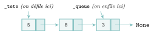

# TP et projets

<p class="sous-titre">Structures linéaires : piles, files, listes chaînées</p>

## <span class="etiquette">TP</span> Piles et files au travail

*deux implémentations, quatre applications*

<p class="infos-activite">Durée : 3 h environ (deux séances) · Sur machine, seul ou par deux</p>

!!! fichiers "Fichiers à télécharger"

    [:material-folder-open: dossier en ligne](https://github.com/MathThibaud/nsi-fichiers-eleves/tree/main/terminale/03-tp-structures-lineaires){ .md-button } [:material-zip-box: archive .zip](https://github.com/MathThibaud/nsi-fichiers-eleves/raw/main/zips/terminale-03-tp-structures-lineaires.zip){ .md-button }

!!! encadre "But du TP"

    **Construire** soi-même une pile et une file à partir d’une **liste chaînée**, **mesurer** ce que l’on gagne, puis **mettre ces structures au service** de quatre programmes réels : un vérificateur de code et de pages HTML, une calculatrice qui respecte les priorités, les boutons « Annuler / Rétablir » d’un éditeur, et la simulation de la file d’attente d’un guichet. <span class="run" title="À programmer et tester sur machine">▶</span>  signale ce qui est à programmer et tester.

!!! consignes "Consignes"

    - Les parties 2 à 5 sont indépendantes une fois la partie 1 terminée.

    - Le fichier `tp_structures_lineaires_depart.py` est **à télécharger** (lien ci-dessus) : il contient les classes du cours, des fonctions toutes prêtes et, en fin de fichier, des **tests**. Relancer le fichier après chaque partie : chaque ligne `[A FAIRE]` doit devenir `[OK]`.

    - Dans les parties 2 à 5, on n’utilise **que l’interface** des piles et des files (`empiler`, `depiler`, `sommet`, `enfiler`, `defiler`, `est_vide`, `taille`).

    - Usage de l’IA, indiqué sur chaque exercice : <span class="ia ia-rouge" title="Sans IA : le but est l'automatisme lui-même"></span> aucune ; <span class="ia ia-orange" title="IA en appui : déboguer, reformuler, vérifier ; la réponse finale est la vôtre"></span> en appui (déboguer, reformuler, vérifier ; la réponse finale est écrite et comprise par vous) ; <span class="ia ia-vert" title="IA intégrée : l'exercice s'appuie sur une réponse d'IA"></span> l’exercice s’appuie sur une réponse d’IA. Voir la [charte d’usage de l’IA](../charte.md).

## Deux implémentations pour une même interface

Le cours a donné une pile et une file qui cachent une `list` Python (classes `PileListe` et `FileListe` du fichier fourni) et a signalé que `pop(0)` rendait la file lente. On construit ici l’autre implémentation, avec la classe `Cellule` du cours.

### <span class="stars" title="Niveau 1 sur 3">★</span> <span class="exo-num">Exercice 1</span> — Une pile chaînée <span class="ia ia-orange" title="IA en appui : déboguer, reformuler, vérifier ; la réponse finale est la vôtre"></span> { #ex-03-structures-lineaires-piles-files-listes-tp-1-1 }

Dans `PileChainee`, l’attribut `_tete` désigne la cellule du **sommet** (ou `None` si la pile est vide) et `_taille` le nombre d’éléments.

{ .tikz loading=lazy }  
La pile obtenue après `empiler(5)`, `empiler(8)`, `empiler(3)`.

1.  Dessiner la pile après un `empiler(7)`, puis après un `depiler()`. Combien de liens faut-il modifier à chaque fois ? Ce nombre dépend-il de la taille de la pile ?

2.  <span class="run" title="À programmer et tester sur machine">▶</span> Compléter les cinq méthodes de `PileChainee`. `depiler` et `sommet` lèvent `IndexError("pile vide")` sur une pile vide (comme `PileListe`).

    ??? pouce "Coup de pouce"

        Empiler, c’est créer une cellule *devant* l’ancienne tête : `Cellule(x, self._tete)`. Dépiler, c’est mémoriser la valeur de la tête, puis avancer la tête d’une cellule. Ne pas oublier de tenir `_taille` à jour.

3.  <span class="run" title="À programmer et tester sur machine">▶</span> Vérifier que `tester_pile(PileListe)` et `tester_pile(PileChainee)` renvoient `"OK"`. Pourquoi la **même** fonction de test convient-elle aux deux classes ?

4.  <span class="run" title="À programmer et tester sur machine">▶</span> Ajouter une méthode `__repr__` pour que `print(p)` affiche `sommet -> [3, 8, 5]`.

??? corrige "Corrigé"

    Tout le code ci-dessous a été exécuté : avec ces solutions, les huit tests du fichier `tp_structures_lineaires_depart.py` affichent `[OK]`.

    **1.** `empiler(7)` crée une cellule `7` dont le lien pointe vers l’ancienne tête `3`, et `_tete` désigne désormais cette cellule : `7 → 3 → 8 → 5 → None`. `depiler()` renvoie `7` et ramène `_tete` sur `3`. Chaque opération modifie **un** lien (plus la création d’une cellule), quelle que soit la taille de la pile : coût constant.

    **2. et 4.**

    ```python
    class PileChainee:
        def __init__(self):
            self._tete = None
            self._taille = 0
        def est_vide(self):
            return self._tete is None
        def empiler(self, x):
            self._tete = Cellule(x, self._tete)      # nouvelle cellule devant
            self._taille = self._taille + 1
        def depiler(self):
            if self.est_vide():
                raise IndexError("pile vide")
            v = self._tete.valeur
            self._tete = self._tete.suivante         # la tete avance d'un cran
            self._taille = self._taille - 1
            return v
        def sommet(self):
            if self.est_vide():
                raise IndexError("pile vide")
            return self._tete.valeur
        def taille(self):
            return self._taille
        def __repr__(self):
            texte = ""
            c = self._tete
            while c is not None:                     # on parcourt depuis le sommet
                texte = texte + str(c.valeur)
                if c.suivante is not None:           # pas de virgule apres le dernier
                    texte = texte + ", "
                c = c.suivante
            return "sommet -> [" + texte + "]"
    ```

    **3.** Les deux appels renvoient `"OK"`. La fonction de test n’utilise que les méthodes de l’**interface** : toute classe qui les fournit avec le bon comportement passe le test, quelle que soit son implémentation.

### <span class="stars" title="Niveau 2 sur 3">★★</span> <span class="exo-num">Exercice 2</span> — Une file chaînée à deux entrées <span class="ia ia-orange" title="IA en appui : déboguer, reformuler, vérifier ; la réponse finale est la vôtre"></span> { #ex-03-structures-lineaires-piles-files-listes-tp-1-2 }

Pour une file, on retire en tête et l’on ajoute en queue. On garde donc **deux** attributs : `_tete` (la première cellule, celle qu’on défilera) et `_queue` (la dernière, derrière laquelle on enfile).

{ .tikz loading=lazy }

1.  Dessiner la file après `enfiler(1)`, puis après `defiler()`. Que se passerait-il, pour `enfiler`, si l’on n’avait *pas* l’attribut `_queue` ?

2.  Deux cas particuliers demandent de l’attention : enfiler dans une file **vide**, et défiler le **dernier** élément. Que doivent valoir `_tete` et `_queue` dans chacun de ces cas ?

3.  <span class="run" title="À programmer et tester sur machine">▶</span> Compléter `FileChainee` et vérifier `tester_file(FileChainee)`. Ce test enfile de nouveau après avoir vidé la file : quel oubli détecte-t-il ?

    ??? pouce "Coup de pouce"

        Enfiler : créer `c = Cellule(x, None)` ; si la file est vide, `c` devient la tête, sinon on l’accroche derrière l’ancienne queue (`self._queue.suivante = c`) ; dans les deux cas, `c` devient la queue. Défiler : si la tête devient `None`, la queue doit aussi redevenir `None`.

??? corrige "Corrigé"

    **1.** Après `enfiler(1)` : `5 → 8 → 3 → 1 → None`, `_queue` sur `1`. Après `defiler()` (qui renvoie `5`) : `_tete` sur `8`. Sans `_queue`, il faudrait parcourir toute la chaîne depuis la tête pour trouver la dernière cellule : `enfiler` coûterait $n$ opérations.

    **2.** Enfiler dans une file vide : la nouvelle cellule devient **à la fois** tête et queue. Défiler le dernier élément : `_tete` devient `None`, et `_queue` doit redevenir `None` elle aussi (sinon elle désigne une cellule qui n’est plus dans la file).

    **3.**

    ```python
    class FileChainee:
        def __init__(self):
            self._tete = None
            self._queue = None
            self._taille = 0
        def est_vide(self):
            return self._tete is None
        def enfiler(self, x):
            c = Cellule(x, None)
            if self.est_vide():
                self._tete = c
            else:
                self._queue.suivante = c      # on accroche derriere la queue
            self._queue = c
            self._taille = self._taille + 1
        def defiler(self):
            if self.est_vide():
                raise IndexError("file vide")
            v = self._tete.valeur
            self._tete = self._tete.suivante
            if self._tete is None:            # la file vient d'etre videe
                self._queue = None
            self._taille = self._taille - 1
            return v
        def tete(self):
            if self.est_vide():
                raise IndexError("file vide")
            return self._tete.valeur
        def taille(self):
            return self._taille
    ```

    Le test qui ré-enfile après avoir vidé la file vise une erreur fréquente : oublier de remettre `_queue` à `None` **et** tester `_queue` (au lieu de `_tete`) pour savoir si la file est vide dans `enfiler`. Le `9` est alors accroché derrière une cellule fantôme qui n’est plus dans la file, `_tete` reste `None`, et le `defiler` suivant lève `IndexError` : le test échoue.

### <span class="stars" title="Niveau 2 sur 3">★★</span> <span class="exo-num">Exercice 3</span> — Mesurer le gain <span class="ia ia-orange" title="IA en appui : déboguer, reformuler, vérifier ; la réponse finale est la vôtre"></span> { #ex-03-structures-lineaires-piles-files-listes-tp-1-3 }

La fonction fournie `chronometrer_file(Classe, n)` renvoie le temps (en secondes) mis pour enfiler puis défiler `n` entiers.

1.  <span class="run" title="À programmer et tester sur machine">▶</span> Recopier et compléter sur le cahier le tableau suivant (deux chiffres significatifs suffisent).

    | `n`               | $10\,000$ | $50\,000$ | $100\,000$ | $200\,000$ |
    |:------------------|:---------:|:---------:|:----------:|:----------:|
    | `FileListe` (s)   |           |           |            |            |
    | `FileChainee` (s) |           |           |            |            |

2.  Quand `n` double, par combien le temps est-il à peu près multiplié pour chaque classe ? Relier ces observations au coût d’un `defiler` dans chaque implémentation (voir le cours).

3.  Les programmes des parties suivantes n’ont pas besoin de savoir quelle implémentation est utilisée. Expliquer en une phrase pourquoi c’est un avantage.

??? corrige "Corrigé"

    **1.** Valeurs obtenues sur un ordinateur portable récent (elles varient d’une machine à l’autre, seul l’ordre de grandeur compte) :

    | `n`               | $10\,000$ | $50\,000$ | $100\,000$ | $200\,000$ |
    |:------------------|:---------:|:---------:|:----------:|:----------:|
    | `FileListe` (s)   | $0{,}013$ | $0{,}29$  |  $1{,}1$   |  $4{,}5$   |
    | `FileChainee` (s) | $0{,}011$ | $0{,}057$ |  $0{,}12$  |  $0{,}24$  |

    **2.** Quand `n` double, le temps de `FileChainee` **double** (coût linéaire : chaque opération est en temps constant) alors que celui de `FileListe` est multiplié par environ **4** (coût quadratique) : chacun des $n$ `defiler` fait un `pop(0)` qui décale tous les éléments restants.

    **3.** On peut changer d’implémentation (pour gagner en vitesse, par exemple) sans réécrire ni même relire les programmes qui utilisent la structure : il suffit que l’interface soit respectée.

## Un vérificateur pour de vrais programmes

Le cours vérifie le parenthésage d’une expression courte et répond seulement « correct » ou « incorrect ». Un éditeur de code fait mieux : il travaille sur un **programme entier** et **indique où** est l’erreur.

### <span class="stars" title="Niveau 2 sur 3">★★</span> <span class="exo-num">Exercice 4</span> — Localiser l’erreur dans un programme Python <span class="ia ia-orange" title="IA en appui : déboguer, reformuler, vérifier ; la réponse finale est la vôtre"></span> { #ex-03-structures-lineaires-piles-files-listes-tp-1-4 }

On veut écrire `verifier_code(code)` qui renvoie `None` si les `()`, `[]` et `{}` du programme `code` (une chaîne pouvant contenir des `"\n"`) sont bien appariés, et sinon **un message** parmi les trois formes suivantes :

```text
ligne 1, colonne 26 : ')' ferme '[' ouvert ligne 1, colonne 21
ligne 1, colonne 5 : '(' jamais ferme
ligne 1, colonne 6 : ')' ne ferme rien
```

Deux difficultés nouvelles : un symbole écrit **dans une chaîne** (`print("(")`) ou **dans un commentaire** (`# voir (2)`) ne compte pas ; et, pour signaler où se trouve un symbole ouvrant jamais refermé, il faut se souvenir de **sa** position.

1.  Que faut-il empiler, au lieu du seul symbole ouvrant, pour pouvoir écrire ces messages ? Proposer un **tuple**.

2.  On parcourt le code caractère par caractère en tenant à jour `ligne` et `colonne`, ainsi que deux indicateurs : `dans_chaine` (vaut `None`, ou le guillemet `"` ou `’` qui a ouvert la chaîne en cours) et `dans_commentaire` (booléen). À quel caractère chacun de ces deux indicateurs se « remet-il à zéro » ?

3.  <span class="run" title="À programmer et tester sur machine">▶</span> Écrire `verifier_code`. Les tests de la partie 2 du fichier fourni doivent passer. Essayer aussi la fonction sur un de vos propres programmes, puis après y avoir supprimé une parenthèse.

??? corrige "Corrigé"

    **1.** On empile le triplet `(symbole, ligne, colonne)` de chaque ouvrant.

    **2.** `dans_chaine` redevient `None` au guillemet **identique** à celui qui a ouvert la chaîne ; `dans_commentaire` redevient `False` au **retour à la ligne**.

    **3.**

    ```python
    def verifier_code(code):
        correspond = {')': '(', ']': '[', '}': '{'}
        p = PileChainee()
        ligne = 1
        colonne = 0
        dans_chaine = None
        dans_commentaire = False
        for c in code:
            colonne = colonne + 1
            if c == "\n":
                ligne = ligne + 1
                colonne = 0
                dans_commentaire = False
            elif dans_commentaire:
                pass
            elif dans_chaine is not None:
                if c == dans_chaine:
                    dans_chaine = None
            elif c == "#":
                dans_commentaire = True
            elif c in "\"'":
                dans_chaine = c
            elif c in "([{":
                p.empiler((c, ligne, colonne))
            elif c in correspond:
                if p.est_vide():
                    return f"ligne {ligne}, colonne {colonne} : '{c}' ne ferme rien"
                o, lo, co = p.depiler()
                if o != correspond[c]:
                    return (f"ligne {ligne}, colonne {colonne} : '{c}' ferme '{o}'"
                            f" ouvert ligne {lo}, colonne {co}")
        if not p.est_vide():
            o, lo, co = p.depiler()
            return f"ligne {lo}, colonne {co} : '{o}' jamais ferme"
        return None
    ```

    Sur `’d = {"a": [1, 2],\n     "b": (3, 4]}’` (la ligne 2 commence par **cinq espaces**), la fonction renvoie `ligne 2, colonne 16 : ’]’ ferme ’(’ ouvert ligne 2, colonne 11`. *Limite assumée :* les chaînes triples `"""..."""` et les guillemets échappés `\"` ne sont pas gérés.

### <span class="stars" title="Niveau 3 sur 3">★★★</span> <span class="exo-num">Exercice 5</span> — Défi — une vraie page HTML <span class="ia ia-orange" title="IA en appui : déboguer, reformuler, vérifier ; la réponse finale est la vôtre"></span> { #ex-03-structures-lineaires-piles-files-listes-tp-1-5 }

Une page Web réelle contient des balises avec **attributs** (`<h1 class="titre">`) et des balises **orphelines**, qui n’ont pas de fermante (`<br>`, ``…). La fonction fournie `extraire_balises(html)` s’occupe de ces détails : elle renvoie la liste des noms de balises dans l’ordre, une fermante étant précédée de `/`.

```text
>>> extraire_balises('<p class="a">Un <b>mot</b><br></p>')
['p', 'b', '/b', '/p']
```

<span class="run" title="À programmer et tester sur machine">▶</span> Écrire `verifier_html(html)` qui renvoie `True` si les balises de la page sont bien imbriquées, puis la tester sur une page HTML écrite en SNT ou téléchargée (affichage du code source dans le navigateur, puis copier-coller dans une chaîne `"""..."""`).

??? corrige "Corrigé"

    ```python
    def verifier_html(html):
        p = PileChainee()
        for b in extraire_balises(html):
            if b[0] == "/":                           # balise fermante
                if p.est_vide() or p.depiler() != b[1:]:
                    return False
            else:
                p.empiler(b)
        return p.est_vide()
    ```

    La page `’<p>Un <b>gras <i>italique</b></i></p>’` donne `False` (`</b>` arrive alors que `i` est au sommet) ; la page `’<ul><li>un</li><li>deux</ul>’` aussi (`li` jamais fermé). Les navigateurs, eux, *tolèrent* ces erreurs et réparent la page comme ils peuvent.

## Une calculatrice qui respecte les priorités

En notation polonaise inverse (NPI), on écrit l’opérateur *après* ses deux opérandes : `"3 4 2 * +"` signifie $3 + 4\times 2$. L’évaluation se fait avec une pile de nombres (feuille d’exercices). On construit ici la calculatrice complète : on **traduit** d’abord l’expression usuelle en NPI, puis on l’**évalue**.

### <span class="stars" title="Niveau 2 sur 3">★★</span> <span class="exo-num">Exercice 6</span> — Une évaluation qui ne plante pas <span class="ia ia-orange" title="IA en appui : déboguer, reformuler, vérifier ; la réponse finale est la vôtre"></span> { #ex-03-structures-lineaires-piles-files-listes-tp-1-6 }

<span class="run" title="À programmer et tester sur machine">▶</span> Écrire `evaluer_npi(expr)` pour les quatre opérations (on utilisera la fonction fournie `calculer(a, op, b)` ; les nombres sont convertis avec `float`). L’expression peut être **mal formée** : la fonction lève alors `ValueError` avec un message explicite, au lieu de planter sur une pile vide.

??? pouce "Coup de pouce"

    Avant de dépiler les deux opérandes d’un opérateur, vérifier `p.taille()`. À la fin, une expression correcte laisse exactement **un** nombre dans la pile. Le premier nombre dépilé est l’opérande de **droite**.

```text
>>> evaluer_npi("10 4 /")
2.5
>>> evaluer_npi("3 +")
ValueError: il manque un operande pour '+'
>>> evaluer_npi("3 4 5 +")
ValueError: expression incomplete : il reste 2 nombres
```

??? corrige "Corrigé"

    ```python
    def evaluer_npi(expr):
        p = PileChainee()
        for jeton in expr.split():
            if jeton in PRIORITE:                       # un operateur
                if p.taille() < 2:
                    raise ValueError(f"il manque un operande pour '{jeton}'")
                b = p.depiler()                         # operande de droite
                a = p.depiler()                         # operande de gauche
                p.empiler(calculer(a, jeton, b))
            else:
                p.empiler(float(jeton))
        if p.taille() != 1:
            raise ValueError("expression incomplete : il reste "
                             + str(p.taille()) + " nombres")
        return p.depiler()
    ```

    `"10 4 /"` donne `2.5` ; `"1 0 /"` lève `ZeroDivisionError` (levée par `calculer`).

### <span class="stars" title="Niveau 3 sur 3">★★★</span> <span class="exo-num">Exercice 7</span> — De l’écriture usuelle à la NPI <span class="ia ia-orange" title="IA en appui : déboguer, reformuler, vérifier ; la réponse finale est la vôtre"></span> { #ex-03-structures-lineaires-piles-files-listes-tp-1-7 }

Pour traduire une expression usuelle (dite *infixe*), on la lit de gauche à droite, jeton par jeton (la fonction fournie `decouper` produit la liste des jetons), avec une **liste de sortie** et une **pile d’opérateurs** :

- un **nombre** va directement dans la sortie ;

- une parenthèse `(` est empilée ;

- une parenthèse `)` : on dépile les opérateurs vers la sortie jusqu’à trouver la `(`, que l’on dépile et que l’on jette ;

- un **opérateur** `op` : tant que le sommet de la pile est un opérateur de priorité **supérieure ou égale** à celle de `op` (`*` et `/` valent $2$, `+` et `-` valent $1$, dictionnaire `PRIORITE`), on le dépile vers la sortie ; puis on empile `op` ;

- à la fin, on vide la pile dans la sortie.

1.  À la main, recopier et compléter sur le cahier la trace pour `2 * (3 + 4) - 5` :

    | **Jeton** | **Pile d’opérateurs écrite en ligne (sommet à droite)** | **Sortie** |
    |:--:|:---|:---|
    | `2` | (vide) | `2` |
    | `*` | `*` | `2` |
    | `(` |  |  |
    | `3` |  |  |
    | `+` |  |  |
    | `4` |  |  |
    | `)` |  |  |
    | `-` |  |  |
    | `5` |  |  |
    | fin |  |  |

2.  Pourquoi la règle dit-elle « supérieure **ou égale** » ? Comparer la traduction de `10 - 4 - 3` avec cette règle et avec une règle « strictement supérieure », et évaluer les deux résultats.

3.  <span class="run" title="À programmer et tester sur machine">▶</span> Écrire `infixe_vers_npi(expr)` qui renvoie la chaîne NPI (jetons séparés par des espaces). La fonction `calculatrice` fournie enchaîne alors traduction et évaluation : vérifier que `calculatrice("12*(3+4)-(5+5)*2")` vaut bien $64$.

!!! remarque "Remarque"

    Cette méthode, publiée par Edsger Dijkstra en 1961, est surnommée « algorithme de la gare de triage » : les opérateurs patientent sur une voie de garage (la pile) avant de rejoindre le train de sortie. Les calculatrices et les compilateurs utilisent toujours cette idée.

??? corrige "Corrigé"

    **1.**

    | **Jeton** | **Pile écrite en ligne (sommet à droite)** | **Sortie**      |
    |:---------:|:-------------------------------------------|:----------------|
    |    `2`    | (vide)                                     | `2`             |
    |    `*`    | `*`                                        | `2`             |
    |    `(`    | `* (`                                      | `2`             |
    |    `3`    | `* (`                                      | `2 3`           |
    |    `+`    | `* ( +`                                    | `2 3`           |
    |    `4`    | `* ( +`                                    | `2 3 4`         |
    |    `)`    | `*`                                        | `2 3 4 +`       |
    |    `-`    | `-` (`*` dépilé : priorité $2 \ge 1$)      | `2 3 4 + *`     |
    |    `5`    | `-`                                        | `2 3 4 + * 5`   |
    |    fin    | (vide)                                     | `2 3 4 + * 5 -` |

    L’évaluation de `2 3 4 + * 5 -` donne $9$, comme $2\times(3+4)-5$.

    **2.** Avec « supérieure ou égale », `10 - 4 - 3` devient `10 4 - 3 -`, qui vaut $(10-4)-3 = 3$ : c’est le bon résultat, car les opérations de même priorité se font de **gauche à droite**. Avec « strictement supérieure », le premier `-` resterait dans la pile : on obtiendrait `10 4 3 - -`, soit $10-(4-3) = 9$, ce qui est faux.

    **3.**

    ```python
    def infixe_vers_npi(expr):
        sortie = []
        ops = PileChainee()
        for j in decouper(expr):
            if j in PRIORITE:
                while (not ops.est_vide() and ops.sommet() != '('
                       and PRIORITE[ops.sommet()] >= PRIORITE[j]):
                    sortie.append(ops.depiler())
                ops.empiler(j)
            elif j == '(':
                ops.empiler(j)
            elif j == ')':
                while ops.sommet() != '(':
                    sortie.append(ops.depiler())
                ops.depiler()                  # on jette la '('
            else:
                sortie.append(j)               # un nombre
        while not ops.est_vide():
            sortie.append(ops.depiler())
        texte = ""                             # on recolle les jetons
        for i in range(len(sortie)):
            if i > 0:
                texte = texte + " "            # un espace entre deux jetons
            texte = texte + sortie[i]
        return texte
    ```

    `"12*(3+4)-(5+5)*2"` se traduit en `12 3 4 + * 5 5 + 2 * -` et vaut `64.0`. Le résultat a été comparé à celui de Python sur six expressions.

## Les boutons « Annuler » et « Rétablir »

### <span class="stars" title="Niveau 2 sur 3">★★</span> <span class="exo-num">Exercice 8</span> — Un mini-éditeur <span class="ia ia-orange" title="IA en appui : déboguer, reformuler, vérifier ; la réponse finale est la vôtre"></span> { #ex-03-structures-lineaires-piles-files-listes-tp-1-8 }

La classe `Editeur` possède un attribut `texte` et **deux piles** : `_annuler` contient les états précédents du texte, `_retablir` les états qui viennent d’être annulés.

- `ecrire(s)` ajoute `s` à la fin du texte ; `effacer(k)` supprime les `k` derniers caractères ;

- avant chacune de ces deux actions, l’état courant est empilé dans `_annuler`, et la pile `_retablir` est **vidée** ;

- `annuler()` revient à l’état précédent ; `retablir()` refait ce qui vient d’être annulé ; ni l’une ni l’autre ne fait quoi que ce soit si sa pile est vide.

1.  Avant de coder : dans `annuler()`, l’état courant ne disparaît pas, il est rangé quelque part. Où ? Même question pour `retablir()`.

2.  <span class="run" title="À programmer et tester sur machine">▶</span> Compléter la classe et faire passer les tests de la partie 4.

3.  Pourquoi faut-il vider `_retablir` lors d’une nouvelle action ? Donner un exemple de texte absurde obtenu si on l’oublie.

4.  On sauvegarde ici le texte **entier** à chaque action. Pour un document de $100\,000$ caractères modifié $1\,000$ fois, combien de caractères les piles contiennent-elles environ ? Proposer une autre chose à empiler pour économiser la mémoire.

??? corrige "Corrigé"

    **1.** `annuler()` range l’état courant dans `_retablir` (pour pouvoir le refaire) ; `retablir()` le range dans `_annuler` (pour pouvoir l’annuler de nouveau).

    **2.**

    ```python
    class Editeur:
        def __init__(self):
            self.texte = ""
            self._annuler = PileChainee()
            self._retablir = PileChainee()

        def _sauver(self):
            self._annuler.empiler(self.texte)
            self._retablir = PileChainee()     # une nouvelle action efface l'avenir

        def ecrire(self, s):
            self._sauver()
            self.texte = self.texte + s

        def effacer(self, k):
            self._sauver()
            self.texte = self.texte[:max(0, len(self.texte) - k)]

        def annuler(self):
            if not self._annuler.est_vide():
                self._retablir.empiler(self.texte)
                self.texte = self._annuler.depiler()

        def retablir(self):
            if not self._retablir.est_vide():
                self._annuler.empiler(self.texte)
                self.texte = self._retablir.depiler()
    ```

    (Écrire `_sauver` une fois évite de dupliquer le code dans `ecrire` et `effacer` ; la méthode commence par `_` car elle ne fait pas partie de l’interface.)

    **3.** Sans vidage : on tape `Le chat dort bien`, on annule deux fois (`Le chat`), on tape ` mal` (`Le chat mal`), puis `retablir()` ressort l’état `Le chat dort`, qui n’a jamais suivi `Le chat mal` : l’« avenir » annulé n’a plus de sens après une nouvelle action.

    **4.** Environ $1\,000 \times 100\,000 = 10^8$ caractères, soit une centaine de mégaoctets. On peut empiler plutôt l’**action** et ce qu’il faut pour la défaire (par exemple `("ecrire", " mal")` ou `("effacer", "bien")`) : quelques caractères par action. C’est ce que font les vrais éditeurs.

## Simuler la file d’attente d’un guichet

Un guichet sert les clients dans leur ordre d’arrivée : c’est une **file**. On représente chaque client par un couple `(arrivée, durée)` en minutes. La simulation avance minute par minute ; à chaque minute `t` :

1.  les clients qui arrivent à la minute `t` sont enfilés ;

2.  si le guichet est libre (il se libère à la minute `libre_a`, et `libre_a <= t`) et que la file n’est pas vide, on défile un client : son attente vaut `t - arrivée`, et le guichet sera libre à `t + durée`.

La simulation s’arrête quand tous les clients sont arrivés **et** que la file est vide.

### <span class="stars" title="Niveau 1 sur 3">★</span> <span class="exo-num">Exercice 9</span> — À la main <span class="ia ia-orange" title="IA en appui : déboguer, reformuler, vérifier ; la réponse finale est la vôtre"></span> { #ex-03-structures-lineaires-piles-files-listes-tp-1-9 }

On utilise les dix clients de la liste `CLIENTS` du fichier fourni : `(0, 4), (1, 3), (2, 2), (3, 5), (5, 1), (6, 3), (6, 2), (9, 4), (12, 1), (13, 2)`. Recopier et compléter sur le cahier le tableau des cinq premiers clients, avec un seul guichet.

| **Client** | **Arrivée** | **Début du service** | **Attente** | **Fin du service** |
|:----------:|:-----------:|:--------------------:|:-----------:|:------------------:|
|     1      |      0      |          0           |      0      |         4          |
|     2      |      1      |                      |             |                    |
|     3      |      2      |                      |             |                    |
|     4      |      3      |                      |             |                    |
|     5      |      5      |                      |             |                    |

??? corrige "Corrigé"

    | **Client** | **Arrivée** | **Début** | **Attente** | **Fin** |
    |:----------:|:-----------:|:---------:|:-----------:|:-------:|
    |     1      |      0      |     0     |      0      |    4    |
    |     2      |      1      |     4     |      3      |    7    |
    |     3      |      2      |     7     |      5      |    9    |
    |     4      |      3      |     9     |      6      |   14    |
    |     5      |      5      |    14     |      9      |   15    |

    Pour les dix clients, les attentes sont $0, 3, 5, 6, 9, 9, 12, 11, 12, 12$ : moyenne $79/10 = 7{,}9$ minutes.

### <span class="stars" title="Niveau 2 sur 3">★★</span> <span class="exo-num">Exercice 10</span> — Programmer la simulation <span class="ia ia-orange" title="IA en appui : déboguer, reformuler, vérifier ; la réponse finale est la vôtre"></span> { #ex-03-structures-lineaires-piles-files-listes-tp-1-10 }

1.  <span class="run" title="À programmer et tester sur machine">▶</span> Écrire `simuler(clients)` pour **un** guichet ; elle renvoie le triplet `(attente moyenne, attente maximale, longueur maximale de la file)`. Vérifier qu’on obtient `(7.9, 12, 6)` sur `CLIENTS`, et que vos cinq premières attentes calculées à la main sont bien celles du programme.

2.  <span class="run" title="À programmer et tester sur machine">▶</span> Ajouter un paramètre `nb_guichets` (valeur par défaut `1`) : on garde **une seule file** commune, et une **liste** `libre_a` d’une case par guichet. Avec deux guichets, on doit obtenir `(0.9, 3, 2)`.

    ??? pouce "Coup de pouce"

        À chaque minute, après les arrivées, parcourir les guichets : chaque guichet libre prend le client en tête de file, s’il y en a un.

??? corrige "Corrigé"

    Version directement écrite pour plusieurs guichets (avec `nb_guichets = 1`, c’est la réponse à la question 1) :

    ```python
    def simuler(clients, nb_guichets=1):
        f = FileChainee()
        libre_a = [0] * nb_guichets        # minute ou chaque guichet se libere
        attentes = []
        i = 0                              # indice du prochain client a arriver
        t = 0
        file_max = 0
        while i < len(clients) or not f.est_vide():
            while i < len(clients) and clients[i][0] == t:     # a) arrivees
                f.enfiler(clients[i])
                i = i + 1
            for g in range(nb_guichets):                       # b) services
                if libre_a[g] <= t and not f.est_vide():
                    arrivee, duree = f.defiler()
                    attentes.append(t - arrivee)
                    libre_a[g] = t + duree
            file_max = max(file_max, f.taille())
            t = t + 1
        return sum(attentes) / len(attentes), max(attentes), file_max
    ```

    Résultats : `(7.9, 12, 6)` avec un guichet, `(0.9, 3, 2)` avec deux.

### <span class="stars" title="Niveau 2 sur 3">★★</span> <span class="exo-num">Exercice 11</span> — Quand la file explose <span class="ia ia-orange" title="IA en appui : déboguer, reformuler, vérifier ; la réponse finale est la vôtre"></span> { #ex-03-structures-lineaires-piles-files-listes-tp-1-11 }

La fonction fournie `generer_clients(n, proba, duree_max, graine)` fabrique `n` clients : à chaque minute, un client arrive avec la probabilité `proba`, et son service dure entre $1$ et `duree_max` minutes (en moyenne $3{,}5$ minutes pour `duree_max = 6`). La `graine` rend le tirage reproductible : avec la même graine, tout le monde obtient les mêmes clients.

1.  <span class="run" title="À programmer et tester sur machine">▶</span> Avec `n = 500`, `duree_max = 6` et `graine = 42`, recopier et compléter le tableau (attente moyenne arrondie au dixième).

    | `proba` | **Charge $=$ `proba` $\times 3{,}5$** | **Attente moy., 1 guichet** | **Attente moy., 2 guichets** |
    |:--:|:--:|:--:|:--:|
    | $0{,}20$ | $0{,}70$ |  |  |
    | $0{,}25$ |  |  |  |
    | $0{,}30$ |  |  |  |
    | $0{,}35$ |  |  |  |

2.  La **charge** est le nombre moyen de minutes de travail qui arrivent au guichet par minute. Que se passe-t-il pour l’attente quand la charge dépasse $1$ ? Expliquer pourquoi, sans calcul.

3.  *(Pour aller plus loin.)* <span class="run" title="À programmer et tester sur machine">▶</span> Tracer, avec `matplotlib`, l’attente moyenne en fonction de `proba` (de $0{,}05$ à $0{,}40$ par pas de $0{,}01$) pour un et deux guichets. Un responsable veut une attente moyenne inférieure à $5$ minutes avec un seul guichet : jusqu’à quelle fréquence d’arrivée peut-il tenir ?

??? corrige "Corrigé"

    **1.** Valeurs obtenues (graine `42`, identiques sur toutes les machines) :

    | `proba`  | **Charge** | **1 guichet** | **2 guichets** |
    |:--------:|:----------:|:-------------:|:--------------:|
    | $0{,}20$ |  $0{,}70$  |    $3{,}9$    |    $0{,}1$     |
    | $0{,}25$ | $0{,}875$  |    $8{,}6$    |    $0{,}2$     |
    | $0{,}30$ |  $1{,}05$  |   $48{,}8$    |    $0{,}3$     |
    | $0{,}35$ | $1{,}225$  |   $172{,}6$   |    $0{,}7$     |

    (Les attentes maximales correspondantes, avec un guichet, sont $22$, $40$, $85$ et $325$ minutes.)

    **2.** Au-delà d’une charge de $1$, il arrive en moyenne **plus de travail** par minute que le guichet ne peut en traiter : la file ne se vide jamais et s’allonge sans cesse, donc l’attente croît avec le nombre de clients au lieu de se stabiliser. Même en dessous de $1$, l’attente grimpe vite à l’approche de $1$ (le hasard crée des « paquets » d’arrivées que le guichet n’absorbe pas). Avec deux guichets, la charge par guichet est divisée par deux : l’attente reste minime.

    **3.** On construit la liste des valeurs de `proba`, puis, par compréhension, la liste des attentes moyennes correspondantes pour un et deux guichets.

    ```python
    import matplotlib.pyplot as plt
    probas = [k / 100 for k in range(5, 41)]
    un = [simuler(generer_clients(500, p, 6, 42), 1)[0] for p in probas]
    deux = [simuler(generer_clients(500, p, 6, 42), 2)[0] for p in probas]
    plt.plot(probas, un, label="1 guichet")
    plt.plot(probas, deux, label="2 guichets")
    plt.xlabel("probabilite d'arrivee par minute")
    plt.ylabel("attente moyenne (min)")
    plt.legend()
    plt.show()
    ```

    *Autre méthode :* une seule boucle qui remplit les trois listes au fur et à mesure (les clients ne sont alors générés qu’une fois par valeur de `proba`).

    ```python
    probas = []
    un = []
    deux = []
    for k in range(5, 41):
        p = k / 100
        probas.append(p)
        cl = generer_clients(500, p, 6, 42)
        un.append(simuler(cl, 1)[0])
        deux.append(simuler(cl, 2)[0])
    ```

    Avec un guichet, l’attente moyenne reste sous $5$ minutes jusqu’à `proba` $= 0{,}23$ ($4{,}9$ min) et passe à $7{,}3$ min pour $0{,}24$ : environ un client toutes les $4{,}3$ minutes au maximum.

## Bilan à rédiger

### <span class="exo-num">Exercice 12</span> — Ce que j’ai construit <span class="ia ia-orange" title="IA en appui : déboguer, reformuler, vérifier ; la réponse finale est la vôtre"></span> { #ex-03-structures-lineaires-piles-files-listes-tp-1-12 }

Rédiger, en une dizaine de lignes, un bilan qui répond aux questions suivantes.

1.  Dans chacune des quatre applications, quelle structure a-t-on utilisée (pile ou file) et pourquoi celle-ci plutôt que l’autre ? Répondre par une phrase par application, en utilisant les mots LIFO et FIFO.

2.  Citer une situation du TP où l’on a changé l’**implémentation** sans toucher au programme qui **utilise** la structure. Qu’est-ce que cela a changé, et qu’est-ce qui n’a pas changé ?

3.  Quelle partie a été la plus difficile ? Quel test (ou quelle trace à la main) vous a permis de trouver une erreur ?

??? corrige "Corrigé"

    Éléments attendus :

    - **Pile (LIFO)** pour le vérificateur (la dernière parenthèse ou balise ouverte est la première à fermer), pour la calculatrice (les deux derniers nombres calculés sont les opérandes ; les opérateurs en attente ressortent dans l’ordre inverse) et pour Annuler / Rétablir (on annule d’abord la dernière action). **File (FIFO)** pour le guichet (premier arrivé, premier servi).

    - Partie 1 : `FileListe` remplacée par `FileChainee` ; la vitesse change (coût linéaire au lieu de quadratique), les résultats et le code utilisateur ne changent pas. De même, toutes les applications fonctionnent avec `PileListe` à la place de `PileChainee`.

    - Réponse personnelle ; par exemple un test précis ou une trace (tableau de la gare de triage, tableau du guichet).
