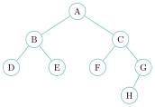
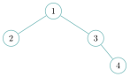
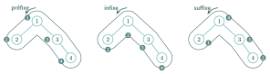
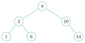

# Cours

<p class="sous-titre">Arbres</p>

<span id="chap-04" class="ancre"></span>

|  |  |
|:---|:---|
| **Programme (BO)** | *« Structures arborescentes : arbres, arbres binaires. Identifier des situations où une structure arborescente s’impose. Vocabulaire (racine, nœud, feuille, sous-arbre, taille, hauteur…). Évaluer la taille et la hauteur d’un arbre. Arbres binaires de recherche. Parcours d’un arbre. »* |
| **Prérequis** | la **récursivité** (indispensable ici !), les classes et objets (chapitre *Programmation objet*), les piles et les files, la recherche par dichotomie. |
| **Objectifs** | *reconnaître* une situation qui appelle un arbre ; *maîtriser* le vocabulaire ; *calculer* taille et hauteur ; *implémenter* un arbre binaire (de plusieurs façons) et le *parcourir* ; *comprendre* l’arbre binaire de recherche. |

## Pourquoi un arbre ? Des situations où rien d’autre ne convient

Depuis le début de l’année, vos structures étaient **linéaires** : listes, piles, files rangent les données « en ligne », les unes derrière les autres. Or beaucoup d’informations sont naturellement **hiérarchiques** : elles se ramifient. Une liste ne sait pas exprimer cela.

!!! exemple "Exemple — Quatre situations où l’arbre s’impose"

    - **L’arborescence des fichiers.** Un dossier contient des fichiers *et* d’autres dossiers, qui contiennent à leur tour… Impossible de représenter fidèlement cette imbrication avec une simple liste de noms : on perdrait « qui est dans qui ».

    - **Un arbre de décision** (diagnostic médical, identification d’une plante, un « akinator ») : chaque question mène, selon la réponse, à une nouvelle question ou à une conclusion. La ramification *est* le raisonnement.

    - **La recherche rapide** dans une grande collection triée : un *arbre binaire de recherche* (fin de ce cours) retrouve une valeur en un nombre d’étapes proportionnel à sa **hauteur**, pas à sa taille — c’est l’idée de la dichotomie, structurée. Les **bases de données** indexent ainsi des millions de lignes.

    - **La compression** (codage de Huffman), l’**évaluation d’expressions** par un compilateur, la structure d’une **page web** (le DOM), un **arbre de jeu** aux échecs… : partout où il y a une hiérarchie ou un choix qui se ramifie, il y a un arbre.

!!! remarque "Remarque"

    Le point commun ? Une **relation de descendance** : un élément en « commande » plusieurs autres, qui en commandent d’autres. C’est ce qu’une structure linéaire ne peut pas capturer, et ce qu’un arbre exprime naturellement.

## Vocabulaire : de la racine aux feuilles

Voici un arbre. On le dessine, par tradition informatique, **la racine en haut** et les feuilles en bas.

{ .tikz loading=lazy }

!!! definition "Définition 1 — Le vocabulaire de l’arbre"

    - chaque élément est un **nœud** (ici `A`, `B`, …, `H`) ;

    - le nœud du sommet, sans père, est la **racine** (`A`) ;

    - `B` et `C` sont les **fils** de `A` ; `A` est leur **père** ;

    - un nœud sans fils est une **feuille** (`D`, `E`, `F`, `H`) ;

    - le lien entre deux nœuds est une **arête** (ou *branche*) ;

    - tout nœud est la racine d’un **sous-arbre** (celui de `C` contient `C`, `F`, `G`, `H`).

!!! definition "Définition 2 — Arbre binaire"

    Un arbre est **binaire** si chaque nœud possède **au plus deux** fils, appelés **fils gauche** et **fils droit** (l’un des deux, ou les deux, peuvent manquer). L’arbre ci-dessus est binaire. Dans la suite, sauf mention contraire, « arbre » signifiera « arbre binaire ».

!!! remarque "Remarque — Un arbre, c’est récursif"

    Regardez bien : **un arbre est soit vide, soit un nœud (la racine) muni de deux sous-arbres** (gauche et droit), qui sont eux-mêmes des arbres… On retrouve la structure du chapitre *Récursivité* : un cas de base (l’arbre vide) et un cas qui se ramène à des cas plus petits. C’est pourquoi **presque tous les algorithmes sur les arbres seront récursifs**.

<span id="cours-04-1" class="ancre"></span>

<span class="afaire">▶ Exercices d'application :</span> exercice **[1](exercices.md#ex-04-1)** (vocabulaire).

## Mesurer un arbre : taille, profondeur, hauteur

!!! definition "Définition 3 — Taille"

    La **taille** d’un arbre est son **nombre de nœuds**. L’arbre ci-dessus a pour taille $8$. L’arbre vide a pour taille $0$.

!!! definition "Définition 4 — Profondeur d’un nœud"

    La **profondeur** d’un nœud est le nombre d’**arêtes** du chemin qui va de la racine jusqu’à lui. La racine est à la profondeur $0$, ses fils à $1$, etc. (Dans notre exemple, `H` est à la profondeur $3$.) C’est la convention de Knuth (le « niveau » d’un nœud) et celle des sujets de bac ; on rencontre parfois l’autre, qui compte les nœuds (racine à la profondeur $1$) : **suivez l’énoncé**.

!!! definition "Définition 5 — Hauteur"

    La **hauteur** d’un arbre est le **nombre de nœuds** du plus long chemin de la racine à une feuille — autrement dit la profondeur maximale de ses nœuds, **plus 1**. Dans notre exemple, le chemin `A--C--G--H` donne une hauteur de $4$.

!!! regle "Règle 1 — Attention : deux conventions pour la hauteur !"

    Faut-il compter les **nœuds** ou les **arêtes** du chemin ? Les deux conventions existent :

    - en comptant les **nœuds**, un arbre réduit à sa seule racine a une hauteur de **1** (et l’arbre vide, $0$) ;

    - en comptant les **arêtes**, le même arbre a une hauteur de **0** (et l’arbre vide, par convention, $-1$).

    Aucune n’est « la bonne » : il faut juste **préciser laquelle on utilise**. **Au bac, l’énoncé le dit toujours.** Dans ce cours, nous comptons les **nœuds** (racine seule $\to$ hauteur $1$, arbre vide $\to$ hauteur $0$) : c’est la définition de **Donald Knuth** (*The Art of Computer Programming*, vol. 3), pour qui la hauteur est la longueur du plus long chemin de la racine jusqu’à un sous-arbre **vide**. Si un énoncé adopte l’autre convention, **adaptez-vous** : toutes les hauteurs diminuent de $1$ (l’exemple ci-dessus aurait une hauteur de $3$).

!!! remarque "Remarque — Comme les étages d’un immeuble"

    Cette querelle vous rappellera quelque chose. En France, on entre au **rez-de-chaussée** (l’étage « $0$ »), et le premier étage est *au-dessus* : on compte les **volées d’escalier** (les arêtes). Aux États-Unis, le rez-de-chaussée *est* le « *first floor* » : on compte les **niveaux** (les nœuds). Bref, le même bâtiment a « deux hauteurs » selon le pays — exactement comme nos arbres. Un Américain et un Français se donnent rendez-vous « au premier étage » : l’un attend l’autre un étage plus bas. Précisez toujours votre convention !

!!! remarque "Remarque"

    Un arbre binaire de $n$ nœuds a une hauteur comprise entre environ $\log_2(n)$ (arbre bien « équilibré ») et $n$ (arbre « filiforme », dégénéré en une sorte de liste). Cette hauteur gouverne la rapidité des recherches : plus l’arbre est équilibré, plus il est efficace.

## Implémenter un arbre binaire (de plusieurs façons)

Python ne fournit pas d’arbre « tout prêt » : on l’implémente. Comme pour les piles et les files, une **même structure** admet **plusieurs implémentations** — et les sujets de bac en utilisent plusieurs. En voici deux, sur le même petit arbre :

{ .tikz loading=lazy }

### Par une classe (programmation objet)

C’est l’implémentation de référence : un **nœud** est un objet qui connaît sa **valeur** et ses deux sous-arbres. L’arbre vide est représenté par `None`.

```python
class Noeud:
    def __init__(self, valeur, gauche=None, droite=None):
        self.valeur = valeur
        self.gauche = gauche      # un Noeud, ou None (sous-arbre vide)
        self.droite = droite      # un Noeud, ou None

# l'arbre ci-dessus :
a = Noeud(1, Noeud(2), Noeud(3, None, Noeud(4)))
```

!!! remarque "Remarque"

    C’est exactement l’idée annoncée dans le chapitre *Programmation objet* : « une classe `Noeud` avec un sous-arbre gauche et un sous-arbre droit ». Une **feuille** est simplement un `Noeud` dont les deux fils valent `None`.

### Par un tuple (ou une liste) imbriqué

Plus léger, sans POO : un arbre est un **triplet** `(valeur, sous-arbre gauche, sous-arbre droit)`, et l’arbre vide est `None`.

```python
# (valeur, gauche, droite) ; None pour un sous-arbre vide
a = (1, (2, None, None), (3, None, (4, None, None)))
```

!!! remarque "Remarque"

    On accède alors à la valeur par `a[0]`, au fils gauche par `a[1]`, au fils droit par `a[2]`. Certains sujets préfèrent une *liste* `[valeur, gauche, droite]`, ou encore un **dictionnaire**. Peu importe : ce qui compte, c’est de savoir **où sont la valeur et les deux sous-arbres**. Nous prendrons l’implémentation par **classe** pour la suite.

<span id="cours-04-2" class="ancre"></span>

<span class="afaire">▶ Exercices d'application :</span> exercice **[2](exercices.md#ex-04-2)** (construire un arbre à partir d’une description).

## Parcourir un arbre

**Parcourir** un arbre, c’est visiter tous ses nœuds une fois chacun. Comme un arbre est récursif, un parcours l’est aussi : on traite la racine, et on parcourt (récursivement) les deux sous-arbres. Toute la question est : **dans quel ordre** ?

### Les parcours en profondeur

On plonge dans un sous-arbre avant d’explorer l’autre. Selon le moment où l’on « visite » la racine, on distingue trois parcours.

| **Parcours** | **Ordre** | **Utile pour…** |
|:---|:---|:---|
| **préfixe** | racine, puis gauche, puis droite | copier/recréer l’arbre |
| **infixe** | gauche, puis racine, puis droite | **trier** (dans un ABR, voir plus bas) |
| **suffixe** | gauche, puis droite, puis racine | évaluer, supprimer l’arbre |

```python
def prefixe(a):
    if a is not None:            # cas de base : un arbre vide, on ne fait rien
        print(a.valeur)          #  visiter la racine
        prefixe(a.gauche)        #  puis tout le sous-arbre gauche
        prefixe(a.droite)        #  puis tout le sous-arbre droit
```

Pour l’**infixe** et le **suffixe**, il suffit de **déplacer** la ligne `print` : au milieu (entre les deux appels) pour l’infixe, à la fin pour le suffixe.

!!! exemple "Exemple — Les trois parcours de notre arbre"

    Sur l’arbre `a = Noeud(1, Noeud(2), Noeud(3, None, Noeud(4)))` :

    - préfixe : `1, 2, 3, 4` (racine d’abord) ;

    - infixe : `2, 1, 3, 4` (la racine `1` apparaît après son sous-arbre gauche) ;

    - suffixe : `2, 4, 3, 1` (la racine `1` en dernier).

Une astuce pour retrouver ces trois ordres sans se tromper : on fait le **tour de l’arbre** en longeant son contour, en partant de la gauche de la racine. On note un nœud quand on passe à sa **gauche** (préfixe), **sous** lui (infixe) ou à sa **droite** (suffixe). Les numéros donnent l’ordre de visite :

{ .tikz loading=lazy }

### Le parcours en largeur

Ici, on visite l’arbre **niveau par niveau**, de gauche à droite (la racine, puis ses fils, puis les petits-fils…). Ce parcours n’est *pas* récursif : il s’appuie sur une **file** (voir le chapitre *Structures linéaires*). On enfile la racine, puis, tant que la file n’est pas vide, on défile un nœud, on le visite et on enfile ses fils.

```python
def largeur(a):
    if a is None:
        return
    f = File()                   # une file (interface enfiler/defiler/est_vide)
    f.enfiler(a)
    while not f.est_vide():
        n = f.defiler()
        print(n.valeur)          # visiter
        if n.gauche is not None:
            f.enfiler(n.gauche)
        if n.droite is not None:
            f.enfiler(n.droite)
```

!!! remarque "Remarque"

    Retenez le duo : parcours en **largeur** $\leftrightarrow$ **file** ; parcours en **profondeur** $\leftrightarrow$ récursivité (donc, en coulisses, une **pile**). Les deux structures du chapitre précédent resservent ici.

<span id="cours-04-6" class="ancre"></span>

<span class="afaire">▶ Exercices d'application :</span> exercices **[6](exercices.md#ex-04-6) à [8](exercices.md#ex-04-8)** (les quatre parcours, en profondeur et en largeur).

## Calculer sur un arbre : taille et hauteur

Les formules récursives découlent directement de la définition « racine $+$ deux sous-arbres ».

!!! propriete "Propriété 1 — Taille et hauteur, récursivement"

    Pour un arbre `a` de sous-arbres gauche `g` et droit `d`, on définit la **taille** par : $$\texttt{taille}(a) = \begin{cases} 0 & \text{si } a \text{ est vide,} \\ 1 + \texttt{taille}(g) + \texttt{taille}(d) & \text{sinon,} \end{cases}$$ et la **hauteur** par : $$\texttt{hauteur}(a) = \begin{cases} 0 & \text{si } a \text{ est vide,} \\ 1 + \max\big(\texttt{hauteur}(g),\, \texttt{hauteur}(d)\big) & \text{sinon.} \end{cases}$$

```python
def taille(a):
    if a is None:
        return 0
    return 1 + taille(a.gauche) + taille(a.droite)

def hauteur(a):
    if a is None:
        return 0
    return 1 + max(hauteur(a.gauche), hauteur(a.droite))
```

!!! remarque "Remarque — Et avec l’autre convention ?"

    Si l’énoncé compte les **arêtes**, seul le **cas de base** change : l’arbre vide a pour hauteur $-1$, donc `return -1` au lieu de `return 0`. Ainsi une feuille a bien une hauteur de $1 + \max(-1, -1) = 0$. Lisez toujours la définition donnée par le sujet avant d’écrire `hauteur`.

!!! remarque "Remarque"

    Chaque appel se ramène à des sous-arbres *strictement plus petits* : le cas de base (l’arbre vide) finit toujours par être atteint. La terminaison est garantie — comme pour toute belle récursion sur un arbre.

<span id="cours-04-3" class="ancre"></span>

<span class="afaire">▶ Exercices d'application :</span> exercices **[3](exercices.md#ex-04-3) à [5](exercices.md#ex-04-5)** (taille, hauteur et nombre de feuilles, en récursif).

## L’arbre binaire de recherche (ABR) : chercher vite

Un arbre quelconque ne facilite pas la recherche. Mais si l’on **range** les valeurs avec méthode, la recherche devient **très rapide**.

!!! definition "Définition 6 — Arbre binaire de recherche"

    Un **arbre binaire de recherche** (ABR) est un arbre binaire où, pour **chaque** nœud :

    - toutes les valeurs de son sous-arbre **gauche** sont **plus petites** que sa valeur ;

    - toutes les valeurs de son sous-arbre **droit** sont **plus grandes**.

{ .tikz loading=lazy }

!!! regle "Règle 2 — Chercher dans un ABR"

    Pour chercher une valeur `x`, on part de la racine et, à chaque nœud, on compare : si `x` est plus petit, on descend à **gauche** ; s’il est plus grand, à **droite** ; sinon, on l’a trouvé. À chaque étape, on **élimine tout un sous-arbre** : si l’arbre est **équilibré**, c’est environ la **moitié** de ce qui reste, comme dans la **recherche dichotomique** vue en Première, mais incarnée dans une structure de données (si l’arbre est très déséquilibré, on n’élimine presque rien à chaque étape).

```python
def recherche(a, x):
    if a is None:
        return False             # on est tombe sur un sous-arbre vide : absent
    if x == a.valeur:
        return True
    if x < a.valeur:
        return recherche(a.gauche, x)   # a gauche : les plus petits
    else:
        return recherche(a.droite, x)   # a droite : les plus grands
```

!!! remarque "Remarque"

    La recherche coûte au plus **la hauteur** de l’arbre. Pour un ABR équilibré de $n$ valeurs, cela fait environ $\log_2(n)$ comparaisons : chercher parmi un **million** de valeurs ne demande qu’une **vingtaine** d’étapes ! C’est cette efficacité qui fait des arbres le cœur des **index de bases de données**. Petit bonus : un **parcours infixe** d’un ABR affiche ses valeurs **déjà triées**.

<span id="cours-04-9" class="ancre"></span>

<span class="afaire">▶ Exercices d'application :</span> exercices **[9](exercices.md#ex-04-9) et [10](exercices.md#ex-04-10)** (insérer et rechercher dans un ABR).

## Ouverture et histoire

!!! remarque "Remarque — Un peu d’histoire… et de botanique"

    En informatique, l’arbre est le seul à **pousser la tête en bas** : racine en haut, feuilles en bas — un botaniste s’en évanouirait. La structure est ancienne : le mot « arbre » entre en mathématiques en **1857** avec le Britannique **Arthur Cayley**, qui s’en sert pour *compter* les molécules chimiques possibles (vues comme des arbres d’atomes). Mais l’**arbre binaire de recherche** est formalisé autour de **1960** par plusieurs chercheurs indépendamment (dont **P. F. Windley**, **A. D. Booth**, **T. N. Hibbard**). En **1952**, un étudiant du MIT, **David Huffman**, invente pour un devoir noté un codage par arbre qui reste, soixante-dix ans plus tard, au cœur des formats de compression (ZIP, JPEG…) : le plus rentable des devoirs maison. Enfin, les **B-arbres** (Bayer et McCreight, **1970**) organisent aujourd’hui les données de la quasi-totalité des bases de données et systèmes de fichiers de la planète.

\*(image manquante : 04_hist_cayley)\*  
Arthur Cayley (1821–1895), qui a donné son nom mathématique à l’arbre

\*(image manquante : 04_baia_figuier_renverse)\*

Et la nature s’y met aussi : à **Baïes** (Italie), un figuier sauvage pousse **la tête en bas** depuis la voûte d’une salle romaine, sa racine au plafond et ses branches feuillues vers le sol — un véritable arbre informatique !

!!! remarque "Remarque — La suite"

    Le chapitre *Graphes* généralisera l’arbre (un arbre est un graphe particulier, sans cycle). Et l’on retrouvera les parcours en **largeur** (file) et en **profondeur** (pile), déjà rencontrés ici.

!!! remarque "Remarque — Liens avec d’autres chapitres"

    Un arbre est une structure **récursive** : taille, hauteur et parcours s’écrivent naturellement par **récursivité**. On le parcourt en **largeur** avec une **file** et en **profondeur** avec une **pile** (chapitre « structures linéaires »). Un **arbre binaire de recherche** retrouve une valeur en coût **logarithmique**, exactement comme la **recherche dichotomique** vue en Première. Un arbre est enfin un cas particulier de **graphe**. On le programme avec une classe `Noeud` (**programmation objet**) ; on le retrouve dans l’**arbre des processus** (chapitre « processus ») et dans les **index** des bases de données.

## Bilan — la carte mémoire

| **Notion** | **À retenir** |
|:---|:---|
| Arbre | structure **hiérarchique** : une racine, des sous-arbres (récursif) |
| Nœud / racine / feuille | élément / nœud du sommet / nœud sans fils |
| Arbre binaire | chaque nœud a **au plus deux** fils (gauche, droit) |
| Taille | nombre de nœuds : $1 + \texttt{taille}(g) + \texttt{taille}(d)$ |
| Hauteur | plus long chemin racine$\to$feuille (préciser la **convention** !) |
| Implémentations | classe `Noeud`, ou triplet `(valeur, g, d)`… (vide $=$ `None`) |
| Parcours profondeur | préfixe / infixe / suffixe (récursifs) |
| Parcours largeur | niveau par niveau, avec une **file** |
| ABR | gauche $<$ nœud $<$ droite ; recherche en $\approx \log_2(n)$ |

## Erreurs fréquentes

- **Oublier le cas de l’arbre vide.** Toute fonction récursive sur un arbre commence par `if a is None:` … *Le réflexe :* l’arbre vide est le cas de base.

- **Confondre taille, hauteur et profondeur.** La **taille** compte les nœuds ; la **hauteur** est la plus longue descente. *Le réflexe :* fixer la **convention** de hauteur (arbre vide $=0$ ici) et s’y tenir.

- **Mélanger les parcours.** **préfixe** (racine avant), **infixe** (racine au milieu), **suffixe** (racine après) ; **largeur** $=$ niveau par niveau avec une **file**.

- **Chercher partout dans un ABR.** On exploite `gauche `$<$` nœud `$<$` droite` pour n’explorer **qu’un** côté ; sinon on perd tout l’intérêt.

- **Oublier de combiner / renvoyer** dans la récursion (comme en récursivité) : `return 1 + taille(g) + taille(d)`.

- **Croire qu’un ABR est toujours équilibré.** Le coût d’une recherche est la **hauteur** : $\log_2 n$ *si* l’arbre est équilibré, mais jusqu’à $n$ s’il est « en peigne ».

## Savoir-faire à maîtriser

*À la fin du chapitre, je sais…*

- employer le **vocabulaire** (racine, nœud, feuille, sous-arbre, taille, hauteur) $\to$ ex. [1](exercices.md#ex-04-1), [2](exercices.md#ex-04-2) ;

- calculer **taille**, **hauteur**, nombre de feuilles par une fonction **récursive** $\to$ ex. [3](exercices.md#ex-04-3), [4](exercices.md#ex-04-4), [5](exercices.md#ex-04-5) ;

- écrire et reconnaître les **quatre parcours** (préfixe, infixe, suffixe, largeur / file) $\to$ ex. [6](exercices.md#ex-04-6), [7](exercices.md#ex-04-7), [8](exercices.md#ex-04-8) ;

- manipuler un arbre via la classe `Noeud` ou une **interface** donnée $\to$ ex. [2](exercices.md#ex-04-2), [14](exercices.md#ex-04-14), [16](exercices.md#ex-04-16) ;

- **rechercher** et **insérer** dans un **ABR**, et relier infixe $\leftrightarrow$ tri $\to$ ex. [9](exercices.md#ex-04-9), [10](exercices.md#ex-04-10), [13](exercices.md#ex-04-13) ;

- justifier le **coût** d’une recherche dans un ABR (la hauteur) $\to$ ex. [10](exercices.md#ex-04-10), [13](exercices.md#ex-04-13).

## Vers le Grand Oral

Quelques pistes de questions que ce chapitre permet de préparer (à étayer d’un exemple concret) :

- **Pourquoi un arbre binaire de recherche accélère-t-il une recherche ?** *(hauteur $\approx \log_2 n$, même idée que la dichotomie ; la limite de l’arbre déséquilibré.)*

- **Récursivité et arbres : un mariage naturel ?** *(un arbre est défini récursivement ; presque tout algorithme sur les arbres l’est aussi.)*

- **À quoi servent les arbres dans la vraie vie ?** *(arborescence de fichiers, code de Huffman, index d’une base de données, DOM d’une page Web, arbre de décision.)*
