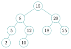
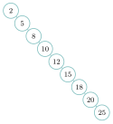
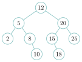
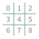
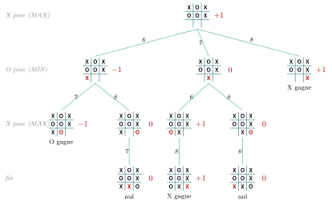
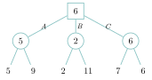
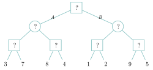
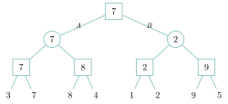
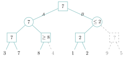

# TP et projets

<p class="sous-titre">Arbres</p>

## <span class="etiquette">TP 1</span> Un arbre binaire de recherche, de A à Z

*construire, chercher, mesurer, indexer*

<p class="infos-activite">Durée : 3 h environ (deux séances) · Sur machine, seul ou par deux</p>

!!! fichiers "Fichiers à télécharger"

    [:material-folder-open: dossier en ligne](https://github.com/MathThibaud/nsi-fichiers-eleves/tree/main/terminale/04-tp-arbres){ .md-button } [:material-zip-box: archive .zip](https://github.com/MathThibaud/nsi-fichiers-eleves/raw/main/zips/terminale-04-tp-arbres.zip){ .md-button }

!!! encadre "But du TP"

    Programmer une classe `ABR` complète (insertion, recherche, minimum et maximum, parcours infixe), puis **mesurer** ce que le cours affirme : un ABR rempli au hasard reste bas, un ABR rempli avec des valeurs triées devient un « peigne » aussi lent qu’une liste. On termine par une application : l’**index** des mots d’un texte, comme à la fin d’un livre. <span class="run" title="À programmer et tester sur machine">▶</span>  signale ce qui est à programmer et tester.

!!! consignes "Consignes"

    - Le fichier `tp_arbres_depart.py` est **à télécharger** (lien ci-dessus) : la classe `Noeud` et les fonctions `taille` et `hauteur` du cours, le squelette des classes et, en fin de fichier, des **tests**. Relancer le fichier après chaque partie : chaque ligne `[A FAIRE]` doit devenir `[OK]`.

    - **Convention** de hauteur du cours : on compte les nœuds (racine seule $\to$ hauteur $1$, arbre vide $\to$ $0$).

    - Usage de l’IA, indiqué sur chaque exercice : <span class="ia ia-rouge" title="Sans IA : le but est l'automatisme lui-même"></span> aucune ; <span class="ia ia-orange" title="IA en appui : déboguer, reformuler, vérifier ; la réponse finale est la vôtre"></span> en appui (déboguer, reformuler, vérifier ; la réponse finale est écrite et comprise par vous) ; <span class="ia ia-vert" title="IA intégrée : l'exercice s'appuie sur une réponse d'IA"></span> l’exercice s’appuie sur une réponse d’IA. Voir la [charte d’usage de l’IA](../charte.md).

## Construire un ABR

On enveloppe l’arbre dans une classe `ABR` : l’attribut privé `_racine` désigne le nœud racine (ou `None`), et `_taille` compte les valeurs. L’utilisateur ne manipule jamais les nœuds : il appelle `inserer`, `contient`, `infixe`… Les valeurs sont **sans doublon** : c’est une **variante** de la convention du cours (où une valeur égale est rangée à droite). Ici, comme dans un ensemble, insérer une valeur déjà présente ne fait rien.

### <span class="stars" title="Niveau 1 sur 3">★</span> <span class="exo-num">Exercice 1</span> — L’ordre d’insertion compte <span class="ia ia-orange" title="IA en appui : déboguer, reformuler, vérifier ; la réponse finale est la vôtre"></span> { #ex-04-arbres-tp-1-1 }

1.  Dessiner l’ABR obtenu en insérant, dans cet ordre, `15, 8, 20, 5, 12, 25, 10, 18, 2` dans un arbre vide. Donner sa taille et sa hauteur.

2.  Dessiner l’ABR obtenu en insérant les **mêmes** valeurs dans l’ordre croissant `2, 5, 8, 10, 12, 15, 18, 20, 25`. Taille ? Hauteur ? Pourquoi parle-t-on de « peigne » ?

3.  Proposer un ordre d’insertion de ces neuf valeurs qui donne un arbre de hauteur $4$ **différent** de celui de la question 1.

??? corrige "Corrigé"

    Tout le code ci-dessous a été exécuté : avec ces solutions, les six tests du fichier `tp_arbres_depart.py` affichent `[OK]`, et les mesures sont celles réellement obtenues.

    { .tikz loading=lazy }

    { .tikz loading=lazy }

    { .tikz loading=lazy }

    **1.** Arbre de gauche : taille $9$, hauteur $4$ (chemin `15--8--5--2` ou `15--8--12--10`).

    **2.** Arbre du milieu : chaque valeur est plus grande que toutes les précédentes, donc elle va toujours à droite. Taille $9$, hauteur **$9$** : chaque nœud n’a qu’un fils, l’arbre est une « dent de peigne », en fait une liste chaînée déguisée.

    **3.** Par exemple `12, 5, 20, 2, 8, 15, 25, 10, 18` (arbre de droite) : hauteur $4$. Un bon ordre commence par une valeur « médiane », puis les médianes de chaque moitié.

### <span class="stars" title="Niveau 2 sur 3">★★</span> <span class="exo-num">Exercice 2</span> — Insérer sans récursivité <span class="ia ia-orange" title="IA en appui : déboguer, reformuler, vérifier ; la réponse finale est la vôtre"></span> { #ex-04-arbres-tp-1-2 }

<span class="run" title="À programmer et tester sur machine">▶</span> Compléter la méthode `inserer(x)` avec une boucle `while` : si l’arbre est vide, le nouveau nœud devient la racine ; sinon, on descend depuis la racine, à gauche si `x` est plus petit que la valeur du nœud courant, à droite s’il est plus grand, jusqu’à trouver une place libre (`None`) où l’on accroche `Noeud(x)`. La méthode renvoie `True` si `x` a été ajouté, `False` s’il était déjà présent (l’arbre est alors inchangé). Penser à mettre `_taille` à jour.

??? pouce "Coup de pouce"

    Garder une variable `n` sur le nœud courant. À chaque tour : si `x == n.valeur`, renvoyer `False` ; si `x < n.valeur` et que `n.gauche` est `None`, on accroche le nouveau nœud à gauche ; sinon on descend `n = n.gauche`. Même chose à droite. Un booléen `place`, qui passe à `True` quand le nœud est accroché, sert de condition à la boucle : `while not place`.

```text
>>> a = ABR()
>>> for v in [15, 8, 20, 5, 12, 25, 10, 18, 2]:
...     a.inserer(v)
>>> a.taille(), a.hauteur()
(9, 4)
>>> a.inserer(12)
False
```

Le test vérifie aussi que `_taille` est égal à `taille(a._racine)`. Quel est l’intérêt de tenir à jour l’attribut `_taille` plutôt que d’appeler la fonction récursive `taille` à chaque fois ?

??? corrige "Corrigé"

    ```python
    class ABR:
        def __init__(self):
            self._racine = None
            self._taille = 0

        def inserer(self, x):
            nouveau = Noeud(x)
            if self._racine is None:
                self._racine = nouveau
                self._taille = 1
                return True
            n = self._racine
            place = False                      # le nouveau noeud est-il accroche ?
            while not place:
                if x == n.valeur:              # deja present : on ne fait rien
                    return False
                if x < n.valeur:
                    if n.gauche is None:
                        n.gauche = nouveau
                        place = True
                    else:
                        n = n.gauche
                else:
                    if n.droite is None:
                        n.droite = nouveau
                        place = True
                    else:
                        n = n.droite
            self._taille = self._taille + 1
            return True
    ```

    L’attribut `_taille` répond **immédiatement**, alors que la fonction `taille` parcourt tout l’arbre ($n$ appels) à chaque fois. En contrepartie, il faut le tenir à jour dans chaque méthode qui modifie l’arbre : c’est un **invariant** que le test vérifie.

## Chercher

### <span class="stars" title="Niveau 2 sur 3">★★</span> <span class="exo-num">Exercice 3</span> — Chercher en comptant ses pas <span class="ia ia-orange" title="IA en appui : déboguer, reformuler, vérifier ; la réponse finale est la vôtre"></span> { #ex-04-arbres-tp-1-3 }

1.  <span class="run" title="À programmer et tester sur machine">▶</span> Écrire la méthode `contient(x)`, **itérative**, qui renvoie le couple `(présent, visites)` : un booléen, et le nombre de nœuds visités pendant la recherche.

    ```text
    >>> a.contient(15), a.contient(10), a.contient(13)
    ((True, 1), (True, 4), (False, 3))
    ```

2.  Justifier, sur l’arbre de la question 1 de l’exercice 1, que `a.contient(13)` visite $3$ nœuds. Pourquoi le nombre de visites ne dépasse-t-il jamais la hauteur de l’arbre ?

??? corrige "Corrigé"

    **1.**

    ```python
        def contient(self, x):
            n = self._racine
            visites = 0
            while n is not None:
                visites = visites + 1
                if x == n.valeur:
                    return True, visites
                if x < n.valeur:
                    n = n.gauche
                else:
                    n = n.droite
            return False, visites
    ```

    **2.** Pour `13` : `15` (on va à gauche), `8` (à droite), `12` (à droite) : sous-arbre vide, absent, $3$ visites. Chaque visite descend d’un niveau, sur un unique chemin partant de la racine : on visite au plus autant de nœuds que le plus long chemin racine–feuille en contient, c’est-à-dire la hauteur.

### <span class="stars" title="Niveau 1 sur 3">★</span> <span class="exo-num">Exercice 4</span> — Le plus petit et le plus grand <span class="ia ia-orange" title="IA en appui : déboguer, reformuler, vérifier ; la réponse finale est la vôtre"></span> { #ex-04-arbres-tp-1-4 }

<span class="run" title="À programmer et tester sur machine">▶</span> Écrire `minimum()` et `maximum()`, qui lèvent `ValueError("arbre vide")` sur un arbre vide. Où se trouve la plus petite valeur d’un ABR ? Est-ce forcément une feuille ?

??? pouce "Coup de pouce"

    Depuis la racine, descendre toujours du même côté tant que c’est possible.

??? corrige "Corrigé"

    ```python
        def minimum(self):
            if self._racine is None:
                raise ValueError("arbre vide")
            n = self._racine
            while n.gauche is not None:
                n = n.gauche
            return n.valeur

        def maximum(self):
            if self._racine is None:
                raise ValueError("arbre vide")
            n = self._racine
            while n.droite is not None:
                n = n.droite
            return n.valeur
    ```

    Le minimum est le nœud le plus à gauche : il n’a pas de fils gauche, mais **pas forcément** une feuille (il peut avoir un fils droit, comme `2` dans l’arbre en peigne).

## Le parcours infixe trie

### <span class="stars" title="Niveau 2 sur 3">★★</span> <span class="exo-num">Exercice 5</span> — Infixe et tri par ABR <span class="ia ia-orange" title="IA en appui : déboguer, reformuler, vérifier ; la réponse finale est la vôtre"></span> { #ex-04-arbres-tp-1-5 }

1.  <span class="run" title="À programmer et tester sur machine">▶</span> Écrire la méthode `infixe()`, qui renvoie la **liste** des valeurs dans l’ordre du parcours infixe. On pourra définir, *à l’intérieur* de la méthode, une fonction récursive `parcours(n)` qui ajoute les valeurs du sous-arbre de racine `n` à une liste `res`.

    ??? pouce "Coup de pouce"

        `parcours(n)` : si `n` n’est pas `None`, parcourir le sous-arbre gauche, ajouter `n.valeur` à `res`, puis parcourir le sous-arbre droit. La méthode appelle `parcours(self._racine)` puis renvoie `res`.

2.  Sur l’arbre de l’exercice 1, que renvoie `infixe()` ? Expliquer, à l’aide de la définition d’un ABR, pourquoi le parcours infixe donne **toujours** les valeurs dans l’ordre croissant.

3.  <span class="run" title="À programmer et tester sur machine">▶</span> En déduire une fonction `tri_abr(tab)` de **trois lignes** (sans compter la ligne `def`) qui trie une liste. Que deviennent les doublons ?

    ```text
    >>> tri_abr([5, 3, 9, 3, 1, 7])
    [1, 3, 5, 7, 9]
    ```

4.  <span class="run" title="À programmer et tester sur machine">▶</span> Tester `tri_abr` sur $200$ listes aléatoires en comparant son résultat à `sorted(set(t))`.

??? corrige "Corrigé"

    **1. et 3.**

    ```python
        def infixe(self):
            res = []
            def parcours(n):
                if n is not None:
                    parcours(n.gauche)
                    res.append(n.valeur)
                    parcours(n.droite)
            parcours(self._racine)
            return res

    def tri_abr(tab):
        arbre = ABR()
        for x in tab:
            arbre.inserer(x)
        return arbre.infixe()
    ```

    *Autre méthode :* sans fonction intérieure, une fonction récursive qui **renvoie** la liste infixe d’un sous-arbre : celle de gauche, puis la racine, puis celle de droite, recollées par concaténation.

    ```python
    def infixe_noeud(n):
        if n is None:
            return []
        return infixe_noeud(n.gauche) + [n.valeur] + infixe_noeud(n.droite)

        def infixe(self):                      # dans la classe ABR
            return infixe_noeud(self._racine)
    ```

    **2.** `[2, 5, 8, 10, 12, 15, 18, 20, 25]`. En chaque nœud, le parcours infixe écrit d’abord tout le sous-arbre gauche (valeurs plus petites), puis le nœud, puis tout le sous-arbre droit (valeurs plus grandes) ; comme c’est vrai à tous les niveaux, la liste obtenue est croissante.

    **3.** Les doublons disparaissent, car `inserer` les refuse : `tri_abr` renvoie `sorted(set(tab))`.

    **4.** Les $200$ comparaisons avec `sorted(set(t))` sont toutes égales.

    ```python
    for essai in range(200):
        t = [random.randint(0, 50) for i in range(random.randint(0, 30))]
        assert tri_abr(t) == sorted(set(t))
    ```

## Mesurer la hauteur

Le cours affirme qu’un ABR de $n$ valeurs « bien rempli » a une hauteur proche de $\log_2(n)$, mais qu’un ABR déséquilibré peut atteindre une hauteur $n$. Vérifions-le.

### <span class="stars" title="Niveau 2 sur 3">★★</span> <span class="exo-num">Exercice 6</span> — Au hasard ou dans l’ordre <span class="ia ia-orange" title="IA en appui : déboguer, reformuler, vérifier ; la réponse finale est la vôtre"></span> { #ex-04-arbres-tp-1-6 }

1.  <span class="run" title="À programmer et tester sur machine">▶</span> Écrire `hauteur_triee(n)`, qui renvoie la hauteur de l’ABR obtenu en insérant `0, 1, …, n-1` dans l’ordre, et `hauteur_aleatoire(n, essais=20)`, qui renvoie la hauteur **moyenne** sur `essais` ABR obtenus en insérant ces mêmes entiers dans un ordre aléatoire (`random.shuffle`).

    ??? pouce "Coup de pouce"

        Pour `hauteur_aleatoire` : à chaque essai, construire `valeurs = [i for i in range(n)]`, la mélanger, l’insérer dans un nouvel `ABR`, puis ajouter sa hauteur à un total.

2.  <span class="run" title="À programmer et tester sur machine">▶</span> Recopier et compléter sur le cahier le tableau suivant (la hauteur triée pour $n = 10\,000$ se déduit sans calcul).

    | $n$                        |  $10$   | $100$ | $1\,000$ | $10\,000$ |
    |:---------------------------|:-------:|:-----:|:--------:|:---------:|
    | $\log_2(n)$ (`math.log2`)  | $3{,}3$ |       |          |           |
    | hauteur moyenne, au hasard |         |       |          |           |
    | hauteur, valeurs triées    |         |       |          |           |

3.  Que vaut à peu près le rapport entre la hauteur moyenne au hasard et $\log_2(n)$ ? Comment évolue la hauteur au hasard quand $n$ est multiplié par $10$ ?

4.  <span class="run" title="À programmer et tester sur machine">▶</span> Tracer les deux courbes avec `matplotlib`, ainsi que $\log_2(n)$, pour $n$ parmi `10, 20, 50, 100, 200, 500, 1000, 2000` (valeurs triées) et jusqu’à `10000` (au hasard). Les échelles logarithmiques (`plt.xscale("log")` et `plt.yscale("log")`) rendent le graphique lisible.

5.  Le fichier de départ commence par `sys.setrecursionlimit(20000)`. Sans cette ligne, quel calcul échouerait, et pourquoi ? *(Penser à la forme de l’arbre et à la fonction `hauteur`.)*

??? corrige "Corrigé"

    **1.**

    ```python
    def hauteur_triee(n):
        arbre = ABR()
        for v in range(n):
            arbre.inserer(v)
        return arbre.hauteur()

    def hauteur_aleatoire(n, essais=20):
        total = 0
        for k in range(essais):
            valeurs = [i for i in range(n)]
            random.shuffle(valeurs)
            arbre = ABR()
            for v in valeurs:
                arbre.inserer(v)
            total = total + arbre.hauteur()
        return total / essais
    ```

    **2.** Mesures obtenues (`random.seed(2026)` exécuté une seule fois, puis `hauteur_aleatoire(n)` appelée pour $n = 10$, $100$, $1\,000$, $10\,000$ dans cet ordre ; sans graine, les moyennes au hasard varient d’une ou deux unités) :

    | $n$                        |   $10$   |  $100$   | $1\,000$ | $10\,000$ |
    |:---------------------------|:--------:|:--------:|:--------:|:---------:|
    | $\log_2(n)$                | $3{,}3$  | $6{,}6$  | $10{,}0$ | $13{,}3$  |
    | hauteur moyenne, au hasard | $5{,}45$ | $12{,}8$ | $22{,}3$ | $31{,}05$ |
    | hauteur, valeurs triées    |   $10$   |  $100$   | $1\,000$ | $10\,000$ |

    **3.** Au hasard, la hauteur vaut environ **2 à 2,3 fois** $\log_2(n)$ (un peu moins pour les petites valeurs de $n$) : elle n’augmente que de $7$ à $10$ environ quand $n$ est multiplié par $10$ (croissance logarithmique). Avec des valeurs triées, la hauteur vaut $n$ : elle est multipliée par $10$.

    **4.**

    ```python
    import matplotlib.pyplot as plt
    ns = [10, 20, 50, 100, 200, 500, 1000, 2000, 5000, 10000]
    nt = [n for n in ns if n <= 2000]
    plt.plot(nt, [hauteur_triee(n) for n in nt], "o-", label="valeurs triees")
    plt.plot(ns, [hauteur_aleatoire(n) for n in ns], "o-", label="au hasard")
    plt.plot(ns, [math.log2(n) for n in ns], "--", label="log2(n)")
    plt.xscale("log")
    plt.yscale("log")
    plt.xlabel("n")
    plt.ylabel("hauteur")
    plt.legend()
    plt.show()
    ```

    \*(image manquante : 04ct1_tp_arbres_hauteurs)\*

    En échelles logarithmiques, la droite rouge (pente $1$) traduit une hauteur proportionnelle à $n$ ; la courbe verte reste parallèle à $\log_2(n)$, environ deux fois au-dessus.

    **5.** `hauteur` est récursive : sur un peigne de $1\,000$ nœuds ou plus, elle s’appelle elle-même $1\,000$ fois en cascade, ce qui dépasse la limite par défaut de Python (environ $1\,000$ appels imbriqués) : `RecursionError`. L’insertion, écrite avec une boucle, n’a pas ce problème.

### <span class="stars" title="Niveau 2 sur 3">★★</span> <span class="exo-num">Exercice 7</span> — Ce que cela coûte vraiment <span class="ia ia-orange" title="IA en appui : déboguer, reformuler, vérifier ; la réponse finale est la vôtre"></span> { #ex-04-arbres-tp-1-7 }

<span class="run" title="À programmer et tester sur machine">▶</span> On insère les entiers de $0$ à $999$, une fois dans un ordre aléatoire (arbre `ar`), une fois dans l’ordre (arbre `at`). Pour chaque arbre, calculer le nombre **moyen** et le nombre **maximal** de nœuds visités par `contient(v)` quand `v` parcourt `range(1000)`. Comparer avec la recherche dans une liste non triée, puis avec la recherche dichotomique dans une liste triée (Première). Conclure : quand un ABR est-il intéressant ?

??? corrige "Corrigé"

    ```python
    random.seed(2026)
    valeurs = [i for i in range(1000)]
    random.shuffle(valeurs)
    ar = ABR()
    at = ABR()
    for v in valeurs:
        ar.inserer(v)
    for v in range(1000):
        at.inserer(v)
    for arbre in [ar, at]:
        visites = [arbre.contient(v)[1] for v in range(1000)]
        print(sum(visites) / 1000, max(visites))
    ```

    Arbre au hasard : **11,8** visites en moyenne, **22** au pire (sa hauteur). Arbre trié : **500,5** en moyenne, **1000** au pire — exactement comme une recherche séquentielle dans une liste non triée ($500{,}5$ et $1\,000$). La dichotomie dans une liste triée fait au plus $10$ comparaisons. Un ABR n’est intéressant que s’il reste **peu haut** ; il a alors l’avantage sur la liste triée d’accepter des insertions rapides (pas de décalage).

## Application : l’index d’un texte

À la fin d’un livre, l’**index** donne, pour chaque mot important, les pages où il apparaît, **par ordre alphabétique**. On le construit avec un ABR dont les clés sont des **mots** (les chaînes se comparent avec `<` dans l’ordre du dictionnaire) et dont chaque nœud (classe fournie `NoeudIndex`) porte aussi la liste `lignes` des numéros de lignes où le mot apparaît.

### <span class="stars" title="Niveau 2 sur 3">★★</span> <span class="exo-num">Exercice 8</span> — Construire et interroger l’index <span class="ia ia-orange" title="IA en appui : déboguer, reformuler, vérifier ; la réponse finale est la vôtre"></span> { #ex-04-arbres-tp-1-8 }

1.  <span class="run" title="À programmer et tester sur machine">▶</span> Compléter la méthode `ajouter(mot, ligne)` de la classe `Index` : on descend dans l’ABR comme pour `inserer` ; si le mot est absent, on crée son nœud (et l’on incrémente `_nb_mots`) ; on ajoute ensuite `ligne` à la liste du nœud, sauf si ce numéro y figure déjà (les lignes arrivent dans l’ordre : il suffit de regarder le dernier).

    ??? pouce "Coup de pouce"

        Écrire la boucle `while n.valeur != mot` : à chaque tour, si le fils où il faut descendre est `None`, on y crée d’abord un `NoeudIndex(mot)`, puis on descend. En sortie de boucle, `n` est le nœud du mot.

2.  <span class="run" title="À programmer et tester sur machine">▶</span> Écrire `lignes(mot)` (recherche itérative) et `afficher()` (parcours infixe), puis construire l’index du texte fourni avec `idx = indexer(TEXTE)`.

    ```text
    >>> idx.lignes("hauteur")
    [6, 9, 12]
    >>> idx.afficher()
    a : 9
    arbre : 1, 6, 8
    arbres : 11
    ...
    ```

3.  Combien de mots différents l’index contient-il ? Comparer la hauteur de l’index à $\log_2$ de ce nombre. Les mots d’un texte arrivent-ils « au hasard » ou « triés » ?

4.  Où les mots `à`, `élimine` et `équilibré` apparaissent-ils dans l’affichage ? Expliquer (`ord("é")` et `ord("z")` aideront). Proposer une façon d’obtenir un vrai ordre alphabétique.

??? corrige "Corrigé"

    **1. et 2.**

    ```python
        def ajouter(self, mot, ligne):
            if self._racine is None:
                self._racine = NoeudIndex(mot)
                self._nb_mots = 1
            n = self._racine
            while n.valeur != mot:
                if mot < n.valeur:
                    if n.gauche is None:
                        n.gauche = NoeudIndex(mot)
                        self._nb_mots = self._nb_mots + 1
                    n = n.gauche
                else:
                    if n.droite is None:
                        n.droite = NoeudIndex(mot)
                        self._nb_mots = self._nb_mots + 1
                    n = n.droite
            if n.lignes == [] or n.lignes[-1] != ligne:
                n.lignes.append(ligne)

        def lignes(self, mot):
            n = self._racine
            while n is not None:
                if mot == n.valeur:
                    return n.lignes
                if mot < n.valeur:
                    n = n.gauche
                else:
                    n = n.droite
            return []

        def afficher(self):
            def parcours(n):
                if n is not None:
                    parcours(n.gauche)
                    texte = str(n.lignes[0])
                    for i in range(1, len(n.lignes)):
                        texte = texte + ", " + str(n.lignes[i])
                    print(n.valeur, ":", texte)
                    parcours(n.droite)
            parcours(self._racine)
    ```

    **3.** L’index contient **77** mots différents ; sa hauteur est **15**, pour $\log_2(77) \approx 6{,}3$. Les mots d’un texte n’arrivent ni triés ni vraiment au hasard : l’arbre est plus haut que le minimum possible ($7$), mais très loin du peigne ($77$).

    **4.** Ils apparaissent **à la fin**, après `valeurs` : `à`, puis `égale`, `élimine`, `équilibré`, `équilibrés`. Python compare les chaînes caractère par caractère selon leur code : `ord("é")` vaut $233$ et `ord("à")` $224$, bien plus que `ord("z")` $= 122$. Pour un vrai ordre alphabétique, on peut ranger les nœuds selon une **clé sans accents** (fonction qui remplace `é`, `è`, `ê` par `e`, `à` par `a`, etc.) tout en affichant le mot d’origine.

### <span class="stars" title="Niveau 3 sur 3">★★★</span> <span class="exo-num">Exercice 9</span> — Défi — toutes les valeurs d’un intervalle <span class="ia ia-orange" title="IA en appui : déboguer, reformuler, vérifier ; la réponse finale est la vôtre"></span> { #ex-04-arbres-tp-1-9 }

1.  <span class="run" title="À programmer et tester sur machine">▶</span> Écrire la méthode `entre(a, b)` de la classe `ABR`, qui renvoie le couple formé de la liste croissante des valeurs `v` telles que `a <= v <= b`, et du nombre de nœuds visités. Elle ne doit **pas** explorer les sous-arbres qui ne peuvent rien contenir d’utile : quand la valeur d’un nœud est inférieure ou égale à `a`, son sous-arbre gauche est inutile ; quand elle est supérieure ou égale à `b`, son sous-arbre droit l’est.

    ```text
    >>> a.entre(9, 19)
    ([10, 12, 15, 18], 6)
    ```

2.  <span class="run" title="À programmer et tester sur machine">▶</span> Sur les arbres `ar` et `at` de l’exercice 7, comparer le nombre de nœuds visités par `entre(500, 509)`.

3.  <span class="run" title="À programmer et tester sur machine">▶</span> *(Application.)* Écrire, dans la classe `Index`, une méthode `commencant_par(prefixe)` qui renvoie les mots de l’index commençant par `prefixe`, dans l’ordre, en élaguant de la même façon : c’est le principe de l’**autocomplétion**. Par exemple, `commencant_par("arb")` renvoie `[’arbre’, ’arbres’]`.

??? corrige "Corrigé"

    ```python
        def entre(self, a, b):
            res = []
            def parcours(n):                     # renvoie le nombre de noeuds visites
                if n is None:
                    return 0
                visites = 1
                if a < n.valeur:                 # a gauche, il peut y avoir des valeurs >= a
                    visites = visites + parcours(n.gauche)
                if a <= n.valeur <= b:
                    res.append(n.valeur)
                if n.valeur < b:                 # a droite, il peut y avoir des valeurs <= b
                    visites = visites + parcours(n.droite)
                return visites
            nb = parcours(self._racine)
            return res, nb
    ```

    **1.** Sur l’arbre de l’exercice 1 : `([10, 12, 15, 18], 6)` — les nœuds `5`, `2` et `25` ne sont jamais visités.

    **2.** `entre(500, 509)` visite **24** nœuds dans `ar`, contre **510** dans `at` (il faut descendre le peigne jusqu’à `509`).

    **3.** Un mot commence par `prefixe` s’il est compris entre `prefixe` et les mots qui le prolongent ; on élague donc de la même façon :

    ```python
        def commencant_par(self, prefixe):
            res = []
            def parcours(n):
                if n is None:
                    return
                if prefixe < n.valeur:
                    parcours(n.gauche)
                commence = n.valeur[:len(prefixe)] == prefixe   # memes premieres lettres ?
                if commence:
                    res.append(n.valeur)
                if n.valeur < prefixe or commence:
                    parcours(n.droite)
            parcours(self._racine)
            return res
    ```

    `commencant_par("arb")` renvoie `[’arbre’, ’arbres’]` ; `commencant_par("rech")` renvoie `[’recherche’]`.

## Bilan à rédiger

### <span class="exo-num">Exercice 10</span> — Ce que j’ai mesuré <span class="ia ia-orange" title="IA en appui : déboguer, reformuler, vérifier ; la réponse finale est la vôtre"></span> { #ex-04-arbres-tp-1-10 }

Rédiger, en une dizaine de lignes, un bilan qui répond aux questions suivantes.

1.  De quoi dépend le coût d’une recherche dans un ABR ? Citer vos mesures pour $n = 1\,000$ (hauteur, nombre moyen de visites) dans les deux cas.

2.  Dans quelles situations réelles risque-t-on d’insérer des valeurs déjà triées ? Comment une base de données pourrait-elle s’en protéger ? *(Penser à la hauteur de l’arbre : quelle forme faudrait-il lui garantir, quel que soit l’ordre des insertions ?)*

3.  Quelles propriétés de l’ABR l’index a-t-il utilisées ? Citer deux méthodes du TP et la propriété dont chacune dépend.

??? corrige "Corrigé"

    Éléments attendus :

    - Le coût d’une recherche est au plus la **hauteur** ; il dépend donc de la **forme** de l’arbre, c’est-à-dire de l’ordre d’insertion. Pour $n = 1\,000$ : hauteur $\approx 22$ et $\approx 12$ visites en moyenne au hasard ; hauteur $1\,000$ et $500$ visites en moyenne avec des valeurs triées.

    - Valeurs triées en pratique : numéros de dossiers ou d’élèves attribués dans l’ordre, dates d’inscription, identifiants croissants d’une base. Les bases de données utilisent des arbres **équilibrés** (B-arbres) qui se réorganisent pour garder une hauteur petite.

    - L’index utilise l’**ordre** de l’ABR : la recherche (`lignes`, `ajouter`) descend d’un seul côté à chaque nœud ; l’affichage (`afficher`) repose sur le fait que le parcours infixe donne les clés triées ; `commencant_par` élague grâce à l’ordre.

## <span class="etiquette">TP 2</span> Le morpion imbattable

*arbres de jeu et algorithme minimax*

<p class="infos-activite">Durée : 3 h environ (deux séances) · Sur machine, seul ou par deux</p>

!!! fichiers "Fichiers à télécharger"

    [:material-folder-open: dossier en ligne](https://github.com/MathThibaud/nsi-fichiers-eleves/tree/main/terminale/04-tp-morpion-minimax){ .md-button } [:material-zip-box: archive .zip](https://github.com/MathThibaud/nsi-fichiers-eleves/raw/main/zips/terminale-04-tp-morpion-minimax.zip){ .md-button }

!!! encadre "But du TP"

    Programmer un joueur de morpion qui **ne perd jamais**. L’idée : depuis la position courante, la machine imagine **toutes** les suites possibles de la partie. Ces suites forment un **arbre**, l’**arbre de jeu**, que l’on parcourt récursivement en supposant que l’adversaire joue, lui aussi, parfaitement : c’est l’algorithme **minimax**. On réinvestit tout le chapitre : vocabulaire des arbres (racine, fils, feuilles, hauteur), parcours en profondeur, fonctions récursives. <span class="run" title="À programmer et tester sur machine">▶</span>  signale ce qui est à programmer et tester.

!!! consignes "Consignes"

    - Les exercices marqués « défi » sont pour aller plus loin.

    - Le fichier `tp_morpion_minimax_depart.py` est **à télécharger** (lien ci-dessus) : l’affichage d’une grille, la fonction `adversaire`, une fonction `partie` pour jouer contre la machine, les squelettes des fonctions à écrire et, en fin de fichier, des **tests**. Relancer le fichier après chaque partie : chaque ligne `[A FAIRE]` doit devenir `[OK]`. Certains tests explorent tout l’arbre du jeu : ils prennent quelques secondes.

    - **Conventions** du cours : la **profondeur** d’un nœud compte les arêtes (racine à la profondeur $0$) ; la **hauteur** d’un arbre compte les nœuds (racine seule $\to$ hauteur $1$).

    - Usage de l’IA, indiqué sur chaque exercice : <span class="ia ia-rouge" title="Sans IA : le but est l'automatisme lui-même"></span> aucune ; <span class="ia ia-orange" title="IA en appui : déboguer, reformuler, vérifier ; la réponse finale est la vôtre"></span> en appui (déboguer, reformuler, vérifier ; la réponse finale est écrite et comprise par vous) ; <span class="ia ia-vert" title="IA intégrée : l'exercice s'appuie sur une réponse d'IA"></span> l’exercice s’appuie sur une réponse d’IA. Voir la [charte d’usage de l’IA](../charte.md).

## Représenter le jeu

Rappel des règles : deux joueurs, `X` et `O`, posent à tour de rôle leur symbole dans une case vide d’une grille $3 \times 3$ ; `X` commence toujours. Le premier qui aligne trois symboles (ligne, colonne ou diagonale) gagne ; si la grille est pleine sans alignement, la partie est nulle.

!!! encadre "La grille en Python"

    { .tikz .tikz-inline loading=lazy }

    Les cases sont numérotées de $0$ à $8$, ligne par ligne (figure de gauche). Une grille est une **liste de 9 caractères** : `"X"`, `"O"`, ou `"."` pour une case vide (constante `VIDE`). La fonction fournie `depuis_texte` fabrique une grille à partir d’une chaîne, ce qui évite d’écrire de longues listes :

    ```text
    >>> g = depuis_texte("XOXOOX...")
    >>> g
    ['X', 'O', 'X', 'O', 'O', 'X', '.', '.', '.']
    ```

    { .tikz .tikz-inline loading=lazy }

    Les huit alignements gagnants sont donnés par la liste `LIGNES` de triplets de numéros de cases : `(0, 1, 2)`, `(3, 4, 5)`, `(6, 7, 8)` pour les lignes, puis les trois colonnes et les deux diagonales.

### <span class="stars" title="Niveau 1 sur 3">★</span> <span class="exo-num">Exercice 1</span> — Lire une grille <span class="ia ia-rouge" title="Sans IA : le but est l'automatisme lui-même"></span> { #ex-04-arbres-tp-2-1 }

On considère les grilles `"XO.OX...X"`, `"XOX.OX.O."` et `"XOXOOX..."`.

1.  Dessiner chacune des trois grilles.

2.  Pour chacune, dire si un joueur a gagné et, si oui, lequel et grâce à quel triplet de `LIGNES`.

3.  Justifier que, dans une partie qui n’est pas finie, c’est à `X` de jouer si et seulement si la grille contient autant de `X` que de `O`. À qui est-ce le tour dans la troisième grille ?

4.  Écrire les huit triplets de `LIGNES`.

??? corrige "Corrigé"

    On donne **une** version simple de chaque fonction ; d’autres écritures sont possibles. Avec ces solutions, les sept tests du fichier `tp_morpion_minimax_depart.py` affichent `[OK]`. Les temps de calcul indiqués sont des ordres de grandeur : ils dépendent de la machine.

    { .tikz .tikz-inline loading=lazy }{ .tikz .tikz-inline loading=lazy }{ .tikz .tikz-inline loading=lazy }

    **1. et 2.** Grille `"XO.OX...X"` : `X` a gagné grâce à la diagonale `(0, 4, 8)`. Grille `"XOX.OX.O."` : `O` a gagné grâce à la colonne du milieu `(1, 4, 7)`. Grille `"XOXOOX..."` : personne n’a gagné.

    **3.** `X` commence, puis les joueurs alternent. Après chaque paire de coups (un `X` puis un `O`), il y a autant de `X` que de `O` : c’est alors à `X` de jouer. Après un coup de `X` non suivi de la réponse de `O`, il y a un `X` de plus : c’est à `O` de jouer. Dans la troisième grille, il y a trois `X` et trois `O` : c’est à `X` de jouer.

    **4.** Lignes `(0, 1, 2)`, `(3, 4, 5)`, `(6, 7, 8)` ; colonnes `(0, 3, 6)`, `(1, 4, 7)`, `(2, 5, 8)` ; diagonales `(0, 4, 8)` et `(2, 4, 6)`.

### <span class="stars" title="Niveau 1 sur 3">★</span> <span class="exo-num">Exercice 2</span> — Les règles en Python <span class="ia ia-orange" title="IA en appui : déboguer, reformuler, vérifier ; la réponse finale est la vôtre"></span> { #ex-04-arbres-tp-2-2 }

1.  <span class="run" title="À programmer et tester sur machine">▶</span> Écrire `coups_possibles(grille)`, qui renvoie la liste croissante des numéros des cases vides. Une liste par compréhension suffit.

    ```text
    >>> coups_possibles(depuis_texte("XOXOOX..."))
    [6, 7, 8]
    ```

2.  <span class="run" title="À programmer et tester sur machine">▶</span> Écrire `gagnant(grille)`, qui renvoie `"X"` ou `"O"` si ce joueur a aligné trois symboles, et `None` sinon.

    ??? pouce "Coup de pouce"

        Parcourir les triplets avec `for a, b, c in LIGNES:` ; il y a un gagnant si la case `a` n’est pas vide et si les cases `a`, `b` et `c` contiennent le même symbole. Penser au cas de la grille vide : trois cases `"."` identiques ne font pas un gagnant !

3.  <span class="run" title="À programmer et tester sur machine">▶</span> Écrire `est_finie(grille)`, qui renvoie `True` si quelqu’un a gagné ou si la grille est pleine.

??? corrige "Corrigé"

    ```python
    def coups_possibles(grille):
        return [i for i in range(9) if grille[i] == VIDE]

    def gagnant(grille):
        for a, b, c in LIGNES:
            if grille[a] != VIDE and grille[a] == grille[b] and grille[b] == grille[c]:
                return grille[a]
        return None

    def est_finie(grille):
        return gagnant(grille) is not None or coups_possibles(grille) == []
    ```

    Le test `grille[a] != VIDE` est indispensable : sans lui, trois cases vides alignées feraient de `"."` un « gagnant ».

### <span class="stars" title="Niveau 2 sur 3">★★</span> <span class="exo-num">Exercice 3</span> — Jouer sans abîmer la grille <span class="ia ia-orange" title="IA en appui : déboguer, reformuler, vérifier ; la réponse finale est la vôtre"></span> { #ex-04-arbres-tp-2-3 }

1.  On propose la version suivante de `jouer`. Qu’affiche la console à la fin de ces instructions ? Pourquoi la grille `g` a-t-elle changé ?

    ```python
    def jouer_faux(grille, case, joueur):
        nouvelle = grille
        nouvelle[case] = joueur
        return nouvelle
    ```

    ```text
    >>> g = depuis_texte("XOXOOX...")
    >>> h = jouer_faux(g, 8, "X")
    >>> g
    ```

2.  <span class="run" title="À programmer et tester sur machine">▶</span> Écrire `jouer(grille, case, joueur)`, qui renvoie une **nouvelle** grille dans laquelle `joueur` a joué dans `case`, **sans modifier** `grille`. La compréhension `[c for c in grille]` fabrique une copie de la liste.

3.  Dans la suite, depuis une même position, on va essayer **tous** les coups possibles l’un après l’autre. Expliquer pourquoi `jouer_faux` rendrait ces essais faux.

??? corrige "Corrigé"

    **1.** La console affiche `[’X’, ’O’, ’X’, ’O’, ’O’, ’X’, ’.’, ’.’, ’X’]` : la grille `g` a été modifiée. L’affectation `nouvelle = grille` ne copie pas la liste ; elle donne un **deuxième nom** à la **même** liste. Modifier `nouvelle[case]`, c’est donc modifier `grille`, et `h` et `g` désignent la même liste.

    **2.**

    ```python
    def jouer(grille, case, joueur):
        nouvelle = [c for c in grille]   # une vraie copie
        nouvelle[case] = joueur
        return nouvelle
    ```

    **3.** Avec `jouer_faux`, quand on essaie le coup `6` puis le coup `7` depuis la même position, le symbole posé en `6` serait encore présent lors de l’essai suivant : chaque essai partirait d’une grille déjà modifiée par les précédents, et l’arbre exploré serait faux.

## L’arbre de jeu

!!! encadre "L’arbre de jeu"

    À partir d’une position, on construit un arbre :

    - la **racine** est la position de départ ;

    - les **fils** d’un nœud sont les positions obtenues en jouant chacun des coups possibles (le joueur change à chaque niveau) ;

    - les **feuilles** sont les parties **finies** (victoire ou grille pleine).

    Un chemin de la racine à une feuille raconte une partie. La profondeur d’un nœud est le nombre de coups joués depuis la racine. Ce n’est **pas** un arbre binaire : un nœud peut avoir jusqu’à $9$ fils.

### <span class="stars" title="Niveau 2 sur 3">★★</span> <span class="exo-num">Exercice 4</span> — Un petit arbre de jeu, à la main <span class="ia ia-rouge" title="Sans IA : le but est l'automatisme lui-même"></span> { #ex-04-arbres-tp-2-4 }

On part de la grille `"XOXOOX..."` ; c’est à `X` de jouer.

1.  Dessiner sur le cahier l’arbre de jeu complet : chaque nœud est une petite grille, chaque arête est étiquetée par le numéro de la case jouée.

2.  Donner la taille de cet arbre, sa hauteur et son nombre de feuilles. Combien de parties différentes peuvent se jouer à partir de cette position ?

3.  Pour chaque feuille, indiquer le résultat de la partie : victoire de `X`, victoire de `O`, ou nul.

4.  Une feuille est-elle forcément à la profondeur maximale ? Justifier sur l’exemple.

??? corrige "Corrigé"

    **1.** Arbre de jeu de la grille `"XOXOOX..."` (le dernier coup joué est en couleur ; le numéro de la case jouée est sur chaque arête). Les valeurs, en gras à droite des grilles, sont celles de l’exercice 6.

    { .tikz loading=lazy }

    **2.** Taille : $11$ nœuds. Hauteur : $4$ (par exemple le chemin racine $\to$ `6` $\to$ `8` $\to$ `7` compte $4$ nœuds). Feuilles : $5$, donc $5$ parties différentes possibles.

    **3.** Voir la figure : `X` gagne dans deux parties (coup `8` immédiat ; `7`, `6`, `8`), `O` gagne dans une (`6` puis `7` : colonne du milieu), deux parties sont nulles.

    **4.** Non : une feuille est une partie **finie**, ce qui peut arriver avant que la grille soit pleine. Ici, la feuille « `X` joue `8` » est à la profondeur $1$ et la feuille « `6` puis `7` » à la profondeur $2$, alors que la profondeur maximale est $3$.

### <span class="stars" title="Niveau 1 sur 3">★</span> <span class="exo-num">Exercice 5</span> — L’arbre complet du morpion <span class="ia ia-rouge" title="Sans IA : le but est l'automatisme lui-même"></span> { #ex-04-arbres-tp-2-5 }

On part maintenant de la grille **vide**.

1.  Combien la racine a-t-elle de fils ? Et chacun de ces fils ? Quelle est la hauteur de l’arbre de jeu complet ?

2.  Si aucune partie ne s’arrêtait avant que la grille soit pleine, combien y aurait-il de parties ? *(Exprimer le résultat avec une factorielle, puis le calculer.)*

3.  Toujours sous cette hypothèse, combien l’arbre aurait-il de nœuds ? *(Faire la somme niveau par niveau : $1 + 9 + 9 \times 8 + \dots$)*

4.  Les vrais nombres sont-ils plus grands ou plus petits ? Pourquoi ? On les calculera par programme à l’exercice 8.

??? corrige "Corrigé"

    **1.** La racine a $9$ fils (9 cases libres), chacun d’eux a $8$ fils, etc. Il y a au plus $9$ coups dans une partie : la hauteur de l’arbre est $1 + 9 = 10$ (on compte les nœuds).

    **2.** Il y aurait $9 \times 8 \times 7 \times \dots \times 1 = 9! = 362\,880$ parties.

    **3.** Le niveau $k$ contiendrait $9 \times 8 \times \dots \times (9 - k + 1)$ nœuds, d’où $1 + 9 + 72 + 504 + 3\,024 + 15\,120 + 60\,480 + 181\,440 + 362\,880 + 362\,880 = 986\,410$ nœuds.

    **4.** Les vrais nombres sont plus **petits**, car beaucoup de parties s’arrêtent avant que la grille soit pleine (une victoire est possible dès le 5<sup>e</sup> coup) : leurs nœuds n’ont pas de descendants. On trouvera $549\,946$ nœuds et $255\,168$ parties à l’exercice 8.

## L’algorithme minimax

!!! encadre "Le principe de minimax"

    On donne un **score** à chaque feuille, toujours du point de vue de `X` : $+1$ si `X` a gagné, $-1$ si `O` a gagné, $0$ pour un nul. `X` cherche donc à obtenir le score le plus **grand** (on l’appelle MAX), `O` le plus **petit** (MIN). La **valeur** d’un nœud se calcule en remontant depuis les feuilles :

    - la valeur d’une **feuille** est son score ;

    - si c’est à MAX de jouer, la valeur du nœud est le **maximum** des valeurs de ses fils ;

    - si c’est à MIN de jouer, c’est le **minimum** des valeurs de ses fils.

    On écrit aussi « min-max », comme dans l’exercice 19 de la feuille (Puissance 4). La valeur de la racine est ce que MAX est **sûr** d’obtenir, quoi que fasse l’adversaire ; le bon coup est celui qui mène au fils de meilleure valeur. On suppose ainsi que l’adversaire joue parfaitement : c’est le pire cas, donc le plus prudent.

    { .tikz loading=lazy }

    Exemple : MAX (carré) a trois coups `A`, `B`, `C` ; MIN (rond) répond. Les nœuds MIN valent $\min(5, 9) = 5$, $\min(2, 11) = 2$, $\min(7, 6) = 6$ ; la racine vaut $\max(5, 2, 6) = 6$ : MAX joue `C`. La meilleure feuille ($11$) est sous `B`, mais MIN ne laissera jamais MAX l’atteindre : jouer `B` rapporterait $2$.

### <span class="stars" title="Niveau 1 sur 3">★</span> <span class="exo-num">Exercice 6</span> — Remonter les valeurs <span class="ia ia-rouge" title="Sans IA : le but est l'automatisme lui-même"></span> { #ex-04-arbres-tp-2-6 }

1.  Recopier l’arbre ci-dessous et calculer la valeur de chaque nœud. MAX joue à la racine, puis MIN, puis MAX.

    { .tikz loading=lazy }

2.  Quel coup MAX doit-il jouer ? Quel score est-il sûr d’obtenir ?

3.  La plus grande feuille sous `A` vaut $8$ et la plus grande sous `B` vaut $9$. Un joueur « optimiste » qui choisirait la branche contenant la meilleure feuille aurait-il raison ici ? Et dans l’exemple de l’encadré ?

4.  Reprendre l’arbre de jeu de l’exercice 4 : calculer la valeur de chaque nœud et en déduire le coup que doit jouer `X`.

??? corrige "Corrigé"

    **1.**

    { .tikz loading=lazy }

    **2.** MAX joue `A` et il est sûr d’obtenir $7$.

    **3.** Non. L’optimiste choisirait `B` (qui contient la feuille $9$) ; mais MIN répondrait par le premier fils de `B`, et MAX n’obtiendrait que $2$. Dans l’encadré, de même, l’optimiste choisirait `B` (feuille $11$) et n’obtiendrait que $2$ au lieu de $6$. C’est tout l’intérêt de minimax : raisonner sur ce que l’adversaire **laissera** obtenir.

    **4.** Voir les valeurs sur la figure de l’exercice 4 : le fils « `6` » vaut $\min(-1, 0) = -1$, le fils « `7` » vaut $\min(+1, 0) = 0$, le fils « `8` » est une victoire, $+1$. La racine vaut $\max(-1, 0, +1) = +1$ : `X` joue `8` et gagne.

### <span class="stars" title="Niveau 2 sur 3">★★</span> <span class="exo-num">Exercice 7</span> — Programmer minimax <span class="ia ia-orange" title="IA en appui : déboguer, reformuler, vérifier ; la réponse finale est la vôtre"></span> { #ex-04-arbres-tp-2-7 }

1.  <span class="run" title="À programmer et tester sur machine">▶</span> Écrire `score_final(grille)`, qui renvoie le score d’une partie finie : $1$, $-1$ ou $0$.

2.  <span class="run" title="À programmer et tester sur machine">▶</span> Écrire la fonction **récursive** `minimax(grille, joueur)`, qui renvoie la valeur de la position `grille` quand c’est à `joueur` de jouer. Quelle est la condition d’arrêt (le cas de base) ?

    ??? pouce "Coup de pouce"

        Condition d’arrêt : si la partie est finie, renvoyer `score_final(grille)`. Sinon, construire par compréhension la liste `scores` des valeurs des fils : pour chaque case `c` de `coups_possibles(grille)`, la valeur est `minimax(jouer(grille, c, joueur), adversaire(joueur))`. Renvoyer `max(scores)` si `joueur` vaut `"X"`, `min(scores)` sinon.

    ```text
    >>> minimax(depuis_texte("XOXOOX..."), "X")
    1
    >>> minimax(depuis_texte("X..OO.X.."), "X")
    0
    ```

3.  Comparer la première valeur avec celle trouvée à la main à l’exercice 6. Dessiner la seconde grille : pourquoi `X` ne peut-il pas espérer mieux qu’un nul ?

4.  <span class="run" title="À programmer et tester sur machine">▶</span> Que renvoie `minimax(grille_vide(), "X")` ? Que peut-on en conclure sur le jeu de morpion ? Mesurer le temps de calcul avec `time.perf_counter()`.

5.  Dans quel ordre les nœuds de l’arbre de jeu sont-ils visités par `minimax` ? Quel parcours du cours reconnaît-on, et dans quel ordre (préfixe, infixe ou suffixe) la valeur d’un nœud est-elle calculée par rapport à celles de ses fils ?

??? corrige "Corrigé"

    **1. et 2.**

    ```python
    def score_final(grille):
        g = gagnant(grille)
        if g == "X":
            return 1
        if g == "O":
            return -1
        return 0

    def minimax(grille, joueur):
        if est_finie(grille):                      # condition d'arret
            return score_final(grille)
        scores = [minimax(jouer(grille, c, joueur), adversaire(joueur))
                  for c in coups_possibles(grille)]
        if joueur == "X":
            return max(scores)
        return min(scores)
    ```

    La condition d’arrêt (le cas de base) : la partie est finie, c’est-à-dire que l’on est sur une **feuille** de l’arbre de jeu. Elle est toujours atteinte, car chaque appel récursif se fait sur une grille qui a une case vide de moins.

    **3.** On retrouve la valeur $+1$ de l’exercice 6. Dans la grille `"X..OO.X.."`, `O` menace d’aligner `(3, 4, 5)` : `X` doit jouer `5`, et n’a pas de double menace à créer ; `O` peut ensuite parer toutes les menaces de `X`. Le mieux que `X` puisse garantir est le nul.

    { .tikz .tikz-inline loading=lazy }

    **4.** `minimax(grille_vide(), "X")` vaut $0$ : si les deux joueurs jouent parfaitement, le morpion se termine toujours par un **match nul**. Le calcul prend de l’ordre d’une à deux secondes sur un ordinateur, nettement plus dans un éditeur en ligne.

    **5.** `minimax` explore entièrement le sous-arbre du premier coup avant de passer au deuxième : c’est un **parcours en profondeur**. La valeur d’un nœud n’est connue qu’**après** celles de tous ses fils : c’est l’ordre **suffixe**, comme pour le calcul de la taille ou de la hauteur d’un arbre.

### <span class="stars" title="Niveau 2 sur 3">★★</span> <span class="exo-num">Exercice 8</span> — Compter les positions <span class="ia ia-orange" title="IA en appui : déboguer, reformuler, vérifier ; la réponse finale est la vôtre"></span> { #ex-04-arbres-tp-2-8 }

1.  <span class="run" title="À programmer et tester sur machine">▶</span> Écrire `minimax_compte(grille, joueur)`, qui fait le même calcul que `minimax` mais renvoie le couple `(score, visites)`, où `visites` est le nombre de positions examinées (la position courante comprise). Sur la grille de l’exercice 4, on doit retrouver la taille de l’arbre.

    ??? pouce "Coup de pouce"

        Une feuille renvoie `(score_final(grille), 1)`. Sinon, partir de `visites = 1` et, pour chaque coup, récupérer le couple `s, v` renvoyé par l’appel récursif : ajouter `s` à la liste des scores et `v` à `visites`.

2.  <span class="run" title="À programmer et tester sur machine">▶</span> Écrire `nb_parties(grille, joueur)`, qui renvoie le nombre de feuilles de l’arbre de jeu, c’est-à-dire le nombre de parties possibles.

3.  <span class="run" title="À programmer et tester sur machine">▶</span> Calculer ces deux nombres pour la grille vide et les comparer aux estimations de l’exercice 5.

4.  Le morpion ne compte en réalité que $5\,478$ grilles différentes que l’on peut atteindre en jouant. Pourquoi `minimax` examine-t-il beaucoup plus de positions ? Donner deux suites de coups différentes qui mènent à la même grille. *(On verra au chapitre Programmation dynamique comment éviter ces calculs répétés.)*

??? corrige "Corrigé"

    **1. et 2.**

    ```python
    def minimax_compte(grille, joueur):
        if est_finie(grille):
            return score_final(grille), 1
        scores = []
        visites = 1                                # la position courante
        for c in coups_possibles(grille):
            s, v = minimax_compte(jouer(grille, c, joueur), adversaire(joueur))
            scores.append(s)
            visites += v
        if joueur == "X":
            return max(scores), visites
        return min(scores), visites

    def nb_parties(grille, joueur):
        if est_finie(grille):
            return 1
        total = 0
        for c in coups_possibles(grille):
            total += nb_parties(jouer(grille, c, joueur), adversaire(joueur))
        return total
    ```

    Sur la grille de l’exercice 4 : `minimax_compte` renvoie `(1, 11)` (on retrouve la taille $11$) et `nb_parties` renvoie `5`.

    **3.** Grille vide : `(0, 549946)` et `255168`. C’est bien moins que les $986\,410$ nœuds et $362\,880$ parties de l’exercice 5, à cause des parties terminées avant que la grille soit pleine.

    **4.** Une même grille peut être atteinte par plusieurs suites de coups : par exemple `X` en `0`, `O` en `4`, `X` en `8`, et `X` en `8`, `O` en `4`, `X` en `0` donnent la même grille. L’arbre de jeu contient un nœud par **suite de coups**, donc la même position y apparaît plusieurs fois, et `minimax` recalcule sa valeur à chaque fois : $549\,946$ nœuds pour seulement $5\,478$ grilles distinctes.

### <span class="stars" title="Niveau 2 sur 3">★★</span> <span class="exo-num">Exercice 9</span> — Choisir son coup, puis jouer <span class="ia ia-orange" title="IA en appui : déboguer, reformuler, vérifier ; la réponse finale est la vôtre"></span> { #ex-04-arbres-tp-2-9 }

1.  <span class="run" title="À programmer et tester sur machine">▶</span> Écrire `meilleur_coup(grille, joueur)`, qui renvoie la case à jouer : celle dont le fils a la meilleure valeur minimax pour `joueur` (la plus grande pour `X`, la plus petite pour `O`). En cas d’égalité, on garde la **première** case trouvée.

    ??? pouce "Coup de pouce"

        Initialiser `meilleur` avec le premier coup possible et `meilleur_score` avec sa valeur, puis parcourir tous les coups : la valeur du coup `c` est `minimax(jouer(grille, c, joueur), adversaire(joueur))`. Attention : après le coup de `joueur`, c’est à l’adversaire de jouer.

    ```text
    >>> meilleur_coup(depuis_texte("XOXOOX..."), "X")     # gagner
    8
    >>> meilleur_coup(depuis_texte("X..OO.X.."), "X")     # bloquer
    5
    >>> meilleur_coup(depuis_texte("XX..O...."), "O")     # bloquer, cote O
    2
    ```

2.  <span class="run" title="À programmer et tester sur machine">▶</span> Lancer `partie()` (vous jouez `X`) puis `partie("O")` (la machine commence). Essayer de battre la machine. Y arrive-t-on ?

3.  Le premier coup de la machine, quand elle commence, est nettement plus long que les suivants. Expliquer.

??? corrige "Corrigé"

    **1.**

    ```python
    def meilleur_coup(grille, joueur):
        coups = coups_possibles(grille)
        meilleur = coups[0]
        meilleur_score = minimax(jouer(grille, meilleur, joueur), adversaire(joueur))
        for c in coups:
            s = minimax(jouer(grille, c, joueur), adversaire(joueur))
            if (joueur == "X" and s > meilleur_score) or (joueur == "O" and s < meilleur_score):
                meilleur = c
                meilleur_score = s
        return meilleur
    ```

    Les comparaisons sont **strictes** : en cas d’égalité, on garde la première case trouvée.

    **2.** On ne peut pas battre la machine : au mieux, la partie est nulle. Comme la valeur de la grille vide est $0$, la machine sait toujours garantir au moins le nul ; et dès que l’humain commet une erreur qui lui donne un coup gagnant, elle le trouve.

    **3.** Pour son premier coup sur la grille vide, la machine explore tout l’arbre de jeu (environ $550\,000$ positions, et même un peu plus, car `meilleur_coup` recalcule la valeur du premier coup). Après deux coups, il ne reste que $7$ cases vides : le sous-arbre à explorer compte au plus $13\,700$ nœuds, et la réponse est quasi immédiate.

## Gagner vite, perdre tard

### <span class="stars" title="Niveau 2 sur 3">★★</span> <span class="exo-num">Exercice 10</span> — Une machine qui ne se presse pas <span class="ia ia-orange" title="IA en appui : déboguer, reformuler, vérifier ; la réponse finale est la vôtre"></span> { #ex-04-arbres-tp-2-10 }

|                       |                       |
|:---------------------:|:---------------------:|
|       { .tikz .tikz-inline loading=lazy }       |       { .tikz .tikz-inline loading=lazy }       |
|  grille `"XOOX....."` |  grille `"XXO..O..."` |

1.  Sur la grille de gauche, c’est à `X` de jouer. Quel coup gagne immédiatement ? <span class="run" title="À programmer et tester sur machine">▶</span> Que renvoie `meilleur_coup` sur cette grille ? Calculer la valeur minimax de chaque coup possible et expliquer ce choix. La machine se trompe-t-elle ?

2.  Sur la grille de droite, c’est encore à `X` de jouer. Montrer que `X` a perdu si `O` joue bien. <span class="run" title="À programmer et tester sur machine">▶</span> Quel coup la machine choisit-elle ? Pourquoi est-ce un mauvais choix face à un humain, qui peut se tromper ?

3.  On modifie le score des feuilles pour récompenser une victoire **rapide** : `X` gagne $\to$ $10 + v$, `O` gagne $\to$ $-(10 + v)$, nul $\to$ $0$, où $v$ est le nombre de cases encore vides. <span class="run" title="À programmer et tester sur machine">▶</span> Modifier `score_final` en conséquence, relancer les tests, puis rejouer les deux grilles. Qu’est-ce qui a changé, et pourquoi ?

4.  Avec ce nouveau score, `minimax(grille_vide(), "X")` donne-t-il toujours le même résultat ? Le signe de la valeur garde-t-il le même sens ?

??? corrige "Corrigé"

    **1.** Le coup `6` gagne immédiatement (colonne `(0, 3, 6)`). Pourtant, `meilleur_coup` renvoie `4`. En effet, tous les coups possibles (`4`, `5`, `6`, `7`, `8`) ont la valeur $+1$ : `X` gagne de toute façon, car il menace déjà `6`. Toutes les valeurs étant égales, la machine garde la première case, `4`. Ce n’est pas une erreur au sens du score (après `4`, `X` menace à la fois `5`, `6` et `8`, et gagne au coup suivant), mais la partie dure inutilement plus longtemps.

    **2.** `O` menace la colonne `(2, 5, 8)`. Si `X` pare en `8`, `O` joue `4` et menace à la fois `3` (ligne du milieu) et `6` (diagonale) : `X` ne peut parer qu’une menace et perd. Tous les coups de `X` valent donc $-1$, et la machine joue la première case, `3`, sans même bloquer : `O` gagne tout de suite en `8`. Face à un humain qui pourrait ne pas voir la double menace, il fallait au moins parer en `8`.

    **3.**

    ```python
    def score_final(grille):
        g = gagnant(grille)
        vides = len(coups_possibles(grille))
        if g == "X":
            return 10 + vides
        if g == "O":
            return -(10 + vides)
        return 0
    ```

    Une victoire avec beaucoup de cases encore vides est une victoire **rapide** ; elle vaut maintenant plus. Sur la grille de gauche, le coup `6` vaut $14$ (4 cases vides restent), contre $12$ ou moins pour les autres : la machine gagne tout de suite. Sur la grille de droite, parer en `8` vaut $-11$ (la défaite arrive plus tard) contre $-13$ pour les autres coups : la machine bloque et oblige l’adversaire à trouver la double menace.

    **4.** Oui, `minimax(grille_vide(), "X")` vaut toujours $0$. Le signe garde son sens : positif, `X` gagne s’il joue bien ; négatif, `O` gagne ; nul, match nul. Seule la valeur absolue a changé : elle indique en plus la rapidité de la victoire.

## Pour aller plus loin

### <span class="stars" title="Niveau 3 sur 3">★★★</span> <span class="exo-num">Exercice 11</span> — Défi — l’élagage alpha-bêta <span class="ia ia-orange" title="IA en appui : déboguer, reformuler, vérifier ; la réponse finale est la vôtre"></span> { #ex-04-arbres-tp-2-11 }

Reprenons l’exemple de l’encadré de la partie 3, en parcourant les fils de gauche à droite. Après `A`, MAX est sûr d’obtenir au moins $5$. Dans `B`, la première feuille vaut $2$ : MIN pourra donc ramener `B` à $2$ **ou moins**, et MAX ne choisira jamais `B`. Inutile de regarder la feuille $11$ : on **élague** cette branche. Le résultat est le même, avec moins de calculs.

Pour programmer cette idée, on transmet deux bornes dans la récursion : `alpha`, ce que MAX est déjà sûr d’obtenir ailleurs, et `beta`, ce que MIN est déjà sûr d’obtenir ailleurs. Dès que `alpha >= beta`, le nœud courant ne sera jamais atteint en jouant bien : on arrête d’examiner ses fils.

1.  Sur l’arbre de l’exercice 6, parcouru de gauche à droite, quelles feuilles l’élagage permet-il de ne pas examiner ?

2.  <span class="run" title="À programmer et tester sur machine">▶</span> Écrire `alphabeta(grille, joueur, alpha, beta)`, qui renvoie le couple `(score, visites)`. L’appel initial est `alphabeta(grille, joueur, -100, 100)`. Sans `break` : la boucle sur les coups est un `while` dont la condition contient `alpha < beta`.

    ??? pouce "Coup de pouce"

        Cas où `joueur` vaut `"X"` : `valeur = -100` ; tant qu’il reste des coups et que `alpha < beta`, calculer le couple `(s, v)` du fils, ajouter `v` aux visites, puis `valeur = max(valeur, s)` et `alpha = max(alpha, valeur)`. Cas de `"O"` : symétrique, avec `100`, `min` et `beta`.

3.  <span class="run" title="À programmer et tester sur machine">▶</span> Comparer le nombre de positions examinées par `alphabeta` et par `minimax_compte` sur la grille vide. Le score est-il le même ?

4.  <span class="run" title="À programmer et tester sur machine">▶</span> L’efficacité de l’élagage dépend de l’ordre dans lequel on essaie les coups. Essayer d’abord le centre, puis les coins, puis les bords (ordre `[4, 0, 2, 6, 8, 1, 3, 5, 7]`) : combien de positions examine-t-on alors ? Pourquoi est-ce mieux ?

??? corrige "Corrigé"

    **1.** Feuilles non examinées (en pointillés) : la feuille $4$, car le deuxième fils de `A` vaut déjà au moins $8$, plus que les $7$ que MIN a déjà sous `A` ; et tout le second fils de `B` (feuilles $9$ et $5$), car `B` vaut déjà au plus $2$, moins que les $7$ que MAX est sûr d’obtenir avec `A`.

    { .tikz loading=lazy }

    **2.**

    ```python
    def alphabeta(grille, joueur, alpha, beta):
        if est_finie(grille):
            return score_final(grille), 1
        coups = coups_possibles(grille)
        visites = 1
        i = 0
        if joueur == "X":
            valeur = -100
            while i < len(coups) and alpha < beta:
                s, v = alphabeta(jouer(grille, coups[i], joueur), "O", alpha, beta)
                visites += v
                valeur = max(valeur, s)
                alpha = max(alpha, valeur)
                i += 1
        else:
            valeur = 100
            while i < len(coups) and alpha < beta:
                s, v = alphabeta(jouer(grille, coups[i], joueur), "X", alpha, beta)
                visites += v
                valeur = min(valeur, s)
                beta = min(beta, valeur)
                i += 1
        return valeur, visites
    ```

    Les bornes $-100$ et $100$ jouent le rôle de « moins l’infini » et « plus l’infini » : aucun score ne les atteint.

    **3.** Sur la grille vide : $18\,297$ positions examinées au lieu de $549\,946$, soit environ $30$ fois moins, pour le **même** score $0$. (Avec les scores de la partie 4, on obtient $20\,866$ positions.)

    **4.** Avec l’ordre centre, coins, bords : $7\,275$ positions seulement ($7\,865$ avec les scores de la partie 4). Les meilleurs coups sont souvent au centre et dans les coins ; en les essayant d’abord, `alpha` et `beta` se resserrent très tôt, et beaucoup plus de branches sont élaguées ensuite.

### <span class="stars" title="Niveau 3 sur 3">★★★</span> <span class="exo-num">Exercice 12</span> — Défi — quand l’arbre est trop grand <span class="ia ia-orange" title="IA en appui : déboguer, reformuler, vérifier ; la réponse finale est la vôtre"></span> { #ex-04-arbres-tp-2-12 }

Aux échecs, une position offre en moyenne une trentaine de coups et une partie en compte souvent plus de $80$ : l’arbre de jeu a bien plus de nœuds qu’il n’y a d’atomes dans l’univers. On ne peut pas descendre jusqu’aux feuilles. On s’arrête donc à une **profondeur limite** et l’on **estime** la position atteinte avec une **fonction d’évaluation**. C’est la méthode de l’exercice 19 de la feuille (Puissance 4). Ce défi suppose faite la partie 4 (scores $\pm(10 + v)$).

1.  <span class="run" title="À programmer et tester sur machine">▶</span> Écrire `evaluer(grille)`, qui renvoie le nombre d’alignements de `LIGNES` encore possibles pour `X` (sans aucun `O`) moins le nombre d’alignements encore possibles pour `O` (sans aucun `X`). Que vaut-elle après un premier `X` au centre ? dans un coin ? sur un bord ?

2.  Pourquoi une victoire doit-elle toujours valoir plus que n’importe quelle évaluation ? Vérifier que c’est le cas avec les scores de la partie 4.

3.  <span class="run" title="À programmer et tester sur machine">▶</span> Écrire `minimax_limite(grille, joueur, profondeur)` : comme `minimax`, mais lorsque `profondeur` vaut $0$ (et que la partie n’est pas finie), on renvoie `evaluer(grille)` ; chaque appel récursif se fait avec `profondeur - 1`. Écrire ensuite `meilleur_coup_limite(grille, joueur, profondeur)`.

4.  <span class="run" title="À programmer et tester sur machine">▶</span> Dans `partie`, remplacer l’appel à `meilleur_coup` par `meilleur_coup_limite(grille, joueur, 1)`, jouer `X` et battre la machine. Recommencer avec une profondeur $2$. À partir de quelle profondeur la machine devient-elle, d’après vous, imbattable ?

??? corrige "Corrigé"

    **1.**

    ```python
    def evaluer(grille):
        ouvertes_x = len([ligne for ligne in LIGNES if "O" not in [grille[k] for k in ligne]])
        ouvertes_o = len([ligne for ligne in LIGNES if "X" not in [grille[k] for k in ligne]])
        return ouvertes_x - ouvertes_o
    ```

    Après un premier `X` : au centre, $8 - 4 = 4$ (le centre est sur $4$ alignements) ; dans un coin, $8 - 5 = 3$ ; sur un bord, $8 - 6 = 2$.

    **2.** L’évaluation n’est qu’une estimation ; une victoire est une certitude. Si une estimation pouvait dépasser le score d’une victoire, la machine pourrait préférer une position « prometteuse » à une victoire immédiate. Ici `evaluer` est comprise entre $-8$ et $8$, et une victoire vaut au moins $10$ : c’est bien le cas.

    **3.**

    ```python
    def minimax_limite(grille, joueur, profondeur):
        if est_finie(grille):
            return score_final(grille)
        if profondeur == 0:                        # on s'arrete : on estime
            return evaluer(grille)
        scores = [minimax_limite(jouer(grille, c, joueur), adversaire(joueur), profondeur - 1)
                  for c in coups_possibles(grille)]
        if joueur == "X":
            return max(scores)
        return min(scores)

    def meilleur_coup_limite(grille, joueur, profondeur):
        coups = coups_possibles(grille)
        meilleur = coups[0]
        meilleur_score = minimax_limite(jouer(grille, meilleur, joueur), adversaire(joueur), profondeur - 1)
        for c in coups:
            s = minimax_limite(jouer(grille, c, joueur), adversaire(joueur), profondeur - 1)
            if (joueur == "X" and s > meilleur_score) or (joueur == "O" and s < meilleur_score):
                meilleur = c
                meilleur_score = s
        return meilleur
    ```

    Il y a désormais **deux** conditions d’arrêt : la partie est finie (score exact), ou la profondeur limite est atteinte (estimation).

    **4.** Avec la profondeur $1$, la machine ne regarde que son propre coup : elle ne voit pas les menaces. Par exemple : `X` en `0`, la machine en `4` ; `X` en `2` (menace `1`) ; la machine joue `6` et `X` gagne en `1`.  
    Avec la profondeur $2$, elle voit les menaces directes mais pas les doubles menaces : `X` en `0`, machine en `4` ; `X` en `7`, machine en `2` ; `X` en `6` menace à la fois `3` et `8` ; la machine, qui se voit perdue quoi qu’elle fasse, joue la première case libre, `1`, et `X` gagne en `3`.  
    Une recherche exhaustive (on essaie toutes les parties possibles de `X` contre la machine) montre que la machine, quand elle joue `O`, peut encore être battue jusqu’à la profondeur $5$, et devient imbattable à partir de la profondeur $6$.

## Bilan à rédiger

### <span class="exo-num">Exercice 13</span> — Ce que fait vraiment la machine <span class="ia ia-orange" title="IA en appui : déboguer, reformuler, vérifier ; la réponse finale est la vôtre"></span> { #ex-04-arbres-tp-2-13 }

Rédiger, en une dizaine de lignes, un bilan qui répond aux questions suivantes.

1.  Qu’est-ce qu’un arbre de jeu ? Que représentent ses nœuds, ses arêtes et ses feuilles ? Quelle est sa hauteur pour le morpion ?

2.  Décrire en trois phrases l’algorithme minimax : condition d’arrêt, cas MAX, cas MIN. Pourquoi est-il naturellement récursif ?

3.  La machine du TP « réfléchit »-elle ? Que fait-elle exactement, et pourquoi cette méthode ne suffit-elle pas aux échecs ? Citer les deux améliorations vues dans les défis.

!!! encadre "Un peu d’histoire"

    En 1928, le mathématicien **John von Neumann** démontre le *théorème du minimax* : dans un jeu à deux joueurs où l’un gagne exactement ce que l’autre perd, chacun a une stratégie qui lui garantit le meilleur résultat possible face à un adversaire parfait. En 1950, **Claude Shannon**, le père de la théorie de l’information, publie un article sur la programmation d’un ordinateur pour jouer aux échecs : il y propose exactement la méthode du défi 2, une recherche minimax à profondeur limitée avec une fonction d’évaluation (matériel, mobilité des pièces…). L’élagage alpha-bêta est imaginé à la fin des années 1950, notamment par John McCarthy, Allen Newell et Herbert Simon. Le 11 mai 1997, l’ordinateur **Deep Blue** d’IBM, qui examinait environ $200$ millions de positions par seconde avec ces techniques, bat le champion du monde Garry Kasparov dans un match en six parties. Kasparov réclama une revanche ; IBM démonta la machine.

??? corrige "Corrigé"

    Éléments attendus :

    - L’arbre de jeu a pour racine la position courante ; chaque nœud est une position, chaque arête un coup, chaque feuille une partie finie. Pour le morpion, depuis la grille vide, sa hauteur est $10$ ; il compte $549\,946$ nœuds et $255\,168$ feuilles.

    - Minimax : sur une feuille (condition d’arrêt), on renvoie le score de la partie ; si c’est à MAX de jouer, on renvoie le maximum des valeurs des fils ; si c’est à MIN, leur minimum. L’algorithme est récursif parce que la valeur d’un nœud se définit à partir des valeurs de ses fils, qui sont des sous-arbres de même nature.

    - La machine ne « réfléchit » pas : elle **énumère** toutes les suites possibles et applique une règle de calcul. Aux échecs, l’arbre est beaucoup trop grand pour être exploré en entier ; on combine alors l’élagage **alpha-bêta** (même résultat, beaucoup moins de positions) et une **profondeur limitée** avec une **fonction d’évaluation** (résultat approché).
