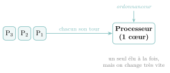
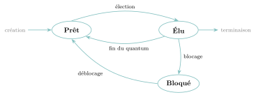
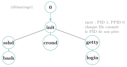
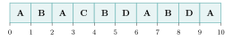
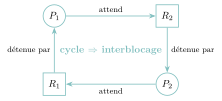
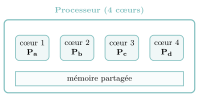

# Cours

<p class="sous-titre">Processus et ordonnancement</p>

<span id="chap-04" class="ancre"></span>

|  |  |
|:---|:---|
| **Programme (BO)** | *« Systèmes d’exploitation : identifier les principales fonctions d’un système d’exploitation. Processus : décrire les états d’un processus et l’ordonnancement des processus par le système. Mettre en évidence et décrire une situation d’interblocage. »* |
| **Prérequis** | la notion de **programme** et de **langage machine** (Première), l’**arborescence** des fichiers (Première), pour la relation père/fils entre processus, un peu de **files** (la file d’attente de l’ordonnanceur). |
| **Objectifs** | *distinguer* un programme d’un processus ; *décrire* les trois états d’un processus et les transitions entre eux ; *comprendre* le rôle d’ordonnanceur du système ; *dérouler* un ordonnancement et le représenter par un chronogramme ; *reconnaître* et *expliquer* une situation d’interblocage. |

## Le problème : un seul processeur, mille programmes

En cet instant précis, votre ordinateur « fait tourner » des dizaines de programmes : le navigateur, la messagerie, l’horloge, l’antivirus, le système lui-même… Pourtant, un cœur de processeur ne sait faire qu’**une seule chose à la fois**. Comment l’illusion tient-elle ?

La réponse tient en un mot : la **vitesse**. Le système donne le processeur à un programme pour une fraction de milliseconde, le retire, le donne à un autre, et recommence — des milliers de fois par seconde. L’œil humain n’y voit que du feu : tout *semble* simultané. Ce tour de passe-passe a un chef d’orchestre : le **système d’exploitation** (*operating system*, OS).

!!! regle "Règle 1 — Le fil rouge de ce chapitre"

    Le **système d’exploitation** est le programme qui gère la machine et fait tourner tous les autres. Son défi central : partager un **unique processeur** (et des ressources limitées) entre de **nombreux programmes** qui le réclament tous. Ce chapitre raconte comment il s’y prend — en **ordonnançant** les programmes (leur donner le processeur chacun son tour) — et ce qui arrive quand cela tourne mal — l’**interblocage**.

Parmi les grandes fonctions d’un OS : gérer les processus (notre sujet), la mémoire, les fichiers, les périphériques, les droits des utilisateurs, et la sécurité. Nous nous concentrons ici sur la **gestion des processus**.

\*(image manquante : 04_Intel_4004)\*  
La ressource à partager : **le processeur** (ici l’Intel 4004, 1971, l’un des tout premiers).

{ .tikz loading=lazy }

## Programme et processus : ne pas confondre

!!! definition "Définition 1 — Processus"

    Un **processus** est un **programme en cours d’exécution**. Il ne faut pas le confondre avec le programme lui-même : le programme est un *texte* inerte (le « code source » ou le fichier exécutable), rangé sur le disque ; le processus est ce texte *en train de vivre* dans la mémoire, avec ses données, sa position courante, ses ressources.

!!! exemple "Exemple"

    Une **recette de cuisine** écrite sur une fiche, c’est le *programme*. Le **cuisinier en train de la réaliser** dans sa cuisine, c’est le *processus*. Deux cuisiniers peuvent suivre la *même* recette en même temps : un seul programme, mais **deux processus** distincts, chacun avec ses casseroles (ses données) et son avancement propre.

<span id="cours-04-1" class="ancre"></span>

<span class="afaire">▶ Exercices d'application :</span> exercice **[1](exercices.md#ex-04-1)** (programme ou processus ?)

## La vie d’un processus : trois états

À un instant donné, un processus se trouve dans l’un de **trois états**. C’est le cœur du chapitre — apprenez ce schéma par cœur.

!!! definition "Définition 2 — Les trois états d’un processus"

    - **Élu** : le processus *utilise le processeur*, il s’exécute. Il n’y en a **qu’un seul** dans cet état à la fois (par cœur de processeur).

    - **Prêt** : le processus *pourrait* s’exécuter, mais il attend son tour car le processeur est occupé par un autre.

    - **Bloqué** : le processus attend une **ressource** (une donnée du disque, une saisie clavier, la fin d’un calcul…) ; il ne peut pas avancer, même si le processeur se libérait.

Les passages d’un état à l’autre portent des noms précis :

{ .tikz loading=lazy }

- **Élection** (prêt $\to$ élu) : le système choisit ce processus et lui donne le processeur.

- **Fin du quantum / réquisition** (élu $\to$ prêt) : son temps de parole est écoulé, le système lui reprend le processeur pour le donner à un autre.

- **Blocage** (élu $\to$ bloqué) : le processus demande une ressource indisponible et doit attendre.

- **Déblocage** (bloqué $\to$ prêt) : la ressource arrive ; le processus ne repart pas *directement* en exécution, il redevient « prêt » et attend son tour.

!!! remarque "Remarque"

    Deux transitions sont **impossibles** et constituent des pièges classiques : on ne passe **jamais** de « bloqué » directement à « élu » (on repasse toujours par « prêt »), et un processus ne peut se **terminer** ou **libérer une ressource** que depuis l’état « élu » (il faut le processeur pour exécuter la moindre instruction, y compris « je libère »).

<span id="cours-04-2" class="ancre"></span>

<span class="afaire">▶ Exercices d'application :</span> exercices **[2](exercices.md#ex-04-2) à [4](exercices.md#ex-04-4)** (les trois états ; l’automate)

## Créer des processus : une histoire de famille

Un processus peut en créer un autre par un appel système (`fork` sous les systèmes de type Unix). Le créateur est le **père**, le créé est le **fils**. Comme chaque processus a un père (sauf le tout premier), la structure obtenue est un **arbre**, comme l’arborescence des fichiers vue en Première (les arbres seront étudiés en détail au chapitre suivant).

Chaque processus porte un identifiant unique, le **PID** (*Process IDentifier*), et connaît le PID de son père, le **PPID**. Au démarrage, le système crée un premier processus « venu de rien » (PID $0$), qui engendre le processus `init` (PID $1$), racine de tous les autres.

{ .tikz loading=lazy }

!!! remarque "Remarque"

    L’appel `fork` **duplique** le processus qui l’exécute : après un `fork`, il y a *deux* processus (le père **et** le fils) qui poursuivent tous deux la suite du programme. Conséquence surprenante : deux `fork` à la suite donnent $2 \times 2 = 4$ processus, trois `fork` en donnent $2^3 = 8$… Chaque `fork` **double** le nombre de processus. Le code suivant affiche donc « bonjour » **quatre** fois :

    ```python
    from os import fork
    fork()            # 1 processus -> 2
    fork()            # 2 processus -> 4
    print("bonjour")  # execute par les 4 processus
    ```

<span id="cours-04-5" class="ancre"></span>

<span class="afaire">▶ Exercices d'application :</span> exercices **[5](exercices.md#ex-04-5) à [7](exercices.md#ex-04-7)** (arbre de processus, PID/PPID, `fork`)

## Observer et gérer les processus : le terminal

Le système garde la trace de tous les processus. On peut les **observer** et **agir** sur eux avec quelques commandes tapées dans un **terminal** (sous Linux ou macOS). La commande reine est `ps` (*process status*) : avec les options `-ef`, elle liste *tous* les processus, un par ligne, avec leur **PID** et leur **PPID**.

```console
$ ps -ef
UID     PID  PPID  STIME  TTY    CMD
root      1     0  09:14  ?      /sbin/init
mathis  843     1  09:15  tty1   -bash
mathis  901   843  09:20  tty1   python3 tri.py
mathis  902   843  09:21  tty1   ps -ef
```

En rapprochant les colonnes **PID** et **PPID**, on reconstitue l’arbre des processus : ici, `python3 tri.py` (PID $901$) a pour père le terminal `-bash` (PID $843$), lui-même fils de `init`. La commande `ps` apparaît dans sa propre sortie (PID $902$) : au moment de l’affichage, elle est elle-même un processus en cours.

| **Commande** | **Rôle** | **Exemple** |
|:---|:---|:---|
| `ps` | les processus du terminal courant | `ps` |
| `ps -ef` *ou* `ps aux` | **tous** les processus (PID, PPID…) | `ps -ef` |
| `pstree` | les processus sous forme d’**arbre** | `pstree` |
| `top` *ou* `htop` | liste **rafraîchie en temps réel** (CPU, mémoire) | `top` |
| `kill <PID>` | demande l’arrêt d’un processus | `kill 901` |
| `kill -9 <PID>` | **force** l’arrêt (signal non ignorable) | `kill -9 901` |
| `<commande> &` | lance en **arrière-plan** (rend la main) | `python3 tri.py &` |
| `jobs` | les tâches lancées depuis ce terminal | `jobs` |
| `nice` / `renice` | règle la **priorité** d’un processus | `nice -n 10 gros_calcul` |

!!! remarque "Remarque"

    Ces noms ne sont pas à réciter par cœur, mais savoir **lire une sortie de `ps`** pour en tirer un arbre de PID, et connaître `top` et `kill`, sont des capacités attendues. Le « kill » de `kill -9` est trompeur : la commande *envoie un signal* au processus ; `-9` est le signal qu’on ne peut pas ignorer, d’où l’arrêt forcé. Ces commandes se pratiquent dans la partie A du TP proposé en fin de chapitre.

## L’ordonnancement : le chef d’orchestre à l’œuvre

Quand plusieurs processus sont « prêts », lequel élire ? C’est la mission de l’**ordonnanceur** (*scheduler*), un rouage du système.

!!! definition "Définition 3 — Ordonnancement"

    L’**ordonnancement** est la stratégie par laquelle le système choisit, parmi les processus prêts, celui qui obtient le processeur, et pour combien de temps. Le petit intervalle de temps accordé à un processus s’appelle un **quantum**. Passer d’un processus à un autre s’appelle une **commutation de contexte**.

Pour comparer les stratégies, prenons quatre processus qui arrivent à des instants différents et demandent des durées de calcul différentes :

| Processus | Instant d’arrivée | Durée de calcul |
|:---------:|:-----------------:|:---------------:|
|     A     |         0         |        4        |
|     B     |         1         |        3        |
|     C     |         2         |        1        |
|     D     |         3         |        2        |

On mesure la qualité d’un ordonnancement par le **temps d’attente** de chaque processus (le temps passé à ne *pas* s’exécuter alors qu’il était arrivé), et on en prend la moyenne.

### Premier arrivé, premier servi (FCFS)

La stratégie la plus simple : on sert les processus dans leur **ordre d’arrivée**, chacun jusqu’au bout, sans jamais l’interrompre.

{ .tikz loading=lazy }

Temps d’attente : A$=0$, B$=3$, C$=5$, D$=5$. **Moyenne $= 3{,}25$**. Défaut criant : le petit C (durée $1$) poireaute $5$ unités derrière les gros — comme une caisse express bloquée par un caddie plein.

### Le plus court d’abord (SJF)

À chaque fois que le processeur se libère, on élit le processus prêt dont la **durée est la plus courte**.

{ .tikz loading=lazy }

Temps d’attente : A$=0$, C$=2$, D$=2$, B$=6$. **Moyenne $= 2{,}50$**. En faisant passer les courts devant, on **minimise le temps d’attente moyen** <span class="horsprog">au-delà du programme</span> : c’est un résultat qu’on peut démontrer. Rançon : un processus long (ici B) peut attendre longtemps — c’est le risque de « famine ».

### Le tourniquet (round-robin)

Pour que *personne* ne monopolise le processeur, on fixe un **quantum** (ici $1$ unité) et on fait **tourner** les processus prêts dans une **file** : chacun s’exécute un quantum, puis repart en fin de file s’il n’a pas fini.

{ .tikz loading=lazy }

Temps d’attente : A$=6$, B$=4$, C$=1$, D$=4$. **Moyenne $= 3{,}75$**. En moyenne, c’est *moins* bon que le plus court d’abord ; mais chaque processus reçoit **très vite** un peu de processeur — l’ordinateur reste **réactif** (votre souris ne « gèle » pas pendant qu’un gros calcul tourne). C’est la stratégie des systèmes interactifs.

!!! propriete "Propriété 1 — Il n’y a pas d’ordonnancement parfait"

    Aucune stratégie n’est la meilleure sur tous les critères : le *plus court d’abord* optimise le temps d’attente moyen mais peut affamer les longs ; le *tourniquet* garantit la réactivité mais multiplie les commutations (qui coûtent du temps) ; le *premier arrivé* est simple mais pénalise les petits. Choisir un ordonnancement, c’est choisir un **compromis**.

!!! regle "Règle 2 — En quel langage écrit-on un vrai ordonnanceur ?"

    En exercice (et au bac), on programme un ordonnanceur en **Python**. C’est parfait pour *comprendre l’algorithme*… mais en vérité, **aucun système réel n’utiliserait Python pour cela**, et il faut savoir pourquoi.

    Un ordonnanceur vit au cœur du système (le *noyau*), s’exécute des **milliers de fois par seconde**, et doit **manipuler directement le matériel** (sauvegarder et restaurer les registres du processeur à chaque commutation). Il lui faut donc être **extrêmement rapide** et **proche de la machine**. Python, lui, est un langage **interprété**, **de très haut niveau**, avec un ramasse-miettes (un mécanisme automatique qui libère la mémoire des données devenues inutiles, en anglais *garbage collector*, pratique mais qui interrompt le programme à des moments imprévisibles) : commode pour nous, mais bien trop lent et trop éloigné du matériel pour ce rôle.

    Les vrais ordonnanceurs sont donc écrits en **C** — le langage des noyaux Linux, Windows et macOS — et leurs parties les plus basses (la **commutation de contexte**) en **assembleur**, le seul langage qui parle directement au processeur. **On fait du Python ici non pas pour *fabriquer* un ordonnanceur, mais pour en *simuler* et *comprendre* la logique** — la file, le quantum, le choix du prochain élu — sans se noyer dans la gestion du matériel.

<span id="cours-04-8" class="ancre"></span>

<span class="afaire">▶ Exercices d'application :</span> exercice **[8](exercices.md#ex-04-8)** (ordonnancer à la main : trois stratégies)

## L’interblocage : quand tout le monde s’attend

Le partage des ressources peut mener à une panne subtile où des processus s’attendent *mutuellement*, pour toujours.

**Le scénario.** Deux processus $P_1$, $P_2$ ; deux ressources $R_1$, $R_2$ (une imprimante et un scanner, disons), utilisables par un seul processus à la fois.

1.  $P_1$ obtient $R_1$ ; $P_2$ obtient $R_2$.

2.  $P_1$ demande alors $R_2$ … mais $R_2$ est prise par $P_2$ : $P_1$ se **bloque**.

3.  $P_2$ demande alors $R_1$ … mais $R_1$ est prise par $P_1$ : $P_2$ se **bloque**.

Chacun retient une ressource que l’autre attend, et aucun ne peut la libérer puisque, bloqué, il ne s’exécute plus. La situation est figée pour toujours : c’est l’**interblocage** (*deadlock*).

On le visualise avec un **graphe d’attente** : une flèche « $P \to R$ » signifie « $P$ attend $R$ », une flèche « $R \to P$ » signifie « $R$ est détenue par $P$ ». Un **cycle** dans ce graphe est la signature d’un interblocage.

{ .tikz loading=lazy }

!!! propriete "Propriété 2 — Les quatre conditions de Coffman au-delà du programme"

    Un interblocage ne peut survenir que si les **quatre** conditions suivantes sont réunies *en même temps* :

    1.  **exclusion mutuelle** : une ressource ne sert qu’un processus à la fois ;

    2.  **détention et attente** : un processus garde ses ressources tout en en réclamant d’autres ;

    3.  **non-préemption** : on ne peut pas retirer de force une ressource à un processus ;

    4.  **attente circulaire** : il existe un cycle de processus attendant chacun une ressource tenue par le suivant.

    Casser *n’importe laquelle* de ces conditions suffit à empêcher tout interblocage.

!!! remarque "Remarque"

    Que faire face à un interblocage ? On peut le **détecter** (chercher un cycle dans le graphe d’attente) puis le **briser** en tuant l’un des processus fautifs (qui libère alors ses ressources). Ou mieux, l’**éviter** en amont : par exemple imposer que tout processus demande les ressources **toujours dans le même ordre** (jamais $R_2$ avant $R_1$) — ce qui casse l’attente circulaire. « Éteindre et rallumer » l’ordinateur, c’est d’ailleurs souvent tuer les processus bloqués…

<span id="cours-04-10" class="ancre"></span>

<span class="afaire">▶ Exercices d'application :</span> exercices **[10](exercices.md#ex-04-10) et [11](exercices.md#ex-04-11)** (interblocage)

## Et aujourd’hui : les processeurs multi-cœurs <span class="horsprog">au-delà du programme</span>

Depuis le début de ce chapitre, nous avons supposé **un seul cœur** : un seul processus élu à la fois, et l’illusion du parallélisme grâce à la vitesse de commutation. Or, depuis le milieu des années 2000, presque tous les processeurs sont **multi-cœurs**.

Un **cœur** (*core*) est un processeur complet à lui seul, capable d’exécuter *son* processus. Un processeur « quadricœur » en contient quatre : il peut donc élire **jusqu’à quatre processus *vraiment* en même temps** — ce n’est plus une illusion, c’est du **vrai parallélisme**.

{ .tikz loading=lazy }  
Quatre cœurs exécutent quatre processus simultanément, en partageant la mémoire.

Pourquoi ce virage ? Pendant des décennies, on accélérait un cœur unique en augmentant sa **fréquence** (les gigahertz). Mais on a heurté un mur : plus de fréquence, c’est plus de **chaleur** et de **consommation**. Plutôt que de faire courir un cœur toujours plus vite, on a choisi d’en **multiplier** le nombre.

Cela change peu ce que nous avons appris : sur *chaque* cœur, les états, le quantum et l’ordonnancement restent valables. L’ordonnanceur gagne juste une mission de plus — **répartir les processus prêts entre les cœurs** (l’équilibrage de charge). En revanche, comme les cœurs **partagent la mémoire**, la synchronisation devient plus délicate (les interblocages restent possibles, et il faut garder les mémoires caches cohérentes).

Conséquence pour qui programme : pour tirer parti de $N$ cœurs, un programme doit être **découpé pour s’exécuter en parallèle** (en plusieurs *fils d’exécution*, ou *threads*) ; sinon un seul cœur travaille pendant que les autres se tournent les pouces. C’est pourquoi « savoir paralléliser » est devenu essentiel. Aujourd’hui, un simple téléphone compte couramment $6$ à $8$ cœurs, un ordinateur portable de $8$ à $16$.

## Un peu d’histoire : du traitement par lots au multitâche

Les tout premiers ordinateurs (années 1950) exécutaient les programmes **un par un**, à la file (*traitement par lots*) : pendant qu’un programme attendait une lecture sur bande, le processeur, hors de prix, restait *oisif*. Quel gâchis ! Les programmeurs de l’époque, comme l’Américaine **Grace Hopper** (1906–1992), officier de la marine et pionnière qui écrit en 1952 l’un des tout premiers **compilateurs** puis inspire le langage COBOL, confient leurs programmes à un opérateur et attendent le résultat… parfois jusqu’au lendemain.

\*(image manquante : 04_hist_grace_hopper)\*  
Grace Hopper en 1984

L’idée de partager le processeur entre plusieurs tâches — le **temps partagé** (*time-sharing*) — naît au début des années 1960 (système CTSS au MIT, 1961, puis l’ambitieux Multics). En 1969, aux laboratoires Bell, **Ken Thompson** et **Dennis Ritchie** en tirent un système plus simple et élégant, **Unix**, dont descendent aujourd’hui Linux, macOS, Android et iOS. Toute la gestion des processus de ce cours vient de là.

Côté théorie, le Néerlandais **Edsger Dijkstra** (déjà croisé pour les plus courts chemins) pose en 1965 les outils de la synchronisation (les *sémaphores*) et illustre l’interblocage par son célèbre « dîner des philosophes » <span class="horsprog">au-delà du programme</span>. En 1971, **Edward Coffman** énonce les quatre conditions qui portent son nom. La prochaine fois que votre téléphone jongle avec vingt applications sans sourciller, vous saurez quel héritage se cache derrière cette fluidité.

\*(image manquante : 04_hist_dijkstra)\*  
Edsger W. Dijkstra

!!! remarque "Remarque — Liens avec d’autres chapitres"

    Les processus prêts attendent dans une **file** (FIFO) : le tourniquet en est une application directe (chapitre « structures linéaires »). La relation père/fils créée par `fork` forme un **arbre** (chapitre suivant), et l’interblocage se lit dans un **graphe** orienté : le détecter, c’est **repérer un cycle** (les graphes seront étudiés plus tard dans l’année). Enfin, on verra au chapitre « systèmes sur puce » que le système d’exploitation d’un téléphone ordonnance ses processus sur les cœurs d’une seule puce, alors qu’un microcontrôleur, en général sans OS complet, n’exécute qu’un seul programme.

## Bilan — la carte mémoire

| **Notion** | **À retenir** |
|:---|:---|
| Processus | un **programme en cours d’exécution** (*pas* le code source) |
| Système d’exploitation | le **chef d’orchestre** : partage processeur et ressources |
| Trois états | **élu** (s’exécute) / **prêt** (attend son tour) / **bloqué** (attend une ressource) |
| Transitions | élection, fin de quantum, blocage, déblocage ; jamais bloqué $\to$ élu |
| Création | `fork` : père/fils $\Rightarrow$ **arbre** de processus ; identifiants **PID** / **PPID** |
| Observer / gérer | `ps -ef` (PID/PPID), `pstree`, `top` ; `kill <PID>` pour arrêter |
| Ordonnancement | choisir le prochain élu ; **quantum**, commutation de contexte |
| Stratégies | premier arrivé / plus court d’abord (attente min.) / tourniquet (réactif) |
| Interblocage | cycle d’attente mutuelle ; **graphe d’attente** ; conditions de Coffman |
| En vrai | les vrais ordonnanceurs sont en **C** (+ assembleur) ; en Python on *simule* |

## Erreurs fréquentes

- **Confondre programme et processus.** Le programme est un fichier ; le processus est son exécution vivante. Un même programme peut donner *plusieurs* processus.

- **Croire que plusieurs processus s’exécutent « vraiment » en même temps** sur un cœur. Un seul est **élu** à la fois ; l’illusion vient de la vitesse de commutation.

- **Faire passer un processus de « bloqué » à « élu ».** Impossible : il repasse d’abord par « prêt ».

- **Oublier qu’il faut être élu pour libérer une ressource.** Un processus bloqué ne rend donc rien — c’est ce qui rend l’interblocage définitif.

- **Croire qu’un interblocage vient d’un « bug »** dans un seul programme. Il naît de l’**interaction** entre processus et de l’ordre des demandes de ressources.

## Savoir-faire à maîtriser

*À la fin du chapitre, je sais…*

- **distinguer** un programme d’un processus, et citer les grandes fonctions d’un système d’exploitation $\to$ ex. [1](exercices.md#ex-04-1) ;

- **nommer** les trois états et **compléter** le schéma des transitions $\to$ ex. [2](exercices.md#ex-04-2), [3](exercices.md#ex-04-3), [4](exercices.md#ex-04-4) ;

- **lire** une sortie de `ps`, en déduire un arbre de processus et des PID / PPID, et connaître `top` / `kill` $\to$ ex. [5](exercices.md#ex-04-5), [6](exercices.md#ex-04-6), [7](exercices.md#ex-04-7) ;

- **dérouler** un ordonnancement (premier arrivé, plus court d’abord, tourniquet) sous forme de **chronogramme** et en calculer les temps d’attente $\to$ ex. [8](exercices.md#ex-04-8), [12](exercices.md#ex-04-12) ;

- **reconnaître** un interblocage, le représenter par un **graphe d’attente** et proposer un moyen de l’éviter $\to$ ex. [10](exercices.md#ex-04-10), [11](exercices.md#ex-04-11).

## Vers le Grand Oral

- **Comment un ordinateur donne-t-il l’illusion de tout faire à la fois avec un seul processeur ?** *(les états, l’ordonnancement, la commutation de contexte à grande vitesse.)*

- **Réactivité ou efficacité : comment un système choisit-il qui s’exécute ?** *(comparer plus court d’abord et tourniquet ; le compromis ; les chronogrammes.)*

- **Peut-on prouver qu’un système ne se figera jamais ?** *(l’interblocage ; les quatre conditions de Coffman ; l’ordre total sur les ressources.)*

- **En quoi le partage du temps a-t-il transformé l’informatique ?** *(du traitement par lots au temps partagé ; Unix ; l’héritage jusqu’à nos téléphones.)*
