# Exercices

<p class="sous-titre">Processus et ordonnancement</p>

Usage de l’IA, indiqué sur chaque exercice : <span class="ia ia-rouge" title="Sans IA : le but est l'automatisme lui-même"></span> aucune ; <span class="ia ia-orange" title="IA en appui : déboguer, reformuler, vérifier ; la réponse finale est la vôtre"></span> en appui (déboguer, reformuler, vérifier ; la réponse finale est écrite et comprise par vous) ; <span class="ia ia-vert" title="IA intégrée : l'exercice s'appuie sur une réponse d'IA"></span> l’exercice s’appuie sur une réponse d’IA. Voir la [charte d’usage de l’IA](../charte.md).

!!! consignes "Mode d’emploi"

    Niveau : ★ échauffement, ★★ classique (niveau bac), ★★★ défi ; les *coups de pouce* et les *corrigés* se déplient sous chaque exercice. Le symbole <span class="run" title="À programmer et tester sur machine">▶</span>  signale un exercice *à programmer et tester* en Python. Pour tout ordonnancement, on soigne le **chronogramme** et on justifie les **états**.

### Programme, processus, états

### <span class="stars" title="Niveau 1 sur 3">★</span> <span class="exo-num">Exercice 1</span> — Programme ou processus ? <span class="ia ia-rouge" title="Sans IA : le but est l'automatisme lui-même"></span> { #ex-04-1 }

Pour chaque affirmation, dire si elle décrit un *programme* ou un *processus*, et justifier.

1.  Le fichier `jeu.py` rangé sur le disque dur.

2.  Deux fenêtres du même navigateur ouvertes en même temps.

3.  La recette de cuisine imprimée sur une fiche.

4.  Ce qui possède un PID et un état à un instant donné.

??? corrige "Corrigé"

    **1.** Programme (fichier inerte sur le disque). **2.** Deux *processus* (deux exécutions du même programme). **3.** Programme (le texte de la recette). **4.** Processus (seul un programme *en exécution* a un PID et un état).

### <span class="stars" title="Niveau 1 sur 3">★</span> <span class="exo-num">Exercice 2</span> — Les trois états <span class="ia ia-rouge" title="Sans IA : le but est l'automatisme lui-même"></span> { #ex-04-2 }

1.  Nommer les trois états possibles d’un processus et, en une phrase chacun, ce qu’ils signifient.

2.  Nommer la transition correspondante : (a) le système donne le processeur à un processus prêt ; (b) un processus demande une donnée sur le disque ; (c) le temps de parole d’un processus est écoulé ; (d) la donnée attendue arrive enfin.

3.  Citer une transition **impossible** entre deux états, et expliquer pourquoi.

??? corrige "Corrigé"

    **1.** **Élu** (utilise le processeur, s’exécute) ; **prêt** (pourrait s’exécuter, attend son tour) ; **bloqué** (attend une ressource).  
    **2.** (a) élection ; (b) blocage ; (c) fin du quantum (réquisition) ; (d) déblocage.  
    **3.** Par exemple « bloqué $\to$ élu » est impossible : un processus débloqué redevient d’abord *prêt* et attend son tour (le processeur peut être occupé).

### <span class="stars" title="Niveau 2 sur 3">★★</span> <span class="exo-num">Exercice 3</span> — Le fil d’une vie <span class="ia ia-rouge" title="Sans IA : le but est l'automatisme lui-même"></span> { #ex-04-3 }

Un processus P démarre, s’exécute, demande une lecture sur le disque, l’obtient un peu plus tard (mais le processeur est alors occupé), reprend, puis se termine. Donner la **suite ordonnée des états** traversés par P (de sa création à sa fin), en nommant chaque transition.

??? pouce "Coup de pouce"

    Repérer dans l’énoncé chaque événement (démarrage, demande de lecture, arrivée de la donnée, fin) et chercher, pour chacun, la flèche de l’automate des états qu’il déclenche. Se demander ce que devient P quand sa donnée arrive alors que le processeur est occupé.

??? corrige "Corrigé"

    Prêt (création) $\xrightarrow{\text{élection}}$ Élu $\xrightarrow{\text{blocage}}$ Bloqué (attente disque) $\xrightarrow{\text{déblocage}}$ Prêt $\xrightarrow{\text{élection}}$ Élu $\xrightarrow{\text{terminaison}}$ fin. On passe bien par « prêt » après le déblocage, et la terminaison a lieu depuis « élu ».

### <span class="stars" title="Niveau 1 sur 3">★</span> <span class="exo-num">Exercice 4</span> — Compléter l’automate des états <span class="ia ia-rouge" title="Sans IA : le but est l'automatisme lui-même"></span> { #ex-04-4 }

Recopier le schéma ci-dessous et le compléter : nommer les trois **états** ( 1), ( 2), ( 3) et les quatre **transitions** **(a)**, **(b)**, **(c)**, **(d)**, en choisissant dans les étiquettes proposées.

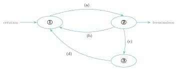{ .tikz loading=lazy }

**Étiquettes.** États : *Élu*, *Prêt*, *Bloqué*. Transitions : *élection*, *blocage*, *déblocage*, *fin du quantum*.

??? corrige "Corrigé"

    États : ( 1) $=$ **Prêt**, ( 2) $=$ **Élu**, ( 3) $=$ **Bloqué**. Transitions : **(a)** $=$ *élection* (prêt $\to$ élu), **(b)** $=$ *fin du quantum* (élu $\to$ prêt), **(c)** $=$ *blocage* (élu $\to$ bloqué), **(d)** $=$ *déblocage* (bloqué $\to$ prêt). Le processus est créé dans l’état *Prêt* et se termine depuis l’état *Élu*.

### Arbre de processus, PID et PPID

### <span class="stars" title="Niveau 1 sur 3">★</span> <span class="exo-num">Exercice 5</span> — Lire un arbre de processus <span class="ia ia-rouge" title="Sans IA : le but est l'automatisme lui-même"></span> { #ex-04-5 }

On donne la hiérarchie de processus suivante (chaque nœud est étiqueté par son PID) :

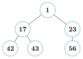{ .tikz loading=lazy }

1.  Donner le PPID du processus $42$, puis celui du processus $23$.

2.  Combien le processus $17$ a-t-il de fils ? Les citer.

3.  Le processus $1$ a-t-il un PPID ? Que représente-t-il ?

4.  Si l’on `kill` le processus $17$, quels processus risquent de disparaître aussi ?

??? corrige "Corrigé"

    **1.** PPID de $42$ : c’est $17$. PPID de $23$ : c’est $1$. **2.** $17$ a **deux** fils : $42$ et $43$. **3.** $1$ (`init`) n’a pas de père utile ici ; son PPID vaut $0$ (le processus de démarrage). **4.** Tuer $17$ met en péril ses descendants $42$ et $43$.

### <span class="stars" title="Niveau 2 sur 3">★★</span> <span class="exo-num">Exercice 6</span> — Reconstruire l’arbre <span class="ia ia-rouge" title="Sans IA : le but est l'automatisme lui-même"></span> { #ex-04-6 }

Une commande `ps` donne le tableau suivant. Dessiner l’arbre des processus correspondant.

??? pouce "Coup de pouce"

    La colonne PPID donne le père de chaque processus : partir de la racine (le processus dont le père n’est pas dans le tableau), puis placer sous chaque nœud tous les processus dont le PPID est son PID.

| PID | PPID | Commande |
|:---:|:----:|:--------:|
|  1  |  0   |  `init`  |
|  8  |  1   |  `bash`  |
|  9  |  1   |  `sshd`  |
| 40  |  8   | `python` |
| 41  |  8   |  `vim`   |
| 57  |  9   |  `bash`  |

??? corrige "Corrigé"

    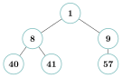{ .tikz loading=lazy }

    (`init` $1$ a pour fils `bash` $8$ et `sshd` $9$ ; $8$ a pour fils `python` $40$ et `vim` $41$ ; $9$ a pour fils `bash` $57$.)

### <span class="stars" title="Niveau 2 sur 3">★★</span> <span class="exo-num">Exercice 7</span> — L’appel `fork` <span class="ia ia-orange" title="IA en appui : déboguer, reformuler, vérifier ; la réponse finale est la vôtre"></span> { #ex-04-7 }

L’appel `fork` **duplique** le processus qui l’exécute : après un `fork`, le père *et* le fils poursuivent tous deux la suite du programme.

1.  On exécute le programme suivant. Combien de processus existent après la ligne 2 ? après la ligne 3 ? Combien de fois « A » est-il affiché ?

    ```python
    from os import fork
    fork()          # ligne 2
    fork()          # ligne 3
    print("A")      # ligne 4
    ```

2.  Dessiner l’arbre des processus créés (on note $P_0$ le processus de départ).

3.  Combien de processus existeraient si l’on ajoutait un troisième `fork()` avant le `print` ? Donner la formule générale pour $n$ appels `fork` successifs.

    ??? pouce "Coup de pouce"

        Après un `fork`, *chacun* des processus existants exécute la ligne suivante, donc aussi le `fork` suivant. Compter les processus ligne par ligne et observer comment ce nombre évolue à chaque `fork`.

??? corrige "Corrigé"

    **1.** Après la ligne 2 (un `fork`) : **2** processus. Après la ligne 3 (un second `fork`) : $2 \times 2 = \textbf{4}$ processus. « A » est donc affiché **4 fois**.  
    **2.** Arbre des processus (chaque `fork` fait naître un fils, qui peut à son tour engendrer) :

    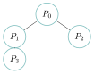{ .tikz loading=lazy }

    ($P_0$ crée $P_1$ au 1<sup>er</sup> `fork` ; au 2<sup>e</sup>, $P_0$ crée $P_2$ et $P_1$ crée $P_3$ : quatre processus en tout.)  
    **3.** Avec un troisième `fork`, on double encore : $2^3 = \textbf{8}$ processus. En général, $n$ appels `fork` successifs donnent $\mathbf{2^n}$ processus.

### Ordonnancer à la main

### <span class="stars" title="Niveau 2 sur 3">★★</span> <span class="exo-num">Exercice 8</span> — Trois stratégies, un même jeu de processus <span class="ia ia-orange" title="IA en appui : déboguer, reformuler, vérifier ; la réponse finale est la vôtre"></span> { #ex-04-8 }

Quatre processus arrivent et demandent le processeur :

|     Processus     |  A  |  B  |  C  |  D  |
|:-----------------:|:---:|:---:|:---:|:---:|
| Instant d’arrivée |  0  |  1  |  2  |  4  |
|       Durée       |  3  |  4  |  2  |  1  |

Pour chacune des trois stratégies ci-dessous, tracer le **chronogramme** (de $t=0$ à $t=10$) et calculer le **temps d’attente moyen** (rappel : temps d’attente $=$ temps de rotation $-$ durée, où le temps de rotation $=$ instant de fin $-$ instant d’arrivée).

1.  **Premier arrivé, premier servi** (chacun jusqu’au bout, dans l’ordre d’arrivée).

2.  **Plus court d’abord** (à chaque libération, on élit le processus prêt le plus court).

3.  **Tourniquet** de quantum $1$ (chacun un cycle, puis en fin de file s’il n’a pas fini).

4.  Comparer les trois moyennes. Laquelle minimise l’attente ? Laquelle rend le système le plus *réactif* ?

    ??? pouce "Coup de pouce"

        Tracer d’abord le chronogramme, puis remplir un petit tableau par processus : instant de fin, temps de rotation, temps d’attente. Pour le plus court d’abord, ne comparer que les processus *déjà arrivés* au moment où le processeur se libère.

??? corrige "Corrigé"

    Rappel des données : A$(0,3)$, B$(1,4)$, C$(2,2)$, D$(4,1)$.

    **1. Premier arrivé, premier servi.**

    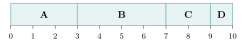{ .tikz loading=lazy }

    Attente : A$=0$, B$=2$, C$=5$, D$=5$. **Moyenne $= 3{,}00$**.

    **2. Plus court d’abord.**

    { .tikz loading=lazy }

    Attente : A$=0$, C$=1$, D$=1$, B$=5$. **Moyenne $= 1{,}75$**.

    **3. Tourniquet (quantum $1$).**

    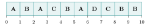{ .tikz loading=lazy }

    Fins : A$=6$, B$=10$, C$=8$, D$=7$. Attente : A$=3$, B$=5$, C$=4$, D$=2$. **Moyenne $= 3{,}50$**.

    **4.** Le **plus court d’abord** minimise l’attente moyenne ($1{,}75$). Le **tourniquet** est le plus *réactif* : chaque processus reçoit du processeur très tôt (aucun n’attend plus d’un tour avant de commencer), au prix de nombreuses commutations et d’une attente moyenne plus élevée.

### Programmer un ordonnanceur

### <span class="stars" title="Niveau 3 sur 3">★★★</span> <span class="exo-num">Exercice 9</span> — Le tourniquet en Python *(d’après Polynésie 2023, jour 1)* <span class="ia ia-orange" title="IA en appui : déboguer, reformuler, vérifier ; la réponse finale est la vôtre"></span> { #ex-04-9 }

On simule la file d’attente par une liste, et chaque processus par un objet de la classe :

```python
class Processus:
    def __init__(self, pid, duree):
        self.pid = pid
        self.duree = duree
        self.reste_a_faire = duree     # cycles restant a executer
        self.etat = "Prêt"
```

On considère trois processus, dans cet ordre d’arrivée : PID $11$ (durée $4$), PID $20$ (durée $2$), PID $32$ (durée $3$).

1.  Avec un quantum de **1** cycle, donner la suite des PID dans l’ordre de leur exécution : `11, 20, 32, 11, …`

2.  Donner cette suite pour un quantum de **2** cycles.

    ??? pouce "Coup de pouce"

        Simuler la file à la main : écrire son contenu après chaque passage au processeur, sans oublier qu’un processus qui n’a pas fini repart *en queue* de file.

3.  <span class="run" title="À programmer et tester sur machine">▶</span>  Recopier et compléter les trois méthodes de la classe `Processus` :

    ```python
        def execute_un_cycle(self):
            ...........................       # un cycle de moins a faire

        def change_etat(self, nouvel_etat):
            ...........................

        def est_termine(self):
            ...........................       # True si reste_a_faire vaut 0
    ```

4.  <span class="run" title="À programmer et tester sur machine">▶</span>  Recopier et compléter la fonction `tourniquet`, qui renvoie la liste des PID dans l’ordre d’exécution :

    ??? pouce "Coup de pouce"

        Se demander dans quels *deux* cas le processus doit rendre le processeur : ce sont les deux conditions de la boucle intérieure. Le test qui suit la boucle décide s’il faut remettre le processus dans la file.

    ??? pouce "Coup de pouce 2 (début de solution)"

        Question 3 : `execute_un_cycle` diminue `self.reste_a_faire` de 1 et `est_termine` renvoie une comparaison avec 0. Question 4 : la boucle intérieure commence par `while compteur < quantum and ...` ; le test qui la suit porte sur `processus.est_termine()`.

    ```python
    def tourniquet(liste_attente, quantum):
        ordre_execution = []
        while liste_attente != []:
            processus = liste_attente.pop(0)
            processus.change_etat("En cours d'exécution")
            compteur = 0
            while ................. and .................:
                ordre_execution.append(.................)
                processus.execute_un_cycle()
                compteur = compteur + 1
            if ................. :
                processus.change_etat("Suspendu")
                liste_attente.append(processus)
            else:
                processus.change_etat("Terminé")
        return ordre_execution
    ```

5.  <span class="run" title="À programmer et tester sur machine">▶</span>  Créer la liste d’attente des trois processus ci-dessus et vérifier, en appelant `tourniquet`, les suites trouvées aux questions 1 et 2.

??? corrige "Corrigé"

    **1.** Quantum $1$ : `11, 20, 32, 11, 20, 32, 11, 32, 11`.  
    **2.** Quantum $2$ : `11, 11, 20, 20, 32, 32, 11, 11, 32`.

    **3.** Méthodes complétées :

    ```python
        def execute_un_cycle(self):
            self.reste_a_faire = self.reste_a_faire - 1

        def change_etat(self, nouvel_etat):
            self.etat = nouvel_etat

        def est_termine(self):
            return self.reste_a_faire == 0
    ```

    **4.** Fonction complétée :

    ```python
    def tourniquet(liste_attente, quantum):
        ordre_execution = []
        while liste_attente != []:
            processus = liste_attente.pop(0)
            processus.change_etat("En cours d'exécution")
            compteur = 0
            while compteur < quantum and not processus.est_termine():
                ordre_execution.append(processus.pid)
                processus.execute_un_cycle()
                compteur = compteur + 1
            if not processus.est_termine():
                processus.change_etat("Suspendu")
                liste_attente.append(processus)
            else:
                processus.change_etat("Terminé")
        return ordre_execution
    ```

    **5.**

    ```python
    liste_attente = [Processus(11, 4), Processus(20, 2), Processus(32, 3)]
    print(tourniquet(liste_attente, 1))   # [11, 20, 32, 11, 20, 32, 11, 32, 11]
    ```

### Interblocage

### <span class="stars" title="Niveau 2 sur 3">★★</span> <span class="exo-num">Exercice 10</span> — Lire un graphe d’attente <span class="ia ia-orange" title="IA en appui : déboguer, reformuler, vérifier ; la réponse finale est la vôtre"></span> { #ex-04-10 }

Dans le graphe d’attente ci-dessous, une flèche $P \to R$ se lit « $P$ attend $R$ » et $R \to P$ se lit « $R$ est détenue par $P$ ».

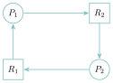{ .tikz loading=lazy }

1.  Quelle ressource $P_1$ détient-il ? Laquelle attend-il ?

2.  Y a-t-il un interblocage ? Justifier en une phrase (parler de **cycle**).

3.  Proposer une action concrète pour **sortir** de cette situation.

    ??? pouce "Coup de pouce"

        Relire le sens des deux sortes de flèches, puis suivre les flèches en partant de $P_1$ : où arrive-t-on ? Pour la question 3, se demander ce qui pourrait obliger l’un des processus à rendre sa ressource.

??? corrige "Corrigé"

    **1.** $P_1$ **détient** $R_1$ (flèche $R_1 \to P_1$) et **attend** $R_2$ (flèche $P_1 \to R_2$).  
    **2.** Oui : le graphe contient un **cycle** $P_1 \to R_2 \to P_2 \to R_1 \to P_1$. Chacun attend une ressource tenue par l’autre : c’est un interblocage.  
    **3.** On peut **tuer** l’un des deux processus (par exemple `kill` sur $P_2$) : il libère alors sa ressource, ce qui débloque l’autre.

### <span class="stars" title="Niveau 3 sur 3">★★★</span> <span class="exo-num">Exercice 11</span> — Éviter l’interblocage <span class="ia ia-orange" title="IA en appui : déboguer, reformuler, vérifier ; la réponse finale est la vôtre"></span> { #ex-04-11 }

Deux processus partagent une imprimante $I$ et un scanner $S$. $P_1$ a besoin des deux dans l’ordre $I$ puis $S$ ; $P_2$ en a besoin dans l’ordre $S$ puis $I$.

1.  Décrire un enchaînement précis d’événements qui mène à un interblocage.

2.  Parmi les **quatre conditions de Coffman** <span class="horsprog">au-delà du programme</span> (exclusion mutuelle, détention et attente, non-préemption, attente circulaire), laquelle casse-t-on si l’on impose que *tous* les processus demandent les ressources **dans le même ordre** ($I$ avant $S$) ? Justifier qu’alors l’interblocage devient impossible.

    ??? pouce "Coup de pouce"

        Question 1 : faire avancer $P_1$ et $P_2$ en alternance (une demande chacun) et dessiner le graphe d’attente au fur et à mesure. Question 2 : pour chacune des quatre conditions, se demander si elle peut encore être réalisée quand tout le monde demande $I$ avant $S$.

    ??? pouce "Coup de pouce 2 (début de solution)"

        Début du scénario : $P_1$ demande $I$ et l’obtient ; puis $P_2$ demande $S$ et l’obtient ; puis… (continuer avec la deuxième demande de chacun).

??? corrige "Corrigé"

    **1.** $P_1$ obtient $I$, $P_2$ obtient $S$. Puis $P_1$ demande $S$ (tenu par $P_2$) : $P_1$ se bloque. Puis $P_2$ demande $I$ (tenu par $P_1$) : $P_2$ se bloque. Chacun tient ce que l’autre attend $\Rightarrow$ interblocage.

    **2.** On casse l’**attente circulaire**. Si tout le monde demande *toujours* $I$ avant $S$, alors celui qui obtient $I$ le premier obtiendra ensuite $S$ sans rival (personne ne peut détenir $S$ sans détenir déjà $I$) : aucun cycle d’attente ne peut se former, donc plus d’interblocage possible.

### Exercices type bac

### <span class="stars" title="Niveau 2 sur 3">★★</span> <span class="exo-num">Exercice 12</span> — Type bac — Observer puis ordonnancer des processus *(d’après Amérique du Nord 2023, jour 1)* <span class="ia ia-orange" title="IA en appui : déboguer, reformuler, vérifier ; la réponse finale est la vôtre"></span> { #ex-04-12 }

**Partie A — Processus.** La commande `ps` tapée dans un terminal donne la liste des processus du système. La commande `ps -eo user,pid,ppid,time,cmd` affiche, pour tous les processus, les colonnes suivantes : `USER` (l’utilisateur qui exécute le processus), `PID` (l’identifiant du processus), `PPID` (l’identifiant du processus parent), `TIME` (le temps d’utilisation du processeur par le processus) et `CMD` (la commande ou l’application à l’origine du processus). Voici un extrait de l’écran après exécution de la commande :

```console
USER      PID   PPID  TIME      CMD
root      1     0     00:00:02  /sbin/init
kerneoops 1567  1     00:00:00  /usr/sbin/kerneloops
user01    1611  1     00:00:00  /lib/systemd/systemd --user
user01    1752  1611  00:00:00  /usr/libexec/gnome-session-binary --systemd-
user01    1766  1752  00:00:00  /usr/libexec/at-spi-bus-launcher --launch-im
user01    1770  1611  00:00:51  /usr/bin/gnome-shell
user01    5151  1632  00:00:00  /usr/libexec/gvfsd-network --spawner :1.2 /o
user01    5168  1632  00:00:00  /usr/libexec/gvfsd-dnssd --sp
user01    5348  1770  00:00:01  /snap/vlc/2344/usr/bin/vlc
user01    5468  1770  00:00:01  /snap/gimp/393/usr/bin/gimp
user01    5564  1611  00:00:00  /usr/bin/python3 /usr/bin/gnome-terminal --w
user01    5566  5564  00:00:00  /usr/bin/gnome-terminal.real --wait
user01    5571  1611  00:00:00  /usr/libexec/gnome-terminal-server
user01    5589  5571  00:00:00  bash
user01    5596  5589  00:00:01  /usr/bin/python3 /home/user01/.local/bin/tho
user01    5603  5596  00:00:00  /usr/bin/python3 -u -B -m thonny.plugins.cpy
user01    5615  1611  00:00:00  /usr/bin/python3 /usr/bin/gnome-terminal --w
user01    5617  5615  00:00:00  /usr/bin/gnome-terminal.real --wait
user01    5622  5571  00:00:00  bash
user01    5629  5622  00:00:00  ps -eo user,pid,ppid,time,cmd
```

En utilisant cet extrait :

1.  Déterminer le nom de l’application associée au processus dont l’identifiant est $5468$.

2.  Déterminer l’identifiant du processus qui a sollicité le processeur le plus longtemps.

3.  Déterminer l’identifiant du processus qui a le plus d’enfants.

4.  Déterminer le nom du programme dont est issue la commande `ps`.

5.  Déterminer la succession des identifiants des processus qui ont permis de générer le processus associé à la ligne de commande `ps -eo user,pid,ppid,time,cmd`, en partant du processus initial de PID $1$.

**Partie B — Ordonnancement.** Étant donné un instant initial $t_0 = 0$, un processus est caractérisé par sa **durée d’exécution** (en unités de temps) et son **instant d’arrivée** (l’instant où il est créé par le système d’exploitation).

1.  Les trois états principaux d’un processus sont « prêt », « bloqué » et « élu ». Donner la définition de chacun de ces trois états.

Le système utilise un ordonnancement par **tourniquet** : le processus élu dispose d’un temps prédéfini appelé *quantum*, et s’exécute soit jusqu’à ce qu’il soit terminé (durée restante inférieure ou égale au quantum), soit pendant la durée du quantum (il retourne alors à l’état prêt et réintègre la file d’attente en dernière position), soit jusqu’à ce qu’il se bloque de lui-même faute de ressource disponible.

1.  On considère trois processus, avec un quantum de $2$ unités de temps :

    | Processus | Durée d’exécution | Instant d’arrivée |
    |:---------:|:-----------------:|:-----------------:|
    |   $P_1$   |         5         |         0         |
    |   $P_2$   |         3         |         1         |
    |   $P_3$   |         4         |         5         |

    Recopier et compléter le chronogramme d’exécution des processus.

    ??? pouce "Coup de pouce"

        Partie A : pour les questions 3 et 5, n’utiliser que la colonne PPID (compter ses répétitions ; remonter de père en père). Question 7 : écrire le contenu de la file d’attente à chaque fin de quantum, en y ajoutant d’abord les processus arrivés entre-temps.

    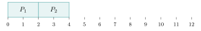{ .tikz loading=lazy }

??? corrige "Corrigé"

    **Partie A.** **1.** Le processus $5468$ est issu de `/snap/gimp/393/usr/bin/gimp` : c’est l’application **GIMP**. **2.** C’est le processus de PID **1770** (`gnome-shell`), avec `00:00:51` de temps processeur. **3.** On compte les apparitions de chaque PPID : $1611$ apparaît $5$ fois (fils $1752$, $1770$, $5564$, $5571$, $5615$), aucun autre plus de $2$ fois : c’est le processus **1611**. **4.** Le PPID de `ps` ($5629$) est $5622$, qui est un **`bash`** : la commande a été lancée depuis ce shell. **5.** On remonte les PPID : $5629 \to 5622 \to 5571 \to 1611 \to 1$, d’où la succession $\mathbf{1 \to 1611 \to 5571 \to 5622 \to 5629}$.

    **Partie B.** **6.** **Élu** : le processus s’exécute sur le processeur. **Prêt** : il pourrait s’exécuter et attend que l’ordonnanceur lui attribue le processeur. **Bloqué** : il attend une ressource (lecture disque, saisie…) et ne peut pas avancer même si le processeur est libre.

    **7.** À $t=0$, seul $P_1$ est là : il s’exécute un quantum ($0$–$2$), puis passe derrière $P_2$ (arrivé à $t=1$). $P_2$ s’exécute de $2$ à $4$, puis $P_1$ de $4$ à $6$ ; entre-temps $P_3$ est arrivé ($t=5$) et se trouve *devant* $P_1$ qui revient en fin de file à $t=6$. D’où :

    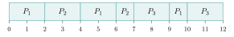{ .tikz loading=lazy }

    $P_2$ se termine à $t=7$, $P_1$ à $t=10$ et $P_3$ à $t=12$.

### <span class="stars" title="Niveau 2 sur 3">★★</span> <span class="exo-num">Exercice 13</span> — Type bac — Tourniquet cycle par cycle et interblocage *(d’après Amérique du Nord 2024, jour 1)* <span class="ia ia-orange" title="IA en appui : déboguer, reformuler, vérifier ; la réponse finale est la vôtre"></span> { #ex-04-13 }

On s’intéresse aux processus et à leur ordonnancement au sein d’un système d’exploitation, sur un **monoprocesseur**.

1.  Citer les trois états dans lesquels un processus peut se trouver.

On simule l’ordonnancement avec des objets. On dispose d’une classe `Processus` : `p = Processus(nom, duree)` crée un processus de nom `nom` et de durée `duree` (en cycles d’ordonnancement) ; `p.execute_un_cycle()` exécute le processus pendant un cycle ; `p.est_fini()` renvoie `True` si le processus est terminé, `False` sinon. Pour simplifier, on ne s’intéresse pas aux ressources qu’un processus pourrait acquérir ou libérer.

1.  Citer les deux seuls états possibles pour un processus dans ce contexte.

On ordonnance les processus selon une méthode du type tourniquet telle qu’**à chaque cycle** : si un nouveau processus est créé, il est mis dans la file d’attente ; ensuite, on défile un processus de la file d’attente et on l’exécute pendant un cycle ; si le processus exécuté n’est pas terminé, on le replace dans la file. Par exemple, avec les processus A (créé au cycle $2$, durée $3$), B (cycle $1$, durée $4$), C (cycle $4$, durée $3$) et D (cycle $0$, durée $5$), on obtient le chronogramme :

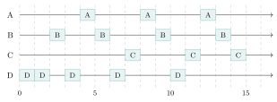{ .tikz loading=lazy }

On décrit maintenant d’autres processus et leur moment de création ; le dictionnaire `depart_proc` associe à un cycle le processus créé à ce moment (un seul processus peut être créé lors d’un cycle donné) :

```python
p1 = Processus("p1", 4)
p2 = Processus("p2", 3)
p3 = Processus("p3", 5)
p4 = Processus("p4", 3)
depart_proc = {0: p1, 1: p3, 2: p2, 3: p4}
```

1.  Recopier et compléter le chronogramme ci-dessous pour les processus `p1`, `p2`, `p3` et `p4`.

    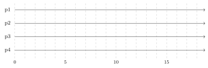{ .tikz loading=lazy }

L’ordonnancement est mis en place par les classes `File` et `Ordonnanceur` suivantes (l’attribut `temps` correspond au cycle en cours) :

```python
class File:
    def __init__(self):
        self.contenu = []
    def enfile(self, element):
        self.contenu.append(element)
    def defile(self):
        if self.est_vide():
            return None
        return self.contenu.pop(0)
    def est_vide(self):
        return self.contenu == []

class Ordonnanceur:
    def __init__(self):
        self.temps = 0
        self.file = File()

    def ajoute_nouveau_processus(self, proc):
        self.file.enfile(proc)

    def tourniquet(self):
        """Effectue une etape d'ordonnancement et renvoie le nom
        du processus elu."""
        self.temps += 1
        if not self.file.est_vide():
            proc = self.file.defile()
            proc.execute_un_cycle()
            if not proc.est_fini():
                self.file.enfile(proc)
            return proc.nom
        else:
            return None
```

1.  <span class="run" title="À programmer et tester sur machine">▶</span>  Écrire un programme qui utilise les variables `p1`, `p2`, `p3`, `p4` et `depart_proc` définies précédemment ; crée un ordonnanceur ; ajoute un nouveau processus à l’ordonnanceur lorsque c’est le moment ; affiche le processus choisi par l’ordonnanceur ; s’arrête lorsqu’il n’y a plus de processus à exécuter.

    ??? pouce "Coup de pouce"

        Question 3 : à chaque cycle, enfiler d’abord le processus créé à ce cycle, puis défiler et exécuter la tête de file. Question 4 : se demander quand le programme doit s’arrêter : il faut qu’il ne reste *rien à créer* et *rien dans la file*.

    ??? pouce "Coup de pouce 2 (début de solution)"

        Question 4 : commencer par `ordo = Ordonnanceur()`, puis une boucle `while` qui tourne tant que `ordo.temps` n’a pas dépassé le dernier cycle de création *ou* que la file n’est pas vide ; dans la boucle, tester `if ordo.temps in depart_proc:`.

Dans la situation donnée en exemple (premier chronogramme), les processus utilisent en fait des ressources : un fichier commun, le clavier, le processeur graphique (GPU) et le port 25000 de la connexion Internet. Voici, dans l’ordre, ce que fait chaque processus (une ligne par cycle d’exécution) :

| **A**             | **B**               | **C**             | **D**               |
|:------------------|:--------------------|:------------------|:--------------------|
| acquérir le GPU   | acquérir le clavier | acquérir le port  | acquérir le fichier |
| faire des calculs | acquérir le fichier | faire des calculs | faire des calculs   |
| libérer le GPU    | libérer le clavier  | libérer le port   | acquérir le clavier |
|                   | libérer le fichier  |                   | libérer le clavier  |
|                   |                     |                   | libérer le fichier  |

1.  Montrer que l’ordre d’exécution donné en exemple aboutit à une situation d’**interblocage**.

    ??? pouce "Coup de pouce"

        Suivre le premier chronogramme cycle par cycle en notant, à chaque cycle, l’instruction exécutée et qui détient quelle ressource. Chercher deux processus qui attendent chacun une ressource tenue par l’autre.

??? corrige "Corrigé"

    **1.** Élu, prêt, bloqué. **2.** Sans ressource à attendre, un processus ne peut jamais être bloqué : il est soit **élu**, soit **prêt**.

    **3.** Au cycle $c$, on enfile d’abord le processus créé à ce cycle, puis on exécute la tête de file. On obtient la suite `p1 p1 p3 p1 p2 p3 p4 p1 p2 p3 p4 p2 p3 p4 p3` ($15$ cycles $= 4+3+5+3$) :

    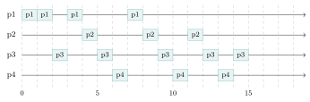{ .tikz loading=lazy }

    **4.** On boucle tant qu’il reste un processus à créer ou un processus dans la file. `ordo.temps` est le cycle en cours (il est incrémenté par `tourniquet`) ; `max(depart_proc)` est la plus grande *clé* du dictionnaire, c’est-à-dire la date de création du dernier processus (ici $3$) :

    ```python
    ordo = Ordonnanceur()
    while ordo.temps <= max(depart_proc) or not ordo.file.est_vide():
        if ordo.temps in depart_proc:
            ordo.ajoute_nouveau_processus(depart_proc[ordo.temps])
        print(ordo.tourniquet())
    ```

    Ce programme affiche successivement `p1`, `p1`, `p3`, `p1`, `p2`, …, `p3` (la suite de la question 3).

    **5.** On suit le chronogramme de l’exemple, une instruction par cycle d’exécution : cycle $0$, D acquiert le **fichier** ; cycle $1$, D calcule ; cycle $2$, B acquiert le **clavier** ; cycle $3$, D demande le clavier, détenu par B : **D se bloque** ; cycle $4$, A acquiert le GPU ; cycle $5$, B demande le fichier, détenu par D : **B se bloque**. B attend le fichier tenu par D, et D attend le clavier tenu par B : c’est une attente circulaire, donc un **interblocage** (aucun des deux ne libérera jamais sa ressource).

### <span class="stars" title="Niveau 3 sur 3">★★★</span> <span class="exo-num">Exercice 14</span> — Type bac — Une application de streaming *(d’après Amérique du Nord 2026, jour 2)* <span class="ia ia-orange" title="IA en appui : déboguer, reformuler, vérifier ; la réponse finale est la vôtre"></span> { #ex-04-14 }

Un système d’exploitation exécute plusieurs applications « à la fois » en répartissant le temps de calcul du processeur entre les différents processus, qui s’exécutent chacun à leur tour très rapidement. Même si un seul processus utilise réellement le processeur à un instant donné, cette alternance rapide donne l’impression que tout s’exécute en même temps. Lorsque le système interrompt un processus pour en exécuter un autre, on parle de *préemption*.

**Partie A**

1.  Recopier et compléter le schéma ci-dessous avec les termes : « élu », « prêt », « bloqué », « élection », « blocage », « déblocage ».

    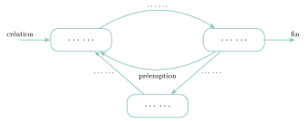{ .tikz loading=lazy }

Une application de streaming musical se compose de trois processus : P1 gère l’interface utilisateur (listes de morceaux, boutons lecture-pause…) ; P2 télécharge la musique et l’écrit dans une mémoire cache locale ; P3, le *lecteur audio*, décode la musique et envoie le flux au système pour lecture. Dans la situation suivante : l’utilisateur a mis l’application en arrière-plan, cachant l’interface ; P2 attend un accès à la carte Wi-Fi pour recharger des données ; P3 décode de la musique et l’envoie au système.

1.  Indiquer l’état de chacun des trois processus P1, P2 et P3 dans cette situation.

2.  Expliquer, de façon générale, quand un interblocage de processus peut survenir.

On considère quatre ressources : un processeur graphique (GPU), un microphone (MIC), une caméra (CAM) et un processeur dédié au calcul (CAL), chacune utilisable par un seul processus à la fois. Quatre processus P1, P2, P3 et P4 les demandent dans l’ordre suivant :

|    **P1**    |    **P2**    |    **P3**    |    **P4**    |
|:------------:|:------------:|:------------:|:------------:|
| demander MIC | demander CAL | demander CAM | demander GPU |
| demander CAL | demander MIC | libérer CAM  | demander CAL |
| libérer CAL  | libérer MIC  | demander CAL | demander CAM |
| libérer MIC  | libérer CAL  | demander MIC | libérer CAM  |
| demander CAM | demander CAM | libérer MIC  | libérer CAL  |
| demander GPU | libérer CAM  | libérer CAL  | demander MIC |
| libérer CAM  |              | demander GPU | libérer GPU  |
| libérer GPU  |              | libérer GPU  | libérer MIC  |

1.  Les processus s’exécutent de manière concurrente. Justifier qu’une situation d’interblocage peut se produire.

    ??? pouce "Coup de pouce"

        Il suffit d’*un* scénario : chercher deux processus qui détiennent chacun une ressource que l’autre demande ensuite.

**Partie B**

On s’intéresse à un ordonnanceur de type tourniquet dont le *quantum* vaut $2$ ms. Chaque processus défilé de la file d’attente s’exécute pendant une durée au plus égale au quantum : s’il termine avant ou à la fin du quantum, un autre processus est défilé et bénéficie d’un nouveau quantum ; sinon, il est remis en queue de la file d’attente. D’autres processus peuvent être ajoutés à la file au fur et à mesure de leur arrivée.

| Processus | Instant d’arrivée | Temps d’exécution total |
|:---------:|:-----------------:|:-----------------------:|
|    P1     |       0 ms        |          6 ms           |
|    P2     |       1 ms        |          4 ms           |
|    P3     |       3 ms        |          5 ms           |
|    P4     |       5 ms        |          3 ms           |

1.  Recopier et compléter le chronogramme suivant, en indiquant quel processus utilise le processeur à chaque instant, de $0$ ms à la fin de l’exécution de tous les processus (P1 s’exécute déjà entre $0$ et $2$ ms ; les flèches indiquent les instants d’arrivée).

    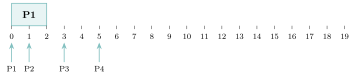{ .tikz loading=lazy }

En Python, chaque processus est un dictionnaire de clés `’nom’`, `’arrivee’` et `’temps’` (temps d’exécution *restant*, en ms) :

```python
P1 = {'nom': 'P1', 'arrivee': 0, 'temps': 6}
P2 = {'nom': 'P2', 'arrivee': 1, 'temps': 4}
P3 = {'nom': 'P3', 'arrivee': 3, 'temps': 5}
P4 = {'nom': 'P4', 'arrivee': 5, 'temps': 3}
quantum = 2
```

On dispose d’une implémentation de file : `creer_file_vide()` renvoie une file vide ; `est_vide(f)` renvoie un booléen ; `enfiler(f, e)` ajoute `e` en queue de `f` (et renvoie `None`) ; `defiler(f)` enlève l’élément de tête de `f` et le renvoie.

1.  Donner les instructions qui créent une file `fp` contenant les processus `P1`, `P2`, `P3` et `P4` classés par ordre d’arrivée, le premier arrivé étant en tête de la file.

La fonction `execute_un_processus` réalise une étape du tourniquet : elle prend une file de processus non vide `file_d_attente` et l’instant `t` de début de l’étape ; elle extrait de la file le processus à exécuter, le remet si besoin dans la file avec son temps d’exécution restant, et renvoie l’instant où l’étape se termine (fin du processus ou fin du quantum).

1.  <span class="run" title="À programmer et tester sur machine">▶</span>  Recopier et compléter le code de la fonction `execute_un_processus`.

    ??? pouce "Coup de pouce"

        Question 5 : écrire le contenu de la file à chaque fin de quantum, arrivées comprises. Question 7 : comparer le temps restant au quantum ; il y a deux cas, selon que le processus termine ou non pendant ce quantum.

    ??? pouce "Coup de pouce 2 (début de solution)"

        Question 7 : le test est `if processus[’temps’] > quantum:` ; dans ce cas, on retire un quantum au temps restant et on remet le processus en queue de file. Question 8 : la boucle tourne tant que la file n’est pas vide, et `t` reçoit la valeur renvoyée par `execute_un_processus`.

    ```python
    def execute_un_processus(file_d_attente, t):
        processus = defiler(file_d_attente)
        if processus['temps'] ... quantum:
            processus['temps'] = ...
            ...
            return t + ...
        else:
            return t + ...
    ```

On suppose désormais que tous les processus sont déjà arrivés (ils sont tous dans la file prise en entrée) : on ne tient plus compte des instants d’arrivée, et l’exécution commence à l’instant $0$. La fonction `execute_tous_processus` simule le tourniquet jusqu’à ce que tous les processus soient terminés et renvoie l’instant où se termine la dernière exécution.

1.  <span class="run" title="À programmer et tester sur machine">▶</span>  Recopier et compléter le code de la fonction `execute_tous_processus`.

    ```python
    def execute_tous_processus(file_d_attente):
        t = 0
        while ...
            t = ...
        return t
    ```

??? corrige "Corrigé"

    **Partie A.** **1.** Les trois états : à gauche **prêt**, à droite **élu**, en bas **bloqué**. Flèche prêt $\to$ élu : **élection** ; élu $\to$ bloqué : **blocage** ; bloqué $\to$ prêt : **déblocage**.

    **2.** P1 (interface cachée, en attente d’une action de l’utilisateur) : **bloqué**. P2 (attend la carte Wi-Fi) : **bloqué**. P3 (décode et envoie la musique) : **élu** — il s’exécute (sur un monoprocesseur, il alterne en réalité entre élu et prêt).

    **3.** Un interblocage survient lorsque plusieurs processus attendent chacun une ressource **détenue par un autre** processus du groupe, de façon **circulaire** : aucun ne peut avancer, donc aucun ne libère ce qu’il tient.

    **4.** Il suffit d’un scénario : P1 obtient le MIC (« demander MIC »), puis P2 obtient le CAL (« demander CAL »). Ensuite P1 demande le CAL (tenu par P2) et se bloque, et P2 demande le MIC (tenu par P1) et se bloque. Chacun attend la ressource de l’autre : interblocage. (On en trouve d’autres, par exemple P3 qui tient CAL et demande MIC pendant que P1 tient MIC et demande CAL.)

    **Partie B.** **5.** Les arrivées se placent en fin de file ; un processus préempté y revient après les processus arrivés pendant son quantum :

    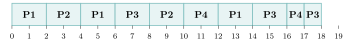{ .tikz loading=lazy }

    P2 se termine à $10$ ms, P1 à $14$ ms, P4 à $17$ ms et P3 à $18$ ms.

    **6.**

    ```python
    fp = creer_file_vide()
    enfiler(fp, P1)
    enfiler(fp, P2)
    enfiler(fp, P3)
    enfiler(fp, P4)
    ```

    **7.** Si le temps restant dépasse le quantum, le processus consomme un quantum et repart en queue de file ; sinon il se termine.

    ```python
    def execute_un_processus(file_d_attente, t):
        processus = defiler(file_d_attente)
        if processus['temps'] > quantum:
            processus['temps'] = processus['temps'] - quantum
            enfiler(file_d_attente, processus)
            return t + quantum
        else:
            return t + processus['temps']
    ```

    **8.**

    ```python
    def execute_tous_processus(file_d_attente):
        t = 0
        while not est_vide(file_d_attente):
            t = execute_un_processus(file_d_attente, t)
        return t
    ```

    Avec la file `fp`, l’appel renvoie $18$ : la somme des temps d’exécution ($6+4+5+3$), puisque le processeur n’est jamais inoccupé.

### <span class="stars" title="Niveau 3 sur 3">★★★</span> <span class="exo-num">Exercice 15</span> — Type bac — Des files de priorité pour l’ordonnanceur *(d’après Asie 2025, jour 2)* <span class="ia ia-orange" title="IA en appui : déboguer, reformuler, vérifier ; la réponse finale est la vôtre"></span> { #ex-04-15 }

On souhaite élaborer un programme système qui gère l’ordre d’exécution des processus sur le processeur.

1.  Donner le nom de ce type de programme.

2.  Donner les différents états possibles d’un processus.

Chaque processus dispose d’une **valeur de priorité**. Un processus est prioritaire sur un autre si sa valeur de priorité est **plus petite**. Ainsi, pour rendre un processus moins prioritaire, on augmente sa valeur de priorité (par exemple de $2$ à $3$).

*Fonctionnement du programme.* On dispose d’une liste dont les éléments sont des files de processus : la première file contient les processus de valeur de priorité $0$ (la plus élevée), la seconde ceux de valeur $1$, etc.

- **À l’arrivée d’un nouveau processus :** lui attribuer la valeur de priorité $0$ et le placer dans la file correspondante (la première file de la liste).

- **À chaque cycle d’horloge :**

  - s’il n’y a pas de processus en cours d’exécution et s’il reste des processus en attente : sélectionner un processus de priorité la plus élevée dans l’une des files non vides, et l’élire comme processus en cours d’exécution ;

  - sinon, si un processus est en cours d’exécution :

    - si le processus a terminé son exécution, le retirer du processeur ;

    - sinon, incrémenter son temps d’utilisation, puis :

      - si des processus de priorité supérieure ou égale attendent : retirer le processus en cours du processeur, réduire sa priorité de $1$ et le mettre dans la file correspondant à sa nouvelle priorité, puis élire un processus de priorité la plus élevée parmi les files non vides ;

      - sinon, réduire sa priorité de $1$ et continuer à exécuter le processus en cours.

1.  Parmi les structures *liste*, *file* et *pile*, donner la plus adaptée pour stocker les processus d’une même priorité.

Un processus est représenté par une classe `Processus` d’attributs `PID` (identifiant), `priorite`, `temps_utilisation` (temps passé sur le processeur) et `temps_CPU` (temps nécessaire à son exécution).

1.  Recopier et compléter le constructeur de la classe `Processus` :

    ```python
    class Processus:
        ...(self, ..., priorite, temps_CPU):
            ... priorite = priorite
            ... PID = ...
            self.temps_utilisation = 0
            self.temps_CPU = temps_CPU
    ```

2.  On considère les trois processus suivants :

    ```python
    P1 = Processus(PID=1, priorite=0, temps_CPU=10)
    P2 = Processus(PID=2, priorite=0, temps_CPU=7)
    P3 = Processus(PID=3, priorite=0, temps_CPU=5)
    ```

    On a donc `liste_files = [[P3, P2, P1], [], []]` (dans chaque file, la tête est à droite). Recopier et compléter la simulation suivante, où `CPU` désigne le processus en cours d’exécution :

    ```text
    Cycle 1: CPU=P1     liste_files=[[P3, P2], [], []]
    Cycle 2: CPU=P2     liste_files=[[P3], [P1], []]
    Cycle 3: CPU=P3     liste_files=[[], [...], []]
    Cycle 4: CPU=P3     liste_files=[[], [...], []]
    Cycle 5: CPU=...    liste_files=[[], [...], [...]]
    ```

Pour les questions 6 et 7, on dispose d’un processus qui nécessite un temps d’utilisation de $1000$ pour se terminer, et d’un grand nombre de processus dont le temps d’utilisation est de $4$ ; chaque processus court terminé est remplacé par un nouveau processus similaire.

1.  Expliquer pourquoi le processus long risque de ne **jamais** se terminer avec ce programme (indiquer notamment sa priorité au bout de quelque temps).

Pour régler ce phénomène, on ajoute au processus l’attribut `temps_d_attente`, et on définit une constante `Max_Temps`, le temps maximal qu’un processus attend avant de voir sa priorité remonter : à chaque cycle, le `temps_d_attente` augmente, et s’il dépasse `Max_Temps`, la priorité du processus augmente.

1.  Expliquer pourquoi le processus long ne risque plus de ne jamais se terminer.

2.  <span class="run" title="À programmer et tester sur machine">▶</span>  Écrire une fonction `meilleur_priorite(liste_files)` qui renvoie `None` s’il n’y a plus de processus, et sinon la priorité de l’un des processus les plus prioritaires de la liste des files. Par exemple, si `p1`, `p2`, `p3` sont des instances de `Processus` et `liste_files = [[], [p2], [p3, p1]]`, l’appel `meilleur_priorite(liste_files)` renvoie `1`.

3.  <span class="run" title="À programmer et tester sur machine">▶</span>  Écrire une fonction `prioritaire(liste_files)` qui renvoie `None` si aucune file ne contient de processus, et sinon renvoie l’un des processus les plus prioritaires en le **supprimant** de la file où il se trouvait. On pourra utiliser `liste.pop(i)`, qui renvoie l’élément d’indice `i` de la liste tout en le supprimant.

4.  <span class="run" title="À programmer et tester sur machine">▶</span>  Écrire une fonction `gerer(p, liste_files)` qui prend le processus en cours d’exécution `p` (ou `None`) et la liste des files d’attente, qui implémente **un cycle** du programme décrit en début d’énoncé, et qui renvoie le processus en cours d’exécution à l’issue de ce cycle (ou `None`).

    ??? pouce "Coup de pouce"

        Question 5 : appliquer la règle cycle par cycle en notant la priorité de chaque processus. Question 8 : la priorité d’un processus est l’indice de sa file. Question 9 : réutiliser `meilleur_priorite` ; dans la simulation, la tête de chaque file est à droite. Question 10 : suivre l’énoncé ligne à ligne, un `if` par cas.

    ??? pouce "Coup de pouce 2 (début de solution)"

        Question 8 : `for i in range(len(liste_files)):` puis renvoyer `i` dès qu’une file est non vide. Question 10 : commencer par `if p is None:` (processeur libre : on élit un processus avec `prioritaire`), puis traiter le cas où `p` a terminé.

??? corrige "Corrigé"

    **1.** Un **ordonnanceur**. **2.** Élu, prêt, bloqué. **3.** Une **file** : parmi les processus de même priorité, le premier arrivé doit être le premier servi.

    **4.**

    ```python
    class Processus:
        def __init__(self, PID, priorite, temps_CPU):
            self.priorite = priorite
            self.PID = PID
            self.temps_utilisation = 0
            self.temps_CPU = temps_CPU
    ```

    **5.** Au cycle $3$, P2 (préempté par P3, de même priorité $0$) passe en priorité $1$, derrière P1. Au cycle $4$, aucun processus en attente n’a une priorité supérieure ou égale à celle de P3 ($0$) : P3 continue, et sa valeur de priorité passe à $1$. Au cycle $5$, P1 et P2 (priorité $1$) attendent : P3 est retiré, passe en priorité $2$, et P1 (tête de la file $1$) est élu.

    ```text
    Cycle 3: CPU=P3     liste_files=[[], [P2, P1], []]
    Cycle 4: CPU=P3     liste_files=[[], [P2, P1], []]
    Cycle 5: CPU=P1     liste_files=[[], [P2], [P3]]
    ```

    **6.** À chaque cycle passé sur le processeur, la valeur de priorité du processus long augmente de $1$ : au bout de quelque temps, elle est très grande (il est très peu prioritaire). Or les processus courts arrivent sans cesse avec la priorité $0$ et, avec une durée de $4$, n’atteignent jamais une valeur de priorité élevée. Il y a toujours un processus plus prioritaire en attente : le processus long n’est plus jamais élu. C’est une **famine**.

    **7.** Pendant qu’il attend, le `temps_d_attente` du processus long augmente ; dès qu’il dépasse `Max_Temps`, sa priorité remonte, et ainsi de suite jusqu’à ce qu’elle rejoigne celle des processus courts. Il finit donc par être élu régulièrement, et son temps d’utilisation atteint $1000$ en un temps fini.

    **8.** La priorité d’un processus est l’indice de sa file : on renvoie l’indice de la première file non vide.

    ```python
    def meilleur_priorite(liste_files):
        for i in range(len(liste_files)):
            if liste_files[i] != []:
                return i
        return None
    ```

    **9.** La tête de chaque file est à droite (dernier élément de la liste Python), comme dans la simulation de la question 5.

    ```python
    def prioritaire(liste_files):
        i = meilleur_priorite(liste_files)
        if i is None:
            return None
        return liste_files[i].pop(len(liste_files[i]) - 1)
    ```

    **10.** Une version possible, qui renvoie le processus en cours à l’issue du cycle. On enfile à gauche (`insert(0, p)`) et on crée une nouvelle file si la priorité dépasse le nombre de files :

    ```python
    def placer(p, liste_files):
        while len(liste_files) <= p.priorite:
            liste_files.append([])
        liste_files[p.priorite].insert(0, p)

    def gerer(p, liste_files):
        if p is None:                                  # processeur libre
            return prioritaire(liste_files)
        if p.temps_utilisation == p.temps_CPU:         # p a termine
            return None
        p.temps_utilisation = p.temps_utilisation + 1
        m = meilleur_priorite(liste_files)
        if m is not None and m <= p.priorite:          # un processus au moins
            p.priorite = p.priorite + 1                # aussi prioritaire attend
            placer(p, liste_files)
            return prioritaire(liste_files)
        else:
            p.priorite = p.priorite + 1
            return p
    ```

    En partant de `p = None` et de `liste_files = [[P3, P2, P1], [], []]`, cinq appels successifs `p = gerer(p, liste_files)` reproduisent exactement la simulation de la question 5.

### Critiquer une réponse d’IA

### <span class="stars" title="Niveau 2 sur 3">★★</span> <span class="exo-num">Exercice 16</span> — Les états d’un processus expliqués par un assistant d’IA <span class="ia ia-vert" title="IA intégrée : l'exercice s'appuie sur une réponse d'IA"></span> { #ex-04-16 }

Un élève demande à un assistant d’IA : « Explique-moi les trois états d’un processus et les passages de l’un à l’autre. » Voici la réponse obtenue :

> « Un processus est un programme en cours d’exécution. Il passe par trois états. **Élu** : il utilise le processeur ; il n’y a qu’un seul processus élu à la fois par cœur. **Prêt** : il pourrait s’exécuter mais attend son tour, le processeur étant occupé. **Bloqué** : il attend une ressource (lecture disque, saisie clavier…) et ne peut pas avancer même si le processeur se libère. Les transitions sont les suivantes : l’ordonnanceur *élit* un processus prêt (prêt $\to$ élu) ; quand son quantum est écoulé, il est *réquisitionné* (élu $\to$ prêt) ; s’il demande une ressource indisponible, il se *bloque* (élu $\to$ bloqué) ; enfin, dès que la ressource attendue arrive, le processus bloqué *reprend immédiatement le processeur* (bloqué $\to$ élu), puisqu’il a déjà assez attendu. Un processus ne peut se terminer que depuis l’état élu. »

1.  La réponse est-elle correcte ? Pour le vérifier, considérer un cœur où $P_1$ est élu et $P_2$ bloqué en attente d’une lecture disque ; la lecture se termine. Que se passerait-il si la description de l’assistant était vraie ? Est-ce compatible avec « un seul élu à la fois » ?

2.  Localiser et corriger la phrase erronée (on redessinera l’automate des états).

3.  Quelle vérification simple, faite avant de faire confiance à la réponse, aurait suffi à détecter l’erreur ?

    ??? pouce "Coup de pouce"

        Reprendre l’automate des états du cours et confronter, une par une, chaque transition décrite par l’assistant. Pour la question 1, décrire l’état de $P_1$ et de $P_2$ juste après la fin de la lecture.

??? corrige "Corrigé"

    **1.** **Non.** Si $P_2$ passait directement de bloqué à élu à la fin de sa lecture, il y aurait **deux** processus élus sur le même cœur ($P_1$ et $P_2$), ce qui contredit « un seul élu à la fois » — ou alors $P_2$ « volerait » le processeur à $P_1$ sans décision de l’ordonnanceur. En réalité, $P_2$ redevient **prêt** et attend d’être élu à son tour.

    **2.** La phrase fautive est « *dès que la ressource attendue arrive, le processus bloqué reprend immédiatement le processeur (bloqué $\to$ élu)* ». Le cours dit l’inverse : « *Déblocage (bloqué $\to$ prêt) : la ressource arrive ; le processus ne repart pas directement en exécution, il redevient prêt et attend son tour* », et signale ce piège : « *on ne passe jamais de bloqué directement à élu* ». Les quatre transitions correctes : prêt $\to$ élu (élection), élu $\to$ prêt (fin de quantum), élu $\to$ bloqué (blocage), bloqué $\to$ prêt (déblocage). Le reste de la réponse (définition des trois états, unicité de l’élu, terminaison depuis l’état élu) est exact.

    **3.** Compter les **flèches** de l’automate décrit et les comparer à celles du cours : toute flèche qui *arrive* sur « élu » doit partir de « prêt », puisque seul l’ordonnanceur donne le processeur. Une transition qui contourne l’ordonnanceur est suspecte par construction.

### S’entraîner à l’oral

### <span class="stars" title="Niveau 2 sur 3">★★</span> <span class="exo-num">Exercice 17</span> — Expliquer en deux minutes <span class="ia ia-rouge" title="Sans IA : le but est l'automatisme lui-même"></span> { #ex-04-17 }

Au Grand Oral comme devant l’examinateur de l’épreuve pratique, il faut savoir **expliquer** une notion clairement, sans notes. Choisir l’un des sujets suivants (ou le tirer au sort) :

1.  Expliquer à un camarade la différence entre un **programme** et un **processus**.

2.  Expliquer comment un ordinateur qui n’a qu’un seul processeur donne l’impression d’exécuter plusieurs programmes en même temps.

3.  Expliquer ce qu’est un **interblocage**, avec un exemple concret.

**Préparation (5 min, seul).** Noter au brouillon **trois idées** et **un exemple**, rien de plus, puis retourner la feuille. **Exposé (2 min, chronométré).** Debout, face à un camarade, **sans lire de notes** : tout passe par la parole. **Retour (2 min).** Le camarade pose une question de relance (on peut alors s’aider d’un schéma), remplit la grille ci-dessous et donne un conseil ; puis on échange les rôles. Cette grille reprend les critères d’évaluation du Grand Oral.

??? pouce "Coup de pouce"

    Structurer chaque explication en trois temps : une **définition** en une phrase, un **exemple** petit et concret déroulé à voix haute, puis le **piège** (l’erreur que l’auditeur risque de faire). Finir par une phrase qui répond à la question posée. Sujet 2 : nommer les trois états d’un processus et dire qui décide du passage de l’un à l’autre. Sujet 3 : chercher deux processus et deux ressources.

<table>
<thead>
<tr>
<th style="text-align: left;"><strong>Grille entre camarades</strong></th>
<th style="text-align: center;"><strong>Oui</strong></th>
<th style="text-align: center;"><strong>En partie</strong></th>
<th style="text-align: center;"><strong>Pas encore</strong></th>
</tr>
</thead>
<tbody>
<tr>
<td style="text-align: left;"><strong>Clair</strong> — audible, posé ; chaque mot technique est expliqué</td>
<td style="text-align: center;"><span class="math inline">▫</span></td>
<td style="text-align: center;"><span class="math inline">▫</span></td>
<td style="text-align: center;"><span class="math inline">▫</span></td>
</tr>
<tr>
<td style="text-align: left;"><strong>Juste</strong> — c’est exact, et l’exemple montre vraiment l’idée</td>
<td style="text-align: center;"><span class="math inline">▫</span></td>
<td style="text-align: center;"><span class="math inline">▫</span></td>
<td style="text-align: center;"><span class="math inline">▫</span></td>
</tr>
<tr>
<td style="text-align: left;"><strong>Construit</strong> — un fil conducteur, tenu en deux minutes, sans lire</td>
<td style="text-align: center;"><span class="math inline">▫</span></td>
<td style="text-align: center;"><span class="math inline">▫</span></td>
<td style="text-align: center;"><span class="math inline">▫</span></td>
</tr>
<tr>
<td colspan="4" style="text-align: left;"><strong>Un conseil</strong> pour la prochaine fois :</td>
</tr>
</tbody>
</table>

??? corrige "Corrigé"

    Pas de texte à apprendre par cœur : voici les **éléments attendus** pour chaque sujet. L’ordre, les mots et l’exemple peuvent être différents ; l’explication est réussie si ces idées y sont, justes et reliées entre elles.

    **Sujet 1.**

    - **Programme** : un fichier d’instructions, inerte, stocké sur le disque.

    - **Processus** : un programme **en cours d’exécution**, avec son état (mémoire, registres, fichiers ouverts), identifié par un **PID**.

    - Exemple : lancer deux fois le même éditeur de texte donne un seul programme mais deux processus.

    - Piège : un processus peut en créer d’autres (relation père–fils) ; un même programme peut donc correspondre à plusieurs processus.

    **Sujet 2.**

    - Trois états : **prêt** (attend le processeur), **élu** (s’exécute), **bloqué** (attend une ressource, par exemple une lecture sur le disque).

    - L’**ordonnanceur** du système d’exploitation choisit à chaque instant le processus élu parmi les processus prêts ; avec le **tourniquet**, chacun reçoit un quantum de temps puis retourne en fin de file.

    - Exemple : trois processus et un quantum de quelques millisecondes : ils alternent si vite qu’ils semblent simultanés.

    - Piège : un processus bloqué ne redevient pas directement élu ; il repasse d’abord par l’état prêt.

    **Sujet 3.**

    - **Interblocage** : plusieurs processus s’attendent mutuellement, chacun détenant une ressource que l’autre demande ; aucun ne peut plus avancer.

    - Exemple : P1 détient l’imprimante et demande le scanner ; P2 détient le scanner et demande l’imprimante.

    - On le repère par un **cycle** dans le graphe d’attente.

    - Pour l’éviter : demander les ressources toujours dans le même ordre ; pour en sortir : arrêter l’un des processus. Piège : ce n’est pas le « bug » d’un seul programme, mais une interaction.
