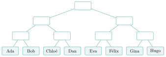
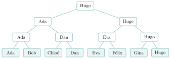
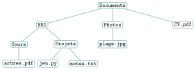

# Activités préparatoires

Arbres

## Activité 1 Un tournoi, des dossiers, une famille

*trois situations, une même forme*

Durée : 20 min · Sans ordinateur, par deux

!!! consignes "Consignes"

    - Pour chaque situation, on **dessine** d’abord, on répond ensuite, sur le cahier. Aucun mot de vocabulaire n’est attendu avant l’exercice 4 : c’est à vous de les inventer.

### Exercice 1 — Le tournoi  { #ex-05-arbres-act-1-1 }

Huit joueurs s’affrontent dans un tournoi à élimination directe : chaque match oppose deux joueurs, le perdant est éliminé. Résultats : au premier tour, Ada bat Bob, Dan bat Chloé, Eva bat Félix et Hugo bat Gina ; au deuxième tour, Ada bat Dan et Hugo bat Eva ; en finale, Hugo bat Ada.

{ .tikz loading=lazy }

1.  Recopier le tableau du tournoi sur le cahier et remplir chaque case vide avec le nom du vainqueur du match correspondant.

2.  Combien de matchs ont été joués en tout ? Combien de tours ?

3.  Même question avec $16$ joueurs, puis avec $64$ joueurs. Quelle relation entre le nombre de joueurs et le nombre de matchs ?

4.  Combien de matchs Hugo a-t-il joués ? Et un joueur éliminé au premier tour ?

??? corrige "Corrigé"

    1.  Tableau complété :

        { .tikz loading=lazy }

    2.  $7$ matchs ($4 + 2 + 1$) en $3$ tours.

    3.  $16$ joueurs : $15$ matchs en $4$ tours ; $64$ joueurs : $63$ matchs en $6$ tours. Chaque match élimine **exactement un** joueur et il faut en éliminer tous sauf un : avec $n$ joueurs, il y a $n - 1$ matchs. Le nombre de tours est l’exposant de $2$ : $2^3 = 8$, $2^4 = 16$, $2^6 = 64$ (c’est $\log_2 n$) ; chaque tour divise par deux le nombre de joueurs restants.

    4.  Hugo a joué $3$ matchs (un par tour) ; un joueur éliminé au premier tour n’en a joué qu’un. Le vainqueur est relié aux joueurs du bas par un chemin de $3$ traits.

### Exercice 2 — Les dossiers  { #ex-05-arbres-act-1-2 }

Sur l’ordinateur d’un élève : le dossier `Documents` contient les dossiers `NSI` et `Photos`, ainsi que le fichier `CV.pdf`. Le dossier `NSI` contient les dossiers `Cours` et `Projets`. `Cours` contient `arbres.pdf` ; `Projets` contient `jeu.py` et `notes.txt` ; `Photos` contient `plage.jpg`.

1.  Représenter ce contenu par un dessin sur le cahier, en plaçant `Documents` tout en haut et en reliant chaque élément à ce qu’il contient directement.

2.  Un camarade propose de tout ranger dans la liste `["Documents", "NSI", "Photos", "CV.pdf", "Cours", …]`. Quelle information perd-on ?

3.  Combien de « marches » faut-il descendre pour aller de `Documents` à `jeu.py` ? Quel élément est le plus loin de `Documents` ?

4.  Quelle différence voyez-vous entre ce dessin et celui du tournoi, quant au nombre de traits qui partent d’un même élément vers le bas ?

??? corrige "Corrigé"

    1.  Dessin attendu :

        { .tikz loading=lazy }

    2.  On perd **qui est dans qui** : la liste dit quels éléments existent, mais plus que `jeu.py` est dans `Projets`, lui-même dans `NSI`. Une structure « en ligne » ne sait pas représenter une hiérarchie.

    3.  $3$ marches : `Documents` $\to$ `NSI` $\to$ `Projets` $\to$ `jeu.py`. Les plus éloignés sont `arbres.pdf`, `jeu.py` et `notes.txt` (à $3$ marches).

    4.  Dans le tournoi, chaque case a **exactement deux** traits vers le bas (ou aucun, pour un joueur du premier tour). Dans les dossiers, un élément peut en avoir **trois** (`Documents`), un seul (`Cours`) ou aucun (un fichier).

### Exercice 3 — La famille  { #ex-05-arbres-act-1-3 }

L’arbre généalogique d’Ada remonte vers ses ancêtres : Ada a deux parents, chacun a deux parents, et ainsi de suite.

1.  Combien Ada a-t-elle de grands-parents ? d’arrière-grands-parents ? Combien d’ancêtres à la $10^\text{e}$ génération au-dessus d’elle (si tous sont distincts) ?

2.  Dans un arbre généalogique, Ada est souvent dessinée tout en bas. Si l’on dessine Ada tout en haut, comme `Documents` et le vainqueur du tournoi, quel point commun apparaît avec le tournoi ?

??? corrige "Corrigé"

    1.  $4$ grands-parents, $8$ arrière-grands-parents ; à la $10^\text{e}$ génération, $2^{10} = 1\,024$ ancêtres (en réalité moins, car certains ancêtres se répètent : la « famille » cesse alors d’être un arbre).

    2.  Comme au tournoi, chaque personne est reliée vers le bas à exactement **deux** éléments (ses deux parents) : le nombre d’éléments double à chaque étage. On retrouve la même forme, sans le « vainqueur ».

### Exercice 4 — Inventer le vocabulaire  { #ex-05-arbres-act-1-4 }

1.  Ces dessins ressemblent à un arbre retourné. Sur le cahier, proposer un nom pour chacune des notions suivantes (un mot ou deux), en vous inspirant de l’image de l’arbre ou de celle de la famille.

    1.  l’élément tout en haut, au-dessus duquel il n’y a rien ;

    2.  un élément tout en bas, en dessous duquel il n’y a rien ;

    3.  pour un élément : celui qui est juste au-dessus / ceux qui sont juste en dessous ;

    4.  un élément avec tout ce qui se trouve en dessous de lui ;

    5.  le nombre total d’éléments du dessin ;

    6.  le nombre d’étages du dessin.

??? corrige "Corrigé"

    1.  Propositions possibles, puis mots du cours :

        | **Notion** | **Propositions fréquentes** | **Mot du cours** |
        |:---|:---|:---|
        | élément tout en haut | sommet, chef, tronc | **racine** |
        | élément tout en bas | bout, extrémité | **feuille** |
        | juste au-dessus / juste en dessous | parent / enfant | **père** / **fils** |
        | un élément et tout ce qui est en dessous | branche, sous-dossier | **sous-arbre** |
        | nombre total d’éléments | nombre, effectif | **taille** |
        | nombre d’étages | niveaux, profondeur | **hauteur** |

        « Enfant » se dit aussi en informatique ; le trait entre deux éléments s’appellera une **arête**.

### Exercice 5 — Ce qu’on a découvert  { #ex-05-arbres-act-1-5 }

1.  Recopier et compléter sur le cahier, avec vos mots.

    - Dans les trois situations, chaque élément (sauf celui du haut) …

    - Une simple liste ne suffit pas, car …

    - Le tournoi et la famille ont une particularité que les dossiers n’ont pas : …

??? corrige "Corrigé"

    1.  Chaque élément, sauf celui du haut, est relié à **un seul** élément au-dessus de lui. Une liste ne suffit pas, car elle range les éléments **à la suite** et perd la relation « est dans » / « descend de ». Le tournoi et la famille ont **au plus deux** éléments sous chaque élément.
