# Exercices

<p class="sous-titre">Arbres</p>

!!! consignes "Mode d’emploi"

    - Niveau : ★ échauffement, ★★ classique (niveau bac), ★★★ défi ; les *coups de pouce* et les *corrigés* se déplient sous chaque exercice.

    - <span class="run" title="À programmer et tester sur machine">▶</span> *À programmer et tester* en Python.

    - On **admet** l’implémentation par la classe `Noeud` ci-dessous ; l’arbre vide est `None`.

    - **Convention** de hauteur : on compte les **nœuds** (racine seule $\to$ hauteur $1$, arbre vide $\to$ $0$), sauf mention contraire.

    - Usage de l’IA, indiqué sur chaque exercice : <span class="ia ia-rouge" title="Sans IA : le but est l'automatisme lui-même"></span> aucune ; <span class="ia ia-orange" title="IA en appui : déboguer, reformuler, vérifier ; la réponse finale est la vôtre"></span> en appui (déboguer, reformuler, vérifier ; la réponse finale est écrite et comprise par vous) ; <span class="ia ia-vert" title="IA intégrée : l'exercice s'appuie sur une réponse d'IA"></span> l’exercice s’appuie sur une réponse d’IA. Voir la [charte d’usage de l’IA](../charte.md).

    ```python
    class Noeud:
        def __init__(self, valeur, gauche=None, droite=None):
            self.valeur = valeur
            self.gauche = gauche       # un Noeud, ou None
            self.droite = droite       # un Noeud, ou None
    ```

### Lire un arbre

### <span class="stars" title="Niveau 1 sur 3">★</span> <span class="exo-num">Exercice 1</span> — Vocabulaire <span class="ia ia-rouge" title="Sans IA : le but est l'automatisme lui-même"></span> { #ex-05-1 }

On considère l’arbre binaire suivant.

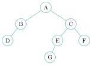{ .tikz loading=lazy }

1.  Donner la **racine**, puis la liste des **feuilles**.

2.  Donner la **taille** et la **hauteur** de l’arbre.

3.  Quel est le **père** de `G` ? Quels sont les **fils** de `C` ?

4.  Donner la **profondeur** du nœud `E`.

5.  Décrire le **sous-arbre** de racine `C` (ses nœuds).

??? corrige "Corrigé"

    **1.** Racine : `A`. Feuilles : `D`, `G`, `F`. **2.** Taille $= 7$ ; hauteur $= 4$ (chemin `A--C--E--G`).  
    **3.** Père de `G` : `E`. Fils de `C` : `E` et `F`. **4.** Profondeur de `E` : $2$ (deux arêtes : `A--C--E` ; la racine est à la profondeur $0$). **5.** Sous-arbre de racine `C` : les nœuds `C`, `E`, `F`, `G`.

### <span class="stars" title="Niveau 1 sur 3">★</span> <span class="exo-num">Exercice 2</span> — Construire à partir d’une description <span class="ia ia-rouge" title="Sans IA : le but est l'automatisme lui-même"></span> { #ex-05-2 }

<span class="run" title="À programmer et tester sur machine">▶</span> Dessiner l’arbre `a = Noeud(5, Noeud(3, Noeud(2)), Noeud(8, None, Noeud(9)))`, puis donner sa taille et sa hauteur.

??? corrige "Corrigé"

    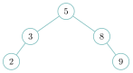{ .tikz loading=lazy }

    Taille $= 5$, hauteur $= 3$.

### Mesurer un arbre

### <span class="stars" title="Niveau 1 sur 3">★</span> <span class="exo-num">Exercice 3</span> — Taille <span class="ia ia-orange" title="IA en appui : déboguer, reformuler, vérifier ; la réponse finale est la vôtre"></span> { #ex-05-3 }

<span class="run" title="À programmer et tester sur machine">▶</span> Écrire une fonction récursive `taille(a)` qui renvoie le nombre de nœuds de l’arbre `a`. *(Rappel : l’arbre vide `None` a pour taille `0`.)*

??? corrige "Corrigé"

    ```python
    def taille(a):
        if a is None:
            return 0
        return 1 + taille(a.gauche) + taille(a.droite)
    ```

### <span class="stars" title="Niveau 2 sur 3">★★</span> <span class="exo-num">Exercice 4</span> — Hauteur <span class="ia ia-orange" title="IA en appui : déboguer, reformuler, vérifier ; la réponse finale est la vôtre"></span> { #ex-05-4 }

<span class="run" title="À programmer et tester sur machine">▶</span> Écrire une fonction récursive `hauteur(a)` qui renvoie la hauteur de `a` (convention : compter les nœuds ; l’arbre vide a pour hauteur `0`).

<span class="run" title="À programmer et tester sur machine">▶</span> Un sujet de bac définit la hauteur en comptant les **arêtes** (une feuille seule a pour hauteur $0$). Écrire `hauteur_aretes(a)` selon cette convention. Quelle valeur faut-il donner à l’arbre vide ?

??? pouce "Coup de pouce"

    Condition d’arrêt : l’arbre vide. Sinon, la hauteur se déduit de la plus **grande** des hauteurs des deux sous-arbres (fonction `max`). Pour les arêtes : quelle valeur donner à l’arbre vide pour qu’une feuille obtienne la hauteur $0$ avec la même formule ?

??? corrige "Corrigé"

    ```python
    def hauteur(a):
        if a is None:
            return 0
        return 1 + max(hauteur(a.gauche), hauteur(a.droite))
    ```

    Avec la convention des arêtes, seul le cas de base change : l’arbre vide vaut $-1$, pour qu’une feuille vaille $1 + \max(-1, -1) = 0$.

    ```python
    def hauteur_aretes(a):
        if a is None:
            return -1
        return 1 + max(hauteur_aretes(a.gauche), hauteur_aretes(a.droite))
    ```

### <span class="stars" title="Niveau 2 sur 3">★★</span> <span class="exo-num">Exercice 5</span> — Nombre de feuilles <span class="ia ia-orange" title="IA en appui : déboguer, reformuler, vérifier ; la réponse finale est la vôtre"></span> { #ex-05-5 }

<span class="run" title="À programmer et tester sur machine">▶</span> Écrire une fonction `nb_feuilles(a)` qui renvoie le nombre de feuilles de `a`. *(Un nœud est une feuille si ses deux fils sont `None`.)*

??? pouce "Coup de pouce"

    Deux cas immédiats : l’arbre vide, et le nœud qui est lui-même une feuille. Dans les autres cas, que faire des nombres de feuilles des deux sous-arbres ?

??? corrige "Corrigé"

    ```python
    def nb_feuilles(a):
        if a is None:
            return 0
        if a.gauche is None and a.droite is None:
            return 1
        return nb_feuilles(a.gauche) + nb_feuilles(a.droite)
    ```

### Parcourir un arbre

### <span class="stars" title="Niveau 1 sur 3">★</span> <span class="exo-num">Exercice 6</span> — Les quatre parcours <span class="ia ia-rouge" title="Sans IA : le but est l'automatisme lui-même"></span> { #ex-05-6 }

On considère l’arbre suivant.

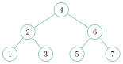{ .tikz loading=lazy }

Donner l’ordre de visite des nœuds pour les parcours : **préfixe**, **infixe**, **suffixe**, et **en largeur**. Que remarque-t-on pour le parcours infixe ?

??? corrige "Corrigé"

    - préfixe : `4, 2, 1, 3, 6, 5, 7`

    - infixe : `1, 2, 3, 4, 5, 6, 7`

    - suffixe : `1, 3, 2, 5, 7, 6, 4`

    - largeur : `4, 2, 6, 1, 3, 5, 7`

    Le parcours **infixe** donne les valeurs **triées par ordre croissant** : cet arbre est en fait un **ABR**.

### <span class="stars" title="Niveau 2 sur 3">★★</span> <span class="exo-num">Exercice 7</span> — Programmer les parcours en profondeur <span class="ia ia-orange" title="IA en appui : déboguer, reformuler, vérifier ; la réponse finale est la vôtre"></span> { #ex-05-7 }

<span class="run" title="À programmer et tester sur machine">▶</span> Écrire une fonction `prefixe(a)` qui **affiche** les valeurs de `a` dans l’ordre préfixe. Indiquer ensuite la (seule) ligne à déplacer pour obtenir le parcours **infixe**, puis le parcours **suffixe**.

??? pouce "Coup de pouce"

    Condition d’arrêt : l’arbre vide, on n’affiche rien. Sinon, trois instructions : afficher la racine, parcourir le sous-arbre gauche, parcourir le sous-arbre droit. Dans quel ordre pour le préfixe ?

??? corrige "Corrigé"

    ```python
    def prefixe(a):
        if a is not None:
            print(a.valeur)       # <-- pour l'infixe : deplacer cette ligne ICI...
            prefixe(a.gauche)
            prefixe(a.droite)     # ...(entre les deux appels) ; pour le suffixe : APRES
    ```

    **Infixe** : placer `print(a.valeur)` *entre* `prefixe(a.gauche)` et `prefixe(a.droite)`. **Suffixe** : placer `print(a.valeur)` *après* les deux appels.

### <span class="stars" title="Niveau 3 sur 3">★★★</span> <span class="exo-num">Exercice 8</span> — Défi — parcours en largeur <span class="ia ia-orange" title="IA en appui : déboguer, reformuler, vérifier ; la réponse finale est la vôtre"></span> { #ex-05-8 }

<span class="run" title="À programmer et tester sur machine">▶</span> Écrire une fonction `largeur(a)` qui affiche les valeurs de `a` **niveau par niveau**, de gauche à droite. On s’appuiera sur une `File` (interface `enfiler`, `defiler`, `est_vide`). *(On admet la classe `File`.)*

??? pouce "Coup de pouce"

    Pas de récursivité ici. On enfile la racine ; puis, tant que la file n’est pas vide, on défile un nœud, on l’affiche et on enfile ses fils non vides, le gauche d’abord.

??? pouce "Coup de pouce 2 (début de solution)"

    `def largeur(a):`  
    `if a is None:`  
    `return`  
    `f = File()`  
    `f.enfiler(a)`  
    `while not f.est_vide():`

??? corrige "Corrigé"

    ```python
    def largeur(a):
        if a is None:
            return
        f = File()
        f.enfiler(a)
        while not f.est_vide():
            n = f.defiler()
            print(n.valeur)
            if n.gauche is not None:
                f.enfiler(n.gauche)
            if n.droite is not None:
                f.enfiler(n.droite)
    ```

### Arbres binaires de recherche

### <span class="stars" title="Niveau 2 sur 3">★★</span> <span class="exo-num">Exercice 9</span> — Insérer dans un ABR <span class="ia ia-rouge" title="Sans IA : le but est l'automatisme lui-même"></span> { #ex-05-9 }

On part de l’arbre binaire de recherche suivant.

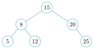{ .tikz loading=lazy }

1.  Redessiner l’arbre après insertion, **dans cet ordre**, des valeurs `10`, `18` puis `2`.

    ??? pouce "Coup de pouce"

        Pour chaque valeur, partir de la racine et descendre : à gauche si la valeur est plus petite que le nœud, à droite sinon (y compris en cas d’égalité : convention du cours), jusqu’à trouver une place vide. Une nouvelle valeur devient toujours une feuille.

2.  Quel parcours de l’ABR obtenu affiche les valeurs dans l’ordre **croissant** ?

??? corrige "Corrigé"

    **1.** `10` : $<15$ (gauche), $>8$ (droite), $<12$ (gauche) $\to$ fils gauche de `12`. `18` : $>15$, $<20$ $\to$ fils gauche de `20`. `2` : $<15$, $<8$, $<5$ $\to$ fils gauche de `5`.

    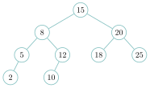{ .tikz loading=lazy }

    **2.** Le parcours **infixe** (gauche, racine, droite) affiche les valeurs par ordre croissant.

### <span class="stars" title="Niveau 2 sur 3">★★</span> <span class="exo-num">Exercice 10</span> — Rechercher dans un ABR <span class="ia ia-orange" title="IA en appui : déboguer, reformuler, vérifier ; la réponse finale est la vôtre"></span> { #ex-05-10 }

<span class="run" title="À programmer et tester sur machine">▶</span> Écrire une fonction récursive `recherche(a, x)` qui renvoie `True` si la valeur `x` est présente dans l’**ABR** `a`, `False` sinon, en profitant de l’ordre de l’ABR (on ne parcourt **pas** tout l’arbre). Combien de comparaisons, au maximum, pour un ABR de hauteur `h` ?

??? pouce "Coup de pouce"

    Comparer `x` à la racine : trois cas. Un seul appel récursif, du côté où `x` peut encore se trouver. Pour le coût : combien de nœuds au plus sur un chemin de la racine à une feuille ?

??? corrige "Corrigé"

    ```python
    def recherche(a, x):
        if a is None:
            return False
        if x == a.valeur:
            return True
        if x < a.valeur:
            return recherche(a.gauche, x)   # les plus petits sont a gauche
        else:
            return recherche(a.droite, x)   # les plus grands sont a droite
    ```

    *Autre méthode :* comme il n’y a qu’**un seul** appel récursif, on peut aussi descendre avec une boucle : tant qu’on n’est pas sorti de l’arbre, on compare et on part à gauche ou à droite.

    ```python
    def recherche(a, x):
        while a is not None:
            if x == a.valeur:
                return True
            if x < a.valeur:
                a = a.gauche
            else:
                a = a.droite
        return False
    ```

    Au plus **`h` comparaisons** (une par niveau), où `h` est la hauteur de l’arbre.

### <span class="stars" title="Niveau 2 sur 3">★★</span> <span class="exo-num">Exercice 11</span> — Programmer l’insertion dans un ABR <span class="ia ia-orange" title="IA en appui : déboguer, reformuler, vérifier ; la réponse finale est la vôtre"></span> { #ex-05-11 }

On reprend la classe `Noeud` du cours. Convention du cours : une valeur **égale** à celle du nœud va **à droite**.

1.  <span class="run" title="À programmer et tester sur machine">▶</span> Écrire une fonction récursive `inserer(a, x)` qui insère `x` à sa place dans l’ABR `a` et **renvoie** l’arbre obtenu.

    ??? pouce "Coup de pouce"

        Trois cas : arbre vide (on renvoie un nouveau `Noeud(x)`) ; `x` plus petit que la racine (on insère à gauche) ; sinon (on insère à droite). Ne pas oublier de **réaffecter** le sous-arbre modifié, puis de renvoyer `a`.

    ??? pouce "Coup de pouce 2 (début de solution)"

        `if x < a.valeur:`  
        `a.gauche = inserer(a.gauche, x)`

2.  <span class="run" title="À programmer et tester sur machine">▶</span> Partant de l’arbre vide, insérer dans cet ordre `5`, `3`, `8`, `3`, `9`, `5`. Dessiner l’ABR obtenu : où sont placés les deux doublons ? Vérifier que le parcours infixe donne les valeurs triées.

3.  <span class="run" title="À programmer et tester sur machine">▶</span> En déduire une fonction `tri_abr(t)` qui renvoie une nouvelle liste contenant les valeurs de la liste `t` triées (doublons compris), à l’aide d’un ABR.

    ??? pouce "Coup de pouce"

        Insérer toutes les valeurs, puis écrire une variante du parcours infixe qui **renvoie une liste** : `infixe(a.gauche) + [a.valeur] + infixe(a.droite)`.

4.  Dessiner l’ABR obtenu en insérant `1, 2, 3, 4, 5, 6, 7` dans cet ordre, puis celui obtenu avec `4, 2, 6, 1, 3, 5, 7`. Donner la hauteur de chacun. Combien de comparaisons faut-il, au pire, pour y chercher une valeur ?

??? corrige "Corrigé"

    **1.**

    ```python
    def inserer(a, x):
        if a is None:
            return Noeud(x)                 # place vide : nouvelle feuille
        if x < a.valeur:
            a.gauche = inserer(a.gauche, x)     # plus petit : a gauche
        else:
            a.droite = inserer(a.droite, x)     # plus grand ou egal : a droite
        return a
    ```

    Sans la réaffectation `a.gauche = …`, le nœud créé quand `a.gauche` vaut `None` serait perdu.

    **2.** Le second `3` va à droite du premier `3` ; le second `5` va à droite de la racine `5`, puis à gauche de `8`.

    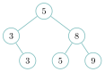{ .tikz loading=lazy }

    Parcours infixe : `3, 3, 5, 5, 8, 9` — trié.

    **3.**

    ```python
    def infixe(a):
        if a is None:
            return []
        return infixe(a.gauche) + [a.valeur] + infixe(a.droite)

    def tri_abr(t):
        a = None
        for v in t:
            a = inserer(a, v)
        return infixe(a)
    ```

    Par exemple `tri_abr([5, 3, 8, 3, 9, 5, 1])` vaut `[1, 3, 3, 5, 5, 8, 9]`.

    **4.** Avec `1, 2, …, 7`, chaque valeur devient le fils droit de la précédente : un arbre « en peigne » de hauteur $7$ (une chaîne `1`–`2`–…–`7`). Avec `4, 2, 6, 1, 3, 5, 7`, on obtient l’arbre équilibré ci-dessous, de hauteur $3$.

    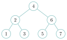{ .tikz loading=lazy }

    Au pire, une recherche fait autant de comparaisons que la hauteur : $7$ dans le peigne (comme dans une liste), $3$ dans l’arbre équilibré. Mêmes valeurs, même nombre de nœuds : seul l’**ordre d’insertion** a changé.

### Pour aller plus loin

### <span class="stars" title="Niveau 3 sur 3">★★★</span> <span class="exo-num">Exercice 12</span> — Défi — l’arbre miroir <span class="ia ia-orange" title="IA en appui : déboguer, reformuler, vérifier ; la réponse finale est la vôtre"></span> { #ex-05-12 }

<span class="run" title="À programmer et tester sur machine">▶</span> Écrire une fonction `miroir(a)` qui renvoie un **nouvel** arbre, image de `a` dans un miroir : à chaque nœud, les sous-arbres gauche et droit sont échangés (récursivement).

??? pouce "Coup de pouce"

    Que vaut le miroir de l’arbre vide (condition d’arrêt) ? Sinon, on construit un **nouveau** `Noeud` de même valeur : que doit-on placer à sa gauche, et à sa droite ?

??? pouce "Coup de pouce 2 (début de solution)"

    `def miroir(a):`  
    `if a is None:`  
    `return None`  
    `return Noeud(a.valeur, ..., ...)`

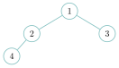{ .tikz loading=lazy } $\longrightarrow$ 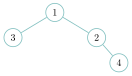{ .tikz loading=lazy }

??? corrige "Corrigé"

    ```python
    def miroir(a):
        if a is None:
            return None
        return Noeud(a.valeur, miroir(a.droite), miroir(a.gauche))  # on echange g et d
    ```

### <span class="stars" title="Niveau 3 sur 3">★★★</span> <span class="exo-num">Exercice 13</span> — Défi — maximum d’un arbre <span class="ia ia-orange" title="IA en appui : déboguer, reformuler, vérifier ; la réponse finale est la vôtre"></span> { #ex-05-13 }

<span class="run" title="À programmer et tester sur machine">▶</span> Écrire une fonction `maximum(a)` qui renvoie la plus grande valeur d’un arbre `a` **non vide** (attention : arbre *quelconque*, pas forcément un ABR — il faut donc bien tout explorer).

??? pouce "Coup de pouce"

    Prendre le `max` de la racine et des maxima des deux sous-arbres **non vides** : tester `a.gauche is not None` avant d’appeler `maximum(a.gauche)`, et de même à droite.

??? pouce "Coup de pouce 2 (début de solution)"

    `def maximum(a):`  
    `m = a.valeur`  
    `if a.gauche is not None:`  
    `m = max(m, maximum(a.gauche))`

??? corrige "Corrigé"

    ```python
    def maximum(a):
        m = a.valeur
        if a.gauche is not None:
            m = max(m, maximum(a.gauche))
        if a.droite is not None:
            m = max(m, maximum(a.droite))
        return m
    ```

### Vers le bac

### <span class="stars" title="Niveau 2 sur 3">★★</span> <span class="exo-num">Exercice 14</span> — ABR : mesures, insertion, recherche (d’après Métropole 2023, jour 2) <span class="ia ia-orange" title="IA en appui : déboguer, reformuler, vérifier ; la réponse finale est la vôtre"></span> { #ex-05-14 }

On considère l’arbre binaire de recherche suivant.

{ .tikz loading=lazy }

1.  Donner la **taille** et la **hauteur** de cet ABR.

2.  Le redessiner après l’ajout des valeurs `15` puis `30`, dans cet ordre.

3.  Pour obtenir les valeurs dans l’ordre croissant, quel parcours faut-il utiliser ? *(A) largeur ; (B) préfixe ; (C) infixe ; (D) suffixe.*

4.  On dispose d’une classe `ABR` avec les méthodes `est_vide()`, `racine()`, `sg()` (sous-arbre gauche), `sd()` (sous-arbre droit). <span class="run" title="À programmer et tester sur machine">▶</span> Recopier et compléter les lignes 5, 7 et 9 de la méthode récursive `present`, qui renvoie `True` si `x` est dans l’arbre.

    ??? pouce "Coup de pouce"

        Ligne 7 : si la racine est plus petite que `x`, dans quel sous-arbre `x` peut-il encore se trouver ? On y relance la même méthode. Ligne 9 : même raisonnement de l’autre côté.

    ```python
    def present(self, x):
        if self.est_vide():
            return False
        elif self.racine() == x:
            return ...              # ligne 5
        elif self.racine() < x:
            return self.sd(). ...   # ligne 7
        else:
            return ...              # ligne 9
    ```

??? corrige "Corrigé"

    **1.** Taille $= 6$, hauteur $= 3$.

    **2.** `15` : $<25$, $>12$, $<18$ $\to$ fils gauche de `18`. `30` : $>25$, $<40$ $\to$ fils gauche de `40`.

    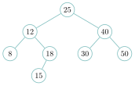{ .tikz loading=lazy }

    **3.** **(C)** parcours infixe.  
    **4.** ligne 5 : `True` ; ligne 7 : `self.sd().present(x)` ; ligne 9 : `self.sg().present(x)`.

### <span class="stars" title="Niveau 2 sur 3">★★</span> <span class="exo-num">Exercice 15</span> — Un arbre binaire par une classe (d’après Sujet zéro 2023, sujet B) <span class="ia ia-orange" title="IA en appui : déboguer, reformuler, vérifier ; la réponse finale est la vôtre"></span> { #ex-05-15 }

On donne la classe `ArbreBinaire` suivante : chaque objet a une `valeur` et deux sous-arbres `enfant_gauche` et `enfant_droit` (`None` au départ).

```python
class ArbreBinaire:
    def __init__(self, valeur):
        self.valeur = valeur
        self.enfant_gauche = None
        self.enfant_droit = None

    def insert_gauche(self, valeur):
        if self.enfant_gauche is None:
            self.enfant_gauche = ArbreBinaire(valeur)
        else:
            new_node = ArbreBinaire(valeur)
            new_node.enfant_gauche = self.enfant_gauche
            self.enfant_gauche = new_node

    def insert_droit(self, valeur):
        if self.enfant_droit is None:
            self.enfant_droit = ArbreBinaire(valeur)
        else:
            new_node = ArbreBinaire(valeur)
            new_node.enfant_droit = self.enfant_droit
            self.enfant_droit = new_node

    def get_valeur(self):
        return self.valeur

    def get_gauche(self):
        return self.enfant_gauche

    def get_droit(self):
        return self.enfant_droit
```

1.  Donner un exemple d’**attribut** et un exemple de **méthode** de cette classe.

2.  On exécute les instructions suivantes. Dessiner l’arbre obtenu.

    ```python
    r = ArbreBinaire(15)
    r.insert_gauche(6)
    r.insert_droit(18)
    r.get_gauche().insert_droit(10)
    ```

3.  <span class="run" title="À programmer et tester sur machine">▶</span> Écrire une fonction `taille(arbre)` qui renvoie le nombre de nœuds de l’arbre, en utilisant **uniquement** les accesseurs `get_gauche` et `get_droit` (l’arbre vide est `None`).

    ??? pouce "Coup de pouce"

        Même structure que la fonction `taille` du cours : seule change la façon d’obtenir les sous-arbres (des appels de méthodes au lieu d’attributs).

??? corrige "Corrigé"

    **1.** Un attribut : `valeur` (ou `enfant_gauche`, `enfant_droit`). Une méthode : `insert_gauche` (ou `get_valeur`, `get_gauche`…).

    **2.** `r` a la valeur `15`, un fils gauche `6` et un fils droit `18` ; puis `6` reçoit un fils droit `10`.

    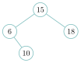{ .tikz loading=lazy }

    **3.**

    ```python
    def taille(arbre):
        if arbre is None:
            return 0
        return 1 + taille(arbre.get_gauche()) + taille(arbre.get_droit())
    ```

### <span class="stars" title="Niveau 2 sur 3">★★</span> <span class="exo-num">Exercice 16</span> — Un arbre de décision (d’après Amérique du Nord 2025, jour 1) <span class="ia ia-orange" title="IA en appui : déboguer, reformuler, vérifier ; la réponse finale est la vôtre"></span> { #ex-05-16 }

Un arbre de décision est représenté par deux classes : les **nœuds** portent une question, les **feuilles** portent un résultat.

```python
class Noeud:
    def __init__(self, question, sioui, sinon):
        self.question = question
        self.sioui = sioui        # un Noeud ou une Feuille
        self.sinon = sinon        # un Noeud ou une Feuille

class Feuille:
    def __init__(self, resultat):
        self.resultat = resultat  # une chaine de caracteres
```

1.  <span class="run" title="À programmer et tester sur machine">▶</span> Écrire le code Python qui construit l’arbre de décision ci-dessous et l’affecte à une variable `arbre`.

    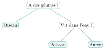{ .tikz loading=lazy }

    *(Convention : la branche de **gauche** correspond à la réponse « oui », celle de **droite** à « non ».)*

2.  On veut une méthode `est_resultat()` : elle renvoie `True` pour une `Feuille`, `False` pour un `Noeud`. <span class="run" title="À programmer et tester sur machine">▶</span> Écrire cette méthode dans **chacune** des deux classes.

3.  <span class="run" title="À programmer et tester sur machine">▶</span> Écrire une méthode `nb_resultats()` dans **chacune** des deux classes, renvoyant le **nombre de résultats** (diagnostics) atteignables : pour une `Feuille`, il vaut `1` ; pour un `Noeud`, c’est la somme de ceux de ses deux sous-arbres `sioui` et `sinon`.

    ??? pouce "Coup de pouce"

        Chaque classe a sa propre version de la méthode. Dans la classe `Noeud`, sur quels objets faut-il appeler la méthode `nb_resultats` ? Où se trouve alors la condition d’arrêt de cette récursion ?

4.  <span class="run" title="À programmer et tester sur machine">▶</span> *(Défi)* Écrire une fonction `diagnostic(arbre)` qui pose les questions à l’utilisateur (fonction `input`) en descendant l’arbre, et renvoie le résultat de la feuille atteinte. *(On répondra `"oui"` ou `"non"`.)*

    ??? pouce "Coup de pouce"

        Une boucle `while` qui descend tant que l’objet courant n’est pas un résultat (méthode `est_resultat`) ; selon la réponse donnée à la question du nœud courant, on passe à `sioui` ou à `sinon`.

??? corrige "Corrigé"

    **1.**

    ```python
    arbre = Noeud("A des plumes ?",
                  Feuille("Oiseau"),
                  Noeud("Vit dans l'eau ?",
                        Feuille("Poisson"),
                        Feuille("Autre")))
    ```

    **2.** Dans la classe `Feuille` : `def est_resultat(self): return True`. Dans la classe `Noeud` : `def est_resultat(self): return False`.

    **3.** Dans `Feuille` : `def nb_resultats(self): return 1`. Dans `Noeud` :

    ```python
    def nb_resultats(self):
        return self.sioui.nb_resultats() + self.sinon.nb_resultats()
    ```

    **4.**

    ```python
    def diagnostic(arbre):
        while not arbre.est_resultat():
            reponse = input(arbre.question + " (oui/non) ")
            if reponse == "oui":
                arbre = arbre.sioui
            else:
                arbre = arbre.sinon
        return arbre.resultat
    ```

### <span class="stars" title="Niveau 2 sur 3">★★</span> <span class="exo-num">Exercice 17</span> — Un arbre représenté par des listes (d’après Amérique du Sud 2023, jour 1) <span class="ia ia-orange" title="IA en appui : déboguer, reformuler, vérifier ; la réponse finale est la vôtre"></span> { #ex-05-17 }

Ici, un arbre (pas forcément binaire) est représenté par une liste `[e, lst_sa]` où `e` est l’étiquette du nœud et `lst_sa` la **liste de ses sous-arbres**. L’arbre vide est `[]`, une feuille est `[e, []]`.

```python
n2 = [2, []]
n5 = [5, []]
n8 = [8, []]
n1 = [1, [n2, n5]]
a  = [4, [n1, n8]]
```

1.  Dessiner l’arbre représenté par la variable `a`.

2.  Le **poids** d’un arbre est la somme des étiquettes de ses nœuds ; on le calcule par un parcours **en largeur** avec une file. <span class="run" title="À programmer et tester sur machine">▶</span> Recopier et compléter les lignes 7, 8 et 11.

    ??? pouce "Coup de pouce"

        Reprendre le schéma du parcours en largeur du cours : quelle condition fait tourner la boucle ? D’où vient l’arbre traité à chaque tour ? Où se trouve l’étiquette dans la liste `[e, lst_sa]` ?

    ```python
    def poids(arbre):
        if arbre == []:
            return 0
        p = 0
        file = creer_file()
        enfiler(file, arbre)
        while ... :                    # ligne 7
            arbre = ...                # ligne 8
            for sous_arbre in arbre[1]:
                enfiler(file, sous_arbre)
            p = ...                    # ligne 11
        return p
    ```

3.  *(défi)* <span class="run" title="À programmer et tester sur machine">▶</span> Un arbre est un **mobile** si *tous* ses sous-arbres ont le **même poids** et sont eux-mêmes des mobiles (l’arbre vide et une feuille sont des mobiles). Écrire une fonction récursive `est_mobile(arbre)` qui renvoie un booléen ; on pourra utiliser `poids`.

    ??? pouce "Coup de pouce"

        Parcourir la liste des sous-arbres : chacun doit avoir le même poids que le premier, **et** être lui-même un mobile (appel récursif). Si aucun ne fait défaut, renvoyer `True`.

??? corrige "Corrigé"

    **1.**

    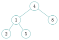{ .tikz loading=lazy }

    **2.** ligne 7 : `while not est_vide(file):` ; ligne 8 : `arbre = defiler(file)` ; ligne 11 : `p = p + arbre[0]`.

    **3.**

    ```python
    def est_mobile(arbre):
        if arbre == []:
            return True                 # l'arbre vide est un mobile
        sous_arbres = arbre[1]
        for sa in sous_arbres:          # meme poids + chacun mobile
            if poids(sa) != poids(sous_arbres[0]):
                return False
            if not est_mobile(sa):
                return False
        return True
    ```

### <span class="stars" title="Niveau 3 sur 3">★★★</span> <span class="exo-num">Exercice 18</span> — La plus grande somme racine-feuille (d’après Amérique du Sud 2022, jour 2) <span class="ia ia-orange" title="IA en appui : déboguer, reformuler, vérifier ; la réponse finale est la vôtre"></span> { #ex-05-18 }

Dans un arbre binaire étiqueté par des entiers, un **chemin racine-feuille** part de la racine et descend, de fils en fils, jusqu’à une feuille. Sa **somme** est la somme des étiquettes rencontrées. On cherche la **plus grande** de ces sommes.

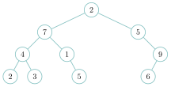{ .tikz loading=lazy }

1.  Déterminer « à la main » la plus grande somme racine-feuille de cet arbre.

2.  <span class="run" title="À programmer et tester sur machine">▶</span> Écrire une fonction récursive `somme_max(a)` qui renvoie la plus grande somme racine-feuille d’un arbre `a` **non vide** (implémentation par la classe `Noeud`).

    ??? pouce "Coup de pouce"

        La plus grande somme vaut `a.valeur` plus la meilleure des sommes des sous-arbres **non vides**. Condition d’arrêt : la feuille, dont la somme est sa seule valeur. Attention au nœud qui n’a qu’un seul fils.

    ??? pouce "Coup de pouce 2 (début de solution)"

        `def somme_max(a):`  
        `if a.gauche is None and a.droite is None:`  
        `return a.valeur`  
        `if a.gauche is None:`  
        `return a.valeur + somme_max(a.droite)`

??? corrige "Corrigé"

    **1.** Les chemins racine-feuille et leurs sommes : `2-7-4-2`$=15$ ; `2-7-4-3`$=16$ ; `2-7-1-5`$=15$ ; `2-5-9-6`$=\textbf{22}$. La plus grande somme est **22**.

    **2.**

    ```python
    def somme_max(a):
        if a.gauche is None and a.droite is None:      # feuille
            return a.valeur
        if a.gauche is None:                           # un seul sous-arbre (droit)
            return a.valeur + somme_max(a.droite)
        if a.droite is None:                           # un seul sous-arbre (gauche)
            return a.valeur + somme_max(a.gauche)
        return a.valeur + max(somme_max(a.gauche), somme_max(a.droite))
    ```

### <span class="stars" title="Niveau 3 sur 3">★★★</span> <span class="exo-num">Exercice 19</span> — Puissance 4 : l’arbre de coups et l’algorithme min-max (d’après Amérique du Nord 2026, jour 1, parties B et C) <span class="ia ia-orange" title="IA en appui : déboguer, reformuler, vérifier ; la réponse finale est la vôtre"></span> { #ex-05-19 }

*Suite de l’exercice « Puissance 4 : la grille de jeu » du chapitre POO.* Une grille de puissance 4 (6 lignes, 7 colonnes) est un objet de la classe `Grille` ; les deux joueurs sont notés 1 et 2. On dispose des méthodes suivantes :

- `joue(self, colonne, joueur)` place un pion du joueur dans la colonne et renvoie `True`, ou renvoie `False` si la colonne est pleine ;

- `score(self)` renvoie le score de la grille : plus il est grand, plus la position est favorable au joueur 2 ; plus il est petit (négatif), plus elle est favorable au joueur 1.

On veut programmer l’algorithme **min-max**, qui permet à un joueur d’optimiser ses chances de victoire : à chaque coup possible, on associe un score calculé en fonction de tous les coups futurs possibles, les siens mais aussi ceux de l’adversaire ; on choisit le coup de meilleur score. Pour simuler l’ensemble des coups possibles, on utilise un **arbre** dont les nœuds correspondent à des coups : chaque fils d’un nœud est un coup possible juste après le coup du nœud.

**Partie 1 — L’arbre de coups**

On associe un arbre de coups à un joueur et à une grille de jeu. Il simule tous les coups possibles pour le joueur et son adversaire, et calcule le score de chaque coup selon l’algorithme min-max :

- on ne calcule qu’un nombre maximal donné de coups à l’avance, noté `niveau_max` : c’est la profondeur maximale de l’arbre (la racine est au niveau 0). `niveau_max` est une constante accessible comme variable globale ;

- si un nœud correspond à un coup **gagnant**, son score vaut $-(100 + 10 \times (\texttt{niveau\_max} - \texttt{niveau}))$ pour le joueur 1 et $100 + 10 \times (\texttt{niveau\_max} - \texttt{niveau})$ pour le joueur 2, où `niveau` est la profondeur du nœud dans l’arbre ;

- si un nœud est au niveau `niveau_max`, son score est le score de la grille (méthode `score` de la classe `Grille`) ;

- dans tous les autres cas, le score d’un nœud est le **minimum** des scores de ses fils s’il s’agit de coups du joueur 1, et le **maximum** des scores de ses fils s’il s’agit de coups du joueur 2.

À son tour, le joueur 1 choisit donc le coup de niveau 1 de plus **petit** score, et le joueur 2 celui de plus **grand** score.

Pour construire l’arbre, on utilise une classe `Noeud` à trois attributs : `colonne` (soit `-1`, soit le numéro de la colonne où le coup est joué, de 0 à 6), `score` (le score associé au coup) et `suivants` (la liste des nœuds fils). La racine ne représente pas un coup : son attribut `colonne` vaut `-1` et ses fils représentent tous les premiers coups possibles du joueur 1.

{ .tikz loading=lazy }

Figure 1. Schéma partiel de l’arbre de coups pour `niveau_max = 2` (valeur de l’attribut `colonne`).

1.  Recopier et compléter le constructeur de la classe `Noeud`, qui crée un nœud symbolisant un coup joué dans la colonne `colonne`, de score nul et sans aucun fils.

    ```python
    class Noeud:
        def __init__(self, colonne):
            ...
            ...
            ...
    ```

2.  Écrire une méthode `colonne_score_min(self)` de la classe `Noeud` qui renvoie le couple `(colonne, score)` d’un des fils du nœud de score le plus petit. On suppose que le nœud a au moins un fils.

On suppose écrite de même une méthode `colonne_score_max` (fils de score le plus grand), et ajoutées à la classe `Grille` les méthodes suivantes :

- `gagnant(self)` renvoie le numéro du joueur gagnant (1 ou 2) s’il existe un alignement de quatre de ses pions dans la grille, ou `0` s’il n’y a aucun gagnant (on suppose qu’il ne peut y avoir qu’un gagnant) ;

- `copie_grille(self)` renvoie une grille de jeu, copie exacte de la grille représentée par l’objet : modifier la copie ne modifie pas l’original.

1.  La méthode `calcule_score(self, niveau, joueur, grille)` de la classe `Noeud` attribue un score au nœud conformément à l’algorithme min-max : `niveau` est la profondeur du nœud, `joueur` le numéro du joueur qui joue les coups étudiés à partir de ce nœud, et `grille` un objet `Grille` représentant le jeu juste après le coup correspondant au nœud. Recopier et compléter ce code.

    ??? pouce "Coup de pouce"

        Les trois premiers cas sont des scores directs : relire les règles de la partie 1. Dans la boucle : on crée le nœud du coup joué dans `colonne`, on l’ajoute aux fils, puis l’appel récursif se fait au niveau suivant, pour l’**autre** joueur, sur `grille2`.

    ??? pouce "Coup de pouce 2 (début de solution)"

        L’appel récursif s’écrit  
        `nouveau_noeud.calcule_score(niveau + 1, 3 - joueur, grille2)`  
        (`3 - joueur` vaut `2` si `joueur` vaut `1`, et inversement).

    ```python
    def calcule_score(self, niveau, joueur, grille):
        g = grille.gagnant()
        if g == 1:
            self.score = ...
        elif g == 2:
            self.score = ...
        elif niveau == niveau_max:
            self.score = ...
        else:
            for colonne in range(7):
                grille2 = grille.copie_grille()
                if grille2.joue(colonne, joueur):
                    nouveau_noeud = ...
                    self.suivants.append(...)
                    nouveau_noeud.calcule_score(...)
            if joueur == 1:
                self.score = ...
            else:
                self.score = ...
    ```

2.  Indiquer pourquoi il n’est pas réaliste d’utiliser cet algorithme pour explorer l’ensemble des parties, ce qui correspond à `niveau_max = 42`.

**Partie 2 — Choix du meilleur coup à jouer**

1.  <span class="run" title="À programmer et tester sur machine">▶</span> Utiliser ce qui précède et la classe `Noeud` pour écrire une fonction `choisit_coup(grille, joueur)` qui prend en paramètres une grille de jeu et le numéro d’un joueur, et renvoie le numéro de la colonne où ce joueur devrait jouer pour optimiser ses chances de victoire selon l’algorithme min-max.

    ??? pouce "Coup de pouce"

        Créer la racine (colonne `-1`), lui faire calculer son score au niveau `0`, puis choisir parmi ses fils selon le joueur : `colonne_score_min` ou `colonne_score_max`.

??? corrige "Corrigé"

    1.

        ```python
        class Noeud:
            def __init__(self, colonne):
                self.colonne = colonne
                self.score = 0
                self.suivants = []
        ```

    2.  On cherche le minimum en parcourant la liste des fils :

        ```python
        def colonne_score_min(self):
            meilleur = self.suivants[0]
            for fils in self.suivants:
                if fils.score < meilleur.score:
                    meilleur = fils
            return (meilleur.colonne, meilleur.score)
        ```

    3.  La méthode est **récursive** : chaque fils calcule son propre score (au niveau suivant et pour l’autre joueur, `3 - joueur`), puis le nœud prend le minimum ou le maximum des scores de ses fils.

        ```python
        def calcule_score(self, niveau, joueur, grille):
            g = grille.gagnant()
            if g == 1:
                self.score = -(100 + 10 * (niveau_max - niveau))
            elif g == 2:
                self.score = 100 + 10 * (niveau_max - niveau)
            elif niveau == niveau_max:
                self.score = grille.score()
            else:
                for colonne in range(7):
                    grille2 = grille.copie_grille()
                    if grille2.joue(colonne, joueur):
                        nouveau_noeud = Noeud(colonne)
                        self.suivants.append(nouveau_noeud)
                        nouveau_noeud.calcule_score(niveau + 1, 3 - joueur, grille2)
                if joueur == 1:
                    self.score = self.colonne_score_min()[1]
                else:
                    self.score = self.colonne_score_max()[1]
        ```

    4.  Chaque nœud a jusqu’à 7 fils : l’arbre complet de profondeur 42 compterait de l’ordre de $7^{42} \approx 3 \times 10^{35}$ nœuds. Ni le temps de calcul ni la mémoire ne le permettent ; on limite donc `niveau_max` à quelques coups.

    5.  On construit l’arbre à partir d’une racine de colonne `-1`, puis on choisit le fils de plus petit score (joueur 1) ou de plus grand score (joueur 2).

        ```python
        def choisit_coup(grille, joueur):
            racine = Noeud(-1)
            racine.calcule_score(0, joueur, grille)
            if joueur == 1:
                return racine.colonne_score_min()[0]
            else:
                return racine.colonne_score_max()[0]
        ```

        *Vérification : avec trois pions du joueur 2 alignés en bas des colonnes 0, 1 et 2, `choisit_coup` renvoie `3` pour le joueur 2 (il gagne) comme pour le joueur 1 (il bloque).*

### Critiquer une réponse d’IA

### <span class="stars" title="Niveau 2 sur 3">★★</span> <span class="exo-num">Exercice 20</span> — Un test d’ABR proposé par un assistant d’IA <span class="ia ia-vert" title="IA intégrée : l'exercice s'appuie sur une réponse d'IA"></span> { #ex-05-20 }

Un élève demande à un assistant d’IA : « Écris une fonction Python `est_abr(a)` qui renvoie `True` si l’arbre binaire `a` (classe `Noeud` du cours, attributs `valeur`, `gauche`, `droite`) est un arbre binaire de recherche. » Voici la réponse obtenue :

```python
def est_abr(a):
    if a is None:
        return True                      # l'arbre vide est un ABR
    if a.gauche is not None and a.gauche.valeur >= a.valeur:
        return False
    if a.droite is not None and a.droite.valeur < a.valeur:
        return False
    return est_abr(a.gauche) and est_abr(a.droite)
```

*« Cette fonction vérifie, pour chaque nœud, que son fils gauche est plus petit et son fils droit plus grand ou égal, puis fait de même récursivement dans les deux sous-arbres : c’est exactement la définition d’un ABR. »*

1.  La réponse est-elle correcte ? <span class="run" title="À programmer et tester sur machine">▶</span> La tester sur l’arbre `Noeud(8, Noeud(3, Noeud(1), Noeud(12)), Noeud(10))` : le dessiner d’abord, dire s’il est un ABR, puis comparer avec ce que renvoie la fonction.

2.  Localiser et corriger l’erreur.

    ??? pouce "Coup de pouce"

        Relire la définition du cours, mot à mot, puis la comparer à ce que teste réellement chacun des deux `if`.

3.  Quelle vérification simple, faite avant de faire confiance à la réponse, aurait suffi à détecter l’erreur ?

??? corrige "Corrigé"

    **1.** **Non.** L’arbre proposé a pour racine `8`, avec `12` dans son sous-arbre **gauche** : ce n’est **pas** un ABR (toute valeur du sous-arbre gauche doit être plus petite que `8`). Or la fonction renvoie `True` (sortie réelle), car chaque nœud est « localement » correct : `3 < 8`, `10 >= 8`, `1 < 3 <= 12`.

    **2.** L’erreur : la fonction ne compare chaque nœud qu’à ses **fils**, alors que la définition porte sur **toutes les valeurs** du sous-arbre (« *toutes les valeurs de son sous-arbre gauche sont plus petites que sa valeur* »). Il faut propager un encadrement le long de la descente : dans un sous-arbre gauche, toute valeur doit rester **strictement inférieure** à `maxi` ; dans un sous-arbre droit, **supérieure ou égale** à `mini` (convention du cours : doublon à droite) :

    ```python
    def est_abr(a, mini=None, maxi=None):
        if a is None:
            return True
        if mini is not None and a.valeur < mini:     # a droite : >= mini
            return False
        if maxi is not None and a.valeur >= maxi:    # a gauche : < maxi
            return False
        return est_abr(a.gauche, mini, a.valeur) and est_abr(a.droite, a.valeur, maxi)
    ```

    Avec cette version, l’arbre de la question 1 donne `False`, et l’ABR du cours (racine `8`, fils `3` et `10`, feuilles `1`, `6`, `14`) donne bien `True`.

    **3.** Tester la fonction sur un **contre-exemple** construit à la main (un arbre qui n’est *pas* un ABR mais dont chaque nœud respecte l’ordre avec ses seuls fils), et pas seulement sur des arbres « qui marchent » : une fonction qui répond `True` à tout n’a été mise en défaut par aucun test.

### S’entraîner à l’oral

### <span class="stars" title="Niveau 2 sur 3">★★</span> <span class="exo-num">Exercice 21</span> — Expliquer en deux minutes <span class="ia ia-rouge" title="Sans IA : le but est l'automatisme lui-même"></span> { #ex-05-21 }

Au Grand Oral comme devant l’examinateur de l’épreuve pratique, il faut savoir **expliquer** une notion clairement, sans notes. Choisir l’un des sujets suivants (ou le tirer au sort) :

1.  Expliquer à un camarade de Première ce qu’est un **arbre binaire de recherche** et pourquoi y chercher une valeur est rapide.

2.  Expliquer les trois parcours en profondeur (**préfixe**, **infixe**, **suffixe**) sur un petit arbre, et ce que donne le parcours infixe d’un ABR.

3.  Expliquer pourquoi un ABR peut être très efficace, ou pas plus efficace qu’une liste, selon l’**ordre** dans lequel on insère les valeurs.

**Préparation (5 min, seul).** Noter au brouillon **trois idées** et **un exemple**, rien de plus, puis retourner la feuille. **Exposé (2 min, chronométré).** Debout, face à un camarade, **sans lire de notes** : tout passe par la parole. **Retour (2 min).** Le camarade pose une question de relance (on peut alors s’aider d’un schéma), remplit la grille ci-dessous et donne un conseil ; puis on échange les rôles. Cette grille reprend les critères d’évaluation du Grand Oral.

??? pouce "Coup de pouce"

    Structurer chaque explication en trois temps : une **définition** en une phrase, un **exemple** petit et concret déroulé à voix haute, puis le **piège** (l’erreur que l’auditeur risque de faire). Finir par une phrase qui répond à la question posée. Dessiner mentalement un arbre de trois à cinq nœuds et le décrire à voix haute (« la racine porte 8, son fils gauche…») : c’est lui qui servira d’exemple. Sujet 3 : à quoi le nombre de comparaisons d’une recherche est-il lié ?

<table>
<thead>
<tr>
<th style="text-align: left;"><strong>Grille entre camarades</strong></th>
<th style="text-align: center;"><strong>Oui</strong></th>
<th style="text-align: center;"><strong>En partie</strong></th>
<th style="text-align: center;"><strong>Pas encore</strong></th>
</tr>
</thead>
<tbody>
<tr>
<td style="text-align: left;"><strong>Clair</strong> — audible, posé ; chaque mot technique est expliqué</td>
<td style="text-align: center;"><span class="math inline">▫</span></td>
<td style="text-align: center;"><span class="math inline">▫</span></td>
<td style="text-align: center;"><span class="math inline">▫</span></td>
</tr>
<tr>
<td style="text-align: left;"><strong>Juste</strong> — c’est exact, et l’exemple montre vraiment l’idée</td>
<td style="text-align: center;"><span class="math inline">▫</span></td>
<td style="text-align: center;"><span class="math inline">▫</span></td>
<td style="text-align: center;"><span class="math inline">▫</span></td>
</tr>
<tr>
<td style="text-align: left;"><strong>Construit</strong> — un fil conducteur, tenu en deux minutes, sans lire</td>
<td style="text-align: center;"><span class="math inline">▫</span></td>
<td style="text-align: center;"><span class="math inline">▫</span></td>
<td style="text-align: center;"><span class="math inline">▫</span></td>
</tr>
<tr>
<td colspan="4" style="text-align: left;"><strong>Un conseil</strong> pour la prochaine fois :</td>
</tr>
</tbody>
</table>

??? corrige "Corrigé"

    Pas de texte à apprendre par cœur : voici les **éléments attendus** pour chaque sujet. L’ordre, les mots et l’exemple peuvent être différents ; l’explication est réussie si ces idées y sont, justes et reliées entre elles.

    **Sujet 1.**

    - **ABR** : arbre binaire où, pour **chaque** nœud, les valeurs du sous-arbre gauche sont plus petites que la sienne et celles du sous-arbre droit plus grandes.

    - Recherche : on compare à la racine, puis on descend d’**un seul** côté ; le nombre de comparaisons est au plus la **hauteur** de l’arbre.

    - Exemple : dans l’ABR obtenu en insérant $8, 3, 10, 1, 6$, chercher $6$ : $8$ (aller à gauche), $3$ (aller à droite), $6$ trouvé en $3$ comparaisons.

    - Piège : vérifier la propriété seulement entre un nœud et ses deux fils ; elle porte sur tout le sous-arbre.

    **Sujet 2.**

    - Préfixe : racine, puis sous-arbre gauche, puis sous-arbre droit ; infixe : gauche, racine, droit ; suffixe : gauche, droit, racine.

    - Exemple : racine $2$, fils gauche $1$, fils droit $3$ : préfixe $2, 1, 3$ ; infixe $1, 2, 3$ ; suffixe $1, 3, 2$.

    - Le parcours infixe d’un ABR donne les valeurs dans l’**ordre croissant** (c’est un tri).

    - Piège : appliquer l’ordre aux seuls nœuds du haut ; la règle s’applique récursivement à **chaque** sous-arbre.

    **Sujet 3.**

    - Le coût d’une recherche est lié à la **hauteur**, pas à la taille.

    - Arbre bien équilibré de $n$ nœuds : hauteur proche de $\log_2 n$ (un million de valeurs : une vingtaine de niveaux).

    - Valeurs insérées déjà triées ($1, 2, 3, \dots$) : chaque nœud n’a qu’un fils droit, l’arbre est **filiforme**, de hauteur $n$ : chercher revient à parcourir une liste.

    - Piège : il existe deux conventions de hauteur (arbre réduit à sa racine : $1$ ou $0$) ; annoncer celle qu’on utilise, comme dans un énoncé.
