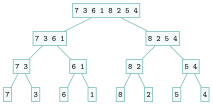
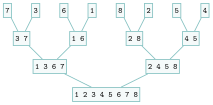

# Activités préparatoires

Diviser pour régner

## Activité 1 Couper en deux, encore et encore

*un dictionnaire, deux paquets de cartes, une équipe*

Durée : 30 min · Sans ordinateur, par deux

!!! consignes "Consignes"

    - Matériel : un jeu de huit cartes numérotées de `1` à `8` (ou huit post-it). L’exercice 3 se fait par quatre. Les réponses s’écrivent sur le cahier.

    - On **manipule** et on **compte** d’abord ; aucun vocabulaire n’est attendu avant l’exercice 4.

### Exercice 1 — Le dictionnaire de 2000 pages  { #ex-05-diviser-pour-regner-act-1-1 }

On cherche le mot « algorithme » dans un dictionnaire papier de $2\,000$ pages.

1.  Si l’on tourne les pages une à une depuis le début, combien de pages faut-il regarder, au pire ?

2.  Stratégie de Léa : ouvrir *au milieu*, regarder si le mot est avant ou après, puis recommencer *sur la moitié qui reste*. Recopier et compléter le tableau sur le cahier (arrondir à l’entier supérieur).

    | Coups d’œil | 0        | 1        | 2   | 3   | 4   | 5   | 6   | 7   | 8   | 9   | 10  | 11  |
    |:------------|:---------|:---------|:----|:----|:----|:----|:----|:----|:----|:----|:----|:----|
    | Pages       | $2\,000$ | $1\,000$ |     |     |     |     |     |     |     |     |     |     |

3.  Combien de coups d’œil faut-il à Léa, au pire, pour tomber sur la bonne page ? Et avec un dictionnaire deux fois plus épais ($4\,000$ pages) ?

4.  Jeu, par deux : l’un pense à un nombre entre $1$ et $100$, l’autre le devine ; on ne répond que « plus grand », « plus petit » ou « gagné ». Jouer trois parties en appliquant la stratégie de Léa. Noter le nombre de questions à chaque partie. Combien en faut-il au plus ?

??? corrige "Corrigé"

    1.  Au pire $2\,000$ pages (le mot est sur la dernière page regardée).

    2.  Tableau complété (calcul vérifié à la machine) :

        | Coups |    0     |    1     |   2   |   3   |   4   |  5   |  6   |  7   |  8  |  9  | 10  | 11  |
        |:------|:--------:|:--------:|:-----:|:-----:|:-----:|:----:|:----:|:----:|:---:|:---:|:---:|:---:|
        | Pages | $2\,000$ | $1\,000$ | $500$ | $250$ | $125$ | $63$ | $32$ | $16$ | $8$ | $4$ | $2$ | $1$ |

    3.  $11$ coups d’œil au pire. Avec $4\,000$ pages, un seul de plus : $12$. Doubler la taille n’ajoute qu’**un** coup : c’est le comportement du logarithme ($2^{11} = 2\,048 \geqslant 2\,000$).

    4.  Au plus $7$ questions, car $2^7 = 128 \geqslant 100$ (et $2^6 = 64 < 100$). Si l’on dépasse $7$, c’est qu’on n’a pas visé le milieu.

### Exercice 2 — Fusionner deux paquets triés  { #ex-05-diviser-pour-regner-act-1-2 }

Poser, faces visibles, deux petits paquets **déjà triés** (la plus petite carte au-dessus, ici à gauche) :

paquet G : { .tikz .tikz-inline loading=lazy } { .tikz .tikz-inline loading=lazy } { .tikz .tikz-inline loading=lazy } { .tikz .tikz-inline loading=lazy } paquet D : { .tikz .tikz-inline loading=lazy } { .tikz .tikz-inline loading=lazy } { .tikz .tikz-inline loading=lazy } { .tikz .tikz-inline loading=lazy }

1.  On veut former un seul paquet trié. Règle : on ne regarde que les **deux cartes du dessus** ; on prend la plus petite et on la pose sur le paquet final. Réaliser la fusion et noter l’ordre des cartes prises.

2.  Combien de **comparaisons** (« laquelle est la plus petite ? ») a-t-on faites ? Pourquoi la dernière carte ne coûte-t-elle aucune comparaison ?

3.  Deux paquets triés de $50$ cartes chacun : combien de comparaisons au plus pour les fusionner ? Faut-il tout recommencer, ou chaque carte n’est-elle prise qu’une fois ?

??? corrige "Corrigé"

    1.  On prend dans l’ordre `1, 2, 3, 4, 5, 6, 7, 8`.

    2.  $7$ comparaisons (vérifié à la machine). Quand le paquet D est vide (après la carte `7`), il ne reste que la carte `8` : on la pose sans rien comparer.

    3.  Au plus $99$ comparaisons (une par carte prise, sauf la dernière). Chaque carte n’est prise **qu’une fois** : fusionner coûte de l’ordre du nombre total de cartes.

### Exercice 3 — Trier en équipe  { #ex-05-diviser-pour-regner-act-1-3 }

Le paquet mélangé { .tikz .tikz-inline loading=lazy } { .tikz .tikz-inline loading=lazy } { .tikz .tikz-inline loading=lazy } { .tikz .tikz-inline loading=lazy } { .tikz .tikz-inline loading=lazy } { .tikz .tikz-inline loading=lazy } { .tikz .tikz-inline loading=lazy } { .tikz .tikz-inline loading=lazy } est confié à une équipe. Chacun applique la **même consigne** :

!!! encadre "Consigne de l’équipe"

    Si tu reçois **une seule carte**, rends-la telle quelle : elle est triée. Sinon, **coupe** ton paquet en deux moitiés, fais trier chaque moitié par un camarade *qui suit la même consigne*, puis **fusionne** les deux moitiés triées qu’on te rend (comme dans l’exercice 2).

1.  Jouer la scène à quatre (un même élève peut traiter plusieurs paquets l’un après l’autre). Dessiner sur le cahier tous les paquets formés en coupant (de haut en bas), puis tous les paquets formés en fusionnant (de bas en haut).

2.  Combien d’étages de « coupes » faut-il pour arriver à des paquets d’une carte ? Et pour $16$ cartes ? pour $1\,024$ cartes ?

3.  À chaque étage de fusions, chaque carte est prise une fois : combien de comparaisons au plus, *pour tout l’étage*, avec $8$ cartes ? En déduire un maximum pour tout le tri.

4.  En Première, le tri par sélection de $n$ cartes demande $\frac{n(n-1)}{2}$ comparaisons. Recopier et compléter le tableau, en ordre de grandeur, pour le tri en équipe : « nombre de cartes $\times$ nombre d’étages ».

    | Nombre de cartes $n$                         | $8$  | $16$ | $1\,024$ |
    |:---------------------------------------------|:----:|:----:|:--------:|
    | Tri par sélection : $\frac{n(n-1)}{2}$       | $28$ |      |          |
    | Tri en équipe : $n \times$ (nombre d’étages) |      |      |          |

??? corrige "Corrigé"

    1.  Coupes (de haut en bas) puis fusions (de bas en haut) :

        { .tikz loading=lazy }

        { .tikz loading=lazy }

    2.  $3$ étages pour $8$ cartes ($2^3 = 8$), $4$ pour $16$, $10$ pour $1\,024$ ($2^{10} = 1\,024$) : c’est $\log_2 n$.

    3.  Chaque étage de fusions prend chacune des $8$ cartes une fois : au plus $8$ comparaisons par étage, donc au plus $3 \times 8 = 24$ pour tout le tri. (Sur ce paquet, la simulation à la machine en compte $17$.)

    4.  Tableau complété :

        | Nombre de cartes $n$                         | $8$  | $16$  |  $1\,024$  |
        |:---------------------------------------------|:----:|:-----:|:----------:|
        | Tri par sélection : $\frac{n(n-1)}{2}$       | $28$ | $120$ | $523\,776$ |
        | Tri en équipe : $n \times$ (nombre d’étages) | $24$ | $64$  | $10\,240$  |

        Sur $8$ cartes, la différence est faible ; sur $1\,024$ cartes, le tri en équipe est environ $50$ fois plus économe.

### Exercice 4 — Mettre des mots  { #ex-05-diviser-pour-regner-act-1-4 }

1.  La consigne de l’équipe se fait en trois temps. Donner un verbe pour chacun :

    - partager le paquet en deux moitiés ;

    - faire trier chaque moitié, de la même façon ;

    - recoller les deux moitiés triées en un seul paquet.

2.  Dans la stratégie du dictionnaire, lequel de ces trois temps n’a presque rien à faire ? Pourquoi ?

3.  Recopier et compléter avec vos mots : « La consigne de l’équipe s’applique à elle-même sur des paquets plus petits, comme une fonction… ; elle s’arrête quand… »

??? corrige "Corrigé"

    1.  Propositions possibles puis mots du cours : **diviser** (couper, partager), **régner** (résoudre, faire trier), **combiner** (recoller, fusionner).

    2.  Dans le dictionnaire, **combiner** n’a rien à faire : on ne garde qu’**une** moitié, et la réponse trouvée dans cette moitié est la réponse au problème entier.

    3.  « …comme une fonction **récursive** ; elle s’arrête quand le paquet n’a **qu’une carte** (condition d’arrêt). »
