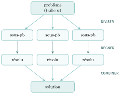
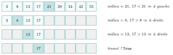
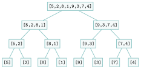
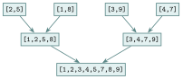
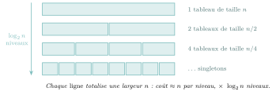
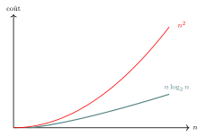
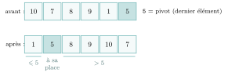
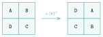

# Cours

<p class="sous-titre">Diviser pour régner</p>

<span id="chap-05" class="ancre"></span>

|  |  |
|:---|:---|
| **Programme (BO)** | *« Écrire un algorithme utilisant la méthode "diviser pour régner". »* Le BO cite deux exemples : *« la rotation d’une image bitmap d’un quart de tour avec un coût en mémoire constant »* et *« le tri fusion, qui permet d’exploiter la récursivité et d’exhiber un algorithme de coût en $n\log_2 n$ dans le pire des cas »*. |
| **Prérequis** | récursivité (condition d’arrêt, variant, coût), listes et tableaux, tris déjà vus (insertion, sélection), notion de coût et de logarithme base 2. |
| **Objectifs** | *reconnaître* un problème qui se prête à « diviser pour régner », *écrire* l’algorithme récursif correspondant, et *analyser* son coût (passage de $n^2$ à $n\log_2 n$, de $n$ à $\log_2 n$). |

## Un paradigme : diviser pour régner

Pour chercher un mot dans un dictionnaire de $2\,000$ pages, on ouvre *au milieu* et on **recommence sur la moitié qui reste** : une dizaine de coups d’œil suffit. Pour trier un paquet de cartes à plusieurs, on le coupe en deux, on fait trier chaque moitié, puis on **fusionne** les deux moitiés triées. Ces deux stratégies relèvent de la même méthode, l’une des plus puissantes de l’algorithmique : **diviser pour régner** (en anglais *divide and conquer*).

!!! definition "Définition 1 — Diviser pour régner"

    *Diviser pour régner* est une **méthode de conception d’algorithmes** en trois temps :

    - **Diviser** : découper le problème en sous-problèmes *du même type*, mais **plus petits** ;

    - **Régner** : résoudre chaque sous-problème (le plus souvent **récursivement**) ;

    - **Combiner** : recoller les solutions des sous-problèmes en une solution du problème de départ.

{ .tikz loading=lazy }

!!! remarque "Remarque"

    Comme les sous-problèmes sont « du même type mais plus petits », on les résout en **rappelant la même fonction** : les algorithmes « diviser pour régner » sont donc presque toujours **récursifs**. On retrouve la mécanique du chapitre **Récursivité** : une **condition d’arrêt** (un problème si petit qu’on sait répondre directement) et un **cas récursif** qui se rapproche de cette condition d’arrêt.

## Un premier exemple : la recherche dichotomique

Reprenons le dictionnaire. On dispose d’un tableau **déjà trié** et on veut savoir si une valeur `cible` s’y trouve.

- **Diviser** : on compare `cible` à l’élément *du milieu* ; cela désigne la moitié (gauche *ou* droite) où chercher.

- **Régner** : on cherche dans cette moitié, *de la même façon*.

- **Combiner** : rien à recoller ici — la réponse de la moitié *est* la réponse. (La phase « combiner » est parfois triviale.)

!!! exemple "Exemple — Lisez et testez cette fonction. Sur quel tableau doit-on l’appeler ?"

    ```python
    def recherche(tab, cible, debut, fin):
        if debut > fin:                 # condition d'arret : intervalle vide
            return False
        milieu = (debut + fin) // 2
        if tab[milieu] == cible:
            return True
        elif cible < tab[milieu]:
            return recherche(tab, cible, debut, milieu - 1)   # moitie gauche
        else:
            return recherche(tab, cible, milieu + 1, fin)     # moitie droite
    ```

    ??? corrige "Correction"

        On doit l’appeler sur un tableau **trié** dans l’ordre croissant : sinon, comparer `cible` au milieu ne dit pas de quel côté chercher. Le premier appel porte sur **tout** le tableau : pour chercher `17` dans `t`, on écrit `recherche(t, 17, 0, len(t) - 1)`. À chaque appel, l’**intervalle de recherche est coupé en deux**.

{ .tikz loading=lazy }

!!! propriete "Propriété 1 — Coût de la recherche dichotomique"

    Sur un tableau de taille $n$, la recherche dichotomique effectue au plus environ $\log_2 n$ comparaisons.

!!! demonstration "Démonstration"

    À chaque appel, la taille de l’intervalle est **divisée par deux**. Partant de $n$, on obtient successivement $n,\ n/2,\ n/4,\dots$ On atteint la condition d’arrêt (intervalle vide ou de taille $1$) après le nombre de divisions par $2$ nécessaires pour descendre de $n$ à $1$ : ce nombre est, par définition, $\log_2 n$.

!!! remarque "Remarque"

    L’ordre de grandeur est spectaculaire : dans un tableau d’**un million** d’éléments, une recherche naïve (élément par élément) demande jusqu’à un million de comparaisons, là où la dichotomie en demande environ $20$ (car $2^{20} \approx 10^6$). On passe d’un coût $n$ à un coût $\log_2 n$ : c’est exactement le gain que le programme demande de « montrer ».

!!! remarque "Remarque — Un « diviser pour régner » un peu particulier"

    Ici, on ne conserve qu’**une** moitié : la recherche dichotomique ne fait donc qu’**un seul** appel récursif (certains parlent alors de « *diminuer* pour régner »). Le tri fusion de la section suivante, lui, résout **les deux** moitiés : c’est un « diviser pour régner » complet.

<span id="cours-05-1" class="ancre"></span>

<span class="afaire">▶ Exercices d'application :</span> exercices **[1](exercices.md#ex-05-1) et [2](exercices.md#ex-05-2)** (recherche dichotomique à la main ; maximum d’un tableau)

## L’exemple phare : le tri fusion

On sait déjà trier (tri par insertion, tri par sélection), mais ces tris coûtent $n^2$ : sur un million de valeurs, c’est $10^{12}$ opérations, inutilisable. Le **tri fusion** (*merge sort*), imaginé par **John von Neumann** en **1945**, applique « diviser pour régner » et fait **bien mieux**.

**Un peu d’histoire.** Mathématicien d’origine hongroise, von Neumann collabore alors au laboratoire de **Los Alamos** (projet Manhattan) et participe à la conception de l’**EDVAC**, l’un des premiers ordinateurs à programme enregistré, dont il décrit l’organisation, toujours celle de nos ordinateurs (« architecture de von Neumann »). Pour montrer qu’elle sait faire autre chose que du calcul, il écrit l’un des tout premiers programmes de tri : un tri fusion.

\*(image manquante : 05_hist_von_neumann_badge)\*  
John von Neumann (photo de son badge de Los Alamos)

!!! regle "Règle 1 — Tri fusion : les trois temps"

    - **Diviser** : couper le tableau en **deux moitiés**.

    - **Régner** : trier **récursivement** chacune des deux moitiés.

    - **Combiner** : **fusionner** les deux moitiés triées en un seul tableau trié.

    La condition d’arrêt est immédiate : un tableau de $0$ ou $1$ élément est **déjà trié**.

### Le cœur du tri : fusionner deux listes triées

Tout repose sur une opération simple. On dispose de **deux listes déjà triées** et on veut les réunir en une seule liste triée. On avance avec un « doigt » sur chaque liste, et on recopie à chaque fois **le plus petit des deux éléments pointés**.

!!! exemple "Exemple — Fusionnez à la main [4, 12, 23, 56] et [3, 32, 35, 42, 57]"

    ??? corrige "Correction"

        <table>
        <thead>
        <tr>
        <th style="text-align: center;"><strong>tête de G</strong></th>
        <th style="text-align: center;"><strong>tête de D</strong></th>
        <th style="text-align: left;"><strong>on recopie…</strong></th>
        </tr>
        </thead>
        <tbody>
        <tr>
        <td style="text-align: center;"><code>4</code></td>
        <td style="text-align: center;"><code>3</code></td>
        <td style="text-align: left;"><span class="math inline">3 &lt; 4</span> : on prend <code>3</code></td>
        </tr>
        <tr>
        <td style="text-align: center;"><code>4</code></td>
        <td style="text-align: center;"><code>32</code></td>
        <td style="text-align: left;"><span class="math inline">4 &lt; 32</span> : on prend <code>4</code></td>
        </tr>
        <tr>
        <td style="text-align: center;"><code>12</code></td>
        <td style="text-align: center;"><code>32</code></td>
        <td style="text-align: left;">on prend <code>12</code></td>
        </tr>
        <tr>
        <td style="text-align: center;"><code>23</code></td>
        <td style="text-align: center;"><code>32</code></td>
        <td style="text-align: left;">on prend <code>23</code></td>
        </tr>
        <tr>
        <td style="text-align: center;"><code>56</code></td>
        <td style="text-align: center;"><code>32</code></td>
        <td style="text-align: left;"><span class="math inline">32 &lt; 56</span> : on prend <code>32</code></td>
        </tr>
        <tr>
        <td style="text-align: center;"><code>56</code></td>
        <td style="text-align: center;"><code>35</code></td>
        <td style="text-align: left;">on prend <code>35</code></td>
        </tr>
        <tr>
        <td style="text-align: center;"><code>56</code></td>
        <td style="text-align: center;"><code>42</code></td>
        <td style="text-align: left;">on prend <code>42</code></td>
        </tr>
        <tr>
        <td style="text-align: center;"><code>56</code></td>
        <td style="text-align: center;"><code>57</code></td>
        <td style="text-align: left;">on prend <code>56</code></td>
        </tr>
        <tr>
        <td colspan="2" style="text-align: left;">G vide</td>
        <td style="text-align: left;">on recopie la fin de D : <code>57</code></td>
        </tr>
        </tbody>
        </table>

        Résultat : `[3, 4, 12, 23, 32, 35, 42, 56, 57]`.

En Python :

```python
def fusion(gauche, droite):
    resultat = []
    i = j = 0
    while i < len(gauche) and j < len(droite):
        if gauche[i] <= droite[j]:
            resultat.append(gauche[i])
            i = i + 1
        else:
            resultat.append(droite[j])
            j = j + 1
    resultat = resultat + gauche[i:]   # reste de gauche (ou rien)
    resultat = resultat + droite[j:]   # reste de droite (ou rien)
    return resultat
```

!!! remarque "Remarque"

    Fusionner deux listes dont les tailles totalisent $n$ coûte de l’ordre de $n$ opérations : chaque élément est recopié **une seule fois**. Retenez ce « coût linéaire de la fusion » : il explique le coût final du tri.

### Le tri fusion complet

Il ne reste qu’à écrire les trois temps. La condition d’arrêt tient sur `if len(tab) <= 1`.

```python
def tri_fusion(tab):
    if len(tab) <= 1:              # condition d'arret : deja trie
        return tab
    milieu = len(tab) // 2
    gauche = tri_fusion(tab[:milieu])   # regner (recursif) sur la 1re moitie
    droite = tri_fusion(tab[milieu:])   # regner (recursif) sur la 2e moitie
    return fusion(gauche, droite)       # combiner
```

Suivons l’algorithme sur `[5, 2, 8, 1, 9, 3, 7, 4]`. On **descend** en coupant en deux (diviser), jusqu’aux singletons ; puis on **remonte** en fusionnant (combiner).

{ .tikz loading=lazy }

Descente (diviser) : on coupe en deux jusqu’aux singletons.

{ .tikz loading=lazy }

Remontée (combiner) : on fusionne deux à deux les moitiés triées.

!!! remarque "Remarque"

    Cette version renvoie une **nouvelle liste** (claire, mais elle recopie les données). On peut aussi écrire des versions « en place », qui rangent les valeurs directement dans le tableau donné au lieu de renvoyer une nouvelle liste : c’est le cas du *tri rapide* et du *Tim sort* des TP proposés en fin de chapitre.

### Terminaison

!!! propriete "Propriété 2"

    Pour tout tableau, l’appel `tri_fusion(tab)` se termine.

!!! demonstration "Démonstration"

    Prenons pour **variant** la longueur du tableau traité. Elle est un entier positif. À chaque appel récursif, on travaille sur une **moitié** : comme `milieu = len(tab)//2` avec `len(tab) >= 2` dans le cas récursif, chaque moitié a une longueur *strictement inférieure* à celle du tableau de départ. Le variant décroît donc strictement et finit par atteindre $0$ ou $1$ : la condition d’arrêt, qui renvoie sans appel récursif.

<span id="cours-05-3" class="ancre"></span>

<span class="afaire">▶ Exercices d'application :</span> exercices **[3](exercices.md#ex-05-3) à [5](exercices.md#ex-05-5)** (tri fusion : l’arbre des appels, compter les appels, écrire la fusion)

## Analyser le coût : pourquoi $n\log_2 n$ ?

C’est le point que le programme demande d’« exhiber ». Reprenons l’arbre des appels. Il a deux dimensions.

- **La hauteur.** À chaque niveau, on coupe les tableaux en deux. Partir de $n$ et couper en deux jusqu’à des singletons prend **$\log_2 n$ niveaux** (mêmes divisions par $2$ que pour la dichotomie).

- **Le travail par niveau.** À un niveau donné, les fusions traitent *en tout* les $n$ éléments : le coût cumulé des fusions d’un niveau est de l’ordre de **$n$**.

En multipliant, *« $\log_2 n$ niveaux, chacun coûtant $n$ »*, on obtient un coût total de l’ordre de $\boxed{n\log_2 n}$, et cela **même dans le pire des cas** — contrairement au tri rapide que l’on verra plus loin.

{ .tikz loading=lazy }

### Comparaison $n^2$ contre $n\log_2 n$

Le gain n’a l’air de rien sur un petit tableau ; il devient énorme quand $n$ grandit.

|      $n$ | $n^2$ (insertion) |   $n\log_2 n$ (fusion) |         rapport |
|---------:|------------------:|-----------------------:|----------------:|
|     $10$ |             $100$ |           $\approx 33$ |       $3\times$ |
| $1\,000$ |     $1\,000\,000$ |      $\approx 10\,000$ |     $100\times$ |
|   $10^6$ |         $10^{12}$ | $\approx 2\times 10^7$ | $50\,000\times$ |

{ .tikz loading=lazy }

!!! regle "Règle 2 — À retenir sur le coût"

    Diviser pour régner transforme souvent un coût **quadratique** ($n^2$) en coût **quasi-linéaire** ($n\log_2 n$), ou un coût **linéaire** ($n$) en coût **logarithmique** ($\log_2 n$). C’est la raison d’être de la méthode.

## D’autres visages de « diviser pour régner »

Le paradigme dépasse largement le tri. En voici trois illustrations à connaître.

### Le tri rapide (*quicksort*)

Autre tri « diviser pour régner », mais qui divise **autrement** : on choisit un élément **pivot**, on **partitionne** le tableau (les plus petits que le pivot à gauche, les plus grands à droite), puis on trie récursivement chaque côté. Ici l’effort est dans le « diviser » (la partition), et le « combiner » est gratuit.

```python
def tri_rapide(tab, bas, haut):
    if bas < haut:
        p = partition(tab, bas, haut)   # place le pivot a sa position finale
        tri_rapide(tab, bas, p - 1)     # regner a gauche du pivot
        tri_rapide(tab, p + 1, haut)    # regner a droite du pivot
```

La **partition** range les éléments autour du pivot ; celui-ci se retrouve à sa **place définitive**, les petits à gauche, les grands à droite. On trie ensuite *récursivement* chaque zone.

{ .tikz loading=lazy }

!!! remarque "Remarque"

    En moyenne, le tri rapide coûte $n\log_2 n$ et il est **très rapide en pratique** (il trie sur place, sans recopier). Mais si le pivot est mal choisi (par exemple sur un tableau déjà trié), les deux côtés sont très déséquilibrés et le coût **dégénère en $n^2$** : c’est là toute la différence avec le tri fusion, garanti en $n\log_2 n$. On l’étudie dans le TP **« Tri rapide »**, en fin de chapitre.

### Le *Tim sort* : le tri de Python

L’algorithme utilisé par `sorted()` et `list.sort()` en Python s’appelle **Tim sort** (Tim Peters, 2002). C’est un **mélange malin** de tri fusion et de tri par insertion : il repère les portions déjà triées (*runs*), trie les petits morceaux par insertion (rapide sur peu d’éléments), puis les fusionne comme le tri fusion. Un **TP** lui est consacré.

### La rotation d’une image, exemple du BO

Le BO cite la **rotation d’un quart de tour d’une image** carrée. On découpe l’image en **quatre quadrants**, on fait tourner récursivement chacun, puis on les **repositionne** en tournant (le quadrant haut-gauche va en haut-droite, etc.). En permutant directement les pixels, cette approche atteint un **coût mémoire constant** — la précision demandée par le programme.

{ .tikz loading=lazy }

## Ouverture et ancrage bac

« Diviser pour régner » est une **clé** de la fin d’année et un grand classique de l’épreuve.

!!! remarque "Remarque — Au bac, on vous demandera surtout de…"

    - **identifier** les trois temps (diviser / régner / combiner) sur un algorithme donné ;

    - **compléter** une fonction récursive (souvent l’appel récursif ou la fusion) ;

    - **dérouler** un tri fusion ou une recherche dichotomique sur un petit tableau ;

    - **justifier** la terminaison (variant = taille du tableau) et **comparer** les coûts $n^2$, $n\log_2 n$, $\log_2 n$.

    Exemples de sujets : *tri fusion* (Liban 2023, jour 2), *recherche dichotomique* récurrente sur de nombreux sujets.

!!! remarque "Remarque — Liens avec d’autres chapitres"

    Diviser pour régner repose sur la **récursivité**. Le **tri fusion** fait tomber le coût d’un tri de $n^2$ à $n\log_2 n$ (notion de **coût**, algorithmique). Quand les sous-problèmes se **répètent**, on ne recoupe plus : on **mémorise** — c’est la **programmation dynamique**. Et face à un problème d’optimisation, diviser pour régner est une stratégie parmi d’autres, à comparer aux **algorithmes gloutons** (Première).

## Bilan — la carte mémoire

| **Notion** | **À retenir** |
|:---|:---|
| Diviser pour régner | diviser **·** régner (récursif) **·** combiner |
| Lien avec la récursivité | sous-problèmes « du même type, plus petits » $\Rightarrow$ récursif |
| Recherche dichotomique | tableau **trié**, on coupe en deux : coût $\log_2 n$ |
| Tri fusion | diviser en 2 · trier chaque moitié · **fusionner** |
| Fusion de 2 listes triées | le plus petit des deux « têtes » ; coût $\approx n$ |
| Coût du tri fusion | $n\log_2 n$ **même dans le pire des cas** |
| Tri rapide (quicksort) | pivot + partition ; $n\log_2 n$ en moyenne, $n^2$ au pire |
| Terminaison | variant = **taille** du tableau (décroît) |

## Erreurs fréquentes

- **Dichotomie sur un tableau non trié.** L’algorithme **ne fonctionne pas** : le tri est une **hypothèse** indispensable.

- **Erreur d’indices `deb` / `fin` / `mil`.** Mauvaise mise à jour ($\pm 1$ oublié) $\Rightarrow$ boucle infinie ou dépassement. *Le réflexe :* `mil = (deb + fin) // 2`, puis `deb = mil + 1` ou `fin = mil - 1`.

- **Oublier le cas de base** de la récursion (liste de taille $0$ ou $1$ déjà triée).

- **Fusion incomplète.** Après la boucle, **recopier** ce qui reste dans la liste non épuisée.

- **Croire le tri rapide toujours en $n\log_2 n$.** C’est vrai en **moyenne** ; au **pire** il est en $n^2$. Le tri fusion, lui, est en $n\log_2 n$ **même au pire**.

- **Confondre variant et invariant.** Le **variant** (ici la taille) prouve la **terminaison** ; l’invariant prouve la **correction**.

## Savoir-faire à maîtriser

*À la fin du chapitre, je sais…*

- reconnaître le schéma **diviser / régner / combiner** $\to$ ex. [2](exercices.md#ex-05-2), [6](exercices.md#ex-05-6) ;

- **dérouler** une recherche dichotomique et compter les tours $\to$ ex. [1](exercices.md#ex-05-1), [11](exercices.md#ex-05-11) ;

- justifier la **terminaison** (variant) et le **coût logarithmique** $\to$ ex. [1](exercices.md#ex-05-1), [6](exercices.md#ex-05-6) ;

- expliquer et dérouler le **tri fusion** (arbre des appels, coût $n\log_2 n$) $\to$ ex. [3](exercices.md#ex-05-3), [4](exercices.md#ex-05-4) ;

- **fusionner** deux listes déjà triées $\to$ ex. [5](exercices.md#ex-05-5) ;

- comparer les **coûts** ($\log_2 n$, $n$, $n\log_2 n$, $n^2$) $\to$ ex. [4](exercices.md#ex-05-4), [9](exercices.md#ex-05-9).

## Vers le Grand Oral

Quelques pistes de questions que ce chapitre permet de préparer (à étayer d’un exemple concret) :

- **Diviser pour régner : pourquoi couper en deux rend-il plus rapide ?** *(la recherche dichotomique en $\log_2 n$ ; le tri fusion en $n\log_2 n$ contre $n^2$.)*

- **Le tri fusion est-il toujours meilleur que les tris quadratiques ?** *($n\log_2 n$ même au pire, mais un coût mémoire supplémentaire.)*

- **Quels sont les avantages et les limites du récursif en informatique ?** *(du catastrophique — Fibonacci naïf — au génial — le tri fusion — en passant par les tours de Hanoï, coûteuses mais sans solution plus simple.)*
