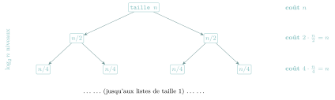
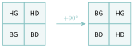

# TP et projets

<p class="sous-titre">Diviser pour régner</p>

## <span class="etiquette">TP 1</span> Pourquoi le tri fusion coûte $n\log_2 n$ ?

!!! remarque "Remarque"

    On cherche à **établir** (et pas seulement à admettre) le coût du tri fusion. On raisonne en comptant le **nombre d’opérations élémentaires** (comparaisons, ajouts) en fonction de la taille `n` de la liste. On rappelle les deux fonctions du cours (la fin de `fusion` est écrite ici avec deux boucles, pour bien compter) :

```python
def fusion(gauche, droite):        # gauche et droite sont deja triees
    resultat = []
    i = j = 0
    while i < len(gauche) and j < len(droite):
        if gauche[i] <= droite[j]:
            resultat.append(gauche[i])
            i = i + 1
        else:
            resultat.append(droite[j])
            j = j + 1
    while i < len(gauche):         # reste de gauche
        resultat.append(gauche[i])
        i = i + 1
    while j < len(droite):         # reste de droite
        resultat.append(droite[j])
        j = j + 1
    return resultat

def tri_fusion(tab):
    if len(tab) <= 1:              # condition d'arret : deja trie
        return tab
    milieu = len(tab) // 2
    gauche = tri_fusion(tab[:milieu])
    droite = tri_fusion(tab[milieu:])
    return fusion(gauche, droite)
```

## Étape 1 — le coût d’*une* fusion

1.  Dans `fusion`, chaque tour de boucle (des trois boucles `while`) exécute **exactement un** `append`. Si `gauche` et `droite` ont pour tailles $p$ et $q$, combien y a-t-il d’éléments dans `resultat` à la fin ? En déduire le nombre total d’`append`.

2.  Conclure : fusionner deux listes triées dont les tailles totalisent `n` éléments coûte de l’ordre de combien d’opérations ? Ce coût est-il **linéaire** ou **quadratique** ?

## Étape 2 — l’arbre des appels récursifs

Pour simplifier, on suppose que `n` est une **puissance de 2** : $n = 2^k$. À chaque appel, `tri_fusion` coupe la liste en **deux moitiés**, jusqu’à obtenir des listes de taille 1.

1.  Recopier et compléter sur le cahier le tableau décrivant les appels, niveau par niveau (le niveau 0 est l’appel initial) :

    | **Niveau** | **Nombre de sous-listes** | **Taille de chaque sous-liste** |
    |:----------:|:-------------------------:|:-------------------------------:|
    |    $0$     |            $1$            |               $n$               |
    |    $1$     |            $2$            |              $n/2$              |
    |    $2$     |             …             |                …                |
    |    $i$     |             …             |                …                |

2.  À un niveau `i` donné, on fusionne toutes les sous-listes de ce niveau. En utilisant l’étape 1, montrer que le **coût total des fusions d’un niveau** vaut environ `n`, *et que ce coût est le même à tous les niveaux*.

3.  Jusqu’à quel niveau descend-on ? (Autrement dit : pour quelle valeur de `i` les sous-listes ont-elles une taille de 1 ?) En déduire le **nombre de niveaux** en fonction de `n`.

4.  Rassembler : coût total $=$ (coût d’un niveau) $\times$ (nombre de niveaux). En déduire le coût du tri fusion en fonction de `n`.

## Étape 3 — interpréter le résultat

1.  Pour $n = 1024 = 2^{10}$, donner l’ordre de grandeur de $n\log_2 n$ et de $n^2$. Combien de fois le tri fusion est-il plus rapide, environ ?

2.  Ce raisonnement donne le coût **dans tous les cas** (on n’a fait aucune hypothèse sur l’ordre des éléments). Pourquoi est-ce un avantage du tri fusion sur le tri rapide (dont le coût peut atteindre $n^2$ au pire) ?

!!! remarque "Remarque — Aller plus loin — hors programme"

    On peut résumer tout le raisonnement par une **relation de récurrence** sur le coût $T(n)$ : $$T(n) = \underbrace{2\,T(n/2)}_{\text{trier les deux moitiés}} + \underbrace{c\,n}_{\text{la fusion}}.$$ « Dérouler » cette relation revient exactement à parcourir l’arbre des appels de l’étape 2, et redonne $T(n)$ de l’ordre de $n\log_2 n$.

??? corrige "Corrigé de l'activité"

    !!! remarque "Remarque"

        Le corrigé, lu d’un trait, **est** la démonstration rédigée du coût du tri fusion.

    **1.** À la fin, `resultat` contient **tous** les éléments de `gauche` et `droite`, chacun une fois : elle a donc $p + q$ éléments. Comme chaque `append` ajoute un élément et qu’il n’y a pas d’autre source d’éléments, il y a exactement $p + q$ appels à `append` (et au plus $p+q-1$ comparaisons, une par tour de la première boucle).

    **2.** Si les deux listes totalisent `n` éléments ($p + q = n$), la fusion effectue de l’ordre de `n` opérations : son coût est **linéaire**.

    !!! propriete "Propriété 1 — Coût de la fusion"

        Fusionner deux listes triées totalisant `n` éléments coûte de l’ordre de `n` opérations (coût linéaire).

    **1.** À chaque descente, chaque liste se scinde en deux moitiés : le nombre de sous-listes **double** et leur taille est **divisée par deux**.

    | **Niveau** | **Nombre de sous-listes** | **Taille de chacune** |
    |:----------:|:-------------------------:|:---------------------:|
    |    $0$     |            $1$            |          $n$          |
    |    $1$     |            $2$            |         $n/2$         |
    |    $2$     |            $4$            |         $n/4$         |
    |    $i$     |          $2^{i}$          |       $n/2^{i}$       |

    **2.** Au niveau `i`, il y a $2^{i}$ sous-listes, chacune de taille $n/2^{i}$. Les fusions de ce niveau reconstruisent ces sous-listes ; d’après l’étape 1, chaque fusion coûte proportionnellement à la taille de son résultat. Le coût total du niveau est donc $$2^{i} \times \frac{n}{2^{i}} = n.$$ **Ce coût vaut `n` à chaque niveau**, indépendamment de `i` : le $2^i$ (de plus en plus de fusions) et le $n/2^i$ (des fusions de plus en plus petites) se compensent exactement.

    **3.** On s’arrête quand les sous-listes ont une taille de 1, c’est-à-dire quand $$\frac{n}{2^{i}} = 1 \iff 2^{i} = n \iff i = \log_2 n.$$ Il y a donc $\log_2 n$ niveaux de fusion (on avait posé $n = 2^k$, soit $k = \log_2 n$ niveaux).

    **4.** Le coût total est la somme des coûts de tous les niveaux : $$\text{coût total} = \underbrace{n}_{\text{par niveau}} \times \underbrace{\log_2 n}_{\text{nombre de niveaux}} = \boxed{n\log_2 n}.$$

    Visuellement, chaque *ligne* de l’arbre ci-dessous coûte `n`, et il y a $\log_2 n$ lignes :

    { .tikz loading=lazy }

    !!! propriete "Propriété 2 — Coût du tri fusion"

        Le tri fusion d’une liste de `n` éléments a un coût de l’ordre de $n\log_2 n$.

    **1.** Pour $n = 1024 = 2^{10}$ : $\log_2 n = 10$, donc $n\log_2 n = 1024 \times 10 \approx 10^4$ (dix mille), tandis que $n^2 = 1024^2 \approx 10^6$ (un million). Le tri fusion fait donc environ **100 fois** moins d’opérations ici ; et l’écart grandit avec `n` (rapport $n/\log_2 n$).

    **2.** Le raisonnement n’a utilisé **aucune hypothèse sur l’ordre initial** des éléments : le découpage en deux et le coût des fusions ne dépendent que des *tailles*. Le coût $n\log_2 n$ est donc garanti **dans tous les cas**, y compris le pire. Le tri rapide, lui, est en $n\log_2 n$ *en moyenne* mais peut chuter à $n^2$ sur des entrées défavorables : le tri fusion offre une **garantie**, ce qui est précieux quand on ne maîtrise pas les données.

    !!! remarque "Remarque — La récurrence, hors programme"

        En notant $T(n)$ le coût, l’algorithme donne $T(n) = 2\,T(n/2) + c\,n$. En développant : $$T(n) = 2T(n/2) + cn = 4T(n/4) + 2cn = 8T(n/8) + 3cn = \dots = 2^{i}\,T(n/2^{i}) + i\,cn.$$ Pour $i = \log_2 n$, on a $n/2^{i} = 1$ (coût constant), d’où $T(n) = n\cdot T(1) + cn\log_2 n$, soit un coût de l’ordre de $n\log_2 n$. On retrouve exactement le comptage par niveaux.

??? corrige "Corrigé de l'activité"

    !!! remarque "Remarque"

        Le corrigé, lu d’un trait, **est** la démonstration rédigée du coût du tri fusion.

    **1.** À la fin, `resultat` contient **tous** les éléments de `gauche` et `droite`, chacun une fois : elle a donc $p + q$ éléments. Comme chaque `append` ajoute un élément et qu’il n’y a pas d’autre source d’éléments, il y a exactement $p + q$ appels à `append` (et au plus $p+q-1$ comparaisons, une par tour de la première boucle).

    **2.** Si les deux listes totalisent `n` éléments ($p + q = n$), la fusion effectue de l’ordre de `n` opérations : son coût est **linéaire**.

    !!! propriete "Propriété 1 — Coût de la fusion"

        Fusionner deux listes triées totalisant `n` éléments coûte de l’ordre de `n` opérations (coût linéaire).

    **1.** À chaque descente, chaque liste se scinde en deux moitiés : le nombre de sous-listes **double** et leur taille est **divisée par deux**.

    | **Niveau** | **Nombre de sous-listes** | **Taille de chacune** |
    |:----------:|:-------------------------:|:---------------------:|
    |    $0$     |            $1$            |          $n$          |
    |    $1$     |            $2$            |         $n/2$         |
    |    $2$     |            $4$            |         $n/4$         |
    |    $i$     |          $2^{i}$          |       $n/2^{i}$       |

    **2.** Au niveau `i`, il y a $2^{i}$ sous-listes, chacune de taille $n/2^{i}$. Les fusions de ce niveau reconstruisent ces sous-listes ; d’après l’étape 1, chaque fusion coûte proportionnellement à la taille de son résultat. Le coût total du niveau est donc $$2^{i} \times \frac{n}{2^{i}} = n.$$ **Ce coût vaut `n` à chaque niveau**, indépendamment de `i` : le $2^i$ (de plus en plus de fusions) et le $n/2^i$ (des fusions de plus en plus petites) se compensent exactement.

    **3.** On s’arrête quand les sous-listes ont une taille de 1, c’est-à-dire quand $$\frac{n}{2^{i}} = 1 \iff 2^{i} = n \iff i = \log_2 n.$$ Il y a donc $\log_2 n$ niveaux de fusion (on avait posé $n = 2^k$, soit $k = \log_2 n$ niveaux).

    **4.** Le coût total est la somme des coûts de tous les niveaux : $$\text{coût total} = \underbrace{n}_{\text{par niveau}} \times \underbrace{\log_2 n}_{\text{nombre de niveaux}} = \boxed{n\log_2 n}.$$

    Visuellement, chaque *ligne* de l’arbre ci-dessous coûte `n`, et il y a $\log_2 n$ lignes :

    { .tikz loading=lazy }

    !!! propriete "Propriété 2 — Coût du tri fusion"

        Le tri fusion d’une liste de `n` éléments a un coût de l’ordre de $n\log_2 n$.

    **1.** Pour $n = 1024 = 2^{10}$ : $\log_2 n = 10$, donc $n\log_2 n = 1024 \times 10 \approx 10^4$ (dix mille), tandis que $n^2 = 1024^2 \approx 10^6$ (un million). Le tri fusion fait donc environ **100 fois** moins d’opérations ici ; et l’écart grandit avec `n` (rapport $n/\log_2 n$).

    **2.** Le raisonnement n’a utilisé **aucune hypothèse sur l’ordre initial** des éléments : le découpage en deux et le coût des fusions ne dépendent que des *tailles*. Le coût $n\log_2 n$ est donc garanti **dans tous les cas**, y compris le pire. Le tri rapide, lui, est en $n\log_2 n$ *en moyenne* mais peut chuter à $n^2$ sur des entrées défavorables : le tri fusion offre une **garantie**, ce qui est précieux quand on ne maîtrise pas les données.

    !!! remarque "Remarque — La récurrence, hors programme"

        En notant $T(n)$ le coût, l’algorithme donne $T(n) = 2\,T(n/2) + c\,n$. En développant : $$T(n) = 2T(n/2) + cn = 4T(n/4) + 2cn = 8T(n/8) + 3cn = \dots = 2^{i}\,T(n/2^{i}) + i\,cn.$$ Pour $i = \log_2 n$, on a $n/2^{i} = 1$ (coût constant), d’où $T(n) = n\cdot T(1) + cn\log_2 n$, soit un coût de l’ordre de $n\log_2 n$. On retrouve exactement le comptage par niveaux.

??? corrige "Corrigé de l'activité"

    !!! remarque "Remarque"

        Le corrigé, lu d’un trait, **est** la démonstration rédigée du coût du tri fusion.

    **1.** À la fin, `resultat` contient **tous** les éléments de `gauche` et `droite`, chacun une fois : elle a donc $p + q$ éléments. Comme chaque `append` ajoute un élément et qu’il n’y a pas d’autre source d’éléments, il y a exactement $p + q$ appels à `append` (et au plus $p+q-1$ comparaisons, une par tour de la première boucle).

    **2.** Si les deux listes totalisent `n` éléments ($p + q = n$), la fusion effectue de l’ordre de `n` opérations : son coût est **linéaire**.

    !!! propriete "Propriété 1 — Coût de la fusion"

        Fusionner deux listes triées totalisant `n` éléments coûte de l’ordre de `n` opérations (coût linéaire).

    **1.** À chaque descente, chaque liste se scinde en deux moitiés : le nombre de sous-listes **double** et leur taille est **divisée par deux**.

    | **Niveau** | **Nombre de sous-listes** | **Taille de chacune** |
    |:----------:|:-------------------------:|:---------------------:|
    |    $0$     |            $1$            |          $n$          |
    |    $1$     |            $2$            |         $n/2$         |
    |    $2$     |            $4$            |         $n/4$         |
    |    $i$     |          $2^{i}$          |       $n/2^{i}$       |

    **2.** Au niveau `i`, il y a $2^{i}$ sous-listes, chacune de taille $n/2^{i}$. Les fusions de ce niveau reconstruisent ces sous-listes ; d’après l’étape 1, chaque fusion coûte proportionnellement à la taille de son résultat. Le coût total du niveau est donc $$2^{i} \times \frac{n}{2^{i}} = n.$$ **Ce coût vaut `n` à chaque niveau**, indépendamment de `i` : le $2^i$ (de plus en plus de fusions) et le $n/2^i$ (des fusions de plus en plus petites) se compensent exactement.

    **3.** On s’arrête quand les sous-listes ont une taille de 1, c’est-à-dire quand $$\frac{n}{2^{i}} = 1 \iff 2^{i} = n \iff i = \log_2 n.$$ Il y a donc $\log_2 n$ niveaux de fusion (on avait posé $n = 2^k$, soit $k = \log_2 n$ niveaux).

    **4.** Le coût total est la somme des coûts de tous les niveaux : $$\text{coût total} = \underbrace{n}_{\text{par niveau}} \times \underbrace{\log_2 n}_{\text{nombre de niveaux}} = \boxed{n\log_2 n}.$$

    Visuellement, chaque *ligne* de l’arbre ci-dessous coûte `n`, et il y a $\log_2 n$ lignes :

    { .tikz loading=lazy }

    !!! propriete "Propriété 2 — Coût du tri fusion"

        Le tri fusion d’une liste de `n` éléments a un coût de l’ordre de $n\log_2 n$.

    **1.** Pour $n = 1024 = 2^{10}$ : $\log_2 n = 10$, donc $n\log_2 n = 1024 \times 10 \approx 10^4$ (dix mille), tandis que $n^2 = 1024^2 \approx 10^6$ (un million). Le tri fusion fait donc environ **100 fois** moins d’opérations ici ; et l’écart grandit avec `n` (rapport $n/\log_2 n$).

    **2.** Le raisonnement n’a utilisé **aucune hypothèse sur l’ordre initial** des éléments : le découpage en deux et le coût des fusions ne dépendent que des *tailles*. Le coût $n\log_2 n$ est donc garanti **dans tous les cas**, y compris le pire. Le tri rapide, lui, est en $n\log_2 n$ *en moyenne* mais peut chuter à $n^2$ sur des entrées défavorables : le tri fusion offre une **garantie**, ce qui est précieux quand on ne maîtrise pas les données.

    !!! remarque "Remarque — La récurrence, hors programme"

        En notant $T(n)$ le coût, l’algorithme donne $T(n) = 2\,T(n/2) + c\,n$. En développant : $$T(n) = 2T(n/2) + cn = 4T(n/4) + 2cn = 8T(n/8) + 3cn = \dots = 2^{i}\,T(n/2^{i}) + i\,cn.$$ Pour $i = \log_2 n$, on a $n/2^{i} = 1$ (coût constant), d’où $T(n) = n\cdot T(1) + cn\log_2 n$, soit un coût de l’ordre de $n\log_2 n$. On retrouve exactement le comptage par niveaux.

## <span class="etiquette">TP 2</span> Tri rapide (*Quicksort*)

!!! fichiers "Fichiers à télécharger"

    [:material-folder-open: dossier en ligne](https://github.com/MathThibaud/nsi-fichiers-eleves/tree/main/terminale/05-tp-tri-rapide){ .md-button } [:material-zip-box: archive .zip](https://github.com/MathThibaud/nsi-fichiers-eleves/raw/main/zips/terminale-05-tp-tri-rapide.zip){ .md-button }

!!! consignes "Mode d’emploi"

    - **Objectif** : implémenter le **tri rapide**, un autre algorithme « diviser pour régner », puis le **comparer au tri fusion** et analyser leurs performances.

    - Prérequis : le **cours** « Diviser pour régner » (paradigme, tri fusion, coût).

    - Niveau : ★ échauffement ★★ classique ★★★ défi.

    - <span class="run" title="À programmer et tester sur machine">▶</span> *À programmer et tester* en Python (console ou éditeur en ligne).

    - **Fichier à télécharger** (lien ci-dessus) : `tri_rapide.py` (la **trame** des fonctions à écrire **et** un jeu de tests — `python3 tri_rapide.py`).

    - Usage de l’IA, indiqué sur chaque exercice : <span class="ia ia-rouge" title="Sans IA : le but est l'automatisme lui-même"></span> aucune ; <span class="ia ia-orange" title="IA en appui : déboguer, reformuler, vérifier ; la réponse finale est la vôtre"></span> en appui (déboguer, reformuler, vérifier ; la réponse finale est écrite et comprise par vous) ; <span class="ia ia-vert" title="IA intégrée : l'exercice s'appuie sur une réponse d'IA"></span> l’exercice s’appuie sur une réponse d’IA. Voir la [charte d’usage de l’IA](../charte.md).

## Le principe

Le tri rapide applique « diviser pour régner », mais divise **autrement** que le tri fusion : au lieu de couper au milieu, il choisit un élément **pivot** et range les autres autour de lui.

- **Diviser** : choisir un **pivot**, puis **partitionner** — les éléments *inférieurs ou égaux* au pivot à gauche, les *supérieurs* à droite. Le pivot est alors à sa **position définitive**.

- **Régner** : trier récursivement le sous-tableau de gauche, puis celui de droite.

- **Combiner** : rien à faire ! Une fois les deux côtés triés autour du pivot, le tableau entier est trié.

!!! exemple "Exemple"

    Pour `[10, 7, 8, 9, 1, 5]` avec le pivot `5` (dernier élément), après partition on obtient par exemple `[1, 5, 8, 9, 10, 7]` : le pivot `5` est en position `1`, tout ce qui est à sa gauche lui est $\leqslant$, tout ce qui est à sa droite lui est $>$.

## Implémentation du tri rapide

### <span class="stars" title="Niveau 1 sur 3">★</span> <span class="exo-num">Exercice 1</span> — La fonction `partition` <span class="ia ia-orange" title="IA en appui : déboguer, reformuler, vérifier ; la réponse finale est la vôtre"></span> { #ex-05-diviser-pour-regner-tp-2-1 }

Écrivez la fonction `partition(tab, bas, haut)` qui partitionne le sous-tableau `tab[bas..haut]` et renvoie l’indice final du pivot. Suivez ces étapes :

1.  choisir le **dernier** élément `tab[haut]` comme pivot ;

2.  parcourir le sous-tableau avec un indice `j` ;

3.  maintenir un indice `i` qui marque la frontière des éléments $\leqslant$ pivot ;

4.  échanger `tab[i]` et `tab[j]` chaque fois que `tab[j]` $\leqslant$ pivot ;

5.  à la fin, placer le pivot juste après `i` et renvoyer sa position.

??? corrige "Corrigé"

    ```python
    def partition(tab, bas, haut):
        pivot = tab[haut]           # le pivot est le dernier element
        i = bas - 1                 # frontiere des elements <= pivot
        for j in range(bas, haut):
            if tab[j] <= pivot:
                i = i + 1
                tab[i], tab[j] = tab[j], tab[i]     # echange
        tab[i + 1], tab[haut] = tab[haut], tab[i + 1]   # pivot a sa place
        return i + 1                # indice definitif du pivot
    ```

    Sur `[10, 7, 8, 9, 1, 5]` (pivot `5`) : seul `1` est $\leqslant 5$ ; il est échangé avec `10`, ce qui donne `[1, 7, 8, 9, 10, 5]`, puis le pivot vient en position `1` : `[1, 5, 8, 9, 10, 7]`, et la fonction renvoie `1`. C’est exactement l’exemple de l’énoncé (vérifié à la machine).

### <span class="stars" title="Niveau 2 sur 3">★★</span> <span class="exo-num">Exercice 2</span> — La fonction récursive `tri_rapide` <span class="ia ia-orange" title="IA en appui : déboguer, reformuler, vérifier ; la réponse finale est la vôtre"></span> { #ex-05-diviser-pour-regner-tp-2-2 }

En utilisant `partition`, écrivez la fonction récursive `tri_rapide(tab, bas, haut)` qui trie `tab` entre les indices `bas` et `haut`. *Réflexe « diviser pour régner » :* quelle est la **condition d’arrêt** ? sur quels sous-tableaux se font les deux appels récursifs ?

<span class="run" title="À programmer et tester sur machine">▶</span> Testez :

```python
tab = [10, 7, 8, 9, 1, 5]
tri_rapide(tab, 0, len(tab) - 1)
print("Tableau trie :", tab)   # Doit afficher [1, 5, 7, 8, 9, 10]
```

??? corrige "Corrigé"

    ```python
    def tri_rapide(tab, bas, haut):
        if bas < haut:              # sinon : 0 ou 1 element, deja trie
            p = partition(tab, bas, haut)
            tri_rapide(tab, bas, p - 1)    # regner a gauche du pivot
            tri_rapide(tab, p + 1, haut)   # regner a droite du pivot
    ```

    La **condition d’arrêt** est `bas >= haut` : le sous-tableau a $0$ ou $1$ élément, il n’y a rien à faire. Les deux appels portent sur les éléments à gauche et à droite du pivot, **sans** le pivot, qui est déjà à sa place définitive : la taille diminue donc d’au moins $1$ à chaque appel (variant). Le test affiche `Tableau trie : [1, 5, 7, 8, 9, 10]`.

    *Autre méthode* (pour voir l’idée, hors trame : elle **renvoie une nouvelle liste** au lieu de trier `tab` en place) : la partition s’écrit avec deux listes construites **par compréhension**, les éléments `<=` pivot d’un côté, les éléments `>` pivot de l’autre.

    ```python
    def tri_rapide_liste(t):
        if len(t) <= 1:                     # condition d'arret
            return t
        pivot = t[len(t) - 1]               # le pivot est le dernier element
        reste = t[:len(t) - 1]
        petits = [x for x in reste if x <= pivot]
        grands = [x for x in reste if x > pivot]
        return tri_rapide_liste(petits) + [pivot] + tri_rapide_liste(grands)
    ```

    Plus lisible, mais chaque appel recopie des listes : on perd l’avantage « en place » du tri rapide.

### <span class="stars" title="Niveau 2 sur 3">★★</span> <span class="exo-num">Exercice 3</span> — Rappel : le tri fusion <span class="ia ia-orange" title="IA en appui : déboguer, reformuler, vérifier ; la réponse finale est la vôtre"></span> { #ex-05-diviser-pour-regner-tp-2-3 }

Voici une implémentation du tri fusion qui modifie `tab` directement (au lieu de renvoyer un nouveau tableau comme dans le cours) (elle recopie toutefois les deux moitiés dans `gauche` et `droite`). Relisez-la et vérifiez qu’elle correspond bien aux trois temps du cours.

```python
def tri_fusion(tab):
    if len(tab) > 1:
        milieu = len(tab) // 2
        gauche = tab[:milieu]
        droite = tab[milieu:]
        tri_fusion(gauche)
        tri_fusion(droite)
        i = 0                    # indice dans gauche
        j = 0                    # indice dans droite
        k = 0                    # indice dans tab
        while i < len(gauche) and j < len(droite):   # fusion
            if gauche[i] <= droite[j]:
                tab[k] = gauche[i]
                i = i + 1
            else:
                tab[k] = droite[j]
                j = j + 1
            k = k + 1
        while i < len(gauche):   # reste de gauche
            tab[k] = gauche[i]
            i = i + 1
            k = k + 1
        while j < len(droite):   # reste de droite
            tab[k] = droite[j]
            j = j + 1
            k = k + 1
```

??? corrige "Corrigé"

    **Diviser** : `milieu`, `gauche = tab[:milieu]`, `droite = tab[milieu:]`. **Régner** : `tri_fusion(gauche)` et `tri_fusion(droite)`. **Combiner** : les trois boucles `while`, qui fusionnent `gauche` et `droite` dans `tab`. Condition d’arrêt : `len(tab) <= 1` (on ne fait rien). Remarque : cette version modifie bien `tab`, mais elle **recopie** les moitiés dans `gauche` et `droite` ; elle n’est donc pas « en place » au sens de la mémoire, contrairement au tri rapide.

## Comparaison des performances

### <span class="stars" title="Niveau 2 sur 3">★★</span> <span class="exo-num">Exercice 4</span> — Mesurer et tracer <span class="ia ia-orange" title="IA en appui : déboguer, reformuler, vérifier ; la réponse finale est la vôtre"></span> { #ex-05-diviser-pour-regner-tp-2-4 }

1.  Écrivez `tableau_aleatoire(n)` qui renvoie un tableau de `n` entiers aléatoires entre `0` et `n` (module `random`).

2.  À l’aide du module `time`, mesurez le temps d’exécution des deux tris pour des tailles croissantes ($n = 100,\ 1000,\ 10000,\ 100000$).

3.  Tracez un graphique comparatif avec `matplotlib`.

```python
import time
import random
import matplotlib.pyplot as plt

tailles = [100, 1000, 10000, 100000]
temps_rapide = []
temps_fusion = []
for n in tailles:
    t1 = tableau_aleatoire(n)
    t2 = list(t1)            # copie : les deux tris recoivent le meme tableau
    debut = time.time()
    tri_rapide(t1, 0, len(t1) - 1)
    temps_rapide.append(time.time() - debut)
    debut = time.time()
    tri_fusion(t2)
    temps_fusion.append(time.time() - debut)

plt.plot(tailles, temps_rapide, label="Tri rapide")
plt.plot(tailles, temps_fusion, label="Tri fusion")
plt.xlabel("Taille du tableau")
plt.ylabel("Temps d'execution (secondes)")
plt.legend()
plt.show()
```

??? corrige "Corrigé"

    On construit la liste **par compréhension** : un entier tiré au hasard entre `0` et `n`, répété `n` fois.

    ```python
    def tableau_aleatoire(n):
        return [random.randint(0, n) for i in range(n)]
    ```

    *Autre méthode :* on part d’une liste vide et on ajoute les `n` valeurs une à une.

    ```python
    def tableau_aleatoire(n):
        tab = []
        for i in range(n):
            tab.append(random.randint(0, n))
        return tab
    ```

    Résultats obtenus avec le programme du TP (tableaux aléatoires) ; on a ajouté pour comparaison le tri intégré `list.sort()` :

    |        $n$ | **tri rapide** | **tri fusion** | `list.sort()` |
    |-----------:|---------------:|---------------:|--------------:|
    |      $100$ |    $0{,}09$ ms |    $0{,}18$ ms |  $0{,}003$ ms |
    |   $1\,000$ |     $1{,}5$ ms |     $2{,}4$ ms |   $0{,}06$ ms |
    |  $10\,000$ |        $21$ ms |        $32$ ms |    $0{,}9$ ms |
    | $100\,000$ |       $259$ ms |       $400$ ms |       $12$ ms |

    Le graphique `matplotlib` montre deux courbes presque droites (légèrement incurvées vers le haut), celle du tri rapide sous celle du tri fusion. Quand $n$ est multiplié par $10$, le temps est multiplié par un peu plus de $10$ (de $21$ à $259$ ms, soit $\times 12$) : c’est la signature d’un coût en $n \log_2 n$, et non en $n^2$ (on aurait $\times 100$).

## Analyser les résultats

### <span class="stars" title="Niveau 1 sur 3">★</span> <span class="exo-num">Exercice 5</span> — Lire le graphique <span class="ia ia-orange" title="IA en appui : déboguer, reformuler, vérifier ; la réponse finale est la vôtre"></span> { #ex-05-diviser-pour-regner-tp-2-5 }

- Quel algorithme est le plus rapide pour les **petites** tailles de tableau ?

- Et pour les **grandes** tailles ?

??? corrige "Corrigé"

    - Petites tailles : le tri rapide est le plus rapide (environ deux fois plus que le tri fusion pour $n = 100$), mais tous les temps sont négligeables.

    - Grandes tailles : le tri rapide reste devant, avec environ un tiers de temps en moins ($259$ ms contre $400$ ms pour $n = 100\,000$). Sur des données **aléatoires**, les deux sont en $n \log_2 n$ ; la différence vient des « constantes » (le tri fusion recopie les moitiés à chaque appel).

### <span class="stars" title="Niveau 2 sur 3">★★</span> <span class="exo-num">Exercice 6</span> — L’importance du pivot <span class="ia ia-orange" title="IA en appui : déboguer, reformuler, vérifier ; la réponse finale est la vôtre"></span> { #ex-05-diviser-pour-regner-tp-2-6 }

Testez différentes stratégies de choix du pivot (premier élément, dernier élément, élément médian, élément **aléatoire**) et comparez. Que se passe-t-il pour le tri rapide sur un tableau **déjà trié** si le pivot est le dernier élément ?

!!! encadre "Coût des deux tris"

    - **Tri rapide** : $O(n\log_2 n)$ en moyenne et dans le meilleur cas, mais $O(n^2)$ dans le **pire cas** (pivot mal choisi, tableau déjà trié). Avantage : il trie **sur place**, sans recopier.

    - **Tri fusion** : **toujours** $O(n\log_2 n)$, y compris au pire cas, mais il faut de la **mémoire supplémentaire** pour la fusion.

??? corrige "Corrigé"

    Pour tester les stratégies, on place le pivot choisi en dernière position, puis on réutilise `partition` (code testé, résultats comparés à `sorted`) :

    ```python
    def tri_rapide_pivot(tab, bas, haut, choix):
        if bas < haut:
            if choix == "premier":
                k = bas
            elif choix == "milieu":
                k = (bas + haut) // 2
            elif choix == "aleatoire":
                k = random.randint(bas, haut)
            else:                                   # "dernier"
                k = haut
            tab[k], tab[haut] = tab[haut], tab[k]   # le pivot choisi va a la fin
            p = partition(tab, bas, haut)
            tri_rapide_pivot(tab, bas, p - 1, choix)
            tri_rapide_pivot(tab, p + 1, haut, choix)
    ```

    Mesures pour $n = 800$ (médiane de $5$ essais) :

    | **pivot**         | **tableau aléatoire** | **tableau déjà trié** |
    |:------------------|----------------------:|----------------------:|
    | dernier élément   |            $1{,}2$ ms |               $44$ ms |
    | premier élément   |            $1{,}2$ ms |               $16$ ms |
    | élément du milieu |            $1{,}2$ ms |            $1{,}0$ ms |
    | élément aléatoire |            $1{,}6$ ms |            $1{,}5$ ms |

    Sur un tableau **déjà trié** avec le pivot « dernier élément », le pivot est à chaque fois le **plus grand** : la partition laisse tous les autres éléments d’un seul côté. On ne coupe plus en deux, on enlève un seul élément à chaque appel : $n - 1 + n - 2 + \dots + 1 = \frac{n(n-1)}{2}$ comparaisons, soit un coût en $n^2$. Compté par programme pour $n = 500$ : $124\,750$ comparaisons sur le tableau trié, contre $4\,786$ sur un tableau aléatoire. De plus, la profondeur de récursion vaut $n$ : dès $n = 1\,000$, Python s’arrête sur `RecursionError: maximum recursion depth exceeded`. Le pivot « premier élément » a le même défaut. Les pivots « milieu » et « aléatoire » évitent ce piège : avec eux, un tableau trié de $100\,000$ éléments est trié en $0{,}2$ à $0{,}3$ s.

### <span class="stars" title="Niveau 3 sur 3">★★★</span> <span class="exo-num">Exercice 7</span> — Questions de réflexion <span class="ia ia-orange" title="IA en appui : déboguer, reformuler, vérifier ; la réponse finale est la vôtre"></span> { #ex-05-diviser-pour-regner-tp-2-7 }

- Pourquoi le choix du pivot est-il déterminant pour les performances du tri rapide ?

- Dans quel cas préférer le tri fusion au tri rapide ?

- Pourquoi le tri rapide est-il *souvent* plus rapide que le tri fusion **en pratique**, malgré un pire cas moins bon ? (indice : « sur place », constantes cachées, cache mémoire.)

??? corrige "Corrigé"

    - Le pivot décide de la **coupe** : un pivot proche de la médiane coupe le tableau en deux moitiés équilibrées ($\log_2 n$ niveaux, coût $n \log_2 n$) ; un pivot extrême (le minimum ou le maximum) ne retire qu’un élément ($n$ niveaux, coût $n^2$).

    - On préfère le tri fusion quand il faut une **garantie** au pire cas ($n \log_2 n$ toujours), par exemple sur des données qui peuvent être déjà triées ou fournies par un adversaire, ou quand on veut un tri **stable** (deux éléments égaux gardent leur ordre) : le tri fusion l’est car, en cas d’égalité, la fusion prend l’élément de *gauche* (test `gauche[i] <= droite[j]`) ; le tri rapide ne l’est pas.

    - Le tri rapide trie **sur place** : il ne recopie pas de sous-tableaux et n’alloue pas de mémoire supplémentaire, il fait moins d’opérations par élément (« constantes cachées » plus petites) et parcourt le tableau de manière contiguë, ce que la mémoire cache du processeur favorise. Avec un bon pivot, le pire cas devient très improbable.

## Jeu de tests — à faire passer

Le fichier `tri_rapide.py` contient la **trame** des fonctions `partition`, `tri_rapide` et `tableau_aleatoire` (à compléter), la fonction `tri_fusion` de l’exercice 3 (fournie) **et** une batterie de tests. Lancez-le : `python3 tri_rapide.py` affiche, pour chaque fonction, `OK` si elle est juste, `A FAIRE ou ECHEC` sinon. Vérifications essentielles :

```python
# partition : le pivot est bien place, gauche <= pivot < droite
t = [10, 7, 8, 9, 1, 5]
p = partition(t, 0, len(t) - 1)     # p doit valoir 1
# t[0], ..., t[p - 1] sont <= t[p] et t[p + 1], ... sont > t[p]

tab = [5, 4, 3, 2, 1]
tri_rapide(tab, 0, len(tab) - 1)    # tab doit valoir [1, 2, 3, 4, 5]
tab = [3, 3, 3]
tri_rapide(tab, 0, len(tab) - 1)    # doublons : [3, 3, 3]
```

Le script teste aussi les cas limites (tableau vide, un seul élément) et compare le résultat à `sorted()` sur **200 tableaux aléatoires** : il suffit d’une seule différence pour que le test affiche `A FAIRE ou ECHEC`.

## <span class="etiquette">TP 3</span> Le *Tim sort*, le tri de Python

!!! fichiers "Fichiers à télécharger"

    [:material-folder-open: dossier en ligne](https://github.com/MathThibaud/nsi-fichiers-eleves/tree/main/terminale/05-tp-tim-sort){ .md-button } [:material-zip-box: archive .zip](https://github.com/MathThibaud/nsi-fichiers-eleves/raw/main/zips/terminale-05-tp-tim-sort.zip){ .md-button }

!!! consignes "Mode d’emploi"

    - **Objectif** : découvrir et implémenter le **Tim sort**, l’algorithme de tri utilisé par Python, qui **combine** tri par insertion et tri fusion.

    - Prérequis : le **cours** « Diviser pour régner » (tri fusion, fusion de deux listes triées).

    - Niveau : ★ échauffement ★★ classique ★★★ défi.

    - <span class="run" title="À programmer et tester sur machine">▶</span> *À programmer et tester* en Python (console ou éditeur en ligne).

    - **Fichier à télécharger** (lien ci-dessus) : `tim_sort.py` (la **trame** à trous des fonctions **et** un jeu de tests — `python3 tim_sort.py`).

    - Usage de l’IA, indiqué sur chaque exercice : <span class="ia ia-rouge" title="Sans IA : le but est l'automatisme lui-même"></span> aucune ; <span class="ia ia-orange" title="IA en appui : déboguer, reformuler, vérifier ; la réponse finale est la vôtre"></span> en appui (déboguer, reformuler, vérifier ; la réponse finale est écrite et comprise par vous) ; <span class="ia ia-vert" title="IA intégrée : l'exercice s'appuie sur une réponse d'IA"></span> l’exercice s’appuie sur une réponse d’IA. Voir la [charte d’usage de l’IA](../charte.md).

## Le principe

Le **Tim sort** est le tri utilisé par défaut en Python pour `sorted()` et `list.sort()`. Conçu par **Tim Peters** en 2002 (l’auteur du *Zen de Python*), il est redoutablement efficace sur les données *réelles* car il exploite les portions **déjà triées**.

L’idée : au lieu de découper jusqu’à des singletons comme le tri fusion, on s’arrête plus tôt et on trie de **petits blocs** avec le tri par insertion (très rapide sur peu d’éléments et sur des données presque triées), puis on **fusionne** ces blocs comme le tri fusion.

!!! encadre "Tim sort : les deux temps"

    1.  découper le tableau en **blocs** (appelés *runs*) de taille fixe (ici `64`) et trier chaque bloc par **insertion** ;

    2.  **fusionner** les blocs deux à deux, comme dans le tri fusion, jusqu’à n’en avoir plus qu’un.

!!! remarque "Remarque"

    Rappel des coûts : le **tri par insertion** est en $O(n^2)$ en général, mais $O(n)$ si le tableau est **déjà presque trié** — d’où son intérêt sur les petits blocs. Le **tri fusion** est toujours en $O(n\log_2 n)$.

## Les briques de base

### <span class="stars" title="Niveau 1 sur 3">★</span> <span class="exo-num">Exercice 1</span> — Le tri par insertion sur un sous-tableau <span class="ia ia-orange" title="IA en appui : déboguer, reformuler, vérifier ; la réponse finale est la vôtre"></span> { #ex-05-diviser-pour-regner-tp-3-1 }

Complétez `tri_insertion(tab, debut, fin)`, qui trie `tab` entre les indices `debut` et `fin` inclus :

```python
def tri_insertion(tab, debut, fin):
    for i in range(debut + 1, fin + 1):
        cle = tab[i]                    # element a inserer
        j = i - 1
        while j >= debut and tab[j] > ...:     # Completer la condition
            tab[j + 1] = ...
            j = j - 1
        tab[j + 1] = ...
```

<span class="run" title="À programmer et tester sur machine">▶</span> Testez :

```python
tab = [12, 11, 13, 5, 6]
tri_insertion(tab, 0, len(tab) - 1)
print("Tableau trie :", tab)   # Doit afficher [5, 6, 11, 12, 13]
```

??? corrige "Corrigé"

    ```python
    def tri_insertion(tab, debut, fin):
        for i in range(debut + 1, fin + 1):
            cle = tab[i]                    # element a inserer
            j = i - 1
            while j >= debut and tab[j] > cle:
                tab[j + 1] = tab[j]         # on decale vers la droite
                j = j - 1
            tab[j + 1] = cle                # on insere a la place liberee
    ```

    On compare à `cle` (l’élément à insérer), on décale `tab[j]` d’un cran vers la droite, puis on dépose `cle` dans la case libérée. Le test affiche `Tableau trie : [5, 6, 11, 12, 13]`. Le test `j >= debut` (et non `j >= 0`) garantit qu’on ne déborde pas du sous-tableau.

### <span class="stars" title="Niveau 2 sur 3">★★</span> <span class="exo-num">Exercice 2</span> — Fusionner deux sous-tableaux triés <span class="ia ia-orange" title="IA en appui : déboguer, reformuler, vérifier ; la réponse finale est la vôtre"></span> { #ex-05-diviser-pour-regner-tp-3-2 }

Complétez `fusion_en_place(tab, debut, milieu, fin)`, qui fusionne les deux sous-tableaux triés `tab[debut..milieu]` et `tab[milieu+1..fin]`. *C’est la « fusion » du cours, appliquée en place à un morceau du tableau.*

```python
def fusion_en_place(tab, debut, milieu, fin):
    nb_gauche = milieu - debut + 1
    nb_droite = fin - milieu
    gauche = tab[debut:milieu + 1]
    droite = tab[milieu + 1:fin + 1]
    i = 0
    j = 0
    k = debut
    while i < nb_gauche and j < nb_droite:
        if gauche[i] <= droite[j]:
            tab[k] = ...
            i = i + 1
        else:
            tab[k] = ...
            j = j + 1
        k = k + 1
    while i < nb_gauche:
        tab[k] = ...
        i = i + 1
        k = k + 1
    while j < nb_droite:
        tab[k] = ...
        j = j + 1
        k = k + 1
```

<span class="run" title="À programmer et tester sur machine">▶</span> Testez :

```python
tab = [11, 12, 13, 5, 6, 7]
fusion_en_place(tab, 0, 2, 5)
print("Tableau fusionne :", tab)   # Doit afficher [5, 6, 7, 11, 12, 13]
```

??? corrige "Corrigé"

    Les quatre trous se complètent par `gauche[i]`, `droite[j]`, `gauche[i]`, `droite[j]` dans cet ordre (le premier `while` prend la plus petite des deux têtes, les deux suivants recopient le reste) :

    ```python
        while i < nb_gauche and j < nb_droite:
            if gauche[i] <= droite[j]:
                tab[k] = gauche[i]
                i = i + 1
            else:
                tab[k] = droite[j]
                j = j + 1
            k = k + 1
        while i < nb_gauche:
            tab[k] = gauche[i]
            i = i + 1
            k = k + 1
        while j < nb_droite:
            tab[k] = droite[j]
            j = j + 1
            k = k + 1
    ```

    Le test affiche `Tableau fusionne : [5, 6, 7, 11, 12, 13]`. Le `<=` prend l’élément de gauche en cas d’égalité : le tri obtenu est **stable**, comme le vrai Tim sort.

## Assembler le Tim sort

### <span class="stars" title="Niveau 2 sur 3">★★</span> <span class="exo-num">Exercice 3</span> — La fonction `tim_sort` <span class="ia ia-orange" title="IA en appui : déboguer, reformuler, vérifier ; la réponse finale est la vôtre"></span> { #ex-05-diviser-pour-regner-tp-3-3 }

Complétez `tim_sort` en utilisant `tri_insertion` et `fusion_en_place`. Le paramètre `taille_bloc` (taille des blocs ou *runs*, $64$ par défaut) permet de tester sur de petits tableaux ; la fonction trie `tab` sur place et le renvoie :

```python
def tim_sort(tab, taille_bloc=64):
    n = len(tab)
    for debut_bloc in range(0, n, taille_bloc):     # 1. trier chaque bloc
        fin_bloc = min(debut_bloc + taille_bloc - 1, n - 1)
        tri_insertion(tab, ..., ...)                # Completer les arguments
    taille = taille_bloc                            # 2. fusionner deux a deux
    while taille < n:
        for debut in range(0, n, 2 * taille):
            milieu = min(debut + taille - 1, n - 1)
            fin = min(debut + 2 * taille - 1, n - 1)
            if milieu < fin:
                fusion_en_place(tab, ..., ..., ...) # Completer les arguments
        taille = 2 * taille
    return tab
```

<span class="run" title="À programmer et tester sur machine">▶</span> Testez :

```python
tab = [5, 21, 7, 23, 19, 100, 8, 12, 22, 15]
tim_sort(tab)
print("Trie :", tab)   # [5, 7, 8, 12, 15, 19, 21, 22, 23, 100]
```

??? corrige "Corrigé"

    ```python
    def tim_sort(tab, taille_bloc=64):
        n = len(tab)
        for debut_bloc in range(0, n, taille_bloc):     # 1. trier chaque bloc
            fin_bloc = min(debut_bloc + taille_bloc - 1, n - 1)
            tri_insertion(tab, debut_bloc, fin_bloc)
        taille = taille_bloc                            # 2. fusionner deux a deux
        while taille < n:
            for debut in range(0, n, 2 * taille):
                milieu = min(debut + taille - 1, n - 1)
                fin = min(debut + 2 * taille - 1, n - 1)
                if milieu < fin:
                    fusion_en_place(tab, debut, milieu, fin)
            taille = 2 * taille
        return tab
    ```

    Chaque bloc `tab[debut_bloc..fin_bloc]` est trié par insertion, puis les blocs sont fusionnés deux à deux : `tab[debut..milieu]` et `tab[milieu+1..fin]`, avec des blocs de taille `taille` qui double à chaque tour ($64$, $128$, $256$…). Le test affiche `Trie : [5, 7, 8, 12, 15, 19, 21, 22, 23, 100]` ; sur ce petit tableau ($10 < 64$), seule l’étape d’insertion travaille. Le jeu de tests force les fusions avec `taille_bloc` égal à $4$ sur $200$ tableaux aléatoires.

    *Lien avec le cours* : c’est un tri fusion « de bas en haut » (itératif), dont la condition d’arrêt aurait été remplacée par « bloc de $64$ éléments, trié par insertion ».

## Comparaison et analyse

### <span class="stars" title="Niveau 2 sur 3">★★</span> <span class="exo-num">Exercice 4</span> — Trois tris en course <span class="ia ia-orange" title="IA en appui : déboguer, reformuler, vérifier ; la réponse finale est la vôtre"></span> { #ex-05-diviser-pour-regner-tp-3-4 }

Reprenez `tableau_aleatoire`, `tri_rapide` et `tri_fusion` (TP « Tri rapide » ci-dessus), puis comparez les temps du **Tim sort**, du tri rapide et du tri fusion pour $n = 100,\ 1000,\ 10000,\ 100000$.

```python
import time
import random
import matplotlib.pyplot as plt

tailles = [100, 1000, 10000, 100000]
temps_tim = []
temps_rapide = []
temps_fusion = []
for n in tailles:
    t1 = tableau_aleatoire(n)
    t2 = list(t1)            # copies : les trois tris recoivent le meme tableau
    t3 = list(t1)
    debut = time.time()
    tim_sort(t1)
    temps_tim.append(time.time() - debut)
    debut = time.time()
    tri_rapide(t2, 0, len(t2) - 1)
    temps_rapide.append(time.time() - debut)
    debut = time.time()
    tri_fusion(t3)
    temps_fusion.append(time.time() - debut)

plt.plot(tailles, temps_tim, label="Tim sort")
plt.plot(tailles, temps_rapide, label="Tri rapide")
plt.plot(tailles, temps_fusion, label="Tri fusion")
plt.xlabel("Taille du tableau")
plt.ylabel("Temps d'execution (secondes)")
plt.legend()
plt.show()
```

??? corrige "Corrigé"

    Résultats obtenus avec le programme du TP (tableaux aléatoires) ; la dernière colonne est le tri intégré `list.sort()` :

    |        $n$ | **Tim sort** | **tri rapide** | **tri fusion** | `list.sort()` |
    |-----------:|-------------:|---------------:|---------------:|--------------:|
    |      $100$ |  $0{,}20$ ms |    $0{,}09$ ms |    $0{,}18$ ms |  $0{,}003$ ms |
    |   $1\,000$ |   $3{,}1$ ms |     $1{,}5$ ms |     $2{,}4$ ms |   $0{,}06$ ms |
    |  $10\,000$ |      $43$ ms |        $21$ ms |        $32$ ms |    $0{,}9$ ms |
    | $100\,000$ |     $479$ ms |       $259$ ms |       $400$ ms |       $12$ ms |

### <span class="stars" title="Niveau 1 sur 3">★</span> <span class="exo-num">Exercice 5</span> — Lire les résultats <span class="ia ia-orange" title="IA en appui : déboguer, reformuler, vérifier ; la réponse finale est la vôtre"></span> { #ex-05-diviser-pour-regner-tp-3-5 }

- Quel algorithme est le plus rapide pour les **petites** tailles ? pour les **grandes** ?

- Refaites la mesure sur un tableau **déjà trié**. Que constatez-vous pour le Tim sort ?

??? corrige "Corrigé"

    - Sur des données **aléatoires**, le tri rapide est le plus rapide à toutes les tailles ; notre Tim sort est le plus lent ($20$ à $35\,\%$ de plus que le tri fusion) : sur des données en désordre, les blocs triés par insertion coûtent cher ($64$ éléments par bloc, coût quadratique dans chaque bloc). Les trois restent en $n \log_2 n$ (temps multiplié par environ $11$ à $12$ quand $n$ est multiplié par $10$).

    - Sur un tableau **déjà trié**, les rôles s’inversent :

      | $n$ (tableau trié) | **Tim sort** | **tri fusion** |   **tri rapide** |
      |-------------------:|-------------:|---------------:|-----------------:|
      |              $500$ |  $0{,}29$ ms |    $0{,}87$ ms |          $17$ ms |
      |           $1\,000$ |  $0{,}77$ ms |     $2{,}0$ ms | `RecursionError` |
      |         $100\,000$ |     $206$ ms |       $310$ ms | `RecursionError` |

      Le Tim sort devient le plus rapide : le tri par insertion d’un bloc déjà trié ne fait qu’un passage (coût linéaire), et chaque fusion se termine vite. Le tri rapide, lui, tombe dans son pire cas ($n^2$) puis dépasse la profondeur de récursion autorisée.

### <span class="stars" title="Niveau 3 sur 3">★★★</span> <span class="exo-num">Exercice 6</span> — Questions de réflexion <span class="ia ia-orange" title="IA en appui : déboguer, reformuler, vérifier ; la réponse finale est la vôtre"></span> { #ex-05-diviser-pour-regner-tp-3-6 }

- Pourquoi le Tim sort utilise-t-il le tri par **insertion** pour les petits blocs ?

- En quoi la taille des *runs* influence-t-elle les performances ?

- Le vrai Tim sort détecte des *runs* de taille **variable** (les portions déjà triées des données réelles). En quoi est-ce plus malin que notre version à *runs* de taille fixe ?

??? corrige "Corrigé"

    - Sur un **petit** bloc, le tri par insertion est très rapide (peu d’opérations, pas d’appel récursif, pas de recopie), et il est en $O(n)$ sur un bloc presque trié : il est meilleur que le tri fusion sur quelques dizaines d’éléments, et on garde la fusion pour assembler les blocs.

    - Des *runs* trop petits multiplient les étapes de fusion ; trop grands, ils rendent l’insertion (quadratique) très coûteuse. Mesures sur un même tableau aléatoire de $100\,000$ éléments (une seule mesure par valeur, d’où un écart avec le tableau précédent) :

      | `taille_bloc` |      $1$ |      $8$ |     $32$ |     $64$ |       $256$ |    $1\,024$ |
      |:--------------|---------:|---------:|---------:|---------:|------------:|------------:|
      | temps         | $766$ ms | $595$ ms | $600$ ms | $663$ ms | $1\,219$ ms | $3\,642$ ms |

      Il y a un juste milieu (ici entre $8$ et $64$) ; le vrai Tim sort choisit une taille entre $32$ et $64$.

    - Le vrai Tim sort repère les portions **déjà triées** des données, de longueur quelconque, et les utilise telles quelles comme blocs : sur des données réelles (souvent partiellement triées : une liste déjà triée à laquelle on ajoute quelques éléments, des relevés horodatés…), il évite presque tout le travail. Sur un tableau entièrement trié, il se contente d’un seul passage : coût $n$ au lieu de $n \log_2 n$.

## Jeu de tests — à faire passer

Le fichier `tim_sort.py` contient la **trame à trous** de `tri_insertion`, `fusion_en_place` et `tim_sort` (les mêmes que ci-dessus) **et** une batterie de tests. Lancez-le : `python3 tim_sort.py` affiche, pour chaque fonction, `OK` si elle est juste, `A FAIRE ou ECHEC` sinon. Vérifications essentielles :

```python
b = [5, 2, 9, 1, 3]
tri_insertion(b, 0, len(b) - 1)     # b doit valoir [1, 2, 3, 5, 9]

m = [1, 4, 7, 2, 3, 9]              # deux moities triees
fusion_en_place(m, 0, 2, 5)         # m doit valoir [1, 2, 3, 4, 7, 9]

tim_sort([5, 4, 3, 2, 1], 2)        # blocs de 2 : [1, 2, 3, 4, 5]
```

Le script compare aussi `tim_sort` à `sorted()` sur **200 tableaux aléatoires** (avec de petits blocs pour forcer les fusions) : il suffit d’une seule différence pour que le test affiche `A FAIRE ou ECHEC`.

## <span class="etiquette">TP 4</span> Faire tourner une image

*rotation d’un quart de tour « diviser pour régner »*

!!! fichiers "Fichiers à télécharger"

    [:material-folder-open: dossier en ligne](https://github.com/MathThibaud/nsi-fichiers-eleves/tree/main/terminale/05-tp-rotation-image){ .md-button } [:material-zip-box: archive .zip](https://github.com/MathThibaud/nsi-fichiers-eleves/raw/main/zips/terminale-05-tp-rotation-image.zip){ .md-button }

!!! consignes "Mode d’emploi"

    - **Objectif** : faire pivoter une image d’un **quart de tour** avec un algorithme récursif « diviser pour régner », **en place** (sans deuxième image) — l’exemple cité par le programme.

    - Prérequis : le **cours** « Diviser pour régner », et savoir qu’une image est un **tableau de pixels**.

    - Niveau : ★ échauffement ★★ classique ★★★ défi.

    - <span class="run" title="À programmer et tester sur machine">▶</span> *À programmer et tester* en Python avec la bibliothèque **Pillow** (`PIL`), console ou éditeur en ligne. On travaille sur le fichier à télécharger `joconde.png`, une image **carrée** de $256\times256$ pixels.

    - **Fichier à télécharger** (lien ci-dessus) : `rotation_image.py` (la **trame à trous** de la fonction `rotation` **et** un jeu de tests — `python3 rotation_image.py`).

    - Usage de l’IA, indiqué sur chaque exercice : <span class="ia ia-rouge" title="Sans IA : le but est l'automatisme lui-même"></span> aucune ; <span class="ia ia-orange" title="IA en appui : déboguer, reformuler, vérifier ; la réponse finale est la vôtre"></span> en appui (déboguer, reformuler, vérifier ; la réponse finale est écrite et comprise par vous) ; <span class="ia ia-vert" title="IA intégrée : l'exercice s'appuie sur une réponse d'IA"></span> l’exercice s’appuie sur une réponse d’IA. Voir la [charte d’usage de l’IA](../charte.md).

## Une image, c’est un tableau de pixels

Une image numérique est une **grille de pixels**. Pour une image carrée de côté `n`, on la représente par un **tableau à deux dimensions** : `image[i][j]` est le pixel de la ligne `i`, colonne `j` (un triplet rouge-vert-bleu).

Le code suivant charge l’image fournie et construit ce tableau `image`. *À recopier tel quel :*

```python
from PIL import Image

im = Image.open("joconde.png").convert("RGB")
n = im.width                                    # image carree n x n (ici 256)
pixels = list(im.getdata())                     # tous les pixels, ligne par ligne
image = [pixels[k*n:(k+1)*n] for k in range(n)] # tableau 2D : image[i][j]
```

## L’idée « diviser pour régner »

Pour tourner l’image d’un quart de tour (sens des aiguilles d’une montre) :

- **Diviser** : couper l’image carrée en **quatre quadrants** de taille moitié (haut-gauche, haut-droite, bas-gauche, bas-droite).

- **Régner** : faire tourner **récursivement** chacun des quatre quadrants.

- **Combiner** : **permuter** les quatre blocs d’un quart de tour (le bloc haut-gauche va en haut-droite, etc.).

La **condition d’arrêt** : un quadrant de **1 pixel** n’a rien à faire (il est déjà « tourné »).

{ .tikz loading=lazy }

Permutation des blocs (rotation horaire), *après* que chaque bloc a été tourné sur lui-même.

!!! remarque "Remarque"

    On ne crée **aucune** image supplémentaire : tous les pixels sont déplacés *à l’intérieur* du tableau `image`. Le coût en **mémoire** reste donc **constant** (à part la pile des appels) — c’est précisément la propriété que le programme met en avant.

## À vous de jouer

### <span class="stars" title="Niveau 1 sur 3">★</span> <span class="exo-num">Exercice 1</span> — Sur papier : une petite image $4\times4$ <span class="ia ia-orange" title="IA en appui : déboguer, reformuler, vérifier ; la réponse finale est la vôtre"></span> { #ex-05-diviser-pour-regner-tp-4-1 }

On note les pixels par des nombres. Faites tourner cette image d’un **quart de tour horaire** et écrivez sur le cahier le tableau obtenu.

|     |     |     |     |
|:---:|:---:|:---:|:---:|
|  1  |  2  |  3  |  4  |
|  5  |  6  |  7  |  8  |
|  9  | 10  | 11  | 12  |
| 13  | 14  | 15  | 16  |

??? corrige "Corrigé"

    Après un quart de tour horaire, la première *colonne* lue de bas en haut devient la première *ligne* :

    |     |     |     |     |
    |:---:|:---:|:---:|:---:|
    | 13  |  9  |  5  |  1  |
    | 14  | 10  |  6  |  2  |
    | 15  | 11  |  7  |  3  |
    | 16  | 12  |  8  |  4  |

    *Avec la méthode du TP* : on tourne d’abord chaque quadrant $2\times2$ sur lui-même (`1 2 / 5 6` devient `5 1 / 6 2`, etc.), puis on permute les quatre blocs (HG $\to$ HD $\to$ BD $\to$ BG $\to$ HG). On obtient le même tableau, ce que confirme `rotation` exécutée sur ce tableau.

### <span class="stars" title="Niveau 2 sur 3">★★</span> <span class="exo-num">Exercice 2</span> — Compléter la fonction récursive <span class="ia ia-orange" title="IA en appui : déboguer, reformuler, vérifier ; la réponse finale est la vôtre"></span> { #ex-05-diviser-pour-regner-tp-4-2 }

Complétez la fonction `rotation` ci-dessous : les **deux appels récursifs** manquants, puis les **deux affectations** manquantes de la permutation des blocs.

```python
def rotation(image, ligne, col, taille):
    if taille == 1:              # condition d'arret : un seul pixel
        return
    demi = taille // 2
    # 1. tourner recursivement les 4 quadrants
    rotation(image, ligne,        col,        demi)   # haut-gauche
    rotation(image, ...,          ...,        demi)   # haut-droite  <- a completer
    rotation(image, ...,          ...,        demi)   # bas-gauche   <- a completer
    rotation(image, ligne + demi, col + demi, demi)   # bas-droite
    # 2. permuter les blocs (rotation horaire) : HG -> HD -> BD -> BG -> HG
    for i in range(demi):
        for j in range(demi):
            hg = image[ligne + i][col + j]
            hd = image[ligne + i][col + demi + j]
            bd = image[ligne + demi + i][col + demi + j]
            bg = image[ligne + demi + i][col + j]
            image[ligne + i][col + demi + j]        = hg    # HD <- HG
            image[ligne + demi + i][col + demi + j] = ...   # a completer
            image[ligne + demi + i][col + j]        = ...   # a completer
            image[ligne + i][col + j]               = bg    # HG <- BG
```

??? corrige "Corrigé"

    ```python
    def rotation(image, ligne, col, taille):
        if taille == 1:              # condition d'arret : un seul pixel
            return
        demi = taille // 2
        rotation(image, ligne,        col,        demi)   # haut-gauche
        rotation(image, ligne,        col + demi, demi)   # haut-droite
        rotation(image, ligne + demi, col,        demi)   # bas-gauche
        rotation(image, ligne + demi, col + demi, demi)   # bas-droite
        for i in range(demi):
            for j in range(demi):
                hg = image[ligne + i][col + j]
                hd = image[ligne + i][col + demi + j]
                bd = image[ligne + demi + i][col + demi + j]
                bg = image[ligne + demi + i][col + j]
                image[ligne + i][col + demi + j]        = hg    # HD <- HG
                image[ligne + demi + i][col + demi + j] = hd    # BD <- HD
                image[ligne + demi + i][col + j]        = bd    # BG <- BD
                image[ligne + i][col + j]               = bg    # HG <- BG
    ```

    Le quadrant haut-droite commence à la ligne `ligne` et à la colonne `col + demi` ; le quadrant bas-gauche à la ligne `ligne + demi` et à la colonne `col`. Dans la permutation horaire, le bloc haut-droite descend en bas-droite (`hd`) et le bloc bas-droite passe en bas-gauche (`bd`).

    Les trois temps : **diviser** = calcul de `demi` (quatre quadrants) ; **régner** = les quatre appels récursifs ; **combiner** = la double boucle qui permute les blocs. La condition d’arrêt est `taille == 1` ; le variant est `taille`, divisé par $2$ à chaque appel.

### <span class="stars" title="Niveau 1 sur 3">★</span> <span class="exo-num">Exercice 3</span> — Lancer et enregistrer le résultat <span class="ia ia-orange" title="IA en appui : déboguer, reformuler, vérifier ; la réponse finale est la vôtre"></span> { #ex-05-diviser-pour-regner-tp-4-3 }

**1.** Complétez l’**appel initial** pour tourner l’image entière :

```python
rotation(image, ..., ..., ...)   # a completer
```

**2.** Recopiez ce code qui reconstruit et enregistre l’image tournée, puis <span class="run" title="À programmer et tester sur machine">▶</span> vérifiez le fichier obtenu.

```python
plat = []                          # on remet les pixels a plat
for ligne in image:
    for pixel in ligne:
        plat.append(pixel)
sortie = Image.new("RGB", (n, n))
sortie.putdata(plat)
sortie.save("joconde_tournee.png")
```

\*(image manquante : 05t4_joconde)\*\*(image manquante : 05t4_joconde_tournee)\*

À gauche l’image de départ, à droite le résultat attendu après un quart de tour horaire.

??? corrige "Corrigé"

    **1.** L’appel initial porte sur toute l’image : coin haut-gauche `(0, 0)`, côté `n`.

    ```python
    rotation(image, 0, 0, n)
    ```

    **2.** Le fichier `joconde_tournee.png` obtenu montre la Joconde couchée, la tête à droite. Mesure faite : la rotation de l’image $256\times256$ prend environ $0{,}1$ s en Python, et le résultat coïncide pixel par pixel avec `im.rotate(-90)` de Pillow.

    Programme complet (testé) sur la vraie image :

    ```python
    from PIL import Image

    im = Image.open("joconde.png").convert("RGB")
    n = im.width
    pixels = list(im.getdata())
    image = [pixels[k*n:(k+1)*n] for k in range(n)]

    rotation(image, 0, 0, n)          # appel initial : toute l'image

    plat = []                          # on remet les pixels a plat
    for ligne in image:
        for pixel in ligne:
            plat.append(pixel)
    sortie = Image.new("RGB", (n, n))
    sortie.putdata(plat)
    sortie.save("joconde_tournee.png")
    ```

### <span class="stars" title="Niveau 2 sur 3">★★</span> <span class="exo-num">Exercice 4</span> — Pourquoi « en place » ? <span class="ia ia-orange" title="IA en appui : déboguer, reformuler, vérifier ; la réponse finale est la vôtre"></span> { #ex-05-diviser-pour-regner-tp-4-4 }

- Combien d’images supplémentaires cet algorithme crée-t-il ? Que vaut donc son coût **en mémoire** ?

- Où sont stockés les **4 pixels** `hg`, `hd`, `bd`, `bg` le temps de l’échange ? Pourquoi cette petite « réserve » ne remet-elle pas en cause la mémoire constante ?

??? corrige "Corrigé"

    - **Aucune** image supplémentaire n’est créée : tous les pixels sont déplacés à l’intérieur du tableau `image`. Le coût en mémoire, en plus de l’image elle-même, est donc **constant** (il ne dépend pas de la taille de l’image), si l’on met à part la pile des appels.

    - Les quatre pixels `hg`, `hd`, `bd`, `bg` sont stockés dans des **variables locales**, le temps d’un échange. Il y en a toujours exactement quatre, quelle que soit la taille de l’image : cette « réserve » est de taille fixe et ne remet pas en cause la mémoire constante. (La pile des appels, elle, ne contient jamais plus de $\log_2 n + 1$ appels imbriqués : $9$ pour $n = 256$.)

### <span class="stars" title="Niveau 3 sur 3">★★★</span> <span class="exo-num">Exercice 5</span> — Pour aller plus loin <span class="ia ia-orange" title="IA en appui : déboguer, reformuler, vérifier ; la réponse finale est la vôtre"></span> { #ex-05-diviser-pour-regner-tp-4-5 }

- Cet algorithme suppose que `n` est une **puissance de 2** (pour couper en quadrants égaux). Pourquoi ? Que faudrait-il gérer si ce n’était pas le cas ?

- Comment modifieriez-vous la permutation pour tourner dans le sens **anti-horaire** ?

- *Bonus* : en comptant les déplacements de pixels, l’algorithme est en $O(n^2\log_2 n)$ en **temps** (plus que la simple recopie en $O(n^2)$). Son intérêt est donc surtout la **mémoire** : expliquez en une phrase ce compromis.

??? corrige "Corrigé"

    - On coupe le côté en deux à chaque appel : pour que les quatre quadrants soient toujours des carrés égaux et que l’on arrive exactement à des carrés de $1$ pixel, il faut pouvoir diviser $n$ par $2$ jusqu’à $1$, donc $n$ doit être une puissance de $2$. Sinon, il faudrait gérer des quadrants de tailles différentes (par exemple compléter l’image par des pixels blancs jusqu’à la puissance de $2$ suivante, puis rogner).

    - Pour le sens **anti-horaire**, on fait tourner les blocs dans l’autre sens (HG $\to$ BG $\to$ BD $\to$ HD $\to$ HG) ; les quatre appels récursifs, eux, restent les mêmes (code testé : appliquer cette version puis la version horaire redonne l’image de départ) :

      ```python
                  image[ligne + i][col + j]               = hd   # HG <- HD
                  image[ligne + demi + i][col + j]        = hg   # BG <- HG
                  image[ligne + demi + i][col + demi + j] = bg   # BD <- BG
                  image[ligne + i][col + demi + j]        = bd   # HD <- BD
      ```

    - *Bonus* : à chaque niveau de récursion, chaque pixel est déplacé une fois ; il y a $\log_2 n$ niveaux, d’où $n^2 \log_2 n$ écritures de pixels (compté par programme : $524\,288 = 256^2 \times 8$ pour $n = 256$). Une simple recopie dans une nouvelle image coûterait $n^2$ écritures, mais une deuxième image en mémoire. **Compromis** : on accepte un peu plus de *temps* pour économiser la *mémoire*.

      *Autre méthode* (la « simple recopie », sans diviser pour régner) : le pixel ligne `i`, colonne `j` de l’image tournée est le pixel ligne `n - 1 - j`, colonne `i` de l’image de départ. On construit la nouvelle image **par compréhension**, ligne par ligne :

      ```python
      def rotation_copie(image):
          n = len(image)
          return [[image[n - 1 - j][i] for j in range(n)] for i in range(n)]
      ```

      Une seule passe ($n^2$ écritures), mais une **deuxième image** de $n^2$ pixels en mémoire.

## Jeu de tests — à faire passer

Le fichier `rotation_image.py` travaille sur une image représentée par un **tableau 2D** (sans `PIL`), pour pouvoir être testé partout. Il contient la fonction `rotation` **à trous** (la même que dans l’exercice 2) **et** une batterie de tests. Complétez les trous puis lancez-le : `python3 rotation_image.py` affiche, pour chaque test, `OK` s’il passe, `A FAIRE ou ECHEC` sinon. Idée des tests :

```python
# une rotation d'un quart de tour horaire
img = [["A", "B"],
       ["C", "D"]]
rotation(img, 0, 0, 2)
# img doit valoir [["C", "A"],
#                  ["D", "B"]]
```

Le script vérifie aussi l’égalité avec une rotation horaire de référence (programmée sans « diviser pour régner ») pour $n=2,4,8$, et que **quatre rotations** redonnent l’image initiale. Une fois les tests passés, appliquez votre fonction à la vraie image `joconde.png` (exercice 3).
