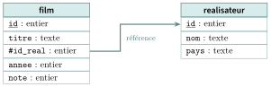
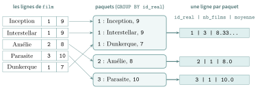

# Cours

<p class="sous-titre">Bases de données et SQL</p>

<span id="chap-06" class="ancre"></span>

|  |  |
|:---|:---|
| **Programme (BO)** | *« Bases de données relationnelles et langage SQL. Vocabulaire : relation (table), attribut (colonne), enregistrement (ligne), domaine, clé primaire, clé étrangère, schéma. Systèmes de gestion de bases de données (SGBD) : rôle et fonctionnalités. Requêtes d’interrogation (`SELECT`… `FROM`… `WHERE`, jointure) et de mise à jour (`INSERT`, `UPDATE`, `DELETE`). »* |
| **Prérequis** | la notion de **type** (domaine) ; les tableaux et dictionnaires (comme analogies) ; un peu de logique (**et**, **ou**, **non**). |
| **Objectifs** | *comprendre* pourquoi une base de données s’impose ; *modéliser* des données en relationnel (relations, clés) ; *connaître* le rôle d’un SGBD ; *écrire* des requêtes SQL d’interrogation **et** de mise à jour. |

## Pourquoi une base de données ? Quand le tableur ne suffit plus

Pour ranger quelques informations, un tableur (type Excel) ou un fichier texte peuvent suffire. Mais dès que les données deviennent **nombreuses**, **partagées** et **précieuses**, ces solutions craquent : une même information recopiée à plusieurs endroits finit par se contredire, deux personnes qui modifient le fichier en même temps écrasent le travail l’une de l’autre, la recherche devient lente. Une banque (un virement doit être fait en entier ou pas du tout : c’est une **transaction**), un site marchand (le dernier article en stock ne doit pas être vendu deux fois), un réseau social (des milliards de lignes interrogées en une fraction de seconde) ou le carnet de notes d’un lycée (pas de note pour un élève qui n’existe pas, chacun ne voit que ce qui le concerne) ne peuvent pas s’en contenter.

!!! regle "Règle 1 — Ce qu’un simple fichier ne sait pas faire"

    Une base de données assure quatre choses qu’un tableur néglige : la **cohérence** (des règles empêchent les données absurdes), les **accès concurrents** (plusieurs utilisateurs à la fois, sans se marcher dessus), l’**efficacité** (recherche rapide même sur d’énormes volumes) et la **sécurité** (droits d’accès, sauvegarde, transactions).

!!! remarque "Remarque"

    Vous en utilisez sans le savoir des dizaines par jour : votre téléphone stocke ses contacts, ses messages, ses photos dans des bases de données. La quasi-totalité des applications du monde repose dessus.

## Le modèle relationnel

En **1970**, un chercheur d’IBM, **Edgar F. Codd**, propose d’organiser les données en **tableaux** reliés entre eux : c’est le **modèle relationnel**, encore ultra-dominant aujourd’hui.

!!! definition "Définition 1 — Relation, attribut, enregistrement, domaine"

    Une **relation** (ou **table**) est un tableau à deux dimensions. Chaque **colonne** est un **attribut**, qui porte un **nom** et un **domaine** (son type : entier, texte, date…). Chaque **ligne** est un **enregistrement** : une entité décrite par une valeur pour chaque attribut.

Prenons une base de données de **films**. Voici la relation `film` :

| **id** | **titre**    | **id_real** | **annee** | **note** |
|:------:|:-------------|:-----------:|:---------:|:--------:|
|   1    | Inception    |      1      |   2010    |    9     |
|   2    | Interstellar |      1      |   2014    |    9     |
|   3    | Amélie       |      2      |   2001    |    8     |
|   4    | Parasite     |      3      |   2019    |    10    |
|   5    | Dunkerque    |      1      |   2017    |    7     |

!!! definition "Définition 2 — Schéma"

    Le **schéma** d’une relation donne le nom de la relation et, pour chaque attribut, son nom et son domaine. On le note ainsi (la clé primaire est soulignée) : $$\texttt{film}\,(\ \underline{\texttt{id}}:\text{entier},\ \texttt{titre}:\text{texte},\ \texttt{id\_real}:\text{entier},\ \texttt{annee}:\text{entier},\ \texttt{note}:\text{entier}\ )$$ Le **schéma d’une base** est l’ensemble des schémas de ses relations.

!!! remarque "Remarque"

    Une relation est un **ensemble** d’enregistrements : l’ordre des lignes n’a aucune importance, et il ne peut pas y avoir deux lignes totalement identiques.

<span id="cours-06-1" class="ancre"></span>

<span class="afaire">▶ Exercices d'application :</span> exercice **[1](exercices.md#ex-06-1)** (lire un schéma)

## Les contraintes d’intégrité : garder des données saines

Le modèle relationnel impose des **règles** qui empêchent les incohérences. Ce sont les **contraintes d’intégrité**.

### Contrainte de domaine

!!! regle "Règle 2"

    Chaque valeur d’un attribut doit appartenir à son **domaine**, c’est-à-dire à son **type**. Un attribut `annee` de type *entier* doit refuser la valeur `"hier"`. Bien choisir les domaines, c’est déjà interdire une foule d’erreurs.

!!! remarque "Remarque — SQLite, un SGBD au typage souple"

    La plupart des SGBD (PostgreSQL, MySQL…) refusent `"hier"` dans une colonne `INTEGER`. **SQLite, lui, peut l’accepter** : le type déclaré n’est qu’une *préférence* (on parle d’**affinité**). Il convertit `’2024’` en l’entier `2024`, mais range `’hier’` tel quel, comme du texte, sans erreur. Pour obtenir un vrai contrôle de domaine en SQLite, on ajoute une contrainte explicite, par exemple `annee INTEGER CHECK (typeof(annee) = ’integer’)`, ou l’on déclare la table `STRICT` (SQLite 3.37 et plus).

!!! remarque "Remarque — Les principaux types SQL"

    En SQL (ici en SQLite), les domaines les plus courants sont : `INTEGER` (entier), `REAL` (nombre à virgule), `TEXT` (chaîne de caractères) et `BLOB` (données binaires). Un **booléen** se code par un `INTEGER` (`0`/`1`) et une **date** par un `TEXT` (ou un entier). *Attention aux « faux nombres »* : un code postal (`06000`) ou un numéro de téléphone se stockent en `TEXT`, pas en `INTEGER` — sinon le `0` initial disparaît et `06000` devient `6000` !

### Clé primaire : identifier sans ambiguïté

!!! definition "Définition 3 — Clé primaire"

    La **clé primaire** d’une relation est un attribut (ou un groupe d’attributs) dont la valeur **identifie de façon unique** chaque enregistrement. Son **rôle** est donc de *distinguer sans ambiguïté* les lignes ; le SGBD garantit qu’**aucune** clé primaire ne se répète (et qu’elle n’est jamais vide). C’est la **contrainte d’entité**.

Dans `film`, deux films peuvent partager le même titre ou la même année : c’est pourquoi on ajoute un attribut `id` (un numéro unique) qui sert de clé primaire.

!!! regle "Règle 3 — Question de bac : « tel attribut peut-il être clé primaire ? »"

    Un attribut ne peut être clé primaire que si ses valeurs sont **toujours différentes** d’une ligne à l’autre (et jamais vides). C’est pourquoi le `nom`, le `titre` ou un numéro de `téléphone` font en général de **mauvaises** clés (homonymes, valeurs partagées ou manquantes) : on leur préfère un **identifiant** dédié. Plusieurs attributs peuvent convenir (les *clés candidates*) ; on en choisit **une**.

### Clé étrangère : relier les tables

Dans `film`, l’attribut `id_real` ne contient pas le *nom* du réalisateur, mais un **numéro** qui **renvoie** à une autre table, `realisateur` :

| **id** | **nom**      | **pays**     |
|:------:|:-------------|:-------------|
|   1    | Nolan        | Royaume-Uni  |
|   2    | Jeunet       | France       |
|   3    | Bong Joon-ho | Corée du Sud |

!!! definition "Définition 4 — Clé étrangère"

    Une **clé étrangère** est un attribut d’une relation dont la valeur doit être celle d’une **clé primaire** dans une autre (ou la même) relation. Son **rôle** est de *relier deux tables* et de garantir que la référence **existe** vraiment. Ici, `film.id_real` est une clé étrangère qui référence `realisateur.id`.

On représente souvent le schéma de la base par un dessin : une boîte par relation, la clé primaire soulignée, la clé étrangère précédée d’un `#`, et une flèche qui va de la clé étrangère vers la clé primaire qu’elle référence.

{ .tikz loading=lazy }

!!! regle "Règle 4 — Contrainte de référence"

    Une clé étrangère ne peut désigner qu’une valeur **existante**. Impossible d’ajouter un film dont le `id_real` vaut `7` si aucun réalisateur n’a l’`id` `7`. Impossible, aussi, de supprimer le réalisateur `1` tant que des films le référencent. La base reste **cohérente**.

!!! regle "Règle 5 — Question de bac : différence entre clé primaire et clé étrangère"

    La **clé primaire** *identifie* de façon unique les lignes de **sa** table (unicité garantie). La **clé étrangère** *pointe* vers la clé primaire d’une **autre** table pour les relier (elle, peut se répéter : un même réalisateur a plusieurs films). En résumé : la primaire *distingue*, l’étrangère *relie*.

!!! remarque "Remarque — Pourquoi deux tables plutôt qu’une ?"

    On aurait pu écrire le nom du réalisateur en toutes lettres dans chaque film. Mais alors « Nolan » serait recopié 3 fois : une faute de frappe (« Nollan ») créerait un second réalisateur fantôme, et corriger son pays obligerait à modifier partout. En **séparant** en deux tables reliées par une clé étrangère, chaque information n’est écrite **qu’une fois** : c’est plus sûr et plus léger. Relier des tables ainsi, c’est tout l’art du modèle relationnel.

### D’autres contraintes utiles

Au-delà des trois grandes contraintes (domaine, entité, référence), on peut en imposer d’autres à un attribut :

- `NOT NULL` : l’attribut ne peut pas être **vide** (obligatoire) ;

- `UNIQUE` : toutes ses valeurs doivent être **différentes**, sans pour autant être la clé primaire (*ex.* une adresse e-mail) ;

- une **contrainte utilisateur** (ou « métier ») : une règle propre au contexte, par exemple « une `note` est comprise entre `0` et `20` » ou « un `age` est positif ».

!!! regle "Règle 6 — Récapitulatif : les contraintes d’intégrité"

    **de domaine** (bon type) ; **d’entité** (clé primaire unique) ; **de référence** (clé étrangère existante) ; et les contraintes complémentaires (`NOT NULL`, `UNIQUE`, règles métier). Toutes servent le même but : garder des données **cohérentes**.

<span id="cours-06-2" class="ancre"></span>

<span class="afaire">▶ Exercices d'application :</span> exercices **[2](exercices.md#ex-06-2) et [3](exercices.md#ex-06-3)** (clés, contraintes, faire évoluer le modèle)

## Le SGBD : le chef d’orchestre

On ne manipule jamais les fichiers d’une base « à la main » : on passe par un **logiciel** spécialisé.

!!! definition "Définition 5 — Système de gestion de bases de données (SGBD)"

    Un **SGBD** est le logiciel qui **stocke**, **protège** et **interroge** une base de données. On ne lui parle pas dans un langage de programmation classique, mais avec un langage dédié : **SQL**.

!!! regle "Règle 7 — Les grandes fonctions d’un SGBD"

    - **Persistance** : les données survivent à l’extinction de la machine.

    - **Cohérence** : il fait respecter toutes les contraintes d’intégrité.

    - **Efficacité** : il recherche vite, même dans des milliards de lignes (grâce à des *index* — souvent des arbres, cf. chapitre *Arbres* !).

    - **Sécurité** : droits d’accès par utilisateur, sauvegardes.

    - **Accès concurrents** : plusieurs utilisateurs en même temps, sans conflit, grâce aux **transactions**.

!!! remarque "Remarque — Question de bac : « intérêt d’un SGBD » / « deux services rendus »"

    Il suffit d’en citer deux parmi la liste ci-dessus. Réponses attendues typiques : il **garantit la cohérence** des données (contraintes d’intégrité), il gère les **accès concurrents** de plusieurs utilisateurs, il assure la **persistance** et la **sécurité**, et il permet d’**interroger efficacement** de gros volumes. Là où un simple fichier laisserait apparaître des incohérences, le SGBD les *empêche*.

!!! remarque "Remarque — Les transactions : le « tout ou rien »"

    Une **transaction** regroupe des opérations qui doivent réussir **ensemble** ou **pas du tout**. Le virement bancaire (débit *et* crédit) en est l’exemple parfait : si une panne survient au milieu, la transaction est **annulée** entièrement, comme si rien ne s’était passé. On résume ces garanties par l’acronyme **ACID**.

!!! remarque "Remarque"

    Des SGBD célèbres : **PostgreSQL**, **MySQL**, **Oracle**, **SQLite**. Ce dernier, minuscule et sans serveur, est embarqué dans presque toutes les applications et tous les téléphones. C’est celui que nous utiliserons (via *DB Browser* ou un site en ligne).

## SQL : interroger une base de données

**SQL** (*Structured Query Language*) est le langage universel des bases relationnelles. Une instruction SQL s’appelle une **requête**. Commençons par la plus importante : **lire** des données.

### Créer et remplir une table

Pour mémoire, on crée une table avec `CREATE TABLE` et on y ajoute des lignes avec `INSERT`.

```sql
CREATE TABLE film (
    id INTEGER PRIMARY KEY,
    titre TEXT,
    id_real INTEGER,
    annee INTEGER,
    note INTEGER
);

INSERT INTO film (id, titre, id_real, annee, note)
VALUES (1, 'Inception', 1, 2010, 9);
```

!!! remarque "Remarque"

    En SQL, les mots-clés (`SELECT`, `FROM`…) s’écrivent traditionnellement en **majuscules** (ce n’est pas obligatoire) et les chaînes de caractères entre **apostrophes simples** : `’Inception’`.

### `SELECT` … `FROM` : choisir des colonnes

!!! regle "Règle 8 — La requête de base"

    `SELECT` liste les **colonnes** à récupérer ; `FROM` indique la **table**. L’étoile `*` signifie « toutes les colonnes ».

```sql
SELECT titre, annee
FROM film;
```

donne :

| **titre**    | **annee** |
|:-------------|:---------:|
| Inception    |   2010    |
| Interstellar |   2014    |
| Amélie       |   2001    |
| Parasite     |   2019    |
| Dunkerque    |   2017    |

### `WHERE` : filtrer les lignes

!!! regle "Règle 9"

    `WHERE` garde uniquement les lignes qui **satisfont une condition**. On combine les conditions avec `AND`, `OR`, `NOT`, et on compare avec `=`, `<>` (différent), `<`, `>`, `<=`, `>=`.

```sql
SELECT titre
FROM film
WHERE annee > 2010 AND note >= 9;
```

renvoie `Interstellar` et `Parasite`.

!!! remarque "Remarque — Tester une case vide : IS NULL"

    Un attribut peut être **vide** (valeur `NULL` — par exemple une date de retour non encore renseignée). On ne la teste **pas** avec `= NULL` (qui ne fonctionne pas en SQL), mais avec `IS NULL` (case vide) ou `IS NOT NULL` (case renseignée) :

    ```sql
    SELECT titre
    FROM film
    WHERE note IS NULL;      -- les films dont la note n'est pas renseignee
    ```

### `ORDER BY` : trier le résultat

```sql
SELECT titre, note
FROM film
ORDER BY note DESC;
```

trie les films de la meilleure note à la moins bonne (`DESC` = décroissant ; `ASC` = croissant, par défaut).

### `DISTINCT` : supprimer les doublons

```sql
SELECT DISTINCT id_real
FROM film;
```

renvoie chaque réalisateur **une seule fois**, même s’il a plusieurs films.

### Les fonctions d’agrégation

Elles **résument** une colonne en *une* valeur : `COUNT` (compter), `SUM` (somme), `AVG` (moyenne), `MIN`, `MAX`.

```sql
SELECT COUNT(*)                    -- nombre de films : 5
FROM film;

SELECT AVG(note)                   -- note moyenne
FROM film;

SELECT MAX(note)                   -- meilleure note avant 2015
FROM film
WHERE annee < 2015;
```

!!! remarque "Remarque — Pour aller plus loin — au-delà du strict programme"

    Les clauses présentées d’ici aux jointures (`LIKE`, `LIMIT`, l’alias `AS`, `GROUP BY` et `HAVING`) ne sont pas exigées au bac, mais elles sont très courantes et rendent SQL vraiment puissant. Les fonctions d’agrégation ci-dessus, elles, sont au programme, à condition de les utiliser **sans** `GROUP BY` ni `HAVING`.

### `LIKE` : rechercher un motif

`LIKE` compare du texte à un **motif** : `%` remplace n’importe quelle suite de caractères, `_` un seul.

```sql
SELECT titre
FROM film
WHERE titre LIKE 'In%';
```

renvoie les titres commençant par « In » : `Inception`, `Interstellar`.

### Alias `AS` et `LIMIT`

`AS` renomme une colonne dans le résultat ; `LIMIT` borne le nombre de lignes.

```sql
SELECT titre AS film, note AS etoiles
FROM film
ORDER BY note DESC
LIMIT 3;
```

donne les **3** meilleurs films, avec des colonnes renommées.

### `GROUP BY` : regrouper puis résumer

`GROUP BY` forme des **paquets** de lignes partageant une même valeur, et applique un agrégat à **chaque** paquet.

```sql
SELECT id_real, COUNT(*) AS nb_films, AVG(note) AS moyenne
FROM film
GROUP BY id_real;
```

donne, **pour chaque réalisateur**, son nombre de films et sa note moyenne :

{ .tikz loading=lazy }

On peut filtrer *après* regroupement avec `HAVING` :

```sql
SELECT id_real, COUNT(*) AS nb
FROM film
GROUP BY id_real
HAVING COUNT(*) >= 2;
```

ne garde que les réalisateurs ayant **au moins 2** films.

!!! remarque "Remarque"

    Retenez la différence : `WHERE` filtre les lignes *avant* le regroupement, `HAVING` filtre les paquets *après*.

### Les jointures : croiser deux tables

Notre requête `GROUP BY` affiche des `id_real` (`1`, `2`…), pas des noms. Pour afficher le **nom** du réalisateur, il faut **recoller** les deux tables : c’est une **jointure**.

!!! regle "Règle 10 — JOIN … ON"

    `FROM A JOIN B ON A.cle_etrangere = B.cle_primaire` fusionne chaque ligne de `A` avec la ligne de `B` qui lui correspond, selon l’égalité indiquée après `ON`.

```sql
SELECT film.titre, realisateur.nom
FROM film
JOIN realisateur ON film.id_real = realisateur.id;
```

associe à chaque film le nom de son réalisateur :

| **titre**    | **nom**      |
|:-------------|:-------------|
| Inception    | Nolan        |
| Interstellar | Nolan        |
| Amélie       | Jeunet       |
| Parasite     | Bong Joon-ho |
| Dunkerque    | Nolan        |

!!! remarque "Remarque"

    Quand un nom d’attribut existe dans les deux tables (ici `id`), on le **préfixe** par le nom de sa table (`realisateur.id`) pour lever l’ambiguïté. On peut évidemment combiner une jointure avec `WHERE`, `ORDER BY`, `GROUP BY`… et joindre **trois** tables ou plus.

<span id="cours-06-4" class="ancre"></span>

<span class="afaire">▶ Exercices d'application :</span> exercices **[4](exercices.md#ex-06-4) à [14](exercices.md#ex-06-14)** (interroger, agréger, regrouper, jointures)

## SQL : modifier une base de données

Au-delà de la lecture, SQL sait aussi **écrire**. Trois instructions, à manier avec prudence.

!!! regle "Règle 11 — Les trois commandes de mise à jour"

    - `INSERT INTO … VALUES …` : **ajouter** une ligne ;

    - `UPDATE … SET … WHERE …` : **modifier** des lignes existantes ;

    - `DELETE FROM … WHERE …` : **supprimer** des lignes.

```sql
UPDATE film
SET note = 8
WHERE titre = 'Dunkerque';

DELETE FROM film
WHERE annee < 2005;
```

!!! regle "Règle 12 — Le WHERE qui sauve des vies"

    **N’oubliez jamais le `WHERE`** dans un `UPDATE` ou un `DELETE` ! `DELETE FROM film;` (sans condition) efface **tous** les films d’un coup. C’est la requête la plus redoutée des informaticiens.

<span id="cours-06-15" class="ancre"></span>

<span class="afaire">▶ Exercices d'application :</span> exercice **[15](exercices.md#ex-06-15)** (insérer, modifier, supprimer)

## Ouverture et histoire

!!! remarque "Remarque — Un peu d’histoire… et d’humour"

    Avant de ranger les données, il a fallu pouvoir les **retrouver vite**. Jusque dans les années 1950, elles dorment sur des cartes perforées ou des bandes magnétiques, qu’il faut dérouler du début. En **1956**, IBM commercialise le **premier disque dur**, l’**IBM 350** du système *RAMAC* : cinquante plateaux de 61 cm de diamètre pour… 5 millions de caractères (moins de 4 Mo), loués plus de $3\,000$ dollars par mois. Pour la première fois, on accède **directement** à n’importe quel enregistrement. Le modèle relationnel naît ensuite en **1970** sous la plume d’**Edgar F. Codd**, chez IBM — une idée si féconde qu’elle lui vaudra le prix **Turing** en 1981. Dans la foulée, **Donald Chamberlin** et **Raymond Boyce** conçoivent un langage pour l’interroger : *SEQUEL*, vite rebaptisé **SQL**. D’où l’éternelle querelle : faut-il prononcer « *ess-cue-elle* » ou « *sequel* » ? Un demi-siècle plus tard, personne n’a tranché — c’est la seule dispute plus vieille que celle des accolades. Codd et ses collègues cherchaient alors à gérer les **grandes masses de données** des entreprises (le prototype d’IBM s’appelait *System R*) ; depuis, SQL règne sans partage : les données de la planète, de votre banque à votre application de messagerie, s’expriment dans ce langage vieux d’un demi-siècle et jamais détrôné.

    \*(image manquante : 06_hist_ibm_ramac)\*  
    Le mécanisme du disque IBM 350 (1956)

!!! remarque "Remarque — La suite"

    On a effleuré les **transactions** et les **index** (qui, en coulisses, sont souvent des *arbres* !). Les bases relationnelles ne sont pas les seules : pour un réseau social, un **modèle de graphe** est parfois plus adapté — clin d’œil au chapitre « graphes ».

!!! remarque "Remarque — Liens avec d’autres chapitres"

    Un enregistrement ressemble à un **objet** : ses colonnes sont des **attributs**, comme en **programmation objet**, et une table rassemble des entités de même structure, comme les instances d’une même classe. SQL est un langage **déclaratif** : on décrit *ce que* l’on veut, pas *comment* l’obtenir — un autre **paradigme** que l’impératif. Le SGBD retrouve vite une ligne grâce à des **index**, souvent des **arbres** de recherche, et `LIKE` est une forme simple de **recherche textuelle** (trouver un motif dans un texte).

## Bilan — la carte mémoire

| **Notion / clause** | **À retenir** |
|:---|:---|
| Relation / attribut / enregistrement | table / colonne / ligne |
| Domaine | le type d’un attribut (contrainte de domaine) |
| Clé primaire | identifie chaque ligne de façon **unique** |
| Clé étrangère | référence une clé primaire d’une autre table |
| SGBD | logiciel qui stocke, protège, interroge (persistance, cohérence, …) |
| `SELECT … FROM … WHERE` | choisir des colonnes, filtrer des lignes |
| `ORDER BY` / `DISTINCT` | trier / enlever les doublons |
| `COUNT/SUM/AVG/MIN/MAX` | résumer une colonne en une valeur |
| `GROUP BY` / `HAVING` | regrouper, filtrer les groupes (au-delà du BO) |
| `JOIN … ON` | croiser deux tables par une clé |
| `INSERT` / `UPDATE` / `DELETE` | ajouter / modifier / supprimer (**penser au `WHERE` !**) |

## Erreurs fréquentes

- **Oublier le `WHERE` d’un `UPDATE` / `DELETE`.** Sans lui, on modifie ou supprime **toute la table**. *Le réflexe :* « le `WHERE` qui sauve des vies ».

- **Oublier la condition de jointure.** `FROM a, b` sans `WHERE`/`ON` produit le **produit cartésien** (toutes les combinaisons).

- **Confondre `WHERE` et `HAVING`.** `WHERE` filtre les **lignes** (avant regroupement), `HAVING` filtre les **groupes** (après `GROUP BY`).

- **Confondre clé primaire et clé étrangère.** La clé primaire **identifie** une ligne ; la clé étrangère **référence** la clé primaire d’une autre table.

- **Croire que `ORDER BY` / `DISTINCT` changent les données.** Ils ne changent que l’**affichage** du résultat, pas la table.

- **Détails de syntaxe.** Chaînes entre **apostrophes** (`’Ada’`), test d’égalité avec **un seul** `=`.

## Savoir-faire à maîtriser

*À la fin du chapitre, je sais…*

- lire un **schéma relationnel** (clés primaire et étrangère) $\to$ ex. [1](exercices.md#ex-06-1), [2](exercices.md#ex-06-2), [3](exercices.md#ex-06-3) ;

- écrire `SELECT` / `FROM` / `WHERE` (`AND`, `OR`, `NOT`), `ORDER BY`, `DISTINCT` $\to$ ex. [4](exercices.md#ex-06-4), [5](exercices.md#ex-06-5), [6](exercices.md#ex-06-6) ;

- utiliser les **agrégats** (`COUNT`, `SUM`, `AVG`, `MIN`, `MAX`) $\to$ ex. [8](exercices.md#ex-06-8), [9](exercices.md#ex-06-9), [10](exercices.md#ex-06-10) ; pour aller plus loin, regrouper avec `GROUP BY` / `HAVING` $\to$ ex. [11](exercices.md#ex-06-11) ;

- écrire une **jointure** (`JOIN … ON`) entre deux tables $\to$ ex. [12](exercices.md#ex-06-12), [13](exercices.md#ex-06-13) ;

- **mettre à jour** une base (`INSERT`, `UPDATE`, `DELETE`) sans oublier le `WHERE` $\to$ ex. [15](exercices.md#ex-06-15), [18](exercices.md#ex-06-18) ;

- expliquer le rôle d’un **SGBD** et d’une **transaction** (propriétés ACID) $\to$ ex. [2](exercices.md#ex-06-2), [16](exercices.md#ex-06-16).

## Vers le Grand Oral

Quelques pistes de questions que ce chapitre permet de préparer (à étayer d’un exemple concret) :

- **Pourquoi répartir les données en plusieurs tables ?** *(éviter la redondance, garantir la cohérence, relier par des clés.)*

- **Qu’est-ce qu’une transaction, et pourquoi les propriétés ACID ?** *(un virement bancaire en tout-ou-rien ; les accès simultanés.)*

- **SQL : comment retrouver une information dans des millions de lignes ?** *(langage déclaratif « je décris ce que je veux » ; les index, qui sont des arbres.)*
