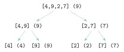
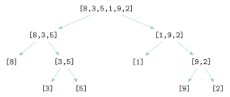
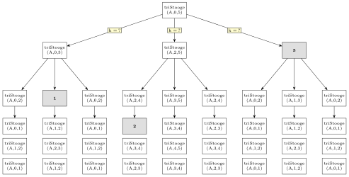

# Exercices

<p class="sous-titre">Diviser pour régner</p>

!!! consignes "Mode d’emploi"

    - Niveau : ★ échauffement, ★★ classique (niveau bac), ★★★ défi ; les *coups de pouce* et les *corrigés* se déplient sous chaque exercice.

    - <span class="run" title="À programmer et tester sur machine">▶</span> *À programmer et tester* en Python (console ou éditeur en ligne).

    - **Réflexe** « diviser pour régner » : **(1)** comment **diviser** en sous-problèmes plus petits ? **(2)** quelle est la **condition d’arrêt** ? **(3)** comment **combiner** les résultats ?

    - Le *tri rapide*, le *Tim sort* et la *rotation d’image* sont traités dans les **TP** proposés en fin de chapitre.

    - Usage de l’IA, indiqué sur chaque exercice : <span class="ia ia-rouge" title="Sans IA : le but est l'automatisme lui-même"></span> aucune ; <span class="ia ia-orange" title="IA en appui : déboguer, reformuler, vérifier ; la réponse finale est la vôtre"></span> en appui (déboguer, reformuler, vérifier ; la réponse finale est écrite et comprise par vous) ; <span class="ia ia-vert" title="IA intégrée : l'exercice s'appuie sur une réponse d'IA"></span> l’exercice s’appuie sur une réponse d’IA. Voir la [charte d’usage de l’IA](../charte.md).

### Comprendre et dérouler

### <span class="stars" title="Niveau 1 sur 3">★</span> <span class="exo-num">Exercice 1</span> — Recherche dichotomique à la main <span class="ia ia-rouge" title="Sans IA : le but est l'automatisme lui-même"></span> { #ex-07-1 }

On cherche dans le tableau trié `tab = [3, 8, 12, 19, 25, 31, 40, 42, 55, 60, 71]`.

1.  Donner, dans l’ordre, les valeurs comparées lors de la recherche de `40`. Combien de comparaisons ?

2.  Même question pour la recherche de `7` (absent). Comment sait-on qu’il est absent ?

3.  Sur un tableau trié de $1000$ valeurs, combien de comparaisons au maximum ? (donner un ordre de grandeur, en justifiant par les divisions par $2$).

??? corrige "Corrigé"

    !!! remarque "Remarque"

        Plusieurs écritures sont souvent possibles : on donne **une** version simple.

    `tab = [3, 8, 12, 19, 25, 31, 40, 42, 55, 60, 71]` (indices $0$ à $10$ ; on note `m = (g + d) // 2`).

    **1.** Recherche de `40` :

    - `g=0, d=10, m=5` : `tab[5]=31 < 40` $\rightarrow$ `g=6` ;

    - `g=6, d=10, m=8` : `tab[8]=55 > 40` $\rightarrow$ `d=7` ;

    - `g=6, d=7, m=6` : `tab[6]=40` : **trouvé**.

    Valeurs comparées : `31`, `55`, `40` $\rightarrow$ **3 comparaisons**.

    **2.** Recherche de `7` (absent) :

    - `g=0, d=10, m=5` : `31 > 7` $\rightarrow$ `d=4` ;

    - `g=0, d=4, m=2` : `12 > 7` $\rightarrow$ `d=1` ;

    - `g=0, d=1, m=0` : `3 < 7` $\rightarrow$ `g=1` ;

    - `g=1, d=1, m=1` : `8 > 7` $\rightarrow$ `d=0`.

    Maintenant `g=1 > d=0` : l’intervalle de recherche est **vide**, donc `7` est **absent**. Valeurs comparées : `31`, `12`, `3`, `8` $\rightarrow$ **4 comparaisons**.

    **3.** À chaque comparaison, la zone de recherche est **divisée par deux**. Partant de $1000$, on atteint $1$ en une dizaine d’étapes : $2^{10} = 1024 > 1000$, donc **au plus $\mathbf{10}$ comparaisons** (coût logarithmique $\log_2 n$).

### <span class="stars" title="Niveau 1 sur 3">★</span> <span class="exo-num">Exercice 2</span> — Maximum d’un tableau par diviser pour régner <span class="ia ia-rouge" title="Sans IA : le but est l'automatisme lui-même"></span> { #ex-07-2 }

Pour trouver le maximum d’un tableau **non vide** `t`, on peut procéder ainsi : si `t` n’a qu’un élément, c’est lui le maximum ; sinon, on coupe `t` en deux moitiés, on cherche le maximum de chaque moitié, et on garde le plus grand des deux.

```python
def maximum(t):
    if len(t) == 1:                 # condition d'arret
        return ...                  # a completer
    milieu = len(t) // 2
    m_g = maximum(...)              # a completer
    m_d = maximum(...)              # a completer
    if m_g > m_d:
        return m_g
    else:
        return m_d
```

1.  Repérer dans ce code les trois temps : **diviser**, **régner**, **combiner**.

2.  <span class="run" title="À programmer et tester sur machine">▶</span> Compléter les trois lignes manquantes, puis tester la fonction sur `[4, 9, 2, 7]`.

3.  Dessiner l’arbre des appels de `maximum([4, 9, 2, 7])` en notant, à côté de chaque appel, la valeur qu’il renvoie.

??? corrige "Corrigé"

    **1.** **Diviser** : `milieu = len(t) // 2` coupe `t` en deux moitiés ; **régner** : les deux appels récursifs calculent `m_g` et `m_d` ; **combiner** : le `if` garde le plus grand des deux. La condition d’arrêt est le tableau d’un seul élément.

    **2.**

    ```python
    def maximum(t):
        if len(t) == 1:                 # condition d'arret
            return t[0]
        milieu = len(t) // 2
        m_g = maximum(t[:milieu])
        m_d = maximum(t[milieu:])
        if m_g > m_d:
            return m_g
        else:
            return m_d
    ```

    `maximum([4, 9, 2, 7])` renvoie `9`.

    *Autre méthode :* au lieu de recopier les moitiés avec des tranches, on peut, comme pour la recherche dichotomique du cours, travailler sur la zone `t[debut..fin]` repérée par deux indices ; aucune liste n’est alors recopiée. Premier appel : `maximum_zone(t, 0, len(t) - 1)`.

    ```python
    def maximum_zone(t, debut, fin):
        if debut == fin:                # condition d'arret : un seul element
            return t[debut]
        milieu = (debut + fin) // 2
        m_g = maximum_zone(t, debut, milieu)
        m_d = maximum_zone(t, milieu + 1, fin)
        if m_g > m_d:
            return m_g
        else:
            return m_d
    ```

    **3.** Arbre des appels (valeur renvoyée entre parenthèses) :

    { .tikz loading=lazy }

### <span class="stars" title="Niveau 2 sur 3">★★</span> <span class="exo-num">Exercice 3</span> — Tri fusion : l’arbre des appels <span class="ia ia-rouge" title="Sans IA : le but est l'automatisme lui-même"></span> { #ex-07-3 }

On trie `[8, 3, 5, 1, 9, 2]` par tri fusion (on coupe à `milieu = len(tab) // 2`).

1.  Dessiner l’arbre de la phase « diviser » (jusqu’aux listes de $1$ élément).

    ??? pouce "Coup de pouce"

        Chaque liste de longueur au moins $2$ est coupée en `tab[:milieu]` et `tab[milieu:]` ; attention, pour une longueur impaire, la moitié gauche est la plus courte.

2.  Détailler la **remontée** : donner chaque liste obtenue par fusion, jusqu’à la liste triée finale.

    ??? pouce "Coup de pouce"

        Lire l’arbre de bas en haut : chaque nœud reçoit la fusion des deux listes triées de ses fils.

3.  <span class="run" title="À programmer et tester sur machine">▶</span> Compléter les deux appels récursifs de la fonction ci-dessous, puis la tester.

    ??? pouce "Coup de pouce"

        Que faut-il trier récursivement ? Exprimer chacune des deux moitiés avec une tranche de `tab` autour de `milieu`.

```python
def tri_fusion(tab):
    if len(tab) <= 1:
        return tab
    milieu = len(tab) // 2
    gauche = ...                    # a completer
    droite = ...                    # a completer
    return fusion(gauche, droite)   # fusion : cf. cours
```

??? corrige "Corrigé"

    **1.** Phase « diviser » de `[8, 3, 5, 1, 9, 2]` (coupe à `milieu = len // 2`) :

    { .tikz loading=lazy }

    **2.** Remontée (fusions) :

    - `[3]` & `[5]` $\rightarrow$ `[3,5]` ; puis `[8]` & `[3,5]` $\rightarrow$ `[3,5,8]` ;

    - `[9]` & `[2]` $\rightarrow$ `[2,9]` ; puis `[1]` & `[2,9]` $\rightarrow$ `[1,2,9]` ;

    - enfin `[3,5,8]` & `[1,2,9]` $\rightarrow$ `[1,2,3,5,8,9]`.

    **3.** Les deux appels récursifs portent sur les deux moitiés :

    ```python
    def tri_fusion(tab):
        if len(tab) <= 1:
            return tab
        milieu = len(tab) // 2
        gauche = tri_fusion(tab[:milieu])
        droite = tri_fusion(tab[milieu:])
        return fusion(gauche, droite)
    ```

### <span class="stars" title="Niveau 1 sur 3">★</span> <span class="exo-num">Exercice 4</span> — Compter les appels du tri fusion <span class="ia ia-rouge" title="Sans IA : le but est l'automatisme lui-même"></span> { #ex-07-4 }

On reprend la fonction `tri_fusion` de l’exercice précédent.

1.  Dessiner l’arbre des appels de `tri_fusion([6, 2, 7, 1])`. Combien d’appels à `tri_fusion` en tout (appel initial compris) ?

2.  Pour une liste de $8$ éléments, combien d’appels y a-t-il à chaque niveau de l’arbre ? Combien de niveaux sous l’appel initial ? Combien d’appels en tout ?

3.  Pour une liste de $1024 = 2^{10}$ éléments, combien de niveaux de découpe y a-t-il sous l’appel initial ? Quel lien avec $\log_2$ ?

??? corrige "Corrigé"

    **1.** `[6,2,7,1]` appelle `[6,2]` et `[7,1]`, qui appellent chacun deux listes d’un élément (`[6]`, `[2]`, `[7]`, `[1]`) : $1 + 2 + 4 = \mathbf{7}$ **appels**.

    **2.** Pour $8$ éléments : $1$ appel (taille $8$), puis $2$ (taille $4$), $4$ (taille $2$), $8$ (taille $1$). Il y a donc **3 niveaux** sous l’appel initial et $1+2+4+8 = \mathbf{15}$ **appels** en tout.

    **3.** À chaque niveau, la taille est divisée par $2$ : $1024 \to 512 \to \dots \to 1$, soit **10 niveaux**, et $10 = \log_2 1024$. Le nombre de niveaux de l’arbre est $\log_2 n$ : c’est l’origine du facteur $\log_2 n$ dans le coût $n\log_2 n$ du tri fusion.

### <span class="stars" title="Niveau 2 sur 3">★★</span> <span class="exo-num">Exercice 5</span> — Écrire la fusion de deux listes triées <span class="ia ia-orange" title="IA en appui : déboguer, reformuler, vérifier ; la réponse finale est la vôtre"></span> { #ex-07-5 }

1.  Fusionner **à la main** les listes triées `[1, 4, 9]` et `[2, 3, 10, 12]` : à chaque étape, noter les deux éléments comparés et celui qui est recopié. Combien de comparaisons ?

2.  <span class="run" title="À programmer et tester sur machine">▶</span> Écrire une fonction `fusion(a, b)` qui prend deux listes **triées** et renvoie une **nouvelle** liste triée contenant tous leurs éléments, sans utiliser `sort` ni `sorted`. La tester sur l’exemple de la question 1, puis avec une liste vide.

    ??? pouce "Coup de pouce"

        Garder un indice par liste. Tant que **les deux** listes ont encore des éléments, comparer leurs « têtes » et recopier la plus petite. Que reste-t-il à faire quand l’une des deux est épuisée ?

    ??? pouce "Coup de pouce 2 (début de solution)"

        `resultat = []`  
        `i, j = 0, 0`  
        `while i < len(a) and j < len(b):`  
        `if a[i] <= b[j]:` …

3.  Justifier que le nombre de comparaisons effectuées par `fusion(a, b)` est au plus `len(a) + len(b) - 1`. Quel est donc le coût de la fusion ?

    ??? pouce "Coup de pouce"

        Chaque comparaison est suivie de la recopie d’un élément ; combien d’éléments au plus sont recopiés avant que l’une des listes soit vide ?

??? corrige "Corrigé"

    **1.** `1` contre `2` $\to$ `1` ; `4` contre `2` $\to$ `2` ; `4` contre `3` $\to$ `3` ; `4` contre `10` $\to$ `4` ; `9` contre `10` $\to$ `9`. La première liste est épuisée : on recopie le reste `[10, 12]`. Résultat `[1, 2, 3, 4, 9, 10, 12]`, en **5 comparaisons**.

    **2.**

    ```python
    def fusion(a, b):
        resultat = []
        i, j = 0, 0
        while i < len(a) and j < len(b):
            if a[i] <= b[j]:
                resultat.append(a[i])
                i = i + 1
            else:
                resultat.append(b[j])
                j = j + 1
        return resultat + a[i:] + b[j:]   # recopier le reste
    ```

    `fusion([1, 4, 9], [2, 3, 10, 12])` renvoie `[1, 2, 3, 4, 9, 10, 12]` ; `fusion([], [1, 2])` renvoie `[1, 2]` (on n’entre pas dans la boucle).

    **3.** Chaque tour de boucle fait **une** comparaison et recopie **un** élément. La boucle s’arrête dès qu’une liste est épuisée, donc au plus quand tous les éléments sauf un ont été recopiés : au plus `len(a) + len(b) - 1` comparaisons. Le coût de la fusion est **linéaire** en la taille totale $n$ = `len(a) + len(b)`.

### Vers le bac

### <span class="stars" title="Niveau 2 sur 3">★★</span> <span class="exo-num">Exercice 6</span> — Coder un texte avec « diviser pour régner » *(d’après Métropole 2025, jour 2)* <span class="ia ia-orange" title="IA en appui : déboguer, reformuler, vérifier ; la réponse finale est la vôtre"></span> { #ex-07-6 }

Pour **compresser** un texte, on donne aux caractères **fréquents** un code binaire **court**. L’algorithme de **Shannon-Fano** est un « diviser pour régner » :

- on classe les caractères par effectif **décroissant** ;

- **diviser** : on coupe la liste en **deux groupes** d’effectif total à peu près égal (fonction `separe` ci-dessous) ; le premier groupe reçoit le bit `"1"`, le second le bit `"0"` ;

- **régner** : on recommence sur chaque groupe, jusqu’à ce qu’un groupe ne contienne **qu’un** caractère (condition d’arrêt).

On représente les données par une liste de couples `(caractère, effectif)`. On **admet** la fonction `separe`, qui coupe la liste triée en deux groupes d’effectifs équilibrés :

```python
def separe(tab):
    total = sum(effectif for (_, effectif) in tab)
    cumul = 0
    for k in range(len(tab)):
        cumul = cumul + tab[k][1]
        if cumul >= total / 2:      # point de coupe le plus equilibre
            break
    return tab[:k + 1], tab[k + 1:]
```

On considère le texte dont les effectifs sont : $$\texttt{tab = [("A", 15), ("B", 7), ("C", 6), ("D", 6), ("E", 5)]}.$$

1.  Que renvoie `separe(tab)` ? (donner les deux groupes) Quel bit (`"1"` ou `"0"`) commence alors le code de `"A"` ? celui de `"C"` ?

    ??? pouce "Coup de pouce"

        Calculer d’abord l’effectif total, puis cumuler les effectifs dans l’ordre jusqu’à atteindre la moitié de ce total.

2.  <span class="run" title="À programmer et tester sur machine">▶</span> Compléter la fonction récursive `shannon`, qui renvoie le code binaire d’un `symbole` :

    ??? pouce "Coup de pouce"

        Le code du symbole, c’est le bit de son groupe suivi du code du symbole *à l’intérieur de ce groupe* : sur quelle liste faire l’appel récursif ?

    ```python
    def shannon(symbole, tab):
        if len(tab) == 1:               # condition d'arret : un seul caractere
            return ""
        groupe1, groupe2 = separe(tab)
        if symbole in [c for (c, _) in groupe1]:
            return "1" + ...            # a completer
        else:
            return "0" + ...            # a completer
    ```

3.  <span class="run" title="À programmer et tester sur machine">▶</span> Vérifier que l’on obtient les codes `A = 11`, `B = 10`, `C = 011`, `D = 010`, `E = 00`. **Dérouler à la main** le calcul de `shannon("C", tab)`.

4.  Observer les cinq codes : montrer qu’**aucun n’est le début d’un autre**. Pourquoi est-ce indispensable pour **décoder** un texte sans ambiguïté ?

5.  En quoi cet algorithme relève-t-il de « diviser pour régner » ? Identifier les trois temps.

6.  **Terminaison** : justifier que la fonction `shannon` *s’arrête toujours* (quel « variant » diminue strictement à chaque appel récursif ?).

    ??? pouce "Coup de pouce"

        Comparer la longueur de `tab` à celle du groupe passé à l’appel récursif : chacun des deux groupes peut-il être vide ?

7.  <span class="run" title="À programmer et tester sur machine">▶</span> Écrire une fonction `encode_shannon(texte, tab)` qui renvoie le **texte codé** : la concaténation des codes `shannon` de chacun de ses caractères. Exemple : `encode_shannon("CAD", tab)` renvoie `"011"+"11"+"010" = "01111010"`.

    ??? pouce "Coup de pouce"

        Partir d’une chaîne vide et la compléter en parcourant le texte caractère par caractère.

!!! remarque "Remarque"

    Ce sujet (Métropole 2025, jour 2) montre que « diviser pour régner » ne sert pas qu’à **trier** : il structure aussi la **compression** des données.

??? corrige "Corrigé"

    **1.** L’effectif total est $15+7+6+6+5 = 39$, et $39/2 = 19{,}5$. Le cumul atteint $19{,}5$ dès `"B"` ($15+7 = 22$). Donc $$\texttt{separe(tab)} = \big(\,[("A",15),("B",7)]\ ,\ [("C",6),("D",6),("E",5)]\,\big).$$ `"A"` est dans le premier groupe $\rightarrow$ son code commence par `"1"` ; `"C"` est dans le second $\rightarrow$ son code commence par `"0"`.

    **2.** On préfixe le bit puis on recommence sur le *bon* groupe :

    ```python
    def shannon(symbole, tab):
        if len(tab) == 1:
            return ""
        groupe1, groupe2 = separe(tab)
        if symbole in [c for (c, _) in groupe1]:
            return "1" + shannon(symbole, groupe1)
        else:
            return "0" + shannon(symbole, groupe2)
    ```

    **3.** Codes obtenus : `A = 11`, `B = 10`, `C = 011`, `D = 010`, `E = 00`. Déroulement de `shannon("C", tab)` :

    - `tab` $\rightarrow$ groupes `[A,B]` et `[C,D,E]` ; `C` est dans le second $\rightarrow$ `"0" +` `shannon("C", [C,D,E])` ;

    - `[C,D,E]` : total $17$, coupe après `C,D` (cumul $12 \ge 8{,}5$) $\rightarrow$ groupes `[C,D]` et `[E]` ; `C` dans le premier $\rightarrow$ `"1" +` `shannon("C", [C,D])` ;

    - `[C,D]` : total $12$, coupe après `C` (cumul $6 \ge 6$) $\rightarrow$ groupes `[C]` et `[D]` ; `C` dans le premier $\rightarrow$ `"1" +` `shannon("C", [C])` ;

    - `[C]` : un seul caractère $\rightarrow$ `""`.

    En remontant : `"1" + "" = "1"`, puis `"1" + "1" = "11"`, puis `"0" + "11" = "011"`. D’où `C = 011`.

    **4.** Les codes `11, 10, 011, 010, 00` forment un **code préfixe** : aucun n’est le début d’un autre. C’est indispensable au **décodage** : en lisant le texte codé bit à bit, dès qu’on reconnaît un code on sait qu’il est *complet* (il ne peut pas être le début d’un code plus long), donc le découpage en symboles est **sans ambiguïté**.

    **5.** Trois temps de « diviser pour régner » : **diviser** = couper la liste en deux groupes d’effectifs équilibrés (`separe`) ; **régner** = appeler récursivement `shannon` sur le groupe contenant le symbole ; **combiner** = préfixer le bit `"1"` ou `"0"` au code renvoyé.

    **6.** **Terminaison.** Le variant est `len(tab)` (nombre de caractères). `separe` renvoie deux groupes **non vides** dont la réunion est `tab` (le premier contient au moins `tab[0]` ; comme la liste est triée par effectifs **décroissants**, le dernier effectif vaut au plus la moitié du total, donc le cumul atteint la moitié *avant* le dernier caractère et le second groupe n’est pas vide — sans ce tri, `separe([("A", 1), ("B", 3)])` renverrait un second groupe vide et `shannon("A", ...)` ne s’arrêterait pas) ; le groupe sur lequel on récurse contient donc **strictement moins** de caractères que `tab`. Cet entier positif décroît d’au moins $1$ à chaque appel et atteint $1$ (cas d’arrêt) : la fonction s’arrête toujours.

    **7.**

    ```python
    def encode_shannon(texte, tab):
        code = ""
        for c in texte:
            code = code + shannon(c, tab)
        return code
    ```

    Ainsi `encode_shannon("CAD", tab)` vaut `"011" + "11" + "010" = "01111010"`.

### <span class="stars" title="Niveau 2 sur 3">★★</span> <span class="exo-num">Exercice 7</span> — Le tri de Stooge *(d’après Amérique du Nord 2024, jour 2)* <span class="ia ia-orange" title="IA en appui : déboguer, reformuler, vérifier ; la réponse finale est la vôtre"></span> { #ex-07-7 }

On se penche sur un algorithme pour trier un tableau appelé le **tri de Stooge**. Pour trier les éléments situés entre les indices $i$ et $j$, où $i < j$, dans un tableau `t` par ce tri, on procède ainsi :

- si les éléments d’indice $i$ et $j$ sont mal placés, on les échange ;

- s’il y a au moins trois éléments entre les indices $i$ et $j$ :

  - on trie les deux premiers tiers du tableau avec cette méthode ;

  - on trie les deux derniers tiers du tableau avec cette méthode ;

  - on trie à nouveau les deux premiers tiers du tableau avec cette méthode.

Pour réaliser ce découpage en tiers, on considère l’entier `k` défini par l’expression `(j - i + 1) // 3`, et on considère les indices intermédiaires `i + k` et `j - k`.

{ .tikz loading=lazy }

Voici le code partiel du tri de Stooge en Python, qui trie les éléments d’un tableau par ordre croissant :

```python
def triStooge(tab, i, j):
    if tab[i] > tab[j]:
        echange(tab, i, j)
    if (j - i) > 1:
        k = (j - i + 1) // 3
        triStooge(*\textit{(...)}*)
        triStooge(*\textit{(...)}*)
        triStooge(*\textit{(...)}*)
```

1.  <span class="run" title="À programmer et tester sur machine">▶</span> Écrire la fonction `echange(tab, i, j)` qui prend en arguments une liste Python `tab` et deux indices `i`, `j`, et réalise **sur place** l’échange des valeurs de `tab` à ces indices. La fonction ne renvoie rien.

2.  <span class="run" title="À programmer et tester sur machine">▶</span> Finaliser le programme précédent en complétant les lignes 6, 7 et 8.

    ??? pouce "Coup de pouce"

        Relire la figure : entre quels indices se trouvent les « deux premiers tiers » ? les « deux derniers tiers » ? Dans quel ordre la méthode les trie-t-elle ?

3.  Indiquer, en le justifiant, si cet algorithme est itératif ou récursif.

Soit l’appel `triStooge(A, 0, 5)` avec `A = [5, 6, 4, 2, 3, 1]`.

1.  Déterminer la valeur prise par `k` lors de ce premier appel. Une justification est attendue.

La figure ci-dessous présente l’arbre (incomplet) des appels récursifs effectués depuis l’appel `triStooge(A, 0, 5)`.

{ .tikz loading=lazy }  
*Arbre des appels récursifs pour `triStooge(A, 0, 5)` (au dernier niveau, les trois appels issus d’un même nœud sont empilés verticalement).*

1.  Dénombrer les appels récursifs effectués lors du tri, sans compter l’appel initial.

    ??? pouce "Coup de pouce"

        Combien d’appels un nœud qui n’est pas une feuille déclenche-t-il ? Compter niveau par niveau.

2.  Déterminer les appels effectués dans les cases **1**, **2** et **3** de cet arbre des appels.

3.  Dans cette question, `A = [5, 6, 4, 2]`. Recopier le tableau ci-dessous et le compléter (remplacer les `??`).

    ??? pouce "Coup de pouce"

        Calculer `k` pour l’appel `triStooge(A,0,3)`, en déduire ses trois appels ; la valeur « après » d’une ligne est la valeur « avant » de la suivante.

    | **Appel** | **Valeur de A avant l’appel** | **Valeur de A après l’appel** |
    |:---|:--:|:--:|
    | `triStooge(A,0,3)` | `[5, 6, 4, 2]` | `??` |
    | `??` | `[2, 6, 4, 5]` | `??` |
    | `triStooge(A,1,3)` | `[2, 4, 6, 5]` | `??` |
    | `??` | `[2, 4, 5, 6]` | `[2, 4, 5, 6]` |

On montre que le coût en temps dans le pire des cas du tri de Stooge est de l’ordre de $n^{e}$, avec $e$ environ égal à $\frac{8}{3}$.

1.  Donner un algorithme de tri dont le coût est strictement meilleur.

??? corrige "Corrigé"

    **1.** Échange sur place (la liste est modifiée, rien n’est renvoyé) :

    ```python
    def echange(tab, i, j):
        tab[i], tab[j] = tab[j], tab[i]
    ```

    **2.** Deux premiers tiers : de `i` à `j - k` ; deux derniers tiers : de `i + k` à `j` :

    ```python
    def triStooge(tab, i, j):
        if tab[i] > tab[j]:
            echange(tab, i, j)
        if (j - i) > 1:
            k = (j - i + 1) // 3
            triStooge(tab, i, j - k)
            triStooge(tab, i + k, j)
            triStooge(tab, i, j - k)
    ```

    Avec `A = [5, 6, 4, 2, 3, 1]`, `triStooge(A, 0, 5)` donne bien `[1, 2, 3, 4, 5, 6]`.

    **3.** L’algorithme est **récursif** : la fonction `triStooge` s’appelle elle-même (trois fois) dans son propre corps. La condition d’arrêt (cas de base) est `j - i <= 1` : il reste au plus deux éléments, et un simple échange suffit.

    **4.** `k = (5 - 0 + 1) // 3 = 6 // 3 = 2`. Le premier appel porte sur $6$ éléments, chaque tiers en contient $2$.

    **5.** Niveau 1 : $3$ appels ; niveau 2 : $3 \times 3 = 9$ appels ; niveau 3 : $9 \times 3 = 27$ appels (sur deux ou trois éléments, ces appels n’ont plus d’enfants lorsque `j - i = 1`). Total : $3 + 9 + 27 = \mathbf{39}$ appels récursifs (compté par exécution).

    **6.** Sur les arêtes partant de la racine, `k = 2` ; sur celles partant du niveau 1 (sous-tableaux de $4$ éléments), `k = 1`.

    - case **1** : deuxième appel de `triStooge(A,0,3)` (`k = 1`) $\rightarrow$ `triStooge(A,1,3)` ;

    - case **2** : premier appel de `triStooge(A,2,4)` (`k = 1`) $\rightarrow$ `triStooge(A,2,3)` ;

    - case **3** : troisième appel de la racine, identique au premier $\rightarrow$ `triStooge(A,0,3)`.

    **7.** Avec `A = [5, 6, 4, 2]` : l’appel `triStooge(A,0,3)` échange d’abord `5` et `2`, puis `k = 1` et il lance `triStooge(A,0,2)`, `triStooge(A,1,3)`, `triStooge(A,0,2)`.

    | **Appel**          | **A avant l’appel** | **A après l’appel** |
    |:-------------------|:-------------------:|:-------------------:|
    | `triStooge(A,0,3)` |   `[5, 6, 4, 2]`    |   `[2, 4, 5, 6]`    |
    | `triStooge(A,0,2)` |   `[2, 6, 4, 5]`    |   `[2, 4, 6, 5]`    |
    | `triStooge(A,1,3)` |   `[2, 4, 6, 5]`    |   `[2, 4, 5, 6]`    |
    | `triStooge(A,0,2)` |   `[2, 4, 5, 6]`    |   `[2, 4, 5, 6]`    |

    **8.** Le **tri fusion**, de coût $n \log_2 n$ dans le pire des cas, est strictement meilleur que $n^{8/3}$ (et même les tris par insertion ou par sélection, de coût $n^2$, font mieux que le tri de Stooge).

### <span class="stars" title="Niveau 3 sur 3">★★★</span> <span class="exo-num">Exercice 8</span> — L’élément absolument majoritaire *(d’après Asie 2024, jour 2)* <span class="ia ia-orange" title="IA en appui : déboguer, reformuler, vérifier ; la réponse finale est la vôtre"></span> { #ex-07-8 }

On cherche à déterminer, s’il existe, l’élément **absolument majoritaire** d’une liste : un élément qui apparaît dans *strictement plus de la moitié* des emplacements de la liste.

Par exemple, la liste `[1, 4, 1, 6, 1, 7, 2, 1, 1]` admet `1` comme élément absolument majoritaire, car il apparaît $5$ fois sur $9$ éléments. En revanche, la liste `[1, 4, 6, 1, 7, 2, 1, 1]` n’admet pas d’élément absolument majoritaire : le plus fréquent est `1`, mais il n’apparaît que $4$ fois sur $8$, ce qui ne fait pas plus que la moitié.

1.  Déterminer les effectifs possibles d’un élément absolument majoritaire dans une liste de taille $10$.

**Partie A — Calcul des effectifs sans dictionnaire.** On peut déterminer l’éventuel élément absolument majoritaire d’une liste en calculant l’effectif de chacun de ses éléments.

1.  <span class="run" title="À programmer et tester sur machine">▶</span> Écrire une fonction `effectif` qui prend en paramètres une valeur `val` et une liste `lst` et qui renvoie le nombre d’apparitions de `val` dans `lst`. Il ne faut pas utiliser la méthode `count`.

    ??? pouce "Coup de pouce"

        Un compteur initialisé à $0$ et une boucle sur les éléments de `lst`.

2.  Déterminer le nombre de comparaisons effectuées par l’appel `effectif(1, [1, 4, 1, 6, 1, 7, 2, 1, 1])`.

3.  <span class="run" title="À programmer et tester sur machine">▶</span> En utilisant la fonction `effectif`, écrire une fonction `majo_abs1` qui prend en paramètre une liste `lst` et qui renvoie son élément absolument majoritaire s’il existe, `None` sinon.

4.  Déterminer le nombre de comparaisons effectuées par l’appel `majo_abs1([1, 4, 1, 6, 1, 7, 2, 1, 1])`.

**Partie B — Calcul des effectifs dans un dictionnaire.** Un autre algorithme consiste à stocker l’effectif partiel de chaque élément déjà rencontré dans un dictionnaire.

1.  <span class="run" title="À programmer et tester sur machine">▶</span> Recopier et compléter les lignes 3, 4, 5 et 7 de la fonction `eff_dico` suivante, qui prend en paramètre une liste `lst` et renvoie un dictionnaire dont les clés sont les éléments de `lst` et les valeurs les effectifs de ces éléments dans `lst`.

    ```python
    def eff_dico(lst):
        dico_sortie = {}
        for (*\textit{.........}*) :
            if (*\textit{...}*) in dico_sortie:
                (*\textit{...}*)
            else:
                (*\textit{...}*)
        return dico_sortie
    ```

2.  <span class="run" title="À programmer et tester sur machine">▶</span> En utilisant la fonction `eff_dico`, écrire une fonction `majo_abs2` qui prend en paramètre une liste `lst` et qui renvoie son élément absolument majoritaire s’il existe, `None` sinon.

**Partie C — Par la méthode « diviser pour régner ».** Un dernier algorithme consiste à partager la liste en deux listes, à déterminer les éventuels éléments absolument majoritaires de chacune des deux listes, puis à **combiner** les résultats pour obtenir, s’il existe, l’élément absolument majoritaire de la liste initiale. On considère `lst` une liste de taille $n$.

1.  Déterminer l’élément absolument majoritaire de `lst` si $n = 1$. C’est le cas de base (condition d’arrêt).

On suppose que l’on a partagé `lst` en deux listes : `lst1 = lst[:n//2]` (les `n//2` premiers éléments de `lst`) et `lst2 = lst[n//2:]` (les autres éléments).

1.  Si ni `lst1` ni `lst2` n’admet d’élément absolument majoritaire, expliquer pourquoi `lst` n’admet pas d’élément absolument majoritaire.

    ??? pouce "Coup de pouce"

        Raisonner par l’absurde : si un élément apparaît au plus la moitié des fois dans `lst1` **et** dans `lst2`, que dire de son effectif dans `lst` ?

2.  Si `lst1` admet un élément absolument majoritaire `maj1`, donner un algorithme pour vérifier si `maj1` est l’élément absolument majoritaire de `lst`.

3.  <span class="run" title="À programmer et tester sur machine">▶</span> Recopier et compléter les lignes 4, 11, 13, 15 et 17 de la fonction récursive `majo_abs3` qui implémente l’algorithme précédent. On pourra utiliser la fonction `effectif` de la question 2.

    ??? pouce "Coup de pouce"

        Un candidat majoritaire d’une moitié doit être recompté dans la liste **entière** `lst`, pas seulement dans sa moitié.

    ??? pouce "Coup de pouce 2 (début de solution)"

        Ligne 4 : une liste d’un seul élément a cet élément pour majoritaire, `return lst[0]`. Ligne 11 : `eff = effectif(maj_g, lst)`.

    ```python
    def majo_abs3(lst):
        n = len(lst)
        if n == 1:
            return (*\textit{...}*)
        else:
            lst_g = lst[:n//2]
            lst_d = lst[n//2:]
            maj_g = majo_abs3(lst_g)
            maj_d = majo_abs3(lst_d)
            if maj_g is not None:
                eff = (*\textit{......}*)
                if eff > n/2:
                    return (*\textit{...}*)
            if maj_d is not None:
                eff = (*\textit{......}*)
                if eff > n/2:
                    return (*\textit{...}*)
    ```

??? corrige "Corrigé"

    **1.** Il faut apparaître strictement plus de $10/2 = 5$ fois : effectifs possibles $6, 7, 8, 9$ ou $10$.

    **2.**

    ```python
    def effectif(val, lst):
        n = 0
        for x in lst:
            if x == val:
                n = n + 1
        return n
    ```

    **3.** Chaque élément de la liste est comparé une fois à `val` : **9 comparaisons**.

    **4.**

    ```python
    def majo_abs1(lst):
        for val in lst:
            if effectif(val, lst) > len(lst) / 2:
                return val
        return None
    ```

    **5.** Le premier élément testé est `1`, dont l’effectif $5$ dépasse $9/2$ : la fonction renvoie `1` dès le premier tour. Un seul appel à `effectif`, soit **9 comparaisons** entre éléments (plus la comparaison `5 > 4.5`). Dans le pire des cas (pas d’élément majoritaire), il y aurait $n$ appels à `effectif`, soit $n^2$ comparaisons.

    **6.**

    ```python
    def eff_dico(lst):
        dico_sortie = {}
        for elt in lst:
            if elt in dico_sortie:
                dico_sortie[elt] = dico_sortie[elt] + 1
            else:
                dico_sortie[elt] = 1
        return dico_sortie
    ```

    Par exemple `eff_dico([1, 4, 1, 6, 1, 7, 2, 1, 1])` renvoie `{1: 5, 4: 1, 6: 1, 7: 1, 2: 1}`.

    **7.**

    ```python
    def majo_abs2(lst):
        dico = eff_dico(lst)
        for cle in dico:
            if dico[cle] > len(lst) / 2:
                return cle
        return None
    ```

    **8.** Si $n = 1$, l’unique élément `lst[0]` apparaît $1 > 1/2$ fois : c’est l’élément absolument majoritaire. Le cas de base renvoie `lst[0]`.

    **9.** Notons $n_1$ et $n_2$ les tailles de `lst1` et `lst2` ($n_1 + n_2 = n$). Si un élément `x` était absolument majoritaire dans `lst`, il ne le serait dans aucune des deux moitiés, donc il apparaîtrait au plus $n_1/2$ fois dans `lst1` et au plus $n_2/2$ fois dans `lst2`, soit au plus $(n_1 + n_2)/2 = n/2$ fois dans `lst` : ce n’est pas *strictement* plus que la moitié. Contradiction : `lst` n’a pas d’élément absolument majoritaire.

    **10.** Compter les apparitions de `maj1` dans **toute** la liste `lst` (fonction `effectif`) et comparer à $n/2$ : si `effectif(maj1, lst) > n/2`, alors `maj1` est l’élément absolument majoritaire de `lst` ; sinon, il ne l’est pas (et il faut examiner l’éventuel majoritaire de `lst2`).

    **11.** Si aucun des deux candidats ne convient, la fonction atteint sa fin sans `return` et renvoie donc `None` (question 9).

    ```python
    def majo_abs3(lst):
        n = len(lst)
        if n == 1:
            return lst[0]
        else:
            lst_g = lst[:n//2]
            lst_d = lst[n//2:]
            maj_g = majo_abs3(lst_g)
            maj_d = majo_abs3(lst_d)
            if maj_g is not None:
                eff = effectif(maj_g, lst)
                if eff > n/2:
                    return maj_g
            if maj_d is not None:
                eff = effectif(maj_d, lst)
                if eff > n/2:
                    return maj_d
    ```

    `majo_abs3([1, 4, 1, 6, 1, 7, 2, 1, 1])` renvoie `1` et `majo_abs3([1, 4, 6, 1, 7, 2, 1, 1])` renvoie `None` (résultats identiques à ceux de `majo_abs1` et `majo_abs2` sur des milliers de listes tirées au hasard). Les trois temps : **diviser** (couper en deux moitiés), **régner** (deux appels récursifs), **combiner** (compter les deux candidats dans toute la liste).

### <span class="stars" title="Niveau 2 sur 3">★★</span> <span class="exo-num">Exercice 9</span> — Les deux points les plus proches *(d’après Polynésie 2023, jour 1)* <span class="ia ia-orange" title="IA en appui : déboguer, reformuler, vérifier ; la réponse finale est la vôtre"></span> { #ex-07-9 }

L’objectif est de trouver les deux points les plus proches dans un nuage de points dont on connaît les coordonnées dans un repère orthogonal. On rappelle que la distance entre deux points $A(x_A ; y_A)$ et $B(x_B ; y_B)$ est donnée par la formule : $$AB = \sqrt{(x_B - x_A)^2 + (y_B - y_A)^2}.$$ Les coordonnées d’un point sont stockées dans un tuple de deux nombres réels. Le nuage de points est représenté en Python par une liste de tuples de taille $n$, $n$ étant le nombre total de points. On suppose qu’il n’y a pas de points confondus et qu’il y a au moins deux points dans le nuage. Pour calculer la racine carrée, on utilise la fonction `sqrt` du module `math` :

```text
>>> from math import sqrt
>>> sqrt(16)
4.0
```

1.  Questions générales.

    1.  Donner le rôle de l’instruction `from math import sqrt`.

    2.  Expliquer le résultat suivant :

        ```text
        >>> 0.1 + 0.2 == 0.3
        False
        ```

    3.  Expliquer l’erreur suivante :

        ```text
        >>> point_A = (3, 4)
        >>> point_A[0]
        3
        >>> point_A[0] = 2
        Traceback (most recent call last):
            File "<console>", line 1, in <module>
        TypeError: 'tuple' object does not support item assignment
        ```

2.  On définit la classe `Segment` ci-dessous :

    ```python
    from math import sqrt
    class Segment:
        def __init__(self, point1, point2):
            self.p1 = point1
            self.p2 = point2
            self.longueur = (*\textit{..............}*)  # a completer
    ```

    1.  Recopier et compléter la ligne 6 du constructeur de la classe `Segment`.

    La fonction `liste_segments` ci-dessous prend en paramètre une liste de points et renvoie une liste contenant les objets `Segment` qu’il est possible de construire à partir de ces points. Les segments $[AB]$ et $[BA]$ étant confondus, on n’ajoute qu’un seul objet dans la liste.

    ```python
    def liste_segments(liste_points):
        n = len(liste_points)
        segments = []
        for i in range((*\textit{...............}*)):
            for j in range((*\textit{...............}*), n):
                # On construit le segment a partir des points i et j.
                seg = (*\textit{..............................}*)
                segments.append(seg)  # On l'ajoute a la liste
        return segments
    ```

    1.  <span class="run" title="À programmer et tester sur machine">▶</span> Recopier la fonction sans les commentaires et compléter le code manquant.

        ??? pouce "Coup de pouce"

            Pour ne construire $[AB]$ qu’une fois, l’indice `j` doit toujours être strictement plus grand que `i` ; que doit valoir `i` au plus ?

    2.  Donner, en fonction de $n$, la longueur de la liste `segments`. Le résultat peut être laissé sous la forme d’une somme.

    3.  Donner, en fonction de $n$, la complexité en temps de la fonction `liste_segments`.

3.  On veut maintenant écrire la fonction de recherche des deux points les plus proches par la méthode **diviser pour régner**. On dispose de deux fonctions `moitie_gauche` (respectivement `moitie_droite`) qui prennent en paramètre une liste et renvoient chacune une nouvelle liste contenant la moitié gauche (respectivement droite) de la liste de départ. Si le nombre d’éléments est impair, l’élément du centre se trouve dans la partie gauche.

    ```text
    >>> liste = [1, 2, 3, 4]
    >>> moitie_gauche(liste)
    [1, 2]
    >>> moitie_droite(liste)
    [3, 4]
    >>> liste = [1, 2, 3, 4, 5]
    >>> moitie_gauche(liste)
    [1, 2, 3]
    >>> moitie_droite(liste)
    [4, 5]
    ```

    <span class="run" title="À programmer et tester sur machine">▶</span> Écrire la fonction `plus_court_segment` qui prend en paramètre une liste d’objets `Segment` et renvoie l’objet `Segment` dont la longueur est la plus petite. On procédera de la façon suivante :

    - tester si le cas de base (condition d’arrêt) est atteint, c’est-à-dire si la liste contient un seul segment ;

    - découper la liste en deux listes de tailles égales (à une unité près) ;

    - appeler récursivement la fonction pour rechercher le minimum dans chacune des deux listes ;

    - comparer les deux valeurs récupérées et renvoyer la plus petite des deux.

    ??? pouce "Coup de pouce"

        On compare les segments par leur attribut `longueur`, mais on renvoie l’**objet** `Segment` lui-même.

    ??? pouce "Coup de pouce 2 (début de solution)"

        `def plus_court_segment(segments):`  
        `if len(segments) == 1:`  
        `return segments[0]`  
        `seg_g = plus_court_segment(moitie_gauche(segments))` …

4.  On considère les trois points $A(3 ; 4)$, $B(2 ; 3)$ et $C(-3 ; -1)$.

    1.  Donner l’instruction Python permettant de construire la variable `nuage_points` contenant les trois points $A$, $B$ et $C$.

    2.  <span class="run" title="À programmer et tester sur machine">▶</span> En utilisant les fonctions de l’exercice, écrire les instructions Python qui affichent les coordonnées des deux points les plus proches du nuage de points `nuage_points`.

??? corrige "Corrigé"

    **1. a)** Elle importe la fonction `sqrt` (racine carrée) du module `math`, pour pouvoir l’utiliser directement sous le nom `sqrt`.

    **1. b)** Les nombres flottants sont stockés en binaire avec un nombre limité de bits : `0.1`, `0.2` et `0.3` n’ont pas d’écriture binaire finie et sont arrondis. La somme vaut en réalité `0.30000000000000004`, différente de l’arrondi de `0.3`. On ne doit donc jamais tester l’égalité de deux flottants avec `==`.

    **1. c)** Un tuple est **non modifiable** (immuable) : on peut lire `point_A[0]`, mais pas lui affecter une nouvelle valeur, d’où la `TypeError`.

    **2. a)** Ligne 6 :

    ```python
            self.longueur = sqrt((point2[0] - point1[0])**2 + (point2[1] - point1[1])**2)
    ```

    **2. b)** On associe chaque point `i` uniquement aux points `j` situés *après* lui, pour ne pas construire $[BA]$ en plus de $[AB]$ :

    ```python
    def liste_segments(liste_points):
        n = len(liste_points)
        segments = []
        for i in range(n - 1):
            for j in range(i + 1, n):
                seg = Segment(liste_points[i], liste_points[j])
                segments.append(seg)
        return segments
    ```

    **2. c)** Le point d’indice $0$ donne $n-1$ segments, le point d’indice $1$ en donne $n-2$, …, le point d’indice $n-2$ en donne $1$ : la longueur vaut $(n-1) + (n-2) + \dots + 1 = \dfrac{n(n-1)}{2}$ (vérifié pour $n = 2$ à $7$).

    **2. d)** On construit $\dfrac{n(n-1)}{2}$ segments, chacun en temps constant : la complexité est **quadratique**, en $O(n^2)$.

    **3.**

    ```python
    def plus_court_segment(segments):
        if len(segments) == 1:                 # condition d'arret
            return segments[0]
        seg_g = plus_court_segment(moitie_gauche(segments))
        seg_d = plus_court_segment(moitie_droite(segments))
        if seg_g.longueur <= seg_d.longueur:
            return seg_g
        else:
            return seg_d
    ```

    Chaque appel réduit strictement la taille de la liste (les deux moitiés sont non vides dès qu’il y a au moins deux segments), ce qui garantit la terminaison.

    **4. a)** `nuage_points = [(3, 4), (2, 3), (-3, -1)]`

    **4. b)**

    ```python
    segments = liste_segments(nuage_points)
    seg = plus_court_segment(segments)
    print(seg.p1, seg.p2)
    ```

    Affichage obtenu : `(3, 4) (2, 3)` : les points $A$ et $B$, à distance $\sqrt{2} \approx 1{,}41$.

### <span class="stars" title="Niveau 3 sur 3">★★★</span> <span class="exo-num">Exercice 10</span> — Comparer deux classements *(sujet maison, façon bac)* <span class="ia ia-orange" title="IA en appui : déboguer, reformuler, vérifier ; la réponse finale est la vôtre"></span> { #ex-07-10 }

*Cet exercice n’est pas un sujet officiel : il a été écrit au format du bac pour s’entraîner.*

Une plateforme d’écoute musicale veut mesurer à quel point le goût d’un auditeur s’écarte du classement officiel des meilleures ventes. Les chansons sont désignées par leur **rang officiel** ($1$ pour la plus vendue, $2$ pour la suivante, etc.). Le classement personnel d’un auditeur est la liste de ces rangs, dans l’ordre où il les préfère. Par exemple, l’auditeur dont le classement est `[2, 4, 1, 3, 5]` préfère la chanson de rang officiel $2$, puis celle de rang $4$, etc.

On appelle **inversion** d’une liste `t` tout couple d’indices `(i, j)` tel que `i < j` et `t[i] > t[j]` : deux chansons que l’auditeur range dans l’ordre inverse du classement officiel. Plus il y a d’inversions, plus l’auditeur est en désaccord avec le classement officiel.

**Partie A — Une méthode directe.**

1.  Donner les inversions de `[2, 4, 1, 3, 5]` (sous la forme de couples de *valeurs*). Quel classement de cinq chansons ne contient aucune inversion ? Lequel en contient le plus, et combien ?

2.  <span class="run" title="À programmer et tester sur machine">▶</span> Écrire une fonction `inversions_naif(t)` qui renvoie le nombre d’inversions de la liste `t` en testant tous les couples d’indices `(i, j)` avec `i < j`.

    ??? pouce "Coup de pouce"

        Deux boucles imbriquées, la seconde commençant juste après l’indice de la première.

3.  Donner, en fonction de la longueur $n$ de la liste `t`, le nombre de comparaisons `t[i] > t[j]` effectuées par la fonction `inversions_naif`. Quel est le coût de cette fonction ? Estimer ce nombre pour une liste d’un million de chansons.

**Partie B — Par la méthode « diviser pour régner ».** On coupe la liste `t` en deux moitiés `gauche = t[:milieu]` et `droite = t[milieu:]`, avec `milieu = len(t) // 2`. Une inversion de `t` est alors soit une inversion de `gauche`, soit une inversion de `droite`, soit une inversion **croisée** : un couple formé d’un élément `a` de `gauche` et d’un élément `b` de `droite` avec `a > b`.

1.  On prend `t = [5, 2, 6, 1, 4, 3]`. Donner `gauche` et `droite`, puis compter les inversions de `gauche`, celles de `droite` et les inversions croisées. En déduire le nombre d’inversions de `t`.

2.  Le nombre d’inversions croisées ne change pas si l’on trie chacune des deux moitiés (justifier brièvement). On suppose donc `gauche` et `droite` **triées**, et on les fusionne comme dans le tri fusion. Au moment où l’on place `droite[j]` dans le résultat parce que `droite[j] < gauche[i]`, justifier que `droite[j]` forme une inversion croisée avec exactement `len(gauche) - i` éléments de `gauche`.

    ??? pouce "Coup de pouce"

        `gauche` est triée : comparer `droite[j]` à `gauche[i]`, `gauche[i+1]`, … D’autre part, les éléments `gauche[0]`, …, `gauche[i-1]` déjà placés sont-ils plus grands ou plus petits que `droite[j]` ?

3.  <span class="run" title="À programmer et tester sur machine">▶</span> Recopier et compléter la fonction `fusion_compte`, qui renvoie la liste fusionnée **et** le nombre d’inversions croisées.

    ```python
    def fusion_compte(gauche, droite):
        resultat = []
        croisees = 0
        i = j = 0
        while i < len(gauche) and j < len(droite):
            if gauche[i] <= droite[j]:
                resultat.append(gauche[i])
                i = i + 1
            else:
                resultat.append(droite[j])
                croisees = ...                    # a completer
                j = j + 1
        resultat = resultat + gauche[i:]
        resultat = resultat + droite[j:]
        return ...                                # a completer
    ```

4.  <span class="run" title="À programmer et tester sur machine">▶</span> Recopier et compléter la fonction récursive `tri_compte`, qui renvoie la liste `t` triée **et** son nombre d’inversions. Identifier dans ce code les trois temps « diviser », « régner » et « combiner ».

    ??? pouce "Coup de pouce"

        Le nombre total d’inversions est la somme de trois nombres : relire l’introduction de la Partie B.

    ??? pouce "Coup de pouce 2 (début de solution)"

        Condition d’arrêt : une liste d’au plus un élément est triée et n’a aucune inversion, `return t, 0`. Puis `gauche, inv_g = tri_compte(t[:milieu])`.

    ```python
    def tri_compte(t):
        if len(t) <= 1:                         # condition d'arret
            return ...                          # a completer
        milieu = len(t) // 2
        gauche, inv_g = ...                     # a completer
        droite, inv_d = ...                     # a completer
        fusionnee, inv_c = fusion_compte(gauche, droite)
        return ...                              # a completer
    ```

5.  Dérouler l’appel `tri_compte([3, 1, 2])` : donner chaque appel récursif et la valeur qu’il renvoie.

6.  Justifier que `tri_compte` se termine. Le coût de `tri_compte` est du même ordre que celui du tri fusion : lequel ? Comparer avec la Partie A pour un million de chansons (on prendra $\log_2(10^6) \approx 20$).

??? corrige "Corrigé"

    **1.** Dans `[2, 4, 1, 3, 5]`, les couples rangés « à l’envers » sont $(2, 1)$, $(4, 1)$ et $(4, 3)$ : **3 inversions**. Le classement `[1, 2, 3, 4, 5]` (identique au classement officiel) n’en a aucune. Le classement `[5, 4, 3, 2, 1]` a le maximum : *tous* les couples sont inversés, soit $4 + 3 + 2 + 1 = \mathbf{10}$ inversions.

    **2.**

    ```python
    def inversions_naif(t):
        nb = 0
        for i in range(len(t)):
            for j in range(i + 1, len(t)):
                if t[i] > t[j]:
                    nb = nb + 1
        return nb
    ```

    `inversions_naif([2, 4, 1, 3, 5])` renvoie `3`.

    **3.** Pour `i = 0`, on fait $n - 1$ comparaisons, pour `i = 1`, $n - 2$, …, pour `i = n - 1`, aucune : au total $(n-1) + (n-2) + \dots + 1 = \dfrac{n(n-1)}{2}$ comparaisons. Le coût est **quadratique** (de l’ordre de $n^2$). Pour $n = 10^6$ : $\dfrac{10^6\times(10^6-1)}{2} \approx 5\times 10^{11}$ comparaisons.

    **4.** `milieu = 3`, `gauche = [5, 2, 6]`, `droite = [1, 4, 3]`.

    - inversions de `gauche` : $(5, 2)$, soit $1$ ;

    - inversions de `droite` : $(4, 3)$, soit $1$ ;

    - inversions croisées : $5$ est plus grand que $1, 4, 3$ ; $2$ que $1$ ; $6$ que $1, 4, 3$ : $3 + 1 + 3 = 7$.

    Total : $1 + 1 + 7 = \mathbf{9}$ inversions (`inversions_naif([5, 2, 6, 1, 4, 3])` renvoie bien `9`).

    **5.** Une inversion croisée ne dépend que des *valeurs* présentes dans chaque moitié (un élément de `gauche` plus grand qu’un élément de `droite`), pas de leur ordre à l’intérieur de la moitié : trier `gauche` et `droite` ne change donc pas leur nombre. Si `droite[j] < gauche[i]`, comme `gauche` est triée, on a aussi `droite[j] < gauche[i] <= gauche[i+1] <= ... <= gauche[len(gauche)-1]` : `droite[j]` est plus petit que *tous* les éléments restants de `gauche`, soit `len(gauche) - i` éléments. Les éléments `gauche[0]`, …, `gauche[i-1]`, déjà placés, sont `<= droite[j]` : ils ne forment pas d’inversion avec lui.

    **6.**

    ```python
    def fusion_compte(gauche, droite):
        resultat = []
        croisees = 0
        i = j = 0
        while i < len(gauche) and j < len(droite):
            if gauche[i] <= droite[j]:
                resultat.append(gauche[i])
                i = i + 1
            else:
                resultat.append(droite[j])
                croisees = croisees + len(gauche) - i
                j = j + 1
        resultat = resultat + gauche[i:]
        resultat = resultat + droite[j:]
        return resultat, croisees
    ```

    Par exemple `fusion_compte([2, 5, 6], [1, 3, 4])` renvoie `([1, 2, 3, 4, 5, 6], 7)` : on retrouve les $7$ inversions croisées de la question 4.

    **7.**

    ```python
    def tri_compte(t):
        if len(t) <= 1:                         # condition d'arret
            return t, 0
        milieu = len(t) // 2
        gauche, inv_g = tri_compte(t[:milieu])
        droite, inv_d = tri_compte(t[milieu:])
        fusionnee, inv_c = fusion_compte(gauche, droite)
        return fusionnee, inv_g + inv_d + inv_c
    ```

    **Diviser** : couper `t` en deux moitiés (`t[:milieu]` et `t[milieu:]`) ; **régner** : les deux appels récursifs, qui trient chaque moitié et comptent ses inversions ; **combiner** : `fusion_compte`, qui fusionne et compte les inversions croisées, puis la somme des trois nombres. `tri_compte([5, 2, 6, 1, 4, 3])` renvoie `([1, 2, 3, 4, 5, 6], 9)` ; la fonction donne le même nombre que `inversions_naif` sur des milliers de listes tirées au hasard.

    **8.** Déroulement de `tri_compte([3, 1, 2])` (`milieu = 1`) :

    - `tri_compte([3])` : condition d’arrêt, renvoie `([3], 0)` ;

    - `tri_compte([1, 2])` (`milieu = 1`) appelle `tri_compte([1])`, qui renvoie `([1], 0)`, et `tri_compte([2])`, qui renvoie `([2], 0)` ; `fusion_compte([1], [2])` renvoie `([1, 2], 0)` ; l’appel renvoie `([1, 2], 0)` ;

    - `fusion_compte([3], [1, 2])` : $1 < 3$, on place $1$ et on ajoute $1 - 0 = 1$ ; $2 < 3$, on place $2$ et on ajoute $1$ ; puis on recopie $3$. Elle renvoie `([1, 2, 3], 2)`.

    L’appel initial renvoie `([1, 2, 3], 0 + 0 + 2)`, soit `([1, 2, 3], 2)` : les inversions sont $(3, 1)$ et $(3, 2)$.

    **9.** **Terminaison** : le variant est la longueur de la liste. Dans le cas récursif, `len(t) >= 2`, donc les deux moitiés sont strictement plus courtes que `t` ; cet entier positif décroît strictement et finit par valoir $0$ ou $1$ : la condition d’arrêt. **Coût** : comme le tri fusion, $\log_2 n$ niveaux d’appels, et à chaque niveau des fusions de coût total de l’ordre de $n$ : coût de l’ordre de $n \log_2 n$. Pour $n = 10^6$ : environ $10^6 \times 20 = 2\times 10^7$ opérations, contre $5\times 10^{11}$ pour la méthode directe, soit environ $25\,000$ fois moins.

### Critiquer une réponse d’IA

### <span class="stars" title="Niveau 2 sur 3">★★</span> <span class="exo-num">Exercice 11</span> — Une recherche dichotomique écrite par un assistant d’IA <span class="ia ia-vert" title="IA intégrée : l'exercice s'appuie sur une réponse d'IA"></span> { #ex-07-11 }

Un élève demande à un assistant d’IA : « Écris une fonction récursive Python de recherche dichotomique qui renvoie `True` si `cible` est dans le tableau trié `tab`, entre les indices `debut` et `fin` inclus. » Voici la réponse obtenue :

```python
def recherche(tab, cible, debut, fin):
    if debut > fin:                     # intervalle vide : absent
        return False
    milieu = (debut + fin) // 2
    if tab[milieu] == cible:
        return True
    elif cible < tab[milieu]:
        return recherche(tab, cible, debut, milieu)      # moitie gauche
    else:
        return recherche(tab, cible, milieu + 1, fin)    # moitie droite
```

*« À chaque appel, on compare la cible à l’élément du milieu et on ne garde que la moitié utile : l’intervalle est divisé par deux, d’où un coût en $\log_2 n$. »*

1.  La réponse est-elle correcte ? <span class="run" title="À programmer et tester sur machine">▶</span> Dérouler à la main `recherche([3, 8, 12, 19, 25], 12, 0, 4)`, puis `recherche([3, 8, 12, 19, 25], 5, 0, 4)` (noter à chaque appel les valeurs de `debut`, `fin` et `milieu`).

2.  Localiser et corriger l’erreur.

    ??? pouce "Coup de pouce"

        Suivre `debut`, `fin` et `milieu` lors de la recherche de `5` : que se passe-t-il quand `debut == fin` et que la cible est plus petite que `tab[milieu]` ?

3.  Quelle vérification simple, faite avant de faire confiance à la réponse, aurait suffi à détecter l’erreur ?

??? corrige "Corrigé"

    **1.** Pour `12` : `(0, 4)`, `milieu = 2`, `tab[2] = 12` $\to$ `True` dès le premier appel. Pour `5` : `(0, 4)` milieu $2$ ($12$, on va à gauche) $\to$ `(0, 2)` milieu $1$ ($8$, à gauche) $\to$ `(0, 1)` milieu $0$ ($3$, à droite) $\to$ `(1, 1)` milieu $1$ ($8$, à gauche) $\to$ `(1, 1)` milieu $1$… L’appel `recherche(tab, 5, 1, 1)` se rappelle **lui-même** indéfiniment ; en console : `RecursionError: maximum recursion depth exceeded`. La réponse est donc **fausse** : toute valeur absente plus petite que le dernier élément provoque cette boucle sans fin (seule une valeur absente plus grande que tous les éléments, qui part toujours à droite, donne bien `False`). Les valeurs présentes, elles, sont toujours trouvées.

    **2.** Dans la branche « moitié gauche », l’appel garde `milieu` dans l’intervalle alors qu’on vient de le tester : l’intervalle `(1, 1)` ne rétrécit plus (le **variant** `fin - debut` ne décroît pas). Ligne corrigée :

    ```python
            return recherche(tab, cible, debut, milieu - 1)  # moitie gauche
    ```

    Avec cette version, `recherche(tab, 5, 0, 4)` renvoie `False` et `recherche(tab, 12, 0, 4)` renvoie toujours `True`.

    **3.** Tester la fonction sur une **valeur absente** (pas seulement sur une valeur présente, qui réussit souvent « par chance ») : une valeur absente force la descente jusqu’à l’intervalle vide et révèle immédiatement les erreurs de bornes. Réflexe du cours : `fin = milieu - 1` ou `debut = milieu + 1`, jamais `milieu` seul.

### S’entraîner à l’oral

### <span class="stars" title="Niveau 2 sur 3">★★</span> <span class="exo-num">Exercice 12</span> — Expliquer en deux minutes <span class="ia ia-rouge" title="Sans IA : le but est l'automatisme lui-même"></span> { #ex-07-12 }

Au Grand Oral comme devant l’examinateur de l’épreuve pratique, il faut savoir **expliquer** une notion clairement, sans notes. Choisir l’un des sujets suivants (ou le tirer au sort) :

1.  Expliquer les trois étapes de la méthode « **diviser pour régner** » sur l’exemple du tri fusion.

2.  Expliquer à un parent pourquoi le tri fusion est bien plus rapide que le tri par insertion sur un million de valeurs.

3.  Expliquer pourquoi la recherche dichotomique est un « diviser pour régner » et pourquoi elle exige un tableau **trié**.

**Préparation (5 min, seul).** Noter au brouillon **trois idées** et **un exemple**, rien de plus, puis retourner la feuille. **Exposé (2 min, chronométré).** Debout, face à un camarade, **sans lire de notes** : tout passe par la parole. **Retour (2 min).** Le camarade pose une question de relance (on peut alors s’aider d’un schéma), remplit la grille ci-dessous et donne un conseil ; puis on échange les rôles. Cette grille reprend les critères d’évaluation du Grand Oral.

??? pouce "Coup de pouce"

    Structurer chaque explication en trois temps : une **définition** en une phrase, un **exemple** petit et concret déroulé à voix haute, puis le **piège** (l’erreur que l’auditeur risque de faire). Finir par une phrase qui répond à la question posée. Sujet 2 : comparer deux nombres frappants plutôt que deux formules ; combien de fois peut-on couper un million en deux avant d’arriver à $1$ ?

<table>
<thead>
<tr>
<th style="text-align: left;"><strong>Grille entre camarades</strong></th>
<th style="text-align: center;"><strong>Oui</strong></th>
<th style="text-align: center;"><strong>En partie</strong></th>
<th style="text-align: center;"><strong>Pas encore</strong></th>
</tr>
</thead>
<tbody>
<tr>
<td style="text-align: left;"><strong>Clair</strong> — audible, posé ; chaque mot technique est expliqué</td>
<td style="text-align: center;"><span class="math inline">▫</span></td>
<td style="text-align: center;"><span class="math inline">▫</span></td>
<td style="text-align: center;"><span class="math inline">▫</span></td>
</tr>
<tr>
<td style="text-align: left;"><strong>Juste</strong> — c’est exact, et l’exemple montre vraiment l’idée</td>
<td style="text-align: center;"><span class="math inline">▫</span></td>
<td style="text-align: center;"><span class="math inline">▫</span></td>
<td style="text-align: center;"><span class="math inline">▫</span></td>
</tr>
<tr>
<td style="text-align: left;"><strong>Construit</strong> — un fil conducteur, tenu en deux minutes, sans lire</td>
<td style="text-align: center;"><span class="math inline">▫</span></td>
<td style="text-align: center;"><span class="math inline">▫</span></td>
<td style="text-align: center;"><span class="math inline">▫</span></td>
</tr>
<tr>
<td colspan="4" style="text-align: left;"><strong>Un conseil</strong> pour la prochaine fois :</td>
</tr>
</tbody>
</table>

??? corrige "Corrigé"

    Pas de texte à apprendre par cœur : voici les **éléments attendus** pour chaque sujet. L’ordre, les mots et l’exemple peuvent être différents ; l’explication est réussie si ces idées y sont, justes et reliées entre elles.

    **Sujet 1.**

    - **Diviser** : couper le problème en sous-problèmes de même nature, plus petits ; **régner** : les résoudre récursivement (condition d’arrêt : une liste de $0$ ou $1$ élément est triée) ; **combiner** : fusionner les solutions.

    - Exemple : $[5, 2, 4, 1]$ $\to$ $[5, 2]$ et $[4, 1]$ $\to$ $[2, 5]$ et $[1, 4]$ $\to$ fusion $[1, 2, 4, 5]$.

    - La fusion de deux listes triées compare leurs premiers éléments et prend le plus petit : son coût est proportionnel à la longueur totale.

    - Piège : oublier l’étape « combiner », où se trouve souvent l’essentiel du travail.

    **Sujet 2.**

    - Tri par insertion : dans le pire cas, de l’ordre de $n^2$ comparaisons (coût **quadratique**).

    - Tri fusion : environ $\log_2 n$ niveaux de découpage, chacun coûte de l’ordre de $n$ : coût en $n \log_2 n$.

    - En chiffres, pour $n = 10^6$ : $n^2 = 10^{12}$ contre $n \log_2 n \approx 2 \times 10^7$, soit environ $50\,000$ fois moins d’opérations.

    - Piège : sur une petite liste, ou une liste presque triée, l’insertion reste rapide ; l’écart se voit quand $n$ devient grand.

    **Sujet 3.**

    - On compare à l’élément du **milieu** et on ne garde qu’**une** moitié : un seul sous-problème, et rien à combiner.

    - Exemple : chercher $11$ dans $[1, 3, 5, 7, 9, 11, 13]$ : milieu $7 < 11$, on garde $[9, 11, 13]$, milieu $11$ : trouvé en $2$ étapes.

    - Coût : environ $\log_2 n$ étapes (une vingtaine pour un million de valeurs), contre $n$ pour une recherche séquentielle.

    - Le tri est indispensable : sans lui, rien ne permet d’éliminer une moitié ; piège des bornes (`milieu - 1`, `milieu + 1`) pour que la boucle termine.
