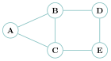
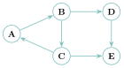
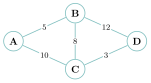
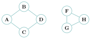
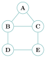
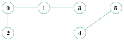
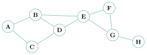
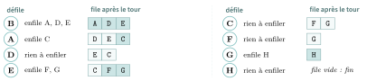

# Cours

<p class="sous-titre">Graphes</p>

<span id="chap-07" class="ancre"></span>

|  |  |
|:---|:---|
| **Programme (BO)** | *« Graphes : structures relationnelles. Sommets, arcs, arêtes, graphe orienté ou non orienté. Modéliser des situations sous forme de graphes. Écrire les implémentations correspondantes d’un graphe : matrice d’adjacence, liste de successeurs / de prédécesseurs. Passer d’une représentation à une autre. Parcourir un graphe en largeur, en profondeur. Repérer la présence d’un cycle. Chercher un chemin dans un graphe. »* |
| **Prérequis** | les **piles** et les **files** (indispensables pour les parcours !), les **dictionnaires** et les listes de listes, la **récursivité**, les **classes**, la notion de **coût** d’un algorithme. Les **arbres** (un arbre est un graphe particulier). |
| **Objectifs** | *reconnaître* une situation qui appelle un graphe et la *modéliser* ; *maîtriser* le vocabulaire ; *implémenter* un graphe de trois façons et *passer* de l’une à l’autre ; *parcourir* un graphe en largeur (file) et en profondeur (pile) ; *trouver* un chemin, le plus court chemin, détecter un cycle. |

## Pourquoi un graphe ? Parce que le monde est un réseau

Regardez autour de vous. Le plan du métro : des stations, reliées par des lignes. Vos amitiés : des personnes, reliées par des « amis ». Le Web : des milliards de pages, reliées par des liens. Un GPS : des carrefours, reliés par des routes. Internet : des routeurs, reliés par des câbles. Le cerveau : des neurones, reliés par des synapses. Une molécule : des atomes, reliés par des liaisons.

À chaque fois, la même idée revient : **des objets, et des relations entre ces objets**. C’est *exactement* cela, un graphe. Aucune autre structure de ce cours ne capture aussi bien cette réalité : une liste range « en ligne », un arbre range « en hiérarchie », mais seul le graphe autorise **n’importe quelle relation entre n’importe quels objets** — des boucles, des raccourcis, des allers-retours. C’est la structure la plus générale, et sans doute la plus utile de toute l’informatique.

!!! regle "Règle 1 — La grande idée"

    Un **graphe** modélise un ensemble d’**objets** (les **sommets**) et les **relations** qui les lient deux à deux (les **arêtes**). Dès qu’un problème parle de « qui est relié à qui », il parle de graphes.

### L’acte de naissance : les sept ponts de Königsberg (1736)

!!! encadre "Un peu d’histoire"

    Au <span class="smallcaps">xviii</span><sup>e</sup> siècle, la ville de Königsberg est traversée par une rivière formant deux îles, reliées aux berges et entre elles par **sept ponts**. Les habitants se demandaient si l’on pouvait se promener en traversant chaque pont **une fois et une seule**. En 1736, **Leonhard Euler** règle la question en **oubliant la carte** : peu importe la forme des îles ou la longueur des ponts, seul compte **ce qui est relié à quoi**. Il remplace la ville par quatre points (les berges `N` et `S`, les îles `O` et `E`) et sept traits (les ponts) : c’est le **premier graphe de l’histoire**, et l’acte de naissance de la **théorie des graphes**. En comptant les ponts qui partent de chaque terre, il *prouve* que la promenade est impossible (voir le théorème d’Euler, à la fin de la section II). Euler (1707–1783), Suisse alors membre de l’Académie des sciences de Saint-Pétersbourg, est l’un des mathématiciens les plus féconds de l’histoire : ses œuvres complètes remplissent plus de soixante-dix volumes.

    \*(image manquante : 07_hist_koenigsberg_merian)\*  
    Königsberg et ses ponts (gravure de 1652)

    { .tikz loading=lazy }  
    Le graphe d’Euler

    \*(image manquante : 07_hist_euler_handmann)\*  
    Euler (par J. E. Handmann, 1753)

!!! remarque "Remarque"

    Retenez la leçon d’Euler, car c’est **toute** la démarche de ce chapitre : *modéliser*, c’est jeter les détails inutiles pour ne garder que la structure des relations. Une fois le bon graphe dessiné, le problème est souvent à moitié résolu.

### Des situations où le graphe s’impose

!!! exemple "Exemple — Quatre problèmes, un seul outil"

    - **Le GPS et le plus court chemin.** Carrefours $=$ sommets, routes $=$ arêtes (*pondérées* par les distances ou les temps). Trouver son itinéraire, c’est chercher un chemin de coût minimal dans un graphe.

    - **Les réseaux sociaux.** Personnes $=$ sommets, relations $=$ arêtes. « Combien d’intermédiaires entre deux inconnus ? », « qui suggérer comme ami ? », « qui est la personne la plus *centrale* ? » : autant de questions de graphes.

    - **Le Web et Google.** Pages $=$ sommets, liens hypertextes $=$ arcs (*orientés* !). Le classement des résultats de Google repose sur un parcours de cet immense graphe.

    - **La planification de tâches.** Étapes d’une recette, d’un chantier, d’un programme $=$ sommets ; « il faut faire ceci *avant* cela » $=$ arcs. On ordonne le travail en parcourant le graphe des dépendances.

Nous n’étudierons qu’une petite partie de cette théorie immense : comment **représenter** un graphe en Python, et comment le **parcourir** pour répondre à des questions concrètes.

## Le vocabulaire des graphes

Un graphe est un ensemble de **sommets** (*vertices* ou *nodes* en anglais) reliés par des **arêtes** ou des **arcs** (*edges*). Il peut être **non orienté** ou **orienté**.

!!! definition "Définition 1 — Graphe, ordre, taille"

    Un **graphe** $G=(S,A)$ est la donnée d’un ensemble fini $S$ de **sommets** et d’un ensemble $A$ d’**arêtes** (des paires de sommets, en non orienté) ou d’**arcs** (des couples ordonnés, en orienté).

    - l’**ordre** du graphe est son nombre de sommets, souvent noté $n = |S|$ ;

    - la **taille** du graphe est son nombre d’arêtes, souvent noté $m = |A|$.

    Deux sommets reliés par une arête sont dits **adjacents** (ou **voisins**).

### Graphe non orienté

{ .tikz loading=lazy }

Dans un graphe **non orienté**, une arête se parcourt **dans les deux sens**. Une **chaîne** est une suite de sommets reliés de proche en proche, par exemple `A -- C -- E -- D` ; sa **longueur** est le nombre d’arêtes, ici $3$.

Les sommets `B` et `C` sont **adjacents** à `A` : ce sont ses **voisins**. Le **degré** d’un sommet est son nombre de voisins ($\deg(\texttt{A})=2$, $\deg(\texttt{B})=3$).

*Exemple concret :* le graphe des amis sur Facebook est **non orienté** — si vous êtes ami avec quelqu’un, la réciproque est vraie.

!!! propriete "Propriété 1 — Lemme des poignées de main"

    Dans un graphe non orienté, la **somme des degrés** de tous les sommets est égale au **double** du nombre d’arêtes : $$\sum_{s \in S} \deg(s) = 2\,m.$$ En conséquence, le nombre de sommets de degré **impair** est toujours **pair**.

!!! demonstration "Démonstration"

    Chaque arête relie exactement deux sommets ; elle est donc comptée **deux fois** dans la somme des degrés (une fois à chaque extrémité). La somme des degrés vaut donc $2m$. Comme $2m$ est pair, la somme des degrés est paire : les sommets de degré impair doivent se « compenser » deux par deux, donc ils sont en nombre pair.

!!! remarque "Remarque"

    Joli nom : si, dans une soirée, chaque poignée de main relie deux personnes, alors le nombre total de mains serrées (comptées par personne) est pair — et il y a toujours un nombre pair d’invités ayant serré un nombre impair de mains !

### Graphe orienté

{ .tikz loading=lazy }

Dans un graphe **orienté**, un **arc** ne se parcourt que dans le sens de la flèche. Un **chemin** est une suite de sommets reliés par des arcs *dans le bon sens*, par exemple `A `$\to$` B `$\to$` D `$\to$` E`. Les voisins (ou **successeurs**) de `B` sont `C` et `D` (mais pas `A` !).

*Exemple concret :* le graphe des abonnements sur X (Twitter) ou Instagram est **orienté** : on peut « suivre » quelqu’un sans être suivi en retour.

### Graphe pondéré

{ .tikz loading=lazy }

Un graphe est **pondéré** (ou valué) si chaque arête porte une valeur numérique — son **poids** (coût, distance, temps, débit…). Exemples : les **distances** entre villes sur une carte routière, le **coût** d’une liaison entre routeurs dans le protocole OSPF.

### Connexité, cycle

!!! definition "Définition 2 — Connexité"

    Un graphe est **connexe** s’il est « d’un seul tenant » : n’importe quelle paire de sommets peut être reliée par une chaîne. Sinon, il se décompose en plusieurs **composantes connexes** (ses « morceaux »).

{ .tikz loading=lazy }

Ce graphe n’est **pas** connexe : aucune chaîne ne relie `A` à `F`. Il a **deux** composantes connexes : $\{$A,B,C,D$\}$ et $\{$F,G,H$\}$.

!!! definition "Définition 3 — Cycle"

    Un **cycle** est une chaîne (non orientée) ou un chemin (orienté) qui **revient à son point de départ** sans réemprunter deux fois la même arête. Un graphe connexe **sans** cycle est exactement un… **arbre** : voilà le lien avec le chapitre *Arbres*.

### Quelques graphes particuliers

!!! definition "Définition 4 — Sous-graphe, sommet isolé, graphe complet"

    - un **sous-graphe** de $G$ s’obtient en ne gardant qu’une partie des sommets de $G$ et une partie des arêtes qui les relient (les composantes connexes en sont des exemples) ;

    - un sommet est **isolé** si son degré est nul (aucun voisin) ;

    - un graphe est **complet** si **toute** paire de sommets est reliée par une arête. Un graphe complet à $n$ sommets possède alors $\dfrac{n(n-1)}{2}$ arêtes (chacun des $n$ sommets est relié aux $n-1$ autres, et chaque arête est comptée deux fois).

### Chaînes eulériennes : le théorème d’Euler <span class="horsprog">au-delà du programme</span>

Revenons à l’énigme fondatrice des **sept ponts de Königsberg** (§ I). On peut maintenant l’énoncer proprement.

!!! definition "Définition 5 — Chaîne et cycle eulériens"

    Une **chaîne eulérienne** est une chaîne qui emprunte **chaque arête du graphe une fois et une seule**. Si, de plus, elle revient à son point de départ, c’est un **cycle eulérien**.

La question de Königsberg était donc : *ce graphe admet-il un cycle eulérien ?* Euler y répond **complètement**, et sa réponse ne dépend que des **degrés** des sommets.

!!! theoreme "Théorème 1 — Euler, 1736 au-delà du programme"

    Soit $G$ un graphe connexe.

    - $G$ admet un **cycle eulérien** si et seulement si **tous** ses sommets sont de degré **pair** ;

    - $G$ admet une **chaîne eulérienne** (sans forcément revenir au départ) si et seulement s’il a **exactement zéro ou deux** sommets de degré **impair** (et, s’il y en a deux, ce sont nécessairement le départ et l’arrivée).

!!! remarque "Remarque — L’idée"

    Le sens « facile » est intuitif : chaque fois qu’on **traverse** un sommet intermédiaire, on « consomme » deux arêtes (une pour entrer, une pour sortir). Un sommet par lequel on ne fait que passer doit donc avoir un degré **pair**. Seuls le départ et l’arrivée peuvent avoir un degré impair — et ils coïncident dans le cas d’un cycle, qui exige alors **tous** les degrés pairs.

!!! exemple "Exemple — Königsberg tranché"

    Dans le graphe des ponts, les quatre terres ont pour degrés $3,3,3,5$ : **quatre** sommets de degré impair. Comme il en faudrait au plus deux, **aucune** chaîne eulérienne n’existe : la promenade rêvée par les habitants est bel et bien **impossible**. Euler l’a démontré sans essayer un seul trajet — juste en comptant des degrés.

!!! remarque "Remarque"

    Ce théorème n’est **pas au programme** : on le donne pour la culture, et parce qu’il montre magnifiquement la puissance de la modélisation par graphes. À ne pas confondre avec le parcours d’un graphe (passer par tous les **sommets**) : ici on veut passer par toutes les **arêtes**.

<span id="cours-07-1" class="ancre"></span>

<span class="afaire">▶ Exercices d'application :</span> exercices **[1](exercices.md#ex-07-1) à [3](exercices.md#ex-07-3)** (vocabulaire et modélisation)

## Modéliser un graphe en Python

Pour représenter un graphe, il faut se donner une convention répondant à deux questions : *qui sont les sommets ?* et *pour chaque sommet, quels sont ses voisins ?* (et éventuellement le poids de l’arête). Il existe pour cela **trois représentations classiques** — et savoir **passer de l’une à l’autre** est une capacité attendue au bac.

Dans toute cette partie, on illustre avec ce petit graphe non orienté, appelé $G$ :

{ .tikz loading=lazy }

### Représentation par matrice d’adjacence

**Principe.** On **numérote** les sommets (ici par ordre alphabétique : A$=0$, B$=1$…). On construit un tableau carré $M$ où $M[i][j]=1$ si les sommets de rangs $i$ et $j$ sont **voisins**, et $0$ sinon. Ce tableau est la **matrice d’adjacence**.

$$\begin{array}{c}
\phantom{0}\ \texttt{A}\ \ \texttt{B}\ \ \texttt{C}\ \ \texttt{D}\ \ \texttt{E}\\ 
\begin{array}{c}\texttt{A}\\ \texttt{B}\\ \texttt{C}\\ \texttt{D}\\ \texttt{E}\end{array}\!\!
\begin{pmatrix}
0 & 1 & 1 & 0 & 0\\
1 & 0 & 1 & 1 & 0\\
1 & 1 & 0 & 0 & 1\\
0 & 1 & 0 & 0 & 1\\
0 & 0 & 1 & 1 & 0
\end{pmatrix}
\end{array}$$

!!! remarque "Remarque"

    Pour un graphe **non orienté**, $M[i][j]=M[j][i]$ : la matrice est **symétrique** (l’arête B–C donne un $1$ de part et d’autre de la diagonale). Pour un graphe **orienté**, elle ne l’est pas forcément. Pour un graphe **pondéré**, on remplace les $1$ par les poids.

En Python, une matrice est naturellement une **liste de listes** :

```python
#      A  B  C  D  E
M = [ [0, 1, 1, 0, 0],   # A
      [1, 0, 1, 1, 0],   # B
      [1, 1, 0, 0, 1],   # C
      [0, 1, 0, 0, 1],   # D
      [0, 0, 1, 1, 0] ]  # E
```

!!! propriete "Propriété 2 — Coût de la matrice d’adjacence"

    Pour un graphe à $n$ sommets :

    - **mémoire** : $O(n^2)$ (on stocke $n\times n$ cases, y compris tous les zéros) ;

    - tester si deux sommets sont **voisins** : $O(1)$ (un simple accès `M[i][j]`) ;

    - lister les voisins d’un sommet : $O(n)$ (il faut parcourir toute sa ligne).

### Représentation par liste d’adjacence

**Principe.** À chaque sommet, on associe la **liste de ses voisins**. On utilise un **dictionnaire** : les clés sont les sommets, les valeurs sont les listes de voisins. (Pour un graphe orienté, on stocke la liste des *successeurs*, ou celle des *prédécesseurs*.)

```python
G = {'A': ['B', 'C'],
     'B': ['A', 'C', 'D'],
     'C': ['A', 'B', 'E'],
     'D': ['B', 'E'],
     'E': ['C', 'D']}
```

!!! propriete "Propriété 3 — Coût de la liste d’adjacence"

    Pour un graphe à $n$ sommets et $m$ arêtes :

    - **mémoire** : $O(n+m)$ — on ne stocke **que** les arêtes présentes, pas les zéros. C’est bien plus économique quand le graphe a **peu d’arêtes** (graphe « creux ») ;

    - accéder à la liste des voisins d’un sommet : $O(1)$ (accès direct par la clé) ; la **parcourir** (pour énumérer ces voisins) : $O(\deg)$, où $\deg$ est le degré du sommet ;

    - tester si deux sommets sont voisins : $O(\deg)$ (il faut parcourir la liste des voisins).

!!! regle "Règle 2 — Quelle représentation choisir ?"

    **Matrice** : rapide pour tester une arête, mais gourmande en mémoire — idéale si le graphe est **dense** (beaucoup d’arêtes). **Liste** : économe en mémoire, rapide pour lister les voisins — idéale si le graphe est **creux** (peu d’arêtes), ce qui est le cas le plus fréquent (un réseau social : chacun connaît quelques centaines de personnes, pas des millions).

### Représentation par liste de listes

Quand les sommets sont **numérotés** de $0$ à $n-1$, on peut se passer du dictionnaire : la liste d’adjacence devient une simple **liste de listes**, où la case d’indice $i$ contient la liste des voisins du sommet $i$. C’est la convention de plusieurs sujets de bac. Par exemple, le graphe

{ .tikz loading=lazy }

se représente par `adj = [[1, 2], [0, 3], [0], [1], [5], [4]]` : le sommet $0$ a pour voisins $1$ et $2$, le sommet $1$ a pour voisins $0$ et $3$, etc.

!!! regle "Règle 3 — Passer d’une représentation à l’autre — capacité attendue"

    On sait convertir chaque représentation en une autre : parcourir la **matrice** ligne par ligne pour bâtir les listes de voisins ; ou parcourir un **dictionnaire** d’adjacence pour remplir une matrice de $0$ et de $1$. C’est un exercice classique du bac (voir la feuille).

<span id="cours-07-4" class="ancre"></span>

<span class="afaire">▶ Exercices d'application :</span> exercices **[4](exercices.md#ex-07-4) à [7](exercices.md#ex-07-7)** (représenter un graphe)

## Une classe `Graphe`

Manipuler directement le dictionnaire `G` fonctionne, mais rien n’empêche alors d’oublier un sens d’une arête et d’obtenir un graphe incohérent. On **encapsule** donc la représentation dans une **classe** : l’utilisateur ne touche plus au dictionnaire, il passe par quelques méthodes (même démarche que pour les piles et les files). On se limite ici aux graphes **non orientés**.

```python
class Graphe:
    # graphe non oriente, stocke par listes d'adjacence
    def __init__(self, sommets):
        self.sommets = sommets
        self.adj = {}                 # sommet -> liste de ses voisins
        for s in sommets:
            self.adj[s] = []

    def ajoute_arete(self, a, b):
        self.adj[a].append(b)
        self.adj[b].append(a)         # non oriente : dans les deux sens

    def voisins(self, s):
        return self.adj[s]

    def sont_voisins(self, a, b):
        return b in self.adj[a]
```

La méthode `ajoute_arete` est la seule à modifier le graphe, et elle met **toujours** à jour les deux listes : la symétrie est garantie par construction.

Pour construire le graphe $G$ de la partie précédente, on part de la **liste de ses arêtes** :

```python
g = Graphe(['A', 'B', 'C', 'D', 'E'])
aretes = [('A', 'B'), ('A', 'C'), ('B', 'C'), ('B', 'D'), ('C', 'E'), ('D', 'E')]
for (a, b) in aretes:
    g.ajoute_arete(a, b)
```

```text
>>> g.voisins('B')
['A', 'C', 'D']
>>> g.sont_voisins('D', 'E'), g.sont_voisins('A', 'D')
(True, False)
```

On retrouve la ligne `B` de la matrice d’adjacence, et le dictionnaire `g.adj` est exactement le dictionnaire `G` écrit plus haut.

!!! remarque "Remarque"

    Pour un graphe **orienté**, il suffirait de retirer la deuxième ligne de `ajoute_arete` : on n’ajoute alors `b` que comme successeur de `a`.

<span id="cours-07-8" class="ancre"></span>

<span class="afaire">▶ Exercices d'application :</span> exercice **[8](exercices.md#ex-07-8)** (la classe `Graphe`)

## Parcourir un graphe

**Parcourir** un graphe, c’est visiter **tous ses sommets** de proche en proche, à partir d’un sommet de départ. C’est l’opération fondamentale : trouver un chemin, la sortie d’un labyrinthe, tester la connexité, détecter un cycle… tout repose sur un parcours.

!!! regle "Règle 4 — Attention"

    Parcourir un graphe n’est pas la même chose que balayer bêtement le dictionnaire ou la matrice ! Un **parcours** suit les **arêtes**, de voisin en voisin.

### Le schéma commun à tous les parcours

Tous les parcours suivent le même squelette :

- on part d’un sommet et on le met dans une structure d’attente `S` ;

- **tant que** `S` n’est pas vide : on en **retire** un sommet (on le « visite »), et on **ajoute** à `S` ses voisins pas encore rencontrés.

!!! regle "Règle 5 — La différence cruciale avec les arbres"

    Dans un arbre, on ne peut jamais revenir sur ses pas : les sous-arbres sont disjoints. Dans un graphe, un voisin peut **déjà avoir été vu** (par un cycle, un raccourci…). Il est donc **indispensable de mémoriser les sommets déjà découverts**, sinon le parcours tourne en rond **indéfiniment**.

Et voici la clé de tout le chapitre : **le choix de la structure `S` change la nature du parcours**. C’est là que les piles et les files du début d’année reviennent en force.

!!! regle "Règle 6 — File ou pile : les deux parcours"

    - `S` est une **file** (FIFO) $\Rightarrow$ on visite d’abord les sommets **les plus proches** du départ $\Rightarrow$ **parcours en largeur** (*BFS*, Breadth First Search).

    - `S` est une **pile** (LIFO) $\Rightarrow$ on file « le plus loin possible » avant de revenir en arrière $\Rightarrow$ **parcours en profondeur** (*DFS*, Depth First Search).

Pour la suite, on utilise ce graphe à 8 sommets (les voisins sont toujours donnés par ordre alphabétique) :

{ .tikz loading=lazy }

### Le parcours en largeur (BFS)

On explore le graphe « par cercles concentriques » : d’abord le départ, puis **tous ses voisins** (distance $1$), puis les voisins de ceux-ci (distance $2$), etc. On tient à jour :

- une liste `traites` : les sommets déjà visités (renvoyée à la fin) ;

- une liste `decouverts` : tous les sommets déjà rencontrés (pour ne pas les remettre en file) ;

- une **file** `en_attente` : les sommets découverts mais pas encore visités. On enfile avec `append`, on défile avec `pop(0)`.

```python
def BFS(g, depart):
    """Parcours en largeur de g depuis depart ;
       renvoie la liste des sommets dans l'ordre de visite."""
    traites = []
    decouverts = [depart]
    en_attente = [depart]           # la file
    while en_attente != []:
        sommet = en_attente.pop(0)  # on defile (FIFO)
        for voisin in g.voisins(sommet):
            if voisin not in decouverts:
                decouverts.append(voisin)
                en_attente.append(voisin)   # on enfile
        traites.append(sommet)
    return traites
```

Sur le graphe ci-dessus, `BFS(g, ’B’)` renvoie `[’B’, ’A’, ’D’, ’E’, ’C’, ’F’, ’G’, ’H’]` : on visite `B`, puis ses voisins `A, D, E`, puis les nouveaux voisins de ceux-ci, etc.

Voici l’état de la file `en_attente` après chaque tour de boucle (à gauche, le sommet défilé et visité ; la tête de la file est à gauche, les sommets qui viennent d’être enfilés sont foncés) :

{ .tikz loading=lazy }

!!! remarque "Remarque — Pourquoi decouverts ?"

    Un même sommet peut être le voisin de plusieurs autres. Sans la liste `decouverts`, on l’enfilerait plusieurs fois. Le test `if voisin not in decouverts` garantit que chaque sommet n’entre **qu’une fois** dans la file.

#### Application vedette : le plus court chemin

Le BFS découvre les sommets par distance croissante. Donc, si l’on **mémorise le « parent »** de chaque sommet (celui qui l’a fait découvrir), on peut ensuite **remonter** de l’arrivée jusqu’au départ : on obtient un chemin, et — miracle du BFS — c’est le **plus court** (en nombre d’arêtes).

```python
def plus_court_chemin(g, depart, arrivee):
    """Renvoie un plus court chemin de depart a arrivee (liste de sommets),
       ou None s'il n'y en a pas."""
    decouverts = [depart]
    en_attente = [depart]
    parent = {depart: None}         # depart n'a pas de parent
    while en_attente != []:
        sommet = en_attente.pop(0)
        if sommet == arrivee:              # arrive : on reconstruit
            chemin = [arrivee]
            while parent[chemin[0]] is not None:
                chemin.insert(0, parent[chemin[0]])
            return chemin
        for voisin in g.voisins(sommet):
            if voisin not in decouverts:
                decouverts.append(voisin)
                en_attente.append(voisin)
                parent[voisin] = sommet    # on note qui l'a decouvert
    return None
```

!!! propriete "Propriété 4 — Pourquoi c’est le plus court"

    Le BFS visite tous les sommets à distance $k$ **avant** ceux à distance $k+1$. Si l’arrivée est à distance $k$ du départ, elle sera donc découverte comme voisine d’un sommet à distance $k-1$. En remontant les parents, on traverse exactement une « couche » à chaque étape : le chemin obtenu a la longueur minimale $k$. C’est pour cela que le BFS est au cœur du calcul d’itinéraires sur graphe non pondéré.

### Le parcours en profondeur (DFS)

Ici, on va **le plus loin possible** avant de faire demi-tour : on visite un voisin, puis **son** premier voisin, et ainsi de suite jusqu’à l’impasse ; alors on **revient au dernier embranchement** pour explorer une autre branche. C’est exactement la stratégie « toujours à droite » dans un labyrinthe.

Ce parcours s’écrit **naturellement de façon récursive** : visiter un sommet, c’est se visiter soi-même puis lancer le parcours sur chaque voisin non encore visité.

```python
def DFS(g, sommet, traites=None):
    if traites is None:
        traites = []
    traites.append(sommet)
    for voisin in g.voisins(sommet):
        if voisin not in traites:
            DFS(g, voisin, traites)
    return traites
```

Sur le graphe précédent, `DFS(g, ’A’)` renvoie `[’A’, ’B’, ’D’, ’C’, ’E’, ’F’, ’G’, ’H’]` : depuis `A` on plonge par `B`, puis `D`, puis `C` (impasse), on remonte, puis `E, F, G, H`.

#### Version itérative, avec une pile

Le DFS s’écrit aussi **sans récursion**, en remplaçant simplement la **file** du BFS par une **pile** : on empile avec `append`, on dépile avec `pop()` (le dernier arrivé repart en premier).

```python
def DFS_iteratif(g, depart):
    traites = []
    en_attente = [depart]              # la pile
    while en_attente != []:
        sommet = en_attente.pop()      # on depile (LIFO)
        if sommet not in traites:
            traites.append(sommet)
            for voisin in g.voisins(sommet):
                if voisin not in traites:
                    en_attente.append(voisin)  # on empile
    return traites
```

!!! remarque "Remarque"

    **BFS et DFS ne diffèrent que par une lettre de code** : `pop(0)` (file) contre `pop()` (pile). Toute la puissance du chapitre *Structures linéaires* est là : la structure de données choisie *dicte* le comportement de l’algorithme. Il n’existe pas « un seul » BFS ni « un seul » DFS : ce qui les caractérise est la **méthode de découverte**, pas l’ordre exact des voisins.

### Deux applications directes : chemin et cycle

- **Existe-t-il un chemin de `u` à `v` ?** On lance un parcours depuis `u` ; il existe un chemin si et seulement si `v` figure dans les sommets visités. (Un parcours depuis `u` explore **toute** la composante connexe de `u`.)

- **Le graphe est-il connexe ?** Il l’est si et seulement si un parcours depuis *n’importe quel* sommet visite **tous** les sommets.

- **Y a-t-il un cycle ?** Au cours d’un parcours, si l’on retombe sur un sommet **déjà découvert** qui n’est pas le sommet d’où l’on vient d’arriver, c’est qu’un cycle boucle par là.

<span class="horsprog">au-delà du programme</span> **Et pour un graphe pondéré ?** Le BFS trouve le plus court chemin en *nombre d’arêtes*, mais ignore les poids. Pour le plus court chemin en *distance* (un vrai GPS), on utilise l’**algorithme de Dijkstra** (1959), qui visite les sommets par coût total croissant à l’aide d’une file de priorité. C’est l’objet du projet proposé en fin de chapitre — mais vous en connaissez déjà l’idée directrice.

<span id="cours-07-9" class="ancre"></span>

<span class="afaire">▶ Exercices d'application :</span> exercices **[9](exercices.md#ex-07-9) à [12](exercices.md#ex-07-12)** (parcours ; chemins, cycles, connexité)

## Ouverture et histoire

!!! remarque "Remarque — Un peu d’histoire… et beaucoup de génie"

    Nous l’avons vu : la théorie des graphes naît en **1736** d’une promenade impossible, quand **Leonhard Euler** règle le problème des **sept ponts de Königsberg** en inventant l’idée d’abstraire une carte en points et traits. Deux siècles plus tard, en **1956**, le Néerlandais **Edsger Dijkstra** cherche un joli exemple pour montrer les capacités d’un nouvel ordinateur. Assis à la **terrasse d’un café d’Amsterdam** avec sa fiancée, **sans papier ni crayon**, il conçoit *en vingt minutes* son fameux algorithme du plus court chemin — publié en 1959 dans un article de **trois pages**. « L’une des raisons pour lesquelles il est si élégant, dira-t-il, c’est que je l’ai conçu sans stylo. » Aujourd’hui, cet algorithme guide chacun de vos trajets GPS.

    Et l’histoire continue : en **1967**, le psychologue **Stanley Milgram** met en évidence le phénomène du « petit monde » — les fameux **six degrés de séparation** qui relieraient deux humains quelconques. En **1998**, deux étudiants, **Larry Page** et **Sergueï Brin**, modélisent le Web comme un gigantesque graphe orienté : leur algorithme **PageRank** deviendra… **Google**. Des ponts de Königsberg à votre moteur de recherche, c’est la même idée qui travaille : *ce qui compte, ce sont les relations*.

!!! remarque "Remarque — Liens avec d’autres chapitres"

    Un **arbre** est un cas particulier de graphe (connexe, sans cycle). On parcourt un graphe en **profondeur** (avec une **pile**, ou par **récursivité**) ou en **largeur** (avec une **file**) — les mêmes outils que pour les **arbres** et les **structures linéaires**. La recherche de chemin sert directement au **routage** des paquets dans les **réseaux**. Il s’implémente par une classe `Graphe` (**programmation objet**), et un **cycle** dans le graphe d’attente des **processus** signale un interblocage.

## Bilan — la carte mémoire

| **Notion** | **À retenir** |
|:---|:---|
| Graphe | des **sommets** reliés par des **arêtes** (relations) |
| Orienté / non orienté | arcs à sens unique / arêtes à double sens |
| Ordre / taille | nombre de sommets $n$ / nombre d’arêtes $m$ |
| Voisins, degré | sommets adjacents ; nombre de voisins |
| Poignées de main | $\sum \deg(s) = 2m$ (nb. de sommets de degré impair : pair) |
| Chaîne / chemin, cycle | suite de sommets reliés ; qui revient au départ |
| Connexe | « d’un seul tenant » (sinon : composantes connexes) |
| Matrice d’adjacence | tableau $n\times n$ de $0/1$ ; mémoire $O(n^2)$ ; arête en $O(1)$ |
| Liste d’adjacence | dictionnaire sommet $\to$ voisins ; mémoire $O(n+m)$ |
| BFS (largeur) | une **file**, cercles concentriques, **plus court chemin** |
| DFS (profondeur) | une **pile** (ou la récursivité), « le plus loin d’abord » |
| Mémoriser les visités | **obligatoire** sur un graphe (cycles !) |

## Erreurs fréquentes

- **Oublier de mémoriser les sommets visités.** Sur un graphe (contrairement à un arbre), le parcours **boucle à l’infini**. *Le réflexe :* une liste `decouverts` / `traites`, toujours.

- **Confondre file et pile.** `pop(0)` $=$ file $=$ BFS $=$ largeur ; `pop()` $=$ pile $=$ DFS $=$ profondeur. Une seule lettre change tout.

- **Confondre arête et arc.** Non orienté $\to$ **arête** (deux sens), matrice **symétrique** ; orienté $\to$ **arc** (un sens).

- **Croire que la matrice est toujours le bon choix.** Pour un graphe **creux**, la liste d’adjacence est bien plus économe ($O(n+m)$ contre $O(n^2)$).

- **Enfiler un sommet déjà en attente.** On teste l’appartenance à `decouverts` *avant* d’enfiler, pas seulement à `traites`.

- **Oublier la double insertion** dans `ajoute_arete` d’un graphe non orienté (il faut ajouter `a` chez `b` **et** `b` chez `a`).

## Savoir-faire à maîtriser

*À la fin du chapitre, je sais…*

- employer le **vocabulaire** (sommet, arête/arc, voisin, degré, chaîne/chemin, cycle, connexe) $\to$ ex. [1](exercices.md#ex-07-1), [3](exercices.md#ex-07-3) ;

- **modéliser** une situation concrète par un graphe orienté ou non, pondéré ou non $\to$ ex. [2](exercices.md#ex-07-2), [3](exercices.md#ex-07-3), [13](exercices.md#ex-07-13) ;

- écrire une **matrice d’adjacence**, une **liste d’adjacence**, et **passer** de l’une à l’autre $\to$ ex. [4](exercices.md#ex-07-4), [5](exercices.md#ex-07-5), [6](exercices.md#ex-07-6) ;

- écrire / compléter une **classe `Graphe`** $\to$ ex. [8](exercices.md#ex-07-8), [10](exercices.md#ex-07-10) ;

- dérouler et coder un **parcours en largeur** (file) et en **profondeur** (pile ou récursif) $\to$ ex. [9](exercices.md#ex-07-9), [10](exercices.md#ex-07-10) ;

- trouver un **chemin**, un **plus court chemin** (BFS), tester la **connexité**, repérer un **cycle** $\to$ ex. [11](exercices.md#ex-07-11), [12](exercices.md#ex-07-12).

## Vers le Grand Oral

- **Comment un GPS calcule-t-il le plus court chemin ?** *(modélisation en graphe pondéré ; BFS pour le nombre d’étapes, Dijkstra pour la distance ; l’anecdote du café d’Amsterdam.)*

- **Pourquoi dit-on que nous sommes tous à « six poignées de main » ?** *(graphe des relations, phénomène du petit monde, distance dans un graphe.)*

- **Largeur ou profondeur : comment le choix d’une structure de données change-t-il un algorithme ?** *(file vs pile ; un même squelette, deux comportements.)*

- **En quoi le problème des sept ponts a-t-il fondé une science ?** *(l’abstraction d’Euler ; modéliser, c’est jeter l’inutile.)*
