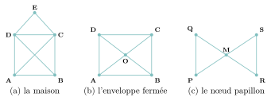
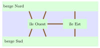

# Activités préparatoires

Graphes

## Activité 1 Sans lever le crayon

*trois dessins, sept ponts, une règle à découvrir*

Durée : 25 min · Sans ordinateur, par deux

!!! consignes "Consignes"

    - Matériel : un crayon et une gomme. Les réponses s’écrivent sur le cahier.

    - Règle du jeu : **repasser chaque trait d’un dessin une fois et une seule, sans lever le crayon**. On a le droit de passer plusieurs fois par un même point (marqué d’un gros point), mais jamais deux fois sur le même trait.

### Exercice 1 — Trois dessins  { #ex-08-graphes-act-1-1 }

{ .tikz loading=lazy }

1.  Pour chaque dessin, essayer de le tracer sans lever le crayon (au brouillon). Si c’est possible, noter la suite des points visités (par exemple `A-B-…`) ; sinon, écrire « pas trouvé ». Répondre pour (a), (b) et (c).

2.  Pour le dessin (a), un camarade affirme : « il faut partir de `A` ou de `B` ». Essayer en partant de `E`. Qu’observe-t-on ?

3.  Pour le dessin (c), peut-on revenir à son point de départ ? Depuis n’importe quel point ?

??? corrige "Corrigé"

    Les réponses ont été vérifiées par un programme qui essaie tous les tracés possibles.

    1.  \(a\) Possible, par exemple `A-B-C-D-A-C-E-D-B` ; tous les tracés possibles partent de `A` et finissent en `B`, ou l’inverse. (b) Impossible (aucun tracé n’existe). (c) Possible, par exemple `P-Q-M-R-S-M-P`, et l’on revient au départ.

    2.  En partant de `E` (ou de `C`, `D`), on se retrouve toujours bloqué avec des traits non tracés : le camarade a raison.

    3.  Oui, on revient au point de départ, et cela marche en partant de n’importe quel point.

### Exercice 2 — Compter les traits  { #ex-08-graphes-act-1-2 }

Pour chaque point, on compte le nombre de traits qui y aboutissent.

1.  Recopier et compléter le tableau sur le cahier.

    | **Dessin** | **nombre de traits en chaque point** | **nombre de points « impairs »** | **possible ?** | **retour au départ ?** |
    |:---|:---|:---|:---|:---|
    | \(a\) la maison |  |  |  |  |
    | \(b\) l’enveloppe |  |  |  |  |
    | \(c\) le papillon |  |  |  |  |

2.  Quand on **passe** par un point (on y arrive puis on en repart), combien de traits utilise-t-on ? Que peut-on en déduire pour un point qui n’est ni le départ ni l’arrivée ?

3.  Proposer une règle : d’après le nombre de points « impairs », quand le dessin est-il possible ? quand peut-on revenir au départ ?

??? corrige "Corrigé"

    1.  Tableau complété :

        | **Dessin** | **traits en chaque point** | **points impairs** | **possible ?** | **retour ?** |
        |:---|:---|:--:|:--:|:--:|
        | \(a\) | `A` 3, `B` 3, `C` 4, `D` 4, `E` 2 | $2$ | oui (de `A` à `B`) | non |
        | \(b\) | `A` 3, `B` 3, `C` 3, `D` 3, `O` 4 | $4$ | non | non |
        | \(c\) | `M` 4, les quatre autres $2$ | $0$ | oui | oui |

    2.  On utilise **deux** traits : un pour arriver, un pour repartir. Un point qui n’est ni le départ ni l’arrivée est traversé un certain nombre de fois, en consommant deux traits à chaque passage : il doit avoir un nombre **pair** de traits.

    3.  Règle conjecturée : **$0$ point impair** : possible, et l’on revient au départ (on peut partir de n’importe où) ; **$2$ points impairs** : possible, en partant de l’un et en arrivant à l’autre ; **plus de $2$** : impossible. (C’est le théorème d’Euler, démontré en 1736.)

### Exercice 3 — Les sept ponts de Königsberg  { #ex-08-graphes-act-1-3 }

Au xviiie siècle, la ville de Königsberg est traversée par une rivière formant deux îles, reliées aux berges et entre elles par **sept ponts**. Les habitants se demandaient : *peut-on se promener en traversant chaque pont une fois et une seule ?*

{ .tikz loading=lazy }

1.  Chercher quelques minutes une telle promenade sur la carte.

2.  La forme des îles et la longueur des ponts n’ont aucune importance. Redessiner sur le cahier la situation avec seulement des **points** (un par terre : `N`, `S`, `O`, `E`) et des **traits** (un par pont).

3.  Compter les traits en chaque point. À l’aide de votre règle, la promenade est-elle possible ?

4.  La ville décide de construire un huitième pont. Entre quelles terres le placer pour que la promenade devienne possible ? D’où faudra-t-il alors partir ?

??? corrige "Corrigé"

    1.  Personne ne trouve : c’est normal.

    2.  Le schéma attendu (îles `O` et `E`, berges `N` et `S`) :

        { .tikz loading=lazy }

    3.  `O` : $5$ ; `N` : $3$ ; `S` : $3$ ; `E` : $3$. Quatre points impairs : la promenade est **impossible**, sans avoir à essayer tous les trajets.

    4.  Il suffit de relier **deux** des quatre terres (toutes sont « impaires ») : il ne reste alors que deux points impairs. Par exemple, un pont entre `N` et `S` : on part de `O` pour arriver en `E` (ou l’inverse). Avec un pont entre les deux îles, on part d’une berge pour arriver à l’autre. Pour pouvoir *revenir* à son point de départ, il faudrait deux nouveaux ponts.

### Exercice 4 — Mettre des mots  { #ex-08-graphes-act-1-4 }

1.  Proposer un nom pour chacune des notions rencontrées :

    - un dessin fait de points reliés par des traits ;

    - un point / un trait ;

    - le nombre de traits qui aboutissent à un point ;

    - remplacer la carte par des points et des traits.

2.  *Défi.* Peut-on dessiner une figure qui a **exactement un** point « impair » ? Essayer, puis expliquer.

??? corrige "Corrigé"

    1.  Propositions possibles puis mots du cours :

        | **Notion** | **Propositions fréquentes** | **Mot du cours** |
        |:---|:---|:---|
        | points reliés par des traits | réseau, schéma, plan | **graphe** |
        | un point / un trait | nœud, lien | **sommet** / **arête** |
        | nombre de traits en un point | nombre de voisins | **degré** |
        | remplacer la carte | simplifier, schématiser | **modéliser** |

        « Nœud » est aussi employé en informatique (arbres, réseaux).

    2.  Impossible. Chaque trait a deux extrémités : en additionnant les nombres de traits de tous les points, on compte chaque trait deux fois, donc on obtient un nombre **pair**. Une somme paire ne peut pas contenir un seul nombre impair : le nombre de points impairs est toujours **pair**.
