# Exercices

<p class="sous-titre">Graphes</p>

!!! consignes "Mode d’emploi"

    - Niveau : ★ échauffement, ★★ classique (niveau bac), ★★★ défi ; les *coups de pouce* et les *corrigés* se déplient sous chaque exercice.

    - <span class="run" title="À programmer et tester sur machine">▶</span> *À programmer et tester* en Python.

    - On dispose de la classe `Graphe` du cours (graphes non orientés) : constructeur `Graphe(sommets)`, méthodes `ajoute_arete(a, b)`, `voisins(s)`, `sont_voisins(a, b)`.

    - Usage de l’IA, indiqué sur chaque exercice : <span class="ia ia-rouge" title="Sans IA : le but est l'automatisme lui-même"></span> aucune ; <span class="ia ia-orange" title="IA en appui : déboguer, reformuler, vérifier ; la réponse finale est la vôtre"></span> en appui (déboguer, reformuler, vérifier ; la réponse finale est écrite et comprise par vous) ; <span class="ia ia-vert" title="IA intégrée : l'exercice s'appuie sur une réponse d'IA"></span> l’exercice s’appuie sur une réponse d’IA. Voir la [charte d’usage de l’IA](../charte.md).

```python
class Graphe:
    def __init__(self, sommets):
        self.sommets = sommets
        self.adj = {s: [] for s in sommets}
    def ajoute_arete(self, a, b):
        self.adj[a].append(b)
        self.adj[b].append(a)
    def voisins(self, s):
        return self.adj[s]
    def sont_voisins(self, a, b):
        return b in self.adj[a]
```

### Vocabulaire et modélisation

### <span class="stars" title="Niveau 1 sur 3">★</span> <span class="exo-num">Exercice 1</span> <span class="ia ia-rouge" title="Sans IA : le but est l'automatisme lui-même"></span> { #ex-08-1 }

On considère le graphe non orienté ci-dessous.

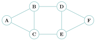{ .tikz loading=lazy }

1.  Donner la liste des voisins de `B`, puis le degré de chaque sommet.

2.  Donner une chaîne de longueur $4$ reliant `A` à `F`.

3.  Ce graphe est-il connexe ? Justifier.

4.  Donner un cycle de ce graphe.

??? corrige "Corrigé"

    !!! remarque "Remarque"

        On donne **une** version simple de chaque programme ; d’autres sont possibles. Les ordres de parcours dépendent de l’ordre dans lequel on liste les voisins.

    **1.** Voisins de `B` : `A`, `C`, `D`. Degrés : `A` :2, `B` :3, `C` :3, `D` :3, `E` :3, `F` :2.

    **2.** Par exemple `A -- B -- D -- E -- F` (longueur $4$).

    **3.** Oui, il est connexe : tout sommet est atteignable depuis n’importe quel autre (un seul morceau).

    **4.** Par exemple le cycle `A -- B -- C -- A`, ou `B -- D -- E -- C -- B`.

### <span class="stars" title="Niveau 1 sur 3">★</span> <span class="exo-num">Exercice 2</span> <span class="ia ia-rouge" title="Sans IA : le but est l'automatisme lui-même"></span> { #ex-08-2 }

Dans une classe, on relève les binômes de travail : Alice travaille avec Bilal et Chloé ; Bilal avec Alice, Chloé et Dora ; Chloé avec Alice, Bilal et Émile ; Dora avec Bilal ; Émile avec Chloé.

1.  Dire si ce graphe est orienté ou non orienté, et pourquoi.

2.  Dessiner le graphe (un sommet par initiale).

3.  Qui a le plus de partenaires ? Traduire cette question en vocabulaire de graphe.

??? corrige "Corrigé"

    **1.** Non orienté : « travaille avec » est une relation **symétrique**.

    **2.** 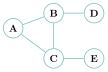{ .tikz loading=lazy }

    **3.** « Qui a le plus de partenaires ? » $=$ « quel sommet a le plus grand **degré** ? ». Ici Bilal et Chloé (degré $3$).

### <span class="stars" title="Niveau 1 sur 3">★</span> <span class="exo-num">Exercice 3</span> <span class="ia ia-rouge" title="Sans IA : le but est l'automatisme lui-même"></span> { #ex-08-3 }

Sur un réseau social, on note « $X\to Y$ » lorsque « $X$ suit $Y$ ». On relève : `A`$\to$`B`, `A`$\to$`C`, `B`$\to$`C`, `C`$\to$`A`, `D`$\to$`C`.

1.  Dessiner le graphe **orienté** correspondant.

2.  Donner les **successeurs** de `A`, puis les **prédécesseurs** de `C`.

3.  Existe-t-il un chemin de `D` vers `B` ? de `B` vers `D` ? Que remarque-t-on ?

4.  Ce graphe possède-t-il un cycle (au sens orienté) ?

??? corrige "Corrigé"

    **1.** 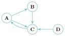{ .tikz loading=lazy }

    **2.** Successeurs de `A` : `B`, `C`. Prédécesseurs de `C` : `A`, `B`, `D`.

    **3.** `D`$\to$`B` : oui (`D`$\to$`C`$\to$`A`$\to$`B`). `B`$\to$`D` : non (aucun arc n’arrive sur `D`). Un chemin peut exister dans un sens sans exister dans l’autre : c’est propre aux graphes **orientés**.

    **4.** Oui : `A`$\to$`B`$\to$`C`$\to$`A` est un cycle orienté.

### Représenter un graphe

### <span class="stars" title="Niveau 1 sur 3">★</span> <span class="exo-num">Exercice 4</span> <span class="ia ia-rouge" title="Sans IA : le but est l'automatisme lui-même"></span> { #ex-08-4 }

On reprend le graphe non orienté de l’exercice 1 (sommets `A` à `F`, ordre alphabétique).

1.  Écrire sa **matrice d’adjacence**. Vérifier qu’elle est symétrique.

2.  Écrire sa **liste d’adjacence** (dictionnaire Python).

??? corrige "Corrigé"

    **1.** Sommets `A`,`B`,`C`,`D`,`E`,`F` ; arêtes `A-B, A-C, B-C, B-D, C-E, D-E, D-F, E-F` : $$M=\begin{pmatrix}
    0&1&1&0&0&0\\ 1&0&1&1&0&0\\ 1&1&0&0&1&0\\ 0&1&0&0&1&1\\ 0&0&1&1&0&1\\ 0&0&0&1&1&0
    \end{pmatrix}$$ Elle est bien symétrique.

    **2.**

    ```python
    G = {'A': ['B', 'C'], 'B': ['A', 'C', 'D'], 'C': ['A', 'B', 'E'],
         'D': ['B', 'E', 'F'], 'E': ['C', 'D', 'F'], 'F': ['D', 'E']}
    ```

### <span class="stars" title="Niveau 1 sur 3">★</span> <span class="exo-num">Exercice 5</span> <span class="ia ia-rouge" title="Sans IA : le but est l'automatisme lui-même"></span> { #ex-08-5 }

Construire (dessiner) le graphe correspondant à chacune des représentations suivantes.

1.  $M=\begin{pmatrix} 0 & 1 & 1 & 1 & 0\\ 1 & 0 & 1 & 0 & 0\\ 1 & 1 & 0 & 1 & 1\\ 1 & 0 & 1 & 0 & 1\\ 0 & 0 & 1 & 1 & 0 \end{pmatrix}$ (sommets `A`, `B`, `C`, `D`, `E`)

2.  la liste de listes `adj = [[1, 2], [0, 2, 3], [0, 1], [1, 4], [3]]` (sommets $0$ à $4$).

??? corrige "Corrigé"

    **1.** `A-B, A-C, A-D, B-C, C-D, C-E, D-E`. **2.** Sommets $0..4$ : `0-1, 0-2, 1-2, 1-3, 3-4`.

    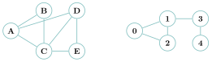{ .tikz loading=lazy }

### <span class="stars" title="Niveau 2 sur 3">★★</span> <span class="exo-num">Exercice 6</span> — <span class="run" title="À programmer et tester sur machine">▶</span>  <span class="ia ia-orange" title="IA en appui : déboguer, reformuler, vérifier ; la réponse finale est la vôtre"></span> { #ex-08-6 }

On numérote les sommets de $0$ à $n-1$. Un graphe est donné soit par sa matrice `M` (liste de listes de $0/1$), soit par ses listes d’adjacence `adj` (liste de listes d’entiers).

1.  Écrire `matrice_vers_listes(M)` qui renvoie les listes d’adjacence correspondantes.

2.  Écrire `listes_vers_matrice(adj)` qui renvoie la matrice d’adjacence correspondante.

3.  Tester que les deux fonctions sont bien « inverses » l’une de l’autre sur un exemple.

??? pouce "Coup de pouce"

    Question 1 : pour chaque ligne `i` de `M`, garder les indices `j` tels que `M[i][j]` vaut $1$. Question 2 : partir d’une matrice $n\times n$ remplie de $0$, puis placer les $1$.

??? pouce "Coup de pouce 2 (début de solution)"

    `def matrice_vers_listes(M):`  
    `adj = []`  
    `for i in range(len(M)):`  
    `voisins_i = []` …

??? corrige "Corrigé"

    **1.** Les voisins du sommet `i` sont les indices `j` de la ligne `i` où la matrice vaut $1$ : on construit cette liste **par compréhension**, ligne après ligne.

    ```python
    def matrice_vers_listes(M):
        n = len(M)
        adj = []
        for i in range(n):
            adj.append([j for j in range(n) if M[i][j] == 1])   # voisins de i
        return adj
    ```

    *Autre méthode :* sans compréhension, avec deux boucles imbriquées.

    ```python
    def matrice_vers_listes(M):
        adj = []
        for i in range(len(M)):
            voisins_i = []
            for j in range(len(M)):
                if M[i][j] == 1:
                    voisins_i.append(j)
            adj.append(voisins_i)
        return adj
    ```

    **2.** On part d’une matrice $n \times n$ remplie de $0$, puis on place un $1$ pour chaque voisin `j` de chaque sommet `i`.

    ```python
    def listes_vers_matrice(adj):
        n = len(adj)
        M = [[0] * n for i in range(n)]
        for i in range(n):
            for j in adj[i]:
                M[i][j] = 1
        return M
    ```

    **3.** On vérifie que `listes_vers_matrice(matrice_vers_listes(M)) == M` redonne bien la matrice de départ.

### <span class="stars" title="Niveau 2 sur 3">★★</span> <span class="exo-num">Exercice 7</span> <span class="ia ia-rouge" title="Sans IA : le but est l'automatisme lui-même"></span> { #ex-08-7 }

On considère le graphe **pondéré** suivant (les poids sont des distances en km).

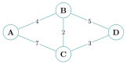{ .tikz loading=lazy }

1.  Proposer une **matrice de poids** pour ce graphe (mettre $0$ sur la diagonale et là où il n’y a pas d’arête).

2.  Donner, en énumérant les chemins, le trajet **le plus court** (en km) de `A` à `D`.

    ??? pouce "Coup de pouce"

        Lister tous les chemins de `A` à `D` qui ne repassent jamais par un même sommet, puis additionner les poids de chacun.

??? corrige "Corrigé"

    **1.** (poids sur la diagonale $=0$, et $0$ en l’absence d’arête) $$P=\begin{pmatrix}
    0&4&7&0\\ 4&0&2&5\\ 7&2&0&3\\ 0&5&3&0
    \end{pmatrix}\quad(\text{ordre }\texttt{A},\texttt{B},\texttt{C},\texttt{D})$$ **2.** `A-B-C-D` $=4+2+3=9$ ; `A-B-D`$=4+5=9$ ; `A-C-D`$=7+3=10$. Le plus court fait **9 km**.

### La classe `Graphe`

### <span class="stars" title="Niveau 2 sur 3">★★</span> <span class="exo-num">Exercice 8</span> — <span class="run" title="À programmer et tester sur machine">▶</span>  <span class="ia ia-orange" title="IA en appui : déboguer, reformuler, vérifier ; la réponse finale est la vôtre"></span> { #ex-08-8 }

En utilisant **uniquement** l’interface de la classe `Graphe` (méthodes `voisins` et `sont_voisins`), écrire les fonctions suivantes.

1.  `degre(g, s)` : renvoie le degré du sommet `s`.

2.  `est_isole(g, s)` : renvoie `True` si `s` n’a aucun voisin.

3.  `nb_aretes(g)` : renvoie le nombre d’arêtes du graphe.

    ??? pouce "Coup de pouce"

        Que renvoie `g.voisins(s)`, et comment en déduire le degré ? Pour `nb_aretes`, additionner les degrés de tous les sommets (`g.sommets`) : attention, chaque arête est alors comptée deux fois.

??? corrige "Corrigé"

    ```python
    def degre(g, s):
        return len(g.voisins(s))

    def est_isole(g, s):
        return g.voisins(s) == []

    def nb_aretes(g):
        total = 0
        for s in g.sommets:
            total = total + len(g.voisins(s))
        return total // 2      # chaque arete est comptee deux fois
    ```

### Parcourir un graphe

### <span class="stars" title="Niveau 2 sur 3">★★</span> <span class="exo-num">Exercice 9</span> <span class="ia ia-rouge" title="Sans IA : le but est l'automatisme lui-même"></span> { #ex-08-9 }

On considère ce graphe (les voisins seront toujours pris par **ordre alphabétique**).

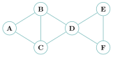{ .tikz loading=lazy }

1.  Donner « à la main » le parcours en **largeur** (BFS) depuis `A`, en écrivant à chaque étape le contenu de la file.

2.  Donner « à la main » le parcours en **profondeur** (DFS) depuis `A`.

3.  Les deux parcours visitent-ils les mêmes sommets ? Dans le même ordre ?

??? pouce "Coup de pouce"

    BFS : écrire la file à chaque étape ; on défile en tête, on enfile en queue les voisins **non encore découverts**, par ordre alphabétique. DFS : aller le plus loin possible avant de revenir en arrière.

??? corrige "Corrigé"

    **1.** BFS depuis `A` (file entre crochets) : on visite `A` (file `[B,C]`), `B` (`[C,D]`), `C` (`[D]`), `D` (`[E,F]`), `E` (`[F]`), `F`. Résultat : `[A, B, C, D, E, F]`.

    **2.** DFS depuis `A` : `A`$\to$`B`$\to$`C`$\to$`D`$\to$`E`$\to$`F`. Résultat : `[A, B, C, D, E, F]`.

    **3.** Ils visitent les **mêmes** sommets (toute la composante connexe), mais pas forcément dans le même ordre (ici ils coïncident par hasard ; changez une arête et l’ordre diffère).

### <span class="stars" title="Niveau 2 sur 3">★★</span> <span class="exo-num">Exercice 10</span> — <span class="run" title="À programmer et tester sur machine">▶</span>  <span class="ia ia-orange" title="IA en appui : déboguer, reformuler, vérifier ; la réponse finale est la vôtre"></span> { #ex-08-10 }

1.  Programmer la classe `Graphe`, puis les fonctions `BFS(g, depart)` et `DFS(g, sommet)` (récursive) du cours. Pour la file du BFS, reprendre la classe `File` du chapitre *Structures linéaires*.

    ??? pouce "Coup de pouce"

        La classe `File` de ce chapitre défile avec `pop(0)` : c’est un **choix de simplicité**, suffisant pour nos petits graphes, mais chaque `pop(0)` coûte $O(n)$ (il décale tous les éléments). Sur un très grand graphe, on prendrait une file plus efficace (`collections.deque`, deux piles…) sans rien changer au code du BFS : c’est tout l’intérêt de l’interface.

2.  Construire le graphe de l’exercice précédent et vérifier vos réponses aux traces à la main.

3.  Programmer aussi `DFS_iteratif(g, depart)` (avec une pile). Donne-t-il le même ordre que le DFS récursif ? Expliquer.

    ??? pouce "Coup de pouce"

        Reprendre le code du BFS en remplaçant la file par une pile. Dans quel ordre les voisins d’un sommet sortent-ils de la pile ?

??? corrige "Corrigé"

    Voir le cours pour `BFS`, `DFS` (récursif) et `DFS_iteratif`. Pour la file, la classe `File` du chapitre *Structures linéaires* (avec `pop(0)`) convient ici : c’est un choix de **simplicité**, acceptable sur de petits graphes, mais chaque `defiler` coûte alors $O(n)$ ; sur un grand graphe, on changerait d’implémentation (`collections.deque`…) sans toucher au BFS. Sur ce graphe, le DFS itératif renvoie par exemple `[A, C, D, F, E, B]` : la **pile** traite en dernier le premier voisin empilé, d’où un ordre différent du DFS récursif — mais c’est bien un parcours en profondeur valide.

### Chemins, cycles, connexité

### <span class="stars" title="Niveau 2 sur 3">★★</span> <span class="exo-num">Exercice 11</span> — <span class="run" title="À programmer et tester sur machine">▶</span>  <span class="ia ia-orange" title="IA en appui : déboguer, reformuler, vérifier ; la réponse finale est la vôtre"></span> { #ex-08-11 }

À l’aide d’un parcours, écrire :

1.  `existe_chemin(g, u, v)` : renvoie `True` s’il existe une chaîne de `u` à `v`.

    ??? pouce "Coup de pouce"

        Quels sommets un parcours lancé depuis `u` visite-t-il ?

2.  `est_connexe(g)` : renvoie `True` si le graphe est connexe.

    ??? pouce "Coup de pouce"

        Un parcours depuis n’importe quel sommet doit visiter tous les sommets.

??? corrige "Corrigé"

    ```python
    def existe_chemin(g, u, v):
        return v in DFS(g, u)          # ou BFS

    def est_connexe(g):
        depart = g.sommets[0]
        return len(BFS(g, depart)) == len(g.sommets)
    ```

### <span class="stars" title="Niveau 3 sur 3">★★★</span> <span class="exo-num">Exercice 12</span> — <span class="run" title="À programmer et tester sur machine">▶</span>  <span class="ia ia-orange" title="IA en appui : déboguer, reformuler, vérifier ; la réponse finale est la vôtre"></span> { #ex-08-12 }

On veut le **plus court chemin** en nombre d’arêtes.

1.  En vous inspirant du BFS, écrire `plus_court_chemin(g, depart, arrivee)` qui renvoie la liste des sommets d’un plus court chemin (ou `None`).

    ??? pouce "Coup de pouce"

        Pendant le BFS, mémoriser le `parent` de chaque sommet découvert (le sommet depuis lequel on l’a découvert), puis remonter de l’arrivée jusqu’au départ.

    ??? pouce "Coup de pouce 2 (début de solution)"

        `parent = {depart: None}`  
        `en_attente = File()`  
        `en_attente.enfiler(depart)`  
        `while not en_attente.est_vide():`  
        `s = en_attente.defiler()` … À la fin, remonter avec `s = parent[s]` et retourner la liste obtenue.

2.  Écrire `distances(g, depart)` qui renvoie un dictionnaire donnant, pour chaque sommet, sa distance (nombre d’arêtes) au départ.

    ??? pouce "Coup de pouce"

        Un sommet découvert depuis `s` est à la distance de `s` plus $1$.

3.  Sur un graphe de votre choix, vérifier que `len(plus_court_chemin(...)) - 1` vaut bien la distance renvoyée.

??? corrige "Corrigé"

    ```python
    def plus_court_chemin(g, depart, arrivee):
        decouverts = [depart]
        en_attente = File()
        en_attente.enfiler(depart)
        parent = {depart: None}
        while not en_attente.est_vide():
            s = en_attente.defiler()
            if s == arrivee:
                chemin = [arrivee]
                while parent[chemin[0]] is not None:
                    chemin.insert(0, parent[chemin[0]])
                return chemin
            for v in g.voisins(s):
                if v not in decouverts:
                    decouverts.append(v)
                    en_attente.enfiler(v)
                    parent[v] = s
        return None

    def distances(g, depart):
        d = {depart: 0}              # sert aussi de liste des decouverts
        en_attente = File()
        en_attente.enfiler(depart)
        while not en_attente.est_vide():
            s = en_attente.defiler()
            for v in g.voisins(s):
                if v not in d:
                    d[v] = d[s] + 1
                    en_attente.enfiler(v)
        return d
    ```

    **3.** Sur le graphe de l’exercice 9, `plus_court_chemin(g, ’A’, ’F’)` vaut `[’A’,’B’,’D’,’F’]` : longueur $3$, qui est bien la valeur `distances(g,’A’)[’F’]`.

### Vers le bac

### <span class="stars" title="Niveau 2 sur 3">★★</span> <span class="exo-num">Exercice 13</span> — *d’après Amérique du Nord 2024, jour 1, ex. 2* <span class="ia ia-orange" title="IA en appui : déboguer, reformuler, vérifier ; la réponse finale est la vôtre"></span> { #ex-08-13 }

On modélise un groupe de huit personnes (Anas, Emma, Gabriel, Jade, Lou, Milo, Nina, Yanis) par un graphe : les sommets sont les personnes, les arêtes les liens d’amitié.

- Gabriel est ami avec Jade, Yanis, Nina et Milo ;

- Jade est amie avec Gabriel, Yanis, Emma et Lou ;

- Yanis est ami avec Gabriel, Jade, Emma, Nina, Milo et Anas ;

- Emma est amie avec Jade, Yanis et Nina ;

- Nina est amie avec Gabriel, Yanis et Emma ;

- Milo est ami avec Gabriel, Yanis et Anas ;

- Anas est ami avec Yanis et Milo ;

- Lou est amie avec Jade.

**Partie A — Matrice d’adjacence**

1.  Dessiner ce graphe (chaque personne par l’initiale de son prénom, entourée d’un cercle).

2.  Recopier et compléter la matrice d’adjacence (un $1$ pour un lien d’amitié, un $0$ sinon).

```python
# sommets :     G, J, Y, E, N, M, A, L
matrice_adj = [[0, 1, 1, 0, 1, 1, 0, 0],   # G
               [......................],   # J
               ...                     ]
```

On dispose de `sommets = [’G’,’J’,’Y’,’E’,’N’,’M’,’A’,’L’]` et d’une fonction `position(l, s)` qui renvoie la position de `s` dans la liste `l` (ou `None` s’il est absent).

1.  Indiquer les retours de `position(sommets, ’G’)` et `position(sommets, ’Z’)`.

2.  Recopier et compléter la fonction `nb_amis` qui renvoie le nombre d’amis du sommet `s` (ou `None` s’il est absent).

    ??? pouce "Coup de pouce"

        La ligne `pos_s` de la matrice ne contient que des $0$ et des $1$ : que représente la somme de ses éléments ?

    ```python
    def nb_amis(L, m, s):
        pos_s = ...
        if pos_s == None:
            return ...
        amis = 0
        for i in range(len(m)):
            amis += ...
        return ...
    ```

3.  Indiquer le retour de `nb_amis(sommets, matrice_adj, ’G’)`.

**Partie B — Dictionnaire de listes d’adjacence**

1.  Dans un dictionnaire `{c : v}`, que représentent `c` et `v` ici ?

2.  Recopier et compléter le dictionnaire `graphe` de listes d’adjacence des amis.

3.  Écrire `nb_amis(d, s)` qui renvoie le nombre d’amis de `s` (on suppose `s` présent dans `d`).

Milo se fâche avec Gabriel et Yanis, et Anas avec Yanis ; le nouveau graphe est :

```python
graphe = {'G': ['J', 'Y', 'N'],       'J': ['G', 'Y', 'E', 'L'],
          'Y': ['G', 'J', 'E', 'N'],  'E': ['J', 'Y', 'N'],
          'N': ['G', 'Y', 'E'],       'M': ['A'],
          'A': ['M'],                 'L': ['J']}
```

Le « cercle d’amis » d’une personne est l’ensemble des personnes atteignables depuis elle ; on l’obtient par un **parcours en profondeur**.

1.  Donner le cercle d’amis de Lou.

2.  Recopier et compléter la fonction de parcours en profondeur.

    ??? pouce "Coup de pouce"

        Marquer d’abord `s` comme visité, puis ne relancer le parcours que sur les voisins **pas encore** visités.

    ```python
    def parcours_en_profondeur(d, s, visites=None):
        if visites is None:
            visites = []
        ...
        for v in d[s]:
            ...
                parcours_en_profondeur(d, v, visites)
        return visites
    ```

??? corrige "Corrigé"

    **Partie A.** **1.** 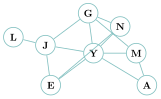{ .tikz loading=lazy }

    **2.** (ordre `G,J,Y,E,N,M,A,L`)

    ```python
    matrice_adj = [[0,1,1,0,1,1,0,0],  # G
                   [1,0,1,1,0,0,0,1],  # J
                   [1,1,0,1,1,1,1,0],  # Y
                   [0,1,1,0,1,0,0,0],  # E
                   [1,0,1,1,0,0,0,0],  # N
                   [1,0,1,0,0,0,1,0],  # M
                   [0,0,1,0,0,1,0,0],  # A
                   [0,1,0,0,0,0,0,0]]  # L
    ```

    **3.** `position(sommets,’G’)` vaut `0` ; `position(sommets,’Z’)` vaut `None`.

    **4.**

    ```python
    def nb_amis(L, m, s):
        pos_s = position(L, s)
        if pos_s == None:
            return None
        amis = 0
        for i in range(len(m)):
            amis += m[pos_s][i]
        return amis
    ```

    **5.** `nb_amis(sommets, matrice_adj, ’G’)` vaut `4`.

    **Partie B.** **6.** `c` est une **clé** (un sommet), `v` est la **valeur** associée (la liste de ses voisins).

    **7.**

    ```python
    graphe = {'G': ['J','Y','N','M'], 'J': ['G','Y','E','L'],
              'Y': ['G','J','E','N','M','A'], 'E': ['J','Y','N'],
              'N': ['G','Y','E'], 'M': ['G','Y','A'],
              'A': ['Y','M'], 'L': ['J']}
    ```

    **8.** `def nb_amis(d, s): return len(d[s])`

    **9.** Cercle d’amis de Lou (graphe des fâcheries) : `[’L’,’J’,’G’,’Y’,’E’,’N’]` — Milo et Anas ne sont plus atteignables.

    **10.**

    ```python
    def parcours_en_profondeur(d, s, visites=None):
        if visites is None:
            visites = []
        visites.append(s)
        for v in d[s]:
            if v not in visites:
                parcours_en_profondeur(d, v, visites)
        return visites
    ```

### <span class="stars" title="Niveau 2 sur 3">★★</span> <span class="exo-num">Exercice 14</span> — *d’après Asie 2024, jour 1, ex. 2* <span class="ia ia-orange" title="IA en appui : déboguer, reformuler, vérifier ; la réponse finale est la vôtre"></span> { #ex-08-14 }

La fabrication d’un pain se décompose en tâches ; un **arc** `(i)`$\to$`(j)` signifie « la tâche `(i)` doit être faite avant la tâche `(j)` ». On donne une partie du graphe des dépendances :

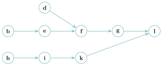{ .tikz loading=lazy }

1.  S’agit-il d’un graphe orienté ou non orienté ?

2.  D’après le graphe, dire si l’on peut faire : `(f)` puis `(g)` ? `(g)` puis `(f)` ? `(b)` puis `(e)` ?

3.  Donner toutes les tâches à réaliser **nécessairement avant** de pouvoir faire `(l)`.

    ??? pouce "Coup de pouce"

        Remonter les arcs depuis `(l)`, puis depuis chacun de ses prédécesseurs, et ainsi de suite.

4.  Ce graphe contient-il un cycle ? Qu’est-ce que cela garantit sur la faisabilité de la recette ?

5.  Un élève lance un parcours en profondeur depuis `(b)`, puis depuis `(d)`. Il applique la règle : « si l’on retombe sur un sommet déjà découvert qui n’est pas celui d’où l’on vient, il y a un cycle ». En arrivant de `(d)` sur `(f)`, déjà découvert, il conclut à un cycle. Expliquer son erreur et donner le bon critère pour un graphe orienté.

    ??? pouce "Coup de pouce"

        Au moment où l’on arrive de `(d)`, l’exploration de `(f)` est-elle encore en cours, ou déjà terminée ? Peut-on revenir de `(f)` vers `(d)` en suivant les flèches ?

On considère maintenant la matrice d’adjacence d’un graphe orienté (`M[i][j] = 1` s’il existe un arc de `i` vers `j`).

```python
M = [ [0, 1, 0, 0, 0],
      [0, 0, 1, 0, 0],
      [0, 0, 0, 1, 0],
      [0, 1, 0, 0, 1],
      [0, 0, 0, 0, 0] ]
```

1.  Dessiner le graphe associé (les sommets sont leurs indices $0$ à $4$).

2.  Déterminer s’il est possible de trouver un ordre de réalisation des tâches respectant toutes les dépendances. Si oui, le donner ; si non, expliquer pourquoi. *(On parle d’un *tri topologique* du graphe.)*

    ??? pouce "Coup de pouce"

        Chercher un cycle dans le graphe dessiné à la question 6 : que se passe-t-il si des tâches dépendent les unes des autres en boucle ?

??? corrige "Corrigé"

    **1.** Graphe **orienté** (les flèches donnent l’ordre « avant / après »).

    **2.** `(f)` puis `(g)` : oui (arc `f`$\to$`g`). `(g)` puis `(f)` : non. `(b)` puis `(e)` : oui.

    **3.** Tâches nécessaires avant `(l)` : `b, d, e, f, g, h, i, k`.

    **4.** Non, pas de cycle. C’est indispensable : un cycle de dépendances rendrait la recette **impossible** à réaliser (chaque tâche attendrait l’autre).

    **5.** La règle utilisée ne vaut que pour un graphe **non orienté**. Ici, `(f)` a été atteinte depuis `(e)` lors du premier parcours, qui l’a **terminée** (`(f)`, `(g)`, `(l)` entièrement explorés). Arriver de `(d)` sur `(f)` signifie seulement que deux chemins, `(b)`$\to$`(e)`$\to$`(f)` et `(d)`$\to$`(f)`, **se rejoignent** : aucune flèche ne permet de revenir de `(f)` à `(d)`. **Bon critère** pour un graphe orienté : au cours d’un parcours en profondeur, il y a un cycle lorsqu’un arc mène à un sommet **en cours** (encore dans la pile d’appels, pas encore terminé) ; un arc vers un sommet **terminé** ne signale pas de cycle.

    **6.** Arcs : `0`$\to$`1`, `1`$\to$`2`, `2`$\to$`3`, `3`$\to$`1`, `3`$\to$`4`.

    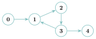{ .tikz loading=lazy }

    **7.** **Impossible** : le graphe contient le cycle `1`$\to$`2`$\to$`3`$\to$`1`. On ne peut donc pas ordonner ces tâches (aucun tri topologique n’existe quand il y a un cycle).

### <span class="stars" title="Niveau 2 sur 3">★★</span> <span class="exo-num">Exercice 15</span> — *d’après Pays étrangers 2025, sujet PE2, ex. 3 (partie A)* <span class="ia ia-orange" title="IA en appui : déboguer, reformuler, vérifier ; la réponse finale est la vôtre"></span> { #ex-08-15 }

Un parc d’attractions est modélisé par un graphe : chaque sommet est une attraction (de durée donnée), chaque arête porte la durée (en minutes) du trajet entre deux attractions.

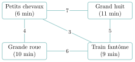{ .tikz loading=lazy }

Les attractions sont des objets de la classe suivante ; les voisines sont stockées sous forme de couples `(attraction, durée_du_trajet)`.

```python
class Attraction:
    def __init__(self, nom, duree):
        self.nom = nom
        self.duree = duree
        self.voisines = []

a1 = Attraction("Grand huit", 11)
a2 = Attraction("Petits chevaux", 6)
a3 = Attraction("Train fantome", 9)
a4 = Attraction("Grande roue", 10)
a1.voisines = [(a2, 7), (a3, 5)]
a2.voisines = [(a1, 7), (a3, 3), (a4, 4)]
a3.voisines = [(a1, 5), (a2, 3), (a4, 6)]
a4.voisines = ...
```

1.  La grande roue est ralentie : sa durée passe à $12$ minutes. Écrire la ligne de code qui réalise cette modification.

2.  Donner et expliquer la valeur de `a2.voisines[2][1]`.

    ??? pouce "Coup de pouce"

        `a2.voisines[2]` est un couple : que contient sa composante d’indice $1$ ?

3.  Recopier et compléter la dernière ligne (`a4.voisines = ...`).

4.  Expliquer pourquoi cette modélisation utilise un graphe **non orienté**.

Une **balade** est un chemin du graphe ; sa durée est la somme des durées de ses sommets *et* de ses arêtes. On modélise une balade par la liste des attractions parcourues.

1.  Calculer la durée de la balade `[a1, a2, a3]` et expliquer le calcul.

2.  Expliquer pourquoi `[a2, a1, a4, a3]` n’est pas une balade.

3.  <span class="run" title="À programmer et tester sur machine">▶</span> Écrire `sont_voisines(x, y)` qui renvoie `True` si les attractions `x` et `y` sont voisines.

    ??? pouce "Coup de pouce"

        Parcourir les couples de `x.voisines` : seule leur première composante sert ici.

4.  <span class="run" title="À programmer et tester sur machine">▶</span> Écrire `est_balade(tab)` qui renvoie `True` si la liste `tab` d’attractions est une balade (chaque attraction voisine de la suivante).

    ??? pouce "Coup de pouce"

        Réutiliser `sont_voisines` ; jusqu’à quel indice la boucle doit-elle aller pour que « la suivante » existe toujours ?

??? corrige "Corrigé"

    **1.** `a4.duree = 12`

    **2.** `a2.voisines[2][1]` vaut `4` : dans le 3<sup>e</sup> couple `(a4, 4)` de la liste des voisines de `a2`, on lit l’élément d’indice $1$, c’est-à-dire la **durée du trajet** (4 min) entre « Petits chevaux » et « Grande roue ».

    **3.** `a4.voisines = [(a2, 4), (a3, 6)]`

    **4.** Le trajet est le même dans les deux sens (aller de $x$ à $y$ prend le même temps que de $y$ à $x$) : la relation est symétrique, d’où un graphe **non orienté**.

    **5.** Durée de `[a1, a2, a3]` $=$ (durées des attractions) $+$ (durées des trajets) $= (11+6+9) + (7+3) = \mathbf{36}$ min.

    **6.** `[a2, a1, a4, a3]` n’est pas une balade car `a4` n’est pas voisine de `a1` : il n’y a pas d’arête entre « Grand huit » et « Grande roue ».

    **7–8.** On parcourt les couples `(voisine, durée)` de `x` en cherchant `y` ; pour une balade, on vérifie que chaque attraction est voisine de la **suivante**, d’où la boucle jusqu’à l’avant-dernier indice.

    ```python
    def sont_voisines(x, y):
        for (v, duree) in x.voisines:
            if v == y:
                return True
        return False

    def est_balade(tab):
        for i in range(len(tab) - 1):
            if not sont_voisines(tab[i], tab[i+1]):
                return False
        return True
    ```

    *Autre méthode* pour `sont_voisines` : construire par compréhension la liste des seules attractions voisines (première composante des couples), puis tester l’appartenance.

    ```python
    def sont_voisines(x, y):
        voisines = [v for (v, duree) in x.voisines]
        return y in voisines
    ```

### <span class="stars" title="Niveau 2 sur 3">★★</span> <span class="exo-num">Exercice 16</span> — *d’après Centres étrangers 2024, groupe 1, jour 1, ex. 1* <span class="ia ia-orange" title="IA en appui : déboguer, reformuler, vérifier ; la réponse finale est la vôtre"></span> { #ex-08-16 }

Un réseau de $5$ ordinateurs numérotés $0$ à $4$ est représenté par des **listes de voisins**.

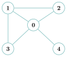{ .tikz loading=lazy }

1.  Recopier et compléter la variable `voisins` (la case d’indice `i` contient la liste des voisins de `i`).

    ```python
    voisins = [[1, 2, 3, 4],
               [0, 2, 3],
               [0, 1],
               [...],
               [...]]
    ```

2.  On ajoute un ordinateur $5$, accessible **seulement** depuis $0$ et $2$. Dessiner le nouveau graphe et donner la nouvelle variable `voisins`.

3.  <span class="run" title="À programmer et tester sur machine">▶</span> Écrire `voisin_alea(voisins, s)` qui renvoie un voisin de `s` choisi au hasard. *(On dispose de la fonction `random.randrange(n)`, qui renvoie un entier de $0$ inclus à `n` exclu.)*

    ??? pouce "Coup de pouce"

        Tirer au hasard un **indice** valide de la liste `voisins[s]`.

Au début, un virus n’est présent que sur un ordinateur. À chaque étape, il contamine **tous** ses voisins non encore contaminés.

1.  <span class="run" title="À programmer et tester sur machine">▶</span> Proposer (et programmer) un algorithme qui, à partir d’un sommet de départ `s`, renvoie le nombre d’étapes nécessaires pour contaminer **tout** le réseau.

    ??? pouce "Coup de pouce"

        C’est un parcours en largeur « par vagues » : chaque vague de nouveaux contaminés correspond à une étape.

    ??? pouce "Coup de pouce 2 (début de solution)"

        `contamines = [s]`  
        `frontiere = [s]`  
        `etapes = 0`  
        `while len(contamines) < len(voisins):` … Construire la nouvelle frontière (la vague suivante) à partir des voisins de la frontière courante.

??? corrige "Corrigé"

    **1.** `voisins = [[1,2,3,4], [0,2,3], [0,1], [0,1], [0]]`

    **2.** On ajoute le sommet $5$, relié à $0$ et $2$ : `voisins = [[1,2,3,4,5], [0,2,3], [0,1,5], [0,1], [0], [0,2]]`.

    **3.**

    ```python
    import random
    def voisin_alea(voisins, s):
        liste = voisins[s]
        i = random.randrange(len(liste))
        return liste[i]
    ```

    **4.** C’est un parcours en largeur « par vagues » : à chaque étape, on contamine tous les voisins non encore contaminés, et on compte les étapes.

    ```python
    def temps_propagation(voisins, s):
        contamines = [s]
        frontiere = [s]           # contamines a l'etape precedente
        etapes = 0
        while len(contamines) < len(voisins):
            nouveaux = []
            for x in frontiere:
                for v in voisins[x]:
                    if v not in contamines:
                        contamines.append(v)
                        nouveaux.append(v)
            etapes = etapes + 1
            frontiere = nouveaux
        return etapes
    ```

    Depuis le sommet $4$ (réseau initial), la contamination prend **2 étapes**.

### <span class="stars" title="Niveau 3 sur 3">★★★</span> <span class="exo-num">Exercice 17</span> — *d’après Polynésie 2024, jour 2, ex. 1* <span class="ia ia-orange" title="IA en appui : déboguer, reformuler, vérifier ; la réponse finale est la vôtre"></span> { #ex-08-17 }

Une agence de voyages relie des villes ; le graphe pondéré ci-dessous donne les distances (en km).

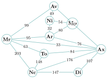{ .tikz loading=lazy }

1.  Déterminer le plus court chemin (en km) de `Mp` à `Nc` et sa longueur.

    ??? pouce "Coup de pouce"

        `Nc` n’est relié qu’à `Mr`, `To`, `Ax` et `Di` : chercher d’abord la meilleure distance de `Mp` à chacune de ces villes.

2.  On veut aller de `Mp` à `Nc` en **visitant le moins de villes possible**. Déterminer les deux chemins possibles.

On oublie désormais les distances (graphe non pondéré). On implémente le graphe par un dictionnaire de listes d’adjacence (sommets de type `str`).

1.  Donner l’implémentation Python `G` de ce graphe (une paire clé/valeur par ligne).

2.  Rappeler la signification de `LIFO` et `FIFO`. Lequel désigne une file ?

On donne la fonction `parcours` (la file utilise `creerFile`, `estVide`, `enfiler`, `defiler`) :

```python
def parcours(graphe, sommet):
    f = creerFile()
    enfiler(f, sommet)
    visite = [sommet]
    while not estVide(f):
        s = defiler(f)
        for v in graphe[s]:
            if not (v in visite):
                visite.append(v)
                enfiler(f, v)
    return visite
```

1.  S’agit-il d’un parcours en largeur ou en profondeur ? Justifier.

2.  <span class="run" title="À programmer et tester sur machine">▶</span> En modifiant `parcours`, écrire `distance(graphe, sommet)` qui renvoie un dictionnaire donnant, pour chaque sommet, sa distance (nombre d’arêtes) au sommet de départ.

    ??? pouce "Coup de pouce"

        Remplacer la liste `visite` par un dictionnaire : un sommet découvert depuis `s` est à la distance de `s` plus $1$.

    ??? pouce "Coup de pouce 2 (début de solution)"

        `dist = {sommet: 0}` remplace `visite = [sommet]` ; dans la boucle :  
        `if not (v in dist):`  
        `dist[v] = dist[s] + 1` …

3.  <span class="run" title="À programmer et tester sur machine">▶</span> Écrire une fonction `parcours2(G, s)` réalisant un parcours en **profondeur** à l’aide d’une **pile**. Donner un résultat possible de `parcours2(G, ’Av’)`.

    ??? pouce "Coup de pouce"

        Même structure que `parcours`, en remplaçant la file par une pile ; un sommet n’est marqué visité qu’au moment où on le dépile.

??? corrige "Corrigé"

    **1.** Plus court chemin `Mp`$\to$`Nc` : `Mp -- Ar -- Ax -- Nc`, de longueur $80+76+176 = \mathbf{332}$ km.

    **2.** En visitant le moins de villes possible (3 arêtes) : `Mp -- Ar -- Ax -- Nc` et `Mp -- Ar -- Mr -- Nc`.

    **3.**

    ```python
    G = {'Av': ['Ni', 'Mr', 'Ax'],
         'Ni': ['Av', 'Ar', 'Mp'],
         'Mp': ['Ni', 'Ar'],
         'Ar': ['Ni', 'Mp', 'Ax', 'Mr'],
         'Mr': ['Av', 'Ar', 'To', 'Ax', 'Nc'],
         'To': ['Mr', 'Ax', 'Nc'],
         'Ax': ['Av', 'Ar', 'Mr', 'To', 'Nc', 'Di'],
         'Nc': ['Mr', 'To', 'Ax', 'Di'],
         'Di': ['Nc', 'Ax']}
    ```

    **4.** `LIFO` $=$ *Last In, First Out* (pile) ; `FIFO` $=$ *First In, First Out* (**file**).

    **5.** Parcours en **largeur** : la structure `f` est une **file** (on défile le premier entré), on découvre donc les sommets par distances croissantes.

    **6.**

    ```python
    def distance(graphe, sommet):
        dist = {sommet: 0}
        f = creerFile()
        enfiler(f, sommet)
        while not estVide(f):
            s = defiler(f)
            for v in graphe[s]:
                if v not in dist:
                    dist[v] = dist[s] + 1
                    enfiler(f, v)
        return dist
    ```

    Ainsi `distance(G, ’Av’)` vaut :

    ```text
    {'Av':0, 'Ni':1, 'Mr':1, 'Ax':1, 'Ar':2, 'Mp':2, 'To':2, 'Nc':2, 'Di':2}
    ```

    **7.** On remplace la file par une **pile** :

    ```python
    def parcours2(G, s):
        pile = [s]
        visite = []
        while pile != []:
            x = pile.pop()
            if x not in visite:
                visite.append(x)
                for v in G[x]:
                    pile.append(v)
        return visite
    ```

    Un résultat possible : `parcours2(G, ’Av’)` $=$ `[’Av’,’Ax’,’Di’,’Nc’,’To’,’Mr’,’Ar’,’Mp’,’Ni’]` (l’ordre dépend de l’ordre des voisins).

### Critiquer une réponse d’IA

### <span class="stars" title="Niveau 2 sur 3">★★</span> <span class="exo-num">Exercice 18</span> — Un parcours en largeur écrit par un assistant d’IA <span class="ia ia-vert" title="IA intégrée : l'exercice s'appuie sur une réponse d'IA"></span> { #ex-08-18 }

Un élève demande à un assistant d’IA : « Écris en Python un parcours en largeur d’un graphe `g` (dictionnaire des listes d’adjacence) depuis un sommet `depart`, qui renvoie la liste des sommets dans l’ordre où ils sont traités. » Voici la réponse obtenue :

```python
def parcours_largeur(g, depart):
    en_attente = [depart]          # file des sommets decouverts
    decouverts = [depart]
    traites = []
    while en_attente != []:
        sommet = en_attente.pop()  # on retire le prochain sommet
        for voisin in g[sommet]:
            if voisin not in decouverts:
                decouverts.append(voisin)
                en_attente.append(voisin)
        traites.append(sommet)
    return traites
```

*« On découvre d’abord tous les voisins du départ, puis les voisins des voisins, etc. : la liste `en_attente` joue le rôle de la file du parcours en largeur, et `decouverts` évite de traiter deux fois un même sommet. »*

1.  La réponse est-elle correcte ? <span class="run" title="À programmer et tester sur machine">▶</span> Dérouler la fonction à la main sur le graphe `G = {’A’: [’B’, ’C’], ’B’: [’A’, ’D’], ’C’: [’A’, ’E’], ’D’: [’B’], ’E’: [’C’]}` depuis `’A’` (noter l’état de `en_attente` à chaque tour) et comparer avec l’ordre attendu d’un parcours en largeur.

2.  Localiser et corriger l’erreur.

    ??? pouce "Coup de pouce"

        Sans argument, `pop()` retire-t-il le premier ou le dernier élément de la liste ? Quelle structure obtient-on alors ?

3.  Quelle vérification simple, faite avant de faire confiance à la réponse, aurait suffi à détecter l’erreur ?

??? corrige "Corrigé"

    **1.** **Non.** Trace : `en_attente = [A]` ; on retire `A`, on ajoute `B` puis `C` $\to$ `[B, C]` ; `pop()` retire le **dernier**, `C`, qui ajoute `E` $\to$ `[B, E]` ; on retire `E` ; puis `B`, qui ajoute `D` ; puis `D`. Sortie réelle : `[’A’, ’C’, ’E’, ’B’, ’D’]`. Or `E` est à distance $2$ de `A` et est traité *avant* `B`, à distance $1$ : ce n’est pas un parcours en largeur, mais un parcours en **profondeur**. L’ordre attendu est `[’A’, ’B’, ’C’, ’D’, ’E’]`.

    **2.** L’erreur : `en_attente.pop()` retire le **dernier** élément ajouté (comportement de **pile**, LIFO). Pour une **file** (FIFO), il faut retirer le premier :

    ```python
            sommet = en_attente.pop(0)  # on defile (FIFO)
    ```

    Avec cette ligne, la fonction renvoie `[’A’, ’B’, ’C’, ’D’, ’E’]`. C’est la correction la plus courte, et elle suffit sur un petit graphe ; mais c’est un **choix de simplicité** : chaque `pop(0)` décale toute la liste et coûte $O(n)$ (chapitre *Structures linéaires*). La version du cours, avec l’interface `File` (`enfiler`/`defiler`/`est_vide`), évite à la fois l’erreur de l’IA et ce coût caché.

    **3.** Dérouler le code sur un **graphe de quatre ou cinq sommets** où un sommet est à distance $2$ : en largeur, tous les sommets à distance $1$ doivent sortir *avant* ceux à distance $2$. Réflexe du cours : « file (FIFO) $=$ largeur ; pile (LIFO) $=$ profondeur ». Sur une `list`, `pop()` retire le dernier élément : on obtient une pile, donc un parcours en profondeur.

### S’entraîner à l’oral

### <span class="stars" title="Niveau 2 sur 3">★★</span> <span class="exo-num">Exercice 19</span> — Expliquer en deux minutes <span class="ia ia-rouge" title="Sans IA : le but est l'automatisme lui-même"></span> { #ex-08-19 }

Au Grand Oral comme devant l’examinateur de l’épreuve pratique, il faut savoir **expliquer** une notion clairement, sans notes. Choisir l’un des sujets suivants (ou le tirer au sort) :

1.  Expliquer la différence entre le parcours **en largeur** et le parcours **en profondeur** d’un graphe, et la structure (pile ou file) utilisée par chacun.

2.  Expliquer à un camarade de Première comment un **graphe** modélise un réseau routier ou un réseau social, avec le vocabulaire de base.

3.  Expliquer comment choisir entre une **matrice d’adjacence** et une **liste de successeurs** pour représenter un graphe.

**Préparation (5 min, seul).** Noter au brouillon **trois idées** et **un exemple**, rien de plus, puis retourner la feuille. **Exposé (2 min, chronométré).** Debout, face à un camarade, **sans lire de notes** : tout passe par la parole. **Retour (2 min).** Le camarade pose une question de relance (on peut alors s’aider d’un schéma), remplit la grille ci-dessous et donne un conseil ; puis on échange les rôles. Cette grille reprend les critères d’évaluation du Grand Oral.

??? pouce "Coup de pouce"

    Structurer chaque explication en trois temps : une **définition** en une phrase, un **exemple** petit et concret déroulé à voix haute, puis le **piège** (l’erreur que l’auditeur risque de faire). Finir par une phrase qui répond à la question posée. Prévoir un graphe de quatre sommets que l’on sait décrire à voix haute (« A est relié à B et à C…») et l’utiliser comme exemple. Sujet 1 : dans quel ordre les sommets sont-ils découverts ?

<table>
<thead>
<tr>
<th style="text-align: left;"><strong>Grille entre camarades</strong></th>
<th style="text-align: center;"><strong>Oui</strong></th>
<th style="text-align: center;"><strong>En partie</strong></th>
<th style="text-align: center;"><strong>Pas encore</strong></th>
</tr>
</thead>
<tbody>
<tr>
<td style="text-align: left;"><strong>Clair</strong> — audible, posé ; chaque mot technique est expliqué</td>
<td style="text-align: center;"><span class="math inline">▫</span></td>
<td style="text-align: center;"><span class="math inline">▫</span></td>
<td style="text-align: center;"><span class="math inline">▫</span></td>
</tr>
<tr>
<td style="text-align: left;"><strong>Juste</strong> — c’est exact, et l’exemple montre vraiment l’idée</td>
<td style="text-align: center;"><span class="math inline">▫</span></td>
<td style="text-align: center;"><span class="math inline">▫</span></td>
<td style="text-align: center;"><span class="math inline">▫</span></td>
</tr>
<tr>
<td style="text-align: left;"><strong>Construit</strong> — un fil conducteur, tenu en deux minutes, sans lire</td>
<td style="text-align: center;"><span class="math inline">▫</span></td>
<td style="text-align: center;"><span class="math inline">▫</span></td>
<td style="text-align: center;"><span class="math inline">▫</span></td>
</tr>
<tr>
<td colspan="4" style="text-align: left;"><strong>Un conseil</strong> pour la prochaine fois :</td>
</tr>
</tbody>
</table>

??? corrige "Corrigé"

    Pas de texte à apprendre par cœur : voici les **éléments attendus** pour chaque sujet. L’ordre, les mots et l’exemple peuvent être différents ; l’explication est réussie si ces idées y sont, justes et reliées entre elles.

    **Sujet 1.**

    - **Largeur** : on visite tous les voisins du départ, puis les voisins de ces voisins, « par couches » de distance croissante ; on utilise une **file**.

    - **Profondeur** : on avance le plus loin possible le long d’un chemin, puis on revient en arrière ; on utilise une **pile** (ou la récursivité).

    - Exemple : arêtes A–B, A–C, B–D, en partant de A : largeur A, B, C, D ; profondeur A, B, D, C.

    - Piège : oublier de marquer les sommets déjà visités (boucle sans fin dès qu’il y a un cycle) ; le parcours en largeur donne un plus court chemin en nombre d’arêtes.

    **Sujet 2.**

    - **Sommets** : les lieux ou les personnes ; **arêtes** (ou **arcs** si le graphe est orienté) : les routes ou les liens ; un **poids** peut porter une distance.

    - Vocabulaire : voisins (adjacents), chemin, cycle, graphe connexe.

    - Exemple : un sens unique ou « suivre » quelqu’un sur un réseau social donne un graphe **orienté** ; une amitié réciproque, un graphe non orienté.

    - Intérêt : un même algorithme (parcours, plus court chemin) résout des problèmes très différents dès qu’ils sont modélisés par un graphe.

    **Sujet 3.**

    - **Matrice d’adjacence** : tableau $n \times n$ où la case $[i][j]$ vaut $1$ si $i$ et $j$ sont voisins ; tester une arête est immédiat, mais il faut $n^2$ cases même s’il y a peu d’arêtes.

    - **Liste de successeurs** (un dictionnaire qui associe à chaque sommet la liste de ses voisins) : la mémoire est proportionnelle au nombre d’arêtes, et parcourir les voisins d’un sommet est rapide.

    - Exemple : un réseau social de millions de personnes ayant chacune quelques centaines d’amis : la liste s’impose.

    - Piège : pour un graphe non orienté, la matrice est symétrique et chaque arête apparaît deux fois dans les listes.
