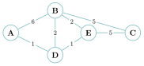
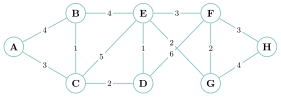

# TP et projets

<p class="sous-titre">Graphes</p>

## <span class="etiquette">Projet</span> L’algorithme de Dijkstra

!!! fichiers "Fichiers à télécharger"

    [:material-folder-open: dossier en ligne](https://github.com/MathThibaud/nsi-fichiers-eleves/tree/main/terminale/08-projet-dijkstra){ .md-button } [:material-zip-box: archive .zip](https://github.com/MathThibaud/nsi-fichiers-eleves/raw/main/zips/terminale-08-projet-dijkstra.zip){ .md-button }

!!! encadre "But du projet"

    Comprendre, dérouler *à la main*, puis **programmer** l’algorithme de Dijkstra, qui calcule le plus court chemin dans un graphe **pondéré** (à poids positifs) — le cœur de tout GPS. <span class="run" title="À programmer et tester sur machine">▶</span>  signale ce qui est à programmer et tester. Un fichier `dijkstra_graphes.py` est **à télécharger** (lien ci-dessus) : les graphes y sont déjà saisis, avec la **trame** des fonctions à compléter (étapes 3 et 4) et des **tests** ; une fois vos fonctions écrites, il affiche les distances et les chemins pour vérifier vos calculs sans tout retaper.

## Le problème : et si les arêtes ont un coût ?

Au chapitre *Graphes*, le parcours en largeur (BFS) trouve le plus court chemin en **nombre d’arêtes**. Mais sur une vraie carte, une route peut être longue et une autre courte : les arêtes ont un **poids** (distance, temps, péage…). Le BFS ne sait pas en tenir compte : le trajet avec le moins de villes traversées n’est pas forcément le plus rapide !

{ .tikz loading=lazy }  
Le graphe pondéré `G` du projet (poids $=$ distances).

*Aller de `A` à `C` :* `A -- B -- C` traverse peu de villes mais coûte $6+5=11$. On verra que le vrai plus court chemin coûte… bien moins.

!!! remarque "Remarque"

    En 1956, **Edsger Dijkstra** a trouvé la solution en vingt minutes, à la terrasse d’un café d’Amsterdam, *sans papier ni crayon*. Voici son idée.

## L’idée de Dijkstra

On part du sommet `depart` et on fait grandir, petit à petit, un « nuage » de sommets dont on connaît **avec certitude** la distance minimale au départ.

!!! encadre "Le principe, en trois idées"

    1.  On garde pour chaque sommet une **distance provisoire** (au début : $0$ pour le départ, $+\infty$ pour les autres).

    2.  À chaque tour, on **fixe définitivement** le sommet non encore traité qui a la **plus petite** distance provisoire (le plus proche : on est *sûr* qu’on ne fera pas mieux).

    3.  Depuis ce sommet `u` tout juste fixé, on **met à jour** ses voisins : si passer par `u` raccourcit le chemin vers un voisin `v`, on améliore la distance de `v`. Cette étape s’appelle un **relâchement** :

        `si distance[u] + poids(u,v) < distance[v] :`  
        ` distance[v] = distance[u] + poids(u,v)`

    On recommence jusqu’à avoir fixé tous les sommets.

!!! remarque "Remarque"

    Pour **retrouver le chemin** (et pas seulement sa longueur), on note au passage, pour chaque sommet, le **prédécesseur** par lequel on l’a amélioré. On remontera ensuite ces prédécesseurs de l’arrivée jusqu’au départ (exactement comme pour le plus court chemin en largeur).

## Étape 1 — dérouler à la main

### <span class="exo-num">Exercice 1</span> — Dérouler à la main { #ex-08-graphes-tp-1-1 }

On applique Dijkstra au graphe `G` ci-dessus, au départ de `A`. Recopier sur le cahier et compléter le tableau : à chaque ligne, on **fixe** le sommet non traité de plus petite distance (colonne « fixé », on le marque $\ast$), puis on met à jour ses voisins. ($\infty$ $=$ pas encore atteint.)

<table>
<thead>
<tr>
<th style="text-align: center;"><strong>Étape</strong></th>
<th style="text-align: center;"><strong>Sommet fixé</strong></th>
<th style="text-align: center;"><code>A</code></th>
<th style="text-align: center;"><code>B</code></th>
<th style="text-align: center;"><code>C</code></th>
<th style="text-align: center;"><code>D</code></th>
<th style="text-align: center;"><code>E</code></th>
</tr>
</thead>
<tbody>
<tr>
<td style="text-align: center;">init</td>
<td style="text-align: center;">—</td>
<td style="text-align: center;"><span class="math inline">0</span></td>
<td style="text-align: center;"><span class="math inline">∞</span></td>
<td style="text-align: center;"><span class="math inline">∞</span></td>
<td style="text-align: center;"><span class="math inline">∞</span></td>
<td style="text-align: center;"><span class="math inline">∞</span></td>
</tr>
<tr>
<td style="text-align: center;">1</td>
<td style="text-align: center;"><code>A</code> (0)</td>
<td style="text-align: center;"><span class="math inline">0<sup>*</sup></span></td>
<td style="text-align: center;">…</td>
<td style="text-align: center;">…</td>
<td style="text-align: center;">…</td>
<td style="text-align: center;">…</td>
</tr>
<tr>
<td colspan="7" style="text-align: left;">… (une ligne par étape, jusqu’à l’étape 5)</td>
</tr>
</tbody>
</table>

1.  Compléter le tableau jusqu’à ce que tous les sommets soient fixés.

2.  En déduire la **distance minimale** de `A` à chaque sommet.

3.  Donner le **plus court chemin** de `A` à `C`, et sa longueur. Comparer avec le trajet `A -- B -- C`.

## Étape 2 — un graphe plus lourd

### <span class="exo-num">Exercice 2</span> — Un graphe plus lourd { #ex-08-graphes-tp-1-2 }

Voici un graphe pondéré à **huit** sommets. On va dérouler Dijkstra au départ de `A`, puis **vérifier avec l’ordinateur**.

{ .tikz loading=lazy }

1.  Dérouler Dijkstra au départ de `A` : recopier sur le cahier le tableau ci-dessous et le compléter, une ligne par étape jusqu’à ce que les huit sommets soient fixés (marquer $\ast$ le sommet fixé à chaque étape ; $\infty$ $=$ non atteint).

<table>
<thead>
<tr>
<th style="text-align: center;"><strong>Ét.</strong></th>
<th style="text-align: center;"><strong>Fixé</strong></th>
<th style="text-align: center;"><code>A</code></th>
<th style="text-align: center;"><code>B</code></th>
<th style="text-align: center;"><code>C</code></th>
<th style="text-align: center;"><code>D</code></th>
<th style="text-align: center;"><code>E</code></th>
<th style="text-align: center;"><code>F</code></th>
<th style="text-align: center;"><code>G</code></th>
<th style="text-align: center;"><code>H</code></th>
</tr>
</thead>
<tbody>
<tr>
<td style="text-align: center;">init</td>
<td style="text-align: center;">—</td>
<td style="text-align: center;"><span class="math inline">0</span></td>
<td style="text-align: center;"><span class="math inline">∞</span></td>
<td style="text-align: center;"><span class="math inline">∞</span></td>
<td style="text-align: center;"><span class="math inline">∞</span></td>
<td style="text-align: center;"><span class="math inline">∞</span></td>
<td style="text-align: center;"><span class="math inline">∞</span></td>
<td style="text-align: center;"><span class="math inline">∞</span></td>
<td style="text-align: center;"><span class="math inline">∞</span></td>
</tr>
<tr>
<td style="text-align: center;">1</td>
<td style="text-align: center;"><code>A</code> (0)</td>
<td style="text-align: center;"><span class="math inline">0<sup>*</sup></span></td>
<td style="text-align: center;">…</td>
<td style="text-align: center;">…</td>
<td style="text-align: center;">…</td>
<td style="text-align: center;">…</td>
<td style="text-align: center;">…</td>
<td style="text-align: center;">…</td>
<td style="text-align: center;">…</td>
</tr>
<tr>
<td colspan="10" style="text-align: left;">… (une ligne par étape, jusqu’à l’étape 8)</td>
</tr>
</tbody>
</table>

1.  En déduire la distance minimale de `A` à chaque sommet, et le plus court chemin de `A` à `H`.

2.  <span class="run" title="À programmer et tester sur machine">▶</span> **Vérification par l’ordinateur** (*après l’étape 3*). Dans le fichier `dijkstra_graphes.py` (fourni), le gros graphe est **déjà saisi** (variable `G_gros`). Quand vous aurez complété `dijkstra` et `chemin` dans ce fichier, exécutez-le et comparez l’affichage à votre tableau. Tout doit coïncider !

!!! remarque "Remarque"

    Le graphe est saisi dans le fichier à partir de la **liste des arêtes** (`aretes`), et la fonction `construire_graphe` le transforme en dictionnaire : on évite ainsi de recopier à la main un long dictionnaire (et les erreurs qui vont avec).

## Étape 3 — programmer l’algorithme

On représente le graphe pondéré par un **dictionnaire** : à chaque sommet, la liste de ses couples `(voisin, poids)`. Dans le fichier fourni, le graphe `G` du projet s’appelle `G_petit` :

```python
G_petit = {'A': [('B', 6), ('D', 1)],
           'B': [('A', 6), ('D', 2), ('E', 2), ('C', 5)],
           'C': [('B', 5), ('E', 5)],
           'D': [('A', 1), ('B', 2), ('E', 1)],
           'E': [('D', 1), ('B', 2), ('C', 5)]}
```

### <span class="exo-num">Exercice 3</span> — La fonction `dijkstra` { #ex-08-graphes-tp-1-3 }

<span class="run" title="À programmer et tester sur machine">▶</span> Compléter la fonction `dijkstra` (elle est déjà recopiée, avec ses trous, dans `dijkstra_graphes.py`). Elle renvoie deux dictionnaires : `distance` (distance minimale du départ à chaque sommet) et `precedent` (le prédécesseur de chaque sommet sur un plus court chemin).

```python
def dijkstra(graphe, depart):
    distance = {s: float('inf') for s in graphe}
    distance[depart] = ...                       # (a)
    precedent = {s: None for s in graphe}
    a_traiter = [s for s in graphe]              # sommets pas encore fixes
    while a_traiter != []:
        # 1) choisir le sommet non traite de plus petite distance
        u = a_traiter[0]
        for s in a_traiter:
            if distance[s] < distance[u]:
                u = ...                          # (b)
        a_traiter.remove(u)
        # 2) relacher les aretes issues de u
        for (v, poids) in graphe[u]:
            if distance[u] + poids < ... :       # (c)
                distance[v] = ...                # (d)
                precedent[v] = ...               # (e)
    return distance, precedent
```

1.  Compléter les cinq trous `(a)` à `(e)`.

2.  Tester : `dijkstra(G_petit, ’A’)` doit redonner les distances trouvées à la main, et le test `dijkstra` du fichier doit afficher `OK`.

### <span class="exo-num">Exercice 4</span> — Reconstruire le chemin { #ex-08-graphes-tp-1-4 }

<span class="run" title="À programmer et tester sur machine">▶</span> Pour obtenir le **chemin** lui-même, écrire (dans le fichier, à la place de `# A COMPLETER`) la fonction `chemin(precedent, depart, arrivee)` qui reconstruit la liste des sommets, du départ à l’arrivée, en remontant les prédécesseurs (renvoyer `None` si l’arrivée n’a pas été atteinte). Vérifier que le chemin de `A` à `C` est bien celui trouvé à la main.

## Étape 4 — Dijkstra avec une matrice d’adjacence

On peut tout aussi bien coder Dijkstra à partir d’une **matrice d’adjacence pondérée** `M` : `M[u][v]` contient le poids de l’arête `u`–`v`, et `0` s’il n’y a pas d’arête. Les sommets sont alors des **indices** $0, 1, 2, \dots$ L’algorithme est **le même** ; seule change la façon de lire les voisins : au lieu de parcourir une liste, on parcourt la **ligne `u`** de la matrice.

### <span class="exo-num">Exercice 5</span> — Version avec une matrice d’adjacence { #ex-08-graphes-tp-1-5 }

<span class="run" title="À programmer et tester sur machine">▶</span> Compléter la fonction ci-dessous (six trous `(a)` à `(f)`), elle aussi déjà recopiée dans `dijkstra_graphes.py`. Ici `distance`, `precedent` et `traite` sont des **listes** indexées par les sommets.

```python
def dijkstra_matrice(M, depart):
    n = len(M)
    distance = [float('inf')] * n
    distance[depart] = ...            # (a)
    precedent = [None] * n
    traite = [False] * n
    for etape in range(n):
        # 1) sommet non traite de plus petite distance
        u = -1
        for s in range(n):
            if not traite[s] and (u == -1 or distance[s] < distance[u]):
                u = ...               # (b)
        traite[u] = True
        # 2) relacher : on parcourt la ligne u de la matrice
        for v in range(n):
            if M[...][...] != 0 and not traite[v]:   # (c) : l'arete u--v existe-t-elle ?
                if distance[u] + M[u][v] < ... :      # (d)
                    distance[v] = ...                  # (e)
                    precedent[v] = ...                 # (f)
    return distance, precedent
```

1.  Compléter les six trous `(a)` à `(f)`.

2.  Repérer la seule vraie différence avec la version par listes : pour trouver les voisins de `u`, on cherche ici les indices `v` tels que `M[u][v] != 0`.

3.  <span class="run" title="À programmer et tester sur machine">▶</span> Tester avec le fichier `dijkstra_graphes.py` fourni (la matrice du gros graphe y est déjà construite) et vérifier qu’on obtient **exactement** les mêmes distances que la version par listes.

!!! remarque "Remarque"

    Les deux versions donnent le même résultat : ce sont deux **implémentations** du même algorithme. Le choix dépend de la représentation du graphe — matrice (pratique si le graphe est « dense ») ou listes (économe si le graphe est « creux »), comme au chapitre *Graphes*.

## Pour aller plus loin <span class="horsprog">au-delà du programme</span>

### Pourquoi Dijkstra donne-t-il la bonne réponse ?

L’algorithme repose sur une affirmation forte : *quand on fixe le sommet `u` de plus petite distance provisoire, cette distance est déjà la distance minimale réelle.* Voici pourquoi (on suppose **tous les poids positifs**).

!!! demonstration "Démonstration"

    Supposons le contraire : soit `u` le **premier** sommet fixé dont la distance provisoire $d[u]$ dépasserait la vraie distance minimale $\delta(u)$. Considérons un *vrai* plus court chemin du départ à `u`, et notons `y` le premier sommet de ce chemin **pas encore fixé**, et `x` son prédécesseur (déjà fixé, donc de distance correcte). Quand on a fixé `x`, on a relâché l’arête `x`$\to$`y`, donc $$d[y] \le d[x] + \text{poids}(x,y) = \delta(x) + \text{poids}(x,y) = \delta(y) \le \delta(u).$$ (La dernière inégalité vient de ce que `y` est *sur* un plus court chemin vers `u` et que les poids sont positifs : aller jusqu’à `y` coûte au plus ce que coûte aller jusqu’à `u`.) Mais on a choisi `u` comme sommet de plus petite distance provisoire, donc $d[u] \le d[y] \le \delta(u)$. On aurait donc $d[u] \le \delta(u)$, ce qui **contredit** $d[u] > \delta(u)$. L’hypothèse est absurde : la distance de `u` est bien correcte au moment où on le fixe.

!!! remarque "Remarque"

    La positivité des poids est **essentielle** : avec des poids négatifs, un détour pourrait « rapporter » et l’argument s’effondre. Dijkstra ne fonctionne donc que pour des poids $\ge 0$.

### Efficacité

Telle qu’écrite, à chaque tour on cherche le minimum en parcourant tous les sommets restants : le coût est en $O(n^2)$. En rangeant les sommets dans une **file de priorité** (le module `heapq` de Python), on descend à $O((n+m)\log n)$ — indispensable sur les graphes routiers à des millions de sommets.

!!! remarque "Remarque"

    Si **toutes** les arêtes ont le même poids, Dijkstra fixe les sommets dans l’ordre du **parcours en largeur** (à l’ordre près entre sommets situés à la même distance) : le BFS est le cas particulier de Dijkstra où tous les poids valent $1$.
