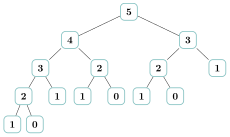
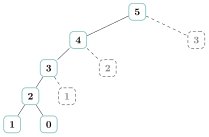
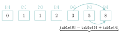
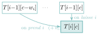
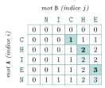

# Cours

<p class="sous-titre">Programmation dynamique</p>

<span id="chap-08" class="ancre"></span>

|  |  |
|:---|:---|
| **Programme (BO)** | *« Programmation dynamique. Résoudre un problème grâce à la programmation dynamique. »* |
| **Prérequis** | la **récursivité** (absolument indispensable), la notion de **coût** d’un algorithme (linéaire, quadratique, exponentiel), les **listes** et les **dictionnaires**, et le souvenir des **algorithmes gloutons** de Première. |
| **Objectifs** | *reconnaître* un problème qui se prête à la programmation dynamique (sous-problèmes qui *se recouvrent*) ; *mémoïser* une fonction récursive (*top-down*) ; *tabuler* un problème de bas en haut (*bottom-up*) ; *comprendre* que ce sont deux faces d’une même idée ; l’*appliquer* au rendu de monnaie, au sac à dos, à la comparaison de deux mots. |

## Le problème : quand la récursivité recalcule mille fois la même chose

**Un peu d’histoire.** Cette suite doit son nom à **Leonardo Fibonacci** (Léonard de Pise), qui la fait connaître en Europe en **1202** dans son *Liber abbaci* (« Livre du calcul »), l’ouvrage qui popularise aussi les chiffres indo-arabes. Elle y répond à un problème de **lapins** (combien de couples au bout d’un an ?), dont la page ci-contre, copie médiévale conservée à Florence, porte les réponses en marge : $1, 2, 3, 5, 8, \dots, 377$.

La suite de Fibonacci est définie par $F_0 = 0$, $F_1 = 1$ et $F_n = F_{n-1} + F_{n-2}$. Sa version récursive naïve recopie la définition :

```python
def fibo(n):
    if n <= 1:
        return n
    return fibo(n - 1) + fibo(n - 2)
```

\*(image manquante : 08_hist_liber_abbaci)\*  
Le problème des lapins dans le *Liber abbaci*

Ce code est *juste*, mais son temps de calcul explose : il est multiplié par environ $1{,}6$ chaque fois que $n$ augmente de $1$ (environ $2$ secondes pour `fibo(35)`, une dizaine pour `fibo(38)`, et de l’ordre d’une heure pour `fibo(50)`). L’**arbre des appels** de `fibo(5)` montre pourquoi :

{ .tikz loading=lazy }

`fibo(2)` y est calculé **trois** fois, `fibo(3)` deux fois, chacun relançant tout son sous-arbre : $15$ appels pour `fibo(5)`, plus de $300$ millions pour `fibo(40)`. Le nombre d’appels, et donc le temps, croît comme $1{,}6^n$ : le coût est **exponentiel**.

!!! regle "Règle 1 — Le constat qui lance tout le chapitre"

    La récursivité naïve est parfois catastrophique parce qu’elle **recalcule sans cesse les mêmes sous-problèmes**. L’idée de toute la programmation dynamique tient en une phrase : **ne jamais calculer deux fois la même chose**. On *retient* le résultat d’un sous-problème la première fois, et on le *réutilise* ensuite.

Ce fil rouge — « garder pour ne pas refaire » — va traverser tout le chapitre. Il existe **deux façons** de l’appliquer, et le programme demande de les connaître toutes les deux.

## Première façon : la mémoïsation (*top-down*)

*Mémoïser*, c’est garder la fonction récursive telle qu’elle est — on part « du haut », du problème complet — mais lui adjoindre un **carnet de notes** où l’on inscrit chaque résultat déjà calculé. Avant de se lancer dans un calcul, la fonction consulte le carnet : si la réponse y est, elle la lit ; sinon, elle la calcule *et l’écrit*.

!!! definition "Définition 1 — Mémoïsation"

    La **mémoïsation** consiste à munir une fonction récursive d’un **dictionnaire** (le « carnet ») qui associe à chaque argument déjà rencontré le résultat correspondant. On dit que l’on résout le problème **de haut en bas** (*top-down*) : on garde la structure récursive descendante, mais chaque sous-problème n’est **résolu qu’une seule fois**.

```python
def fibo(n, memo={}):
    if n <= 1:
        return n
    if n in memo:            # deja calcule : on lit le carnet
        return memo[n]
    resultat = fibo(n - 1, memo) + fibo(n - 2, memo)
    memo[n] = resultat       # on ecrit dans le carnet
    return resultat
```

Avec cette seule modification, `fibo(50)` est **instantané**, et même `fibo(500)` passe sans effort. Chaque valeur $F_k$ n’est calculée qu’une fois : il y a $n$ sous-problèmes distincts, donc le coût devient **linéaire**, $O(n)$ — on passe d’un coût exponentiel (environ $1{,}6^n$, que l’on majore souvent par $2^n$) à $n$, l’un des plus beaux gains de tout le cours.

Sur l’arbre des appels, la mémoïsation **coupe** toutes les branches redondantes : la deuxième fois qu’une valeur est demandée, on la *lit dans le carnet* au lieu de relancer tout son sous-arbre.

{ .tikz loading=lazy }  
Arbre de `fibo(5)` *mémoïsé* : les nœuds en pointillés gris (`3`, `2`, `1` déjà rencontrés) sont **lus dans le carnet** — leurs sous-arbres ne sont jamais recalculés. Comparez avec l’arbre complet du début !

!!! remarque "Remarque"

    Le paramètre `memo={}` par défaut est pratique mais c’est un **piège classique** : en Python, un argument par défaut mutable est **partagé** entre tous les appels. Ici cela nous arrange (le carnet survit d’un appel à l’autre), mais dans un autre contexte cela cause des bugs sournois. Une version plus sûre passe le dictionnaire explicitement, ou l’initialise à `None`.

Python fournit d’ailleurs la mémoïsation « clés en main », sous la forme d’un **décorateur** `@cache` (ou `@lru_cache`) du module `functools`. On garde alors la fonction récursive naïve, et une seule ligne au-dessus lui greffe le carnet :

```python
from functools import cache

@cache                       # mémoïse automatiquement les appels
def fibo(n):
    if n <= 1:
        return n
    return fibo(n - 1) + fibo(n - 2)
```

Le résultat est identique à notre version manuelle : chaque `fibo(k)` n’est calculé qu’une fois. Écrire soi-même le dictionnaire reste indispensable pour *comprendre* ce qui se passe — mais dans la vraie vie, on emploie souvent le décorateur.

<span id="cours-08-1" class="ancre"></span>

<span class="afaire">▶ Exercices d'application :</span> exercices **[1](exercices.md#ex-08-1) à [3](exercices.md#ex-08-3)** (mémoïsation)

## Seconde façon : la tabulation (*bottom-up*)

L’autre stratégie renverse le point de vue. Plutôt que de partir du problème complet et de descendre, on **part des plus petits cas** et on **remonte** en remplissant un tableau, jusqu’à atteindre la valeur cherchée. Il n’y a alors *plus aucune récursivité* : juste une boucle et un tableau.

!!! definition "Définition 2 — Tabulation"

    La **tabulation** consiste à résoudre les sous-problèmes **du plus petit au plus grand** en rangeant leurs résultats dans un **tableau** (une « table »). On dit que l’on résout le problème **de bas en haut** (*bottom-up*) : chaque case du tableau se calcule à partir de cases déjà remplies.

```python
def fibo(n):
    if n <= 1:
        return n
    table = [0] * (n + 1)    # table[k] contiendra F_k
    table[0] = 0
    table[1] = 1
    for k in range(2, n + 1):
        table[k] = table[k - 1] + table[k - 2]   # deja calcules
    return table[n]
```

Ici encore le coût est **linéaire**. On construit `table[2]`, puis `table[3]`, etc. : quand on calcule `table[k]`, les deux cases dont on a besoin sont *déjà là*. On avance en terrain conquis.

{ .tikz loading=lazy }  
**Tabulation :** on remplit de gauche à droite. Chaque nouvelle case ne lit que des cases *déjà calculées* à sa gauche.

!!! exemple "Exemple"

    Déroulons pour $n = 6$. On remplit la table de gauche à droite :

    |  $k$  |  0  |  1  |  2  |  3  |  4  |  5  |
    |:-----:|:---:|:---:|:---:|:---:|:---:|:---:|
    | $F_k$ |  0  |  1  |  1  |  2  |  3  |  5  |

    $F_6 = F_5 + F_4 = 5 + 3 = 8$. Chaque case n’a lu que ses deux voisines de gauche.

<span id="cours-08-4" class="ancre"></span>

<span class="afaire">▶ Exercices d'application :</span> exercices **[4](exercices.md#ex-08-4) à [8](exercices.md#ex-08-8)** (tabulation)

## Deux faces d’une même pièce

Mémoïsation et tabulation résolvent **le même problème** avec **la même idée** (ne rien recalculer), mais dans deux sens opposés. Il faut savoir les distinguer et passer de l’une à l’autre.

|  | **Mémoïsation (*top-down*)** | **Tabulation (*bottom-up*)** |
|:---|:---|:---|
| Sens | du problème complet vers les petits cas | des petits cas vers le problème complet |
| Forme du code | une fonction **récursive** + un dictionnaire | une **boucle** + un tableau |
| Ce qu’on calcule | **seulement** les sous-problèmes utiles | **tous** les sous-problèmes jusqu’à la cible |
| Atout | naturel si on part de la formule récursive | pas de récursivité, pas de pile d’appels qui déborde |

!!! remarque "Remarque"

    Aucune des deux n’est « meilleure » dans l’absolu. La mémoïsation est souvent la plus facile à écrire quand on tient déjà la formule récursive ; la tabulation évite le risque de « dépassement de la profondeur de récursion » et se prête bien quand on a besoin de *toutes* les valeurs intermédiaires. Un bon réflexe de contrôle : **écrire la relation de récurrence**, puis choisir l’un des deux emballages.

## Un cas d’école : le rendu de monnaie

Vous devez rendre une somme avec le **moins de pièces possible**, en piochant dans un système de valeurs, par exemple $\{1, 2, 5\}$. En Première, vous avez vu l’algorithme **glouton** : prendre à chaque fois la plus grosse pièce possible. C’est rapide, mais…

!!! propriete "Propriété 1 — Le glouton peut se tromper"

    Avec le système $\{1, 3, 4\}$, pour rendre $6$, le glouton prend $4$, puis $1$, puis $1$ : **trois** pièces. Or $3 + 3$ suffit : **deux** pièces. Le glouton n’est **pas toujours optimal**. Pour être *sûr* d’avoir le minimum, il faut explorer toutes les possibilités… intelligemment.

Posons la **relation de récurrence**. Notons $R(s)$ le nombre minimal de pièces pour rendre la somme $s$. Pour rendre $s$, on choisit une première pièce $p$ (avec $p \leq s$), et il reste alors à rendre $s - p$ de façon optimale. On essaie *toutes* les premières pièces et on garde la meilleure : $$R(0) = 0, \qquad R(s) = 1 + \min_{p \leq s}\ R(s - p).$$ Les sous-problèmes $R(s - p)$ **se recouvrent** massivement (rendre $4$ intervient pour rendre $5$, $6$, $8$…) : c’est le signal de la programmation dynamique.

**Version mémoïsée (top-down).**

```python
def rendu(somme, pieces, memo=None):
    if memo is None:
        memo = {}
    if somme == 0:
        return 0
    if somme in memo:
        return memo[somme]
    meilleur = float("inf")            # +l'infini : aucune solution trouvee
    for p in pieces:
        if p <= somme:
            meilleur = min(meilleur, 1 + rendu(somme - p, pieces, memo))
    memo[somme] = meilleur
    return meilleur
```

**Version tabulée (bottom-up).** On remplit un tableau `table[s]` $= R(s)$ pour $s$ allant de $0$ à la somme voulue :

```python
def rendu(somme, pieces):
    table = [0] + [float("inf")] * somme     # table[0] = 0
    for s in range(1, somme + 1):
        for p in pieces:
            if p <= s and table[s - p] + 1 < table[s]:
                table[s] = table[s - p] + 1
    return table[somme]
```

!!! exemple "Exemple"

    Système $\{1, 3, 4\}$, rendre $6$. La table se construit de $s=0$ à $s=6$ :

    |  $s$   |  0  |  1  |  2  |  3  |  4  |  5  |   6   |
    |:------:|:---:|:---:|:---:|:---:|:---:|:---:|:-----:|
    | $R(s)$ |  0  |  1  |  2  |  1  |  1  |  2  | **2** |

    On lit $R(6) = 2$ (c’est $3 + 3$), là où le glouton donnait $3$. La programmation dynamique a trouvé le *vrai* minimum.

<span id="cours-08-9" class="ancre"></span>

<span class="afaire">▶ Exercices d'application :</span> exercices **[9](exercices.md#ex-08-9) à [11](exercices.md#ex-08-11)** (le rendu de monnaie)

## Un tableau à deux dimensions : le sac à dos

Certains problèmes ont besoin d’une table à **deux entrées**. Le plus célèbre est le **sac à dos** : un sac supporte un poids maximal $C$ (sa *capacité*) ; chaque objet $i$ a un poids $w_i$ et une valeur $v_i$ ; on veut **maximiser la valeur totale** emportée sans dépasser $C$.

L’idée : on considère les objets un par un. Notons $T[i][c]$ la meilleure valeur atteignable avec les $i$ premiers objets et une capacité $c$. Pour l’objet $i$, deux choix :

- **le laisser** : on garde $T[i-1][c]$ ;

- **le prendre** (si $w_i \leq c$) : on gagne $v_i$ et il reste $c - w_i$, soit $v_i + T[i-1][c - w_i]$.

On garde le meilleur des deux : $$T[i][c] = \max\big(\ T[i-1][c],\ \ v_i + T[i-1][c - w_i]\ \big).$$

{ .tikz loading=lazy }  
**Table 2D :** chaque case de la ligne $i$ se calcule à partir de **deux cases de la ligne $i-1$** (celle juste au-dessus, et celle décalée de $w_i$ vers la gauche).

```python
def sac_a_dos(poids, valeurs, capacite):
    n = len(poids)
    # T[i][c] : meilleure valeur avec les i premiers objets, capacite c
    T = [[0] * (capacite + 1) for _ in range(n + 1)]
    for i in range(1, n + 1):
        for c in range(capacite + 1):
            T[i][c] = T[i - 1][c]                      # on laisse l'objet i
            if poids[i - 1] <= c:                      # si on peut le prendre
                avec = valeurs[i - 1] + T[i - 1][c - poids[i - 1]]
                if avec > T[i][c]:
                    T[i][c] = avec
    return T[n][capacite]
```

!!! remarque "Remarque"

    Le sac à dos « entier » (on prend un objet ou pas, jamais un morceau) n’a **pas** de bon algorithme glouton : c’est justement ce qui le rend intéressant. Sa version dynamique remplit une table de taille $n \times C$, donc en coût $O(n \times C)$ — bien mieux que d’essayer les $2^n$ sous-ensembles d’objets.

<span id="cours-08-12" class="ancre"></span>

<span class="afaire">▶ Exercices d'application :</span> exercices **[12](exercices.md#ex-08-12) et [13](exercices.md#ex-08-13)** (les chemins d’un robot, le sac à dos)

## Comparer deux mots : la plus longue sous-séquence commune

Dernier grand classique, très présent au bac et utilisé en vrai (correcteurs orthographiques, `diff` de deux fichiers, comparaison d’ADN). Une **sous-séquence** d’un mot, c’est ce qu’il reste en *effaçant* des lettres sans changer l’ordre des autres. On cherche la plus longue sous-séquence commune (PLSC) à deux mots.

Notons $L[i][j]$ la longueur de la PLSC entre les $i$ premières lettres de $A$ et les $j$ premières de $B$. La récurrence compare les dernières lettres : $$L[i][j] =
\begin{cases}
L[i-1][j-1] + 1 & \text{si } A[i-1] = B[j-1] \quad (\text{on garde la lettre})\\ 
\max\big(L[i-1][j],\ L[i][j-1]\big) & \text{sinon}.
\end{cases}$$

```python
def plsc(a, b):
    n, m = len(a), len(b)
    L = [[0] * (m + 1) for _ in range(n + 1)]
    for i in range(1, n + 1):
        for j in range(1, m + 1):
            if a[i - 1] == b[j - 1]:
                L[i][j] = L[i - 1][j - 1] + 1
            else:
                L[i][j] = max(L[i - 1][j], L[i][j - 1])
    return L[n][m]
```

{ .tikz loading=lazy }

table `L` pour `plsc("CHIEN", "NICHE")`

!!! exemple "Exemple"

    Pour `"CHIEN"` et `"NICHE"`, la plus longue sous-séquence commune est `"CHE"` (longueur $3$) : on retrouve C, H, E dans le même ordre dans les deux mots. La table $L$ a $6 \times 6$ cases ; on lit la réponse dans le coin en bas à droite, $L[5][5] = 3$. Dans la table ci-dessus, les cases **foncées** sont les lettres égales ($L[i-1][j-1]+1$) ; avec les cases **claires**, elles forment le chemin de remontée depuis $L[5][5]$, qui fait relire `C`, `H`, `E`.

<span id="cours-08-14" class="ancre"></span>

<span class="afaire">▶ Exercices d'application :</span> exercice **[14](exercices.md#ex-08-14)** (comparer deux mots)

## Aller plus loin : la distance d’édition

La plus longue sous-séquence commune mesure une *ressemblance*. Sa cousine mesure une *différence*, et c’est peut-être l’algorithme dynamique le plus utilisé au monde : chaque fois que votre téléphone corrige « langaje » en « langage », chaque fois qu’un logiciel de bio-informatique aligne deux brins d’ADN, chaque fois qu’un `diff` compare deux versions d’un fichier, c’est elle qui travaille.

!!! definition "Définition 3 — Distance d’édition (ou de Levenshtein)"

    La **distance d’édition** entre deux mots est le **nombre minimal d’opérations élémentaires** pour transformer le premier en le second, les trois opérations autorisées étant : **insérer** une lettre, **supprimer** une lettre, ou **substituer** une lettre par une autre.

Le raisonnement est le même que pour la plus longue sous-séquence commune : on compare les *dernières* lettres. Notons $D[i][j]$ la distance d’édition entre les $i$ premières lettres de $A$ et les $j$ premières de $B$.

- Transformer un mot en le mot vide coûte autant de **suppressions** que de lettres : $D[i][0] = i$. De même $D[0][j] = j$ (que des insertions).

- Si les dernières lettres sont **égales** ($A[i-1] = B[j-1]$), rien à payer sur ce caractère : $D[i][j] = D[i-1][j-1]$.

- Sinon, on choisit la **moins chère** des trois opérations, chacune ramenant à un sous-problème plus petit : $$D[i][j] = 1 + \min\big(\underbrace{D[i-1][j]}_{\text{supprimer}},\ \underbrace{D[i][j-1]}_{\text{insérer}},\ \underbrace{D[i-1][j-1]}_{\text{substituer}}\big).$$

```python
def distance(a, b):
    n, m = len(a), len(b)
    D = [[0] * (m + 1) for _ in range(n + 1)]
    for i in range(n + 1):
        D[i][0] = i                        # a -> mot vide : i suppressions
    for j in range(m + 1):
        D[0][j] = j                        # mot vide -> b : j insertions
    for i in range(1, n + 1):
        for j in range(1, m + 1):
            if a[i - 1] == b[j - 1]:
                D[i][j] = D[i - 1][j - 1]   # lettres egales : rien a payer
            else:
                D[i][j] = 1 + min(D[i - 1][j],      # suppression
                                  D[i][j - 1],      # insertion
                                  D[i - 1][j - 1])  # substitution
    return D[n][m]
```

!!! exemple "Exemple"

    Passons de `"CHIEN"` à `"CHATS"`. On remplit la table $D$ ligne par ligne (la première ligne et la première colonne comptent les lettres) :

    |     |  ø  | `C` | `H` | `A` | `T` |  `S`  |
    |:---:|:---:|:---:|:---:|:---:|:---:|:-----:|
    |  ø  |  0  |  1  |  2  |  3  |  4  |   5   |
    | `C` |  1  |  0  |  1  |  2  |  3  |   4   |
    | `H` |  2  |  1  |  0  |  1  |  2  |   3   |
    | `I` |  3  |  2  |  1  |  1  |  2  |   3   |
    | `E` |  4  |  3  |  2  |  2  |  2  |   3   |
    | `N` |  5  |  4  |  3  |  3  |  3  | **3** |

    On lit la distance dans le coin en bas à droite : $D[5][5] = \textbf{3}$. C’est logique : on garde `CH`, puis on **substitue** `I`$\to$`A`, `E`$\to$`T`, `N`$\to$`S`, soit trois opérations.

En remontant la table (comme pour le rendu de monnaie), on peut même retrouver la *suite précise* des corrections : c’est exactement ce que fait un correcteur orthographique pour proposer les mots les plus « proches » de celui que vous avez tapé.

<span id="cours-08-15" class="ancre"></span>

<span class="afaire">▶ Exercices d'application :</span> exercice **[15](exercices.md#ex-08-15)** (la distance d’édition)

## La méthode générale : reconnaître un problème dynamique

Tous ces exemples partagent la même ossature. C’est elle qu’il faut savoir repérer.

!!! regle "Règle 2 — La recette de la programmation dynamique"

    Un problème se résout par programmation dynamique quand il réunit **deux ingrédients** :

    1.  **des sous-problèmes qui se recouvrent** : la solution fait appel plusieurs fois aux mêmes sous-calculs (sinon, mémoïser ne servirait à rien) ;

    2.  **une sous-structure optimale** : la solution optimale du problème se construit à partir des solutions optimales de ses sous-problèmes.

    La démarche est alors toujours la même : **(a)** définir clairement ce que représente un sous-problème ; **(b)** écrire la **relation de récurrence** qui le relie à de plus petits ; **(c)** l’emballer soit en *mémoïsation*, soit en *tabulation*.

!!! remarque "Remarque"

    **Gloutons, diviser-pour-régner, programmation dynamique : ne pas confondre.** Le *glouton* fait un choix définitif à chaque étape (rapide, mais parfois faux). *Diviser pour régner* découpe en sous-problèmes **indépendants** (comme le tri fusion : les deux moitiés n’ont rien en commun). La *programmation dynamique* s’attaque au cas où les sous-problèmes **se chevauchent** : c’est précisément ce chevauchement qui rend la mémoire payante.

## Un peu d’histoire : Bellman et un nom choisi pour tromper un ministre

La programmation dynamique est née dans les années 1950 sous la plume du mathématicien américain **Richard Bellman** (1920–1984), à la RAND Corporation. Le mot « programmation » n’a ici rien à voir avec le code : à l’époque, il signifie « planification », l’optimisation d’une suite de décisions (comme la *programmation linéaire*).

Et le mot « dynamique » ? Bellman a raconté l’avoir choisi… par ruse. Son financeur, le secrétaire à la Défense Charles Wilson, « avait une peur et une haine viscérales du mot *recherche* ». Pour faire accepter ses travaux de mathématiques, Bellman cherchait un nom qui sonne concret, impossible à critiquer : « dynamique » avait une allure décidée, positive, et « il était impossible d’employer ce mot dans un sens péjoratif ». La discipline la plus élégante de l’algorithmique doit donc son nom à une opération de camouflage administratif !

Derrière l’anecdote, une idée profonde : le **principe d’optimalité** de Bellman — *une politique optimale est faite de sous-décisions elles-mêmes optimales* — est exactement la « sous-structure optimale » de notre recette. On la retrouve aujourd’hui partout : dans les GPS, la reconnaissance vocale, l’alignement de séquences d’ADN, et jusque dans l’apprentissage par renforcement des IA qui jouent aux échecs ou au go.

!!! remarque "Remarque — Liens avec d’autres chapitres"

    La programmation dynamique mémorise les résultats d’appels **récursifs** pour ne jamais recalculer deux fois (mémoïsation) : elle échange du **temps** contre de la **mémoire**. Elle prolonge **diviser pour régner** lorsque les sous-problèmes se recouvrent. Le **rendu de monnaie**, résolu de façon gloutonne en Première (**algorithmes gloutons**), trouve ici sa version **toujours optimale**. Comparer deux textes (plus longue sous-séquence commune, `diff`) est cousin de la **recherche textuelle**, étudiée au chapitre suivant : on y cherchera un motif exact ; ici, on cherche une ressemblance.

## Bilan — la carte mémoire

| **Notion** | **À retenir** |
|:---|:---|
| Idée centrale | ne **jamais recalculer** deux fois le même sous-problème |
| Quand l’utiliser | sous-problèmes qui **se recouvrent** + sous-structure optimale |
| Mémoïsation | récursivité + **dictionnaire**, de haut en bas (*top-down*) |
| Tabulation | boucle + **tableau**, de bas en haut (*bottom-up*) |
| Étape clé | écrire la **relation de récurrence** avant de coder |
| Gain typique | de l’**exponentiel** au **linéaire** (Fibonacci : $2^n \to n$) |
| Rendu de monnaie | $R(s) = 1 + \min_{p \leq s} R(s-p)$ ; le glouton peut se tromper |
| Sac à dos | table 2D $T[i][c]$ : prendre ou laisser l’objet $i$ |
| Mots | PLSC (ressemblance) et distance d’édition (différence), tables 2D |
| Ne pas confondre | glouton (choix définitif) / diviser-pour-régner (sous-pb **indépendants**) |

## Erreurs fréquentes

- **Croire qu’une fonction récursive suffit.** Sans mémo ni table, Fibonacci naïf est exponentiel : c’est *juste* mais inutilisable. *Le réflexe :* dès qu’on voit les mêmes appels revenir, on mémoïse.

- **Oublier le cas de base.** `R(0)=0`, `table[0]`, `L[0][j]=0`… sans lui, la récurrence tourne dans le vide.

- **Se tromper de sens en tabulant.** On ne peut remplir `table[s]` que si les cases dont il dépend (`table[s-p]`) sont **déjà** calculées : la boucle doit aller du petit vers le grand.

- **Confondre décalage d’indices.** Avec les $i$ premiers objets, l’objet numéro $i$ est `poids[i-1]` en Python (les listes commencent à $0$). Source d’erreurs dans le sac à dos et la PLSC.

- **Prendre le glouton pour la programmation dynamique.** Le glouton fait *un* choix ; la programmation dynamique les **compare tous** via la récurrence.

## Savoir-faire à maîtriser

*À la fin du chapitre, je sais…*

- **expliquer** pourquoi une récursivité naïve peut être exponentielle (arbre des appels) $\to$ ex. [1](exercices.md#ex-08-1) ;

- **mémoïser** une fonction récursive à l’aide d’un dictionnaire (*top-down*) $\to$ ex. [2](exercices.md#ex-08-2), [3](exercices.md#ex-08-3) ;

- **tabuler** un problème en remplissant un tableau du plus petit cas au plus grand (*bottom-up*) $\to$ ex. [5](exercices.md#ex-08-5), [6](exercices.md#ex-08-6), [7](exercices.md#ex-08-7) ;

- **écrire une relation de récurrence** et l’implémenter des deux façons $\to$ ex. [3](exercices.md#ex-08-3), [10](exercices.md#ex-08-10), [12](exercices.md#ex-08-12) ;

- **dérouler à la main** le remplissage d’une table (rendu de monnaie, pyramide, sac à dos) $\to$ ex. [4](exercices.md#ex-08-4), [7](exercices.md#ex-08-7), [10](exercices.md#ex-08-10), [13](exercices.md#ex-08-13) ;

- **reconnaître** les deux ingrédients (recouvrement + sous-structure optimale) et distinguer du glouton et de diviser-pour-régner $\to$ ex. [8](exercices.md#ex-08-8), [9](exercices.md#ex-08-9).

## Vers le Grand Oral

- **Comment retenir ses calculs peut faire passer un algorithme de plusieurs siècles à une fraction de seconde ?** *(Fibonacci naïf vs mémoïsé ; l’arbre des appels ; l’exponentiel contre le linéaire.)*

- **Pourquoi rendre la monnaie n’est-il pas si simple qu’il y paraît ?** *(glouton non optimal sur $\{1,3,4\}$ ; la récurrence du rendu ; l’optimalité garantie.)*

- **Comment un logiciel compare-t-il deux textes, ou deux brins d’ADN ?** *(plus longue sous-séquence commune ; la table $L$ ; applications au `diff` et à la bio-informatique.)*

- **Comment un téléphone devine-t-il le mot que vous vouliez écrire ?** *(distance d’édition de Levenshtein ; les trois opérations ; la table des corrections minimales.)*

- **Une même idée, deux mises en œuvre : top-down ou bottom-up, comment choisir ?** *(mémoïsation vs tabulation ; récursivité et pile d’appels ; le rôle de la relation de récurrence.)*
