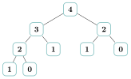
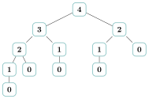

# Exercices

<p class="sous-titre">Programmation dynamique</p>

Usage de l’IA, indiqué sur chaque exercice : <span class="ia ia-rouge" title="Sans IA : le but est l'automatisme lui-même"></span> aucune ; <span class="ia ia-orange" title="IA en appui : déboguer, reformuler, vérifier ; la réponse finale est la vôtre"></span> en appui (déboguer, reformuler, vérifier ; la réponse finale est écrite et comprise par vous) ; <span class="ia ia-vert" title="IA intégrée : l'exercice s'appuie sur une réponse d'IA"></span> l’exercice s’appuie sur une réponse d’IA. Voir la [charte d’usage de l’IA](../charte.md).

!!! consignes "Mode d’emploi"

    Niveau : ★ échauffement, ★★ classique (niveau bac), ★★★ défi ; les *coups de pouce* et les *corrigés* se déplient sous chaque exercice.

    Le symbole <span class="run" title="À programmer et tester sur machine">▶</span>  signale un exercice *à programmer et tester* en Python. Réflexe permanent : avant de coder, **écrire la relation de récurrence** et **repérer le cas de base**.

### Le déclic : ne pas recalculer deux fois

### <span class="stars" title="Niveau 1 sur 3">★</span> <span class="exo-num">Exercice 1</span> — Compter les appels <span class="ia ia-rouge" title="Sans IA : le but est l'automatisme lui-même"></span> { #ex-08-1 }

On reprend Fibonacci naïf :

```python
def fibo(n):
    if n <= 1:
        return n
    return fibo(n - 1) + fibo(n - 2)
```

1.  Dessiner l’arbre des appels de `fibo(4)`.

2.  Combien de fois `fibo(1)` est-il appelé lors du calcul de `fibo(4)` ?

3.  On note $A(n)$ le nombre total d’appels à `fibo` déclenchés par `fibo(n)`. Justifier que $A(n) = 1 + A(n-1) + A(n-2)$ pour $n \geq 2$, et calculer $A(0), A(1), \dots, A(6)$.

4.  Expliquer en une phrase pourquoi ce coût rend `fibo(60)` inutilisable.

??? corrige "Corrigé"

    !!! remarque "Remarque"

        On donne **une** version simple de chaque programme ; d’autres sont possibles. On rappelle le réflexe : écrire la relation de récurrence, repérer le cas de base, puis emballer en mémoïsation ou en tabulation.

    **1.** Arbre des appels de `fibo(4)` :

    { .tikz loading=lazy }

    **2.** `fibo(1)` apparaît **3 fois** dans cet arbre.

    **3.** Un appel à `fibo(n)` (pour $n \geq 2$) c’est : *lui-même* ($1$ appel), plus tous les appels de `fibo(n-1)`, plus tous ceux de `fibo(n-2)`. D’où $A(n) = 1 + A(n-1) + A(n-2)$, avec $A(0) = A(1) = 1$. On calcule :

    |  $n$   |  0  |  1  |  2  |  3  |  4  |  5  |  6  |
    |:------:|:---:|:---:|:---:|:---:|:---:|:---:|:---:|
    | $A(n)$ |  1  |  1  |  3  |  5  |  9  | 15  | 25  |

    **4.** $A(n)$ croît comme Fibonacci lui-même, c’est-à-dire **exponentiellement** : `fibo(60)` déclencherait environ $5 \times 10^{12}$ appels (cinq mille milliards). Au rythme mesuré dans l’activité de découverte (environ $2$ secondes pour les $30$ millions d’appels de `fibo(35)`), cela représente de l’ordre de $4$ jours de calcul ininterrompu.

### <span class="stars" title="Niveau 1 sur 3">★</span> <span class="exo-num">Exercice 2</span> — Ajouter un carnet de notes <span class="ia ia-orange" title="IA en appui : déboguer, reformuler, vérifier ; la réponse finale est la vôtre"></span> { #ex-08-2 }

<span class="run" title="À programmer et tester sur machine">▶</span>  Recopier la fonction `fibo` et la transformer en une fonction **mémoïsée** `fibo_memo(n, memo)` qui utilise un dictionnaire `memo` pour ne calculer chaque $F_k$ qu’une seule fois. Vérifier que `fibo_memo(50)` vaut `12586269025` et s’obtient instantanément.

??? corrige "Corrigé"

    Version mémoïsée :

    ```python
    def fibo_memo(n, memo=None):
        if memo is None:
            memo = {}
        if n <= 1:
            return n
        if n in memo:
            return memo[n]
        memo[n] = fibo_memo(n - 1, memo) + fibo_memo(n - 2, memo)
        return memo[n]
    ```

    `fibo_memo(50)` renvoie bien `12586269025`, instantanément : chaque $F_k$ n’est calculé qu’une fois, le coût est linéaire.

### <span class="stars" title="Niveau 2 sur 3">★★</span> <span class="exo-num">Exercice 3</span> — Monter un escalier <span class="ia ia-orange" title="IA en appui : déboguer, reformuler, vérifier ; la réponse finale est la vôtre"></span> { #ex-08-3 }

Un escalier a $n$ marches. On peut monter les marches **une par une** ou **deux par deux**. On note $M(n)$ le nombre de façons différentes d’arriver en haut.

1.  Dénombrer à la main $M(1)$, $M(2)$, $M(3)$ et $M(4)$ (lister les façons pour $M(3)$).

2.  Justifier que $M(n) = M(n-1) + M(n-2)$. Quel nombre célèbre reconnaît-on ?

    ??? pouce "Coup de pouce"

        Le dernier pas est de 1 ou de 2 marches : sur quelle marche était-on juste avant, dans chacun des deux cas ?

3.  <span class="run" title="À programmer et tester sur machine">▶</span>  Écrire une fonction **mémoïsée** `monter(n)` qui renvoie $M(n)$. Tester `monter(10)`.

    ??? pouce "Coup de pouce"

        Reprendre le schéma de `fibo_memo` ; attention, les conditions d’arrêt ne sont pas celles de Fibonacci.

??? corrige "Corrigé"

    **1.** $M(1) = 1$ (un pas de 1). $M(2) = 2$ : «$1{+}1$» ou «$2$». $M(3) = 3$ : «$1{+}1{+}1$», «$1{+}2$», «$2{+}1$». $M(4) = 5$.

    **2.** Pour arriver en haut de $n$ marches, le **dernier** pas est soit de $1$ (on venait de la marche $n-1$), soit de $2$ (on venait de $n-2$). Ces deux familles de chemins sont disjointes et couvrent tout : $M(n) = M(n-1) + M(n-2)$. On reconnaît la suite de **Fibonacci** (décalée).

    **3.**

    ```python
    def monter(n, memo=None):
        if memo is None:
            memo = {}
        if n <= 1:
            return 1
        if n in memo:
            return memo[n]
        memo[n] = monter(n - 1, memo) + monter(n - 2, memo)
        return memo[n]
    ```

    `monter(10)` renvoie `89`.

### De bas en haut : construire une table

### <span class="stars" title="Niveau 1 sur 3">★</span> <span class="exo-num">Exercice 4</span> — Remplir une table à la main <span class="ia ia-rouge" title="Sans IA : le but est l'automatisme lui-même"></span> { #ex-08-4 }

On définit la suite $u$ par $u_0 = 2$, $u_1 = 1$ et, pour $n \geq 2$, $u_n = u_{n-1} + 2\,u_{n-2}$.

1.  Recopier et compléter la table :

    |  $n$  |  0  |  1  |  2  |  3  |  4  |  5  |  6  |
    |:-----:|:---:|:---:|:---:|:---:|:---:|:---:|:---:|
    | $u_n$ |  2  |  1  |     |     |     |     |     |

2.  Dans quel ordre a-t-on rempli les cases ? Pour calculer la case $6$, de quelles cases a-t-on eu besoin ?

3.  Combien de cases faut-il remplir pour obtenir $u_n$ ? Quel est l’ordre de grandeur du coût de cette méthode ?

??? corrige "Corrigé"

    **1.** On applique $u_n = u_{n-1} + 2\,u_{n-2}$ case après case :

    |  $n$  |  0  |  1  |  2  |  3  |  4  |  5  |  6  |
    |:-----:|:---:|:---:|:---:|:---:|:---:|:---:|:---:|
    | $u_n$ |  2  |  1  |  5  |  7  | 17  | 31  | 65  |

    (par exemple $u_2 = 1 + 2 \times 2 = 5$ et $u_6 = 31 + 2 \times 17 = 65$).

    **2.** On remplit les cases **de gauche à droite**, des petits indices vers les grands : chaque case n’utilise que des cases déjà remplies. La case $6$ n’a besoin que des cases $5$ et $4$.

    **3.** Il faut remplir $n + 1$ cases, chacune en un calcul : le coût est **linéaire** (de l’ordre de $n$), contre un coût exponentiel pour une récursion naïve qui recalculerait les mêmes termes.

### <span class="stars" title="Niveau 1 sur 3">★</span> <span class="exo-num">Exercice 5</span> — Fibonacci tabulé <span class="ia ia-orange" title="IA en appui : déboguer, reformuler, vérifier ; la réponse finale est la vôtre"></span> { #ex-08-5 }

<span class="run" title="À programmer et tester sur machine">▶</span>  Écrire `fibo_tab(n)` qui calcule $F_n$ **sans récursivité**, en remplissant un tableau `table` de bas en haut. Comparer les valeurs obtenues avec celles de `fibo_memo` pour $n$ de $0$ à $20$.

??? corrige "Corrigé"

    ```python
    def fibo_tab(n):
        if n <= 1:
            return n
        table = [0] * (n + 1)
        table[1] = 1
        for k in range(2, n + 1):
            table[k] = table[k - 1] + table[k - 2]
        return table[n]
    ```

    Les valeurs coïncident avec `fibo_memo` pour tout $n$ (c’est la même suite, calculée dans l’autre sens).

    *Autre méthode :* chaque case n’utilise que les **deux** précédentes ; il suffit donc de garder deux variables au lieu de tout le tableau (même coût linéaire, mémoire constante).

    ```python
    def fibo_deux_variables(n):
        precedent = 0                      # F_0
        courant = 1                        # F_1
        for k in range(n):
            suivant = precedent + courant
            precedent = courant
            courant = suivant
        return precedent                   # F_n
    ```

### <span class="stars" title="Niveau 1 sur 3">★</span> <span class="exo-num">Exercice 6</span> — Escalier tabulé <span class="ia ia-orange" title="IA en appui : déboguer, reformuler, vérifier ; la réponse finale est la vôtre"></span> { #ex-08-6 }

<span class="run" title="À programmer et tester sur machine">▶</span>  Réécrire l’exercice de l’escalier en **tabulation** : une fonction `monter_tab(n)` avec une boucle et un tableau, sans récursivité. Vérifier qu’elle donne les mêmes résultats que la version mémoïsée.

??? corrige "Corrigé"

    ```python
    def monter_tab(n):
        if n <= 1:
            return 1
        table = [1] * (n + 1)
        for k in range(2, n + 1):
            table[k] = table[k - 1] + table[k - 2]
        return table[n]
    ```

### <span class="stars" title="Niveau 2 sur 3">★★</span> <span class="exo-num">Exercice 7</span> — Le plus grand chemin dans un triangle <span class="ia ia-orange" title="IA en appui : déboguer, reformuler, vérifier ; la réponse finale est la vôtre"></span> { #ex-08-7 }

On dispose un triangle de nombres, par exemple :

{ .tikz loading=lazy }

Partant du sommet, on descend à chaque étage vers le voisin de gauche ou de droite, jusqu’en bas. Le **score** d’un chemin est la somme des nombres traversés.

1.  Donner un chemin de score maximal pour ce triangle, et son score.

2.  On note $S(i, j)$ le meilleur score que l’on peut encore obtenir en partant de la case $j$ du niveau $i$. Écrire la relation qui lie $S(i,j)$ à $S(i+1, j)$ et $S(i+1, j+1)$, et donner le cas de base (dernier niveau).

    ??? pouce "Coup de pouce"

        Depuis la case $(i, j)$, quelles sont les deux cases atteignables à l’étage suivant ? Laquelle a-t-on intérêt à choisir ?

3.  <span class="run" title="À programmer et tester sur machine">▶</span>  Le triangle est donné en liste de listes, ici `t = [[3],[7,4],[2,4,6],[8,5,9,3]]`. Écrire une fonction **tabulée** `meilleur_score(t)` qui remplit une table *du bas vers le haut* et renvoie $S(0,0)$.

    ??? pouce "Coup de pouce"

        La table a la même forme que le triangle, et son dernier niveau est déjà connu (condition d’arrêt) : on remonte niveau par niveau.

    ??? pouce "Coup de pouce 2 (début de solution)"

        `s = [list(niveau) for niveau in t]`  
        `for i in range(len(t) - 2, -1, -1):`  
        `for j in range(len(t[i])):` …

??? corrige "Corrigé"

    **1.** Le meilleur chemin est $3 \to 7 \to 4 \to 9$, de score $3 + 7 + 4 + 9 = \textbf{23}$.

    **2.** Depuis la case $(i, j)$, on descend vers $(i+1, j)$ ou $(i+1, j+1)$, et on garde le meilleur : $$S(i, j) = t[i][j] + \max\big(S(i+1, j),\ S(i+1, j+1)\big),$$ avec le cas de base $S(\text{dernier niveau}, j) = t[\text{dernier}][j]$.

    **3.**

    ```python
    def meilleur_score(t):
        n = len(t)
        s = [list(niveau) for niveau in t]      # copie ; le dernier niveau est deja bon
        for i in range(n - 2, -1, -1):          # du bas vers le haut
            for j in range(len(t[i])):
                s[i][j] = t[i][j] + max(s[i + 1][j], s[i + 1][j + 1])
        return s[0][0]
    ```

    `meilleur_score([[3],[7,4],[2,4,6],[8,5,9,3]])` renvoie `23`.

### <span class="stars" title="Niveau 1 sur 3">★</span> <span class="exo-num">Exercice 8</span> — Reconnaître les deux approches <span class="ia ia-rouge" title="Sans IA : le but est l'automatisme lui-même"></span> { #ex-08-8 }

On définit la suite de « Tribonacci » par $T_0 = 0$, $T_1 = 0$, $T_2 = 1$ et $T_n = T_{n-1} + T_{n-2} + T_{n-3}$ pour $n \geq 3$. Voici deux fonctions qui la calculent.

```python
def trib_a(n, memo=None):
    if memo is None:
        memo = {}
    if n <= 1:
        return 0
    if n == 2:
        return 1
    if n not in memo:
        memo[n] = trib_a(n - 1, memo) + trib_a(n - 2, memo) + trib_a(n - 3, memo)
    return memo[n]

def trib_b(n):
    table = [0, 0, 1] + [0] * n
    for k in range(3, n + 1):
        table[k] = table[k - 1] + table[k - 2] + table[k - 3]
    return table[n]
```

1.  Laquelle procède par **mémoïsation**, laquelle par **tabulation** ? Justifier par un détail du code.

2.  Que renvoient `trib_a(6)` et `trib_b(6)` ?

3.  Dans `trib_a`, quelle ligne empêche de recalculer deux fois le même terme ?

??? corrige "Corrigé"

    **1.** `trib_a` procède par **mémoïsation** (*top-down*) : elle reste récursive et range ses résultats dans le dictionnaire `memo`. `trib_b` procède par **tabulation** (*bottom-up*) : une boucle remplit le tableau `table` des petits indices vers les grands, sans aucun appel récursif.

    **2.** Les termes successifs sont $0, 0, 1, 1, 2, 4, 7$ : les deux fonctions renvoient `7`.

    **3.** Le test `if n not in memo:` : le calcul n’est lancé que si $T_n$ n’est pas déjà dans le carnet ; sinon on relit directement `memo[n]`.

### Le rendu de monnaie

### <span class="stars" title="Niveau 1 sur 3">★</span> <span class="exo-num">Exercice 9</span> — Le glouton se trompe <span class="ia ia-rouge" title="Sans IA : le but est l'automatisme lui-même"></span> { #ex-08-9 }

On dispose du système de pièces $\{1, 3, 4\}$.

1.  Rendre la somme $6$ avec l’algorithme glouton (toujours la plus grosse pièce possible). Combien de pièces ?

2.  Trouver une meilleure solution à la main. Conclusion sur le glouton ?

3.  Rappeler la relation de récurrence donnant $R(s)$, le nombre *minimal* de pièces pour rendre $s$, et le cas de base.

??? corrige "Corrigé"

    **1.** Glouton pour $6$ avec $\{1,3,4\}$ : $4$, puis $1$, puis $1$ $\Rightarrow$ **3 pièces**.

    **2.** $3 + 3 = 6$ $\Rightarrow$ **2 pièces**. Le glouton n’est donc **pas optimal**.

    **3.** $R(0) = 0$ et $R(s) = 1 + \min\limits_{p \leq s} R(s - p)$ (on essaie chaque première pièce $p$ et on garde la meilleure suite).

### <span class="stars" title="Niveau 2 sur 3">★★</span> <span class="exo-num">Exercice 10</span> — Rendre au plus juste <span class="ia ia-orange" title="IA en appui : déboguer, reformuler, vérifier ; la réponse finale est la vôtre"></span> { #ex-08-10 }

<span class="run" title="À programmer et tester sur machine">▶</span>  Écrire, au choix en mémoïsation *ou* en tabulation, une fonction `rendu(somme, pieces)` qui renvoie le nombre minimal de pièces. Tester : `rendu(6, [1,3,4])` doit valoir `2`, et `rendu(11, [1,2,5])` doit valoir `3`.

??? pouce "Coup de pouce"

    Partir de la relation de récurrence de l’exercice précédent. En tabulation, on remplit `table[s]` pour `s` croissant, en essayant chaque pièce `p` $\leq$ `s` comme dernière pièce.

??? pouce "Coup de pouce 2 (début de solution)"

    `for s in range(1, somme + 1):`  
    `for p in pieces:`  
    `if p <= s:` … Attention à la valeur initiale des cases : elle doit être « pire » que toute vraie solution.

??? corrige "Corrigé"

    ```python
    def rendu(somme, pieces):
        table = [0] + [float("inf")] * somme
        for s in range(1, somme + 1):
            for p in pieces:
                if p <= s and table[s - p] + 1 < table[s]:
                    table[s] = table[s - p] + 1
        return table[somme]
    ```

    `rendu(6, [1,3,4]) == 2` et `rendu(11, [1,2,5]) == 3`.

### <span class="stars" title="Niveau 3 sur 3">★★★</span> <span class="exo-num">Exercice 11</span> — Quelles pièces, exactement ? <span class="ia ia-orange" title="IA en appui : déboguer, reformuler, vérifier ; la réponse finale est la vôtre"></span> { #ex-08-11 }

<span class="run" title="À programmer et tester sur machine">▶</span>  Modifier la version tabulée pour qu’elle renvoie non pas le *nombre* de pièces mais **la liste des pièces** d’une solution optimale. Tester avec `[1,3,4]` et la somme $6$.

??? pouce "Coup de pouce"

    Mémoriser, pour chaque somme `s`, la dernière pièce utilisée pour l’atteindre au mieux, puis « remonter » depuis `somme`.

??? pouce "Coup de pouce 2 (début de solution)"

    `derniere = [None] * (somme + 1)` ; chaque fois que `table[s]` s’améliore grâce à `p`, noter `derniere[s] = p`. Puis partir de `s = somme` et, tant que `s > 0`, ajouter `derniere[s]` à la solution et le retirer de `s`.

??? corrige "Corrigé"

    On mémorise, pour chaque somme, la dernière pièce utilisée, puis on remonte :

    ```python
    def rendu_pieces(somme, pieces):
        table = [0] + [float("inf")] * somme
        derniere = [None] * (somme + 1)          # derniere piece pour atteindre s
        for s in range(1, somme + 1):
            for p in pieces:
                if p <= s and table[s - p] + 1 < table[s]:
                    table[s] = table[s - p] + 1
                    derniere[s] = p
        solution = []
        s = somme
        while s > 0:
            solution.append(derniere[s])
            s = s - derniere[s]
        return solution
    ```

    `rendu_pieces(6, [1,3,4])` renvoie `[3, 3]`.

### Des tables à deux dimensions

### <span class="stars" title="Niveau 2 sur 3">★★</span> <span class="exo-num">Exercice 12</span> — Les chemins d’un robot <span class="ia ia-orange" title="IA en appui : déboguer, reformuler, vérifier ; la réponse finale est la vôtre"></span> { #ex-08-12 }

Un robot part du coin supérieur gauche d’une grille de $L$ lignes et $C$ colonnes et veut atteindre le coin inférieur droit. À chaque pas, il ne peut aller que **vers la droite** ou **vers le bas**.

1.  On note $N(i, j)$ le nombre de chemins menant du coin haut-gauche à la case $(i, j)$. Justifier que $N(i, j) = N(i-1, j) + N(i, j-1)$, et donner les valeurs sur la première ligne et la première colonne.

    ??? pouce "Coup de pouce"

        De quelles cases le robot peut-il arriver sur la case $(i, j)$ ? Combien de chemins mènent à une case de la première ligne ?

2.  <span class="run" title="À programmer et tester sur machine">▶</span>  Écrire une fonction **tabulée** `nb_chemins(L, C)` qui renvoie le nombre de chemins jusqu’au coin bas-droit. Vérifier que `nb_chemins(3, 3)` vaut `6` et `nb_chemins(2, 2)` vaut `2`.

    ??? pouce "Coup de pouce"

        Créer une table de `L` lignes et `C` colonnes remplie de $1$, puis remplir les autres cases ligne par ligne.

??? corrige "Corrigé"

    **1.** Pour atteindre $(i, j)$, le robot arrive soit de la case du dessus $(i-1, j)$, soit de celle de gauche $(i, j-1)$ : $N(i, j) = N(i-1, j) + N(i, j-1)$. Sur la première ligne et la première colonne, il n’y a qu’un seul chemin (tout droit), donc les valeurs y valent toutes $1$.

    **2.**

    ```python
    def nb_chemins(L, C):
        N = [[1] * C for _ in range(L)]         # 1re ligne et 1re colonne a 1
        for i in range(1, L):
            for j in range(1, C):
                N[i][j] = N[i - 1][j] + N[i][j - 1]
        return N[L - 1][C - 1]
    ```

    `nb_chemins(3, 3) == 6` et `nb_chemins(2, 2) == 2`.

    *Autre méthode :* la même relation en **mémoïsation**, avec un dictionnaire de clé `(i, j)` ; on appelle `nb_chemins_memo(L - 1, C - 1, {})`.

    ```python
    def nb_chemins_memo(i, j, memo):
        if i == 0 or j == 0:                    # 1re ligne ou 1re colonne
            return 1
        if (i, j) not in memo:
            memo[(i, j)] = nb_chemins_memo(i - 1, j, memo) + nb_chemins_memo(i, j - 1, memo)
        return memo[(i, j)]
    ```

### <span class="stars" title="Niveau 3 sur 3">★★★</span> <span class="exo-num">Exercice 13</span> — Le sac à dos <span class="ia ia-orange" title="IA en appui : déboguer, reformuler, vérifier ; la réponse finale est la vôtre"></span> { #ex-08-13 }

Un sac supporte une capacité `C`. On dispose d’objets de poids `poids[i]` et de valeurs `valeurs[i]` ; on veut maximiser la valeur emportée sans dépasser `C` (chaque objet est pris ou laissé, jamais coupé).

1.  Rappeler la relation liant $T[i][c]$ (meilleure valeur avec les $i$ premiers objets et une capacité $c$) à $T[i-1][\cdot]$, dans les deux cas « on laisse l’objet $i$ » / « on le prend ».

    ??? pouce "Coup de pouce"

        Si l’on prend l’objet $i$, quelle capacité reste-t-il pour les $i-1$ premiers objets ? Et peut-on toujours le prendre ?

2.  <span class="run" title="À programmer et tester sur machine">▶</span>  Écrire `sac_a_dos(poids, valeurs, capacite)`. Tester : `sac_a_dos([1,3,4,5], [1,4,5,7], 7)` doit valoir `9`.

    ??? pouce "Coup de pouce 2 (début de solution)"

        `T = [[0] * (capacite + 1) for _ in range(n + 1)]`  
        `for i in range(1, n + 1):`  
        `for c in range(capacite + 1):`  
        `T[i][c] = T[i - 1][c]` (on laisse l’objet) …

3.  Quel serait le résultat d’un algorithme glouton qui prendrait d’abord les objets de plus grande valeur ? Est-il optimal ici ?

??? corrige "Corrigé"

    **1.** $T[i][c] = \max\big(T[i-1][c],\ \ v_i + T[i-1][c - w_i]\big)$ : on *laisse* l’objet $i$ (première branche) ou on le *prend* s’il rentre (seconde branche, avec $w_i \leq c$).

    **2.**

    ```python
    def sac_a_dos(poids, valeurs, capacite):
        n = len(poids)
        T = [[0] * (capacite + 1) for _ in range(n + 1)]
        for i in range(1, n + 1):
            for c in range(capacite + 1):
                T[i][c] = T[i - 1][c]
                if poids[i - 1] <= c:
                    avec = valeurs[i - 1] + T[i - 1][c - poids[i - 1]]
                    if avec > T[i][c]:
                        T[i][c] = avec
        return T[n][capacite]
    ```

    `sac_a_dos([1,3,4,5], [1,4,5,7], 7) == 9` (on prend les objets de poids $3$ et $4$ : valeur $4 + 5 = 9$).

    **3.** Le glouton par valeur prendrait d’abord l’objet de valeur $7$ (poids $5$), puis plus rien ne rentre (il reste $2$ de capacité) : valeur $7$, **moins bon** que $9$. Le glouton n’est pas optimal pour le sac à dos entier.

### <span class="stars" title="Niveau 3 sur 3">★★★</span> <span class="exo-num">Exercice 14</span> — Comparer deux mots <span class="ia ia-orange" title="IA en appui : déboguer, reformuler, vérifier ; la réponse finale est la vôtre"></span> { #ex-08-14 }

La **plus longue sous-séquence commune** (PLSC) à deux mots est utilisée par les correcteurs et par la commande `diff`. Une sous-séquence s’obtient en effaçant des lettres sans changer l’ordre des autres.

1.  Donner à la main la PLSC de `"CHIEN"` et `"NICHE"`, et sa longueur.

    ??? pouce "Coup de pouce"

        Chercher les lettres communes aux deux mots, puis le plus grand nombre d’entre elles que l’on retrouve **dans le même ordre** dans les deux.

2.  <span class="run" title="À programmer et tester sur machine">▶</span>  Écrire `plsc(a, b)` qui renvoie la longueur de la PLSC, en remplissant une table $L$ où `L[i][j]` est la longueur de la PLSC des `i` premières lettres de `a` et des `j` premières de `b`. Tester avec `"CHIEN"`/`"NICHE"` (attendu $3$) et `"ABCBDAB"`/`"BDCAB"` (attendu $4$).

    ??? pouce "Coup de pouce"

        Comparer les dernières lettres `a[i-1]` et `b[j-1]` : si elles sont égales, elles peuvent terminer la sous-séquence commune ; sinon, on retire la dernière lettre de l’un **ou** de l’autre mot. Condition d’arrêt : un mot vide.

    ??? pouce "Coup de pouce 2 (début de solution)"

        `L = [[0] * (m + 1) for _ in range(n + 1)]` (ligne et colonne $0$ : mot vide).  
        Si `a[i-1] == b[j-1]` : `L[i][j] = L[i-1][j-1] + 1` ; sinon, garder la meilleure de deux cases voisines.

??? corrige "Corrigé"

    **1.** `"CHE"`, de longueur $\textbf{3}$ (on retrouve C, H, E dans cet ordre dans `CHIEN` et dans `NICHE` ; attention, `"ICE"` ne convient pas : dans `CHIEN`, le I vient après le C).

    **2.**

    ```python
    def plsc(a, b):
        n, m = len(a), len(b)
        L = [[0] * (m + 1) for _ in range(n + 1)]
        for i in range(1, n + 1):
            for j in range(1, m + 1):
                if a[i - 1] == b[j - 1]:
                    L[i][j] = L[i - 1][j - 1] + 1
                else:
                    L[i][j] = max(L[i - 1][j], L[i][j - 1])
        return L[n][m]
    ```

    `plsc("CHIEN","NICHE") == 3` et `plsc("ABCBDAB","BDCAB") == 4`.

### <span class="stars" title="Niveau 2 sur 3">★★</span> <span class="exo-num">Exercice 15</span> — La distance d’édition <span class="ia ia-orange" title="IA en appui : déboguer, reformuler, vérifier ; la réponse finale est la vôtre"></span> { #ex-08-15 }

La **distance d’édition** entre deux mots est le nombre minimal d’opérations (insérer, supprimer ou substituer une lettre) pour passer de l’un à l’autre. On note $D[i][j]$ la distance entre les `i` premières lettres de `a` et les `j` premières de `b`.

1.  Donner à la main la distance d’édition entre `"NICHE"` et `"RICHE"`, puis entre `"CHAT"` et `"CHATON"`.

    ??? pouce "Coup de pouce"

        Aligner les deux mots lettre à lettre : quelles lettres faut-il changer, ajouter ou retirer ?

2.  Justifier que $D[i][0] = i$ et $D[0][j] = j$ (transformer un mot en le mot vide).

3.  <span class="run" title="À programmer et tester sur machine">▶</span>  Écrire `distance(a, b)` qui remplit la table $D$ avec la règle : si les dernières lettres sont égales, $D[i][j] = D[i-1][j-1]$ ; sinon $D[i][j] = 1 + \min(D[i-1][j],\ D[i][j-1],\ D[i-1][j-1])$. Tester : `distance("CHIEN", "CHATS")` doit valoir $3$, et `distance("CHATON", "MOUTON")` doit valoir $3$.

    ??? pouce "Coup de pouce"

        Remplir d’abord la première colonne et la première ligne (question 2), puis les autres cases ligne par ligne avec la règle donnée ; les `i` premières lettres de `a` se terminent par `a[i-1]`.

??? corrige "Corrigé"

    **1.** `"NICHE"` $\to$ `"RICHE"` : distance $1$ (substituer `N` par `R`). `"CHAT"` $\to$ `"CHATON"` : distance $2$ (insérer `O` puis `N`).

    **2.** Pour transformer les $i$ premières lettres de `a` en le mot vide, il faut **supprimer** ces $i$ lettres, donc $D[i][0] = i$. Symétriquement, obtenir les $j$ premières lettres de `b` à partir du mot vide demande $j$ **insertions**, donc $D[0][j] = j$.

    **3.**

    ```python
    def distance(a, b):
        n, m = len(a), len(b)
        D = [[0] * (m + 1) for _ in range(n + 1)]
        for i in range(n + 1):
            D[i][0] = i
        for j in range(m + 1):
            D[0][j] = j
        for i in range(1, n + 1):
            for j in range(1, m + 1):
                if a[i - 1] == b[j - 1]:
                    D[i][j] = D[i - 1][j - 1]
                else:
                    D[i][j] = 1 + min(D[i - 1][j], D[i][j - 1], D[i - 1][j - 1])
        return D[n][m]
    ```

    `distance("CHIEN", "CHATS") == 3` (trois substitutions) et `distance("CHATON", "MOUTON") == 3`.

### Exercices type bac

### <span class="stars" title="Niveau 2 sur 3">★★</span> <span class="exo-num">Exercice 16</span> — Vue sur la mer *(d’après Amérique du Nord 2026, jour 1)* <span class="ia ia-orange" title="IA en appui : déboguer, reformuler, vérifier ; la réponse finale est la vôtre"></span> { #ex-08-16 }

On considère la liste des nombres d’étages des immeubles d’une rue, en partant de la mer. On cherche une **sous-séquence strictement croissante de longueur maximale** : chaque élément retenu est strictement supérieur au précédent, l’ordre étant conservé. On prend `L2 = [3, 1, 8, 2, 5]`.

1.  Donner toutes les sous-séquences strictement croissantes de *longueur 2* de `L2`.

2.  Déterminer la plus longue sous-séquence strictement croissante de `L2` et sa longueur.

3.  <span class="run" title="À programmer et tester sur machine">▶</span>  Écrire `est_strict_croissante(seq)` qui renvoie `True` si la liste `seq` est strictement croissante, `False` sinon.

4.  **Version récursive.** On appelle `llsc_fin(tab, i)` la longueur maximale d’une sous-séquence strictement croissante se *terminant* à l’indice `i`. Recopier et compléter les lignes 2, 3 et 6 :

    ??? pouce "Coup de pouce"

        Condition d’arrêt : que vaut la réponse pour l’indice $0$ ? Ligne 6 : on ne peut prolonger par `tab[i]` qu’une sous-séquence qui se termine par une valeur…

    ```python
    def llsc_fin(tab, i):
        if ... :
            return ...
        max_len = 1
        for j in range(i):
            if tab[j] < ... :
                max_len = max(max_len, llsc_fin(tab, j) + 1)
        return max_len

    def llsc_rec(tab):
        n = len(tab)
        return max([llsc_fin(tab, i) for i in range(n)])
    ```

5.  **Version dynamique.** On construit une liste `dyn` telle que `dyn[i]` contient la longueur d’une plus longue sous-séquence strictement croissante se terminant à l’indice `i`. Recopier et compléter les lignes 7 et 8 :

    ??? pouce "Coup de pouce"

        Comparer avec la ligne 7 de `llsc_fin` : quel appel récursif est remplacé par une case de `dyn` ? La réponse est-elle forcément dans la dernière case ?

    ```python
    def llsc_dyn(tab):
        n = len(tab)
        dyn = [1] * n
        for i in range(1, n):
            for j in range(i):
                if tab[j] < tab[i]:
                    dyn[i] = max(..., ...)
        return ...
    ```

6.  Citer un avantage de la version dynamique par rapport à la version récursive.

??? corrige "Corrigé"

    **1.** Sous-séquences strictement croissantes de longueur $2$ de `[3,1,8,2,5]` : `[3,8]`, `[3,5]`, `[1,8]`, `[1,2]`, `[1,5]`, `[2,5]`.

    **2.** La plus longue est `[1, 2, 5]`, de longueur **3**.

    **3.**

    ```python
    def est_strict_croissante(seq):
        for k in range(1, len(seq)):
            if seq[k] <= seq[k - 1]:
                return False
        return True
    ```

    **4.** Lignes complétées :

    ```python
    def llsc_fin(tab, i):
        if i == 0:                    # ligne 2
            return 1                  # ligne 3
        max_len = 1
        for j in range(i):
            if tab[j] < tab[i]:       # ligne 6
                max_len = max(max_len, llsc_fin(tab, j) + 1)
        return max_len
    ```

    **5.** Lignes complétées :

    ```python
    def llsc_dyn(tab):
        n = len(tab)
        dyn = [1] * n
        for i in range(1, n):
            for j in range(i):
                if tab[j] < tab[i]:
                    dyn[i] = max(dyn[i], dyn[j] + 1)   # ligne 7
        return max(dyn)                                 # ligne 8
    ```

    **6.** La version récursive `llsc_fin` recalcule sans cesse les mêmes valeurs (coût exponentiel), tandis que `llsc_dyn` remplit chaque `dyn[i]` **une seule fois** : son coût est quadratique ($O(n^2)$), bien plus rapide.

### <span class="stars" title="Niveau 3 sur 3">★★★</span> <span class="exo-num">Exercice 17</span> — Justifier un texte *(d’après Amérique du Nord 2025, jour 2 bis)* <span class="ia ia-orange" title="IA en appui : déboguer, reformuler, vérifier ; la réponse finale est la vôtre"></span> { #ex-08-17 }

On veut couper un texte en lignes de manière « esthétique », pour une largeur (justification) donnée. On modélise un découpage par une liste de couples : pour `[’An’,’algorithm’,’must’,’be’,’seen’,’to’,’be’,’believed’]`, le découpage `[(0,2),(2,5),(5,7),(7,8)]` signifie « ligne 1 = mots 0 à 1, ligne 2 = mots 2 à 4, etc. ».

Le **coût inesthétique** d’une ligne est le *carré* du nombre d’espaces supplémentaires nécessaires pour atteindre la justification ; le coût d’un découpage est la somme des coûts de ses lignes.

1.  <span class="run" title="À programmer et tester sur machine">▶</span>  Écrire `cout(i, j, liste_mots, justification)` qui renvoie le coût inesthétique de la ligne formée des mots d’indices `i` à `j-1` si elle tient (en comptant une espace entre deux mots consécutifs), et `1000000` sinon. On doit avoir, pour `liste_mots = [’An’,’algorithm’,’must’,’be’,’seen’,’to’,’be’,’believed’]` : `cout(0,2,liste_mots,15) == 9`, `cout(0,4,liste_mots,15) == 1000000`, `cout(5,8,liste_mots,15) == 1`.

    ??? pouce "Coup de pouce"

        La longueur d’une ligne est la somme des longueurs de ses mots, plus le nombre d’espaces entre eux : combien y en a-t-il entre les mots `i` à `j-1` ?

    ??? pouce "Coup de pouce 2 (début de solution)"

        `longueur = sum(len(liste_mots[k]) for k in range(i, j)) + (j - i - 1)`  
        `if longueur > justification:`  
        `return 1000000` …

2.  Pour une liste de $n$ mots, expliquer pourquoi tester *tous* les découpages possibles n’est pas raisonnable.

    ??? pouce "Coup de pouce"

        Après chaque mot sauf le dernier, on coupe ou non : combien de découpages cela fait-il en tout ?

3.  On donne la fonction `justifie_dynamique` suivante. Elle remplit `cout_mini[i]` = coût minimal pour justifier les mots d’indice `i` jusqu’à la fin.

    ```python
    def justifie_dynamique(liste_mots, justification):
        n = len(liste_mots)
        cout_mini = [0] * n
        retour_ligne = [0] * n
        for i in range(n - 1, -1, -1):
            cout_mini[i] = cout(i, n, liste_mots, justification)
            indice_mini = n
            for j in range(i + 1, n):
                best = cout_mini[j] + cout(i, j, liste_mots, justification)
                if best < cout_mini[i]:
                    cout_mini[i] = best
                    indice_mini = j
            retour_ligne[i] = indice_mini
        decoupage = []
        k = 0
        while k < n:
            decoupage.append((k, retour_ligne[k]))
            k = retour_ligne[k]
        return decoupage
    ```

    Établir la relation qui lie `cout_mini[i]` aux `cout_mini[j]` pour $j > i$. En quoi ce parcours « à rebours » relève-t-il de la tabulation ?

    ??? pouce "Coup de pouce"

        Si la première ligne contient les mots `i` à `j-1`, que reste-t-il à justifier ? Dans quel ordre les cases de `cout_mini` sont-elles remplies ?

4.  Proposer une modification pour que la fonction renvoie **aussi** le coût inesthétique total du découpage retenu.

??? corrige "Corrigé"

    **1.**

    ```python
    def cout(i, j, liste_mots, justification):
        mots = liste_mots[i:j]
        nb_car = sum([len(m) for m in mots])          # nombre de lettres
        nb_mots = len(mots)
        if nb_car + (nb_mots - 1) > justification:    # la ligne ne tient pas
            return 1000000
        nb_espace_total = justification - nb_car
        supplementaires = nb_espace_total - (nb_mots - 1)
        return supplementaires ** 2
    ```

    On vérifie `cout(0,2,liste_mots,15) == 9`, `cout(0,4,liste_mots,15) == 1000000`, `cout(5,8,liste_mots,15) == 1`.

    **2.** Après chacun des $n-1$ premiers mots on peut couper ou non : cela fait $2^{n-1}$ découpages possibles. Ce nombre **explose** (exponentiel) : impossible de tous les tester dès que $n$ dépasse quelques dizaines.

    **3.** La fonction remplit `cout_mini` **de la fin vers le début** : quand on calcule `cout_mini[i]`, toutes les cases `cout_mini[j]` avec $j > i$ sont **déjà connues**. La relation est $$\texttt{cout\_mini[i]} = \min_{j > i}\ \big(\ \texttt{cout(i, j)} + \texttt{cout\_mini[j]}\ \big),$$ c’est-à-dire : coût de la première ligne (mots $i$ à $j-1$) plus le coût optimal du reste. Comme on résout les sous-problèmes du plus petit (la fin) au plus grand (le début) en rangeant les résultats dans un tableau, c’est bien de la **tabulation**.

    **4.** Il suffit de renvoyer aussi `cout_mini[0]`, qui contient déjà le coût inesthétique total du meilleur découpage :

    ```python
        return decoupage, cout_mini[0]
    ```

### <span class="stars" title="Niveau 2 sur 3">★★</span> <span class="exo-num">Exercice 18</span> — Charger un camion au meilleur prix *(d’après Métropole 2024, sujet 2)* <span class="ia ia-orange" title="IA en appui : déboguer, reformuler, vérifier ; la réponse finale est la vôtre"></span> { #ex-08-18 }

Dans cet exercice, l’entête d’une fonction précise le type de ses paramètres et de la valeur renvoyée : ainsi `puissance(x: float, n: int) -> float` prend un flottant `x` et un entier `n` et renvoie le flottant `x**n`.

Une entreprise transporte des marchandises et souhaite maximiser son profit en optimisant le remplissage de ses moyens de transport, limités par leur **volume** (en litres). Chaque marchandise est caractérisée par son **prix** (en euros) et son **volume** indivisible (en litres). Par exemple, avec trois marchandises de couples (prix, volume) $m_1 = (100, 10)$, $m_2 = (100, 10)$ et $m_3 = (250, 20)$, s’il reste 25 litres, il vaut mieux charger $m_3$, qui rapporte 250 €, plutôt que $m_1$ et $m_2$, qui rapportent 200 € au total pour le même espace utilisé.

**Partie A — Quelques outils**

On définit une classe `Marchandise` dont chaque instance possède deux attributs entiers `prix` et `volume`.

1.  Compléter le constructeur ci-dessous. Utiliser le mot-clé `assert` pour qu’une exception soit levée si le paramètre `v` n’est pas strictement positif. *(Rappel : `assert condition` déclenche une exception quand `condition` s’évalue à `False`.)*

    ```python
    class Marchandise:
        def __init__(self, p: int, v: int) -> None:
            ...
    ```

    *(Le sujet original annonçait `-> ’Marchandise’` : un constructeur ne renvoie rien, son annotation correcte est `-> None`.)*

2.  Donner une instruction qui crée une variable `m1` représentant une marchandise d’un volume de 7 litres coûtant 20 €.

3.  Proposer une méthode `ratio(self) -> float` qui renvoie le ratio `prix/volume` d’une marchandise.

4.  Proposer une fonction `prixListe(tab: list) -> int` qui renvoie le prix cumulé de l’ensemble des marchandises du tableau `tab`.

    ??? pouce "Coup de pouce"

        Un accumulateur initialisé à $0$, auquel on ajoute l’attribut `prix` de chaque marchandise.

**Partie B — Première approche de rangement**

On considère les quatre marchandises de couples (prix, volume) : $m_1 = (40, 20)$, $m_2 = (210, 70)$, $m_3 = (160, 40)$ et $m_4 = (50, 50)$.

1.  Préciser toutes les combinaisons de marchandises possibles sans dépasser un volume de 100 litres, et le prix associé. En déduire la combinaison qui maximise le prix.

Une première méthode, `ChargementGlouton`, trie les marchandises dans l’ordre **décroissant** de leur prix volumique (ratio prix/volume), puis transporte en priorité celles de plus grand prix volumique. Si une marchandise est trop volumineuse, on essaie la suivante, jusqu’à ce qu’aucune ne puisse plus rentrer. En notant `v_restant` le volume disponible et `m_i` la $(i+1)$<sup>e</sup> marchandise une fois les marchandises triées :

```text
ChargementGlouton
n = nombre de marchandises
POUR i ALLANT de 0 a n-1 FAIRE
| SI volume de m_i <= v_restant ALORS
| | charger m_i
| | v_restant = v_restant - volume de m_i
TRANSPORTER le chargement prevu
```

Le tri dans l’ordre décroissant des prix volumiques donne $m_3, m_2, m_1, m_4$. Pour 100 litres, l’algorithme charge $m_3$ et $m_1$ pour un prix de 200 € (à comparer avec la combinaison trouvée à la question 5). Dans l’implémentation Python, les marchandises sont des instances de la classe `Marchandise`. On donne quelques qualificatifs : dichotomique, glouton, graphique, insertion, maximum, récursif, tri.

1.  Indiquer, sans justification, le qualificatif qui s’applique le mieux à l’algorithme précédent.

2.  Recopier et compléter la fonction `tri(tab: list) -> None` pour qu’elle trie **en place** un tableau d’objets `Marchandise` selon l’ordre décroissant des ratios : après l’appel `tri(tab)`, `tab[0]` contient la marchandise de plus haut ratio prix/volume.

    ??? pouce "Coup de pouce"

        Tant qu’on n’est pas sorti du tableau, on décale d’une case vers la droite les marchandises dont le ratio est **plus petit** que celui de `marchandise`.

    ```python
    def tri(tab: list) -> None:
        n = len(tab)
        for i in range(1, n):
            marchandise = tab[i]
            j = i - 1
            while ... and ... > ... :
                tab[j+1] = ...
                j = ...
            tab[j+1] = marchandise
    ```

3.  Sans justifier, préciser le nom de ce tri et son coût temporel dans le pire des cas (constant, logarithmique, linéaire, quasi-linéaire ($n \log_2 n$), quadratique, cubique ou exponentiel).

4.  Recopier et compléter la fonction `charge` qui applique l’algorithme `ChargementGlouton`.

    ```python
    def charge(tab: list, volume: int) -> list:
        tri(tab)
        chargement = []
        n = len(tab)
        for ...
            if ...
                ...
                ...
        return ...
    ```

**Partie C — Rangement optimisé par récursivité**

L’algorithme glouton ne renvoie pas toujours une solution optimale. On écrit donc une fonction récursive d’entête `chargeOptimale(tab: list, v_restant: int, i: int) -> list` qui calcule la charge optimale pour un volume `v_restant` en utilisant les marchandises à partir de l’indice `i` ($n$ désigne le nombre de marchandises) :

- si `i >= n`, toutes les marchandises ont été essayées : l’appel renvoie la liste vide ;

- si `i < n` et la marchandise d’indice `i` a un volume strictement supérieur au volume restant, l’appel renvoie le résultat de `chargeOptimale(tab, v_restant, i+1)` ;

- si `i < n` et la marchandise d’indice `i` a un volume inférieur ou égal au volume restant, deux options sont possibles : soit on **n’utilise pas** la marchandise `i`, et le chargement est le résultat de l’appel récursif avec le même volume restant à partir de la marchandise suivante ; soit on **utilise** la marchandise `i`, et le chargement contient cette marchandise et celles du résultat de l’appel récursif à partir de la marchandise suivante, avec un volume restant diminué. On garde l’option qui maximise le prix transporté.

1.  Recopier et compléter la fonction `chargeOptimale`.

    ??? pouce "Coup de pouce"

        `option1` : on n’utilise pas la marchandise `i` ; `option2` : on l’utilise, et le volume restant diminue de son volume.

    ```python
    def chargeOptimale(tab: list, v_restant: int, i: int) -> list:
        if i >= ...:
            return ...
        else:
            if tab[i].volume > v_restant:
                return chargeOptimale(tab, v_restant, i+1)
            else:
                option1 = chargeOptimale(tab, ..., ...)
                option2 = [tab[i]] + chargeOptimale(tab, ..., ...)
                if prixListe(option1) > prixListe(option2):
                    return ...
                else:
                    return ...
    ```

*Prolongement (questions ajoutées au sujet d’origine).*

1.  Avec les marchandises $(100, 10)$, $(100, 10)$ et $(250, 20)$ de l’introduction, dans cet ordre, et un volume de 25 litres, montrer que l’appel `chargeOptimale(tab, 15, 2)` est effectué **deux fois**. Comment évolue ce phénomène quand le nombre de marchandises augmente ?

2.  <span class="run" title="À programmer et tester sur machine">▶</span> Écrire une fonction récursive **mémoïsée** `prix_max(tab, v_restant, i, memo)` qui renvoie seulement le **prix maximal** transportable (et non la liste des marchandises), en rangeant chaque résultat dans le dictionnaire `memo` avec la clé `(i, v_restant)`. Vérifier que `prix_max(tab, 100, 0, {})` renvoie `250` pour les quatre marchandises de la partie B.

    ??? pouce "Coup de pouce 2 (début de solution)"

        `if (i, v_restant) in memo:`  
        `return memo[(i, v_restant)]`  
        puis la même structure que `chargeOptimale`, en ne manipulant que des prix, et `memo[(i, v_restant)] = …` avant de renvoyer.

??? corrige "Corrigé"

    **1.**

    ```python
    class Marchandise:
        def __init__(self, p: int, v: int) -> None:
            assert v > 0, "le volume doit etre strictement positif"
            self.prix = p
            self.volume = v
    ```

    **2.** `m1 = Marchandise(20, 7)` (le prix d’abord, puis le volume).

    **3.**

    ```python
    def ratio(self) -> float:
        return self.prix / self.volume
    ```

    **4.**

    ```python
    def prixListe(tab: list) -> int:
        total = 0
        for m in tab:
            total = total + m.prix
        return total
    ```

    *Autre méthode :* construire par compréhension la liste des prix, puis en faire la somme : `return sum([m.prix for m in tab])`.

    **5.** Combinaisons de volume au plus 100 litres (aucune combinaison de trois marchandises ne tient : la plus légère, $m_1 + m_3 + m_4$, fait 110 litres) :

    | Combinaison | Volume | Prix | Combinaison | Volume |  Prix   |
    |:------------|:------:|:----:|:------------|:------:|:-------:|
    | $m_1$       |   20   |  40  | $m_1, m_2$  |   90   | **250** |
    | $m_2$       |   70   | 210  | $m_1, m_3$  |   60   |   200   |
    | $m_3$       |   40   | 160  | $m_1, m_4$  |   70   |   90    |
    | $m_4$       |   50   |  50  | $m_3, m_4$  |   90   |   210   |

    La combinaison qui maximise le prix est $\{m_1, m_2\}$, pour **250 €** ; le glouton, lui, n’obtient que 200 €.

    **6.** **Glouton** (à chaque étape, on fait le choix qui paraît localement le meilleur, sans revenir en arrière).

    **7.**

    ```python
    def tri(tab: list) -> None:
        n = len(tab)
        for i in range(1, n):
            marchandise = tab[i]
            j = i - 1
            while j >= 0 and marchandise.ratio() > tab[j].ratio():
                tab[j+1] = tab[j]
                j = j - 1
            tab[j+1] = marchandise
    ```

    Avec les quatre marchandises de la partie B, on obtient bien l’ordre $m_3, m_2, m_1, m_4$ (ratios $4$ ; $3$ ; $2$ ; $1$).

    **8.** Tri par **insertion**, de coût **quadratique** dans le pire des cas.

    **9.**

    ```python
    def charge(tab: list, volume: int) -> list:
        tri(tab)
        chargement = []
        n = len(tab)
        for i in range(n):
            if tab[i].volume <= volume:
                chargement.append(tab[i])
                volume = volume - tab[i].volume
        return chargement
    ```

    Pour 100 litres, `charge` renvoie $[m_3, m_1]$, de prix 200.

    **10.** `option1` correspond à « on n’utilise pas la marchandise `i` » et `option2` à « on l’utilise » :

    ```python
    def chargeOptimale(tab: list, v_restant: int, i: int) -> list:
        if i >= len(tab):
            return []
        else:
            if tab[i].volume > v_restant:
                return chargeOptimale(tab, v_restant, i+1)
            else:
                option1 = chargeOptimale(tab, v_restant, i+1)
                option2 = [tab[i]] + chargeOptimale(tab, v_restant - tab[i].volume, i+1)
                if prixListe(option1) > prixListe(option2):
                    return option1
                else:
                    return option2
    ```

    Pour les marchandises de la partie B et 100 litres, on obtient $[m_1, m_2]$, de prix 250 : c’est l’optimum trouvé à la question 5.

    **11.** Depuis `chargeOptimale(tab, 25, 0)`, on atteint l’indice 2 avec 15 litres restants par deux chemins : prendre la marchandise 0 puis ne pas prendre la 1 (`(25, 0)` $\to$ `(15, 1)` $\to$ `(15, 2)`), ou ne pas prendre la 0 puis prendre la 1 (`(25, 0)` $\to$ `(25, 1)` $\to$ `(15, 2)`). Le même sous-problème est donc résolu deux fois (de même que `(15, 3)` et `(5, 3)`). Comme chaque appel peut en engendrer deux, le nombre d’appels peut atteindre de l’ordre de $2^n$ pour $n$ marchandises : les sous-problèmes identiques se multiplient. C’est exactement la situation où la programmation dynamique s’impose.

    **12.** Le résultat ne dépend que du couple `(i, v_restant)` : c’est la clé du dictionnaire.

    ```python
    def prix_max(tab, v_restant, i, memo):
        if (i, v_restant) in memo:
            return memo[(i, v_restant)]
        if i >= len(tab):
            res = 0
        elif tab[i].volume > v_restant:
            res = prix_max(tab, v_restant, i + 1, memo)
        else:
            res = max(prix_max(tab, v_restant, i + 1, memo),
                      tab[i].prix + prix_max(tab, v_restant - tab[i].volume, i + 1, memo))
        memo[(i, v_restant)] = res
        return res
    ```

    `prix_max(tab, 100, 0, {})` renvoie bien `250`. Il y a au plus $(n+1) \times (V+1)$ clés différentes (pour un volume initial $V$), chacune calculée une seule fois : c’est le **sac à dos** du cours.

### <span class="stars" title="Niveau 2 sur 3">★★</span> <span class="exo-num">Exercice 19</span> — Découper des planches au meilleur prix *(sujet maison, façon bac)* <span class="ia ia-orange" title="IA en appui : déboguer, reformuler, vérifier ; la réponse finale est la vôtre"></span> { #ex-08-19 }

Une scierie vend des morceaux de planche au détail. Le prix d’un morceau ne dépend que de sa longueur, un nombre entier de mètres, au plus égal à $5$ :

| Longueur du morceau (m) |  1  |  2  |  3  |  4  |  5  |
|:-----------------------:|:---:|:---:|:---:|:---:|:---:|
|        Prix (€)         |  2  |  5  | 10  | 13  | 14  |

On représente ces tarifs par la liste `prix = [0, 2, 5, 10, 13, 14]`, où `prix[k]` est le prix d’un morceau de `k` mètres (et `prix[0] = 0`). La scierie reçoit des planches de $n$ mètres ($n$ entier) et les découpe en morceaux de longueurs entières afin de **maximiser la recette totale**. On note $V(n)$ cette recette maximale.

**Partie A — À la main**

1.  Lister toutes les façons de découper une planche de $4$ m (sans tenir compte de l’ordre des morceaux), avec la recette de chacune. En déduire $V(4)$.

    ??? pouce "Coup de pouce"

        Écrire $4$ comme somme d’entiers de toutes les façons possibles, en rangeant les morceaux du plus long au plus court.

2.  Est-il intéressant de vendre entière une planche de $5$ m ? Justifier.

3.  On repère une découpe par les traits de scie, que l’on peut faire ou non à chacune des marques $1$ m, $2$ m, …, $(n-1)$ m. En oubliant la limite de $5$ m par morceau, justifier qu’une planche de $n$ mètres peut être découpée de $2^{n-1}$ façons. Pourquoi est-il déraisonnable de toutes les tester pour une planche de $60$ m ?

    ??? pouce "Coup de pouce"

        À chacune des $n - 1$ marques, combien de choix ?

**Partie B — Une relation de récurrence**

1.  En considérant la longueur $k$ du **premier morceau**, justifier que $V(0) = 0$ et, pour $n \geq 1$ : $$V(n) = \max_{1 \leq k \leq \min(n,\, 5)} \big(\texttt{prix[k]} + V(n - k)\big).$$

2.  Recopier et compléter la fonction récursive suivante, qui renvoie $V(n)$ :

    ```python
    def valeur_rec(n, prix):
        if n == 0:
            return ...
        meilleur = 0
        for k in range(1, len(prix)):
            if k <= n:
                v = ... + valeur_rec(..., prix)
                if v > meilleur:
                    meilleur = v
        return meilleur
    ```

3.  Lors de l’appel `valeur_rec(8, prix)`, l’appel `valeur_rec(1, prix)` est exécuté $61$ fois, pour $244$ appels au total ; pour une planche de $20$ m, on dépasse $800\,000$ appels. Expliquer ce phénomène.

**Partie C — Programmation dynamique**

1.  <span class="run" title="À programmer et tester sur machine">▶</span> Écrire une version **mémoïsée** `valeur_memo(n, prix, memo)` de la fonction précédente, où `memo` est un dictionnaire de clé `n`.

    ??? pouce "Coup de pouce 2 (début de solution)"

        `if n in memo:`  
        `return memo[n]`  
        en tête de fonction (après la condition d’arrêt), et `memo[n] = meilleur` juste avant le `return`.

2.  <span class="run" title="À programmer et tester sur machine">▶</span> Écrire une version **tabulée** `valeur_tab(n, prix)` (une boucle et un tableau `V`, sans récursivité), puis recopier et compléter la table ci-dessous.

    |  $n$   |  0  |  1  |  2  |  3  |  4  |  5  |  6  |  7  |  8  |
    |:------:|:---:|:---:|:---:|:---:|:---:|:---:|:---:|:---:|:---:|
    | $V(n)$ |  0  |  2  |     |     |     |     |     |     |     |

3.  Pour connaître les morceaux à couper, on mémorise dans `choix[L]` la longueur du premier morceau d’une découpe optimale d’une planche de `L` mètres, puis on « remonte » la table. Recopier et compléter les lignes 8, 12 et 13, puis donner la valeur renvoyée par `decoupe_optimale(8, prix)` et par `decoupe_optimale(7, prix)`.

    ??? pouce "Coup de pouce"

        Quand `V[L]` s’améliore grâce à un premier morceau de longueur `k`, c’est `k` qu’il faut retenir. Pour remonter : couper ce premier morceau, puis recommencer avec ce qui reste.

    ```python
    def decoupe_optimale(n, prix):
        V = [0] * (n + 1)
        choix = [0] * (n + 1)
        for L in range(1, n + 1):
            for k in range(1, len(prix)):
                if k <= L and prix[k] + V[L - k] > V[L]:
                    V[L] = prix[k] + V[L - k]
                    choix[L] = ...
        morceaux = []
        L = n
        while L > 0:
            morceaux.append(...)
            L = ...
        return morceaux
    ```

4.  Un employé propose une méthode **gloutonne** : couper d’abord autant de morceaux que possible de la longueur qui a le meilleur prix au mètre, puis compléter avec la longueur de meilleur prix au mètre parmi celles qui rentrent encore, et ainsi de suite. Appliquer cette méthode à une planche de $8$ m. Conclure.

??? corrige "Corrigé"

    **1.** Découpes d’une planche de $4$ m :

    | Morceaux | $4$ | $3 + 1$ | $2 + 2$ | $2 + 1 + 1$ | $1 + 1 + 1 + 1$ |
    |:--:|:--:|:--:|:--:|:--:|:--:|
    | Recette (€) | **13** | $10 + 2 = 12$ | $5 + 5 = 10$ | $5 + 2 + 2 = 9$ | $4 \times 2 = 8$ |

    Donc $V(4) = 13$ : on vend la planche de $4$ m entière.

    **2.** **Non** : entière, elle rapporte $14$ €, alors que la découpe $3 + 2$ rapporte $10 + 5 = 15$ € (de même $4 + 1$ : $13 + 2 = 15$ €).

    **3.** Il y a $n - 1$ marches intérieures et, à chacune, deux choix indépendants (scier ou non) : $2 \times 2 \times \dots \times 2 = 2^{n-1}$ découpes. Pour $60$ m, cela fait $2^{59} \approx 5{,}8 \times 10^{17}$ découpes : même à un milliard de découpes par seconde, il faudrait plus de $18$ ans. Le nombre de cas croît **exponentiellement**.

    **4.** Une planche de $0$ m ne rapporte rien : $V(0) = 0$. Pour $n \geq 1$, une découpe commence par un premier morceau de longueur $k$, avec $1 \leq k \leq \min(n, 5)$ ; il reste alors une planche de $n - k$ mètres, qu’il faut découper au mieux, ce qui rapporte au plus $V(n - k)$. On essaie toutes les longueurs $k$ possibles et on garde la meilleure, d’où la relation.

    **5.**

    ```python
    def valeur_rec(n, prix):
        if n == 0:
            return 0
        meilleur = 0
        for k in range(1, len(prix)):
            if k <= n:
                v = prix[k] + valeur_rec(n - k, prix)
                if v > meilleur:
                    meilleur = v
        return meilleur
    ```

    **6.** Chaque appel relance jusqu’à cinq appels récursifs, et les mêmes sous-problèmes sont rencontrés par de nombreux chemins : $V(1)$ est utile pour $V(2)$, $V(3)$, $V(4)$, $V(5)$, $V(6)$…, et il est **recalculé** à chaque fois. Les sous-problèmes **se recouvrent** : le nombre d’appels croît exponentiellement avec $n$, alors qu’il n’y a que $n + 1$ valeurs différentes $V(0), \dots, V(n)$ à calculer. C’est le signal de la programmation dynamique.

    **7.**

    ```python
    def valeur_memo(n, prix, memo):
        if n == 0:
            return 0
        if n in memo:                        # deja calcule
            return memo[n]
        meilleur = 0
        for k in range(1, len(prix)):
            if k <= n:
                v = prix[k] + valeur_memo(n - k, prix, memo)
                if v > meilleur:
                    meilleur = v
        memo[n] = meilleur                   # on note le resultat
        return meilleur
    ```

    On l’appelle avec un dictionnaire vide : `valeur_memo(8, prix, {})` renvoie `26`.

    **8.**

    ```python
    def valeur_tab(n, prix):
        V = [0] * (n + 1)                    # V[0] = 0
        for L in range(1, n + 1):            # du plus petit au plus grand
            for k in range(1, len(prix)):
                if k <= L and prix[k] + V[L - k] > V[L]:
                    V[L] = prix[k] + V[L - k]
        return V[n]
    ```

    |  $n$   |  0  |  1  |  2  |  3  |  4  |  5  |  6  |  7  |   8    |
    |:------:|:---:|:---:|:---:|:---:|:---:|:---:|:---:|:---:|:------:|
    | $V(n)$ |  0  |  2  |  5  | 10  | 13  | 15  | 20  | 23  | **26** |

    Par exemple $V(7) = \max(2 + 20,\ 5 + 15,\ 10 + 13,\ 13 + 10,\ 14 + 5) = 23$.

    **9.** Ligne 8 : `choix[L] = k` ; ligne 12 : `morceaux.append(choix[L])` ; ligne 13 : `L = L - choix[L]`.

    `decoupe_optimale(8, prix)` renvoie `[4, 4]` ($13 + 13 = 26$ €) et `decoupe_optimale(7, prix)` renvoie `[3, 4]` ($10 + 13 = 23$ €).

    **10.** Prix au mètre : $2$ ; $2{,}5$ ; $3{,}33$ ; $3{,}25$ ; $2{,}8$. Le glouton coupe d’abord deux morceaux de $3$ m ($6$ m, $20$ €) ; il reste $2$ m, et parmi les longueurs qui rentrent ($1$ ou $2$ m), la meilleure au mètre est $2$ m ($5$ €). Total : $3 + 3 + 2$, soit $\textbf{25}$ €, moins que les $26$ € de la découpe $4 + 4$. Le glouton **n’est pas optimal** : il faut la programmation dynamique.

### <span class="stars" title="Niveau 2 sur 3">★★</span> <span class="exo-num">Exercice 20</span> — Décoder un message secret *(sujet maison, façon bac)* <span class="ia ia-orange" title="IA en appui : déboguer, reformuler, vérifier ; la réponse finale est la vôtre"></span> { #ex-08-20 }

Dans un jeu d’énigmes, on code un mot en remplaçant chaque lettre par son rang dans l’alphabet (`A`$\to 1$, `B`$\to 2$, …, `Z`$\to 26$) et en écrivant les nombres à la suite, **sans séparateur**. Ainsi `NSI` est codé par le message `’14199’`. Mais le décodage est ambigu : `’14199’` peut aussi se lire `NAII`, `ADSI` ou `ADAII`. On veut **compter** les décodages possibles d’un message, représenté par une chaîne de chiffres.

**Partie A — À la main**

1.  Coder le mot `BAC`. Montrer que le message obtenu admet exactement trois décodages.

    ??? pouce "Coup de pouce"

        Chercher où l’on peut regrouper deux chiffres consécutifs en un nombre compris entre $10$ et $26$.

2.  Donner les cinq décodages du message `’1226’`.

3.  Expliquer pourquoi le message `’106’` n’admet qu’un seul décodage, et le message `’100’` aucun.

    ??? pouce "Coup de pouce"

        Un `0` ne code aucune lettre à lui seul : avec quel chiffre doit-il être regroupé ?

**Partie B — Une relation de récurrence**

On note $D(i)$ le nombre de décodages des $i$ premiers chiffres du message (de `message[0]` à `message[i-1]`), avec la convention $D(0) = 1$. Pour un message de $n$ chiffres, le nombre cherché est $D(n)$. On dispose de la fonction suivante :

```python
def lettre_seule(message, i):
    # le chiffre message[i-1] code-t-il a lui seul une lettre ?
    return message[i - 1] != '0'
```

1.  La dernière lettre d’un décodage des $i$ premiers chiffres provient soit du seul chiffre `message[i-1]`, soit des deux chiffres `message[i-2]` et `message[i-1]`. En déduire que $D(i)$ est la somme de deux termes :

    - $D(i-1)$ si `message[i-1]` est différent de `’0’`, et $0$ sinon ;

    - $D(i-2)$ si $i \geq 2$ et si les deux chiffres `message[i-2]` et `message[i-1]` forment un nombre compris entre $10$ et $26$, et $0$ sinon.

2.  <span class="run" title="À programmer et tester sur machine">▶</span> Écrire une fonction `deux_chiffres(message, i)` qui renvoie `True` si $i \geq 2$ et si les chiffres `message[i-2]` et `message[i-1]` forment un nombre compris entre $10$ et $26$, et `False` sinon. *(Rappel : `int(’7’)` vaut `7`.)*

    ??? pouce "Coup de pouce"

        Commencer par traiter le cas $i < 2$ ; `int` s’applique aussi à une chaîne de deux chiffres.

3.  Recopier et compléter la fonction récursive suivante, qui renvoie $D(i)$ :

    ```python
    def nb_rec(message, i):
        if i == 0:
            return ...
        total = 0
        if lettre_seule(message, i):
            total = total + ...
        if deux_chiffres(message, i):
            total = total + ...
        return total
    ```

4.  Dessiner l’arbre des appels de `nb_rec(’1111’, 4)` et donner la valeur renvoyée. Quels appels sont effectués plusieurs fois ? Pour un message de $30$ chiffres `1`, on compte plus de $3{,}5$ millions d’appels : conclure.

**Partie C — Programmation dynamique**

1.  <span class="run" title="À programmer et tester sur machine">▶</span> Écrire une version **mémoïsée** `nb_memo(message, i, memo)` de la fonction `nb_rec`.

2.  <span class="run" title="À programmer et tester sur machine">▶</span> Écrire une fonction **tabulée** `nb_decodages(message)` qui remplit un tableau `D` de $D(0)$ à $D(n)$ et renvoie $D(n)$. Recopier et compléter la table pour le message `’123123’`.

    ??? pouce "Coup de pouce 2 (début de solution)"

        `D = [0] * (n + 1)`  
        `D[0] = 1`  
        `for i in range(1, n + 1):`  
        puis les deux tests de `nb_rec`, avec `D[i - 1]` et `D[i - 2]` à la place des appels récursifs.

    |          $i$           |  0  |  1  |  2  |  3  |  4  |  5  |  6  |
    |:----------------------:|:---:|:---:|:---:|:---:|:---:|:---:|:---:|
    | chiffre `message[i-1]` |  —  |  1  |  2  |  3  |  1  |  2  |  3  |
    |         $D(i)$         |  1  |     |     |     |     |     |     |

3.  On considère un message formé de $n$ chiffres `1`. Montrer que, pour $i \geq 2$, $D(i) = D(i-1) + D(i-2)$. Quelle suite célèbre reconnaît-on ? Combien de décodages admet le message `’111111’` ?

??? corrige "Corrigé"

    **1.** `BAC` est codé par `’213’`. On peut lire `2|1|3` (`BAC`), `21|3` (`UC`) ou `2|13` (`BM`) ; `213` n’est pas une lettre. Il y a donc exactement **trois** décodages.

    **2.** `1|2|2|6` (`ABBF`), `1|2|26` (`ABZ`), `1|22|6` (`AVF`), `12|2|6` (`LBF`), `12|26` (`LZ`).

    **3.** Aucune lettre n’est codée par `0` ni par un nombre commençant par `0`. Dans `’106’`, le `0` doit donc être lu avec le `1` qui le précède : `10|6` (`JF`) est le seul décodage. Dans `’100’`, le premier `0` doit être lu dans `10`, et le second `0` ne peut plus être rattaché à rien (`00` et `0` ne sont pas des lettres) : **aucun** décodage.

    **4.** Les décodages des $i$ premiers chiffres se répartissent en deux familles disjointes selon la dernière lettre :

    - elle est codée par le seul chiffre `message[i-1]` : c’est possible si ce chiffre n’est pas `0`, et ce qui précède est alors un décodage quelconque des $i - 1$ premiers chiffres, d’où $D(i-1)$ décodages ;

    - elle est codée par les deux chiffres `message[i-2]` et `message[i-1]` : c’est possible s’ils forment un nombre entre $10$ et $26$, et ce qui précède est un décodage des $i - 2$ premiers chiffres, d’où $D(i-2)$ décodages.

    On additionne les deux familles. *(La convention $D(0) = 1$ compte le décodage « vide » : par exemple $D(2) = 2$ pour `’12’`.)*

    **5.**

    ```python
    def deux_chiffres(message, i):
        if i < 2:
            return False
        nombre = int(message[i - 2]) * 10 + int(message[i - 1])
        return 10 <= nombre and nombre <= 26
    ```

    Le test `10 <= nombre` écarte les nombres commençant par `0` (comme `’06’`).

    **6.**

    ```python
    def nb_rec(message, i):
        if i == 0:
            return 1
        total = 0
        if lettre_seule(message, i):
            total = total + nb_rec(message, i - 1)
        if deux_chiffres(message, i):
            total = total + nb_rec(message, i - 2)
        return total
    ```

    **7.** Arbre des appels de `nb_rec(’1111’, 4)` (on note seulement la valeur de `i`) :

    { .tikz loading=lazy }

    La fonction renvoie $5$ (le nombre de feuilles `0`). L’appel avec `i = 2` est effectué $2$ fois, avec `i = 1` $3$ fois et avec `i = 0` $5$ fois ($12$ appels en tout). Comme pour Fibonacci, le nombre d’appels croît exponentiellement : plus de $3{,}5$ millions d’appels (exactement $3\,524\,577$) pour $30$ chiffres, alors qu’il n’y a que $31$ sous-problèmes différents, $D(0)$ à $D(30)$.

    **8.**

    ```python
    def nb_memo(message, i, memo):
        if i == 0:
            return 1
        if i in memo:
            return memo[i]
        total = 0
        if lettre_seule(message, i):
            total = total + nb_memo(message, i - 1, memo)
        if deux_chiffres(message, i):
            total = total + nb_memo(message, i - 2, memo)
        memo[i] = total
        return total
    ```

    Appel : `nb_memo(message, len(message), {})`.

    **9.**

    ```python
    def nb_decodages(message):
        n = len(message)
        D = [0] * (n + 1)
        D[0] = 1
        for i in range(1, n + 1):
            if lettre_seule(message, i):
                D[i] = D[i] + D[i - 1]
            if deux_chiffres(message, i):
                D[i] = D[i] + D[i - 2]
        return D[n]
    ```

    |          $i$           |  0  |  1  |  2  |  3  |  4  |  5  |   6   |
    |:----------------------:|:---:|:---:|:---:|:---:|:---:|:---:|:-----:|
    | chiffre `message[i-1]` |  —  |  1  |  2  |  3  |  1  |  2  |   3   |
    |         $D(i)$         |  1  |  1  |  2  |  3  |  3  |  6  | **9** |

    Par exemple $D(4) = D(3) = 3$, car `31` $> 26$ ; puis $D(5) = D(4) + D(3) = 6$ (`12`) et $D(6) = D(5) + D(4) = 9$ (`23`). Le message `’123123’` admet $9$ décodages.

    **10.** Chaque chiffre vaut `1`, qui n’est pas `0`, et `11` est compris entre $10$ et $26$ : les deux termes de la question 4 sont toujours présents, donc $D(i) = D(i-1) + D(i-2)$ avec $D(0) = D(1) = 1$. On reconnaît la suite de **Fibonacci** (décalée d’un rang). Pour `’111111’` : $1, 1, 2, 3, 5, 8, \textbf{13}$ décodages.

### Critiquer une réponse d’IA

### <span class="stars" title="Niveau 2 sur 3">★★</span> <span class="exo-num">Exercice 21</span> — Un rendu de monnaie tabulé par un assistant d’IA <span class="ia ia-vert" title="IA intégrée : l'exercice s'appuie sur une réponse d'IA"></span> { #ex-08-21 }

Un élève demande à un assistant d’IA : « Écris en Python, par tabulation (*bottom-up*), une fonction `rendu(somme, pieces)` qui renvoie le nombre minimal de pièces pour rendre `somme` avec le système `pieces`. » Voici la réponse obtenue :

```python
def rendu(somme, pieces):
    table = [0] * (somme + 1)          # table[s] = nb minimal pour s
    for s in range(1, somme + 1):
        for p in pieces:
            if p <= s and table[s - p] + 1 < table[s]:
                table[s] = table[s - p] + 1
    return table[somme]
```

*« On remplit la table de $0$ à `somme` : pour chaque montant `s`, on essaie chaque pièce `p` et on garde le meilleur `table[s - p] + 1`. C’est la relation de récurrence du cours, en version bottom-up. »*

1.  La réponse est-elle correcte ? <span class="run" title="À programmer et tester sur machine">▶</span> Remplir la table à la main pour `rendu(6, [1, 3, 4])` (cases `table[0]` à `table[6]`), puis comparer avec la valeur attendue (le cours donne $2$ : $3 + 3$).

2.  Localiser et corriger l’erreur.

    ??? pouce "Coup de pouce"

        Au départ, toutes les cases valent $0$ : le test `table[s - p] + 1 < table[s]` peut-il être vrai une seule fois ?

3.  Quelle vérification simple, faite avant de faire confiance à la réponse, aurait suffi à détecter l’erreur ?

??? corrige "Corrigé"

    **1.** **Non.** Toutes les cases valent $0$ au départ ; pour `s = 1`, on teste `table[0] + 1 < table[1]`, soit `1 < 0` : faux, la case reste à $0$. Il en va de même pour toutes les suivantes : la condition « strictement plus petit que $0$ » n’est jamais vraie. Sortie réelle : `rendu(6, [1, 3, 4])` renvoie `0` (et `rendu(7, [1, 3, 4])` aussi), au lieu de $2$.

    **2.** L’erreur : la table est **initialisée à $0$**, valeur qui joue le rôle de « meilleur résultat connu » et bat donc toute proposition. Un montant non encore traité doit valoir **$+\infty$** (« aucune solution connue »), seule la case `table[0]` valant $0$ :

    ```python
        table = [0] + [float("inf")] * somme   # table[0] = 0, le reste : +infini
    ```

    Avec cette ligne, la table pour $\{1, 3, 4\}$ devient `[0, 1, 2, 1, 1, 2, 2]` et `rendu(6, [1, 3, 4])` renvoie `2`.

    **3.** Tester sur un **cas trivial** dont on connaît la réponse : `rendu(1, [1])` doit renvoyer `1`, pas `0`. Un résultat nul pour une somme non nulle est impossible et se repère en une ligne.

### S’entraîner à l’oral

### <span class="stars" title="Niveau 2 sur 3">★★</span> <span class="exo-num">Exercice 22</span> — Expliquer en deux minutes <span class="ia ia-rouge" title="Sans IA : le but est l'automatisme lui-même"></span> { #ex-08-22 }

Au Grand Oral comme devant l’examinateur de l’épreuve pratique, il faut savoir **expliquer** une notion clairement, sans notes. Choisir l’un des sujets suivants (ou le tirer au sort) :

1.  Expliquer pourquoi le calcul récursif naïf de la suite de **Fibonacci** est très lent et comment la **mémoïsation** le corrige.

2.  Expliquer la différence entre **mémoïsation** (de haut en bas) et **tabulation** (de bas en haut).

3.  Expliquer à un camarade de Première pourquoi la méthode gloutonne ne rend pas toujours la monnaie avec le moins de pièces, et ce que change la programmation dynamique.

**Préparation (5 min, seul).** Noter au brouillon **trois idées** et **un exemple**, rien de plus, puis retourner la feuille. **Exposé (2 min, chronométré).** Debout, face à un camarade, **sans lire de notes** : tout passe par la parole. **Retour (2 min).** Le camarade pose une question de relance (on peut alors s’aider d’un schéma), remplit la grille ci-dessous et donne un conseil ; puis on échange les rôles. Cette grille reprend les critères d’évaluation du Grand Oral.

??? pouce "Coup de pouce"

    Structurer chaque explication en trois temps : une **définition** en une phrase, un **exemple** petit et concret déroulé à voix haute, puis le **piège** (l’erreur que l’auditeur risque de faire). Finir par une phrase qui répond à la question posée. Sujet 1 : dessiner mentalement l’arbre des appels de `fibo(5)` et repérer un appel qui revient plusieurs fois. Sujet 3 : préparer un petit système de pièces où le premier choix « évident » est mauvais.

<table>
<thead>
<tr>
<th style="text-align: left;"><strong>Grille entre camarades</strong></th>
<th style="text-align: center;"><strong>Oui</strong></th>
<th style="text-align: center;"><strong>En partie</strong></th>
<th style="text-align: center;"><strong>Pas encore</strong></th>
</tr>
</thead>
<tbody>
<tr>
<td style="text-align: left;"><strong>Clair</strong> — audible, posé ; chaque mot technique est expliqué</td>
<td style="text-align: center;"><span class="math inline">▫</span></td>
<td style="text-align: center;"><span class="math inline">▫</span></td>
<td style="text-align: center;"><span class="math inline">▫</span></td>
</tr>
<tr>
<td style="text-align: left;"><strong>Juste</strong> — c’est exact, et l’exemple montre vraiment l’idée</td>
<td style="text-align: center;"><span class="math inline">▫</span></td>
<td style="text-align: center;"><span class="math inline">▫</span></td>
<td style="text-align: center;"><span class="math inline">▫</span></td>
</tr>
<tr>
<td style="text-align: left;"><strong>Construit</strong> — un fil conducteur, tenu en deux minutes, sans lire</td>
<td style="text-align: center;"><span class="math inline">▫</span></td>
<td style="text-align: center;"><span class="math inline">▫</span></td>
<td style="text-align: center;"><span class="math inline">▫</span></td>
</tr>
<tr>
<td colspan="4" style="text-align: left;"><strong>Un conseil</strong> pour la prochaine fois :</td>
</tr>
</tbody>
</table>

??? corrige "Corrigé"

    Pas de texte à apprendre par cœur : voici les **éléments attendus** pour chaque sujet. L’ordre, les mots et l’exemple peuvent être différents ; l’explication est réussie si ces idées y sont, justes et reliées entre elles.

    **Sujet 1.**

    - `fibo(n) = fibo(n - 1) + fibo(n - 2)` : les mêmes sous-problèmes sont recalculés un très grand nombre de fois (`fibo(2)` est calculé trois fois dès `fibo(5)`).

    - Le nombre d’appels croît de façon **exponentielle** : plus de deux millions et demi d’appels pour `fibo(30)`.

    - **Mémoïsation** : un dictionnaire garde chaque résultat déjà calculé ; avant de calculer, on regarde s’il y est. Chaque valeur n’est calculée qu’une fois : environ $n$ calculs.

    - Piège : le dictionnaire doit être partagé par tous les appels (et non recréé à chaque appel) ; on échange de la **mémoire** contre du **temps**.

    **Sujet 2.**

    - **Mémoïsation** (*top-down*) : on garde la fonction récursive et on mémorise ses résultats ; seuls les sous-problèmes nécessaires sont calculés.

    - **Tabulation** (*bottom-up*) : une boucle remplit un tableau, des plus petits sous-problèmes jusqu’au problème demandé, sans récursion.

    - Exemple : `t[0] = 0`, `t[1] = 1`, puis `t[i] = t[i - 1] + t[i - 2]` pour `i` de $2$ à $n$.

    - Les deux reposent sur la **même** relation de récurrence ; la tabulation évite la limite de profondeur de récursion mais oblige à choisir l’ordre de remplissage.

    **Sujet 3.**

    - **Glouton** : à chaque étape, on prend la plus grande pièce possible, sans jamais revenir sur ce choix.

    - Contre-exemple : pièces $\{1, 6, 10\}$, rendre $12$ ; glouton : $10 + 1 + 1$ ($3$ pièces) ; optimum : $6 + 6$ ($2$ pièces).

    - Programmation dynamique : le nombre minimal de pièces pour $s$ vaut $1 +$ le minimum, sur chaque pièce $p \leqslant s$, du nombre minimal pour $s - p$ ; on examine **toutes** les possibilités en réutilisant les résultats déjà calculés.

    - Nuance : pour les pièces en euros, le glouton donne bien l’optimum ; c’est le système de pièces qui décide.
