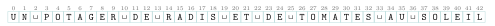

# Activités préparatoires

Recherche textuelle

## Activité 1 Chercher un mot, à la main

Durée : 15 à 20 min · Par deux

!!! consignes "Consignes"

    - L’un déplace la bande, l’autre compte. Sans ordinateur.

    - Découper la bande `SOLEIL` placée sous le texte (ou la recopier sur une bande de papier, avec des cases de même taille) : c’est la **fenêtre** que l’on fait glisser sur le texte, case par case.

    - Les réponses s’écrivent sur le cahier. Une **comparaison**, c’est regarder une case de la bande et la case du texte juste en dessous (pareil ou pas ?). Les espaces (␣) sont des caractères comme les autres.  Travail **sans IA** : ni assistant, ni complétion de code ; vous devez pouvoir expliquer chaque réponse.

## Le texte et le motif

On cherche le motif `SOLEIL` ($6$ lettres) dans le texte ci-dessous ($43$ caractères, positions numérotées à partir de $0$).

{ .tikz .tikz-inline loading=lazy }

*Bande à découper :* { .tikz .tikz-inline loading=lazy } { .tikz .tikz-inline loading=lazy }

## Première méthode : glisser d’une case à la fois

Poser la bande sous le texte, à la position $0$. Comparer les cases **de gauche à droite** ; dès qu’une case diffère, arrêter et faire glisser la bande d’**une seule** case vers la droite. Recommencer jusqu’à trouver `SOLEIL`.

1.  Faire la recherche en comptant les comparaisons (un bâton par comparaison, sur le cahier). Combien de positions a-t-on essayées ? Combien de comparaisons en tout ?

2.  À quelle position trouve-t-on `SOLEIL` ? Pour la plupart des positions, combien de comparaisons a-t-il fallu ?

3.  Si le texte était un livre d’un million de caractères, combien de positions faudrait-il essayer, à peu près ?

## Deuxième méthode : regarder d’abord la fin

On recommence à la position $0$, mais on compare maintenant en commençant par la **dernière** case de la bande.

1.  À la position $0$, quelle lettre du texte se trouve sous la dernière case de la bande ? Apparaît-elle quelque part dans `SOLEIL` ?

2.  Si l’on décale la bande de $1$, $2$, … ou $5$ cases, cette lettre sera encore sous la bande. Une de ces positions peut-elle donner `SOLEIL` ? De combien de cases peut-on donc faire sauter la bande d’un coup ?

3.  Plus loin, la lettre sous la dernière case est un `I`, qui *existe* dans `SOLEIL`. De combien faut-il avancer la bande pour que ce `I` se retrouve sous le `I` de la bande ?

4.  Refaire toute la recherche avec cette règle : on regarde la lettre sous la dernière case ; si elle n’est pas dans le motif, on saute toute la bande ; sinon, on avance pour l’aligner avec la même lettre de la bande (la plus à droite, sans compter la dernière case). Recopier sur le cahier le tableau ci-dessous et le compléter, une ligne par position essayée.

    | **Position** | **Lettre sous la dernière case** | **Comparaisons** | **Saut** |
    |:------------:|:--------------------------------:|:----------------:|:--------:|
    |     $0$      |                …                 |        …         |    …     |
    |      …       |                …                 |        …         |    …     |

    Combien de positions a-t-on essayées ? Combien de comparaisons en tout ?

## Ce qu’on a découvert

1.  Comparer le nombre de comparaisons des deux méthodes. Pourquoi la deuxième a-t-elle pu ne **jamais lire** certaines lettres du texte ?

2.  Pour aller vite, il est utile de préparer **avant** la recherche, pour chaque lettre, le saut à faire. Recopier et compléter sur le cahier ce « pense-bête » pour `SOLEIL` :

    | Lettre sous la dernière case | `S` | `O` | `L` | `E` | `I` | toute autre lettre |
    |:----------------------------:|:----|:----|:----|:----|:----|:------------------:|
    |             Saut             |     |     |     |     |     |                    |

??? corrige "Corrigé de l'activité"

    1.  On essaie les positions $0$ à $37$, soit $\mathbf{38}$ positions, pour un total de $\mathbf{45}$ comparaisons.

    2.  `SOLEIL` est à la position $\mathbf{37}$. Presque toutes les positions coûtent **une seule** comparaison (la première lettre diffère déjà) ; seules les positions $18$ et $32$ (un `S` suivi d’un espace) en coûtent $2$, et la position $37$ en coûte $6$.

    3.  Environ **un million** de positions ($n - m + 1$) : on essaie toutes les positions, une par une. Si de plus chaque position coûtait plusieurs comparaisons, on atteindrait jusqu’à $n\times m$ comparaisons.

    4.  Sous la dernière case (position $5$ du texte) se trouve un `T`, qui **n’apparaît pas** dans `SOLEIL`.

    5.  Non : tant que la bande recouvre ce `T`, une de ses cases devrait contenir `T`, ce qui est impossible. On peut donc faire sauter la bande de **toute sa longueur**, $\mathbf{6}$ cases, juste après le `T`.

    6.  À la position $12$, la dernière case est sur le `I` (position $17$ du texte). Dans la bande, `I` est l’avant-dernière case : on avance de $\mathbf{1}$ case pour les aligner.

    7.  Déroulé complet :

        | **Position** | **Lettre sous la dernière case** | **Comparaisons** |  **Saut**  |
        |:------------:|:--------------------------------:|:----------------:|:----------:|
        |     $0$      |               `T`                |       $1$        |    $6$     |
        |     $6$      |               `D`                |       $1$        |    $6$     |
        |     $12$     |               `I`                |       $1$        |    $1$     |
        |     $13$     |               `S`                |       $1$        |    $5$     |
        |     $18$     |               `D`                |       $1$        |    $6$     |
        |     $24$     |               `A`                |       $1$        |    $6$     |
        |     $30$     |               `U`                |       $1$        |    $6$     |
        |     $36$     |               `I`                |       $1$        |    $1$     |
        |     $37$     |               `L`                |       $6$        | **trouvé** |

        $\mathbf{9}$ positions essayées et $\mathbf{14}$ comparaisons. À la position $13$, le `S` est dans la bande (première case) : on avance de $5$ pour l’aligner.

    8.  $14$ comparaisons au lieu de $45$, plus de trois fois moins. Quand la lettre sous la dernière case n’est pas dans le motif, aucune position recouvrant cette lettre ne peut convenir : les lettres sautées **n’ont jamais besoin d’être lues**. Plus le motif est long, plus les sauts sont grands.

    9.  Pense-bête : `S`$\to 5$, `O`$\to 4$, `L`$\to 3$, `E`$\to 2$, `I`$\to 1$, toute autre lettre $\to 6$. Pour `L`, on ne compte pas la dernière case : c’est le `L` en troisième position qui compte (saut $3$). C’est exactement la **table de décalage** de Horspool, calculée une fois pour toutes avant la recherche (le **prétraitement** du motif).
