# Exercices

Réseaux

Usage de l’IA, indiqué sur chaque exercice :  aucune ;  en appui (déboguer, reformuler, vérifier ; la réponse finale est écrite et comprise par vous) ;  l’exercice s’appuie sur une réponse d’IA. Voir la [charte d’usage de l’IA](../charte.md).

!!! consignes "Mode d’emploi"

    Niveau : ★ échauffement, ★★ classique (niveau bac), ★★★ défi ; les *coups de pouce* et les *corrigés* se déplient sous chaque exercice. On soigne les **tables de routage** (destination, sortie, métrique). Rappels : RIP $=$ nombre de sauts ; OSPF $=$ somme des coûts, coût $=10^8/$débit.

### Machines, switchs, routeurs

### ★ Exercice 1 — Qui fait quoi ?  { #ex-09-1 }

1.  Quelle est la différence entre un **switch** et un **routeur** ?

2.  Deux machines du *même* réseau local doivent-elles passer par un routeur pour communiquer ?

3.  Qu’est-ce qu’une **interface** d’un routeur ? Pourquoi un routeur en a-t-il plusieurs ?

4.  Compléter : « Internet est l’interconnexion de … par des … ».

??? corrige "Corrigé"

    **1.** Le **switch** relie les machines *à l’intérieur* d’un même réseau local ; le **routeur** relie *plusieurs* réseaux locaux entre eux. **2.** Non : dans le même réseau local, elles communiquent directement via le switch. **3.** Une interface est une carte réseau (un point de raccordement) ; un routeur en a plusieurs car il est branché sur plusieurs réseaux à la fois. **4.** « … de **réseaux (locaux)** par des **routeurs** ».

### Adressage IP

### ★ Exercice 2 — Lire une adresse IP  { #ex-09-2 }

On considère la machine d’adresse `192.168.1.37/24`.

1.  Combien d’octets, et donc de bits, compte une adresse IPv4 ?

2.  Écrire cette adresse en binaire (un groupe de $8$ bits par octet).

3.  Que signifie `/24` ? Quelle partie de l’adresse désigne le réseau, laquelle désigne la machine ?

4.  Pourquoi l’écriture `192.168.1.300` ne peut-elle pas être une adresse IPv4 ?

??? corrige "Corrigé"

    **1.** $4$ octets, soit $4 \times 8 = \textbf{32}$ bits.  
    **2.** $192 = 128 + 64$, $168 = 128 + 32 + 8$, $1$, $37 = 32 + 4 + 1$ : `11000000.10101000.00000001.00100101`.  
    **3.** `/24` : les $24$ premiers bits (les trois premiers octets) forment la partie **réseau**, `192.168.1` ; les $8$ derniers bits forment la partie **machine**, ici $37$.  
    **4.** Chaque nombre est un octet ($8$ bits), donc compris entre $0$ et $2^8 - 1 = 255$ : $300$ ne tient pas sur un octet.

### ★★ Exercice 3 — Même réseau ou pas ?  { #ex-09-3 }

*Rappels :* avec un masque `/n`, les `n` premiers bits donnent la partie « réseau ». L’adresse dont tous les bits d’hôte valent $0$ est l’**adresse du réseau** ; celle dont ils valent tous $1$ est l’**adresse de diffusion** (*broadcast*).

1.  Les machines `192.168.16.12/24` et `192.168.16.240/24` sont-elles dans le même réseau local ? Et `192.168.16.12/24` et `192.168.17.3/24` ?

2.  Pour le réseau de la machine `192.168.16.12/24`, donner : l’adresse du réseau, l’adresse de diffusion, et le nombre maximal de machines connectables.

3.  Même question (adresse réseau et nombre de machines) pour `172.16.5.3/16`.

    ??? pouce "Coup de pouce"

        Avec un masque `/24`, comparer les trois premiers octets ; avec `/16`, les deux premiers. Pour le nombre de machines, compter les bits d’hôte et ne pas oublier les deux adresses réservées.

??? corrige "Corrigé"

    **1.** `192.168.16.12` et `192.168.16.240` (masque `/24`) : mêmes 24 premiers bits (`192.168.16`) $\Rightarrow$ **même** réseau. `192.168.16.12` et `192.168.17.3` : le 3e octet diffère ($16 \neq 17$) $\Rightarrow$ réseaux **différents** (il faut un routeur).  
    **2.** Réseau de `192.168.16.12/24` : adresse du réseau `192.168.16.0`, diffusion `192.168.16.255`. Nombre de machines : $2^{8} - 2 = \textbf{254}$ (8 bits d’hôte, moins l’adresse réseau et l’adresse de diffusion).  
    **3.** `172.16.5.3/16` : adresse réseau `172.16.0.0` ; hôtes sur $32-16=16$ bits $\Rightarrow 2^{16}-2 = \textbf{65\,534}$ machines.

### ★★ Exercice 4 — Dimensionner les réseaux d’une entreprise  { #ex-09-4 }

L’entreprise **CaféNet** raccorde plusieurs sites. Pour chacun, on veut choisir le masque `/n` donnant le **plus petit réseau** qui contient *toutes* ses machines, afin de **gaspiller le moins d’adresses possible** (rappel : un réseau `/n` accueille $2^{\,32-n}-2$ machines). Voici les besoins :

| Site                        | Nombre de machines |
|:----------------------------|:------------------:|
| Siège                       |        100         |
| Agence Nord                 |         50         |
| Agence Sud                  |         20         |
| Boutique                    |         10         |
| Liaison entre deux routeurs |         2          |

1.  Pour chaque site, donner le masque `/n` le plus adapté et le nombre d’adresses de machines alors disponibles.

2.  Pour la liaison entre deux routeurs, on choisit un `/30`. Combien d’adresses de machines offre-t-il ? Pourquoi est-ce exactement ce qu’il faut ?

3.  Si l’on attribuait paresseusement un `/24` à *chaque* site, combien d’adresses de machines seraient inutilisées au Siège ? à la Boutique ? Que penser de ce choix ?

    ??? pouce "Coup de pouce"

        Pour chaque site, chercher la plus petite puissance de $2$ qui, diminuée de $2$, atteint le nombre de machines : $2^4-2=14$, $2^5-2=30$, $2^6-2=62$, $2^7-2=126$. Le nombre de bits d’hôte donne alors $n$.

??? corrige "Corrigé"

    **1.** On prend le plus petit `/n` tel que $2^{\,32-n}-2 \geq$ nombre de machines :

    | Site        | Machines | Masque | Adresses dispo. |
    |:------------|:--------:|:------:|:---------------:|
    | Siège       |   100    | `/25`  |  $2^7-2 = 126$  |
    | Agence Nord |    50    | `/26`  |  $2^6-2 = 62$   |
    | Agence Sud  |    20    | `/27`  |  $2^5-2 = 30$   |
    | Boutique    |    10    | `/28`  |  $2^4-2 = 14$   |
    | Liaison     |    2     | `/30`  |   $2^2-2 = 2$   |

    **2.** Un `/30` offre $2^{2}-2 = \textbf{2}$ adresses de machines : exactement les **deux interfaces** des deux routeurs reliés, sans aucune adresse gaspillée.  
    **3.** Un `/24` offre $254$ machines. Au Siège, $254-100 = \textbf{154}$ adresses inutilisées ; à la Boutique, $254-10 = \textbf{244}$ inutilisées. C’est un **énorme gaspillage** : CIDR permet justement d’ajuster `/n` à chaque site.

### Le modèle en couches

### ★★ Exercice 5 — Des enveloppes emboîtées  { #ex-09-5 }

Depuis son ordinateur portable relié en Wi-Fi, Léa ouvre une page web : son navigateur envoie une requête **HTTP** à un serveur situé à l’autre bout d’Internet. Le paquet traverse **trois routeurs** avant d’arriver.

1.  Ranger les quatre couches du modèle TCP/IP de la plus **haute** à la plus **basse** : Lien, Application, Réseau, Transport. Associer à chacune l’un des protocoles HTTP, TCP, IP, Wi-Fi.

2.  Qu’est-ce que l’**encapsulation** ? Dessiner le bloc qui quitte l’ordinateur de Léa : la requête HTTP et les trois en-têtes ajoutés, dans l’ordre où ils apparaissent de gauche à droite.

3.  Chaque routeur doit choisir par où renvoyer le paquet. Quel en-tête lit-il pour cela, et quelle information y trouve-t-il ? A-t-il besoin de lire la requête HTTP ?

4.  D’un routeur à l’autre, le paquet change de support (Wi-Fi, puis câbles Ethernet, puis fibre). Quel en-tête est remplacé à chaque lien ? Lequel reste le même du début à la fin du trajet ?

5.  À l’arrivée sur le serveur, dans quel ordre les en-têtes sont-ils retirés ? À quel programme la requête est-elle finalement remise ?

6.  Léa quitte le Wi-Fi et passe en 4G pendant le chargement. Pourquoi son navigateur n’a-t-il pas besoin d’être modifié ? En déduire l’intérêt du découpage en couches.

    ??? pouce "Coup de pouce"

        Question 2 : en descendant, chaque couche ajoute son en-tête **à gauche** de ce qu’elle reçoit (schéma du cours). Questions 3 et 4 : un routeur travaille à la couche **Réseau** ; ce qui change d’un lien à l’autre, c’est le support physique.

??? corrige "Corrigé"

    **1.** De haut en bas : **Application** (HTTP), **Transport** (TCP), **Réseau** (IP), **Lien** (Wi-Fi).  
    **2.** En descendant les couches, chacune ajoute **son en-tête** devant ce qu’elle reçoit de la couche du dessus, comme des enveloppes glissées les unes dans les autres : c’est l’**encapsulation**. Bloc émis, de gauche à droite :

    en-tête Wi-Fien-tête IPen-tête TCP**requête HTTP**

    **3.** Il lit l’**en-tête IP**, qui contient l’**adresse IP de destination** (et celle de la source) ; il consulte sa table de routage avec cette adresse. Il n’a **pas** besoin de la requête HTTP : il ne remonte pas au-delà de la couche Réseau.  
    **4.** L’en-tête de la couche **Lien** est retiré puis refait à chaque lien (Wi-Fi, puis Ethernet…) : chaque routeur « ouvre » cette enveloppe et en met une nouvelle adaptée au support suivant. L’en-tête **IP** (adresses source et destination) reste le même de bout en bout.  
    **5.** Dans l’ordre inverse de l’émission : en-tête Lien, puis IP, puis TCP. La requête HTTP est remise à l’application concernée : le **serveur web**.  
    **6.** Seule la couche **Lien** change (Wi-Fi $\to$ 4G) ; le navigateur (couche Application) ne s’adresse qu’à la couche Transport et ignore le support physique. Chaque couche ne dépend que de la couche voisine : on peut en remplacer une sans toucher aux autres. C’est ce qui permet à des réseaux très différents de former un seul Internet.

### Tables de routage

### ★ Exercice 6 — Lire une table  { #ex-09-6 }

Un routeur A a la table de routage suivante :

| Réseau | Sortir par | Métrique |
|:------:|:----------:|:--------:|
|   R1   |    eth0    |    0     |
|   R3   |    eth2    |    0     |
|   R2   | routeur G  |    1     |

1.  Quels réseaux sont *directement* reliés à A ? Comment le voit-on ?

2.  Un paquet arrive en A, destiné au réseau R2 : que fait A ?

3.  Que signifie une métrique de $0$ ?

??? corrige "Corrigé"

    **1.** R1 et R3 (métrique $0$, atteints par une interface propre, eth0 et eth2). **2.** A transmet le paquet au **routeur G** (qui saura continuer). **3.** Métrique $0$ $=$ réseau **directement raccordé** au routeur.

### Le protocole RIP

### ★★ Exercice 7 — Construire une table RIP  { #ex-09-7 }

On considère le réseau ci-dessous (les nombres sont les débits en Mbps ; on les **ignore** pour RIP). Chaque routeur dessert son propre réseau local.

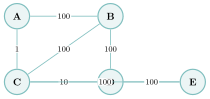{ .tikz .tikz-inline loading=lazy }

1.  Donner, pour le routeur **A**, le nombre de sauts vers chacun des routeurs B, C, D, E (métrique RIP).

2.  En déduire la table de routage RIP de A (colonnes : réseau visé, on sort *vers* quel voisin, nombre de sauts).

3.  Pourquoi RIP est-il limité à $15$ sauts, et pourquoi ses messages périodiques posent-ils problème sur un grand réseau ?

    ??? pouce "Coup de pouce"

        Ne regarder que les liaisons, pas les débits : pour chaque destination, chercher le chemin qui traverse le moins de liaisons, puis noter le *premier* voisin de ce chemin.

??? corrige "Corrigé"

    **1.** Nombre de sauts depuis A : B $\to 1$ ; C $\to 1$ ; D $\to 2$ (A–B–D) ; E $\to 2$ (A–C–E).  
    **2.** Table de routage RIP de A :

    |   Réseau    | Sortir vers | Sauts |
    |:-----------:|:-----------:|:-----:|
    | réseau de B |      B      |   1   |
    | réseau de C |      C      |   1   |
    | réseau de D |      B      |   2   |
    | réseau de E |      C      |   2   |

    **3.** La métrique est plafonnée à $15$ (au-delà, réseau réputé inaccessible) ; et l’envoi périodique (toutes les 30 s) de toute la table à tous les voisins **sature** un grand réseau.

### Le protocole OSPF

### ★ Exercice 8 — Du débit au coût  { #ex-09-8 }

En OSPF, le coût d’une liaison vaut $10^8/\text{débit}$, le débit étant exprimé en bit/s ($1$ Mbit/s $= 10^6$ bit/s, $1$ Gbit/s $= 10^9$ bit/s).

1.  Calculer le coût d’une liaison à $1$ Gbit/s, à $50$ Mbit/s et à $20$ Mbit/s.

2.  Classer ces trois liaisons de la plus intéressante à la moins intéressante pour OSPF.

3.  Un chemin emprunte une liaison à $1$ Gbit/s puis deux liaisons à $50$ Mbit/s. Quel est son coût total ?

??? corrige "Corrigé"

    **1.** $1$ Gbit/s : $10^8/10^9 = \textbf{0,1}$ ; \; $50$ Mbit/s : $10^8/(5 \times 10^7) = \textbf{2}$ ; \; $20$ Mbit/s : $10^8/(2 \times 10^7) = \textbf{5}$.  
    **2.** OSPF préfère le coût le plus **petit** : $1$ Gbit/s (coût $0{,}1$), puis $50$ Mbit/s (coût $2$), puis $20$ Mbit/s (coût $5$).  
    **3.** $0{,}1 + 2 + 2 = \textbf{4,1}$.

### ★★ Exercice 9 — Coûts, table OSPF, et duel avec RIP  { #ex-09-9 }

On reprend **le même réseau**, mais cette fois les nombres sont les **débits** qui servent à calculer les coûts OSPF ($\text{coût}=10^8/\text{débit}$).

1.  Calculer le coût de chaque type de liaison : $100$ Mbps, $10$ Mbps, $1$ Mbps.

2.  Donner la table de routage **OSPF** de A (réseau visé, sortie, coût total).

3.  **Comparer** avec la table RIP de A : pour quelles destinations les deux protocoles *ne choisissent-ils pas la même route* ? Expliquer pourquoi.

    ??? pouce "Coup de pouce"

        Écrire d’abord le coût de chaque liaison sur le schéma. Pour chaque destination, comparer les coûts totaux de plusieurs chemins possibles ; pour la question 3, regarder de près le lien A–C.

??? corrige "Corrigé"

    **1.** Coûts $=10^8/\text{débit}$ : $100$ Mbps $\to 1$ ; \; $10$ Mbps $\to 10$ ; \; $1$ Mbps $\to 100$.  
    **2.** Table OSPF de A (le lien A–C coûte $100$, on l’évite) :

    |   Réseau    | Sortir vers |          Coût          |
    |:-----------:|:-----------:|:----------------------:|
    | réseau de B |      B      |        1 (A–B)         |
    | réseau de C |      B      |       2 (A–B–C)        |
    | réseau de D |      B      |       2 (A–B–D)        |
    | réseau de E |      B      | 3 (A–B–C–E ou A–B–D–E) |

    **3.** Les deux protocoles **divergent** pour C et E : RIP prend le lien **direct** A–C ($1$ saut) et A–C–E ($2$ sauts) ; OSPF passe par B (A–B–C, A–B–C–E). En effet A–C n’a qu’un débit de $1$ Mbps (coût $100$) : RIP ne « voit » pas cette lenteur, OSPF si.

### ★★★ Exercice 10 — Dijkstra derrière OSPF au-delà du programme  { #ex-09-10 }

*Cet exercice va **au-delà du programme officiel** : au bac, les tables de routage sont données, ou se lisent sur un petit réseau. Il sert à comprendre ce que fait vraiment un routeur OSPF.*

Voici un réseau de six routeurs ; les nombres sont les **débits** des liaisons, en Mbit/s. On rappelle : $\text{coût}=10^8/\text{débit}$ (débit en bit/s).

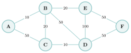{ .tikz loading=lazy }

1.  Calculer le coût OSPF de chaque liaison et le reporter sur un schéma.

2.  Dérouler l’algorithme de Dijkstra au départ de `A` : recopier et compléter un tableau (une ligne par sommet fixé ; colonnes `A` à `F` ; distance provisoire et prédécesseur ; $\infty$ $=$ pas encore atteint).

    ??? pouce "Coup de pouce"

        Reprendre le principe rappelé dans le cours : à chaque tour, fixer le sommet non traité de plus petite distance provisoire, puis relâcher ses liaisons (`si distance[u] + coût(u,v) < distance[v]`…).

3.  En déduire la table de routage OSPF de `A` (réseau visé, sortir vers, coût total).

    ??? pouce "Coup de pouce"

        La colonne « sortir vers » est le **premier** routeur du chemin : remonter les prédécesseurs depuis la destination jusqu’à `A`.

4.  Par quelle route RIP enverrait-il un paquet de `A` vers le réseau de `B` ? Et OSPF ? Expliquer.

5.  La liaison `A`–`C` tombe en panne. Dérouler à nouveau Dijkstra depuis `A` et donner la nouvelle table OSPF de `A`.

6.  ▶  Vérifier vos tableaux avec la fonction `dijkstra` écrite dans le projet proposé en fin de chapitre *Graphes*.

??? corrige "Corrigé"

    **1.** $10$ Mbit/s $\to 10$ ; \; $20$ Mbit/s $\to 5$ ; \; $50$ Mbit/s $\to 2$ ; \; $100$ Mbit/s $\to 1$. Soit : A–B $10$, A–C $2$, B–C $5$, B–D $2$, C–D $10$, B–E $5$, D–E $1$, D–F $2$, E–F $2$.

    **2.** Entre parenthèses, le prédécesseur ; $\ast$ $=$ sommet fixé.

    | **Fixé** |   `A`    |   `B`    |   `C`    |   `D`    |    `E`    |    `F`    |
    |:--------:|:--------:|:--------:|:--------:|:--------:|:---------:|:---------:|
    |    —     |   $0$    | $\infty$ | $\infty$ | $\infty$ | $\infty$  | $\infty$  |
    |   `A`    | $0^\ast$ | $10$ (A) | $2$ (A)  | $\infty$ | $\infty$  | $\infty$  |
    |   `C`    |          | $7$ (C)  | $2^\ast$ | $12$ (C) | $\infty$  | $\infty$  |
    |   `B`    |          | $7^\ast$ |          | $9$ (B)  | $12$ (B)  | $\infty$  |
    |   `D`    |          |          |          | $9^\ast$ | $10$ (D)  | $11$ (D)  |
    |   `E`    |          |          |          |          | $10^\ast$ | $11$ (D)  |
    |   `F`    |          |          |          |          |           | $11^\ast$ |

    Deux relâchements sont décisifs : en fixant `C`, la distance de `B` tombe de $10$ (lien direct, lent) à $7$ ; en fixant `B`, celle de `D` tombe de $12$ à $9$.

    **3.** En remontant les prédécesseurs (par exemple F $\leftarrow$ D $\leftarrow$ B $\leftarrow$ C $\leftarrow$ A), toutes les routes partent vers **C** :

    |   Réseau    | Sortir vers |      Coût      |
    |:-----------:|:-----------:|:--------------:|
    | réseau de B |      C      |   7 (A–C–B)    |
    | réseau de C |      C      |    2 (A–C)     |
    | réseau de D |      C      |  9 (A–C–B–D)   |
    | réseau de E |      C      | 10 (A–C–B–D–E) |
    | réseau de F |      C      | 11 (A–C–B–D–F) |

    **4.** RIP prend le lien **direct** A–B ($1$ saut). OSPF passe par C (A–C–B, coût $2+5=7$), car le lien direct A–B, à $10$ Mbit/s seulement, coûte $10$ : deux sauts rapides valent mieux qu’un saut lent.

    **5.** Sans A–C : on fixe A ($0$) ; B ($10$, par A) ; D ($12$, par B) ; E ($13$, par D) ; F ($14$, par D) ; C ($15$, par B : $10+5$, mieux que $12+10$ par D). Nouvelle table : tout sort vers **B**, avec les coûts B $10$, C $15$ (A–B–C), D $12$ (A–B–D), E $13$ (A–B–D–E), F $14$ (A–B–D–F). C’est la force d’OSPF : dès qu’une panne est annoncée, chaque routeur recalcule seul ses routes.

    **6.** Avec le graphe saisi sous la forme `{’A’: [(’B’, 10), (’C’, 2)], ’B’: [(’A’, 10), (’C’, 5), (’D’, 2), (’E’, 5)], …}`, l’appel `dijkstra(G, ’A’)` du projet renvoie les distances `{’A’: 0, ’B’: 7, ’C’: 2, ’D’: 9, ’E’: 10, ’F’: 11}` et les prédécesseurs correspondants.

### Exercices type bac

### ★★★ Exercice 11 — Réseau d’un établissement *(d’après La Réunion 2023, jour 2)*  { #ex-09-11 }

Un ensemble scolaire « Établissement » regroupe plusieurs sites (l’Administration, l’école primaire, le collège, le lycée général, le lycée professionnel). Les postes de chaque site sont reliés entre eux par des commutateurs (switchs), eux-mêmes reliés à des routeurs. R1, R2, R3, R4, R5 et R6 sont les routeurs de l’établissement ; la figure 1 montre leurs liaisons et le routeur qui dessert trois des secteurs.

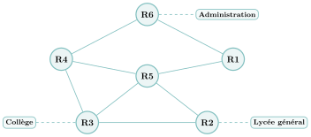{ .tikz loading=lazy }  
Figure 1 : les routeurs de l’établissement (en pointillés : le routeur qui dessert un secteur)

**Rappels.** Une adresse IPv4 est composée de $4$ octets, soit $32$ bits, notée `A.B.C.D`. La notation `A.B.C.D/n` signifie que les $n$ premiers bits de l’adresse représentent la partie « réseau », les bits suivants la partie « hôte » ; les $n$ premiers bits du masque valent donc $1$, les autres $0$. L’adresse dont tous les bits de la partie hôte sont à $0$ est l’*adresse du réseau* ; celle dont tous les bits de la partie hôte sont à $1$ est l’*adresse de diffusion*.

1.  Le poste PC LG 03 de la salle informatique du Lycée général a pour adresse IPv4 `192.168.162.4`. Recopier et compléter son écriture binaire : `11000000.10101000.xxxxxxxx.xxxxxxxx`.

2.  Le poste PC Admin 02 du secteur « Administration » a pour adresse IPv4 `192.168.16.12/24`.

    1.  Donner l’adresse du réseau local dédié au secteur « Administration » et son masque de sous-réseau.

    2.  Donner l’adresse de diffusion (*broadcast*) de ce réseau.

    3.  Donner le nombre maximal de machines que l’on peut connecter sur ce réseau.

3.  L’administrateur s’intéresse à la transmission de paquets du secteur « Administration » vers le secteur « Collège », donc aux chemins entre les routeurs R6 et R3. Le protocole **RIP** construit les tables de routage en indiquant, pour chaque routeur, la distance en nombre de sauts qui le sépare d’un autre routeur.

    1.  On donne ci-dessous les tables de routage des routeurs R1, R2, R3 et R4 obtenues par ce protocole. Donner les tables de routage des routeurs R5 et R6.

        <table>
        <tbody>
        <tr>
        <td style="text-align: center;"><strong>Table de R1</strong></td>
        <td style="text-align: center;"><strong>Table de R2</strong></td>
        <td style="text-align: center;"><strong>Table de R3</strong></td>
        <td style="text-align: center;"><strong>Table de R4</strong></td>
        </tr>
        <tr>
        <td style="text-align: center;"><table>
        <thead>
        <tr>
        <th style="text-align: center;">Dest.</th>
        <th style="text-align: center;">passe par</th>
        <th style="text-align: center;">Dist.</th>
        </tr>
        </thead>
        <tbody>
        <tr>
        <td style="text-align: center;">R2</td>
        <td style="text-align: center;">R5</td>
        <td style="text-align: center;">2</td>
        </tr>
        <tr>
        <td style="text-align: center;">R3</td>
        <td style="text-align: center;">R5</td>
        <td style="text-align: center;">2</td>
        </tr>
        <tr>
        <td style="text-align: center;">R4</td>
        <td style="text-align: center;">R6</td>
        <td style="text-align: center;">2</td>
        </tr>
        <tr>
        <td style="text-align: center;">R5</td>
        <td style="text-align: center;">R5</td>
        <td style="text-align: center;">1</td>
        </tr>
        <tr>
        <td style="text-align: center;">R6</td>
        <td style="text-align: center;">R6</td>
        <td style="text-align: center;">1</td>
        </tr>
        </tbody>
        </table></td>
        <td style="text-align: center;"><table>
        <thead>
        <tr>
        <th style="text-align: center;">Dest.</th>
        <th style="text-align: center;">passe par</th>
        <th style="text-align: center;">Dist.</th>
        </tr>
        </thead>
        <tbody>
        <tr>
        <td style="text-align: center;">R1</td>
        <td style="text-align: center;">R5</td>
        <td style="text-align: center;">2</td>
        </tr>
        <tr>
        <td style="text-align: center;">R3</td>
        <td style="text-align: center;">R3</td>
        <td style="text-align: center;">1</td>
        </tr>
        <tr>
        <td style="text-align: center;">R4</td>
        <td style="text-align: center;">R3</td>
        <td style="text-align: center;">2</td>
        </tr>
        <tr>
        <td style="text-align: center;">R5</td>
        <td style="text-align: center;">R5</td>
        <td style="text-align: center;">1</td>
        </tr>
        <tr>
        <td style="text-align: center;">R6</td>
        <td style="text-align: center;">R5</td>
        <td style="text-align: center;">3</td>
        </tr>
        </tbody>
        </table></td>
        <td style="text-align: center;"><table>
        <thead>
        <tr>
        <th style="text-align: center;">Dest.</th>
        <th style="text-align: center;">passe par</th>
        <th style="text-align: center;">Dist.</th>
        </tr>
        </thead>
        <tbody>
        <tr>
        <td style="text-align: center;">R1</td>
        <td style="text-align: center;">R5</td>
        <td style="text-align: center;">2</td>
        </tr>
        <tr>
        <td style="text-align: center;">R2</td>
        <td style="text-align: center;">R2</td>
        <td style="text-align: center;">1</td>
        </tr>
        <tr>
        <td style="text-align: center;">R4</td>
        <td style="text-align: center;">R4</td>
        <td style="text-align: center;">1</td>
        </tr>
        <tr>
        <td style="text-align: center;">R5</td>
        <td style="text-align: center;">R5</td>
        <td style="text-align: center;">1</td>
        </tr>
        <tr>
        <td style="text-align: center;">R6</td>
        <td style="text-align: center;">R4</td>
        <td style="text-align: center;">2</td>
        </tr>
        </tbody>
        </table></td>
        <td style="text-align: center;"><table>
        <thead>
        <tr>
        <th style="text-align: center;">Dest.</th>
        <th style="text-align: center;">passe par</th>
        <th style="text-align: center;">Dist.</th>
        </tr>
        </thead>
        <tbody>
        <tr>
        <td style="text-align: center;">R1</td>
        <td style="text-align: center;">R6</td>
        <td style="text-align: center;">2</td>
        </tr>
        <tr>
        <td style="text-align: center;">R2</td>
        <td style="text-align: center;">R3</td>
        <td style="text-align: center;">2</td>
        </tr>
        <tr>
        <td style="text-align: center;">R3</td>
        <td style="text-align: center;">R3</td>
        <td style="text-align: center;">1</td>
        </tr>
        <tr>
        <td style="text-align: center;">R5</td>
        <td style="text-align: center;">R5</td>
        <td style="text-align: center;">1</td>
        </tr>
        <tr>
        <td style="text-align: center;">R6</td>
        <td style="text-align: center;">R6</td>
        <td style="text-align: center;">1</td>
        </tr>
        </tbody>
        </table></td>
        </tr>
        </tbody>
        </table>

    2.  On souhaite transmettre un paquet de données depuis le poste PC Admin 01 vers le poste PC CLG 01. Déterminer le parcours emprunté par ce paquet, en utilisant les tables de routage.

    3.  À la suite d’une panne, le routeur R4 est déconnecté. Déterminer alors une nouvelle route pouvant être empruntée par les données du secteur « Administration » vers le Collège en effectuant le moins de sauts possible.

4.  Le routeur R4 est réparé et reconnecté au réseau. On applique désormais le protocole **OSPF**, qui attribue un coût à chaque liaison afin de privilégier les routes plus rapides. Le coût d’une liaison est $\text{coût} = \dfrac{10^{8}}{d}$, où $d$ est le débit en bit/s.

    1.  Recopier et compléter le tableau suivant :

        |  **Liaison**  | **Débit** (bit/s) | **Coût** |
        |:-------------:|:-----------------:|:--------:|
        |   Ethernet    |                   |   $10$   |
        | Fast-Ethernet |     $10^{8}$      |          |
        |     Fibre     |     $10^{9}$      |          |

    2.  Recopier le schéma ci-dessous et indiquer le coût de chacune des liaisons connues.

        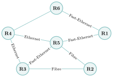{ .tikz loading=lazy }  
        Figure 2 : types des liaisons entre les routeurs

    3.  On sait que le parcours R6 – R4 – R5 – R2 a un coût de $11{,}1$. Déterminer le type de liaison entre R6 et R4.

    4.  On souhaite acheminer un paquet de données du secteur « Administration » vers le réseau du Lycée général en utilisant le protocole OSPF. Déterminer la route empruntée par un paquet allant du poste PC Admin 01 vers le poste PC LG 01.

        ??? pouce "Coup de pouce"

            Question 1 : convertir chaque octet en somme de puissances de $2$. Question 3 : pour R5 et R6, compter les sauts sur la figure 1 en s’inspirant des tables données. Question 4 : le coût d’Ethernet donne son débit ; pour la liaison R6–R4, retrancher du coût total les coûts des liaisons déjà connues.

        ??? pouce "Coup de pouce 2 (début de solution)"

            Question 4 (c) : écrire $11{,}1 = \text{coût}(\text{R6--R4}) + \text{coût}(\text{R4--R5}) + \text{coût}(\text{R5--R2})$, lire les deux derniers coûts sur le schéma complété, puis retrouver le type de liaison dans le tableau.

??? corrige "Corrigé"

    **1.** $162 = 128+32+2 = \texttt{10100010}$ et $4 = \texttt{00000100}$ : `11000000.10101000.10100010.00000100`.  
    **2.** (a) Avec `/24`, les trois premiers octets forment la partie réseau : adresse du réseau `192.168.16.0`, masque `255.255.255.0`.  
    (b) Adresse de diffusion (tous les bits d’hôte à $1$) : `192.168.16.255`.  
    (c) $8$ bits d’hôte : $2^{8} - 2 = \textbf{254}$ machines (on retire l’adresse du réseau et l’adresse de diffusion).

    **3.** (a) Les lignes de distance $1$ des tables donnent les liaisons directes : R1–R5, R1–R6, R2–R3, R2–R5, R3–R4, R3–R5, R4–R5, R4–R6 (c’est bien le réseau de la figure 1). On en déduit :

    <table>
    <tbody>
    <tr>
    <td style="text-align: center;"><strong>Table de R5</strong></td>
    <td style="text-align: center;"><strong>Table de R6</strong></td>
    </tr>
    <tr>
    <td style="text-align: center;"><table>
    <thead>
    <tr>
    <th style="text-align: center;">Dest.</th>
    <th style="text-align: center;">passe par</th>
    <th style="text-align: center;">Dist.</th>
    </tr>
    </thead>
    <tbody>
    <tr>
    <td style="text-align: center;">R1</td>
    <td style="text-align: center;">R1</td>
    <td style="text-align: center;">1</td>
    </tr>
    <tr>
    <td style="text-align: center;">R2</td>
    <td style="text-align: center;">R2</td>
    <td style="text-align: center;">1</td>
    </tr>
    <tr>
    <td style="text-align: center;">R3</td>
    <td style="text-align: center;">R3</td>
    <td style="text-align: center;">1</td>
    </tr>
    <tr>
    <td style="text-align: center;">R4</td>
    <td style="text-align: center;">R4</td>
    <td style="text-align: center;">1</td>
    </tr>
    <tr>
    <td style="text-align: center;">R6</td>
    <td style="text-align: center;">R1</td>
    <td style="text-align: center;">2</td>
    </tr>
    </tbody>
    </table></td>
    <td style="text-align: center;"><table>
    <thead>
    <tr>
    <th style="text-align: center;">Dest.</th>
    <th style="text-align: center;">passe par</th>
    <th style="text-align: center;">Dist.</th>
    </tr>
    </thead>
    <tbody>
    <tr>
    <td style="text-align: center;">R1</td>
    <td style="text-align: center;">R1</td>
    <td style="text-align: center;">1</td>
    </tr>
    <tr>
    <td style="text-align: center;">R2</td>
    <td style="text-align: center;">R1</td>
    <td style="text-align: center;">3</td>
    </tr>
    <tr>
    <td style="text-align: center;">R3</td>
    <td style="text-align: center;">R4</td>
    <td style="text-align: center;">2</td>
    </tr>
    <tr>
    <td style="text-align: center;">R4</td>
    <td style="text-align: center;">R4</td>
    <td style="text-align: center;">1</td>
    </tr>
    <tr>
    <td style="text-align: center;">R5</td>
    <td style="text-align: center;">R1</td>
    <td style="text-align: center;">2</td>
    </tr>
    </tbody>
    </table></td>
    </tr>
    </tbody>
    </table>

    En cas d’égalité, un autre routeur de passage convient aussi : R5 peut joindre R6 par R4 (distance $2$) ; R6 peut joindre R5 par R4 (distance $2$) et R2 par R4 (distance $3$).  
    (b) Le PC Admin 01 envoie le paquet à son routeur R6. Table de R6 : pour R3, on passe par **R4** ; table de R4 : R3 est un voisin direct. Parcours : **PC Admin 01 $\to$ R6 $\to$ R4 $\to$ R3 $\to$ PC CLG 01** ($2$ sauts entre routeurs).  
    (c) Sans R4, les voisins de R6 se réduisent à R1 : la route la plus courte est **R6 $\to$ R1 $\to$ R5 $\to$ R3** ($3$ sauts).

    **4.** (a) Ethernet : $d = 10^{8}/10 = 10^{7}$ bit/s. Fast-Ethernet : $10^{8}/10^{8} = 1$. Fibre : $10^{8}/10^{9} = 0{,}1$.  
    (b) Ethernet $\to 10$, Fast-Ethernet $\to 1$, Fibre $\to 0{,}1$ (la liaison R6–R4 reste inconnue) :

    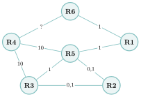{ .tikz loading=lazy }

    \(c\) Coût(R6–R4) $+ 10 + 0{,}1 = 11{,}1$, donc coût(R6–R4) $= 1$ : c’est une liaison **Fast-Ethernet**.  
    (d) Le Lycée général est desservi par R2. On compare les coûts des routes de R6 à R2 : R6–R1–R5–R2 : $1 + 1 + 0{,}1 = \textbf{2{,}1}$ ; R6–R1–R5–R3–R2 : $3{,}1$ ; toutes les routes passant par R4 coûtent au moins $1 + 10 + 0{,}1 = 11{,}1$. OSPF choisit donc **PC Admin 01 $\to$ R6 $\to$ R1 $\to$ R5 $\to$ R2 $\to$ PC LG 01**.

### ★★ Exercice 12 — Des adresses, RIP puis OSPF *(d’après Centres étrangers 2023, jour 1)*  { #ex-09-12 }

Voici un réseau dans lequel A, B, C, D, E, F, G et H sont des routeurs ; chaque liaison est étiquetée par l’adresse du réseau qui relie les deux routeurs.

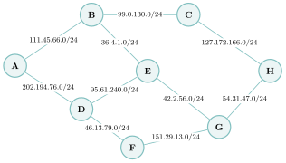{ .tikz loading=lazy }

Les adresses IPv4 sont composées de $4$ octets, notées `X1.X2.X3.X4` en décimal. La notation CIDR `X1.X2.X3.X4/n` signifie que les $n$ premiers bits de poids forts représentent la partie « réseau », les suivants la partie « hôte ». Tous les hôtes d’un même réseau local ont la même partie réseau ; l’adresse dont tous les bits de la partie hôte sont à $0$ est l’*adresse du réseau*.

1.  1.  `10100100.10110010.XXXXXXXX.XXXXXXXX` est la conversion en binaire de l’adresse `164.178.2.13`. Terminer cette conversion en remplaçant les deux octets `XXXXXXXX` par leur valeur binaire.

    2.  Donner, en justifiant, l’adresse du réseau auquel appartient la machine d’adresse `164.178.2.13/24`.

    Le protocole RIP cherche à minimiser le nombre de routeurs traversés (nombre de sauts).

2.  Donner tous les chemins optimaux pour un paquet émis par A à destination de G en suivant le protocole RIP.

Voici maintenant le type de connexion entre les routeurs :

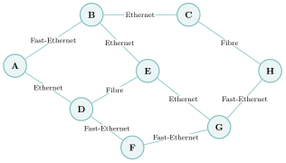{ .tikz loading=lazy }

On travaille avec le protocole OSPF. Le coût d’une liaison est donné par $\text{coût} = 10^{9}/BP$, où $BP$ est la bande passante en bit/s, estimée selon le type de connexion : Ethernet $10^{8}$, Fast-Ethernet $10^{9}$, Fibre $10^{10}$.

1.  1.  Dessiner le schéma du réseau en remplaçant le type de connexion par le coût (on se limitera aux noms des routeurs et aux coûts).

    2.  Donner le chemin suivi par un paquet émis par A à destination de G en respectant le protocole OSPF.

    3.  Donner ce chemin si le routeur F est en panne.

        ??? pouce "Coup de pouce"

            Question 2 : lister les chemins de A à G et garder *tous* ceux qui ont le moins de sauts. Question 3 : calculer le coût de chaque type de connexion avec la formule de l’énoncé (attention : $10^{9}$ ici), puis comparer les coûts totaux des chemins.

??? corrige "Corrigé"

    **1.** (a) $2 = \texttt{00000010}$ et $13 = 8+4+1 = \texttt{00001101}$ : `10100100.10110010.00000010.00001101`.  
    (b) Avec `/24`, les $24$ premiers bits (les trois premiers octets) forment la partie réseau ; on met les $8$ bits d’hôte à $0$ : adresse du réseau `164.178.2.0`.  
    **2.** Il faut au minimum $3$ sauts, et trois chemins les réalisent : **A–B–E–G**, **A–D–E–G** et **A–D–F–G**.

    **3.** (a) Coûts $10^9/BP$ : Ethernet $10^9/10^8 = 10$ ; Fast-Ethernet $10^9/10^9 = 1$ ; Fibre $10^9/10^{10} = 0{,}1$.

    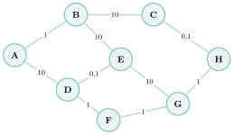{ .tikz loading=lazy }

    \(b\) OSPF choisit le chemin de coût total minimal : **A–D–F–G**, de coût $10+1+1 = 12$ (devant A–B–C–H–G : $1+10+0{,}1+1 = 12{,}1$).  
    (c) Sans F, le meilleur chemin est **A–B–C–H–G**, de coût $12{,}1$ (A–D–E–G coûte $20{,}1$).

### ★★ Exercice 13 — Bob écrit à Alice *(d’après Sujet zéro 2023, sujet A)*  { #ex-09-13 }

Bob et Alice communiquent au travers du réseau ci-dessous, dont le protocole de routage est OSPF, qui minimise le coût des communications (LAN : réseau local ; WAN : réseau étendu ; R : routeur ; Sw : switch).

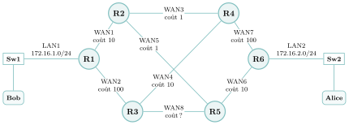{ .tikz loading=lazy }

Une adresse IPv4 est composée de quatre octets, soit $32$ bits. La notation `/n` signifie que les $n$ premiers bits de l’adresse forment la partie « réseau » et les suivants la partie « machine ». L’adresse dont tous les bits machine sont à $0$ est l’adresse du réseau, celle dont ils sont tous à $1$ l’adresse de diffusion : ces deux adresses ne peuvent pas être attribuées à des machines. Le choix des routes est uniquement basé sur OSPF, avec un débit de référence de $10\,000$ Mbit/s : $$\text{coût} = \frac{\text{débit de référence}}{\text{débit du réseau concerné}}.$$

1.  La configuration IP partielle suivante a été affichée sur l’un des ordinateurs : IP hôte `172.16.2.3`, IP passerelle `172.16.2.253`. Indiquer, en justifiant, si cette configuration appartient à l’ordinateur de Bob ou à celui d’Alice.

2.  Le réseau WAN8 a un débit de $1\,000$ Mbit/s. Calculer le coût correspondant.

3.  On donne les tables de routage des routeurs R1 à R5 (« Pass. » désigne la passerelle, c’est-à-dire le routeur suivant ; « – » signale un réseau directement relié). Écrire la table de routage du routeur R6.

    <table>
    <thead>
    <tr>
    <th colspan="3" style="text-align: left;"><strong>Routeur R1</strong></th>
    </tr>
    </thead>
    <tbody>
    <tr>
    <td style="text-align: center;">Dest.</td>
    <td style="text-align: center;">Pass.</td>
    <td style="text-align: center;">Coût</td>
    </tr>
    <tr>
    <td style="text-align: center;">LAN1</td>
    <td style="text-align: center;">–</td>
    <td style="text-align: center;">–</td>
    </tr>
    <tr>
    <td style="text-align: center;">LAN2</td>
    <td style="text-align: center;">R2</td>
    <td style="text-align: center;">21</td>
    </tr>
    <tr>
    <td style="text-align: center;">WAN1</td>
    <td style="text-align: center;">–</td>
    <td style="text-align: center;">–</td>
    </tr>
    <tr>
    <td style="text-align: center;">WAN2</td>
    <td style="text-align: center;">–</td>
    <td style="text-align: center;">–</td>
    </tr>
    <tr>
    <td style="text-align: center;">WAN3</td>
    <td style="text-align: center;">R2</td>
    <td style="text-align: center;">10</td>
    </tr>
    <tr>
    <td style="text-align: center;">WAN4</td>
    <td style="text-align: center;">R2</td>
    <td style="text-align: center;">11</td>
    </tr>
    <tr>
    <td style="text-align: center;">WAN5</td>
    <td style="text-align: center;">R2</td>
    <td style="text-align: center;">10</td>
    </tr>
    <tr>
    <td style="text-align: center;">WAN6</td>
    <td style="text-align: center;">R2</td>
    <td style="text-align: center;">11</td>
    </tr>
    <tr>
    <td style="text-align: center;">WAN7</td>
    <td style="text-align: center;">R2</td>
    <td style="text-align: center;">11</td>
    </tr>
    <tr>
    <td style="text-align: center;">WAN8</td>
    <td style="text-align: center;">R2</td>
    <td style="text-align: center;">11</td>
    </tr>
    </tbody>
    </table>

    \;

    <table>
    <thead>
    <tr>
    <th colspan="3" style="text-align: left;"><strong>Routeur R2</strong></th>
    </tr>
    </thead>
    <tbody>
    <tr>
    <td style="text-align: center;">Dest.</td>
    <td style="text-align: center;">Pass.</td>
    <td style="text-align: center;">Coût</td>
    </tr>
    <tr>
    <td style="text-align: center;">LAN1</td>
    <td style="text-align: center;">R1</td>
    <td style="text-align: center;">10</td>
    </tr>
    <tr>
    <td style="text-align: center;">LAN2</td>
    <td style="text-align: center;">R5</td>
    <td style="text-align: center;">11</td>
    </tr>
    <tr>
    <td style="text-align: center;">WAN1</td>
    <td style="text-align: center;">–</td>
    <td style="text-align: center;">–</td>
    </tr>
    <tr>
    <td style="text-align: center;">WAN2</td>
    <td style="text-align: center;">R1</td>
    <td style="text-align: center;">10</td>
    </tr>
    <tr>
    <td style="text-align: center;">WAN3</td>
    <td style="text-align: center;">–</td>
    <td style="text-align: center;">–</td>
    </tr>
    <tr>
    <td style="text-align: center;">WAN4</td>
    <td style="text-align: center;">R4</td>
    <td style="text-align: center;">1</td>
    </tr>
    <tr>
    <td style="text-align: center;">WAN5</td>
    <td style="text-align: center;">–</td>
    <td style="text-align: center;">–</td>
    </tr>
    <tr>
    <td style="text-align: center;">WAN6</td>
    <td style="text-align: center;">R5</td>
    <td style="text-align: center;">1</td>
    </tr>
    <tr>
    <td style="text-align: center;">WAN7</td>
    <td style="text-align: center;">R4</td>
    <td style="text-align: center;">1</td>
    </tr>
    <tr>
    <td style="text-align: center;">WAN8</td>
    <td style="text-align: center;">R5</td>
    <td style="text-align: center;">1</td>
    </tr>
    </tbody>
    </table>

    \;

    <table>
    <thead>
    <tr>
    <th colspan="3" style="text-align: left;"><strong>Routeur R3</strong></th>
    </tr>
    </thead>
    <tbody>
    <tr>
    <td style="text-align: center;">Dest.</td>
    <td style="text-align: center;">Pass.</td>
    <td style="text-align: center;">Coût</td>
    </tr>
    <tr>
    <td style="text-align: center;">LAN1</td>
    <td style="text-align: center;">R4</td>
    <td style="text-align: center;">21</td>
    </tr>
    <tr>
    <td style="text-align: center;">LAN2</td>
    <td style="text-align: center;">R5</td>
    <td style="text-align: center;">20</td>
    </tr>
    <tr>
    <td style="text-align: center;">WAN1</td>
    <td style="text-align: center;">R4</td>
    <td style="text-align: center;">11</td>
    </tr>
    <tr>
    <td style="text-align: center;">WAN2</td>
    <td style="text-align: center;">–</td>
    <td style="text-align: center;">–</td>
    </tr>
    <tr>
    <td style="text-align: center;">WAN3</td>
    <td style="text-align: center;">R4</td>
    <td style="text-align: center;">10</td>
    </tr>
    <tr>
    <td style="text-align: center;">WAN4</td>
    <td style="text-align: center;">–</td>
    <td style="text-align: center;">–</td>
    </tr>
    <tr>
    <td style="text-align: center;">WAN5</td>
    <td style="text-align: center;">R5</td>
    <td style="text-align: center;">10</td>
    </tr>
    <tr>
    <td style="text-align: center;">WAN6</td>
    <td style="text-align: center;">R5</td>
    <td style="text-align: center;">10</td>
    </tr>
    <tr>
    <td style="text-align: center;">WAN7</td>
    <td style="text-align: center;">R4</td>
    <td style="text-align: center;">10</td>
    </tr>
    <tr>
    <td style="text-align: center;">WAN8</td>
    <td style="text-align: center;">–</td>
    <td style="text-align: center;">–</td>
    </tr>
    </tbody>
    </table>

    \;

    <table>
    <thead>
    <tr>
    <th colspan="3" style="text-align: left;"><strong>Routeur R4</strong></th>
    </tr>
    </thead>
    <tbody>
    <tr>
    <td style="text-align: center;">Dest.</td>
    <td style="text-align: center;">Pass.</td>
    <td style="text-align: center;">Coût</td>
    </tr>
    <tr>
    <td style="text-align: center;">LAN1</td>
    <td style="text-align: center;">R2</td>
    <td style="text-align: center;">11</td>
    </tr>
    <tr>
    <td style="text-align: center;">LAN2</td>
    <td style="text-align: center;">R2</td>
    <td style="text-align: center;">12</td>
    </tr>
    <tr>
    <td style="text-align: center;">WAN1</td>
    <td style="text-align: center;">R2</td>
    <td style="text-align: center;">1</td>
    </tr>
    <tr>
    <td style="text-align: center;">WAN2</td>
    <td style="text-align: center;">R3</td>
    <td style="text-align: center;">10</td>
    </tr>
    <tr>
    <td style="text-align: center;">WAN3</td>
    <td style="text-align: center;">–</td>
    <td style="text-align: center;">–</td>
    </tr>
    <tr>
    <td style="text-align: center;">WAN4</td>
    <td style="text-align: center;">–</td>
    <td style="text-align: center;">–</td>
    </tr>
    <tr>
    <td style="text-align: center;">WAN5</td>
    <td style="text-align: center;">R2</td>
    <td style="text-align: center;">1</td>
    </tr>
    <tr>
    <td style="text-align: center;">WAN6</td>
    <td style="text-align: center;">R2</td>
    <td style="text-align: center;">2</td>
    </tr>
    <tr>
    <td style="text-align: center;">WAN7</td>
    <td style="text-align: center;">–</td>
    <td style="text-align: center;">–</td>
    </tr>
    <tr>
    <td style="text-align: center;">WAN8</td>
    <td style="text-align: center;">R2</td>
    <td style="text-align: center;">2</td>
    </tr>
    </tbody>
    </table>

    \;

    <table>
    <thead>
    <tr>
    <th colspan="3" style="text-align: left;"><strong>Routeur R5</strong></th>
    </tr>
    </thead>
    <tbody>
    <tr>
    <td style="text-align: center;">Dest.</td>
    <td style="text-align: center;">Pass.</td>
    <td style="text-align: center;">Coût</td>
    </tr>
    <tr>
    <td style="text-align: center;">LAN1</td>
    <td style="text-align: center;">R2</td>
    <td style="text-align: center;">11</td>
    </tr>
    <tr>
    <td style="text-align: center;">LAN2</td>
    <td style="text-align: center;">R6</td>
    <td style="text-align: center;">10</td>
    </tr>
    <tr>
    <td style="text-align: center;">WAN1</td>
    <td style="text-align: center;">R2</td>
    <td style="text-align: center;">1</td>
    </tr>
    <tr>
    <td style="text-align: center;">WAN2</td>
    <td style="text-align: center;">R3</td>
    <td style="text-align: center;">10</td>
    </tr>
    <tr>
    <td style="text-align: center;">WAN3</td>
    <td style="text-align: center;">R2</td>
    <td style="text-align: center;">1</td>
    </tr>
    <tr>
    <td style="text-align: center;">WAN4</td>
    <td style="text-align: center;">R2</td>
    <td style="text-align: center;">2</td>
    </tr>
    <tr>
    <td style="text-align: center;">WAN5</td>
    <td style="text-align: center;">–</td>
    <td style="text-align: center;">–</td>
    </tr>
    <tr>
    <td style="text-align: center;">WAN6</td>
    <td style="text-align: center;">–</td>
    <td style="text-align: center;">–</td>
    </tr>
    <tr>
    <td style="text-align: center;">WAN7</td>
    <td style="text-align: center;">R2</td>
    <td style="text-align: center;">2</td>
    </tr>
    <tr>
    <td style="text-align: center;">WAN8</td>
    <td style="text-align: center;">–</td>
    <td style="text-align: center;">–</td>
    </tr>
    </tbody>
    </table>

4.  Bob envoie un message à Alice. Énumérer dans l’ordre tous les routeurs par lesquels transitera ce message.

5.  Un routeur tombe en panne : le nouveau coût de la route entre Bob et Alice est de $111$. Déterminer le nom du routeur en panne.

    ??? pouce "Coup de pouce"

        Question 1 : la passerelle est l’adresse du routeur sur le réseau local de l’ordinateur ; la chercher sur le schéma. Question 4 : partir du routeur de Bob et suivre, de table en table, la colonne « Pass. » vers le LAN d’Alice. Question 5 : pour chaque routeur du chemin, se demander quel serait le coût de la meilleure route sans lui.

??? corrige "Corrigé"

    **1.** Avec le masque `/24`, `172.16.2.3` appartient au réseau `172.16.2.0/24`, c’est-à-dire **LAN2** (la passerelle `172.16.2.253` est l’interface de R6 sur ce réseau) : c’est l’ordinateur d’**Alice**.  
    **2.** $\text{coût} = 10\,000 / 1\,000 = \mathbf{10}$.

    **3.** Comme dans les autres tables, le coût vers un réseau est celui du chemin le moins cher jusqu’au routeur le plus proche relié à ce réseau. Depuis R6, tout passe par R5 (le lien WAN7 vers R4 coûte $100$) :

    | Dest. | Pass. | Coût |
    |:-----:|:-----:|:----:|
    | LAN1  |  R5   |  21  |
    | LAN2  |   –   |  –   |
    | WAN1  |  R5   |  11  |
    | WAN2  |  R5   |  20  |
    | WAN3  |  R5   |  11  |
    | WAN4  |  R5   |  12  |
    | WAN5  |  R5   |  10  |
    | WAN6  |   –   |  –   |
    | WAN7  |   –   |  –   |
    | WAN8  |  R5   |  10  |

    (Par exemple LAN1 : R6–R5–R2–R1 $= 10+1+10 = 21$ ; WAN4, entre R3 et R4 : R6–R5–R2–R4 $= 10+1+1 = 12$.)

    **4.** En suivant les tables (R1 envoie vers LAN2 par R2, R2 par R5, R5 par R6) : **R1 $\to$ R2 $\to$ R5 $\to$ R6**, de coût $10+1+10 = 21$.

    **5.** On teste chaque panne : sans R2, le meilleur chemin est R1–R3–R5–R6 ($100+10+10 = 120$) ; sans R3 ou sans R4, la route R1–R2–R5–R6 ($21$) reste disponible ; sans **R5**, il reste R1–R2–R4–R6 $= 10+1+100 = \mathbf{111}$. Le routeur en panne est **R5**.

### ★★★ Exercice 14 — Du réseau local L1 au réseau local L2 *(d’après Centres étrangers 2024, groupe 1, jour 1)*  { #ex-09-14 }

*Rappels.* Une adresse IPv4 est composée de $4$ octets, soit $32$ bits, notée `a.b.c.d` (« notation décimale pointée »). La notation CIDR `a.b.c.d/n` signifie que les $n$ premiers bits de l’adresse représentent la partie réseau, les bits suivants la partie machine. L’adresse dont tous les bits machine sont à $0$ est l’*adresse du réseau* ; celle dont ils sont tous à $1$ est l’*adresse de diffusion*. On considère le réseau suivant :

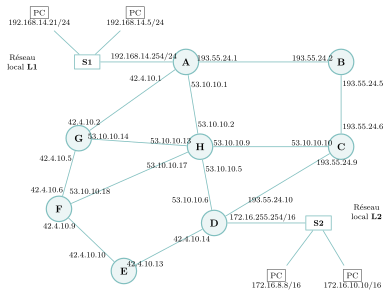{ .tikz loading=lazy }

**Partie A — Adresses IP**

1.  Les machines du réseau local L1 ont un masque de $24$ bits en notation CIDR, soit `255.255.255.0` en notation décimale pointée. Donner le masque en notation décimale pointée des machines du réseau L2 (masque de $16$ bits).

Concernant le réseau local L2 :

1.  Donner l’adresse du réseau.

2.  Donner l’adresse de diffusion.

3.  Donner le nombre maximum de machines pouvant être connectées à ce réseau.

**Partie B — Protocoles de routage.** Voici des extraits des tables de routage des routeurs :

| Routeur | Réseau destinataire |  Passerelle  |   Interface    |
|:-------:|:-------------------:|:------------:|:--------------:|
|    A    |         L2          |  53.10.10.2  |   53.10.10.1   |
|    B    |         L2          | 193.55.24.6  |  193.55.24.5   |
|    C    |         L2          | 193.55.24.10 |  193.55.24.9   |
|    D    |         L2          |   Connecté   | 172.16.255.254 |
|    E    |         L2          |  42.4.10.14  |   42.4.10.13   |
|    F    |         L2          |  42.4.10.10  |   42.4.10.9    |
|    G    |         L2          | 53.10.10.13  |  53.10.10.14   |
|    H    |         L2          |  53.10.10.6  |   53.10.10.5   |

1.  À l’aide de ces extraits, donner un chemin (c’est-à-dire nommer les routeurs traversés) suivi par un message envoyé du réseau L1 vers le réseau L2.

La liaison entre les routeurs H et D est rompue.

1.  Sachant que le protocole RIP est utilisé (distance en nombre de sauts), donner les nouveaux chemins que pourra suivre un message allant de L1 vers L2.

2.  Choisir un des chemins de la question précédente. Donner les routeurs dont la règle de routage vers L2 est *obligatoirement* modifiée. Après avoir examiné tous les routeurs, écrire les règles de routage modifiées en conséquence.

La liaison entre H et D est rétablie. Pour tenir compte du débit des liaisons, on utilise désormais OSPF, avec $\text{coût} = 10^{9}/BP$, où $BP$ est la bande passante en bit/s. Voici les bandes passantes des liaisons :

| Liaison | Bande passante | Liaison | Bande passante | Liaison | Bande passante |
|:-------:|:--------------:|:-------:|:--------------:|:-------:|:--------------:|
|   A-B   |    1 Gbit/s    |   B-C   |    1 Gbit/s    |   D-E   |   10 Gbit/s    |
|   A-H   |    1 Gbit/s    |   C-H   |   100 Mbit/s   |   E-F   |   10 Gbit/s    |
|   A-G   |    1 Gbit/s    |   C-D   |    1 Gbit/s    |   F-H   |    1 Gbit/s    |
|   D-H   |   100 Mbit/s   |   G-H   |    1 Gbit/s    |   F-G   |   10 Gbit/s    |

1.  Calculer le coût des liaisons pour les trois valeurs de bande passante du tableau.

2.  Déterminer alors le chemin suivi par un message allant de L1 vers L2, et donner son coût.

3.  La liaison entre les routeurs G et F est rompue. Déterminer le nouveau chemin suivi par un message allant de L1 vers L2, et donner son coût.

    ??? pouce "Coup de pouce"

        Questions 2 à 4 : avec un masque `/16`, les deux derniers octets désignent la machine. Question 5 : partir du routeur relié à L1 et suivre les passerelles du tableau. Question 7 : un routeur doit changer sa règle si sa passerelle actuelle vers L2 n’est plus sur le nouveau chemin. Questions 9 et 10 : calculer le coût total de chaque chemin possible et garder le plus petit.

    ??? pouce "Coup de pouce 2 (début de solution)"

        Question 8 : $1$ Gbit/s $= 10^9$ bit/s donne un coût de $10^9/10^9 = 1$ ; faire de même avec $10^8$ bit/s et $10^{10}$ bit/s. Question 9 : écrire ces coûts sur chaque liaison, puis comparer par exemple les chemins qui passent par H avec ceux qui passent par G puis F.

??? corrige "Corrigé"

    **Partie A.** **1.** `255.255.0.0`. **2.** On garde les $16$ premiers bits de `172.16.8.8` : adresse du réseau `172.16.0.0`. **3.** On met les $16$ bits machine à $1$ : diffusion `172.16.255.255`. **4.** $2^{16} - 2 = \mathbf{65\,534}$ machines (on retire l’adresse du réseau et celle de diffusion).

    **Partie B.** **5.** A envoie vers la passerelle `53.10.10.2`, interface de H ; H envoie vers `53.10.10.6`, interface de D, qui est connecté à L2 : **A $\to$ H $\to$ D**.

    **6.** Sans la liaison H–D, il faut au minimum $3$ sauts de A à D : **A–B–C–D** et **A–H–C–D**.

    **7.** Avec le chemin **A–H–C–D** : A envoie toujours vers H, mais la règle de **H** doit obligatoirement changer (sa passerelle D n’est plus joignable). On examine les autres routeurs : G passe par H (G–H–C–D, $3$ sauts, autant que G–F–E–D), F et E passent par E et D, B et C par C et D : leurs règles restent valables. Règle modifiée :

    | Routeur | Réseau destinataire | Passerelle  | Interface  |
    |:-------:|:-------------------:|:-----------:|:----------:|
    |    H    |         L2          | 53.10.10.10 | 53.10.10.9 |

    (Avec le chemin A–B–C–D, il faudrait modifier A — passerelle `193.55.24.2`, interface `193.55.24.1` — *et* H, comme ci-dessus.)

    **8.** $\text{coût} = 10^9/BP$ : $1$ Gbit/s $\to 1$ ; $100$ Mbit/s $\to 10$ ; $10$ Gbit/s $\to 0{,}1$.

    **9.** Le chemin le moins coûteux est **A–G–F–E–D**, de coût $1 + 0{,}1 + 0{,}1 + 0{,}1 = \mathbf{1{,}3}$ (A–H–D coûterait $11$, A–B–C–D $3$).

    **10.** Sans G–F : **A–H–F–E–D**, de coût $1 + 1 + 0{,}1 + 0{,}1 = \mathbf{2{,}2}$ (devant A–B–C–D, $3$).

### ★★ Exercice 15 — Le réseau d’une société *(d’après Métropole septembre 2024, jour 1)*  { #ex-09-15 }

Le réseau informatique d’une société est constitué de routeurs interconnectés par des fibres optiques. Il comporte deux réseaux locaux : L1, relié au routeur R1, et L2, relié au routeur R9.

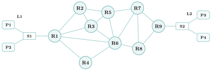{ .tikz loading=lazy }

**Partie A.** Les adresses IP sont notées `X1.X2.X3.X4`, et `X1.X2.X3.X4/n` signifie que les $n$ premiers bits de poids forts représentent la partie réseau. Toutes les machines d’un réseau local ont la même partie réseau. Voici les adresses IPv4 du réseau de la société :

| Nom | Adresses IPv4 |
|:--:|:---|
| R1 | 192.168.1.1/24,  192.168.2.1/24,  192.168.3.1/24,  192.168.4.1/24,  192.168.5.1/24 |
| R2 | 192.168.2.2/24,  192.168.7.1/24,  192.168.8.1/24 |
| R3 | 192.168.3.2/24,  192.168.7.2/24,  192.168.9.1/24,  192.168.10.1/24 |
| R4 | 192.168.5.2/24,  192.168.6.1/24 |
| R5 | 192.168.8.2/24,  192.168.9.2/24,  192.168.11.1/24,  192.168.12.1/24 |
| R6 | 192.168.4.2/24,  192.168.6.2/24,  192.168.10.2/24,  192.168.11.2/24,  192.168.13.1/24,  192.168.14.1/24 |
| R7 | 192.168.12.2/24,  192.168.13.2/24,  192.168.15.1/24,  192.168.16.1/24 |
| R8 | 192.168.14.2/24,  192.168.15.2/24,  192.168.17.1/24 |
| R9 | 192.168.16.2/24,  192.168.17.2/24,  192.168.18.1/24 |
| P1 | 192.168.1.10 |
| P2, P3, P4 | non fournies |

1.  En utilisant les adresses des interfaces et des portables, en déduire une adresse possible pour le portable P2.

2.  Donner l’adresse du réseau local L2 ainsi que le nombre d’adresses possibles pour les portables P3 et P4.

**Partie B.** On suppose que le protocole de routage RIP est utilisé.

1.  Recopier et compléter, en ajoutant autant de lignes que nécessaire, la table de routage simplifiée du routeur R1.

    | Destination | Suivant | Nombre de sauts |
    |:-----------:|:-------:|:---------------:|
    |     R2      |   R2    |        1        |
    |     R3      |         |                 |

2.  L’ordinateur P1 envoie un paquet de données à l’ordinateur P3. Donner l’un des chemins empruntés par le paquet ainsi que le nombre de sauts.

**Partie C.** On utilise maintenant le protocole OSPF. Le poids de chaque arête ci-dessous est la bande passante de la liaison, en mégabits par seconde (Mb/s), et le coût d’une liaison est $C = \dfrac{10^{8}}{BP}$, où $BP$ est la bande passante en bits par seconde.

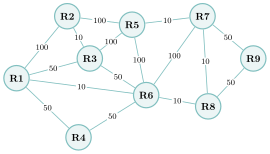{ .tikz loading=lazy }

1.  Déterminer la route empruntée par un paquet allant de l’ordinateur P1 à l’ordinateur P3. Préciser le coût de ce trajet.

    ??? pouce "Coup de pouce"

        Question 1 : P2 est dans le même réseau que l’interface du routeur à laquelle il est relié. Question 3 : compter les liaisons sur le schéma, en notant le premier routeur du plus court chemin. Question 5 : calculer le coût de chaque liaison, puis comparer les coûts totaux des chemins possibles.

??? corrige "Corrigé"

    **Partie A.** **1.** P1 (`192.168.1.10`) et l’interface 1 de R1 (`192.168.1.1/24`) sont dans le réseau L1 `192.168.1.0/24`. P2 peut prendre toute adresse libre de ce réseau, par exemple `192.168.1.11` (ni `.0`, ni `.255`, ni `.1`, ni `.10`).  
    **2.** L2 est relié à l’interface 3 de R9, `192.168.18.1/24` : adresse du réseau `192.168.18.0`. Il y a $2^8 - 2 = 254$ adresses de machines, dont une prise par R9 : **253** adresses possibles pour P3 et P4.

    **Partie B.** **3.** Table RIP de R1 :

    | Destination |       Suivant       | Nombre de sauts |
    |:-----------:|:-------------------:|:---------------:|
    |     R2      |         R2          |        1        |
    |     R3      |         R3          |        1        |
    |     R4      |         R4          |        1        |
    |     R5      | R2 *(ou R3, ou R6)* |        2        |
    |     R6      |         R6          |        1        |
    |     R7      |         R6          |        2        |
    |     R8      |         R6          |        2        |
    |     R9      |         R6          |        3        |

    **4.** Par exemple P1 $\to$ R1 $\to$ R6 $\to$ R7 $\to$ R9 $\to$ P3 : **3 sauts** entre routeurs (R1–R6–R8–R9 convient aussi).

    **Partie C.** **5.** Coûts : $100$ Mb/s $\to 10^8/10^8 = 1$ ; $50$ Mb/s $\to 2$ ; $10$ Mb/s $\to 10$. La route de coût minimal est **R1–R2–R5–R6–R7–R9**, de coût $1+1+1+1+2 = \mathbf{6}$ (les routes R1–R3–R6–R7–R9 ou R1–R4–R6–R7–R9 coûtent $7$, et R1–R6 direct coûte déjà $10$).

### Critiquer une réponse d’IA

### ★★ Exercice 16 — RIP et OSPF expliqués par un assistant d’IA  { #ex-09-16 }

Un élève demande à un assistant d’IA : « Quelle est la différence entre RIP et OSPF, et comment calcule-t-on la métrique d’une route en OSPF ? » Voici la réponse obtenue :

> « RIP et OSPF sont deux protocoles de routage dynamique : ils remplissent automatiquement les tables de routage. RIP mesure une route par son nombre de sauts (le nombre de routeurs traversés) ; chaque routeur échange périodiquement sa table avec ses voisins (algorithme de Bellman-Ford), et une destination à plus de 15 sauts est considérée comme inaccessible. OSPF, lui, connaît la carte complète du réseau et applique l’algorithme de Dijkstra : la métrique d’une route est la somme des coûts des liaisons traversées. Le coût d’une liaison se calcule à partir de son débit par la formule $\text{coût} = \text{débit} / 10^8$ (débit en bits par seconde) : une liaison à 100 Mbit/s coûte donc 1. Ainsi, OSPF tient compte de la vitesse des liaisons, contrairement à RIP qui traite de la même façon une fibre et une liaison lente. »

1.  La réponse est-elle correcte ? La vérifier par un calcul : avec la formule de l’assistant, quel est le coût d’une liaison à $1$ Mbit/s ? à $100$ Mbit/s ? Laquelle OSPF préférerait-il alors ?

2.  Localiser et corriger l’erreur, puis refaire le calcul.

3.  Quelle vérification simple, faite avant de faire confiance à la réponse, aurait suffi à détecter l’erreur ?

    ??? pouce "Coup de pouce"

        Appliquer la formule de l’assistant aux deux débits et se demander si le résultat va dans le bon sens : une liaison rapide doit-elle coûter plus ou moins cher qu’une liaison lente ?

??? corrige "Corrigé"

    **1.** **Non.** Avec $\text{coût} = \text{débit}/10^8$ : la liaison à $1$ Mbit/s coûterait $10^6/10^8 = 0{,}01$ et celle à $100$ Mbit/s coûterait $1$. OSPF, qui minimise la somme des coûts, **préférerait la liaison lente** — l’inverse du but recherché (le $1$ obtenu pour $100$ Mbit/s est juste, mais par coïncidence : c’est la bande passante de référence).

    **2.** La formule est **inversée**. Le cours : « *coût $= 10^8 / \text{débit (en bits/s)}$* » et « *plus le débit est grand, plus le coût est petit* ». Calcul corrigé : $1$ Mbit/s $\to 10^8/10^6 = 100$ ; $100$ Mbit/s $\to 10^8/10^8 = 1$ : OSPF évite bien la liaison lente. Tout le reste de la réponse (métrique de RIP, échanges périodiques, Bellman-Ford, limite de $15$ sauts, Dijkstra, somme des coûts) est exact.

    **3.** Tester la formule sur **deux débits différents** et vérifier le **sens de variation** attendu : une liaison plus rapide doit coûter *moins*. Un seul exemple (celui de l’assistant, $100$ Mbit/s) ne suffit pas, car il tombe sur la valeur de référence où les deux formules coïncident.

### S’entraîner à l’oral

### ★★ Exercice 17 — Expliquer en deux minutes  { #ex-09-17 }

Au Grand Oral comme devant l’examinateur de l’épreuve pratique, il faut savoir **expliquer** une notion clairement, sans notes. Choisir l’un des sujets suivants (ou le tirer au sort) :

1.  Expliquer comment un paquet trouve son chemin à travers plusieurs réseaux grâce aux **tables de routage**.

2.  Expliquer la différence entre les protocoles **RIP** et **OSPF**, avec un exemple où ils ne choisissent pas la même route.

3.  Expliquer à un camarade de Première pourquoi un **protocole de routage** est nécessaire, au lieu de remplir les tables à la main.

**Préparation (5 min, seul).** Noter au brouillon **trois idées** et **un exemple**, rien de plus, puis retourner la feuille. **Exposé (2 min, chronométré).** Debout, face à un camarade, **sans lire de notes** : tout passe par la parole. **Retour (2 min).** Le camarade pose une question de relance (on peut alors s’aider d’un schéma), remplit la grille ci-dessous et donne un conseil ; puis on échange les rôles. Cette grille reprend les critères d’évaluation du Grand Oral.

??? pouce "Coup de pouce"

    Structurer chaque explication en trois temps : une **définition** en une phrase, un **exemple** petit et concret déroulé à voix haute, puis le **piège** (l’erreur que l’auditeur risque de faire). Finir par une phrase qui répond à la question posée. Comparer le trajet d’un paquet à celui d’un voyageur qui ne lit que les panneaux du prochain carrefour. Sujet 2 : quelle grandeur chaque protocole cherche-t-il à rendre minimale ?

<table>
<thead>
<tr>
<th style="text-align: left;"><strong>Grille entre camarades</strong></th>
<th style="text-align: center;"><strong>Oui</strong></th>
<th style="text-align: center;"><strong>En partie</strong></th>
<th style="text-align: center;"><strong>Pas encore</strong></th>
</tr>
</thead>
<tbody>
<tr>
<td style="text-align: left;"><strong>Clair</strong> — audible, posé ; chaque mot technique est expliqué</td>
<td style="text-align: center;">▫</td>
<td style="text-align: center;">▫</td>
<td style="text-align: center;">▫</td>
</tr>
<tr>
<td style="text-align: left;"><strong>Juste</strong> — c’est exact, et l’exemple montre vraiment l’idée</td>
<td style="text-align: center;">▫</td>
<td style="text-align: center;">▫</td>
<td style="text-align: center;">▫</td>
</tr>
<tr>
<td style="text-align: left;"><strong>Construit</strong> — un fil conducteur, tenu en deux minutes, sans lire</td>
<td style="text-align: center;">▫</td>
<td style="text-align: center;">▫</td>
<td style="text-align: center;">▫</td>
</tr>
<tr>
<td colspan="4" style="text-align: left;"><strong>Un conseil</strong> pour la prochaine fois :</td>
</tr>
</tbody>
</table>

??? corrige "Corrigé"

    Pas de texte à apprendre par cœur : voici les **éléments attendus** pour chaque sujet. L’ordre, les mots et l’exemple peuvent être différents ; l’explication est réussie si ces idées y sont, justes et reliées entre elles.

    **Sujet 1.**

    - Les données sont découpées en **paquets** ; chacun porte l’adresse IP de destination.

    - Chaque routeur consulte sa **table de routage** : pour chaque réseau de destination, par où sortir (interface ou routeur voisin) et la **métrique** de la route.

    - Le chemin se construit **saut par saut** : chaque routeur ne choisit que le suivant.

    - Piège : les paquets d’un même message peuvent emprunter des chemins différents.

    **Sujet 2.**

    - **RIP** : métrique $=$ nombre de **sauts** (routeurs traversés) ; chaque routeur échange sa table avec ses voisins.

    - **OSPF** : métrique $=$ somme des **coûts** des liaisons, le coût dépendant du débit (par exemple $10^8 / \text{débit}$ en bits/s) ; chaque routeur connaît la carte complète et applique Dijkstra.

    - Exemple : route 1 de $2$ liaisons à $10$ Mbit/s (coût $10 + 10 = 20$), route 2 de $3$ liaisons à $1$ Gbit/s (coût $3 \times 0{,}1 = 0{,}3$) : RIP choisit la route 1, OSPF la route 2.

    - Piège : toujours utiliser la formule de coût donnée par l’énoncé ($10^8$, $10^9$…).

    **Sujet 3.**

    - Un réseau change sans arrêt : liaisons qui tombent, routeurs ajoutés ; des tables écrites à la main seraient vite fausses.

    - Un **protocole de routage** fait échanger automatiquement des informations aux routeurs pour construire et mettre à jour leurs tables.

    - Exemple : une liaison est coupée ; les routeurs voisins s’en aperçoivent et recalculent une route qui la contourne.

    - Lien avec les graphes : routeurs $=$ sommets, liaisons $=$ arêtes pondérées ; on cherche un plus court chemin.
