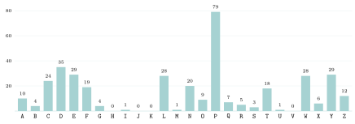

# Activités préparatoires

Cryptographie

## Activité 1 Casser le code de César

Durée : 15 à 20 min · Par deux, sans ordinateur ni calculatrice

!!! consignes "Consignes"

    - Vous êtes l’**attaquant** : vous ne connaissez pas la clé, mais vous voulez lire le message.

    - Répondre sur le cahier.  Travail **sans IA** : ni assistant, ni complétion de code ; vous devez pouvoir expliquer chaque réponse.

## Le message intercepté

Les espions du roi ont intercepté ce message. On sait seulement que chaque lettre a été **décalée** d’un même nombre $k$ de rangs dans l’alphabet (après `Z`, on repart à `A`) ; les espaces et la ponctuation n’ont pas été modifiés.

FY XPDDLRP DPNCPE L PEP TYEPCNPAEP ALC WPD PDATZYD OF CZT. APCDZYYP YP NZYYLTE WL NWP, XLTD NSLNFY DLTE BFP WPD WPEECPD ZYE PEP OPNLWPPD. OLYD FYP WLYRFP, NPCELTYPD WPEECPD CPGTPYYPYE MTPY AWFD DZFGPYE BFP WPD LFECPD : PY QCLYNLTD, WL WPEECP P PDE OP WZTY WL AWFD QCPBFPYEP. WP OPNLWLRP YP NSLYRP ALD NPD QCPBFPYNPD, TW WPD OPAWLNP DPFWPXPYE. TW DFQQTE OZYN OP NZXAEPC WPD WPEECPD OF EPIEP NSTQQCP AZFC CPECZFGPC WL NWP PE WTCP NP XPDDLRP DLYD W’LGZTC ULXLTD CPNF.

**Réglette** (rang de chaque lettre) :

| `A` | `B` | `C` | `D` | `E` | `F` | `G` | `H` | `I` | `J` | `K` | `L` | `M` | `N` | `O` | `P` | `Q` | `R` | `S` | `T` | `U` | `V` | `W` | `X` | `Y` | `Z` |
|:--:|:--:|:--:|:--:|:--:|:--:|:--:|:--:|:--:|:--:|:--:|:--:|:--:|:--:|:--:|:--:|:--:|:--:|:--:|:--:|:--:|:--:|:--:|:--:|:--:|:--:|
| 0 | 1 | 2 | 3 | 4 | 5 | 6 | 7 | 8 | 9 | 10 | 11 | 12 | 13 | 14 | 15 | 16 | 17 | 18 | 19 | 20 | 21 | 22 | 23 | 24 | 25 |

## Première idée : tout essayer

1.  Combien de valeurs de $k$ différentes faut-il envisager ? Essayer $k=1$ puis $k=2$ sur le premier mot `FY` : obtient-on un mot français ?

Essayer toutes les clés à la main sur le message entier serait long. Cherchons une méthode plus maligne.

## Deuxième idée : compter les lettres

1.  Dans la **première phrase** seulement (jusqu’au premier point), compter combien de fois apparaissent les lettres `P`, `D` et `L`.

Pour gagner du temps, voici le décompte de **toutes** les lettres du message ($372$ lettres en tout) :

{ .tikz .tikz-inline loading=lazy }

Et voici, pour comparaison, la fréquence des lettres les plus courantes dans un long texte en français (valeurs approchées) :

| Lettre | `E` | `S` | `A` | `I` | `T` | `N` | `R` | `U` | `L` | `O` |
|:---|:--:|:--:|:--:|:--:|:--:|:--:|:--:|:--:|:--:|:--:|
| Fréquence (%) | $14{,}7$ | $7{,}9$ | $7{,}6$ | $7{,}5$ | $7{,}2$ | $7{,}1$ | $6{,}6$ | $6{,}3$ | $5{,}5$ | $5{,}4$ |

Toutes les autres lettres sont en dessous de $4$ %.

1.  Quelle lettre est de loin la plus fréquente dans le message chiffré ? Et dans un texte français ? Que peut-on en conclure ?

2.  En déduire la clé $k$ (le décalage entre les deux lettres, à lire sur la réglette).

3.  Vérifier votre hypothèse avec la deuxième lettre la plus fréquente du message : que devient-elle quand on la décale de $k$ rangs *en arrière* ? Est-ce cohérent avec le tableau du français ?

4.  Déchiffrer la première phrase du message.

5.  *Pour les plus rapides* : déchiffrer la suite. Que dit le message ?

## Ce qu’on a découvert

1.  Vous avez lu le message **sans connaître la clé**. Parmi les verbes *chiffrer*, *déchiffrer* et *décrypter*, lequel décrit ce que vous venez de faire ? Lequel décrit ce que fera le destinataire, qui connaît $k$ ?

2.  Le décalage change les lettres, mais que conserve-t-il du message ? Que devrait, au contraire, faire un bon chiffrement ?

??? corrige "Corrigé de l'activité"

    1.  Il y a $26$ décalages possibles ($25$ utiles, puisque $k=0$ ne change rien). Avec $k=1$, `FY` redevient `EX` ; avec $k=2$, `DW` : pas de mot français. Il faudrait en moyenne une douzaine d’essais.

    2.  Dans la première phrase (`FY XPDDLRP … OF CZT.`, $47$ lettres) : `P` : $\mathbf{11}$ ; `D` : $\mathbf{6}$ ; `L` : $\mathbf{3}$. Déjà sur une phrase, `P` domine nettement.

    3.  Dans le message, `P` apparaît $79$ fois sur $372$ (environ $21$ %), loin devant `D` ($35$). En français, c’est `E` ($14{,}7$ %). Comme un décalage envoie toujours la même lettre sur la même lettre, **`P` est très probablement le chiffré de `E`**. (Sur un texte court, les pourcentages ne sont pas exactement ceux du tableau ; seul l’ordre compte.)

    4.  `E` a pour rang $4$ et `P` pour rang $15$ : $\mathbf{k = 15 - 4 = 11}$.

    5.  La deuxième lettre la plus fréquente est `D` (rang $3$) : $(3 - 11) \,\%\, 26 = 18$, soit `S`, deuxième lettre du tableau français : l’hypothèse est confirmée. (De même `Y`$\to$`N`, `E`$\to$`T`, `L`$\to$`A`, `W`$\to$`L`.)

    6.  `UN MESSAGE SECRET A ETE INTERCEPTE PAR LES ESPIONS DU ROI.`

    7.  Le message complet (sans accents) :

        UN MESSAGE SECRET A ETE INTERCEPTE PAR LES ESPIONS DU ROI. PERSONNE NE CONNAIT LA CLE, MAIS CHACUN SAIT QUE LES LETTRES ONT ETE DECALEES. DANS UNE LANGUE, CERTAINES LETTRES REVIENNENT BIEN PLUS SOUVENT QUE LES AUTRES : EN FRANCAIS, LA LETTRE E EST DE LOIN LA PLUS FREQUENTE. LE DECALAGE NE CHANGE PAS CES FREQUENCES, IL LES DEPLACE SEULEMENT. IL SUFFIT DONC DE COMPTER LES LETTRES DU TEXTE CHIFFRE POUR RETROUVER LA CLE ET LIRE CE MESSAGE SANS L’AVOIR JAMAIS RECU.

    8.  Lire sans la clé, c’est **décrypter** (le travail de l’attaquant). Le destinataire, qui connaît $k$, **déchiffre**. L’expéditeur, lui, avait **chiffré**.

    9.  Le décalage conserve la **fréquence** de chaque lettre (seulement déplacée sur une autre lettre), ainsi que les espaces, la longueur des mots, les lettres doublées (`SS` $\to$ `DD`)… Un bon chiffrement doit **effacer ces régularités** : le message chiffré ne doit rien laisser deviner du clair. Et sa sécurité doit tenir à la seule clé, choisie parmi un nombre de possibilités immense (pas $26$).
