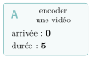
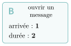
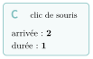
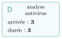
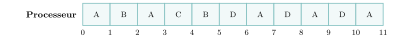

# Activités préparatoires

Processus et ordonnancement

## Activité 1 L’ordonnanceur, c’est vous

*partager un seul processeur entre plusieurs tâches*

Durée : 20 min · Sans ordinateur, par groupes de trois

!!! consignes "Consignes"

    - Rôles : un **processeur** (il ne peut tenir qu’**une seule carte** à la fois, et avance d’une unité de travail par « tic ») ; un **ordonnanceur** (il décide quelle carte donner au processeur) ; un **gardien du temps** (il annonce les tics $0, 1, 2\dots$ et remplit les frises). On change de rôle à chaque partie.

    - Une tâche n’existe qu’à partir de son instant d’**arrivée** ; elle est finie quand elle a reçu autant de tics que sa **durée**.

{ .tikz .tikz-inline loading=lazy } { .tikz .tikz-inline loading=lazy } { .tikz .tikz-inline loading=lazy } { .tikz .tikz-inline loading=lazy }

### Exercice 1 — Première règle : chacun son tour, jusqu’au bout  { #ex-10-processus-et-ordonnancement-act-1-1 }

L’ordonnanceur applique la règle « **premier arrivé, premier servi** » : il donne le processeur à la tâche arrivée le plus tôt et la laisse jusqu’à ce qu’elle soit **finie**.

1.  Jouer la partie. Recopier la frise ci-dessous sur le cahier et écrire dans chaque case la lettre de la tâche qui occupe le processeur pendant ce tic.

    { .tikz .tikz-inline loading=lazy }

2.  À quel instant chacune des tâches A, B, C et D se termine-t-elle ?

3.  Le **temps d’attente** d’une tâche est le nombre de tics pendant lesquels elle était arrivée mais n’avait pas le processeur. Combien de tics le clic de souris C a-t-il attendu, pour une durée de $1$ ?

4.  Du point de vue de l’utilisateur qui vient de cliquer, que s’est-il passé à l’écran ?

??? corrige "Corrigé"

    **1.**

    { .tikz .tikz-inline loading=lazy }

    **2.** A : $5$ ; B : $7$ ; C : $8$ ; D : $11$.

    **3.** C arrive à l’instant $2$ et ne démarre qu’à l’instant $7$ : il attend **5 tics** pour un travail de $1$ tic. (Les autres : A $0$, B $4$, D $5$.)

    **4.** Rien ne se passe pendant longtemps : la souris semble « gelée » tant que la vidéo n’est pas encodée. Une tâche longue arrivée la première bloque toutes les petites.

### Exercice 2 — Deuxième règle : un tic chacun, puis au bout de la file  { #ex-10-processus-et-ordonnancement-act-1-2 }

Nouvelle règle, le **tourniquet** : les tâches arrivées font la **queue** (une file). L’ordonnanceur donne le processeur à la tâche en tête de file pour **un seul tic** ; si elle n’est pas finie, elle repart **au bout de la file**. Si une tâche arrive au même instant, elle se place dans la file *avant* celle qui revient.

1.  Jouer la partie. Recopier les deux frises sur le cahier : sur la première, noter la tâche qui occupe le processeur ; sur la seconde, noter dans chaque case le contenu de la file *à la fin* du tic (tête à gauche).

    { .tikz .tikz-inline loading=lazy }

    { .tikz .tikz-inline loading=lazy }

2.  Combien de tics le clic de souris C attend-il maintenant ? Et B ?

3.  Quelle tâche y perd ? Pourquoi est-ce acceptable pour elle ?

4.  Avec cette règle, l’ordonnanceur intervient beaucoup plus souvent. Quel inconvénient cela peut-il avoir dans une vraie machine ?

??? corrige "Corrigé"

    **5.** À l’instant $1$, B arrive et se place devant A qui revient ; à l’instant $2$, C se place devant B ; à l’instant $3$, D se place devant A.

    { .tikz .tikz-inline loading=lazy }

    { .tikz .tikz-inline loading=lazy }

    **6.** C démarre à l’instant $3$ : il n’attend plus que **1 tic**. B finit à l’instant $5$ : **2 tics** d’attente (au lieu de $4$).

    **7.** La vidéo A finit plus tard ($11$ au lieu de $5$ ; $6$ tics d’attente). C’est acceptable : personne ne regarde la vidéo s’encoder, alors que l’utilisateur attend la réaction à son clic. (D, l’antivirus, finit aussi un peu plus tôt : $10$ au lieu de $11$.)

    **8.** Chaque changement de tâche coûte du temps (il faut ranger l’avancement de l’une et reprendre celui de l’autre) : trop de changements, et le processeur passe une part de son temps à changer au lieu de travailler. (C’est la *commutation de contexte* du cours ; le tic s’appellera *quantum*.)

### Exercice 3 — Deux tâches, deux ressources  { #ex-10-processus-et-ordonnancement-act-1-3 }

Deux nouvelles cartes : **P** (« imprimer un scan ») et **Q** (« numériser puis imprimer »). Sur la table, deux objets uniques : l’**imprimante** et le **scanner** (une gomme et un taille-crayon font l’affaire). Un objet pris n’est rendu que quand la tâche est finie. Les deux joueurs jouent **une ligne chacun, en alternance**, en commençant par P.

| **Script de P**            | **Script de Q**            |
|:---------------------------|:---------------------------|
| 1\. prendre l’imprimante   | 1\. prendre le scanner     |
| 2\. prendre le scanner     | 2\. prendre l’imprimante   |
| 3\. travailler             | 3\. travailler             |
| 4\. rendre les deux objets | 4\. rendre les deux objets |

1.  Jouer la scène. Que se passe-t-il à la ligne 2 de P, puis à la ligne 2 de Q ?

2.  Faire sur le cahier un petit schéma : qui tient quel objet, qui attend quel objet (une flèche par relation).

3.  La situation peut-elle se débloquer toute seule ? Pourquoi ?

4.  Proposer une modification d’**un seul** des deux scripts qui rend ce blocage impossible.

??? corrige "Corrigé"

    **9.** P prend l’imprimante, Q prend le scanner. À sa ligne 2, P demande le scanner, tenu par Q : il doit **attendre**. À sa ligne 2, Q demande l’imprimante, tenue par P : il doit attendre aussi.

    **10.** P tient l’imprimante et attend le scanner ; Q tient le scanner et attend l’imprimante. Les flèches forment une **boucle** : P $\to$ scanner $\to$ Q $\to$ imprimante $\to$ P.

    **11.** Non : chacun rendra son objet quand il aura *fini*, et aucun ne peut finir sans l’objet de l’autre. Personne ne bouge plus jamais.

    **12.** Que Q prenne, lui aussi, l’**imprimante en premier** (lignes 1 et 2 échangées). Celui qui obtient l’imprimante obtiendra ensuite le scanner, l’autre attend son tour : plus de boucle possible. (Autres réponses acceptables : prendre les deux objets d’un coup, ou rendre son objet si l’autre n’est pas libre.)

### Exercice 4 — Ce qu’on a découvert  { #ex-10-processus-et-ordonnancement-act-1-4 }

1.  Recopier et compléter sur le cahier, avec vos mots.

    - Avec un seul processeur, il faut un programme qui…

    - Dans les parties 1 et 2, une tâche pouvait attendre **le processeur**. Dans la partie 3, elle attendait…

      En quoi ces deux attentes sont-elles différentes ?

    - Quand chacun tient ce que l’autre attend,…

??? corrige "Corrigé"

    **13.**

    - … **choisit à chaque instant quelle tâche obtient le processeur** (et pour combien de temps) : c’est l’**ordonnanceur** du système d’exploitation, et la règle choisie est un **compromis**.

    - … **un objet** (une ressource) tenu par une autre tâche. Différence : une tâche qui attend le processeur pourrait avancer tout de suite si on le lui donnait ; une tâche qui attend une ressource ne peut pas avancer, même si le processeur est libre.

    - … plus personne n’avance, pour toujours : c’est un **interblocage**.
