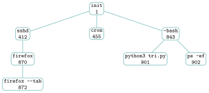
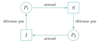

# TP et projets

<p class="sous-titre">Processus et ordonnancement</p>

## <span class="etiquette">TP</span> Observer, ordonnancer, bloquer

*les processus dans un terminal, puis en Python*

<p class="infos-activite">Durée : 2 h 30 à 3 h (deux séances) · Sur machine, par deux</p>

!!! fichiers "Fichiers à télécharger"

    [:material-folder-open: dossier en ligne](https://github.com/MathThibaud/nsi-fichiers-eleves/tree/main/terminale/10-tp-processus){ .md-button } [:material-zip-box: archive .zip](https://github.com/MathThibaud/nsi-fichiers-eleves/raw/main/zips/terminale-10-tp-processus.zip){ .md-button }

!!! consignes "Consignes"

    - Partie A : un **terminal** Linux (celui du lycée, ou **JSLinux** dans le navigateur : `bellard.org/jslinux`, machine « Alpine Linux », console). Parties B et C : Python (éditeur au choix).

    - Fichier à télécharger (lien ci-dessus) : `tp_processus_depart.py` (squelettes des fonctions de la partie B et tests automatiques).

    - Niveau : ★ échauffement, ★★ classique (niveau bac), ★★★ défi ; les *coups de pouce* et les *corrigés* se déplient sous chaque exercice. Le symbole <span class="run" title="À programmer et tester sur machine">▶</span>  signale ce qui est à taper, programmer ou tester.

    - Usage de l’IA, indiqué sur chaque exercice : <span class="ia ia-rouge" title="Sans IA : le but est l'automatisme lui-même"></span> aucune ; <span class="ia ia-orange" title="IA en appui : déboguer, reformuler, vérifier ; la réponse finale est la vôtre"></span> en appui (déboguer, reformuler, vérifier ; la réponse finale est écrite et comprise par vous) ; <span class="ia ia-vert" title="IA intégrée : l'exercice s'appuie sur une réponse d'IA"></span> l’exercice s’appuie sur une réponse d’IA. Voir la [charte d’usage de l’IA](../charte.md).

!!! encadre "But du TP"

    Mettre en pratique **tout le chapitre** : **observer** de vrais processus (PID, PPID, arrière-plan, `kill`), **programmer un simulateur d’ordonnancement** (premier arrivé, plus court d’abord, tourniquet) qui trace un **diagramme de Gantt** et calcule les temps moyens, puis **provoquer, guérir et éviter un interblocage** avec deux fils d’exécution et deux verrous. *Produit final* : un simulateur qui compare les stratégies sur un même jeu de processus, et un bilan chiffré.

## Partie A — Observer et gérer les processus dans un terminal

### <span class="stars" title="Niveau 1 sur 3">★</span> <span class="exo-num">Exercice 1</span> — Premiers pas : qui suis-je ? <span class="ia ia-orange" title="IA en appui : déboguer, reformuler, vérifier ; la réponse finale est la vôtre"></span> { #ex-10-processus-et-ordonnancement-tp-1-1 }

<span class="run" title="À programmer et tester sur machine">▶</span>  Ouvrir un terminal et taper les commandes suivantes, une par une.

```console
$ ps
$ echo $$
$ ps -o pid,ppid,comm
```

1.  `echo $$` affiche le PID du **shell** (l’interpréteur de commandes dans lequel on tape). Le retrouver dans la sortie de `ps`.

2.  Dans la sortie de `ps -o pid,ppid,comm`, quel est le PPID de la ligne `ps` ? Expliquer pourquoi la commande `ps` apparaît **dans sa propre sortie**.

3.  Retaper `ps -o pid,ppid,comm` : le PID de `ps` a-t-il changé ? Pourquoi ?

??? corrige "Corrigé"

    - Sur `JEU_TP` : SRTF ($1{,}83$) $<$ tourniquet q1 ($3{,}33$) $<$ q2 ($3{,}67$) $<$ SJF ($3{,}83$) $<$ q4 ($4{,}5$) $<$ FCFS ($4{,}67$). Serveur de calcul (lots de tâches, durées connues) : plus court d’abord, peu de commutations. Bureau : tourniquet, pour la réactivité.

    - Quantum : petit = réactif mais beaucoup de commutations coûteuses ; grand = efficace mais on retombe sur FCFS.

    - L’interblocage naît de l’**interaction** de programmes corrects séparément. Le subir (tout se fige : on tue un processus) ; le guérir (délai, abandon : travail perdu) ; l’éviter (ordre fixe : contrainte de conception, mais aucun coût à l’exécution).

    - Un ordonnanceur réel vit dans le noyau, s’exécute des milliers de fois par seconde et manipule les registres : il est écrit en C et en assembleur ; Python sert à *simuler* et comprendre.

    **1.** Le PID affiché par `echo $$` est celui de la ligne `sh` (ou `bash`) dans la sortie de `ps`.

    **2.** Le PPID de `ps` est le PID du shell : c’est le shell qui a lancé la commande. `ps` se voit lui-même car, au moment où il lit la liste des processus, il est *lui-même* un processus en cours d’exécution.

    **3.** Le PID change : chaque commande tapée crée un **nouveau** processus (un nouveau numéro, en général le suivant libre), qui disparaît une fois la commande terminée. Un programme (`ps`) peut donc donner de nombreux processus successifs.

### <span class="stars" title="Niveau 1 sur 3">★</span> <span class="exo-num">Exercice 2</span> — Lire une sortie de `ps -ef` <span class="ia ia-orange" title="IA en appui : déboguer, reformuler, vérifier ; la réponse finale est la vôtre"></span> { #ex-10-processus-et-ordonnancement-tp-1-2 }

Sur une autre machine, on a obtenu la sortie suivante (colonnes utiles : **PID**, **PPID** et **CMD**, la commande lancée).

```console
$ ps -ef
UID     PID  PPID  STIME  TTY    CMD
root      1     0  09:14  ?      /sbin/init
root    412     1  09:14  ?      /usr/sbin/sshd
root    455     1  09:14  ?      /usr/sbin/cron
mathis  843     1  09:15  tty1   -bash
mathis  870   412  09:16  ?      firefox
mathis  872   870  09:16  ?      firefox --tab
mathis  901   843  09:20  tty1   python3 tri.py
mathis  902   843  09:21  tty1   ps -ef
```

1.  Dessiner l’**arbre des processus** (un nœud par PID, avec le nom de la commande), de racine `init`.

2.  Qui est le père de `python3 tri.py` ? Depuis quoi l’utilisateur l’a-t-il lancé ?

3.  Quels processus sont des **frères** de `ps -ef` ? Quel processus a le plus de descendants ?

4.  `init` a pour PPID $0$ : que signifie ce $0$ ?

??? corrige "Corrigé"

    **1.** Arbre des processus :

    { .tikz loading=lazy }

    **2.** Le père de `python3 tri.py` (901) est `-bash` (843) : il a été lancé depuis le terminal.

    **3.** Les frères de `ps -ef` sont les autres fils de 843 : `python3 tri.py`. Le processus qui a le plus de descendants est `init` (tous les autres) ; parmi ses fils, `sshd` et `-bash` en ont deux chacun.

    **4.** Le $0$ désigne le processus de démarrage du système, qui n’est pas un vrai processus utilisateur : `init` est la racine de l’arbre.

### <span class="stars" title="Niveau 1 sur 3">★</span> <span class="exo-num">Exercice 3</span> — Premier plan, arrière-plan, `kill` <span class="ia ia-orange" title="IA en appui : déboguer, reformuler, vérifier ; la réponse finale est la vôtre"></span> { #ex-10-processus-et-ordonnancement-tp-1-3 }

La commande `sleep 300` ne fait rien pendant $300$ secondes : un processus « bloqué » idéal pour l’expérience.

1.  <span class="run" title="À programmer et tester sur machine">▶</span>  Taper `sleep 5`. Peut-on taper une autre commande pendant ces $5$ secondes ? On dit que `sleep` s’exécute au **premier plan**.

2.  <span class="run" title="À programmer et tester sur machine">▶</span>  Taper `sleep 300 &`, puis `sleep 400 &`, puis `jobs` et `ps -o pid,ppid,comm`. Que change le `&` ? Quel est le PPID des deux `sleep` ? Comparer avec `echo $$`.

3.  <span class="run" title="À programmer et tester sur machine">▶</span>  Arrêter le premier `sleep` avec `kill <PID>` (en remplaçant `<PID>` par son numéro), puis le second avec `kill %2` (`%2` désigne la tâche numéro 2 de `jobs`). Vérifier avec `jobs` et `ps`.

4.  Recopier et compléter le **tableau-mémo** des commandes rencontrées :

| **Commande**          | **Rôle** | **Exemple tapé** |
|:----------------------|:---------|:-----------------|
| `ps -o pid,ppid,comm` |          |                  |
| `<commande> &`        |          |                  |
| `jobs`                |          |                  |
| `kill <PID>`          |          |                  |
| `top`                 |          |                  |

??? corrige "Corrigé"

    **1.** Non : le shell attend la fin de `sleep 5` avant de rendre l’invite.

    **2.** Le `&` lance la commande en **arrière-plan** : le shell rend la main aussitôt. `jobs` affiche `[1] sleep 300` et `[2] sleep 400` ; les deux `sleep` ont pour PPID le PID du shell (celui donné par `echo $$`).

    **3.** Après les deux `kill`, `jobs` signale les tâches « `Terminated` » puis ne montre plus rien ; elles ont disparu de `ps`.

    **4.** Tableau-mémo :

    | **Commande** | **Rôle** | **Exemple** |
    |:---|:---|:---|
    | `ps -o pid,ppid,comm` | liste les processus avec PID, PPID et nom de commande | `ps -o pid,ppid,comm` |
    | `<commande> &` | lance en arrière-plan, le shell rend la main | `sleep 300 &` |
    | `jobs` | tâches lancées depuis ce shell, numérotées `[1]`, `[2]`… | `jobs` |
    | `kill <PID>` | envoie au processus un signal d’arrêt (`kill %n` : tâche $n$) | `kill 1234`, `kill %2` |
    | `top` | liste rafraîchie en temps réel (CPU, mémoire, état) ; `q` pour quitter | `top` |

### <span class="stars" title="Niveau 2 sur 3">★★</span> <span class="exo-num">Exercice 4</span> — Une famille de processus, et un glouton <span class="ia ia-orange" title="IA en appui : déboguer, reformuler, vérifier ; la réponse finale est la vôtre"></span> { #ex-10-processus-et-ordonnancement-tp-1-4 }

1.  <span class="run" title="À programmer et tester sur machine">▶</span>  Taper `sh` : cela lance un **nouveau** shell, fils du premier. Taper `echo $$`, puis `sleep 500 &`, puis `ps -o pid,ppid,comm`. Écrire la **chaîne** des PID depuis le premier shell jusqu’au `sleep` (père $\to$ fils $\to$ petit-fils). Taper ensuite `exit` pour revenir au premier shell. *(Si la commande `pstree` existe sur la machine, l’essayer.)*

2.  <span class="run" title="À programmer et tester sur machine">▶</span>  Lancer `yes > /dev/null &` (`yes` écrit des « y » sans fin, envoyés à la poubelle `/dev/null`), puis `top`. Quel processus est en tête ? Quel pourcentage du processeur utilise-t-il ? Quitter `top` avec la touche `q`.

3.  Dans `top`, la colonne `S` (ou `STAT`) donne l’état : `R` (*running*) ou `S` (*sleeping*). Associer chacune de ces deux lettres à un état du cours (élu/prêt, ou bloqué). Dans quel état est `sleep 500` ? et `yes` ?

4.  <span class="run" title="À programmer et tester sur machine">▶</span>  Arrêter `yes` avec `kill`, et vérifier dans `top` que le processeur est libéré. **Ne jamais** tuer un processus dont on ne connaît pas le rôle (surtout pas le PID $1$ !).

??? corrige "Corrigé"

    **1.** Chaîne attendue : premier shell (PID $a$) $\to$ `sh` (PID $b$, PPID $a$) $\to$ `sleep 500` (PPID $b$). *Remarque* : après `exit`, le `sleep 500` continue de tourner ; son père a disparu, il est « adopté » (son PPID devient en général $1$). Le faire constater, puis le tuer.

    **2.** `yes` est en tête de `top`, avec près de $100\,\%$ d’un cœur (le pourcentage exact dépend de la machine ; sous JSLinux, l’émulateur est lent mais `yes` prend tout ce qu’il peut).

    **3.** `R` (*running*) $\leftrightarrow$ **élu ou prêt** (le processus veut le processeur) ; `S` (*sleeping*) $\leftrightarrow$ **bloqué** (il attend un événement). `sleep 500` est `S` (il attend l’expiration d’un délai), `yes` est `R`.

    **4.** Après `kill`, l’occupation du processeur retombe près de $0\,\%$.

## Partie B — Programmer un simulateur d’ordonnancement

Un processus est représenté par un triplet `(nom, arrivee, duree)`. Un **chronogramme** est une liste dont la case d’indice `t` contient le nom du processus élu pendant l’unité de temps $[t\,;\,t+1]$, ou `"."` si le processeur n’a rien à faire. Par exemple, pour le jeu du cours `JEU_COURS = [("A", 0, 4), ("B", 1, 3), ("C", 2, 1), ("D", 3, 2)]`, la stratégie « premier arrivé, premier servi » donne :

```python
["A", "A", "A", "A", "B", "B", "B", "C", "D", "D"]
```

On rappelle : **temps de séjour** $=$ instant de fin $-$ instant d’arrivée ; **temps d’attente** $=$ temps de séjour $-$ durée. Lancer le fichier `tp_processus_depart.py` affiche l’état des tests (`OK`, `ECHEC`, `ERREUR`) : les faire passer un à un.

### <span class="stars" title="Niveau 1 sur 3">★</span> <span class="exo-num">Exercice 5</span> — Premier arrivé, premier servi <span class="ia ia-orange" title="IA en appui : déboguer, reformuler, vérifier ; la réponse finale est la vôtre"></span> { #ex-10-processus-et-ordonnancement-tp-1-5 }

1.  <span class="run" title="À programmer et tester sur machine">▶</span>  Compléter `fcfs(procs)`. Les processus sont servis par ordre d’arrivée, chacun jusqu’au bout. **Attention** : si le prochain processus n’est pas encore arrivé, le processeur attend (on ajoute des `"."`). Exemple : `fcfs([("X", 2, 1)])` renvoie `[".", ".", "X"]`.

    ??? pouce "Coup de pouce"

        Écrire d’abord une fonction `trier_par_arrivee(procs)` qui renvoie une copie de la liste triée par instant d’arrivée (tri par insertion de 1re, en comparant les éléments d’indice `1` des triplets). Puis garder une variable `t` (l’instant courant) : tant que `t` est inférieur à l’arrivée du processus, ajouter `"."` et avancer `t`.

2.  <span class="run" title="À programmer et tester sur machine">▶</span>  Compléter `gantt_ligne(chrono)`, qui renvoie le chronogramme sous forme de chaîne (`"AAAABBBCDD"`). Comparer au chronogramme du cours.

??? corrige "Corrigé"

    ```python
    def trier_par_arrivee(procs):
        # tri par insertion selon l'instant d'arrivee
        t = [p for p in procs]
        for i in range(1, len(t)):
            j = i
            while j > 0 and t[j - 1][1] > t[j][1]:
                t[j - 1], t[j] = t[j], t[j - 1]
                j = j - 1
        return t

    def fcfs(procs):
        chrono = []
        t = 0
        for nom, arrivee, duree in trier_par_arrivee(procs):
            while t < arrivee:          # processeur inoccupe
                chrono.append(".")
                t = t + 1
            for k in range(duree):
                chrono.append(nom)
                t = t + 1
        return chrono

    def gantt_ligne(chrono):
        s = ""
        for c in chrono:
            s = s + c
        return s
    ```

    `gantt_ligne(fcfs(JEU_COURS))` vaut `"AAAABBBCDD"` : c’est le chronogramme du cours.

### <span class="stars" title="Niveau 1 sur 3">★</span> <span class="exo-num">Exercice 6</span> — Mesurer : temps de séjour et d’attente <span class="ia ia-orange" title="IA en appui : déboguer, reformuler, vérifier ; la réponse finale est la vôtre"></span> { #ex-10-processus-et-ordonnancement-tp-1-6 }

1.  <span class="run" title="À programmer et tester sur machine">▶</span>  Compléter `statistiques(chrono, procs)`, qui renvoie un dictionnaire `nom -> (sejour, attente)`. L’instant de fin d’un processus est `i + 1`, où `i` est le **dernier** indice où il apparaît dans le chronogramme. Exemple : pour FCFS sur `JEU_COURS`, `C` a pour valeur `(6, 5)`.

2.  <span class="run" title="À programmer et tester sur machine">▶</span>  Compléter `moyennes(stats)`, qui renvoie le couple (séjour moyen, attente moyenne). Retrouver l’attente moyenne $3{,}25$ du cours.

??? corrige "Corrigé"

    ```python
    def statistiques(chrono, procs):
        stats = {}
        for nom, arrivee, duree in procs:
            fin = 0
            for i in range(len(chrono)):
                if chrono[i] == nom:
                    fin = i + 1
            sejour = fin - arrivee
            stats[nom] = (sejour, sejour - duree)
        return stats

    def moyennes(stats):
        total_sejour = 0
        total_attente = 0
        for nom in stats:
            sejour, attente = stats[nom]
            total_sejour = total_sejour + sejour
            total_attente = total_attente + attente
        n = len(stats)
        return (total_sejour / n, total_attente / n)
    ```

    FCFS sur `JEU_COURS` : `{’A’: (4, 0), ’B’: (6, 3), ’C’: (6, 5), ’D’: (7, 5)}`, moyennes `(5.75, 3.25)`.

### <span class="stars" title="Niveau 2 sur 3">★★</span> <span class="exo-num">Exercice 7</span> — Le plus court d’abord <span class="ia ia-orange" title="IA en appui : déboguer, reformuler, vérifier ; la réponse finale est la vôtre"></span> { #ex-10-processus-et-ordonnancement-tp-1-7 }

<span class="run" title="À programmer et tester sur machine">▶</span>  Compléter `sjf(procs)` (version **non préemptive**) : chaque fois que le processeur se libère, on élit, parmi les processus **déjà arrivés** et non traités, celui de plus petite durée, et on l’exécute jusqu’au bout. S’il n’y a aucun processus prêt, on ajoute un `"."`. Vérifier qu’on retrouve `"AAAACDDBBB"` et l’attente moyenne $2{,}5$ du cours.

??? corrige "Corrigé"

    ```python
    def sjf(procs):
        chrono = []
        t = 0
        restants = [p for p in procs]
        while restants != []:
            elu = None
            for p in restants:          # le plus court parmi les arrives
                if p[1] <= t and (elu is None or p[2] < elu[2]):
                    elu = p
            if elu is None:             # aucun processus pret
                chrono.append(".")
                t = t + 1
            else:
                restants.remove(elu)
                for k in range(elu[2]):
                    chrono.append(elu[0])
                    t = t + 1
        return chrono
    ```

    `"AAAACDDBBB"`, attente moyenne $2{,}5$ (séjour moyen $5$).

### <span class="stars" title="Niveau 2 sur 3">★★</span> <span class="exo-num">Exercice 8</span> — Le tourniquet <span class="ia ia-orange" title="IA en appui : déboguer, reformuler, vérifier ; la réponse finale est la vôtre"></span> { #ex-10-processus-et-ordonnancement-tp-1-8 }

1.  <span class="run" title="À programmer et tester sur machine">▶</span>  Compléter `tourniquet(procs, quantum)`. La file des processus prêts est une liste : on retire en tête (`pop(0)`), on ajoute en queue (`append`). L’élu s’exécute `min(quantum, reste)` unités. **Convention du cours** : les processus arrivés *pendant* ce quantum entrent dans la file **avant** que l’élu, s’il n’a pas fini, n’y retourne.

    ??? pouce "Coup de pouce"

        Utiliser un dictionnaire `reste` (nom $\to$ durée restant à faire) et la liste `a_venir = trier_par_arrivee(procs)`. Écrire une boucle `while a_venir != [] or file != []` ; au début de chaque tour, faire entrer dans la file tous les processus de `a_venir` dont l’arrivée est $\leqslant$ `t`.

2.  Vérifier : quantum $1$ $\to$ `"ABACBDABDA"` (le chronogramme du cours) ; quantum $2$ $\to$ `"AABBCAADDB"`.

3.  <span class="run" title="À programmer et tester sur machine">▶</span>  Compléter `commutations(chrono)` : le nombre de fois où le processeur passe d’un processus à un **autre** processus (les `"."` ne comptent pas). Exemple : `commutations([c for c in "AAB..BCA"])` vaut $3$. Combien de commutations pour le tourniquet de quantum $1$ sur `JEU_COURS` ? et pour FCFS ?

??? corrige "Corrigé"

    **1.**

    ```python
    def tourniquet(procs, quantum):
        a_venir = trier_par_arrivee(procs)       # fonction de l'exercice 5
        reste = {}
        for nom, arrivee, duree in procs:
            reste[nom] = duree
        file = []
        chrono = []
        t = 0
        while a_venir != [] or file != []:
            while a_venir != [] and a_venir[0][1] <= t:   # arrivees
                file.append(a_venir.pop(0)[0])
            if file == []:
                chrono.append(".")
                t = t + 1
            else:
                elu = file.pop(0)
                n = min(quantum, reste[elu])
                for k in range(n):
                    chrono.append(elu)
                    t = t + 1
                reste[elu] = reste[elu] - n
                while a_venir != [] and a_venir[0][1] <= t:  # arrivees pendant le quantum
                    file.append(a_venir.pop(0)[0])
                if reste[elu] > 0:
                    file.append(elu)                       # en queue, APRES les arrivees
        return chrono
    ```

    **2.** On obtient bien `"ABACBDABDA"` (quantum 1, attente moyenne $3{,}75$) et `"AABBCAADDB"` (quantum 2, attente moyenne $3{,}75$ aussi).

    **3.**

    ```python
    def commutations(chrono):
        c = 0
        for i in range(1, len(chrono)):
            if chrono[i] != chrono[i - 1] and chrono[i] != "." and chrono[i - 1] != ".":
                c = c + 1
        return c
    ```

    Sur `JEU_COURS` : $9$ commutations pour le tourniquet de quantum 1, $3$ pour FCFS.

### <span class="stars" title="Niveau 2 sur 3">★★</span> <span class="exo-num">Exercice 9</span> — Un vrai diagramme de Gantt <span class="ia ia-orange" title="IA en appui : déboguer, reformuler, vérifier ; la réponse finale est la vôtre"></span> { #ex-10-processus-et-ordonnancement-tp-1-9 }

<span class="run" title="À programmer et tester sur machine">▶</span>  Compléter `gantt(chrono, procs)`, qui renvoie une chaîne de plusieurs lignes : une ligne par processus, avec `#` quand il est élu, `.` quand il **attend** (arrivé mais pas fini), une espace sinon ; puis un axe gradué de $5$ en $5$. On l’affiche avec `print(gantt(tourniquet(JEU_COURS, 2), JEU_COURS))` :

```console
A  |##...##   |
B  | .##.....#|
C  |  ..#     |
D  |   ....## |
    0    5    10
```

Que représente le nombre de `.` d’une ligne ?

??? pouce "Coup de pouce"

    Pour chaque processus, calculer d’abord son instant de fin ; puis parcourir `t` de `0` à `len(chrono) - 1` et choisir le caractère à ajouter. Pour aligner les noms : `nom.ljust(3)` ; pour l’axe : `str(t).ljust(5)` pour `t` allant de 0 à `len(chrono)` de 5 en 5.

??? corrige "Corrigé"

    ```python
    def gantt(chrono, procs):
        lignes = ""
        for nom, arrivee, duree in procs:
            fin = 0
            for i in range(len(chrono)):
                if chrono[i] == nom:
                    fin = i + 1
            ligne = ""
            for t in range(len(chrono)):
                if chrono[t] == nom:
                    ligne = ligne + "#"
                elif arrivee <= t and t < fin:     # arrive mais pas fini
                    ligne = ligne + "."
                else:
                    ligne = ligne + " "
            lignes = lignes + nom.ljust(3) + "|" + ligne + "|\n"
        axe = ""
        for t in range(0, len(chrono) + 1, 5):
            axe = axe + str(t).ljust(5)
        return lignes + "    " + axe
    ```

    Le nombre de `.` d’une ligne est exactement le **temps d’attente** du processus (arrivé, pas fini, pas élu).

### <span class="stars" title="Niveau 2 sur 3">★★</span> <span class="exo-num">Exercice 10</span> — Campagne de mesures <span class="ia ia-orange" title="IA en appui : déboguer, reformuler, vérifier ; la réponse finale est la vôtre"></span> { #ex-10-processus-et-ordonnancement-tp-1-10 }

On travaille maintenant sur le jeu `JEU_TP` du fichier (six processus, dont deux arrivent tard) :

| Processus |  A  |  B  |  C  |  D  |  E  |  F  |
|:---------:|:---:|:---:|:---:|:---:|:---:|:---:|
|  Arrivée  |  0  |  1  |  2  |  4  | 18  | 19  |
|   Durée   |  8  |  2  |  5  |  1  |  3  |  1  |

1.  <span class="run" title="À programmer et tester sur machine">▶</span>  Afficher le diagramme de Gantt de FCFS. Que se passe-t-il entre les instants $16$ et $18$ ?

2.  <span class="run" title="À programmer et tester sur machine">▶</span>  Recopier et compléter le tableau (valeurs arrondies au centième) :

| **Stratégie** | **Séjour moyen** | **Attente moyenne** | **Commutations** |
|:---|:--:|:--:|:--:|
| Premier arrivé (FCFS) |  |  |  |
| Plus court d’abord (SJF) |  |  |  |
| Tourniquet, quantum 1 |  |  |  |
| Tourniquet, quantum 2 |  |  |  |
| Tourniquet, quantum 4 |  |  |  |

1.  <span class="run" title="À programmer et tester sur machine">▶</span>  Écrire une boucle qui affiche, pour un quantum allant de $1$ à $8$, l’attente moyenne et le nombre de commutations du tourniquet. Décrire l’évolution. Avec un quantum de $8$, à quelle stratégie le tourniquet ressemble-t-il ici ?

2.  Dans un vrai système, chaque commutation de contexte **coûte** du temps (sauvegarder puis restaurer les registres). Expliquer pourquoi on ne choisit ni un quantum minuscule, ni un quantum énorme.

??? corrige "Corrigé"

    **1.** Diagramme FCFS sur `JEU_TP` : entre $16$ et $18$, aucun processus n’est prêt (`E` arrive à $18$) : le processeur est **inoccupé** (deux `"."` dans le chronogramme).

    ```console
    A  |########              |
    B  | .......##            |
    C  |  ........#####       |
    D  |    ...........#      |
    E  |                  ### |
    F  |                   ..#|
        0    5    10   15   20
    ```

    **2.** Valeurs obtenues :

    | **Stratégie** | **Séjour moyen** | **Attente moyenne** | **Commutations** |
    |:---|:--:|:--:|:--:|
    | Premier arrivé (FCFS) | $8{,}00$ | $4{,}67$ | $4$ |
    | Plus court d’abord (SJF) | $7{,}17$ | $3{,}83$ | $4$ |
    | Tourniquet, quantum 1 | $6{,}67$ | $3{,}33$ | $16$ |
    | Tourniquet, quantum 2 | $7{,}00$ | $3{,}67$ | $10$ |
    | Tourniquet, quantum 4 | $7{,}83$ | $4{,}50$ | $6$ |

    *Remarque* : ici, le tourniquet de quantum 1 bat le plus court d’abord *non préemptif* en attente moyenne, car le long processus `A` (arrivé le premier) monopolise le processeur $8$ unités en SJF. Le résultat « SJF est optimal » du cours vaut quand tous les processus sont présents au départ.

    **3.**

    ```python
    for q in range(1, 9):
        c = tourniquet(JEU_TP, q)
        print(q, moyennes(statistiques(c, JEU_TP))[1], commutations(c))
    ```

    | quantum | 1 | 2 | 3 | 4 | 5 | 6 | 7 | 8 |
    |:--:|:--:|:--:|:--:|:--:|:--:|:--:|:--:|:--:|
    | attente moyenne | $3{,}33$ | $3{,}67$ | $4{,}33$ | $4{,}5$ | $4{,}5$ | $5{,}0$ | $5{,}5$ | $4{,}67$ |
    | commutations | 16 | 10 | 7 | 6 | 5 | 5 | 5 | 4 |

    Quand le quantum augmente, les commutations diminuent fortement et l’attente moyenne augmente (pas tout à fait régulièrement : elle redescend à $8$). Avec un quantum de $8$ ($\geqslant$ la plus longue durée), aucun processus n’est jamais interrompu : le tourniquet **devient FCFS** (même chronogramme, $4{,}67$).

    **4.** Quantum minuscule : le processeur passe une part importante de son temps à commuter (travail inutile pour l’utilisateur). Quantum énorme : on retombe sur FCFS, un gros calcul bloque tout le monde et la machine n’est plus réactive. On choisit un quantum de quelques millisecondes : grand devant le coût d’une commutation, petit devant le temps de réaction humain.

### <span class="stars" title="Niveau 3 sur 3">★★★</span> <span class="exo-num">Exercice 11</span> — Défi : le plus court temps restant d’abord <span class="ia ia-orange" title="IA en appui : déboguer, reformuler, vérifier ; la réponse finale est la vôtre"></span> { #ex-10-processus-et-ordonnancement-tp-1-11 }

Variante **préemptive** du plus court d’abord (*SRTF*) : **à chaque unité de temps**, on élit le processus prêt dont le temps **restant** est le plus petit — quitte à interrompre l’élu si un plus court arrive.

1.  <span class="run" title="À programmer et tester sur machine">▶</span>  Écrire `srtf(procs)`. Sur `JEU_COURS`, on doit obtenir `"AACAADDBBB"`.

2.  <span class="run" title="À programmer et tester sur machine">▶</span>  Comparer son attente moyenne sur `JEU_TP` à celles du tableau. Quel processus en fait les frais ? Quel risque du cours retrouve-t-on ?

??? corrige "Corrigé"

    ```python
    def srtf(procs):
        reste = {}
        arrivee = {}
        a_faire = 0                     # unites de travail restant en tout
        for nom, a, d in procs:
            reste[nom] = d
            arrivee[nom] = a
            a_faire = a_faire + d
        chrono = []
        t = 0
        while a_faire > 0:
            elu = None
            for nom in reste:           # le plus petit temps restant parmi les arrives
                if reste[nom] > 0 and arrivee[nom] <= t:
                    if elu is None or reste[nom] < reste[elu]:
                        elu = nom
            if elu is None:
                chrono.append(".")
            else:
                chrono.append(elu)
                reste[elu] = reste[elu] - 1
                a_faire = a_faire - 1
            t = t + 1
        return chrono
    ```

    **1.** `"AACAADDBBB"` sur `JEU_COURS` (attente moyenne $2{,}25$).

    **2.** Sur `JEU_TP` : `"ABBCDCCCCAAAAAAA..EFEE"`, attente moyenne $1{,}83$, la meilleure de toutes. Mais `A` attend $8$ unités et finit en dernier parmi les quatre premiers : c’est le risque de **famine** des longs processus (si de petits processus arrivaient sans cesse, `A` ne finirait jamais).

## Partie C — Provoquer, guérir et éviter un interblocage

En Python, le module `threading` permet de lancer plusieurs **fils d’exécution** (*threads*) qui avancent « en même temps », comme des processus. Un **verrou** (`threading.Lock()`) modélise une ressource qu’un seul fil peut détenir : `with verrou:` attend de l’obtenir, puis le libère automatiquement à la fin du bloc.

### <span class="stars" title="Niveau 1 sur 3">★</span> <span class="exo-num">Exercice 12</span> — Provoquer un interblocage (sans rester bloqué !) <span class="ia ia-orange" title="IA en appui : déboguer, reformuler, vérifier ; la réponse finale est la vôtre"></span> { #ex-10-processus-et-ordonnancement-tp-1-12 }

<span class="run" title="À programmer et tester sur machine">▶</span>  Recopier et exécuter le programme suivant.

```python
import threading, time

imprimante = threading.Lock()
scanner = threading.Lock()

def p1():
    with imprimante:
        print("P1 tient l'imprimante, demande le scanner")
        time.sleep(0.1)
        with scanner:
            print("P1 imprime et scanne")

def p2():
    with scanner:
        print("P2 tient le scanner, demande l'imprimante")
        time.sleep(0.1)
        with imprimante:
            print("P2 imprime et scanne")

t1 = threading.Thread(target=p1, daemon=True)
t2 = threading.Thread(target=p2, daemon=True)
t1.start()
t2.start()
t1.join(timeout=2)      # on attend P1 au plus 2 secondes
t2.join(timeout=2)
if t1.is_alive() and t2.is_alive():
    print("Au bout de 4 s, P1 et P2 sont toujours bloqués : interblocage !")
else:
    print("Tout s'est bien terminé.")
```

1.  Quels messages s’affichent ? Les lignes `"... imprime et scanne"` apparaissent-elles ?

2.  Dessiner le **graphe d’attente** au moment du blocage, et y repérer le cycle.

3.  À quoi sert `time.sleep(0.1)` ? Relancer après l’avoir supprimé des deux fonctions (plusieurs fois) : l’interblocage se produit-il toujours ? Qu’en déduire sur ce type de panne ?

4.  Sans `timeout` ni `daemon=True`, le programme ne s’arrêterait jamais. Expliquer le rôle de chacun.

??? corrige "Corrigé"

    **1.** Sortie obtenue (en 4 s environ) :

    ```console
    P1 tient l'imprimante, demande le scanner
    P2 tient le scanner, demande l'imprimante
    Au bout de 4 s, P1 et P2 sont toujours bloqués : interblocage !
    ```

    Les lignes `"... imprime et scanne"` n’apparaissent jamais.

    **2.** Graphe d’attente (cycle $P_1 \to S \to P_2 \to I \to P_1$) :

    { .tikz loading=lazy }

    **3.** Le `sleep(0.1)` laisse à l’autre fil le temps de prendre sa première ressource : il **force** le mauvais entrelacement. Sans lui, P1 a presque toujours le temps de prendre les deux verrous avant que P2 démarre : 5 essais sur 5 sans blocage. Un interblocage est donc une panne **intermittente**, qui dépend du hasard de l’ordonnancement : un programme peut passer tous ses tests et se figer un jour en production.

    **4.** `join(timeout=2)` : le programme principal n’attend chaque fil que 2 s au plus, au lieu d’attendre indéfiniment. `daemon=True` : à la fin du programme principal, Python n’attend pas ces fils (encore bloqués) pour s’arrêter.

### <span class="stars" title="Niveau 2 sur 3">★★</span> <span class="exo-num">Exercice 13</span> — Guérir : abandonner au bout d’un délai <span class="ia ia-orange" title="IA en appui : déboguer, reformuler, vérifier ; la réponse finale est la vôtre"></span> { #ex-10-processus-et-ordonnancement-tp-1-13 }

La méthode `verrou.acquire(timeout=1)` tente d’obtenir le verrou pendant au plus $1$ seconde : elle renvoie `True` si c’est réussi, `False` sinon ; on libère alors avec `verrou.release()`.

1.  <span class="run" title="À programmer et tester sur machine">▶</span>  Écrire une fonction `tache(nom, premier, second, journal)` qui prend le verrou `premier` (avec `with`), attend $0{,}1$ s, puis **tente** d’obtenir `second` pendant $1$ s : en cas de succès, ajouter à la liste `journal` le message `nom + " a les deux ressources"` puis libérer `second` ; sinon ajouter `nom + " abandonne"`.

2.  <span class="run" title="À programmer et tester sur machine">▶</span>  Lancer deux fils : `tache("P1", imprimante, scanner, journal)` et `tache("P2", scanner, imprimante, journal)` (utiliser `args=(...)` dans `threading.Thread`), attendre leur fin avec `join()` et afficher `journal`. Relancer cinq fois : le résultat est-il toujours le même ?

3.  Laquelle des quatre conditions de Coffman <span class="horsprog">au-delà du programme</span> l’abandon casse-t-il ?

??? corrige "Corrigé"

    ```python
    def tache(nom, premier, second, journal):
        with premier:
            time.sleep(0.1)
            if second.acquire(timeout=1):
                journal.append(nom + " a les deux ressources")
                second.release()
            else:
                journal.append(nom + " abandonne")

    imprimante = threading.Lock()
    scanner = threading.Lock()
    journal = []
    t1 = threading.Thread(target=tache, args=("P1", imprimante, scanner, journal))
    t2 = threading.Thread(target=tache, args=("P2", scanner, imprimante, journal))
    t1.start()
    t2.start()
    t1.join()
    t2.join()
    print(journal)
    ```

    **2.** Le résultat **varie** d’une exécution à l’autre (environ 1,1 s à chaque fois). Sur six essais : quatre fois `[’P1 abandonne’, ’P2 abandonne’]` (dans un ordre ou l’autre), deux fois `[’P2 abandonne’, ’P1 a les deux ressources’]` : celui qui abandonne le premier libère sa ressource, que l’autre obtient juste avant la fin de son délai.

    **3.** En abandonnant, le fil **libère** ce qu’il détient : on casse la condition « **détention et attente** » (on peut aussi dire qu’il renonce de lui-même, ce qui revient à une préemption). Le coût : du travail perdu, à recommencer.

### <span class="stars" title="Niveau 2 sur 3">★★</span> <span class="exo-num">Exercice 14</span> — Éviter : toujours le même ordre <span class="ia ia-orange" title="IA en appui : déboguer, reformuler, vérifier ; la réponse finale est la vôtre"></span> { #ex-10-processus-et-ordonnancement-tp-1-14 }

<span class="run" title="À programmer et tester sur machine">▶</span>  Relancer l’exercice précédent en faisant demander à **P2 aussi** l’imprimante **avant** le scanner. Que contient le journal ? Combien de temps dure l’exécution (mesurer avec `time.time()` avant et après) ? Expliquer pourquoi, avec un **ordre fixe** d’acquisition, un cycle d’attente est impossible.

??? corrige "Corrigé"

    Avec `args=("P2", imprimante, scanner, journal)`, le journal vaut toujours `[’P1 a les deux ressources’, ’P2 a les deux ressources’]` et l’exécution dure environ $0{,}2$ s (au lieu de $1{,}1$ s). Celui qui obtient l’imprimante en premier obtient ensuite le scanner, que personne d’autre ne peut détenir sans avoir d’abord l’imprimante : aucun fil ne peut détenir le scanner en attendant l’imprimante, donc le cycle $I \to \dots \to S \to \dots \to I$ ne peut pas se former. On casse l’**attente circulaire**.

### <span class="stars" title="Niveau 2 sur 3">★★</span> <span class="exo-num">Exercice 15</span> — Détecter : chercher un cycle dans le graphe d’attente <span class="ia ia-orange" title="IA en appui : déboguer, reformuler, vérifier ; la réponse finale est la vôtre"></span> { #ex-10-processus-et-ordonnancement-tp-1-15 }

On décrit une situation par deux dictionnaires : `detient` associe à chaque ressource le processus qui la détient, `attend` associe à un processus la ressource qu’il attend.

```python
detient = {"R1": "P1", "R2": "P2", "R3": "P3"}
attend = {"P1": "R2", "P2": "R3", "P3": "R1"}
```

1.  Dessiner le graphe d’attente. Y a-t-il interblocage ?

2.  <span class="run" title="À programmer et tester sur machine">▶</span>  Écrire `detecte_interblocage(detient, attend, depart)` qui suit les flèches à partir du processus `depart` (processus $\to$ ressource attendue $\to$ processus qui la détient $\to$ …) et renvoie `True` si l’on revient sur un processus déjà rencontré, `False` si la chaîne s’arrête (processus qui n’attend rien, ou ressource libre).

3.  <span class="run" title="À programmer et tester sur machine">▶</span>  Tester sur l’exemple, puis après avoir supprimé l’attente de `P3`.

??? corrige "Corrigé"

    **1.** $P_1 \to R_2 \to P_2 \to R_3 \to P_3 \to R_1 \to P_1$ : cycle, donc interblocage (à trois).

    **2.**

    ```python
    def detecte_interblocage(detient, attend, depart):
        vus = []
        p = depart
        while p in attend:            # p attend une ressource
            if p in vus:
                return True           # on est revenu sur nos pas : cycle
            vus.append(p)
            r = attend[p]
            if r not in detient:      # ressource libre : pas de blocage
                return False
            p = detient[r]
        return False                  # p n'attend rien
    ```

    **3.** `True` sur l’exemple ; `False` après `del attend["P3"]` (la chaîne s’arrête sur `P3`, qui finira et libérera `R3`). C’est une recherche de **cycle** dans un graphe **orienté** (chapitre *Graphes*) ; ici chaque processus n’attend qu’une ressource, donc on suit un seul chemin. Tous les processus rencontrés sont alors sur ce chemin, encore « en cours » : revenir sur l’un d’eux, c’est exactement le critère orienté vu au chapitre *Graphes* (retomber sur un sommet **en cours**). Si un processus pouvait attendre plusieurs ressources, il faudrait un vrai parcours en profondeur qui distingue sommets « en cours » et « terminés » : retomber sur un sommet simplement déjà vu ne suffirait plus à prouver un cycle.

### <span class="stars" title="Niveau 3 sur 3">★★★</span> <span class="exo-num">Exercice 16</span> — Défi : le dîner des philosophes <span class="ia ia-orange" title="IA en appui : déboguer, reformuler, vérifier ; la réponse finale est la vôtre"></span> { #ex-10-processus-et-ordonnancement-tp-1-16 }

Cinq philosophes sont assis autour d’une table ronde ; entre deux voisins, une seule fourchette ($5$ en tout). Pour manger, le philosophe `i` doit tenir les fourchettes `i` et `(i + 1) % 5`.

1.  <span class="run" title="À programmer et tester sur machine">▶</span>  Programmer $5$ fils (une liste de $5$ verrous) : chaque philosophe essaie $3$ fois de manger en prenant d’abord la fourchette `i`, en attendant $0{,}05$ s, puis la fourchette `(i + 1) % 5` avec `acquire(timeout=0.5)`. Compter les repas réussis et les abandons.

2.  <span class="run" title="À programmer et tester sur machine">▶</span>  Imposer l’ordre : chacun prend d’abord la fourchette de **plus petit numéro**. Comparer. Quel philosophe change de comportement ?

??? corrige "Corrigé"

    ```python
    def vie(i, fourchettes, repas, abandons, ordonne):
        n = len(fourchettes)
        g = i
        d = (i + 1) % n
        if ordonne and d < g:       # toujours le plus petit numero d'abord
            g = d
            d = i
        for k in range(3):
            with fourchettes[g]:
                time.sleep(0.05)
                if fourchettes[d].acquire(timeout=0.5):
                    repas[i] = repas[i] + 1
                    fourchettes[d].release()
                else:
                    abandons.append(i)
            time.sleep(0.01)

    def philosophes(n, ordonne):
        fourchettes = [threading.Lock() for i in range(n)]   # un verrou par fourchette
        repas = [0] * n
        abandons = []
        fils = []
        for i in range(n):
            f = threading.Thread(target=vie, args=(i, fourchettes, repas, abandons, ordonne))
            fils.append(f)
            f.start()
        for f in fils:
            f.join()
        return repas, abandons
    ```

    Mesures : sans ordre, `([0, 2, 0, 1, 0], [0, 4, 3, 2, 1, 0, 2, 4, 0, 3, 4, 2])` en $1{,}7$ s environ (chacun tient sa fourchette gauche et attend la droite : cycle à cinq, beaucoup d’abandons ; les valeurs changent à chaque essai). Avec l’ordre : `([3, 3, 3, 3, 3], [])` en $0{,}4$ s environ. Seul le philosophe $4$ change de comportement : il prend la fourchette $0$ avant la $4$, ce qui casse le cycle.

## Bilan du TP

!!! encadre "À rédiger (une dizaine de lignes)"

    1.  Avec vos mesures, classer les stratégies selon l’attente moyenne sur `JEU_TP`. Laquelle choisir pour un serveur de calcul ? pour un ordinateur de bureau ? Justifier.

    2.  Expliquer le compromis du quantum (réactivité contre coût des commutations).

    3.  Un interblocage est-il une erreur dans *un* programme ? Citer les trois attitudes possibles vues dans la partie C (le subir, le guérir, l’éviter) et ce qu’elles coûtent.

    4.  Votre simulateur est écrit en Python : pourquoi un vrai ordonnanceur ne l’est-il pas ?
