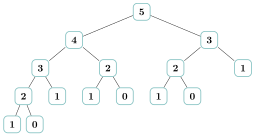

# Activités préparatoires

<p class="sous-titre">Programmation dynamique</p>

## <span class="etiquette">Activité 1</span> Le calcul qui n’en finit pas

*chronométrer, dessiner, compter… puis prendre des notes*

<p class="infos-activite">Durée : 30 min · Par deux</p>

!!! consignes "Consignes"

    - L’exercice 1 se fait sur machine (console ou éditeur en ligne), les suivants sur le cahier.

    - On rappelle la suite de Fibonacci : $F_0 = 0$, $F_1 = 1$, et chaque terme est la somme des deux précédents : $F_n = F_{n-1} + F_{n-2}$.

### <span class="exo-num">Exercice 1</span> — Chronométrer <span class="ia ia-rouge" title="Sans IA : le but est l'automatisme lui-même"></span> { #ex-11-programmation-dynamique-act-1-1 }

Recopier et lancer le programme suivant, qui calcule $F_n$ en suivant mot pour mot la définition, et affiche le temps de calcul (en secondes) pour $n = 20, 23, 26, \dots, 35$.

```python
import time

def fibo(n):
    if n <= 1:
        return n
    return fibo(n - 1) + fibo(n - 2)

for n in range(20, 36, 3):
    debut = time.time()
    fibo(n)
    print(n, time.time() - debut)
```

1.  Recopier sur le cahier le tableau suivant et le compléter avec les temps obtenus.

    | $n$       | $20$ | $23$ | $26$ | $29$ | $32$ | $35$ |
    |:----------|:-----|:-----|:-----|:-----|:-----|:-----|
    | temps (s) |      |      |      |      |      |      |

2.  Quand $n$ augmente de $3$, par combien le temps est-il à peu près multiplié ?

3.  En déduire une estimation du temps pour $n = 38$, puis pour $n = 50$. Le programme est-il utilisable ?

??? corrige "Corrigé"

    1.  Temps réellement mesurés sur un ordinateur portable (Python 3.8) :

        | $n$       |   $20$    |   $23$    |   $26$    |   $29$   |   $32$   |  $35$   |
        |:----------|:---------:|:---------:|:---------:|:--------:|:--------:|:-------:|
        | temps (s) | $0{,}002$ | $0{,}007$ | $0{,}031$ | $0{,}13$ | $0{,}56$ | $2{,}3$ |

    2.  Le temps est multiplié par environ $4$ (ici $4{,}1$ à $4{,}4$) quand $n$ augmente de $3$.

    3.  $n = 38$ : environ $4 \times 2{,}3 \approx 10$ s. $n = 50$ : cinq fois « $+3$ » de plus que $35$, soit $2{,}3 \times 4^5 \approx 2\,400$ s, environ $40$ minutes ; un calcul plus fin (facteur $1{,}6$ par unité) donne de l’ordre d’une heure. Le programme est inutilisable au-delà de $n \approx 40$.

### <span class="exo-num">Exercice 2</span> — Dessiner les appels <span class="ia ia-rouge" title="Sans IA : le but est l'automatisme lui-même"></span> { #ex-11-programmation-dynamique-act-1-2 }

1.  Pour comprendre, on dessine l’**arbre des appels** de `fibo(5)` : sous chaque appel, on dessine les deux appels qu’il déclenche (un appel `fibo(0)` ou `fibo(1)` n’en déclenche aucun). Recopier et compléter sur le cahier l’arbre commencé ci-dessous.

    { .tikz loading=lazy }

2.  Combien d’appels à `fibo` en tout (en comptant l’appel `fibo(5)`) ?

3.  Combien de fois `fibo(3)` est-il calculé ? `fibo(2)` ? `fibo(1)` ?

4.  Entourer, sur votre dessin, un **sous-arbre** qui apparaît plusieurs fois à l’identique. Que fait l’ordinateur à chaque fois qu’il le rencontre ?

??? corrige "Corrigé"

    1.  Arbre des appels de `fibo(5)` :

        { .tikz loading=lazy }

    2.  $15$ appels (vérifié à la machine avec un compteur).

    3.  `fibo(3)` : $2$ fois ; `fibo(2)` : $3$ fois ; `fibo(1)` : $5$ fois (et `fibo(0)` : $3$ fois).

    4.  Le sous-arbre de racine `3` apparaît deux fois (sous `4` et sous `5`), celui de racine `2` trois fois. L’ordinateur **refait tout le calcul** à chaque fois : il ne se souvient de rien.

### <span class="exo-num">Exercice 3</span> — Compter sans dessiner <span class="ia ia-rouge" title="Sans IA : le but est l'automatisme lui-même"></span> { #ex-11-programmation-dynamique-act-1-3 }

On note $A(n)$ le nombre total d’appels déclenchés par `fibo(n)`. Ainsi $A(0) = A(1) = 1$.

1.  Expliquer pourquoi $A(n) = 1 + A(n-1) + A(n-2)$ pour $n \geqslant 2$.

2.  Recopier et compléter le tableau (vérifier que $A(5)$ correspond à votre dessin).

    | $n$    | $0$ | $1$ | $2$ | $3$ | $4$ | $5$ | $6$ | $7$ | $8$ |
    |:-------|:----|:----|:----|:----|:----|:----|:----|:----|:----|
    | $A(n)$ | $1$ | $1$ |     |     |     |     |     |     |     |

3.  Par combien $A(n)$ est-il à peu près multiplié quand $n$ augmente de $1$ ? Et de $3$ ? Comparer avec l’exercice 1.

??? corrige "Corrigé"

    1.  Un appel `fibo(n)` compte pour $1$, puis déclenche `fibo(n-1)`, qui produit $A(n-1)$ appels, et `fibo(n-2)`, qui en produit $A(n-2)$.

    2.  Tableau (vérifié à la machine) :

        | $n$    | $0$ | $1$ | $2$ | $3$ | $4$ | $5$  | $6$  | $7$  | $8$  |
        |:-------|:---:|:---:|:---:|:---:|:---:|:----:|:----:|:----:|:----:|
        | $A(n)$ | $1$ | $1$ | $3$ | $5$ | $9$ | $15$ | $25$ | $41$ | $67$ |

    3.  $A(n)$ est multiplié par environ $1{,}6$ à chaque pas ($67/41 \approx 1{,}63$), donc par $1{,}6^3 \approx 4{,}2$ quand $n$ augmente de $3$ : c’est exactement le facteur mesuré à l’exercice 1. Le temps est proportionnel au nombre d’appels, qui croît de façon **exponentielle** ($A(35) \approx 30$ millions, $A(40) \approx 331$ millions).

### <span class="exo-num">Exercice 4</span> — Imaginer un carnet <span class="ia ia-rouge" title="Sans IA : le but est l'automatisme lui-même"></span> { #ex-11-programmation-dynamique-act-1-4 }

On reprend le calcul de `fibo(6)`, mais on dispose d’un **carnet** où l’on note chaque résultat dès qu’on l’a calculé. Nouvelle règle : *avant* de calculer `fibo(k)`, on regarde dans le carnet ; si la valeur y est, on la recopie sans rien recalculer.

1.  Dérouler le calcul de `fibo(6)` avec le carnet. Dans quel ordre les valeurs sont-elles écrites dans le carnet ?

2.  Combien d’additions a-t-on faites ? Sans carnet, `fibo(6)` en ferait $12$. Et pour `fibo(40)`, avec carnet ?

3.  Autre idée, sans aucun appel : recopier puis remplir directement le tableau des valeurs, de gauche à droite, chaque case étant la somme des deux précédentes.

    | $k$   | $0$ | $1$ | $2$ | $3$ | $4$ | $5$ | $6$ | $7$ | $8$ | $9$ | $10$ |
    |:------|:----|:----|:----|:----|:----|:----|:----|:----|:----|:----|:-----|
    | $F_k$ | $0$ | $1$ |     |     |     |     |     |     |     |     |      |

??? corrige "Corrigé"

    1.  Le carnet se remplit dans l’ordre `fibo(2)`, `fibo(3)`, `fibo(4)`, `fibo(5)`, `fibo(6)` : on descend d’abord tout à gauche jusqu’à `fibo(1)` et `fibo(0)`, puis on remonte ; chaque appel de droite (`fibo(2)` sous `fibo(4)`, `fibo(3)` sous `fibo(5)`, `fibo(4)` sous `fibo(6)`) est **lu** dans le carnet.

    2.  $5$ additions avec le carnet (une par valeur $F_2, \dots, F_6$) contre $12$ sans. Pour `fibo(40)` : $39$ additions avec le carnet, contre plus de $165$ millions sans. (En comptant les appels, la version avec carnet en fait $11$ pour `fibo(6)` et $79$ pour `fibo(40)`, vérifié à la machine.)

    3.  $F_k$ pour $k = 0$ à $10$ : $0, 1, 1, 2, 3, 5, 8, 13, 21, 34, 55$. Une seule boucle, aucune récursivité.

### <span class="exo-num">Exercice 5</span> — Mettre des mots <span class="ia ia-rouge" title="Sans IA : le but est l'automatisme lui-même"></span> { #ex-11-programmation-dynamique-act-1-5 }

1.  Recopier et compléter les phrases suivantes avec vos mots.

    - La version de l’exercice 1 est lente parce que…

    - Le carnet permet de…

    - Avec le carnet, on part de… et on descend ; avec le tableau, on part de… et on remonte.

2.  Proposer un nom pour l’idée « noter un résultat pour ne pas le recalculer ».

??? corrige "Corrigé"

    1.  La version de l’exercice 1 est lente parce qu’elle **recalcule sans cesse les mêmes valeurs**. Le carnet permet de **ne calculer chaque valeur qu’une fois**. Avec le carnet, on part du problème **complet** (`fibo(6)`) et on descend ; avec le tableau, on part **des plus petits cas** ($F_0$, $F_1$) et on remonte.

    2.  Propositions possibles : « prise de notes », « mémoire », « cache ». Le mot du cours est **mémoïsation** (de l’anglais *memo*, un pense-bête) ; le remplissage du tableau s’appelle la **tabulation**.
