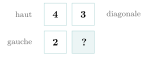
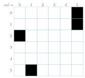
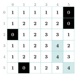

# TP et projets

<p class="sous-titre">Programmation dynamique</p>

## <span class="etiquette">TP</span> Le plus grand carré blanc

!!! fichiers "Fichiers à télécharger"

    [:material-folder-open: dossier en ligne](https://github.com/MathThibaud/nsi-fichiers-eleves/tree/main/terminale/11-tp-carre-blanc){ .md-button } [:material-zip-box: archive .zip](https://github.com/MathThibaud/nsi-fichiers-eleves/raw/main/zips/terminale-11-tp-carre-blanc.zip){ .md-button }

*Ce TP guidé réinvestit tout le chapitre : on découvre une **récurrence** en remplissant une grille à la main, puis on la programme en **récursif**, on l’accélère par **mémoïsation**, et enfin on la déroule en **tabulation** sur une vraie image. Fil rouge du chapitre : « ne jamais recalculer deux fois la même chose ».*

**Fichier à télécharger** (lien ci-dessus) : `carre_blanc.py` (chargement de l’image, **trame** des fonctions à écrire et **tests** — `python3 carre_blanc.py` affiche `OK` ou `A FAIRE ou ECHEC` pour chaque fonction). Il nécessite la bibliothèque `PIL` (Pillow) et les images fournies.

## Le problème

On dispose d’une image en **noir et blanc**. On cherche la taille du **plus grand carré entièrement blanc** que l’on peut y dessiner (côtés parallèles aux bords).

\*(image manquante : 11t1_carre_blanc)\*

**Convention.** Un pixel a pour coordonnées `(x, y)`, où `x` est la **colonne** et `y` la **ligne** (comme dans la bibliothèque `PIL`). L’idée centrale, qui va tout débloquer :

!!! encadre "La bonne question à se poser"

    Pour chaque pixel, on calcule la taille du plus grand carré blanc **dont ce pixel est le coin inférieur droit**. Notons cette valeur `pgcb(x, y)`. La réponse au problème sera alors le **maximum** de toutes ces valeurs.

## Découverte à la main

Travaillons d’abord sur une petite grille ($1$ = blanc, $0$ = noir), en remplissant chaque case **de gauche à droite et de haut en bas**.

### <span class="exo-num">Exercice 1</span> — Le coin inférieur droit { #ex-11-programmation-dynamique-tp-1-1 }

On regarde une case **blanche** dont les trois voisins *déjà calculés* portent les valeurs ci-dessous. Quelle valeur faut-il mettre dans la case « ? » ? (Un carré blanc s’appuyant sur ce coin est limité par le plus *petit* des trois carrés voisins.)

{ .tikz loading=lazy }

??? corrige "Corrigé"

    Un carré blanc appuyé sur ce coin ne peut pas être plus grand que le plus **petit** des trois carrés voisins : la valeur est $1 + \min(\underbrace{4}_{\text{haut}}, \underbrace{2}_{\text{gauche}}, \underbrace{3}_{\text{diag.}}) = 1 + 2 = \mathbf{3}$.

### <span class="exo-num">Exercice 2</span> — Remplir toute la grille { #ex-11-programmation-dynamique-tp-1-2 }

Recopier la grille ci-dessous et **écrire dans chaque case blanche** la valeur `pgcb`. Règles :

- case **noire** $\rightarrow$ on écrit **0** ;

- case blanche sur la **ligne du haut** ou la **colonne de gauche** $\rightarrow$ on écrit **1** ;

- autre case blanche $\rightarrow$ on écrit **$1 + \min(\text{haut},\ \text{gauche},\ \text{diagonale})$**.

{ .tikz .tikz-inline loading=lazy }

**En déduire** sur le cahier la taille du plus grand carré blanc de cette grille (le maximum des valeurs écrites).

??? corrige "Corrigé"

    Grille de départ ($1$ blanc, $0$ noir) et table `pgcb` obtenue :

    { .tikz loading=lazy }

    Le **maximum** de la table vaut **4** (cases surlignées, aux coins `(ligne 3, col 4)`, `(ligne 4, col 4)` et `(ligne 5, col 5)`) : le plus grand carré blanc de cette grille est de **côté 4**.

## La formule

!!! definition "Définition 4 — Récurrence du plus grand carré blanc"

    $$$\displaystyle\texttt{pgcb}(x, y) = \begin{cases} 0 & \text{si le pixel } (x,y) \text{ est \textbf{noir},}\\  1 & \text{si le pixel est \textbf{blanc} et } x = 0 \text{ ou } y = 0,\\  1 + \min\big(\texttt{pgcb}(x{-}1, y),\ \texttt{pgcb}(x, y{-}1),\ \texttt{pgcb}(x{-}1, y{-}1)\big) & \text{sinon.} \end{cases}$$$

Les deux premières lignes sont les **cas de base** ; la troisième relie un sous-problème à **trois sous-problèmes plus petits** (à gauche, au-dessus, en diagonale). C’est exactement la structure d’un problème de **programmation dynamique**.

## Version récursive

On suppose disposer d’une fonction `est_noir(x, y)` renvoyant `True` si le pixel est noir.

### <span class="exo-num">Exercice 3</span> — Écrire `pgcb` en récursif { #ex-11-programmation-dynamique-tp-1-3 }

Recopier et compléter :

```python
def pgcb(x, y):
    if est_noir(x, y):
        return ...              # (a) cas de base : pixel noir
    elif x == 0 or y == 0:
        return ...              # (b) cas de base : bord haut / gauche
    else:
        return 1 + min(...,     # (c) a gauche
                       ...,     # (d) au-dessus
                       ...)     # (e) en diagonale
```

??? corrige "Corrigé"

    ```python
    def pgcb(x, y):
        if est_noir(x, y):
            return 0                        # (a)
        elif x == 0 or y == 0:
            return 1                        # (b)
        else:
            return 1 + min(pgcb(x - 1, y),      # (c) a gauche
                           pgcb(x, y - 1),      # (d) au-dessus
                           pgcb(x - 1, y - 1))  # (e) en diagonale
    ```

### <span class="exo-num">Exercice 4</span> — Le problème de la lenteur { #ex-11-programmation-dynamique-tp-1-4 }

Si l’on teste `pgcb(250, 250)` sur l’image de la section « Sur une vraie image », le calcul ne se termine **jamais** en temps raisonnable.

1.  En observant les trois appels récursifs, expliquer pourquoi un **même** sous-problème `pgcb(x, y)` est recalculé un très grand nombre de fois. *(Indication : pensez à l’arbre des appels de `fibo` du cours.)*

2.  Quelle technique du cours permet d’y remédier ?

??? corrige "Corrigé"

    1.  Chaque appel `pgcb(x, y)` déclenche **trois** appels sur des pixels voisins, qui se **chevauchent** d’un pixel à l’autre : par exemple `pgcb(x-1, y-1)` est réclamé à la fois par `pgcb(x, y)`, par `pgcb(x-1, y)` et par `pgcb(x, y-1)`. Le **même** sous-problème est donc recalculé un nombre **exponentiel** de fois — exactement comme l’arbre d’appels de `fibo`.

    2.  On applique la **mémoïsation** : on mémorise chaque résultat déjà calculé pour ne jamais le refaire.

## Mémoïsation (top-down)

### <span class="exo-num">Exercice 5</span> — Écrire `pgcb_memo` { #ex-11-programmation-dynamique-tp-1-5 }

Écrire la fonction `pgcb_memo` qui fait le même calcul que `pgcb`, mais **mémorise** ses résultats dans un dictionnaire `memo` pour ne jamais recalculer deux fois la même case. Comme pour `fibo` dans le cours, on passe le dictionnaire en paramètre : `def pgcb_memo(x, y, memo={})`. Vérifier que l’appel devient instantané :

```python
>>> pgcb_memo(250, 250)
21
```

??? corrige "Corrigé"

    ```python
    def pgcb_memo(x, y, memo={}):
        if (x, y) in memo:
            return memo[(x, y)]
        if est_noir(x, y):
            r = 0
        elif x == 0 or y == 0:
            r = 1
        else:
            r = 1 + min(pgcb_memo(x - 1, y, memo),
                        pgcb_memo(x, y - 1, memo),
                        pgcb_memo(x - 1, y - 1, memo))
        memo[(x, y)] = r
        return r
    ```

    C’est la même construction que `fibo(n, memo={})` dans le cours. L’appel `pgcb_memo(250, 250)` devient instantané et renvoie `21` (vérifié à la machine ; sans mémoïsation, `pgcb(250, 250)` dépasse $30$ millions d’appels en $10$ secondes sans finir). Attention au piège du cours : le dictionnaire par défaut est **partagé** d’un appel à l’autre, d’où l’intérêt de passer un dictionnaire neuf à la question suivante.

## Sur une vraie image

Le fichier `carre_blanc.py` charge l’image fournie `carre_blanc.png` avec `PIL` (c’est déjà écrit en haut du fichier) :

```python
from PIL import Image
NOM_IMAGE = "carre_blanc.png"
img = Image.open(NOM_IMAGE).convert("RGB")
pixels = img.load()
largeur, hauteur = img.size          # ici (600, 600)
```

### <span class="exo-num">Exercice 6</span> — La fonction `est_noir` { #ex-11-programmation-dynamique-tp-1-6 }

Écrire `est_noir(x, y)` qui renvoie `True` si le pixel `(x, y)` est noir (couleur `(0, 0, 0)`), `False` sinon.

??? corrige "Corrigé"

    ```python
    def est_noir(x, y):
        return pixels[x, y] == (0, 0, 0)
    ```

### <span class="exo-num">Exercice 7</span> — Chercher le plus grand carré de l’image { #ex-11-programmation-dynamique-tp-1-7 }

Écrire `total_pgcb()` qui **parcourt tous les pixels** de l’image et renvoie la taille du plus grand carré blanc, avec les coordonnées `(x, y)` de son coin inférieur droit :

```python
>>> total_pgcb()
(200, (559, 239))
```

**Attention** : pour que ce soit efficace, il faut réutiliser **le même** dictionnaire de mémoïsation pour tous les pixels : créer `memo = {}` au début de `total_pgcb`, puis appeler `pgcb_memo(x, y, memo)`. (Un dictionnaire neuf évite aussi de réutiliser par erreur les résultats d’une autre image.)

??? corrige "Corrigé"

    On partage **un seul** dictionnaire de mémoïsation pour tous les pixels, créé au début de la fonction et passé à `pgcb_memo`, sinon le calcul reste interminable :

    ```python
    def total_pgcb():
        memo = {}                           # un seul carnet pour tous les pixels
        meilleur = 0
        coin = (0, 0)
        for y in range(hauteur):
            for x in range(largeur):
                taille = pgcb_memo(x, y, memo)
                if taille > meilleur:
                    meilleur = taille
                    coin = (x, y)
        return meilleur, coin
    ```

    Sur l’image fournie : `total_pgcb()` renvoie **(200, (559, 239))** — un carré blanc de **côté 200**, dont le coin inférieur droit est le pixel `(559, 239)` (le grand bloc blanc en haut à droite).

    \*(image manquante : 11ct1_carre_blanc_solution)\*  
    Le plus grand carré blanc trouvé (contour rouge), côté $200$.

### <span class="exo-num">Exercice 8</span> — Défi — la grande image { #ex-11-programmation-dynamique-tp-1-8 }

Voici une image beaucoup plus grande ($1200 \times 1200$ pixels), fournie sous le nom `carre_blanc_grand.png`. Cette fois, **impossible de deviner à l’œil** où se cache le plus grand carré blanc : plusieurs zones blanches se ressemblent ! C’est tout l’intérêt de l’algorithme.

\*(image manquante : 11t1_carre_blanc_grand)\*

Dans `carre_blanc.py`, remplacer `NOM_IMAGE = "carre_blanc.png"` par `NOM_IMAGE = "carre_blanc_grand.png"` (les tests sont alors remplacés par l’affichage des résultats), lancer `total_pgcb()` (ou `pgcb_bottom_up()`) et **noter sur le cahier la taille du plus grand carré blanc et son coin**. Sauriez-vous, *sans le programme*, désigner à coup sûr le bon carré ? (C’est bien là que la machine gagne.)

??? corrige "Corrigé"

    Sur `carre_blanc_grand.png` ($1200 \times 1200$), après avoir remplacé `NOM_IMAGE` par `"carre_blanc_grand.png"`, le programme renvoie un carré blanc de **côté 181**, de coin inférieur droit `(198, 627)` — une zone que l’œil n’aurait pas su désigner parmi toutes les taches blanches voisines. C’est précisément ce qu’apporte la programmation dynamique : une réponse **exacte** et **rapide** là où l’intuition est impuissante.

    \*(image manquante : 11ct1_carre_blanc_grand_solution)\*  
    Le plus grand carré blanc de la grande image (contour rouge), côté $181$ — indevinable à l’œil.

## Bonus : tabulation (bottom-up)

### <span class="exo-num">Exercice 9</span> — Écrire `pgcb_bottom_up` { #ex-11-programmation-dynamique-tp-1-9 }

En s’inspirant **du remplissage à la main** de la section « Découverte à la main », écrire `pgcb_bottom_up` qui construit une **table** `S` de la taille de l’image, la remplit **ligne par ligne** (sans aucune récursion), et renvoie la taille et le coin du plus grand carré. Comparer avec `total_pgcb` : on doit trouver le **même** résultat.

*Ce que ce TP illustre : un même problème résolu par **mémoïsation** (on part du haut et on descend en mémorisant) puis par **tabulation** (on part des cas de base et on remonte) — les deux visages de la programmation dynamique, à parité.*

??? corrige "Corrigé"

    La table `S` (une ligne de `largeur` zéros pour chaque `y`) se construit par compréhension :

    ```python
    def pgcb_bottom_up():
        S = [[0] * largeur for y in range(hauteur)]     # S[y][x]
        meilleur = 0
        coin = (0, 0)
        for y in range(hauteur):
            for x in range(largeur):
                if est_noir(x, y):
                    S[y][x] = 0
                elif x == 0 or y == 0:
                    S[y][x] = 1
                else:
                    S[y][x] = 1 + min(S[y][x - 1], S[y - 1][x], S[y - 1][x - 1])
                if S[y][x] > meilleur:
                    meilleur = S[y][x]
                    coin = (x, y)
        return meilleur, coin
    ```

    On remplit la table **ligne par ligne**, exactement comme à la main : aucune récursion, aucun dictionnaire. Le résultat est identique : **(200, (559, 239))**.

    *Mémoïsation et tabulation donnent le même résultat : ce sont les deux faces de la programmation dynamique.*
