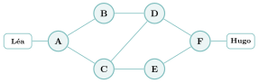

# Activités préparatoires

Réseaux

## Activité 1 Le voyage d’un paquet

*découper, aiguiller, contourner, recoller*

Durée : 30 min · Sans ordinateur, par deux

!!! consignes "Consignes"

    - On suit les paquets du doigt sur le plan, on compte, on corrige des tableaux. Les réponses s’écrivent sur le cahier. Aucun mot de vocabulaire n’est attendu avant la partie 5. Variante : en jeu de rôle avec toute la classe, si le professeur le propose.

### Exercice 1 — Découper le message  { #ex-11-reseaux-act-1-1 }

Léa veut envoyer à Hugo le message `RENDEZ-VOUS 18H PORT HERCULE` ($28$ caractères, espaces compris). Le réseau ne transporte que de **petits paquets** : chacun contient au plus $6$ caractères du message, et porte une **étiquette** avec l’expéditeur, le destinataire et un numéro.

{ .tikz loading=lazy }

1.  Combien de paquets faut-il ? Écrire le contenu du paquet n° 3 et celui du dernier.

2.  Pourquoi chaque paquet porte-t-il l’adresse du destinataire, et pas seulement le premier ?

3.  À quoi sert le numéro ?

### Exercice 2 — Les élèves-routeurs  { #ex-11-reseaux-act-1-2 }

Les paquets traversent six **routeurs** A, B, C, D, E, F. Chacun ne connaît que **ses voisins directs** et possède une petite **table** qui lui dit à quel voisin transmettre un paquet selon sa destination.

{ .tikz loading=lazy }

<table>
<thead>
<tr>
<th colspan="2" style="text-align: left;"><strong>Routeur A</strong></th>
</tr>
</thead>
<tbody>
<tr>
<td style="text-align: center;"><strong>Pour aller vers</strong></td>
<td style="text-align: center;"><strong>Envoyer à</strong></td>
</tr>
<tr>
<td style="text-align: center;">réseau de Léa</td>
<td style="text-align: center;">Léa (direct)</td>
</tr>
<tr>
<td style="text-align: center;">réseau de Hugo</td>
<td style="text-align: center;">B</td>
</tr>
</tbody>
</table>

<table>
<thead>
<tr>
<th colspan="2" style="text-align: left;"><strong>Routeur B</strong></th>
</tr>
</thead>
<tbody>
<tr>
<td style="text-align: center;"><strong>Pour aller vers</strong></td>
<td style="text-align: center;"><strong>Envoyer à</strong></td>
</tr>
<tr>
<td style="text-align: center;">réseau de Léa</td>
<td style="text-align: center;">A</td>
</tr>
<tr>
<td style="text-align: center;">réseau de Hugo</td>
<td style="text-align: center;">D</td>
</tr>
</tbody>
</table>

<table>
<thead>
<tr>
<th colspan="2" style="text-align: left;"><strong>Routeur C</strong></th>
</tr>
</thead>
<tbody>
<tr>
<td style="text-align: center;"><strong>Pour aller vers</strong></td>
<td style="text-align: center;"><strong>Envoyer à</strong></td>
</tr>
<tr>
<td style="text-align: center;">réseau de Léa</td>
<td style="text-align: center;">A</td>
</tr>
<tr>
<td style="text-align: center;">réseau de Hugo</td>
<td style="text-align: center;">D</td>
</tr>
</tbody>
</table>

<table>
<thead>
<tr>
<th colspan="2" style="text-align: left;"><strong>Routeur D</strong></th>
</tr>
</thead>
<tbody>
<tr>
<td style="text-align: center;"><strong>Pour aller vers</strong></td>
<td style="text-align: center;"><strong>Envoyer à</strong></td>
</tr>
<tr>
<td style="text-align: center;">réseau de Léa</td>
<td style="text-align: center;">B</td>
</tr>
<tr>
<td style="text-align: center;">réseau de Hugo</td>
<td style="text-align: center;">F</td>
</tr>
</tbody>
</table>

<table>
<thead>
<tr>
<th colspan="2" style="text-align: left;"><strong>Routeur E</strong></th>
</tr>
</thead>
<tbody>
<tr>
<td style="text-align: center;"><strong>Pour aller vers</strong></td>
<td style="text-align: center;"><strong>Envoyer à</strong></td>
</tr>
<tr>
<td style="text-align: center;">réseau de Léa</td>
<td style="text-align: center;">C</td>
</tr>
<tr>
<td style="text-align: center;">réseau de Hugo</td>
<td style="text-align: center;">F</td>
</tr>
</tbody>
</table>

<table>
<thead>
<tr>
<th colspan="2" style="text-align: left;"><strong>Routeur F</strong></th>
</tr>
</thead>
<tbody>
<tr>
<td style="text-align: center;"><strong>Pour aller vers</strong></td>
<td style="text-align: center;"><strong>Envoyer à</strong></td>
</tr>
<tr>
<td style="text-align: center;">réseau de Léa</td>
<td style="text-align: center;">D</td>
</tr>
<tr>
<td style="text-align: center;">réseau de Hugo</td>
<td style="text-align: center;">Hugo (direct)</td>
</tr>
</tbody>
</table>

1.  Suivre le paquet n° 1 de Léa jusqu’à Hugo : par quels routeurs passe-t-il ? Combien de « sauts » de routeur à routeur ?

2.  Le routeur B connaît-il le chemin complet jusqu’à Hugo ? Que sait-il exactement ?

3.  Hugo répond « OK ». Par où passe sa réponse ? Est-ce forcément le même chemin qu’à l’aller ?

4.  Trouver un autre chemin de A à F avec le même nombre de sauts.

### Exercice 3 — La panne  { #ex-11-reseaux-act-1-3 }

Pendant l’envoi, le câble entre B et D est **coupé**. Les paquets n° 1 et 2 sont déjà passés ; le paquet n° 3 arrive en B.

1.  Que peut faire B avec sa table actuelle ?

2.  B corrige sa table au plus vite : « réseau de Hugo $\to$ envoyer à A ». Mais A n’a pas encore changé la sienne. Suivre le paquet n° 3 : que se passe-t-il ?

3.  Pour éviter qu’un paquet tourne en rond pour toujours, on écrit sur chaque paquet un **compteur** qui vaut $8$ au départ ; chaque routeur lui retire $1$ et jette le paquet si le compteur atteint $0$. Que devient le paquet n° 3 ?

4.  Quelles tables faut-il corriger pour que les paquets suivants arrivent à Hugo, et pour que ses réponses reviennent à Léa ? Écrire les nouvelles lignes. Quel est le nouveau chemin de Léa à Hugo, et combien de sauts ?

5.  Sur Internet, il y a des millions de routeurs et des pannes à chaque instant. Peut-on corriger les tables « à la main », comme ici ? Que faudrait-il ?

### Exercice 4 — Recoller les morceaux  { #ex-11-reseaux-act-1-4 }

Hugo reçoit, dans cet ordre, les paquets n° 2, n° 1, n° 5 et n° 4.

1.  Pourquoi les paquets peuvent-ils arriver dans le désordre ?

2.  Reconstituer ce que Hugo peut lire. Que lui manque-t-il, et comment le sait-il ?

3.  Que devrait faire Hugo pour obtenir le message complet ? Et que pourrait faire Léa si elle n’avait aucune nouvelle de Hugo ?

### Exercice 5 — Mettre des mots  { #ex-11-reseaux-act-1-5 }

1.  Proposer, sur le cahier, un nom pour chacune des notions suivantes :

    - un morceau du message, avec son étiquette ;

    - l’étiquette (expéditeur, destinataire, numéro, compteur) ;

    - la machine qui choisit à quel voisin transmettre ;

    - le tableau « pour aller vers…, envoyer à…» ;

    - la façon de faire voyager un message en morceaux indépendants ;

    - les règles qui permettent aux routeurs de mettre leurs tables à jour tout seuls.

2.  Recopier et compléter la phrase : « Découper en paquets rend le réseau…, car…»

??? corrige "Corrigé de l'activité"

    1.  $28 = 4 \times 6 + 4$ : il faut $5$ paquets : `RENDEZ`, `-VOUS␣`, `18H␣ PO`, `RT␣ HER`, `CULE`. Le paquet n° 3 contient `18H PO`, le dernier `CULE`.

    2.  Chaque paquet voyage **indépendamment** : un routeur ne voit passer qu’un paquet à la fois, sans savoir qu’il fait partie d’un message ; il lui faut l’adresse sur **chaque** paquet pour l’aiguiller.

    3.  À remettre les morceaux **dans l’ordre** à l’arrivée, et à repérer un paquet **manquant**.

    4.  Léa $\to$ A $\to$ B $\to$ D $\to$ F $\to$ Hugo : $3$ sauts de routeur à routeur (A–B, B–D, D–F).

    5.  Non : B sait seulement qu’un paquet pour le réseau de Hugo doit être remis à **D**. Aucun routeur ne connaît le chemin complet ; chacun décide **localement** du saut suivant, et c’est l’ensemble des tables qui fait le chemin.

    6.  F $\to$ D $\to$ B $\to$ A $\to$ Léa : ici le chemin inverse. Ce n’est pas obligatoire en général : l’aller et le retour sont décidés par des tables **différentes** (chaque routeur a une ligne pour chaque destination).

    7.  A $\to$ C $\to$ D $\to$ F ou A $\to$ C $\to$ E $\to$ F (aussi $3$ sauts).

    8.  Rien d’utile : sa table l’envoie vers D, que le câble ne permet plus d’atteindre. Il peut garder le paquet (attendre), le jeter, ou chercher une autre sortie.

    9.  B l’envoie à A ; la table de A dit « réseau de Hugo $\to$ B » : A le renvoie à B, qui le renvoie à A… Le paquet fait du **ping-pong** entre A et B : c’est une **boucle de routage**.

    10. Le compteur vaut $7$ après A, $6$ après B, puis $5, 4, 3, 2, 1, 0$ au fil des allers-retours : le paquet n° 3 est **jeté** (en B). Il est perdu, mais le réseau n’est pas encombré pour toujours. (Sur Internet, ce compteur existe dans l’en-tête IP : le *TTL*, *time to live*.)

    11. Pour l’aller : A doit envoyer vers **C** (« réseau de Hugo $\to$ C ») ; B peut garder « $\to$ A » (un paquet qui arriverait en B repartirait par A puis C). Pour le retour : D doit envoyer les paquets pour Léa vers **C** au lieu de B. Nouveau chemin : Léa $\to$ A $\to$ C $\to$ D $\to$ F $\to$ Hugo, toujours $3$ sauts (A $\to$ C $\to$ E $\to$ F convient aussi). Attention à ne pas oublier la table de D : sans elle, la réponse de Hugo ne revient pas.

    12. Impossible à la main : il faut que les routeurs **échangent automatiquement** des informations avec leurs voisins (« le lien B–D est coupé », « je peux atteindre tel réseau en tant de sauts ») et recalculent leurs tables tout seuls. Ce sont les **protocoles de routage** (RIP, OSPF dans le cours).

    13. Les paquets voyagent indépendamment et peuvent prendre des chemins différents (avant et après la panne) ou attendre plus ou moins longtemps dans un routeur encombré.

    14. En triant par numéro : `RENDEZ-VOUS RT HERCULE`. Il manque le paquet n° 3 (« `18H PO` ») : Hugo le sait car les numéros $1, 2, 4, 5$ sautent le $3$. (Si c’était le **dernier** paquet qui manquait, il ne pourrait pas le savoir sans connaître le nombre total de paquets : d’où l’intérêt de l’indiquer.)

    15. Hugo doit **redemander** le paquet n° 3 à Léa. Inversement, Hugo peut envoyer un **accusé de réception** pour chaque paquet reçu ; si Léa ne reçoit pas d’accusé au bout d’un certain temps, elle **renvoie** le paquet. C’est le rôle de TCP.

    16. Propositions possibles, puis mots du cours : morceau $\to$ **paquet** ; étiquette $\to$ **en-tête** ; machine qui aiguille $\to$ **routeur** ; tableau $\to$ **table de routage** ; voyage en morceaux $\to$ **commutation de paquets** ; règles de mise à jour $\to$ **protocole de routage**.

    17. … **robuste** (résistant aux pannes), car si un lien ou un routeur tombe, les paquets suivants **contournent** la panne par un autre chemin, et ceux qui sont perdus sont renvoyés.
