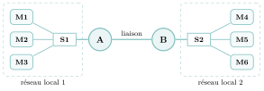
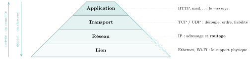
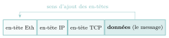
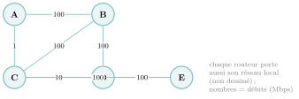
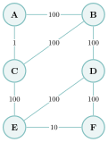
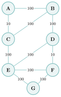
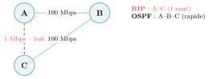

# Cours

Réseaux

|  |  |
|:---|:---|
| **Programme (BO)** | *« Protocoles de routage. Identifier, suivant le protocole de routage utilisé, la route empruntée par un paquet. »* Commentaire du programme : *« En mode débranché, les tables de routage étant données, on se réfère au nombre de sauts (protocole RIP) ou au coût des routes (protocole OSPF). Le lien avec les algorithmes de recherche de chemin sur un graphe est mis en évidence. »* |
| **Prérequis** | la notion de **réseau** et d’**adresse IP** (Première), les **graphes** (chemins, plus court chemin), la notion de **coût**. L’algorithme de **Dijkstra** (projet du chapitre *Graphes*) éclaire OSPF, mais n’est **pas exigé** (voir la section dédiée, au-delà du programme). |
| **Objectifs** | *distinguer* machine, switch et routeur ; *comprendre* le voyage d’un paquet à travers les *couches* ; *lire* et *utiliser* une table de routage **donnée** ; *identifier* la route empruntée par un paquet selon le protocole (sauts pour RIP, coûts pour OSPF), et *compléter* la table d’un petit réseau ; *comparer* les choix de RIP et d’OSPF. |

## Le problème : relier des milliards de machines

Vous envoyez un message ; une fraction de seconde plus tard, il s’affiche à l’autre bout du monde, après avoir traversé une dizaine de machines qu’il n’a jamais « vues ». Comment ce petit paquet de données a-t-il **trouvé son chemin** parmi le milliard de routes possibles, sans que personne ne lui dise *a priori* par où passer ?

C’est toute la question de ce chapitre. **Internet** n’est pas une machine géante : c’est un **réseau de réseaux**, une immense mosaïque de petits réseaux locaux reliés entre eux par des **routeurs**. Nous allons suivre « le voyage d’un paquet » de bout en bout, et découvrir comment les routeurs, chacun ne connaissant que ses voisins, parviennent collectivement à l’acheminer.

!!! regle "Règle 1 — Le fil rouge : le voyage d’un paquet"

    Un message est découpé en petits **paquets**. Chaque paquet voyage *indépendamment*, de routeur en routeur, chacun décidant **localement** vers qui le transmettre ensuite, grâce à sa **table de routage**. Comprendre le réseau, c’est comprendre comment ces tables se remplissent — c’est le rôle des **protocoles de routage** (RIP, OSPF), qui sont, au fond, des algorithmes de plus court chemin dans un graphe.

## Les acteurs : machines, switchs, routeurs

!!! definition "Définition 1 — Réseau local, switch, routeur"

    Un **réseau local** (LAN) regroupe des machines proches partageant la même **adresse réseau**. Un **switch** (commutateur) relie les machines *à l’intérieur* d’un même réseau local. Un **routeur** relie *plusieurs réseaux locaux entre eux* : il possède plusieurs **interfaces** (cartes réseau), une par réseau auquel il est raccordé. **Internet $=$ l’interconnexion de tous ces réseaux par des routeurs.**

{ .tikz loading=lazy }

Dans un réseau local, un paquet destiné à une machine *du même réseau* y va directement via le switch. Mais s’il vise une machine d’un *autre* réseau, le switch le remet au **routeur**, qui devra l’aiguiller de proche en proche jusqu’au bon réseau.

▶ Exercices d'application : exercice **[1](exercices.md#ex-11-1)** (machines, switchs, routeurs)

## Les adresses IP : reconnaître son réseau

Chaque interface possède une **adresse IP** (en IPv4 : quatre octets, soit quatre nombres de $0$ à $255$, par exemple `172.16.5.3` — donc $32$ bits en tout). Cette adresse se découpe en deux parties : une partie **réseau** (commune à toutes les machines du réseau local) et une partie **hôte** (qui identifie la machine dans ce réseau). Où se situe la frontière ? C’est le rôle du **masque**.

!!! definition "Définition 2 — Notation CIDR (le /n)"

    La notation **CIDR** (*Classless Inter-Domain Routing*) écrit le masque sous la forme `/n` : les **`n` premiers bits** de l’adresse forment la partie **réseau** (ils sont à $1$ dans le masque), les $32-n$ suivants forment la partie **hôte** (à $0$). Deux machines sont dans **le même réseau local** si et seulement si leurs `n` premiers bits coïncident. Dans ce réseau :

    - l’adresse dont **tous** les bits d’hôte valent $0$ est l’**adresse du réseau** ;

    - l’adresse dont **tous** les bits d’hôte valent $1$ est l’**adresse de diffusion** (*broadcast*) ;

    - ces deux-là étant réservées, le nombre de machines adressables est $\mathbf{2^{\,32-n} - 2}$.

L’intérêt de CIDR, c’est que `n` peut prendre **n’importe quelle valeur** de $0$ à $32$ (pas seulement $8$, $16$ ou $24$) : on ajuste finement la taille d’un réseau à ses besoins.

!!! exemple "Exemple"

    Avec `172.16.5.3/16`, le `/16` dit que les $16$ premiers bits (`172.16`) forment l’adresse réseau : adresse du réseau `172.16.0.0`, diffusion `172.16.255.255`, et $2^{32-16}-2 = 2^{16}-2 = 65\,534$ machines possibles. Toute machine `172.16.`$\bullet$`.`$\bullet$ est dans ce réseau ; `172.18.1.1/16` (réseau `172.18`) est dans un *autre* réseau — il faudra un routeur. Avec un `/24` (ex. `192.168.1.0/24`), il ne reste que $8$ bits d’hôte, donc $2^8-2 = 254$ machines ; avec un `/30`, $2^2-2 = 2$ machines seulement (juste ce qu’il faut pour relier deux routeurs).

▶ Exercices d'application : exercices **[2](exercices.md#ex-11-2) à [4](exercices.md#ex-11-4)** (lire une adresse IP ; adressage IP ; dimensionner des sous-réseaux)

## Le voyage d’un paquet : le modèle en couches

Comment une même donnée peut-elle à la fois s’adresser à *une application* précise, être acheminée d’un *bout à l’autre* d’Internet, et circuler sur *un câble* local ? En empilant plusieurs **couches**, chacune ne s’occupant que d’une chose. C’est le modèle **TCP/IP**.

{ .tikz loading=lazy }

À l’émission, la donnée **descend** les couches : chacune ajoute son **en-tête** (son étiquette) — c’est l’**encapsulation**, comme des enveloppes emboîtées. À l’arrivée, la donnée **remonte** : chaque couche retire son en-tête et transmet le reste au-dessus.

{ .tikz loading=lazy }  
**Encapsulation :** en descendant les couches, chaque en-tête s’ajoute **à gauche** du bloc précédent. À l’arrivée, on les retire un à un.

Ce chapitre se concentre sur la couche **Réseau (IP)** : c’est là que se joue le **routage**.

▶ Exercices d'application : exercice **[5](exercices.md#ex-11-5)** (des enveloppes emboîtées : les couches)

## La commutation de paquets

Plutôt que de réserver une ligne entière pour toute la durée d’un échange (*commutation de circuits*, comme l’ancien téléphone), Internet **découpe** les messages en **paquets** indépendants qui empruntent le réseau chacun de leur côté (**commutation de paquets**).

!!! propriete "Propriété 1 — Pourquoi des paquets ?"

    La commutation de paquets **partage** efficacement les liens entre tous les échanges, et surtout elle est **robuste** : si un routeur ou un câble tombe, les paquets suivants *contournent* la panne par un autre chemin. C’est cette robustesse qui a fondé Internet.

## Le routage : la table de routage

Un routeur qui reçoit un paquet consulte sa **table de routage** : pour chaque réseau de destination, elle indique **par où sortir** (quelle interface, ou quel routeur voisin) et une **métrique** (le « coût » de la route ; plus elle est petite, mieux c’est). Un réseau directement raccordé a une métrique **nulle**.

!!! exemple "Exemple"

    Table de routage (simplifiée) d’un routeur A relié aux réseaux `R1` et `R3`, et au routeur G :

    | Réseau à atteindre |   Sortir par   | Métrique |
    |:------------------:|:--------------:|:--------:|
    |         R1         | interface eth0 |    0     |
    |         R3         | interface eth2 |    0     |
    |         R2         |   routeur G    |    1     |

    Lecture de la dernière ligne : « pour atteindre R2, envoie le paquet au routeur G, qui saura continuer ».

Comment remplir ces tables ? Deux façons : le **routage statique** (chaque ligne écrite à la main — possible seulement pour de tout petits réseaux) et le **routage dynamique**, où des **protocoles** découvrent les routes automatiquement. C’est ce dernier qui nous intéresse.

!!! regle "Règle 2 — Un réseau de routeurs $=$ un graphe"

    Modélisons : chaque **routeur** est un **sommet**, chaque **liaison** entre routeurs est une **arête**. Trouver la meilleure route, c’est chercher un **plus court chemin** dans ce graphe. Les protocoles de routage sont donc des **algorithmes de graphes** — ceux du chapitre *Graphes* !

Prenons ce réseau pour toute la suite (les nombres sur les liens seront expliqués plus loin) :

{ .tikz loading=lazy }

▶ Exercices d'application : exercice **[6](exercices.md#ex-11-6)** (lire une table de routage)

## RIP : compter les sauts

Le protocole **RIP** (*Routing Information Protocol*) mesure une route par son **nombre de sauts** : le nombre de routeurs à traverser. Chaque routeur envoie **périodiquement** (toutes les 30 s) à ses voisins la liste des réseaux qu’il connaît et à quelle distance ; de proche en proche, chacun complète sa table en gardant, pour chaque destination, la route au **plus petit nombre de sauts**.

!!! definition "Définition 3 — Métrique de RIP"

    Métrique RIP $=$ **nombre de sauts** (routeurs traversés). C’est un **vecteur de distance** : chaque routeur ne connaît que « à quelle distance » est chaque réseau, sans voir toute la carte. RIP s’appuie sur l’algorithme de **Bellman-Ford**.

!!! exemple "Exemple"

    Table de routage de **A** par RIP (destinations $=$ réseaux locaux de B, C, D, E) :

    |   Réseau    | Sortir vers | Sauts |
    |:-----------:|:-----------:|:-----:|
    | réseau de B |      B      |   1   |
    | réseau de C |      C      |   1   |
    | réseau de D |      B      |   2   |
    | réseau de E |      C      |   2   |

    Pour atteindre C, RIP choisit le lien **direct** A–C ($1$ saut). Pour D, le plus court est A–B–D ($2$ sauts) ; pour E, A–C–E ($2$ sauts).

!!! exemple "Exemple — un réseau plus grand"

    Voici un réseau à **six** routeurs (les nombres sont des débits, ignorés par RIP) :

    { .tikz .tikz-inline loading=lazy }

    Table de routage **RIP** de A (on compte les sauts en remontant de proche en proche) :

    |   Réseau    | Sortir vers |    Sauts    |
    |:-----------:|:-----------:|:-----------:|
    | réseau de B |      B      |      1      |
    | réseau de C |      C      |      1      |
    | réseau de D |      B      |  2 (A–B–D)  |
    | réseau de E |      C      |  2 (A–C–E)  |
    | réseau de F |      B      | 3 (A–B–D–F) |

!!! remarque "Remarque"

    RIP est simple, mais il a deux gros défauts : ses messages périodiques **encombrent** le réseau, et il est **plafonné à 15 sauts** (au-delà, la destination est réputée inaccessible). Surtout, il ne regarde que le *nombre* de routeurs, jamais leur *vitesse* : un saut par une liaison poussive compte autant qu’un saut par la fibre. D’où OSPF.

▶ Exercices d'application : exercice **[7](exercices.md#ex-11-7)** (construire une table RIP)

## OSPF : le coût des liens

**OSPF** (*Open Shortest Path First*) ne compte pas les sauts : il additionne le **coût** des liaisons traversées. Le coût d’une liaison dépend de son **débit** (le nombre de bits par seconde qu’elle peut transporter) : plus c’est rapide, moins c’est cher.

!!! definition "Définition 4 — Métrique d’OSPF"

    Le **coût** d’une liaison se calcule à partir de son débit : $$\text{coût} = \frac{10^8}{\text{débit (en bits/s)}}.$$ La **métrique d’une route** est la **somme des coûts** des liaisons traversées. Chaque routeur connaît la carte complète du réseau (*état de liens*) et en déduit les routes de coût minimal (en coulisses, par l’algorithme de **Dijkstra** : voir la dernière section sur le routage, au-delà du programme). Sur les petits réseaux du bac, on trouve ces routes en comparant les coûts totaux de quelques chemins.

!!! remarque "Remarque"

    Le **$10^8$ n’est qu’une convention** (une « bande passante de référence », ici $100$ Mbit/s) : selon les énoncés, on rencontre aussi $10^9$ ou $10^{10}$, ce qui ne change pas *quelle* route est la meilleure, seulement l’échelle des coûts. Dans la vraie norme OSPF, le coût est de plus **arrondi à un entier** (avec un minimum de $1$). Il faut donc toujours **lire la formule donnée dans l’énoncé** avant de calculer.

!!! exemple "Exemple"

    Sur nos liens (en Mbps, soit $\times 10^6$ bits/s), le coût vaut $10^8 / \text{débit}$ :

    |           Débit           | $100$ Mbps | $10$ Mbps | $1$ Mbps |
    |:-------------------------:|:----------:|:---------:|:--------:|
    | Coût $=10^8/\text{débit}$ |    $1$     |   $10$    |  $100$   |

    Les liens à $100$ Mbps coûtent donc $1$, le lien A–C (à seulement $1$ Mbps) coûte $100$, et C–D (à $10$ Mbps) coûte $10$. Table de routage de **A** par OSPF :

    |   Réseau    | Sortir vers |    Coût     |
    |:-----------:|:-----------:|:-----------:|
    | réseau de B |      B      |      1      |
    | réseau de C |      B      |  2 (A–B–C)  |
    | réseau de D |      B      |  2 (A–B–D)  |
    | réseau de E |      B      | 3 (A–B–C–E) |

!!! exemple "Exemple — le réseau à six routeurs, en OSPF"

    Reprenons le réseau à six routeurs ci-dessus. Les liens à $100$ Mbps coûtent $1$ ; le lien A–C ($1$ Mbps) coûte $100$ ; le lien E–F ($10$ Mbps) coûte $10$. Table **OSPF** de A :

    |   Réseau    | Sortir vers |    Coût     |
    |:-----------:|:-----------:|:-----------:|
    | réseau de B |      B      |   1 (A–B)   |
    | réseau de C |      B      |  2 (A–B–C)  |
    | réseau de D |      B      |  2 (A–B–D)  |
    | réseau de E |      B      | 3 (A–B–C–E) |
    | réseau de F |      B      | 3 (A–B–D–F) |

    On retrouve le **désaccord** avec RIP : pour C et E, RIP passait par le lien direct A–C (lent), OSPF fait le détour rapide par B. Pour F ($3$ sauts *et* coût $3$), les deux protocoles s’accordent, via A–B–D–F.

!!! exemple "Exemple — un réseau à sept routeurs, entièrement en OSPF"

    Voici un réseau plus étendu ; les nombres sont les **débits** (Mbps). On applique OSPF (coût $=10^8/$débit) depuis A.

    { .tikz loading=lazy }

    Coûts : les liens à $100$ Mbps valent $1$, les liens A–C et D–F ($10$ Mbps) valent $10$. Table **OSPF** de A :

    |   Réseau    | Sortir vers |     Coût      |
    |:-----------:|:-----------:|:-------------:|
    | réseau de B |      B      |    1 (A–B)    |
    | réseau de C |      B      |   2 (A–B–C)   |
    | réseau de D |      B      |   2 (A–B–D)   |
    | réseau de E |      B      |  3 (A–B–C–E)  |
    | réseau de F |      B      | 4 (A–B–C–E–F) |
    | réseau de G |      B      | 4 (A–B–C–E–G) |

    On voit bien OSPF **additionner les coûts** le long de chaque route et retenir la moins chère : jamais il n’emprunte les liens à $10$ (A–C, D–F), toujours il reste sur la fibre à $100$, quitte à traverser plus de routeurs.

▶ Exercices d'application : exercices **[8](exercices.md#ex-11-8) et [9](exercices.md#ex-11-9)** (du débit au coût ; table OSPF ; duel avec RIP)

## RIP contre OSPF : le duel du lien lent

Comparons les deux tables de A. Elles **diffèrent** là où le lien direct A–C entre en jeu :

| Pour atteindre |   RIP choisit    |   OSPF choisit   |
|:--------------:|:----------------:|:----------------:|
| le réseau de C | **A–C** (1 saut) |  A–B–C (coût 2)  |
| le réseau de E | A–C–E (2 sauts)  | A–B–C–E (coût 3) |

RIP fonce sur le lien **direct** A–C … sans voir que c’est une liaison **poussive** à $1$ Mbps ! OSPF, lui, préfère faire **un détour par B** sur des liaisons rapides : la route est plus longue en nombre de routeurs, mais bien plus rapide en réalité.

{ .tikz loading=lazy }

!!! propriete "Propriété 2 — La leçon"

    **Compter les sauts (RIP) n’est pas compter le temps (OSPF).** En pénalisant les liaisons lentes par un coût élevé, OSPF trouve les routes réellement les plus rapides. C’est pourquoi les grands réseaux lui donnent la préférence.

## Dans les coulisses d’OSPF : l’algorithme de Dijkstra au-delà du programme

Le programme officiel est clair : au bac, **les tables de routage sont données**, ou se lisent « à l’œil » sur un petit réseau, en comparant le nombre de sauts (RIP) ou le coût total (OSPF) de quelques routes. C’est exactement ce que nous avons fait plus haut. Mais un vrai routeur OSPF, devant un réseau de plusieurs centaines de routeurs, ne peut pas « regarder » : il calcule. Et ce calcul, c’est l’**algorithme de Dijkstra**, que vous avez programmé dans le projet proposé en fin de chapitre *Graphes*. Ce paragraphe, **au-delà du programme**, le rappelle pour comprendre ce que fait vraiment OSPF.

!!! encadre "Le principe de Dijkstra (rappel du projet Graphes)"

    On part du routeur de départ et on fait grandir, petit à petit, un « nuage » de sommets dont on connaît **avec certitude** la distance minimale (ici : le coût minimal) au départ.

    1.  On garde pour chaque sommet une **distance provisoire** (au début : $0$ pour le départ, $+\infty$ pour les autres).

    2.  À chaque tour, on **fixe définitivement** le sommet non encore traité qui a la **plus petite** distance provisoire : il entre dans le nuage.

    3.  Depuis ce sommet `u` tout juste fixé, on **met à jour** ses voisins : si passer par `u` raccourcit le chemin vers un voisin `v`, on améliore la distance de `v` et on note `u` comme **prédécesseur** de `v`. C’est le **relâchement** :

        `si distance[u] + coût(u,v) < distance[v] :`  
        ` distance[v] = distance[u] + coût(u,v)`

    On recommence jusqu’à avoir fixé tous les sommets.

!!! exemple "Exemple — Dijkstra sur le réseau du cours, depuis A"

    Coûts OSPF : A–B, B–C, B–D, C–E, D–E valent $1$ ; C–D vaut $10$ ; A–C vaut $100$. À chaque ligne, on fixe le sommet marqué $\ast$ (en cas d’égalité, on prend l’ordre alphabétique) ; entre parenthèses, le prédécesseur.

    | **Fixé** |   `A`    |   `B`    |    `C`    |   `D`    |   `E`    |
    |:--------:|:--------:|:--------:|:---------:|:--------:|:--------:|
    |    —     |   $0$    | $\infty$ | $\infty$  | $\infty$ | $\infty$ |
    |   `A`    | $0^\ast$ | $1$ (A)  | $100$ (A) | $\infty$ | $\infty$ |
    |   `B`    |          | $1^\ast$ |  $2$ (B)  | $2$ (B)  | $\infty$ |
    |   `C`    |          |          | $2^\ast$  | $2$ (B)  | $3$ (C)  |
    |   `D`    |          |          |           | $2^\ast$ | $3$ (C)  |
    |   `E`    |          |          |           |          | $3^\ast$ |

    Au deuxième tour, la distance provisoire de `C` tombe de $100$ (lien direct, lent) à $2$ (par B) : c’est le relâchement qui « découvre » le détour rapide. Pour remplir la colonne « sortir vers » de la table, on **remonte les prédécesseurs** jusqu’au départ : E $\leftarrow$ C $\leftarrow$ B $\leftarrow$ A, donc on sort vers **B**. On retrouve exactement la table OSPF de A donnée plus haut.

!!! remarque "Remarque"

    Si tous les liens avaient le même coût $1$, Dijkstra fixerait les sommets dans l’ordre d’un parcours en largeur, et la table obtenue serait celle de RIP (nombre de sauts), au choix près entre routes de même longueur. RIP, lui, ne fonctionne pas ainsi : chaque routeur n’a pas la carte complète, il ne connaît que ce que ses voisins lui annoncent (algorithme de **Bellman-Ford**, réparti entre les routeurs).

▶ Exercices d'application : exercice **[10](exercices.md#ex-11-10)** (au-delà du programme : dérouler Dijkstra pour obtenir une table OSPF)

## TCP et UDP : deux façons de transporter au-delà du programme

Juste au-dessus d’IP, la couche **Transport** offre deux services au choix. **TCP** garantit que *tout* arrive, *dans l’ordre*, sans perte (il numérote les paquets, les réordonne, redemande ceux qui manquent) : idéal pour un fichier ou une page web. **UDP** envoie sans garantie ni accusé de réception, mais **sans attendre** : idéal quand la vitesse prime sur la perfection (appel vidéo, jeu en ligne, où un paquet en retard est inutile de toute façon).

## Un peu d’histoire : d’ARPANET à Internet

Dans la première moitié des années 1960, l’idée de **commutation de paquets** germe indépendamment chez **Paul Baran** (États-Unis) et **Donald Davies** (Royaume-Uni) : découper l’information en morceaux pour bâtir un réseau qui *survive* à la panne d’un nœud. En 1969 naît **ARPANET**, ancêtre d’Internet, reliant quatre universités américaines. Le croquis ci-contre, dessiné en décembre 1969, montre ce réseau tout entier : quatre nœuds seulement, à UCLA, au Stanford Research Institute (SRI), à Santa Barbara (UCSB) et à l’université de l’Utah. Le tout premier message, envoyé de UCLA vers SRI le 29 octobre 1969, devait être « LOGIN »… le système a planté après « LO ».

\*(image manquante : 11_hist_arpanet_1969)\*  
Le réseau ARPANET en décembre 1969

En France, **Louis Pouzin** conçoit à partir de 1971 le réseau **Cyclades**, qui invente le **datagramme** : le réseau se contente d’acheminer chaque paquet indépendamment, au mieux, et ce sont les machines situées aux extrémités qui vérifient que tout est bien arrivé. En 1974, **Vint Cerf** et **Bob Kahn** conçoivent, en reprenant cette idée, **TCP/IP**, le langage commun qui permet à des réseaux *différents* de se comprendre — l’acte de naissance d’Internet, officiellement adopté le 1er janvier 1983. Aujourd’hui, ces mêmes principes acheminent chaque jour des milliards de paquets : à chaque page ouverte, un petit algorithme de plus court chemin travaille pour vous.

\*(image manquante : 11_hist_pouzin)\*  
Louis Pouzin, père de Cyclades

!!! remarque "Remarque — Liens avec d’autres chapitres"

    Le **routage** d’un paquet est un problème de **plus court chemin** dans un **graphe** dont les sommets sont les routeurs : RIP compte les sauts, OSPF additionne le coût des liens. Le mécanisme d’**accusés de réception** et de renvoi (TCP) prolonge le **bit alterné** rencontré en Première (chapitre « Le Web »). Un paquet pouvant être intercepté en chemin, HTTPS chiffre les données échangées : on le verra au chapitre « cryptographie ».

## Bilan — la carte mémoire

| **Notion** | **À retenir** |
|:---|:---|
| Internet | un **réseau de réseaux** reliés par des **routeurs** |
| Switch / routeur | switch $=$ dans un LAN ; routeur $=$ entre plusieurs LAN |
| Adresse IP / masque | `/n` $=$ nb de bits de l’**adresse réseau** ; même réseau ? |
| Couches (TCP/IP) | Application / Transport / Réseau (IP) / Lien ; **encapsulation** |
| Commutation de paquets | message découpé ; robuste (contourne les pannes) |
| Table de routage | par où sortir $+$ métrique ; statique ou **dynamique** |
| RIP | métrique $=$ **nombre de sauts** ; vecteur de distance ; $\leq 15$ sauts |
| OSPF | métrique $=$ **somme des coûts**, coût $=10^8/$débit |
| Dijkstra au-delà du programme | le calcul qui se cache derrière OSPF (nuage $+$ relâchement) |
| RIP vs OSPF | RIP ignore la vitesse ; OSPF évite les liens lents |

## Erreurs fréquentes

- **Confondre switch et routeur.** Le switch relie des machines *d’un même* réseau ; le routeur relie *plusieurs* réseaux.

- **Se tromper de métrique.** RIP compte les **sauts** (des entiers, $1$ par routeur) ; OSPF additionne des **coûts** ($10^8/$débit).

- **Croire que le chemin le plus court en sauts est le plus rapide.** Faux : un seul saut par une liaison lente peut être pire que trois sauts par la fibre.

- **Oublier la métrique $0$** des réseaux directement raccordés.

- **Inverser le sens du coût.** Plus le débit est *grand*, plus le coût est *petit* ($10^8/$débit).

## Savoir-faire à maîtriser

*À la fin du chapitre, je sais…*

- **distinguer** machine, switch et routeur, et reconnaître un réseau local à son adresse $\to$ ex. [1](exercices.md#ex-11-1), [2](exercices.md#ex-11-2), [3](exercices.md#ex-11-3) ;

- **expliquer** l’encapsulation en couches et le rôle de la couche IP $\to$ ex. [5](exercices.md#ex-11-5) ;

- **lire** et **utiliser** une table de routage donnée, et la **compléter** sur un petit réseau (réseau, sortie, métrique) $\to$ ex. [6](exercices.md#ex-11-6), [7](exercices.md#ex-11-7) ;

- **identifier la route RIP** (nombre de sauts) sur un réseau donné $\to$ ex. [7](exercices.md#ex-11-7), [12](exercices.md#ex-11-12) ;

- **calculer les coûts** ($10^8/$débit), **identifier la route OSPF** (coût total minimal), puis **comparer** à RIP $\to$ ex. [8](exercices.md#ex-11-8), [9](exercices.md#ex-11-9), [12](exercices.md#ex-11-12) ;

- au-delà du programme **dérouler Dijkstra** pour retrouver une table OSPF $\to$ ex. [10](exercices.md#ex-11-10).

## Vers le Grand Oral

- **Comment un message trouve-t-il son chemin sur Internet ?** *(paquets, tables de routage, routage de proche en proche.)*

- **Compter les sauts ou compter le temps : comment choisir une route ?** *(RIP vs OSPF ; le lien lent ; Dijkstra sur le graphe des routeurs.)*

- **Pourquoi découper un message en paquets rend-il Internet indestructible ?** *(commutation de paquets ; contournement des pannes ; l’héritage d’ARPANET.)*

- **En quoi le routage est-il un problème de graphes ?** *(routeurs $=$ sommets, liaisons $=$ arêtes, plus court chemin ; lien avec Dijkstra.)*
