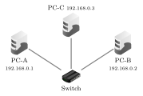
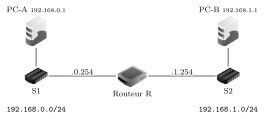
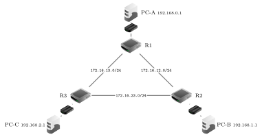

# TP et projets

Réseaux

## TP Construire, router et pinguer un réseau

Simulateur Filius (en français)

Usage de l’IA, indiqué sur chaque exercice :  aucune ;  en appui (déboguer, reformuler, vérifier ; la réponse finale est écrite et comprise par vous) ;  l’exercice s’appuie sur une réponse d’IA. Voir la [charte d’usage de l’IA](../charte.md).

!!! encadre "But du TP"

    Utiliser **Filius** pour construire un réseau, configurer les adresses IP, remplir **à la main les tables de routage** des routeurs, puis faire circuler un paquet d’un bout à l’autre avec `ping` — et l’observer. On va du réseau local le plus simple jusqu’au **routage manuel** entre trois routeurs.

**Prise en main.** Filius a deux modes (boutons du haut) : le mode **construction** (marteau) pour poser les composants et les relier avec le **Câble**, et le mode **simulation** (flèche verte) pour lancer les échanges. Les composants (barre de gauche) sont l’**Ordinateur**, le **Switch**, le **Routeur** et le **Câble** :

{ .tikz loading=lazy }

Un **double-clic** sur un composant ouvre sa configuration. **Pour taper des commandes sur une machine** : en mode simulation, double-cliquer dessus, ouvrir « **Installation des logiciels** » et installer la « **Ligne de commande** » ; on y tape ensuite `ping`, `route` (affiche la table de routage), `ipconfig`, `traceroute`. La fenêtre « **Afficher les échanges de données** » (clic droit sur une machine) montre les paquets couche par couche.

## Partie 1 — Un réseau local

### Exercice 1 — Construire et adresser  { #ex-11-reseaux-tp-1-1 }

▶  En mode **construction**, poser trois **Ordinateurs** reliés à un même **Switch**. Double-cliquer sur chacun pour saisir son **adresse IP** et le **masque** `255.255.255.0` ; laisser la passerelle vide.

{ .tikz loading=lazy }

1.  Justifier, à partir des adresses et du masque, que les trois machines sont dans **le même réseau local**.

2.  Combien de machines au maximum ce réseau `/24` peut-il contenir ?

??? corrige "Corrigé"

    **1.** Les trois adresses ont le même masque `/24` et les mêmes $24$ premiers bits (`192.168.0`) : elles appartiennent donc au **même réseau local**, et communiquent directement par le switch.

    **2.** $8$ bits d’hôte $\Rightarrow 2^8-2 = \textbf{254}$ machines (les adresses `.0` et `.255` sont réservées au réseau et à la diffusion).

### Exercice 2 — Pinguer et observer  { #ex-11-reseaux-tp-1-2 }

▶  Passer en **simulation**. Sur PC-A, installer la **Ligne de commande**, l’ouvrir et taper : `ping 192.168.0.2`.

1.  Décrire le trajet du paquet (quels composants traverse-t-il ?). Le `ping` réussit-il ?

2.  ▶  Taper `ping 192.168.0.9` (machine inexistante). Que se passe-t-il, et pourquoi ?

??? corrige "Corrigé"

    **1.** `ping 192.168.0.2` réussit ; le paquet va PC-A $\to$ Switch $\to$ PC-B (précédé d’une requête **ARP** pour trouver l’adresse physique, puis les échanges **ICMP** *echo*/*reply*).

    **2.** Vers une machine **inexistante** (`.9`), personne ne répond à l’ARP : le `ping` **échoue** (délai dépassé).

## Partie 2 — Deux réseaux, un routeur, une passerelle

### Exercice 3 — Relier deux réseaux  { #ex-11-reseaux-tp-1-3 }

▶  Construire deux réseaux locaux reliés par **un Routeur**. À sa création, Filius demande « **Sélectionnez le nombre d’interfaces du routeur** » : en mettre **2**. Configurer chaque interface via l’onglet « **Gérer les connexions** ».

{ .tikz loading=lazy }

Interface du routeur côté réseau 0 : `192.168.0.254/24` ; côté réseau 1 : `192.168.1.254/24`.

??? corrige "Corrigé"

    Construction seule : routeur à $2$ interfaces, `192.168.0.254/24` côté S1 et `192.168.1.254/24` côté S2. Vérifier que chaque câble du routeur est relié au bon switch (erreur fréquente).

### Exercice 4 — La passerelle est indispensable  { #ex-11-reseaux-tp-1-4 }

▶  En simulation, installer la Ligne de commande sur PC-A et taper `ping 192.168.1.1`.

1.  Sans passerelle, Filius répond « `destination non joignable` ». Pourquoi ? *(Le paquet doit **quitter** le réseau local.)*

2.  ▶  Régler la **Passerelle** de PC-A sur `192.168.0.254` (l’interface du routeur de *son* côté), celle de PC-B sur `192.168.1.254`. Relancer le `ping` : il doit réussir. Décrire le trajet complet.

??? corrige "Corrigé"

    **1.** `192.168.0.1` et `192.168.1.1` n’ont pas la même adresse réseau (`192.168.0` $\neq$ `192.168.1`) : le paquet doit **quitter** le réseau local. Sans **passerelle** configurée, PC-A ne sait pas à qui remettre un tel paquet $\Rightarrow$ « destination non joignable ».

    **2.** Avec les passerelles réglées sur l’interface du routeur de chaque côté, le `ping` réussit. Trajet : PC-A $\to$ S1 $\to$ **R** (qui route d’un réseau à l’autre) $\to$ S2 $\to$ PC-B.

## Partie 3 — Le routage manuel entre trois routeurs

On relie **trois** réseaux locaux par **trois routeurs** en triangle. Chaque routeur doit **savoir vers qui envoyer** un paquet destiné à un réseau qui ne lui est pas directement rattaché.

{ .tikz loading=lazy }

**Plan d’adressage** (chaque routeur a **trois** interfaces). Réseaux locaux : A `192.168.0.0/24` (sur R1), B `192.168.1.0/24` (sur R2), C `192.168.2.0/24` (sur R3).

| Routeur | vers son réseau local |  vers un routeur   |  vers un routeur   |
|:-------:|:---------------------:|:------------------:|:------------------:|
|   R1    |    `192.168.0.254`    | `172.16.12.1` (R2) | `172.16.13.1` (R3) |
|   R2    |    `192.168.1.254`    | `172.16.12.2` (R1) | `172.16.23.2` (R3) |
|   R3    |    `192.168.2.254`    | `172.16.13.3` (R1) | `172.16.23.3` (R2) |

Passerelles : PC-A $\to$ `192.168.0.254`, PC-B $\to$ `192.168.1.254`, PC-C $\to$ `192.168.2.254`.

### Exercice 5 — Construire et adresser  { #ex-11-reseaux-tp-1-5 }

▶  Réaliser ce réseau : $3$ **Routeurs** (à $3$ interfaces chacun), $3$ **Switchs**, $3$ **Ordinateurs**. Configurer toutes les interfaces (« Gérer les connexions ») et toutes les passerelles selon le plan.

??? corrige "Corrigé"

    Construction selon le plan d’adressage de l’énoncé (trois interfaces par routeur, passerelles des trois PC sur l’interface `.254` de leur routeur).

### Exercice 6 — Remplir les tables de routage à la main  { #ex-11-reseaux-tp-1-6 }

▶  Sur *chaque* routeur, ouvrir la configuration, aller sur « **Table de routage** », puis **décocher « Routage automatique »** et **décocher « Afficher toutes les lignes »** (pour ne voir que les entrées manuelles). Avec le bouton « **Nouvelle ligne** », ajouter les **deux** routes vers les réseaux qui ne sont pas directement rattachés au routeur. Les colonnes sont : **IP de destination**, **Masque**, **Passerelle suivante**, **Via l’interface**.

**Table de routage de R1** (à recopier et compléter sur le cahier avant de la saisir dans Filius — elle doit atteindre les réseaux B et C) :

| IP de destination |     Masque      | Passerelle suivante | Via l’interface |
|:-----------------:|:---------------:|:-------------------:|:---------------:|
|   `192.168.1.0`   | `255.255.255.0` |                     |                 |
|   `192.168.2.0`   | `255.255.255.0` |                     |                 |

**Tables de R2 et R3** : les construire de même (deux lignes chacune, pour les deux réseaux locaux manquants), sur le cahier, puis les saisir.

??? corrige "Corrigé"

    **Tables de routage à saisir** (chaque routeur n’a besoin que des **deux** réseaux locaux qui ne lui sont pas directement rattachés ; les réseaux directs sont gérés automatiquement) :

    **R1**  

    | IP de destination |     Masque      | Passerelle suivante | Via l’interface |
    |:-----------------:|:---------------:|:-------------------:|:---------------:|
    |   `192.168.1.0`   | `255.255.255.0` |    `172.16.12.2`    |  `172.16.12.1`  |
    |   `192.168.2.0`   | `255.255.255.0` |    `172.16.13.3`    |  `172.16.13.1`  |

    **R2**  

    | IP de destination |     Masque      | Passerelle suivante | Via l’interface |
    |:-----------------:|:---------------:|:-------------------:|:---------------:|
    |   `192.168.0.0`   | `255.255.255.0` |    `172.16.12.1`    |  `172.16.12.2`  |
    |   `192.168.2.0`   | `255.255.255.0` |    `172.16.23.3`    |  `172.16.23.2`  |

    **R3**  

    | IP de destination |     Masque      | Passerelle suivante | Via l’interface |
    |:-----------------:|:---------------:|:-------------------:|:---------------:|
    |   `192.168.0.0`   | `255.255.255.0` |    `172.16.13.1`    |  `172.16.13.3`  |
    |   `192.168.1.0`   | `255.255.255.0` |    `172.16.23.2`    |  `172.16.23.3`  |

### Exercice 7 — Pinguer de bout en bout, et vérifier  { #ex-11-reseaux-tp-1-7 }

▶  En simulation, installer la Ligne de commande sur PC-A, puis :

1.  `ping 192.168.1.1` (PC-A vers PC-B). Décrire la suite des routeurs traversés. Ralentir la vitesse (curseur en haut, $\approx 50\%$) pour bien voir le paquet avancer.

2.  Taper `route` sur PC-A, puis `traceroute 192.168.2.1` (vers PC-C). Que montrent ces commandes ?

3.  ▶  **Expérience de reroutage.** Sur R1, **modifier** la route vers `192.168.1.0` pour qu’elle sorte non plus vers R2, mais vers **R3** (passerelle suivante `172.16.13.3`, via l’interface `172.16.13.1`). Relancer `ping 192.168.1.1` depuis PC-A : le paquet passe désormais par **R1 $\to$ R3 $\to$ R2**. Vérifier avec `traceroute`. Qu’a-t-on prouvé sur le rôle de la table de routage ?

!!! encadre "Bilan du TP"

    Un **switch** suffit dans un réseau local ; changer de réseau exige un **routeur** et une **passerelle**. Avec plusieurs routeurs, chacun ne décide qu’**une étape** grâce à sa **table de routage** : en la remplissant (à la main ici, automatiquement par RIP ou OSPF en vrai) on trace la route des paquets — et en la modifiant, on la change, comme on vient de le voir.

*Crédits : icônes issues du logiciel libre Filius (licence GNU GPL v2 ou v3), `www.lernsoftware-filius.de`.*

??? corrige "Corrigé"

    **1.** `ping 192.168.1.1` : PC-A l’envoie à sa passerelle R1 ; R1 lit « destination `192.168.1.0` $\to$ passerelle suivante `172.16.12.2` », donc transmet à R2 ; R2 est directement relié au réseau B et remet le paquet à PC-B. Trajet : **PC-A $\to$ R1 $\to$ R2 $\to$ PC-B**.

    **2.** `route` affiche la table de routage de la machine (destinations, masques, passerelles, interfaces) ; `traceroute 192.168.2.1` liste les routeurs traversés jusqu’à PC-C, soit R1 puis R3.

    **3.** **Reroutage.** En changeant, dans R1, la passerelle suivante de la route `192.168.1.0` pour `172.16.13.3` (R3), le paquet vers PC-B part maintenant vers R3, qui possède lui-même une route vers `192.168.1.0` (via R2) : le trajet devient **PC-A $\to$ R1 $\to$ R3 $\to$ R2 $\to$ PC-B**. On a prouvé que c’est **la table de routage seule** qui décide du chemin : la modifier suffit à changer la route, sans toucher au câblage.
