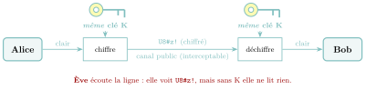
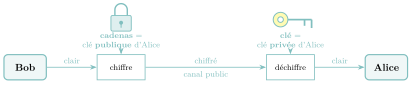
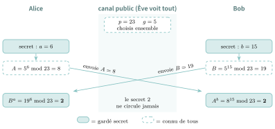
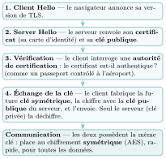

# Cours

<p class="sous-titre">Cryptographie</p>

<span id="chap-12" class="ancre"></span>

|  |  |
|:---|:---|
| **Programme (BO)** | *« Sécurisation des communications. Décrire les principes de chiffrement symétrique (clé partagée) et asymétrique (clé publique / clé privée). Décrire l’échange d’une clé symétrique en utilisant un protocole de chiffrement asymétrique pour sécuriser une communication. »* |
| **Prérequis** | la **division euclidienne** et le **reste** (opérateur `%`), la notion de **coût** d’un algorithme (croissance exponentielle), les **réseaux** et le fait qu’un paquet peut être **intercepté**. |
| **Objectifs** | *chiffrer* et *déchiffrer* avec un code symétrique ; *comprendre* l’idée du chiffrement asymétrique et *dérouler RSA* à la main ; *expliquer* l’échange de clé et le protocole **HTTPS**. |

## Le problème : se parler en secret au milieu de tous

Vous tapez un mot de passe, vous payez en ligne, vous envoyez un message : ces données traversent une dizaine de machines que vous ne connaissez pas, sur un réseau où **n’importe quel paquet peut être intercepté** (chapitre précédent). Et pourtant, presque personne ne peut les lire. Comment garder un secret quand le message passe *sous les yeux de tous* ?

C’est la question de la **cryptographie**, l’art de rendre un message illisible pour tout autre que son destinataire. Une science aussi vieille que l’écriture, qui a fait basculer des guerres (Enigma), qui protège aujourd’hui plus de 90 % du trafic d’Internet, et qui repose sur une poignée d’idées d’une élégance stupéfiante.

!!! definition "Définition 1 — Le vocabulaire du secret"

    **Chiffrer**, c’est transformer un message **clair** en un message **chiffré** (illisible) à l’aide d’une **clé**. **Déchiffrer**, c’est faire l’opération inverse quand on possède la clé. **Décrypter** (ou « casser »), c’est retrouver le message clair *sans* posséder la clé : c’est le travail de l’**attaquant** (la **cryptanalyse**).

!!! remarque "Remarque"

    On dit *chiffrer* / *déchiffrer*, jamais « crypter » (qui n’a pas de sens : on ne peut pas rendre secret sans clé). En revanche *décrypter* existe : c’est réussir à lire sans la clé.

!!! regle "Règle 1 — Le fil rouge : la clé, et rien que la clé"

    Tout au long du chapitre, une seule question : **qui possède la clé ?** Nous verrons deux grandes familles. Dans le chiffrement **symétrique**, une *même* clé secrète chiffre et déchiffre. Dans le chiffrement **asymétrique**, il y a *deux* clés jumelles : une publique (connue de tous) et une privée (jamais partagée). Comprendre la cryptographie moderne, c’est comprendre pourquoi il a fallu inventer la seconde pour résoudre le talon d’Achille de la première : **comment échanger la clé ?**

!!! propriete "Propriété 1 — Principe de Kerckhoffs (1883)"

    La sécurité d’un système ne doit reposer **que sur le secret de la clé**, jamais sur le secret de l’algorithme. L’algorithme peut (et doit) être **public** : c’est en le publiant qu’on le fait éprouver par le monde entier. *Un secret partagé par des milliers de personnes n’est plus un secret ; une clé, si.*

## Le chiffrement symétrique : une seule clé

!!! definition "Définition 2 — Chiffrement symétrique"

    Un chiffrement est **symétrique** lorsque **la même clé** sert à chiffrer et à déchiffrer. Alice et Bob doivent donc **partager un secret commun** (la clé) avant de communiquer.

{ .tikz loading=lazy }

### Le chiffre de César : le décalage

Le plus vieux code connu : Jules César décalait chaque lettre de **3 rangs** dans l’alphabet. Avec une clé $k$, la lettre de rang $x$ (A${}=0$, B${}=1$, …, Z${}=25$) devient la lettre de rang $(x+k)\bmod 26$.

!!! exemple "Exemple"

    Avec $k=3$ : `BONJOUR` devient `ERQMRXU`. Pour déchiffrer, on décale de $3$ *en arrière* (soit $(x-3)\bmod 26$).

```python
def cesar(message, k):
    resultat = ""
    for lettre in message:
        rang = ord(lettre) - ord("A")     # A->0, B->1, ...
        nouveau = (rang + k) % 26          # decalage circulaire
        resultat = resultat + chr(nouveau + ord("A"))
    return resultat

# chiffrer avec k, dechiffrer avec -k (ou 26-k)
```

!!! propriete "Propriété 2 — Un code très faible"

    La clé de César est un nombre entre $0$ et $25$ : il n’y a que **26 clés possibles**. Un attaquant les essaie *toutes* en une fraction de seconde (**attaque par force brute**). Pire : même sans force brute, une **analyse des fréquences** suffit. En français, la lettre la plus fréquente est le **E** ; la lettre la plus fréquente du texte chiffré est donc, très probablement, un E décalé — ce qui révèle la clé.

### Le chiffrement affine : un peu d’arithmétique

On généralise César : la lettre de rang $x$ devient $(a\,x + b)\bmod 26$. La clé est le couple $(a,b)$.

!!! regle "Règle 2 — La condition sur $a$"

    Pour que le déchiffrement soit possible, il faut que $a$ soit **premier avec $26$** (leur PGCD vaut $1$). Sinon, deux lettres différentes pourraient se chiffrer pareil : impossible de revenir en arrière. Les valeurs possibles de $a$ sont donc : $1, 3, 5, 7, 9, 11, 15, 17, 19, 21, 23, 25$.

Pour déchiffrer, on a besoin de l’**inverse modulaire** de $a$ : le nombre $a^{-1}$ tel que $a\times a^{-1}\equiv 1\ [26]$. Par exemple $5^{-1}\equiv 21\ [26]$ (car $5\times 21 = 105 = 4\times 26 + 1$). En Python : `pow(5, -1, 26)` renvoie `21`. On retiendra ce mot *inverse modulaire* : il reviendra, central, dans RSA.

### Vigenère : le « chiffre indéchiffrable »

Faiblesse commune de César et affine : une lettre donnée est *toujours* chiffrée de la même façon. Blaise de Vigenère (XVI<sup>e</sup> siècle) a l’idée d’utiliser une **clé-mot** répétée : chaque lettre du message est décalée selon la lettre correspondante de la clé.

!!! exemple "Exemple"

    Message `NSIROCKS`, clé `CLE` répétée en `CLECLECL`. On additionne les rangs modulo $26$ ($N+C$, $S+L$, …) : on obtient `PDMTZGMD`. Avec la même clé, `ANANAS` devient `CYEPLW` : la même lettre du clair (les trois `A`) donne cette fois *trois* lettres chiffrées différentes (`C`, `E`, `L`).

Réputé incassable pendant trois siècles, il fut finalement percé par **Charles Babbage** (vers 1854) puis **Friedrich Kasiski** (1863) : la clé étant *répétée*, des motifs réapparaissent périodiquement et trahissent sa longueur.

### Le masque jetable : le seul code inviolable

Poussons l’idée de Vigenère à l’extrême : et si la clé était **aussi longue que le message**, **totalement aléatoire**, et **utilisée une seule fois** ? On obtient le **masque jetable** (*one-time pad*). En informatique, on ne décale plus les lettres : on combine chaque caractère du message avec la clé par un **OU exclusif** (XOR, noté `^`).

!!! propriete "Propriété 3 — Le XOR est son propre inverse"

    Le XOR a une propriété magique : $(m \oplus k)\oplus k = m$. La *même* opération, avec la *même* clé, chiffre *et* déchiffre. Une seule fonction suffit.

```python
def chiffre(message, masque):
    resultat = ""
    for i in range(len(message)):
        code = ord(message[i]) ^ ord(masque[i])   # XOR caractere par caractere
        resultat = resultat + chr(code)
    return resultat
# chiffre(chiffre(msg, masque), masque) == msg   (le XOR s'annule)
```

!!! regle "Règle 3 — Pourquoi c’est prouvé inviolable"

    Supposons qu’Ève intercepte le chiffré de `LUNDI`. Comme le masque est aléatoire et aussi long que le message, *tout* clair de 5 lettres est possible : `MARDI`, `JEUDI`, `STYLO`… Il y a autant de masques que de clairs plausibles ($26^5$), et rien ne distingue le vrai des autres. Ève n’apprend **rien**. C’est la **sécurité parfaite** (ou inconditionnelle : aucune puissance de calcul n’y change rien), démontrée par **Claude Shannon** (1949).

!!! remarque "Remarque"

    Le masque jetable est inviolable… en théorie. En pratique, il est peu commode : il faut une clé *aussi longue que tout ce qu’on veut s’envoyer*, vraiment aléatoire, et jamais réutilisée (réutiliser un masque casse tout). Le « téléphone rouge » Moscou–Washington l’utilisait pendant la Guerre froide.

### AES : le standard d’aujourd’hui

Les codes modernes ne travaillent plus lettre par lettre mais **bit par bit, par blocs**. Le plus utilisé est l’**AES** (*Advanced Encryption Standard*, 2001) :

- il chiffre des **blocs de 128 bits** rangés dans une matrice $4\times 4$ d’octets ;

- une clé de **128, 192 ou 256 bits** pilote une série de brouillages (substitutions, décalages, mélanges) ;

- pour l’AES-256, une attaque par force brute demanderait $2^{256}$ essais — un nombre à **78 chiffres**, hors de portée de toute machine ;

- aucune attaque efficace n’est connue à ce jour. C’est un chiffrement symétrique… et il est **excellent**.

!!! regle "Règle 4 — Le talon d’Achille du symétrique"

    Le chiffrement symétrique est **rapide** et **robuste** : parfait pour de gros volumes. Mais il a un défaut fatal : Alice et Bob doivent **déjà partager la clé secrète**. Comment l’échanger sur un réseau où tout est intercepté, *sans s’être jamais rencontrés* ? C’est le **problème de l’échange de clé** — et pendant des siècles, on a cru qu’il était insoluble.

<span id="cours-12-1" class="ancre"></span>

<span class="afaire">▶ Exercices d'application :</span> exercices **[1](exercices.md#ex-12-1) à [5](exercices.md#ex-12-5)** (César, affine, Vigenère, masque jetable)

## Le chiffrement asymétrique : deux clés jumelles

En **1976**, **Whitfield Diffie** et **Martin Hellman** (Stanford) publient une idée qui retourne 2000 ans de cryptographie : et si les deux clés étaient **différentes** ?

**Un peu d’histoire.** Passionné de cryptographie, à une époque où ce domaine était presque entièrement réservé aux militaires, **Whitfield Diffie** avait sillonné les États-Unis au début des années 1970 pour rencontrer les rares chercheurs qui s’y intéressaient ; c’est ainsi qu’il rejoint Martin Hellman à Stanford. Leur article de 1976, *New Directions in Cryptography*, fonde la cryptographie à clé publique et leur vaut le prix Turing en 2015.

\*(image manquante : 12_hist_diffie)\*  
Whitfield Diffie

!!! definition "Définition 3 — Chiffrement asymétrique (à clé publique)"

    Chaque personne possède une **paire** de clés jumelles :

    - une **clé publique**, qu’elle distribue à qui veut (comme un cadenas ouvert) ;

    - une **clé privée**, qu’elle garde secrète et ne partage *jamais*.

    Un message chiffré avec la clé publique ne peut être déchiffré que par la clé privée associée — et *réciproquement*. Surtout : **connaître la clé publique ne permet pas de retrouver la clé privée**.

{ .tikz loading=lazy }

*Bob veut écrire à Alice ? Il prend le cadenas public d’Alice (que tout le monde peut copier), ferme la boîte avec, et l’envoie. Seule Alice, qui a la clé privée, peut l’ouvrir — même Bob ne le pourrait plus !*

### Deux clés aux rôles interchangeables

Appelons les deux clés d’Alice $A$ (privée) et $B$ (publique). Elles vérifient deux propriétés remarquables :

- on ne peut pas déduire l’une de l’autre ;

- ce qui est chiffré avec l’une se déchiffre avec l’*autre*, **dans les deux sens**.

Cette symétrie ouvre *deux* usages selon la clé avec laquelle on *commence* :

| **On chiffre avec…** | **On déchiffre avec…** | **But** |
|:---|:---|:---|
| la clé **publique** du destinataire | sa clé **privée** | **confidentialité** (seul lui lira) |
| sa **propre** clé privée | la clé **publique** de l’expéditeur | **authentification** (signature) |

### L’échange de clé de Diffie-Hellman

Avant même RSA, Diffie et Hellman résolvent le fameux problème de l’échange de clé : permettre à Alice et Bob de fabriquer une **clé secrète commune** *en public*, sans se l’être jamais transmise.

!!! regle "Règle 5 — L’image des pots de peinture"

    Alice et Bob conviennent *publiquement* d’une couleur commune. Chacun y ajoute *en secret* sa propre couleur, et s’échange le mélange (impossible à « dé-mélanger »). Enfin, chacun rajoute sa couleur secrète au mélange reçu : ils obtiennent la **même** couleur finale, qu’Ève, elle, ne peut pas reconstituer. La « peinture » mathématique est l’**exponentiation modulaire**.

!!! exemple "Exemple"

    Publics : $p=23$, $g=5$. Alice choisit en secret $a=6$ et publie $A=5^{6}\bmod 23 = 8$. Bob choisit $b=15$ et publie $B=5^{15}\bmod 23 = 19$. Chacun calcule alors le secret commun : Alice fait $B^{a}=19^{6}\bmod 23 = 2$ ; Bob fait $A^{b}=8^{15}\bmod 23 = 2$. **Même résultat : $2$**, sans jamais l’avoir transmis ! Ève connaît $p,g,A,B$ mais ne peut pas retrouver $a$ ni $b$ (c’est le *problème du logarithme discret*, très difficile).

{ .tikz loading=lazy }

### Authentification : la signature numérique

Le chiffrement asymétrique ne fait pas que cacher : il **prouve l’identité**. Si Alice chiffre un message avec sa clé **privée** (que personne d’autre ne possède), alors *n’importe qui* peut le déchiffrer avec sa clé **publique** — et si ça marche, c’est la **preuve** que le message vient bien d’Alice. C’est le principe de la **signature numérique**, qui résout le problème de l’**authentification** : être sûr que l’interlocuteur est bien celui qu’il prétend être.

<span id="cours-12-6" class="ancre"></span>

<span class="afaire">▶ Exercices d'application :</span> exercice **[6](exercices.md#ex-12-6)** (symétrique ou asymétrique ?)

## RSA : le chiffrement asymétrique, en vrai

Diffie et Hellman avaient l’*idée* du chiffrement à clé publique, mais pas de recette concrète. Elle vient un an plus tard.

### Une histoire à rebondissement

!!! remarque "Remarque — La double invention"

    En **1977** au MIT, **Ron Rivest**, **Adi Shamir** et **Leonard Adleman** cherchent à prouver qu’une telle recette est *impossible*… et démontrent l’inverse : ils inventent **RSA** (leurs initiales). Coup de théâtre : on apprendra en **1997** que le Britannique **Clifford Cocks**, au service secret GCHQ, avait trouvé exactement le même système **quatre ans plus tôt** (1973), mais classé « Secret Défense ». Il fut le véritable inventeur… que le monde ignora près de vingt-cinq ans.

### Rappel : l’arithmétique modulaire

Faire des calculs **modulo $n$**, c’est ne garder que le **reste** de la division par $n$. On écrit $15\equiv 1\ [7]$ (lire « $15$ est congru à $1$ modulo $7$ ») car $15 = 2\times 7 + 1$. RSA repose entièrement là-dessus.

### Étape par étape : la fabrication des clés

!!! regle "Règle 6 — Générer une paire de clés RSA"

    1.  Choisir deux **grands nombres premiers** $p$ et $q$ (dans la réalité : plus de 150 chiffres chacun).

    2.  Calculer $n = p\times q$. Ce nombre $n$ sera public.

    3.  Calculer $\varphi = (p-1)(q-1)$, puis choisir $e$ **premier avec** $\varphi$.  
        La **clé publique** est le couple $(e, n)$.

    4.  Calculer $d$, l’**inverse modulaire** de $e$ : le nombre tel que $e\times d\equiv 1\ [\varphi]$.  
        La **clé privée** est le couple $(d, n)$.

!!! exemple "Exemple — Fabrication complète, avec de petits nombres"

    Prenons $p=3$ et $q=11$.

    - $n = 3\times 11 = 33$.

    - $\varphi = (3-1)(11-1) = 2\times 10 = 20$. On choisit $e=3$ (premier avec $20$).

    - **Clé publique : $(3,\,33)$**, diffusée à tous.

    - On cherche $d$ tel que $3d\equiv 1\ [20]$. Comme $3\times 7 = 21 = 20+1$, on a $d=7$. En Python : `pow(3, -1, 20)` renvoie `7`.

    - **Clé privée : $(7,\,33)$**, gardée secrète.

### Chiffrer et déchiffrer

!!! regle "Règle 7 — Les deux opérations RSA"

    Pour un message-nombre $M$ (avec $0\le M < n$) : $$\text{chiffrer :}\quad C = M^{e}\bmod n \qquad\qquad \text{déchiffrer :}\quad M = C^{d}\bmod n$$

!!! exemple "Exemple — Bob écrit à Alice"

    Bob veut envoyer le nombre $M=4$. Il a la clé publique d’Alice $(3,33)$ : $$C = 4^{3}\bmod 33 = 64 \bmod 33 = 31.$$ Il transmet **31**. Alice reçoit $31$ et applique sa clé privée $(7,33)$ : $$M = 31^{7}\bmod 33 = 27\,512\,614\,111 \bmod 33 = 4.$$ Elle retrouve $4$, le message de Bob. Ève, qui a vu passer $31$ et connaît $(3,33)$, ne peut pas résoudre $x^{3}\equiv 31\ [33]$ efficacement.

*Le principe est toujours le même, quels que soient $p$, $q$ et $e$ : d’autres jeux de clés sont fabriqués et vérifiés en Python dans le TP proposé en fin de chapitre.*

### Pourquoi c’est sûr, et pourquoi ça marche

!!! regle "Règle 8 — La sécurité repose sur la factorisation"

    La clé publique donne $n$. Pour retrouver la clé privée $d$, il faudrait connaître $\varphi=(p-1)(q-1)$, donc **retrouver $p$ et $q$** à partir de $n$ : **factoriser** $n$. Or multiplier deux grands premiers est *facile*, mais pour l’opération inverse (factoriser), on ne connaît **aucun algorithme efficace** : les meilleures méthodes connues demandent un temps qui explose avec la taille de $n$. Avec un $n$ de plusieurs centaines de chiffres, aucune machine actuelle n’y parvient. Le plus grand $n$ factorisé (2020) avait $250$ chiffres.

!!! demonstration "Démonstration — au-delà du programme pourquoi le déchiffrement retombe sur $M$"

    Comme $e\times d\equiv 1\ [\varphi]$, le **petit théorème de Fermat** (et sa généralisation d’Euler) permet de montrer que $M^{ed}\equiv M\ [n]$. Or déchiffrer, c’est calculer $C^{d} = (M^{e})^{d} = M^{ed}\equiv M\ [n]$ : on retombe exactement sur le message. Les rôles de $e$ et $d$ étant symétriques ($M^{ed}=M^{de}$), on peut aussi bien chiffrer avec la privée et déchiffrer avec la publique — c’est ce qui autorise la signature.

### RSA en Python

Python fait tous ces calculs grâce à la fonction `pow` « à trois arguments » : `pow(M, e, n)` calcule $M^{e} \bmod n$ par **exponentiation modulaire rapide**, sans jamais construire le nombre géant $M^{e}$ ; et `pow(e, -1, phi)` calcule l’inverse modulaire $d$. Sur l’exemple ci-dessus, `pow(3, -1, 20)` renvoie `7`, `pow(4, 3, 33)` renvoie `31` (chiffrement) et `pow(31, 7, 33)` renvoie `4` (déchiffrement).

!!! regle "Règle 9 — En quel langage écrit-on la vraie cryptographie ?"

    Les programmes Python de ce chapitre **simulent** l’algorithme pour le comprendre. La cryptographie réelle (celle de votre navigateur) est écrite en **C** et en **assembleur**, pour la vitesse et pour maîtriser chaque détail : une simple variation du *temps* de calcul peut fuiter la clé (attaque par *canal auxiliaire*). On ne « bricole » jamais sa propre crypto en production : on utilise des bibliothèques éprouvées.

### RSA est-il éternel ? (l’ombre quantique)

!!! remarque "Remarque"

    Deux évènements pourraient faire tomber RSA : (1) la découverte d’un algorithme *classique* rapide de factorisation (régulièrement annoncée, régulièrement démentie) ; (2) surtout, l’**ordinateur quantique**. L’**algorithme de Shor** (1994) factorise en temps *polynomial* sur une telle machine : le jour où un ordinateur quantique assez grand existera, RSA s’effondrera. C’est pourquoi les chercheurs préparent déjà la **cryptographie post-quantique**.

<span id="cours-12-7" class="ancre"></span>

<span class="afaire">▶ Exercices d'application :</span> exercices **[7](exercices.md#ex-12-7) à [10](exercices.md#ex-12-10)** (RSA, inverse modulaire, Diffie-Hellman)

## HTTPS : le mariage des deux mondes

Aujourd’hui, le petit cadenas de votre navigateur signifie **HTTPS** : le trafic est chiffré. Mais avec quoi ? Ni l’un ni l’autre seul :

- le **symétrique** (AES) est rapide mais suppose une clé déjà partagée ;

- l’**asymétrique** (RSA) résout l’échange de clé mais est **lent** (gros calculs).

!!! regle "Règle 10 — L’idée de HTTPS : le meilleur des deux"

    On utilise l’**asymétrique** *juste au début*, pour échanger en sécurité une **clé de session symétrique**. Puis, tout le reste de la communication (les vraies données, en volume) est chiffré avec cette clé **symétrique**, bien plus rapide. HTTPS $=$ **TLS** (l’échange de clé, asymétrique) $+$ HTTP chiffré (les données, symétrique).

### La poignée de main TLS (*handshake*)

{ .tikz loading=lazy }

!!! remarque "Remarque"

    Le **certificat** et l’**autorité de certification** apportent l’**authentification** : sans eux, un attaquant pourrait se placer au milieu (*man in the middle*) en présentant *sa* clé publique à la place de celle du serveur. Le certificat, signé par une autorité de confiance, garantit que la clé publique est bien celle du bon serveur.

<span id="cours-12-11" class="ancre"></span>

<span class="afaire">▶ Exercices d'application :</span> exercice **[11](exercices.md#ex-12-11)** (le cadenas HTTPS du navigateur)

!!! remarque "Remarque — Liens avec d’autres chapitres"

    Le chiffrement répond à une faiblesse des **réseaux** : un paquet traverse des routeurs inconnus et peut être intercepté. HTTPS chiffre le message de la couche **application** (HTTP) avant qu’il ne descende les couches **TCP/IP** : les routeurs acheminent les paquets sans pouvoir en lire le contenu. La sécurité de **RSA** est une question de **coût** : factoriser semble demander un temps exponentiel, ce qui la relie à la question P versus NP, que l’on évoquera au chapitre « calculabilité ». Enfin, les puces de nos téléphones intègrent un module dédié au chiffrement AES (on le retrouvera au chapitre « systèmes sur puce »).

## Bilan — la carte mémoire

| **Notion** | **À retenir** |
|:---|:---|
| Chiffrer / déchiffrer / décrypter | avec clé / avec clé / **sans** clé (l’attaquant) |
| Kerckhoffs | la sécurité repose sur la **clé**, pas sur l’algorithme (public) |
| Symétrique | **une** clé partagée ; rapide ; ex. César, Vigenère, masque, **AES** |
| Masque jetable | clé aléatoire aussi longue, jetable $\Rightarrow$ **inviolable** (Shannon) |
| Défaut du symétrique | **échanger la clé** sur un canal non sûr |
| Asymétrique | **2** clés jumelles : **publique** (chiffre) / **privée** (déchiffre) |
| Diffie-Hellman | fabriquer une clé commune **en public** (exponentiation mod.) |
| Authentification | chiffrer avec sa clé **privée** $=$ **signer** |
| RSA | $n=pq$ ; $\varphi=(p{-}1)(q{-}1)$ ; $(e,n)$ publique, $(d,n)$ privée |
| RSA (formules) | $C=M^{e}\bmod n$ ; $M=C^{d}\bmod n$ ; `d = pow(e,-1,phi)` |
| Sécurité de RSA | difficulté de **factoriser** $n$ ; menace : **Shor** (quantique) |
| HTTPS | asymétrique pour **échanger la clé** $+$ symétrique pour **les données** |

## Erreurs fréquentes

- **Dire « crypter ».** On dit *chiffrer* / *déchiffrer* (avec clé) et *décrypter* (sans clé, l’attaquant).

- **Croire que César ou Vigenère sont sûrs.** $26$ clés pour César ; Vigenère tombe par l’analyse des motifs répétés.

- **Confondre les deux clés dans le bon sens.** Pour la *confidentialité*, on chiffre avec la clé **publique** du *destinataire*. Pour *signer*, on chiffre avec sa *propre* clé **privée**.

- **Oublier la condition « $e$ premier avec $\varphi$ »** (et « $a$ premier avec $26$ » pour l’affine) : sans elle, pas d’inverse modulaire, donc pas de déchiffrement.

- **Calculer $\varphi$ avec $n$.** C’est $\varphi=(p-1)(q-1)$, pas $n-1$.

- **Penser que HTTPS n’utilise que RSA.** RSA sert *seulement* à échanger la clé ; les données sont chiffrées en **symétrique** (AES), car c’est rapide.

## Savoir-faire à maîtriser

*À la fin du chapitre, je sais…*

- **chiffrer** et **déchiffrer** par décalage (César), par le masque jetable / XOR $\to$ ex. [1](exercices.md#ex-12-1), [2](exercices.md#ex-12-2), [5](exercices.md#ex-12-5) ;

- **expliquer** la différence symétrique / asymétrique et le **problème de l’échange de clé** $\to$ ex. [6](exercices.md#ex-12-6), [10](exercices.md#ex-12-10) ;

- **dérouler RSA** : calculer $n$, $\varphi$, choisir $e$, trouver $d$, chiffrer et déchiffrer un nombre $\to$ ex. [7](exercices.md#ex-12-7), [8](exercices.md#ex-12-8), [9](exercices.md#ex-12-9) ;

- **expliquer** l’authentification (signer avec la clé privée) et le rôle d’un certificat $\to$ ex. [6](exercices.md#ex-12-6), [11](exercices.md#ex-12-11) ;

- **décrire** le fonctionnement de **HTTPS** (asymétrique pour la clé, symétrique pour les données) $\to$ ex. [11](exercices.md#ex-12-11), [14](exercices.md#ex-12-14).

## Vers le Grand Oral

- **Comment garder un secret quand tout le monde peut lire le message ?** *(chiffrement, clé, Kerckhoffs ; du César au masque jetable inviolable.)*

- **Comment deux inconnus peuvent-ils fabriquer un secret commun en public ?** *(le coup de génie de Diffie-Hellman ; l’échange de clé.)*

- **Pourquoi peut-on publier une clé sans compromettre le secret ?** *(clé publique / privée ; RSA ; la difficulté de factoriser.)*

- **Que signifie vraiment le petit cadenas de mon navigateur ?** *(HTTPS $=$ TLS $+$ AES ; certificat et autorité de certification.)*

- **L’ordinateur quantique va-t-il casser Internet ?** *(algorithme de Shor ; factorisation ; cryptographie post-quantique.)*

## Un peu d’histoire

!!! remarque "Remarque"

    La cryptographie a changé le cours de l’Histoire. Pendant la Seconde Guerre mondiale, l’armée allemande chiffrait ses ordres avec la machine **Enigma**, réputée inviolable : ses rotors, qui tournent à chaque lettre frappée, changent la substitution à chaque caractère, avec environ $10^{20}$ réglages possibles. À **Bletchley Park**, une équipe menée par **Alan Turing** construisit une machine électromécanique, la « Bombe », pour la casser : les historiens estiment que cet exploit a raccourci la guerre de *deux ans*. Turing, père de l’informatique théorique, fut aussi l’un des plus grands cryptanalystes de l’Histoire. Dès **1883**, **Auguste Kerckhoffs** avait énoncé le principe qui gouverne encore toute la discipline : ne comptez jamais sur le secret de la méthode, seulement sur celui de la clé.

    \*(image manquante : 12_hist_enigma)\*  
    Une machine Enigma à trois rotors
