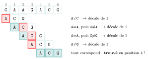
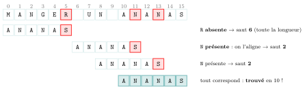
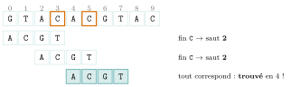
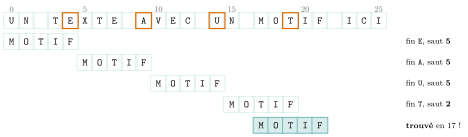
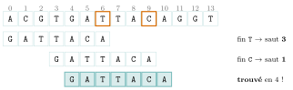

# Cours

<p class="sous-titre">Recherche textuelle</p>

<span id="chap-12" class="ancre"></span>

|  |  |
|:---|:---|
| **Programme (BO)** | *« Recherche textuelle. Décrire un algorithme de recherche textuelle. Étudier la complexité de l’algorithme de Boyer-Moore, notamment le prétraitement du motif. »* |
| **Prérequis** | les **chaînes de caractères** et l’accès par indice ($0$ à $n-1$), la notion de **coût** (linéaire, quadratique), les **dictionnaires** (pour le prétraitement). |
| **Objectifs** | *écrire* la recherche naïve ; *comprendre* les deux idées de **Boyer-Moore** (lire à l’envers, sauter loin) ; *construire* la table de prétraitement et *dérouler* **Boyer-Moore** et **Horspool**. |

## Le problème : trouver une aiguille dans une botte de foin

Chaque fois que vous faites `Ctrl+F` dans un document, que `grep` fouille un fichier, qu’un antivirus reconnaît la « signature » d’un virus, ou qu’un biologiste cherche un gène dans un génome de **trois milliards** de bases, le même problème se pose : **trouver un motif dans un texte**.

!!! definition "Définition 1 — Recherche textuelle"

    On cherche les **occurrences** d’un **motif** (une petite chaîne, de longueur $m$) dans un **texte** (une grande chaîne, de longueur $n$, avec $m \le n$). Une occurrence est une position $i$ du texte à partir de laquelle le motif apparaît intégralement.

!!! exemple "Exemple"

    Dans le vers de Verlaine

    *« Les sanglots longs des violons de l’automne… »*

    le motif `violons` apparaît à la position **23** (on compte à partir de $0$, espaces compris).

!!! remarque "Remarque — Un terrain de jeu magnifique : l’ADN"

    L’information génétique est une immense chaîne sur un alphabet de **quatre lettres** — `A`, `T`, `G`, `C` (les bases azotées). Chercher si le triplet `ACG` ou le gène `GATTACA` apparaît dans un brin, c’est *exactement* de la recherche textuelle — sur des textes de milliards de caractères. D’où l’importance d’algorithmes… rapides.

## La méthode naïve : la fenêtre glissante

L’idée la plus simple : on **superpose** le motif au début du texte, on compare lettre à lettre ; en cas d’échec, on décale le motif d’**un seul cran** vers la droite, et on recommence.

*Cherchons `ACG` dans `CAAGACG`. On compare de gauche à droite ; au premier désaccord, on glisse d’un cran.*

{ .tikz loading=lazy }

*Cinq alignements, chacun décalé d’un seul cran : c’est lent. On « redécouvre » le texte à chaque pas.*

```python
def recherche_naive(motif, texte):
    n, m = len(texte), len(motif)
    positions = []
    for i in range(n - m + 1):           # chaque position de depart
        j = 0
        while j < m and texte[i + j] == motif[j]:
            j += 1                        # on compare de gauche a droite
        if j == m:                        # tout le motif a correspondu
            positions.append(i)
    return positions
```

!!! propriete "Propriété 1 — Un coût qui peut exploser"

    Dans le pire des cas (par exemple motif `AAAA…AB` dans un texte `AAAA…A`), on compare presque tout le motif à chaque position : environ $n\times m$ comparaisons — un coût **quadratique**. Trop lent pour de très longs textes. Et surtout : la méthode naïve *oublie* tout ce qu’elle vient d’apprendre à chaque décalage.

<span id="cours-12-1" class="ancre"></span>

<span class="afaire">▶ Exercices d'application :</span> exercices **[1](exercices.md#ex-12-1) et [2](exercices.md#ex-12-2)** (méthode naïve)

## Boyer-Moore : lire à l’envers, et sauter loin (1977)

En 1977, Robert **Boyer** et J Strother **Moore** ont une double idée, à la fois simple et géniale.

!!! regle "Règle 1 — Les deux idées de Boyer-Moore"

    **(1) Comparer le motif de la *droite* vers la *gauche*** (en commençant par sa dernière lettre).  
    **(2) Prétraiter le motif** pour, en cas d’échec, **sauter de plusieurs crans d’un coup** au lieu d’un seul — grâce à la **règle du mauvais caractère**.

{ .tikz loading=lazy }

**La règle du mauvais caractère.** Supposons qu’en comparant de droite à gauche, on bute sur un caractère `c` du texte qui ne correspond pas. Deux cas :

- `c` **n’existe pas** dans le motif : inutile d’essayer les alignements où `c` tomberait *dans* le motif — on saute d’un coup **toute la longueur** du motif !

- `c` **existe** dans le motif : on décale juste ce qu’il faut pour aligner `c` du texte avec *sa* dernière occurrence dans le motif.

Le prétraitement consiste donc à connaître, pour chaque lettre, sa **dernière position** dans le motif.

!!! exemple "Exemple — Boyer-Moore sur le mot ANANAS"

    Table des dernières positions du motif `ANANAS` (`A`0 `N`1 `A`2 `N`3 `A`4 `S`5) :

    |      lettre       |  A  |  N  |  S  |
    |:-----------------:|:---:|:---:|:---:|
    | dernière position |  4  |  3  |  5  |

    Cherchons `ANANAS` dans `MANGER UN ANANAS`. On aligne le motif au début et on compare **par la droite**. Selon la lettre fautive, le saut change :

{ .tikz loading=lazy }

*Le saut n’est pas toujours « toute la longueur » : quand la lettre fautive *existe* dans le motif (ici le `N`, en dernière position $3$), on décale juste ce qu’il faut pour l’aligner — soit $5-3=\textbf{2}$ crans.*

```python
def table_dernier(motif):
    last = {}
    for k in range(len(motif)):
        last[motif[k]] = k          # derniere position de chaque lettre
    return last

def boyer_moore(motif, texte):
    n, m = len(texte), len(motif)
    last = table_dernier(motif)
    positions = []
    i = 0
    while i <= n - m:
        j = m - 1
        while j >= 0 and texte[i + j] == motif[j]:
            j -= 1                          # comparaison DROITE -> GAUCHE
        if j < 0:
            positions.append(i)             # motif trouve
            i += 1
        else:
            c = texte[i + j]                # le "mauvais caractere"
            i += max(1, j - last.get(c, -1))  # saut (au moins 1)
    return positions
```

<span id="cours-12-3" class="ancre"></span>

<span class="afaire">▶ Exercices d'application :</span> exercices **[3](exercices.md#ex-12-3) à [5](exercices.md#ex-12-5)** (Boyer-Moore : les deux idées, dérouler, la table de décalage)

## Boyer-Moore-Horspool : la version simplifiée (1980)

Le vrai Boyer-Moore combine *deux* règles de saut (le mauvais caractère *et* le « bon suffixe » <span class="horsprog">au-delà du programme</span>). En 1980, Nigel **Horspool** propose une simplification élégante, tout aussi rapide en pratique et bien plus simple à écrire — au point qu’**elle suffit** amplement au lycée.

!!! regle "Règle 2 — L’astuce de Horspool"

    On garde la comparaison de droite à gauche. Mais, quel que soit l’endroit où l’échec se produit, on décide du saut en regardant **le caractère du texte aligné avec la *dernière* case de la fenêtre**. Une **seule** table de décalage suffit : pour chaque lettre du motif (sauf la dernière), « à quelle distance de la fin se trouve-t-elle ».

**Horspool ou Boyer-Moore : quelle différence ?** Les deux lisent le motif **de droite à gauche** et sautent grâce au mauvais caractère. Toute la différence tient au **caractère que l’on regarde** pour décider du saut.

|  | **Boyer-Moore** (mauvais caractère) | **Horspool** |
|:---|:---|:---|
| Caractère observé | celui qui a **provoqué l’échec** (à la position $j$, *variable*) | **toujours** celui aligné avec la **fin** de la fenêtre |
| Le saut dépend-il de *où* l’échec a lieu ? | **oui** : décalage $= j - (\text{dernière position de } c)$ | **non** : une **seule** case observée, toujours la même |
| Table de prétraitement | **dernière position** de chaque lettre du motif | **distance à la fin** (lettres sauf la dernière), défaut $m$ |

Autrement dit : quand la comparaison échoue *avant* la fin (une partie du suffixe correspondait déjà), Boyer-Moore se sert de la lettre *à l’endroit précis* de l’échec, tandis que Horspool ignore cette position et se rabat *toujours* sur la lettre de fin de fenêtre. Horspool est donc **plus simple** — une seule règle, un seul point d’observation — et reste tout aussi rapide en pratique. *(Le « vrai » Boyer-Moore ajoute encore la règle du « bon suffixe » <span class="horsprog">au-delà du programme</span>, qui réutilise la portion du motif déjà reconnue avant l’échec.)*

**Construire la table de décalage.** Pour un motif de longueur $m$, on parcourt ses lettres *sauf la dernière* : la lettre en position $k$ reçoit le décalage $m-1-k$. Toute lettre absente reçoit le décalage **$m$** (saut maximal).

*Exemple — la table de `MOTIF` ($m=5$)* (la dernière lettre `F` n’est pas dans la table : elle prend le décalage par défaut $5$) :

|  lettre  |  M  |  O  |  T  |  I  | *autres* |
|:--------:|:---:|:---:|:---:|:---:|:--------:|
| décalage |  4  |  3  |  2  |  1  |    5     |

```python
def table_decalage(motif):
    m = len(motif)
    dec = {}
    for k in range(m - 1):           # on ignore la DERNIERE lettre
        dec[motif[k]] = m - 1 - k
    return dec

def horspool(motif, texte):
    n, m = len(texte), len(motif)
    dec = table_decalage(motif)
    positions = []
    i = 0
    while i <= n - m:
        j = m - 1
        while j >= 0 and texte[i + j] == motif[j]:
            j -= 1                         # comparaison DROITE -> GAUCHE
        if j < 0:
            positions.append(i)            # motif trouve en i
        c = texte[i + m - 1]              # caractere aligne avec la FIN de la fenetre
        i += dec.get(c, m)               # saut (m par defaut)
    return positions
```

*Visualisons Horspool sur `ACGT` cherché dans `GTACACGTAC` (table `A`$\to 3$, `C`$\to 2$, `G`$\to 1$, autres $\to 4$). La case orangée est la lettre alignée avec la **fin** de la fenêtre : c’est elle, et elle seule, qui décide du saut.*

{ .tikz loading=lazy }

!!! exemple "Exemple — Dérouler Horspool : MOTIF dans UN TEXTE AVEC UN MOTIF ICI"

    Table : `M`$\to 4$, `O`$\to 3$, `T`$\to 2$, `I`$\to 1$, autres $\to 5$.

    <table>
    <thead>
    <tr>
    <th style="text-align: center;"><strong>fenêtre</strong></th>
    <th style="text-align: left;"><strong>texte aligné</strong></th>
    <th style="text-align: center;"><strong>lettre de fin</strong></th>
    <th style="text-align: center;"><strong>décalage</strong></th>
    </tr>
    </thead>
    <tbody>
    <tr>
    <td style="text-align: center;"><span class="math inline"><em>i</em> = 0</span></td>
    <td style="text-align: left;"><code>UN TE</code></td>
    <td style="text-align: center;"><code>E</code> (absente)</td>
    <td style="text-align: center;"><span class="math inline">5</span></td>
    </tr>
    <tr>
    <td style="text-align: center;"><span class="math inline"><em>i</em> = 5</span></td>
    <td style="text-align: left;"><code>XTE A</code></td>
    <td style="text-align: center;"><code>A</code> (absente)</td>
    <td style="text-align: center;"><span class="math inline">5</span></td>
    </tr>
    <tr>
    <td style="text-align: center;"><span class="math inline"><em>i</em> = 10</span></td>
    <td style="text-align: left;"><code>VEC U</code></td>
    <td style="text-align: center;"><code>U</code> (absente)</td>
    <td style="text-align: center;"><span class="math inline">5</span></td>
    </tr>
    <tr>
    <td style="text-align: center;"><span class="math inline"><em>i</em> = 15</span></td>
    <td style="text-align: left;"><code>N MOT</code></td>
    <td style="text-align: center;"><code>T</code></td>
    <td style="text-align: center;"><span class="math inline">2</span></td>
    </tr>
    <tr>
    <td style="text-align: center;"><span class="math inline"><em>i</em> = 17</span></td>
    <td style="text-align: left;"><code>MOTIF</code></td>
    <td colspan="2" style="text-align: left;"><strong>trouvé !</strong> (position 17)</td>
    </tr>
    </tbody>
    </table>

    **Cinq alignements** ont suffi pour parcourir un texte de $26$ caractères : presque à chaque échec, on a bondi de $5$ (la longueur du motif), *sans même lire* les lettres survolées.

*Le même déroulé, en images (la case orangée $=$ la lettre de fin de fenêtre qui décide du saut) :*

{ .tikz loading=lazy }

!!! exemple "Exemple — Un clin d’œil à l’ADN : GATTACA"

    Table de `GATTACA` : `G`$\to 6$, `A`$\to 2$, `T`$\to 3$, `C`$\to 1$, autres $\to 7$. Dans le brin `ACGTGATTACAGGT`, Horspool teste $i=0$ (fin `T` $\to$ saut $3$), $i=3$ (fin `C` $\to$ saut $1$), puis $i=4$ : **`GATTACA` trouvé** ! Trois essais au lieu de huit.

{ .tikz loading=lazy }

<span id="cours-12-6" class="ancre"></span>

<span class="afaire">▶ Exercices d'application :</span> exercices **[6](exercices.md#ex-12-6) et [7](exercices.md#ex-12-7)** (Horspool : dérouler, en Python)

## Le coût, ou le miracle du sous-linéaire

!!! regle "Règle 3 — Complexité"

    **Prétraitement** : construire la table coûte $O(m)$ (une seule passe sur le motif ; les lettres absentes du motif ne sont pas stockées : elles reçoivent le décalage par défaut $m$).  
    **Recherche** : dans le *pire* cas, on reste en $O(n\times m)$ (comme le naïf). Mais en **pratique**, sur un texte « ordinaire », les sauts sont si grands qu’on est **sous-linéaire** : de l’ordre de $O(n/m)$ comparaisons.

C’est le **prodige** de Boyer-Moore : il peut trouver un mot **sans lire tout le texte**. Et — contre-intuition merveilleuse — *plus le motif est long, plus la recherche est rapide*, car les sauts possibles sont plus grands. C’est cet algorithme (ou ses cousins) qui fait tourner `Ctrl+F`, `grep` et les moteurs de recherche.

<span id="cours-12-8" class="ancre"></span>

<span class="afaire">▶ Exercices d'application :</span> exercice **[8](exercices.md#ex-12-8)** (le coût sous-linéaire)

## Où la recherche textuelle est partout

- **Éditeurs et `grep`** : le `Ctrl+F` de vos logiciels.

- **Bio-informatique** : localiser un gène, une mutation, une amorce dans un génome de milliards de bases.

- **Antivirus** : repérer la « signature » (un motif d’octets) d’un logiciel malveillant dans un fichier.

- **Détection de plagiat**, **moteurs de recherche**, **filtres anti-spam**…

!!! remarque "Remarque — Liens avec d’autres chapitres"

    La table de prétraitement est un **dictionnaire** : on dépense un peu de **mémoire** pour gagner beaucoup de **temps**, et le **coût** devient, en pratique, sous-linéaire. La même recherche de motif existe en SQL avec `LIKE` (chapitre « bases de données »). Un antivirus cherche des signatures connues, mais le chapitre « calculabilité », plus loin dans l’année, montrera qu’aucun outil ne peut détecter *tous* les virus. Enfin, *comparer* deux textes ou deux brins d’ADN (plus longue sous-séquence commune) relève de la **programmation dynamique**.

## Bilan — la carte mémoire

| **Notion** | **À retenir** |
|:---|:---|
| Recherche textuelle | trouver un **motif** ($m$) dans un **texte** ($n$) |
| Méthode naïve | fenêtre glissante, gauche$\to$droite, décalage $1$ ; $O(n\,m)$ |
| Boyer-Moore, idée 1 | comparer le motif **de droite à gauche** |
| Boyer-Moore, idée 2 | **prétraiter** le motif pour **sauter loin** |
| Mauvais caractère | lettre absente du motif $\Rightarrow$ saut $=$ longueur $m$ |
| Horspool | saut selon la lettre **alignée avec la fin** ; 1 table |
| Table (Horspool) | lettre en position $k$ $\to$ décalage $m-1-k$ ; défaut $m$ |
| Coût | prétraitement $O(m)$ ; recherche souvent **sous-linéaire** $O(n/m)$ |

## Erreurs fréquentes

- **Comparer de gauche à droite** avec Boyer-Moore. Non : on lit le motif **à l’envers**.

- **Mettre la dernière lettre dans la table de Horspool.** On l’*exclut* (sinon le décalage serait $0$ et l’algorithme bouclerait).

- **Oublier le décalage par défaut $m$** pour une lettre absente du motif.

- **Croire Boyer-Moore toujours plus rapide.** Au pire cas il reste en $O(n\,m)$ ; c’est *en pratique* qu’il brille.

- **Confondre indice du texte et indice du motif** dans `texte[i + j]` / `motif[j]`.

## Savoir-faire à maîtriser

*À la fin du chapitre, je sais…*

- **écrire** la recherche naïve et **évaluer** son coût $\to$ ex. [1](exercices.md#ex-12-1), [2](exercices.md#ex-12-2) ;

- **expliquer** les deux idées de Boyer-Moore (lire à l’envers, sauter) $\to$ ex. [3](exercices.md#ex-12-3), [11](exercices.md#ex-12-11) ;

- **construire** la table de prétraitement (Boyer-Moore *et* Horspool) $\to$ ex. [4](exercices.md#ex-12-4), [5](exercices.md#ex-12-5) ;

- **dérouler** Horspool sur un texte donné (suite des fenêtres et des sauts) $\to$ ex. [6](exercices.md#ex-12-6), [13](exercices.md#ex-12-13) ;

- **justifier** pourquoi la recherche peut être *sous-linéaire* $\to$ ex. [8](exercices.md#ex-12-8).

## Vers le Grand Oral

- **Comment un ordinateur peut-il trouver un mot sans lire tout le texte ?** *(Boyer-Moore, sauts, sous-linéarité.)*

- **Pourquoi lire un mot « à l’envers » le fait-il trouver plus vite ?** *(comparaison droite$\to$gauche, mauvais caractère.)*

- **Comment cherche-t-on un gène dans trois milliards de bases ?** *(recherche textuelle, alphabet ADN, algorithmes rapides.)*

- **Un antivirus « lit-il » vraiment tout mon disque ?** *(signatures, motifs, coût de la recherche.)*

## Un peu d’histoire

!!! remarque "Remarque"

    En **1977**, Robert **Boyer** et J Strother **Moore** publient leur algorithme : le premier à trouver un motif en lisant *moins* de caractères qu’il n’y en a. La même année, une autre équipe (**Knuth**, **Morris** et **Pratt**) propose une approche différente, fondée sur les *préfixes* du motif. En **1980**, Nigel **Horspool** simplifie Boyer-Moore en ne gardant que la règle du mauvais caractère — une version si claire et si efficace qu’elle est aujourd’hui la plus enseignée. Un demi-siècle plus tard, ces idées font encore battre chaque `Ctrl+F` de la planète.

    Parmi ces noms, **Donald Knuth** (né en 1938) est une légende : il écrit depuis 1962 *The Art of Computer Programming*, encyclopédie de l’algorithmique toujours inachevée, et il a créé **TeX**, le logiciel de composition sur lequel repose… la mise en page de ce cours.

    \*(image manquante : 12_hist_knuth)\*  
    Donald Knuth en 2012
