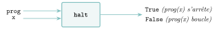
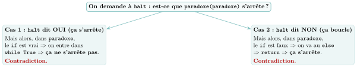
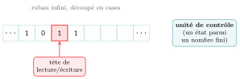
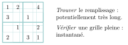
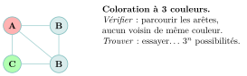

# Cours

<p class="sous-titre">Calculabilité et décidabilité</p>

<span id="chap-13" class="ancre"></span>

|  |  |
|:---|:---|
| **Programme (BO)** | *« Notion de calculabilité, de décidabilité. Montrer, par un exemple, qu’un programme peut prendre un autre programme pour argument. Comprendre l’impossibilité de construire un programme qui déciderait si un programme quelconque termine. »* |
| **Prérequis** | la notion de **fonction** et de **paramètre** ; les **boucles** et la **terminaison** (variant de boucle) ; la notion de **coût** d’un algorithme (linéaire, quadratique, exponentiel, vue en Première) ; les **paradigmes** de programmation (voir le chapitre *Programmation objet et paradigmes*). |
| **Objectifs** | *comprendre* qu’un programme est une **donnée** comme une autre ; *connaître* la distinction **décidable / indécidable** ; *savoir refaire* le raisonnement du **problème de l’arrêt** ; *situer* la **thèse de Church-Turing** et la **Turing-complétude** ; *découvrir* la question **P versus NP**. |

*Ce chapitre ne demande presque pas de code : c’est un chapitre d’**idées**. Nous allons prouver, avec quelques lignes de Python et un raisonnement d’une élégance redoutable, qu’il existe des questions parfaitement claires… auxquelles **aucun** programme ne pourra **jamais** répondre. Non pas parce que nos ordinateurs sont trop lents ou nos programmeurs trop paresseux : parce que c’est **impossible**. Bienvenue à la frontière de l’informatique.*

## Un programme peut en manger un autre

Tout part d’une remarque en apparence anodine. Une fonction comme `accueil(n)`, qui affiche `n` fois « bonjour », est une **machine** : elle reçoit une **donnée d’entrée** (l’entier `n`) et produit une **sortie**. Enregistrons-la dans un fichier `test.py` et lançons, dans un terminal, la commande `python3 test.py`. **Qui est la machine, ici ? Qui est la donnée ?** La machine, c’est `python3`. Et sa donnée d’entrée, c’est `test.py` — un **programme**, c’est-à-dire une simple suite de caractères. Le programme `accueil` est devenu une **donnée** avalée par un autre programme :

{ .tikz loading=lazy }

Et l’on peut poursuivre la poupée russe : `python3` est lui-même lancé par le programme `Terminal`, qui tourne sur le **système d’exploitation**…

!!! regle "Règle 1 — Un programme est une donnée"

    Le **code source** d’un programme n’est qu’une **chaîne de caractères**. Rien n’interdit donc de le donner en **paramètre** à un autre programme — ni même de le donner **à lui-même**. Cette idée, qui semble un jeu, est la clé de tout le chapitre.

!!! remarque "Remarque"

    Vous connaissez déjà des programmes qui prennent des programmes en entrée : un **interpréteur** (comme `python3`), un **compilateur** (qui traduit du C en langage machine), un **éditeur** qui colore la syntaxe, un **antivirus** qui inspecte un exécutable… Traiter « un programme comme une donnée » n’a rien d’exotique.

<span id="cours-13-1" class="ancre"></span>

<span class="afaire">▶ Exercices d'application :</span> exercices **[1](exercices.md#ex-13-1) et [2](exercices.md#ex-13-2)** (un programme vu comme une donnée)

## Décidable ou indécidable ?

Avant d’aller plus loin, précisons le genre de questions qui nous intéresse : celles auxquelles on répond par **oui** ou par **non**.

!!! definition "Définition 1 — Problème de décision"

    Un **problème de décision** est une question dont la réponse est **« oui »** ou **« non »**, posée sur une donnée d’entrée.

*Exemples :* « l’entier $n$ est-il premier ? » ; « le mot `m` est-il dans le dictionnaire ? » ; « la liste `L` est-elle triée ? » ; « ce graphe est-il connexe ? ». Pour chacun, on sait écrire un programme qui **s’arrête toujours** et renvoie la bonne réponse.

!!! definition "Définition 2 — Décidable / indécidable"

    Un problème de décision est **décidable** s’il existe un algorithme qui, **pour toute entrée**, **s’arrête** en un temps fini et renvoie la bonne réponse (*oui* ou *non*). Sinon, il est **indécidable**.

Les quatre exemples ci-dessus sont **décidables**. On serait tenté de croire que *tout* problème clairement posé est décidable, quitte à attendre longtemps. **C’est faux**, et c’est le grand résultat du chapitre. Il existe un problème d’apparence toute simple… qui ne l’est pas.

<span id="cours-13-3" class="ancre"></span>

<span class="afaire">▶ Exercices d'application :</span> exercices **[3](exercices.md#ex-13-3) et [4](exercices.md#ex-13-4)** (tri sélectif ; un décideur qui s’arrête)

## Le problème de l’arrêt : la plus belle preuve de l’informatique

### Un programme s’arrête-t-il ?

Certains programmes s’arrêtent, d’autres tournent pour toujours. Comparons :

```python
def compte(n):              def bavard():
    while n != 0:               while True:
        n = n - 1               print("encore !")
    return "fini"           # ne s'arrete JAMAIS
```

`compte(10)` s’arrête (elle renvoie `"fini"`). Mais `compte(10.5)` ne s’arrête **jamais** : `n` vaut $10.5,\ 9.5,\ 8.5,\dots$ et **ne tombe jamais sur $0$**. Un œil exercé le « voit ». La question naturelle :

*Pourrait-on écrire un programme qui **analyse un autre programme** et prédit, à notre place, s’il va s’arrêter ?*

### La machine rêvée : `halt`

Rêvons donc d’un programme `halt` qui prendrait en entrée :

- `prog` : le code source d’un programme ;

- `x` : une entrée pour ce programme ;

et qui renverrait `True` si `prog(x)` s’arrête, `False` sinon — **sans jamais l’exécuter** (il l’*analyse*, comme nous l’avons fait à l’œil).

{ .tikz loading=lazy }

Par exemple, `halt(compte, 10)` renverrait `True`, et `halt(compte, 10.5)` renverrait `False`. Un tel outil serait **prodigieux** : fini les bugs de boucles infinies, on pourrait vérifier automatiquement que n’importe quel logiciel termine ! Nous n’écrivons pas le *contenu* de `halt` (on le suppose seulement possible) ; contentons-nous de nous en **servir**.

### Le piège se referme : le programme qui se contredit

Construisons, à l’aide de `halt`, un petit programme un peu diabolique :

```python
def paradoxe(prog):
    if halt(prog, prog):     # SI prog(prog) s'arrete...
        while True:          #    ... alors JE BOUCLE pour toujours
            pass
    else:                    # SINON (prog(prog) boucle)...
        return "je m'arrete" #    ... alors JE M'ARRETE
```

Lisons-le lentement. `paradoxe` prend un programme `prog` et fait **le contraire** de ce que fait `prog` lancé sur lui-même : si `prog(prog)` s’arrête, alors `paradoxe` boucle ; si `prog(prog)` boucle, alors `paradoxe` s’arrête. (On a le droit d’écrire `halt(prog, prog)` : un programme peut se prendre lui-même en donnée, on l’a vu au <span class="smallcaps">I</span>.)

Maintenant, la question fatale. Puisque `paradoxe` est un programme, donnons-le **à lui-même** :

**Que fait `paradoxe(paradoxe)` ?**

{ .tikz loading=lazy }

**Dans les deux cas**, la réponse de `halt` est **démentie** par `paradoxe` lui-même. Il n’y a pas d’échappatoire : `halt` ne peut donner *aucune* réponse correcte sur cette entrée. La seule hypothèse qu’on avait faite — *`halt` existe* — est donc **intenable**.

!!! theoreme "Théorème 1 — Indécidabilité du problème de l’arrêt — Turing, 1936"

    Il ne peut exister **aucun** programme qui, recevant en entrée un programme `P` et une entrée `E` quelconques, déciderait à coup sûr si `P` lancé sur `E` **s’arrête ou non**. Le **problème de l’arrêt** est **indécidable**.

\*(image manquante : 13_hist_turing_16ans)\*  
Alan Turing (1912–1954), vers 16 ans

### Pourquoi ça marche : l’auto-référence

Ce raisonnement porte un nom : la **diagonale**. Son moteur secret est l’**auto-référence** — une chose qui parle d’elle-même et se contredit. Vous la connaissez déjà :

!!! exemple "Exemple — Le paradoxe du menteur"

    « *Cette phrase est fausse.* » Si elle est vraie, alors ce qu’elle dit est vrai, donc elle est fausse. Si elle est fausse, alors ce qu’elle dit est faux, donc elle est vraie. Aucune valeur de vérité ne tient. `paradoxe(paradoxe)`, c’est le menteur… écrit en Python.

!!! exemple "Exemple — Le barbier du village"

    « Le barbier rase tous ceux qui ne se rasent pas eux-mêmes, et *seulement* ceux-là. » Le barbier se rase-t-il lui-même ? S’il se rase, il ne devrait pas ; s’il ne se rase pas, il devrait. Même impasse.

!!! remarque "Remarque — Est-ce grave, docteur ?"

    Rassurez-vous : on peut très bien, **au cas par cas**, prouver qu’*un* programme donné s’arrête (avec un **variant de boucle**, vu en Première). Ce qui est impossible, c’est une **unique méthode automatique et universelle** qui marcherait sur **tous** les programmes. La différence est capitale : on n’a pas prouvé que « c’est trop dur », on a prouvé que « ça ne peut pas exister ».

### Une contagion : le théorème de Rice

Le problème de l’arrêt n’est pas un cas isolé. En le « ramenant » (on dit **réduisant**) à d’autres questions, on montre qu’une foule de questions sur le *comportement* d’un programme sont, elles aussi, indécidables :

- « ce programme renverra-t-il un jour la valeur $42$ ? »

- « ce programme affichera-t-il un jour un message d’erreur ? »

- « ces deux programmes calculent-ils exactement la même chose ? »

- « ce programme contient-il un virus (a-t-il tel comportement) ? »

!!! theoreme "Théorème 2 — Théorème de Rice, 1951 — version imagée"

    Toute question **non triviale** portant sur ce qu’un programme **fait** (son comportement, et non son texte) est **indécidable**.

C’est pourquoi un antivirus ne peut pas garantir qu’il détecte *tous* les virus, et pourquoi aucun outil ne pourra jamais dire à coup sûr « ce logiciel n’a aucun bug de comportement ». L’indécidabilité n’est pas une curiosité de laboratoire : elle borne, pour de bon, ce que l’informatique peut promettre.

<span id="cours-13-5" class="ancre"></span>

<span class="afaire">▶ Exercices d'application :</span> exercices **[5](exercices.md#ex-13-5) à [8](exercices.md#ex-13-8)** (le problème de l’arrêt, ses cousins, la contagion)

## Calculabilité : ce qu’une machine peut, en principe, calculer

Le problème de l’arrêt est indécidable parce que la fonction qui le résoudrait n’est pas **calculable**. Éclaircissons ce mot.

!!! definition "Définition 3 — Fonction calculable"

    Une fonction est **calculable** s’il existe un **algorithme** (une suite **finie** d’opérations élémentaires) qui, pour toute entrée $x$, produit sa sortie $f(x)$ en un temps **fini**.

Un problème de décision est alors **décidable** exactement quand sa fonction réponse (*oui*$=1$ / *non*$=0$) est **calculable**. « Indécidable » et « non calculable » sont les deux faces d’une même pièce.

### La machine de Turing

Mais qu’est-ce, au juste, qu’une « opération élémentaire » ? En 1936, pour donner un sens **mathématique** précis au mot « calculer », Turing imagine une machine idéale, d’une simplicité extrême :

{ .tikz loading=lazy }

Un **ruban infini** découpé en cases ; une **tête** qui lit et écrit un symbole sur la case courante ; un **état** interne (parmi un nombre fini) ; et une **table de règles** du type *« si je suis dans l’état $q$ et que je lis `1`, j’écris `0`, je me déplace à droite et je passe dans l’état $q'$ »*. C’est tout. Et pourtant :

!!! regle "Règle 2 — Thèse de Church-Turing"

    **Tout** ce qui est « calculable » au sens intuitif peut être calculé par une machine de Turing. Autrement dit, la machine de Turing capture **exactement** la notion de calcul.

Cette affirmation n’est pas un théorème (on ne peut pas *prouver* une définition de l’intuition), mais **aucun** modèle de calcul proposé depuis 90 ans n’a jamais su calculer davantage. Fait remarquable : à la même époque, Alonzo **Church** définissait le calcul d’une tout autre façon (le **$\lambda$-calcul**, purement mathématique)… et l’on a démontré que les deux modèles calculent **exactement les mêmes fonctions**. Deux chemins, un même sommet.

### Turing-complétude : tous les langages se valent

Notre preuve du problème de l’arrêt était écrite en Python, mais elle n’utilisait **rien de spécifique** à Python : elle vaut pour n’importe quel langage assez expressif.

!!! definition "Définition 4 — Turing-complet"

    Un langage (ou un système) est **Turing-complet** s’il peut simuler une machine de Turing — donc calculer **tout** ce qui est calculable.

!!! regle "Règle 3 — La calculabilité ne dépend pas du langage"

    Python, C, Java, OCaml, Scratch, … sont **tous** Turing-complets : ils calculent tous *le même* ensemble de fonctions. Ils diffèrent par la **commodité** et la **vitesse**, jamais par la **puissance** théorique.

!!! remarque "Remarque — La Turing-complétude est partout, parfois par accident"

    Sont Turing-complets, entre autres : le langage volontairement minimaliste **Brainfuck** (8 instructions !), le **jeu de la vie** de Conway, les circuits de ***redstone*** de *Minecraft*, le système de règles de **Magic: The Gathering**, et même… les **tableurs** avec leurs formules. Dès qu’on a « mémoire + test + boucle », la pleine puissance du calcul surgit — et, avec elle, le problème de l’arrêt.

<span id="cours-13-9" class="ancre"></span>

<span class="afaire">▶ Exercices d'application :</span> exercice **[9](exercices.md#ex-13-9)** (vrai ou faux : calculabilité et Turing-complétude)

## Gödel : quand les mathématiques rencontrent leur propre limite <span class="horsprog">au-delà du programme</span>

Le problème de l’arrêt a un **grand frère**, né cinq ans plus tôt en mathématiques pures. Au début du <span class="smallcaps">xx</span><sup>e</sup> siècle, David **Hilbert** rêve d’achever les mathématiques : trouver un **jeu d’axiomes** à partir duquel on pourrait, **mécaniquement**, démontrer *tout* énoncé vrai — et *seulement* les vrais. Un rêve de **complétude** et de **certitude**.

En **1931**, un logicien viennois de 25 ans, Kurt **Gödel**, le fait voler en éclats. Entré à l’université de Vienne en 1924 pour étudier la physique, il bascule vers les mathématiques et la logique ; fuyant l’Autriche annexée par l’Allemagne nazie, il s’installera en 1940 à Princeton, où il deviendra l’ami inséparable d’Albert Einstein.

\*(image manquante : 13_hist_godel_1925)\*  
Kurt Gödel étudiant, en 1925

!!! theoreme "Théorème 3 — Théorèmes d’incomplétude de Gödel — version imagée"

    Dans tout système d’axiomes **cohérent** et assez riche pour parler d’arithmétique :

    1.  il existe des énoncés **vrais** que le système ne pourra **jamais démontrer** (incomplétude) ;

    2.  le système ne peut pas démontrer sa **propre cohérence**.

L’astuce de Gödel ? Fabriquer un énoncé mathématique qui, décodé, affirme : « *Cet énoncé n’est pas démontrable.* » S’il était démontrable, il serait faux (le système prouverait un faux : incohérent). Il est donc **vrai mais indémontrable**. On reconnaît, mot pour mot, le **menteur** et `paradoxe(paradoxe)` : la **même auto-référence**, le même vertige.

!!! remarque "Remarque"

    Gödel (1931, en *logique*) et Turing (1936, en *informatique*) racontent la même histoire vue de deux fenêtres. Turing a d’ailleurs *« informatisé »* Gödel : là où Gödel exhibe une **vérité** indémontrable, Turing exhibe un **programme** dont on ne peut pas décider l’arrêt. La toute-puissance mécanique — des maths comme des machines — a une **frontière**, et cette frontière est **la même**.

## Calculable, oui — mais en un temps raisonnable ? P versus NP <span class="horsprog">au-delà du programme</span>

Sortons de l’*impossible* pour entrer dans le *difficile*. Parmi les problèmes **décidables** (donc résolubles), certains se résolvent **vite**, d’autres semblent réclamer un temps… astronomique. C’est la question la plus célèbre de l’informatique, et l’un des **sept problèmes du millénaire** dotés d’un prix d’**un million de dollars**.

### La classe P : les problèmes qu’on sait résoudre vite

!!! definition "Définition 5 — Classe P"

    Un problème est dans la classe **P** s’il existe un algorithme qui le résout en temps **polynomial** (coût majoré par $n^2$, $n^3$, … où $n$ est la taille de l’entrée).

En pratique, « classe P » $\approx$ « résoluble en temps **raisonnable** », même pour de grandes données. On y trouve : **trier** une liste, une **recherche dichotomique**, le **plus court chemin** (Dijkstra), tester si un nombre est **premier**… Tout, sauf les coûts **exponentiels** ($2^n$), qui explosent dès que $n$ dépasse quelques dizaines.

### L’idée reine : trouver, ou seulement vérifier ?

Voici la distinction sur laquelle tout repose. Il y a un monde entre **trouver** une solution et **vérifier** une solution qu’on vous propose.

!!! exemple "Exemple — Le Sudoku"

    Remplir une grille de Sudoku vide peut être **très long**. Mais si je vous **tends** une grille remplie, vérifier qu’elle est correcte (chaque ligne, colonne et bloc contient $1$ à $9$) est **immédiat**. **Vérifier** est facile ; **trouver** paraît dur.

{ .tikz loading=lazy }

!!! definition "Définition 6 — Classe NP"

    Un problème de décision est dans la classe **NP** si, lorsque la réponse est « oui », on peut **vérifier** une solution proposée en temps **polynomial**. (**NP** signifie « **n**on déterministe **p**olynomial », *pas* « non polynomial » !)

Beaucoup de problèmes « cauchemardesques » de l’informatique sont dans NP :

- **Voyageur de commerce** (version décision) : « existe-t-il une tournée passant par ces $n$ villes de longueur $\le L$ ? » Une tournée proposée se vérifie en additionnant ses étapes.

- **Sac à dos** : « peut-on atteindre une valeur $\ge V$ sans dépasser le poids $P$ ? »

- **Coloration de graphe** : « peut-on colorier ce graphe avec $3$ couleurs sans que deux voisins partagent la même ? »

- **SAT** : une formule logique (un grand « ET » de « OU ») peut-elle être rendue **vraie** ? (*comme composer un club où chaque membre pose ses conditions, et où il faut contenter tout le monde à la fois.*)

{ .tikz loading=lazy }

### La question à un million de dollars

D’abord, une évidence : si on sait **résoudre** vite (P), alors on sait **vérifier** vite (il suffit de résoudre et de comparer). Donc : $$\textbf{P} \subseteq \textbf{NP}.$$ La vraie question, ouverte depuis 1971 et toujours **sans réponse**, est la réciproque :

**P = NP ?** *Vérifier vite implique-t-il pouvoir trouver vite ?*

!!! definition "Définition 7 — Problème NP-complet"

    Un problème est **NP-complet** s’il est « parmi les plus durs » de NP : **tout** problème de NP peut s’y **ramener** (réduction en temps polynomial). **SAT** (Cook, 1971), le Sudoku, le voyageur de commerce, la coloration à $3$ couleurs sont NP-complets.

Conséquence spectaculaire : si l’on trouvait un jour un algorithme polynomial pour **un seul** problème NP-complet, on en aurait **d’un coup** pour **tous** les problèmes de NP — et alors **P $=$ NP**. À l’inverse, une seule preuve d’impossibilité fermerait la question dans l’autre sens. La quasi-totalité des chercheurs **parient** que **P $\ne$ NP**… sans savoir le démontrer.

!!! remarque "Remarque — Pourquoi ça compte, vraiment"

    Si **P $=$ NP** :

    - la **cryptographie** s’effondre — casser RSA revient à **factoriser** un grand nombre, ce qui deviendrait rapide ;

    - d’innombrables problèmes de **logistique**, d’**emploi du temps**, de **repliement de protéines** se résoudraient d’un coup ;

    - plus troublant : **trouver** deviendrait aussi facile que **vérifier**. Or reconnaître une belle preuve, une belle mélodie, est facile ; les *inventer* est dur. P $=$ NP signifierait, en un sens, que la **créativité** est **mécanisable**. C’est pourquoi presque tout le monde espère que **P $\ne$ NP**.

!!! remarque "Remarque — Ne pas confondre !"

    **Indécidable** (problème de l’arrêt) = « aucun algorithme, **jamais** ». **NP-complet** (Sudoku) = « un algorithme existe, mais peut-être **lent** ». Le premier parle du **possible**, le second du **rapide**. Et « non déterministe » (une machine imaginaire qui essaierait toutes les pistes *à la fois*) n’a **rien** à voir avec l’ordinateur **quantique**.

<span id="cours-13-10" class="ancre"></span>

<span class="afaire">▶ Exercices d'application :</span> exercices **[10](exercices.md#ex-13-10) à [12](exercices.md#ex-13-12)** (P versus NP)

## Un peu d’histoire — les explorateurs de l’impossible

- **1928** — David **Hilbert** pose l’*Entscheidungsproblem* : existe-t-il une procédure mécanique décidant si un énoncé mathématique est vrai ? Il croit la réponse « oui ».

- **1931** — Kurt **Gödel** (25 ans) démontre ses **théorèmes d’incomplétude** : non, les mathématiques ne peuvent être à la fois complètes et cohérentes.

- **1936** — Alan **Turing** (24 ans) invente sa **machine** et tranche l’*Entscheidungsproblem* par le **problème de l’arrêt**. La même année, Alonzo **Church** obtient le même résultat par le **$\lambda$-calcul**. L’**informatique théorique** est née… avant le premier ordinateur.

- **1939–45** — Turing casse le code **Enigma** à Bletchley Park : la théorie sert la guerre.

- **1951** — Henry **Rice** généralise : toute propriété non triviale du *comportement* d’un programme est indécidable.

- **1971** — Stephen **Cook** (et, indépendamment, Leonid **Levin**) fondent la théorie de la **NP-complétude** : la question **P versus NP** est posée. Elle est toujours ouverte.

*Épilogue : Turing, persécuté pour son homosexualité, meurt en 1954 ; il sera réhabilité, et son nom donné à la plus haute récompense de l’informatique, le **prix Turing** — le « Nobel » de la discipline.*

!!! remarque "Remarque — Liens avec d’autres chapitres"

    Le problème de l’arrêt pose, pour *tous* les programmes à la fois, la question que l’on se pose devant chaque fonction **récursive** : la **condition d’arrêt** sera-t-elle atteinte ? On sait le prouver au cas par cas, jamais par une méthode universelle. Traiter un programme comme une donnée, c’est le quotidien de l’**interpréteur** et du **système d’exploitation**, qui charge et lance les programmes (chapitre « processus »). Enfin, P versus NP prolonge la notion de **coût** : le **plus court chemin** dans un **graphe** se calcule vite, le **voyageur de commerce** semble ne pas le pouvoir, et la sécurité de **RSA** repose sur la difficulté de **factoriser** (chapitre « cryptographie »).

## Bilan — la carte mémoire

| **Notion** | **À retenir** |
|:---|:---|
| Programme = donnée | un code source est une chaîne ; on peut le passer en argument, même à lui-même |
| Problème de décision | question à réponse *oui* / *non* |
| Décidable | un algorithme s’arrête toujours et répond juste |
| Indécidable | *aucun* algorithme ne peut répondre à coup sûr, pour toute entrée |
| Problème de l’arrêt | **indécidable** (Turing, 1936) : pas de `halt` universel |
| Preuve | la machine `paradoxe` se contredit dans les deux cas (auto-référence) |
| Théorème de Rice | toute question non triviale sur le *comportement* est indécidable |
| Calculable | calculable par une machine de Turing (thèse de Church-Turing) |
| Turing-complet | un langage qui calcule tout le calculable ; tous équivalents |
| Classe P | résoluble en temps polynomial (« raisonnable ») |
| Classe NP | solution *vérifiable* en temps polynomial |
| P versus NP | *trouver* $=$ *vérifier* ? ($1$ M\$, ouvert, on croit P $\ne$ NP) |

## Erreurs fréquentes

- « Le problème de l’arrêt est indécidable parce que c’est trop long à calculer. » **Non** : c’est **impossible**, à tout jamais, quel que soit le temps ou l’ordinateur.

- « On ne peut jamais savoir si un programme s’arrête. » **Faux** : on peut le prouver **au cas par cas**. Ce qui n’existe pas, c’est une **méthode universelle** valable pour **tous** les programmes.

- Confondre **indécidable** (aucun algorithme) et **NP-complet** (un algorithme lent existe).

- Croire que « NP » veut dire « non polynomial ». Non : « **n**on déterministe **p**olynomial », et P $\subseteq$ NP.

- Croire un langage « plus puissant » qu’un autre : tous les langages Turing-complets calculent **les mêmes** fonctions.

## Savoir-faire à maîtriser

*À la fin du chapitre, je sais…*

- donner un exemple montrant qu’un programme peut prendre un programme (voire lui-même) en argument $\to$ ex. [1](exercices.md#ex-13-1), [2](exercices.md#ex-13-2) ;

- définir **décidable** / **indécidable** et donner des exemples décidables $\to$ ex. [3](exercices.md#ex-13-3), [4](exercices.md#ex-13-4) ;

- **refaire le raisonnement** du problème de l’arrêt (machine `halt`, programme `paradoxe`, les deux cas contradictoires) $\to$ ex. [6](exercices.md#ex-13-6), [7](exercices.md#ex-13-7) ;

- énoncer la **thèse de Church-Turing** et la **Turing-complétude** $\to$ ex. [9](exercices.md#ex-13-9), [17](exercices.md#ex-13-17) ;

- expliquer la différence **vérifier / trouver**, et situer **P**, **NP**, **P versus NP** $\to$ ex. [10](exercices.md#ex-13-10), [11](exercices.md#ex-13-11), [12](exercices.md#ex-13-12).

## Vers le Grand Oral

- **Existe-t-il des questions qu’aucun ordinateur ne pourra jamais résoudre ?** (*le problème de l’arrêt, la preuve par l’auto-référence.*)

- **Vérifier une solution est-il plus facile que la trouver ?** (*P versus NP, Sudoku, cryptographie.*)

- **Gödel et Turing : les mathématiques et l’informatique ont-elles les mêmes limites ?**

- **Pourquoi tous les langages de programmation se valent-ils en théorie ?** (*Turing-complétude.*)
