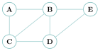

# Exercices

<p class="sous-titre">Calculabilité et décidabilité</p>

Usage de l’IA, indiqué sur chaque exercice : <span class="ia ia-rouge" title="Sans IA : le but est l'automatisme lui-même"></span> aucune ; <span class="ia ia-orange" title="IA en appui : déboguer, reformuler, vérifier ; la réponse finale est la vôtre"></span> en appui (déboguer, reformuler, vérifier ; la réponse finale est écrite et comprise par vous) ; <span class="ia ia-vert" title="IA intégrée : l'exercice s'appuie sur une réponse d'IA"></span> l’exercice s’appuie sur une réponse d’IA. Voir la [charte d’usage de l’IA](../charte.md).

*Chapitre d’idées : la plupart des exercices se rédigent en français. Soignez les raisonnements.* Niveau : ★ échauffement, ★★ classique (niveau bac), ★★★ défi ; les *coups de pouce* et les *corrigés* se déplient sous chaque exercice.

### Un programme est une donnée

### <span class="stars" title="Niveau 1 sur 3">★</span> <span class="exo-num">Exercice 1</span> — Qui est la machine, qui est la donnée ? <span class="ia ia-rouge" title="Sans IA : le but est l'automatisme lui-même"></span> { #ex-13-1 }

Pour chacune des situations, préciser quel est le **programme** (la machine) et quelle est sa **donnée d’entrée**.

1.  Dans un terminal, on tape `python3 tri.py`.

2.  Le compilateur `gcc` traduit un fichier `jeu.c` en exécutable.

3.  Un antivirus analyse le fichier `photo.exe`.

4.  Un éditeur de texte colore la syntaxe d’un fichier `code.py`.

??? corrige "Corrigé"

    1.  Machine : `python3`. Donnée : le fichier `tri.py`.

    2.  Machine : `gcc`. Donnée : le fichier `jeu.c`.

    3.  Machine : l’antivirus. Donnée : le fichier `photo.exe`.

    4.  Machine : l’éditeur de texte. Donnée : le fichier `code.py`.

    Dans chaque cas, la « donnée » est un **programme** : un programme peut donc être avalé par un autre.

### <span class="stars" title="Niveau 1 sur 3">★</span> <span class="exo-num">Exercice 2</span> — Un programme n’est qu’une chaîne de caractères <span class="ia ia-rouge" title="Sans IA : le but est l'automatisme lui-même"></span> { #ex-13-2 }

En Python, on peut écrire un programme dans une chaîne à l’aide des triples guillemets :

```python
programme = """
x = 10
while x > 0:
    x = x - 1
"""
```

1.  Expliquer, en une ou deux phrases, pourquoi **tout** programme Python peut être vu comme une chaîne de caractères.

2.  En déduire pourquoi il n’y a rien d’absurde à donner un programme **en argument** à un autre programme — ni même à un programme de se prendre **lui-même** en argument.

??? corrige "Corrigé"

    1.  Un programme est écrit avec des caractères (lettres, chiffres, symboles, retours à la ligne) : son code source **est** une chaîne de caractères, que l’on peut stocker dans une variable, dans un fichier, transmettre, etc.

    2.  Puisqu’un programme est une simple donnée (une chaîne), rien n’empêche de la passer en argument à un autre programme (un interpréteur, un compilateur…) — ni de passer le code d’un programme **à ce programme lui-même** : c’est ce qui rendra possible le raisonnement du problème de l’arrêt.

### Décidable ou indécidable ?

### <span class="stars" title="Niveau 1 sur 3">★</span> <span class="exo-num">Exercice 3</span> — Tri sélectif <span class="ia ia-rouge" title="Sans IA : le but est l'automatisme lui-même"></span> { #ex-13-3 }

Pour chaque problème de décision, dire s’il est **décidable** ou **indécidable**. Justifier d’un mot.

1.  « L’entier $n$ est-il premier ? »

2.  « La liste `L` est-elle triée dans l’ordre croissant ? »

3.  « Le programme `P`, lancé sur l’entrée `x`, va-t-il s’arrêter ? »

4.  « Le mot `m` figure-t-il dans ce dictionnaire de $100\,000$ mots ? »

5.  « Les deux programmes `P` et `Q` calculent-ils exactement la même fonction ? »

??? corrige "Corrigé"

    1.  **Décidable** (tester les diviseurs ; l’algorithme s’arrête toujours).

    2.  **Décidable** (parcourir la liste une fois).

    3.  **Indécidable** : c’est le **problème de l’arrêt**.

    4.  **Décidable** (rechercher le mot ; le dictionnaire est fini).

    5.  **Indécidable** : décider si deux programmes calculent la même fonction est une question sur leur *comportement* (théorème de Rice).

### <span class="stars" title="Niveau 2 sur 3">★★</span> <span class="exo-num">Exercice 4</span> — Un décideur qui s’arrête toujours <span class="ia ia-orange" title="IA en appui : déboguer, reformuler, vérifier ; la réponse finale est la vôtre"></span> { #ex-13-4 }

On veut décider le problème « $n$ est-il premier ? » pour un entier $n \ge 2$.

1.  Recopier et compléter cette fonction :

    ??? pouce "Coup de pouce"

        Un diviseur $d$ de $n$, autre que $1$ et $n$, est compris entre $2$ et $n-1$. Dès qu’on en trouve un, peut-on conclure ?

    ```python
    def est_premier(n):
        for d in range(2, ...):        # (a) diviseurs a tester
            if n % d == 0:
                return ...             # (b)
        return ...                     # (c)
    ```

2.  Expliquer pourquoi cette fonction **s’arrête toujours**, quelle que soit l’entrée. Que peut-on en conclure sur la décidabilité du problème ?

    ??? pouce "Coup de pouce"

        Combien de tours la boucle `for` fait-elle au plus ? Peut-elle tourner indéfiniment ?

??? corrige "Corrigé"

    1.

        ```python
        def est_premier(n):
            for d in range(2, n):       # (a) on teste 2, 3, ..., n-1
                if n % d == 0:
                    return False        # (b) un diviseur -> pas premier
            return True                 # (c) aucun diviseur -> premier
        ```

    2.  La boucle `for` parcourt un intervalle **fini** ($2$ à $n-1$) : elle se termine forcément, donc la fonction **s’arrête toujours** et renvoie la bonne réponse. Le problème « $n$ est-il premier ? » est donc **décidable**.

### Le problème de l’arrêt

### <span class="stars" title="Niveau 2 sur 3">★★</span> <span class="exo-num">Exercice 5</span> — Va-t-il s’arrêter ? <span class="ia ia-rouge" title="Sans IA : le but est l'automatisme lui-même"></span> { #ex-13-5 }

Pour chaque appel, dire s’il **s’arrête** ou non, et le justifier brièvement.

```python
def compte(n):                 def mystere(n):
    while n != 0:                  while n != 1:
        n = n - 1                      if n % 2 == 0:
    return "fini"                          n = n // 2
                                       else:
                                           n = 3 * n + 1
                                   return "fini"
```

1.  `compte(5)` puis `compte(-3)`.

    ??? pouce "Coup de pouce"

        Pour `compte(-3)`, écrire les premières valeurs de `n` : se rapproche-t-on de $0$ ?

2.  `mystere(6)`. Dérouler les valeurs successives de `n`.

3.  **Culture :** personne au monde ne sait aujourd’hui si `mystere(n)` s’arrête pour *tout* entier $n \ge 1$ (*conjecture de Syracuse*). Que cela illustre-t-il sur la difficulté de prédire l’arrêt d’un programme ?

??? corrige "Corrigé"

    1.  `compte(5)` : `n` vaut $5,4,3,2,1,0$ $\rightarrow$ **s’arrête** (renvoie `"fini"`). `compte(-3)` : `n` vaut $-3,-4,-5,\dots$ et ne vaut **jamais** $0$ $\rightarrow$ **ne s’arrête pas**.

    2.  `mystere(6)` : `n` vaut $6,3,10,5,16,8,4,2,1$ $\rightarrow$ **s’arrête**.

    3.  On a là un programme d’une **extrême simplicité** dont **personne** ne sait s’il s’arrête pour toute entrée. C’est une illustration frappante : prédire l’arrêt d’un programme peut être arbitrairement difficile — et le théorème de l’arrêt dit que, *dans le cas général*, aucune méthode automatique ne peut le faire.

### <span class="stars" title="Niveau 2 sur 3">★★</span> <span class="exo-num">Exercice 6</span> — Refaire la preuve du problème de l’arrêt <span class="ia ia-rouge" title="Sans IA : le but est l'automatisme lui-même"></span> { #ex-13-6 }

On **suppose** disposer d’une fonction `halt(prog, x)` renvoyant `True` si `prog(x)` s’arrête, `False` sinon. On écrit alors :

```python
def paradoxe(prog):
    if halt(prog, prog):
        while True:
            pass
    else:
        return "je m'arrete"
```

1.  On lance `paradoxe(paradoxe)`. **Cas 1 :** on suppose que `halt(paradoxe, paradoxe)` renvoie `True`. Quelle branche du `if` est exécutée ? L’appel s’arrête-t-il ? En quoi est-ce contradictoire ?

    ??? pouce "Coup de pouce"

        Suivre le code ligne à ligne : quelle instruction est exécutée quand le test du `if` est vrai ? Comparer ensuite avec ce que `halt` avait prédit.

2.  **Cas 2 :** on suppose que `halt(paradoxe, paradoxe)` renvoie `False`. Reprendre le même raisonnement.

3.  **Conclure** : que vient-on de démontrer au sujet de `halt` ?

??? corrige "Corrigé"

    1.  **Cas 1** : `halt(paradoxe, paradoxe)` vaut `True`, donc le test du `if` est vrai : on exécute `while True` $\rightarrow$ l’appel **ne s’arrête pas**. Or `halt` avait annoncé qu’il s’arrêtait : **contradiction**.

    2.  **Cas 2** : `halt(paradoxe, paradoxe)` vaut `False`, donc le test est faux : on exécute le `else`, qui fait `return` $\rightarrow$ l’appel **s’arrête**. Or `halt` avait annoncé qu’il ne s’arrêtait pas : **contradiction**.

    3.  Dans les deux cas, `halt` se trompe : la fonction `halt` **ne peut pas exister**. Le problème de l’arrêt est **indécidable** (Turing, 1936).

### <span class="stars" title="Niveau 2 sur 3">★★</span> <span class="exo-num">Exercice 7</span> — Cousins du paradoxe <span class="ia ia-orange" title="IA en appui : déboguer, reformuler, vérifier ; la réponse finale est la vôtre"></span> { #ex-13-7 }

Expliquer en quoi les deux énoncés suivants « tournent en rond », et quel lien ils ont avec le programme `paradoxe` de l’exercice précédent.

1.  « Cette phrase est fausse. »

2.  « Le barbier du village rase exactement ceux qui ne se rasent pas eux-mêmes. Rase-t-il le barbier ? »

    ??? pouce "Coup de pouce"

        Supposer la phrase vraie, puis fausse : que se passe-t-il dans chaque cas ? Même démarche pour le barbier : il se rase, puis il ne se rase pas.

??? corrige "Corrigé"

    1.  « Cette phrase est fausse » : si on la suppose vraie, elle affirme sa propre fausseté (donc fausse) ; si on la suppose fausse, alors ce qu’elle dit est faux, donc elle est vraie. Aucune valeur de vérité ne tient.

    2.  Le barbier : s’il se rase lui-même, il fait partie de ceux *qui se rasent*, donc il ne devrait pas se raser ; s’il ne se rase pas, il devrait. Impasse identique.

    **Lien** : dans les deux cas, un objet **parle de lui-même** et se retourne contre sa propre affirmation. C’est exactement le ressort de `paradoxe(paradoxe)`, qui fait *le contraire* de ce que `halt` prédit de lui : l’**auto-référence**.

### <span class="stars" title="Niveau 3 sur 3">★★★</span> <span class="exo-num">Exercice 8</span> — La contagion de l’indécidable <span class="ia ia-orange" title="IA en appui : déboguer, reformuler, vérifier ; la réponse finale est la vôtre"></span> { #ex-13-8 }

On admet le **théorème de l’arrêt** (indécidable). On voudrait maintenant un programme `renvoie42(prog, x)` qui dirait à coup sûr si `prog(x)` finit par renvoyer la valeur $42$.

1.  Expliquer pourquoi, si un tel programme existait, il « en saurait trop » sur le comportement de `prog`.

    ??? pouce "Coup de pouce"

        Penser à un programme qui ferait un très long calcul avant, *peut-être*, de renvoyer $42$.

    ??? pouce "Coup de pouce 2 (début de solution)"

        Partir d’un programme `prog` quelconque et fabriquer `prog2(x)` qui exécute d’abord `prog(x)`, puis renvoie $42$. Quand `prog2(x)` renvoie-t-il $42$ ?

2.  Comment appelle-t-on le résultat général affirmant que « toute question non triviale sur le comportement d’un programme est indécidable » ?

??? corrige "Corrigé"

    1.  Si `renvoie42` existait, il faudrait, pour savoir si un programme renvoie un jour $42$, être capable de dire s’il **finit** par renvoyer quelque chose — donc de résoudre (en partie) le problème de l’arrêt, qui est indécidable. On peut « ramener » (réduire) l’arrêt à cette question : elle est donc, elle aussi, indécidable.

    2.  C’est le **théorème de Rice**.

### Calculabilité et Turing-complétude

### <span class="stars" title="Niveau 1 sur 3">★</span> <span class="exo-num">Exercice 9</span> — Vrai ou faux <span class="ia ia-rouge" title="Sans IA : le but est l'automatisme lui-même"></span> { #ex-13-9 }

Répondre **vrai** ou **faux** et justifier d’un mot.

1.  Le langage C est « plus puissant » que Python : il peut calculer des fonctions que Python ne peut pas.

2.  Une fonction calculable est une fonction pour laquelle il existe un algorithme qui la calcule en un temps fini.

3.  La thèse de Church-Turing est un théorème que l’on peut démontrer.

4.  Puisque le langage Brainfuck n’a que $8$ instructions, il est moins puissant que Python.

5.  Le problème de l’arrêt serait décidable si on l’écrivait en C plutôt qu’en Python.

??? corrige "Corrigé"

    1.  **Faux** : C et Python sont tous deux Turing-complets, ils calculent *les mêmes* fonctions.

    2.  **Vrai** : c’est la définition d’une fonction calculable.

    3.  **Faux** : la thèse de Church-Turing n’est pas un théorème (elle relie l’intuition de « calcul » à un modèle formel) ; elle est *admise*, jamais démentie.

    4.  **Faux** : le nombre d’instructions ne fait pas la puissance ; Brainfuck est Turing-complet, donc aussi puissant que Python (juste beaucoup moins commode).

    5.  **Faux** : l’indécidabilité ne dépend pas du langage ; le problème de l’arrêt est indécidable dans *tout* langage Turing-complet.

### P, NP et le million de dollars

### <span class="stars" title="Niveau 1 sur 3">★</span> <span class="exo-num">Exercice 10</span> — Vérifier, est-ce facile ? <span class="ia ia-rouge" title="Sans IA : le but est l'automatisme lui-même"></span> { #ex-13-10 }

Pour chaque problème, dire si **vérifier** une solution qu’on vous propose est **facile** (rapide), et si **trouver** une solution semble facile ou difficile.

1.  Trier une liste de $1000$ nombres.

2.  Une grille de Sudoku ($9\times 9$).

3.  « Existe-t-il une tournée passant par ces $30$ villes, de longueur $\le 500$ km ? »

??? corrige "Corrigé"

    1.  Trier : **trouver** est facile (algorithme en $n\log n$) et **vérifier** aussi. Problème de classe **P**.

    2.  Sudoku : **vérifier** une grille remplie est facile ; **trouver** le remplissage semble difficile.

    3.  Voyageur de commerce : **vérifier** qu’une tournée proposée mesure $\le 500$ est facile (on additionne) ; **trouver** la meilleure semble très difficile.

### <span class="stars" title="Niveau 2 sur 3">★★</span> <span class="exo-num">Exercice 11</span> — Colorier un graphe <span class="ia ia-orange" title="IA en appui : déboguer, reformuler, vérifier ; la réponse finale est la vôtre"></span> { #ex-13-11 }

On veut colorier les sommets du graphe ci-dessous avec **$3$ couleurs**, sans que deux sommets reliés aient la même couleur.

{ .tikz loading=lazy }

1.  On vous **propose** le coloriage : A rouge, B vert, C bleu, D rouge, E rouge. Vérifier s’il est correct (parcourir les arêtes). Ce travail de vérification est-il long ?

2.  Combien y a-t-il de façons d’attribuer une couleur (parmi $3$) aux $5$ sommets, si on les essaie « bêtement » toutes ? Et pour un graphe à $n$ sommets ?

    ??? pouce "Coup de pouce"

        Chaque sommet a $3$ choix, indépendamment des autres : combien de choix pour $2$ sommets ? pour $3$ ?

3.  À quelle classe (**P** ou **NP**) ce type de problème appartient-il, et pourquoi ?

??? corrige "Corrigé"

    1.  On parcourt les arêtes : A–B (rouge/vert ok), A–C (rouge/bleu ok), **B–C (vert/bleu ok)**, B–D (vert/rouge ok), **C–D (bleu/rouge ok)**, B–E (vert/rouge ok), D–E **(rouge/rouge !)**. Deux voisins D et E sont **tous deux rouges** : le coloriage proposé est **incorrect**. La vérification est **rapide** (une passe sur les arêtes).

    2.  Chaque sommet reçoit $1$ couleur parmi $3$ : $3^5 = 243$ possibilités pour $5$ sommets, et $3^n$ pour $n$ sommets — une croissance **exponentielle**.

    3.  C’est un problème de **NP** : on *vérifie* une solution proposée en temps polynomial (une passe sur les arêtes), mais *trouver* une $3$-coloration semble exiger un temps exponentiel (le problème est même NP-complet).

### <span class="stars" title="Niveau 2 sur 3">★★</span> <span class="exo-num">Exercice 12</span> — Et si P $=$ NP ? <span class="ia ia-orange" title="IA en appui : déboguer, reformuler, vérifier ; la réponse finale est la vôtre"></span> { #ex-13-12 }

Un mathématicien annonce un algorithme **polynomial** qui résout le problème SAT (donc P $=$ NP).

1.  Rappeler ce que signifient **P**, **NP**, et pourquoi on a toujours P $\subseteq$ NP.

2.  Citer **deux** conséquences majeures de P $=$ NP (une pour la sécurité informatique, une pour l’idée de « créativité »).

    ??? pouce "Coup de pouce"

        Casser une clé ou trouver une preuve mathématique : est-ce difficile à *trouver*, facile à *vérifier* ? Que changerait P $=$ NP ?

3.  La plupart des chercheurs pensent-ils que P $=$ NP ou que P $\ne$ NP ? Ce point est-il *démontré* ?

??? corrige "Corrigé"

    1.  **P** : problèmes résolubles en temps polynomial. **NP** : problèmes dont une solution *oui* se *vérifie* en temps polynomial. On a P $\subseteq$ NP car, si l’on sait *résoudre* vite, on sait *vérifier* vite (résoudre puis comparer).

    2.  Conséquences de P $=$ NP : (sécurité) la **cryptographie RSA** s’effondrerait, car factoriser un grand nombre deviendrait rapide ; (créativité) **trouver** deviendrait aussi facile que **vérifier** — inventer une preuve, une mélodie, une solution ne serait plus « plus dur » que la reconnaître.

    3.  La quasi-totalité des chercheurs pense que P $\ne$ NP, mais ce n’est **pas démontré** : c’est un problème **ouvert** (l’un des sept problèmes du millénaire, doté d’un million de dollars).

### Vers le bac

### <span class="stars" title="Niveau 2 sur 3">★★</span> <span class="exo-num">Exercice 13</span> — Terminaison et problème de l’arrêt (d’après Métropole septembre 2024, jour 2) <span class="ia ia-orange" title="IA en appui : déboguer, reformuler, vérifier ; la réponse finale est la vôtre"></span> { #ex-13-13 }

On dit qu’un appel `f(x)` *termine* lorsque son évaluation renvoie une valeur au bout d’un nombre fini d’étapes.

**Partie A — boucle `while`.**

```python
def f1(n):
    i = n
    while i != 10:
        i = i + 1
    return i
```

1.  Donner les valeurs successives de `i` lors de `f1(7)`, et dire si `f1(7)` termine.

2.  L’appel `f1(-2)` termine-t-il ? Si oui, quelle valeur renvoie-t-il ?

3.  Donner les $5$ premières valeurs de `i` lors de `f1(12)`, et dire si l’appel termine.

4.  Préciser pour quels entiers `n` l’appel `f1(n)` termine.

    ??? pouce "Coup de pouce"

        Distinguer $n \le 10$ et $n > 10$ : dans quel cas `i` s’éloigne-t-il de $10$ ?

**Partie B — fonction récursive.**

```python
def f2(n):
    if n == 0:
        return 0
    else:
        return n + f2(n - 2)
```

1.  `f2(4)` termine-t-il ? Si oui, quelle valeur renvoie-t-il ?

2.  `f2(5)` termine-t-il ? Justifier.

3.  Déterminer l’ensemble des entiers naturels `n` pour lesquels `f2(n)` termine.

    ??? pouce "Coup de pouce"

        `n` diminue de $2$ à chaque appel : pour quels `n` atteint-on la condition d’arrêt `n == 0` ?

4.  Écrire une fonction récursive `infini` telle que `infini(n)` ne termine pour *aucun* entier `n`.

    ??? pouce "Coup de pouce"

        Que se passe-t-il pour une fonction récursive sans aucun cas de base ?

**Partie C — le problème de l’arrêt.** On suppose disposer d’une fonction `arret(code_f, x)` qui renvoie `True` si `f(x)` termine et `False` sinon. On écrit :

```python
def paradoxe(x):
    if arret(x, x):
        infini(42)
    else:
        return 0
```

On dispose d’une variable `code_paradoxe` contenant le code de `paradoxe`, et on s’intéresse à `paradoxe(code_paradoxe)`.

1.  Si `arret(code_paradoxe, code_paradoxe)` renvoie `True` : quelle instruction s’exécute ensuite ? L’appel `paradoxe(code_paradoxe)` termine-t-il ?

2.  Même question si `arret(...)` renvoie `False`.

3.  En déduire qu’une telle fonction `arret` ne peut pas exister.

??? corrige "Corrigé"

    **Partie A.**

    1.  `f1(7)` : `i` vaut $7, 8, 9, 10$ $\rightarrow$ le `while` s’arrête, **f1(7) termine** et renvoie $10$.

    2.  `f1(-2)` : `i` vaut $-2, -1, 0, \dots, 10$ $\rightarrow$ **termine**, renvoie $10$.

    3.  `f1(12)` : `i` vaut $12, 13, 14, 15, 16, \dots$ (les $5$ premières : $12,13,14,15,16$) ; `i` ne vaut **jamais** $10$ $\rightarrow$ **ne termine pas**.

    4.  `f1(n)` termine si et seulement si **$n \le 10$** (on peut alors atteindre $10$ en incrémentant).

    **Partie B.**

    1.  `f2(4)` : $4 + f2(2) = 4 + 2 + f2(0) = 4+2+0 = 6$ $\rightarrow$ **termine**, renvoie $6$.

    2.  `f2(5)` : $5 + f2(3) = 5+3+f2(1) = 5+3+1+f2(-1) = \dots$ : on décroît de $2$ à partir d’un impair, on **saute** $0$ et `n` devient négatif sans jamais valoir $0$ $\rightarrow$ **ne termine pas**.

    3.  `f2(n)` termine (pour $n$ entier naturel) si et seulement si **$n$ est pair**.

    4.

        ```python
        def infini(n):
            return infini(n)      # appel recursif sans condition d'arret
        ```

        (aucune valeur de `n` ne fait terminer l’appel.)

    **Partie C.**

    1.  Si `arret(code_paradoxe, code_paradoxe)` renvoie `True` : le `if` est vrai, on exécute `infini(42)` $\rightarrow$ l’appel `paradoxe(code_paradoxe)` **ne termine pas**. Or `arret` affirmait qu’il terminait : **contradiction**.

    2.  Si `arret(...)` renvoie `False` : le `if` est faux, on exécute `return 0` $\rightarrow$ l’appel **termine**. Or `arret` affirmait qu’il ne terminait pas : **contradiction**.

    3.  Dans les deux cas, `arret` donne une réponse démentie par les faits : une telle fonction `arret` **ne peut pas exister**.

### <span class="stars" title="Niveau 3 sur 3">★★★</span> <span class="exo-num">Exercice 14</span> — Un programme comme chaîne de caractères (d’après Asie 2025, jour 1) <span class="ia ia-orange" title="IA en appui : déboguer, reformuler, vérifier ; la réponse finale est la vôtre"></span> { #ex-13-14 }

En Python, `exec(chaine)` exécute le programme contenu dans la chaîne. On définit :

```python
programme1 = """
x = 10
y = 10
while x > 0:
    x = x - 1
    y = y + 1
"""
```

1.  Donner les valeurs de `x` et `y` après `exec(programme1)`.

2.  Expliquer pourquoi tout programme Python peut être vu comme une chaîne de caractères.

3.  On considère :

    ```python
    programme3 = "x = 10\nwhile x != 0:\n    x = x - 2"
    programme4 = "x = 10\nwhile x > 0:\n    x = x + 2"
    programme5 = "x = 10\nwhile x < 0:\n    x = x + 4"
    programme6 = "x = 10\nwhile x != 0:\n    x = x - 4"
    ```

    Pour chacun, dire si `exec` termine ou non, en justifiant.

4.  On propose `def arret_essai1(programme): exec(programme) ; return True`. Que réalise ce code, et permet-il de décider si un programme s’arrête ?

    ??? pouce "Coup de pouce"

        Que se passe-t-il si le programme passé ne s’arrête pas ?

5.  Une autre idée : décréter qu’un programme s’arrête s’il ne contient pas le mot `"while"`. Écrire `arret_essai2(programme)` qui renvoie `True` si `"while"` **n’apparaît pas** dans `programme`, `False` sinon. Montrer, par un contre-exemple de chaque type, que cette fonction se trompe.

    ??? pouce "Coup de pouce"

        Il faut un cas où elle répond `False` à tort et un cas où elle répond `True` à tort. Une boucle `while` est-elle le seul moyen de ne pas s’arrêter ?

6.  On suppose finalement disposer d’une vraie fonction `arret(programme)` (renvoyant `True` si `exec(programme)` termine, `False` sinon). Écrire `terminaison_inverse(programme)` qui **termine** si `programme` ne termine pas, et **ne termine pas** si `programme` termine.

    ??? pouce "Coup de pouce 2 (début de solution)"

        `def terminaison_inverse(programme):`  
        `if arret(programme):`  
        `...`

7.  On pose :  
    `programme_paradoxal = "terminaison_inverse(programme_paradoxal)"`  
    Étudier si `exec(programme_paradoxal)` termine, et conclure sur l’existence de `arret`.

8.  Cette impossibilité est-elle due à une limite du langage Python ?

??? corrige "Corrigé"

    1.  À la fin : `x` passe de $10$ à $0$ (dix tours), et `y` monte de $10$ à $20$. Donc **`x` vaut $0$ et `y` vaut $20$**.

    2.  Un programme Python est un **texte** (des caractères) : on peut donc le stocker dans une chaîne, la manipuler, et l’exécuter avec `exec`.

    3.  `programme3` : `x` vaut $10,8,6,4,2,0$ $\rightarrow$ **termine**. `programme4` : `x` croît ($10,12,14,\dots$), le test `x>0` reste vrai $\rightarrow$ **ne termine pas**. `programme5` : `x=10` et le test `x<0` est **faux** d’emblée, la boucle ne s’exécute pas $\rightarrow$ **termine** aussitôt. `programme6` : `x` vaut $10,6,2,-2,-6,\dots$ et ne vaut jamais $0$ $\rightarrow$ **ne termine pas**.

    4.  `arret_essai1` **exécute** le programme puis renvoie `True`. Cela ne décide **rien** : si le programme passé **ne s’arrête pas**, alors `exec(programme)` ne s’arrête pas non plus, et la fonction **elle-même ne termine pas** — donc ne renverra jamais `False`. Or un *décideur* doit s’arrêter dans **tous** les cas. Ce code ne convient pas.

    5.

        ```python
        def arret_essai2(programme):
            return "while" not in programme
        ```

        **Contre-exemples.** (i) `True` alors que ça ne s’arrête pas : un programme **sans** `while` mais à **récursion infinie** (`def g(): g()` puis `g()`) ; il n’y a pas `while`, donc `arret_essai2` renvoie `True`, pourtant il ne s’arrête pas. (ii) `False` alors que ça s’arrête : `while False: pass` *contient* le mot `while` (donc `arret_essai2` renvoie `False`), pourtant le programme s’arrête immédiatement. La présence du mot « while » ne dit rien de la terminaison.

    6.

        ```python
        def terminaison_inverse(programme):
            if arret(programme):     # si le programme termine...
                while True:          # ... on boucle pour toujours
                    pass
            else:
                return               # sinon on termine
        ```

    7.  Notons $P$ la chaîne `programme_paradoxal`, c’est-à-dire `"terminaison_inverse(programme_paradoxal)"`. Exécuter $P$ revient à évaluer `terminaison_inverse(`$P$`)`. Si `arret(`$P$`)` dit que $P$ **termine**, alors `terminaison_inverse` **boucle** $\rightarrow$ $P$ ne termine pas : contradiction. Si `arret(`$P$`)` dit que $P$ **ne termine pas**, alors `terminaison_inverse` **termine** $\rightarrow$ $P$ termine : contradiction. Dans les deux cas `arret` se trompe : une telle fonction `arret` **ne peut pas exister** (problème de l’arrêt).

    8.  **Non** : l’impossibilité n’a rien à voir avec Python. Tout langage assez expressif (Turing-complet) permet d’écrire ce même paradoxe : le problème de l’arrêt est indécidable **quel que soit le langage**.

### <span class="stars" title="Niveau 2 sur 3">★★</span> <span class="exo-num">Exercice 15</span> — Un correcteur automatique d’exercices (sujet maison, façon bac) <span class="ia ia-orange" title="IA en appui : déboguer, reformuler, vérifier ; la réponse finale est la vôtre"></span> { #ex-13-15 }

Une plateforme d’entraînement en ligne corrige automatiquement les fonctions Python écrites par les élèves. Pour l’exercice « écrire une fonction qui renvoie le carré d’un entier `n` », elle dispose d’une liste de tests, chaque test étant un couple `(entree, resultat_attendu)`, et de la fonction suivante :

```python
def verifier(fonction, tests):
    reussis = 0
    for (entree, attendu) in tests:
        if fonction(entree) == attendu:
            reussis = reussis + 1
    return reussis

tests = [(0, 0), (2, 4), (3, 9)]
```

**Partie A — Un programme qui en examine un autre.**

1.  Quelle est la particularité du premier paramètre de la fonction `verifier` ? Quelle notion du cours cela illustre-t-il ?

2.  Quatre élèves ont rendu les fonctions suivantes :

    ```python
    def carre_a(n):                 def carre_c(n):
        return n * n                    resultat = 0
                                        i = 0
    def carre_b(n):                     while i != n:
        return 2 * n                        resultat = resultat + n
                                            i = i + 1
    def carre_d(n):                     return resultat
        if n == 0:
            return 0
        elif n == 2:
            return 4
        else:
            return 9
    ```

    Donner la valeur renvoyée par `verifier(carre_a, tests)`, `verifier(carre_b, tests)`, `verifier(carre_c, tests)` et `verifier(carre_d, tests)`.

3.  Parmi les fonctions qui réussissent les trois tests, l’une est pourtant fausse pour la plupart des entiers positifs. Laquelle ? Donner une entrée qui le montre. Que peut-on en conclure sur ce que prouve une série de tests réussis ?

    ??? pouce "Coup de pouce"

        Essayer chaque fonction sur une entrée qui ne figure pas dans la liste de tests.

**Partie B — Le piège de la terminaison.**

1.  Le professeur ajoute le test `(-3, 9)` à la liste. Donner les valeurs successives de `i` lors de l’appel `carre_c(-3)`. Cet appel termine-t-il ? Que se passe-t-il alors pour l’appel `verifier(carre_c, tests)` ?

2.  Modifier la condition de la boucle `while` (et, si besoin, l’instruction qui suit) pour que `carre_c` termine et renvoie le bon résultat pour **tout** entier `n`, y compris négatif. Justifier la terminaison à l’aide d’un **variant**.

    ??? pouce "Coup de pouce"

        La boucle doit faire autant de tours que la valeur absolue de `n`. Un variant est un entier positif qui diminue strictement à chaque tour.

    *On pourra utiliser la fonction `abs` de Python, qui renvoie la valeur absolue d’un nombre.*

3.  Pour ne plus jamais rester bloquée, la plateforme interrompt toute fonction qui calcule pendant plus de $2$ secondes et la déclare « non terminante ». Cette règle permet-elle de **décider** si une fonction termine ? Donner un cas où elle se trompe.

4.  Le développeur de la plateforme rêve d’une fonction `arret(fonction, x)` qui renverrait, toujours en un temps fini, `True` si `fonction(x)` termine et `False` sinon. Pourquoi est-ce impossible ? Rappeler le nom de ce résultat et l’idée de sa démonstration (on ne demande pas de code).

5.  Il voudrait aussi une fonction `equivalentes(f, g)` qui dirait, à coup sûr, si deux fonctions renvoient le même résultat pour **toutes** les entrées. Est-ce possible ? Citer le résultat du cours qui permet de répondre.

??? corrige "Corrigé"

    **Partie A.**

    1.  Le premier paramètre, `fonction`, est lui-même une **fonction**, c’est-à-dire un programme : `verifier` est un programme qui prend **un autre programme en argument** (un programme est une donnée).

    2.  `verifier(carre_a, tests)` renvoie `3` ; `verifier(carre_b, tests)` renvoie `2` ($2\times 0 = 0$ et $2 \times 2 = 4$ sont justes, mais $2\times 3 = 6 \ne 9$) ; `verifier(carre_c, tests)` renvoie `3` (pour $n \ge 0$, la boucle ajoute $n$ exactement $n$ fois) ; `verifier(carre_d, tests)` renvoie `3`.

    3.  `carre_d` réussit les trois tests mais renvoie $9$ pour toute autre entrée : `carre_d(5)` renvoie $9$ au lieu de $25$. Des tests réussis ne **prouvent pas** qu’une fonction est correcte : ils ne vérifient qu’un nombre **fini** d’entrées, alors qu’il y en a une infinité.

    **Partie B.**

    1.  `i` vaut $0, 1, 2, 3, \dots$ : il augmente et ne vaudra **jamais** $-3$. L’appel `carre_c(-3)` **ne termine pas**, donc `verifier(carre_c, tests)` **ne termine pas non plus** : la plateforme reste bloquée.

    2.  Par exemple :

        ```python
        def carre_c(n):
            resultat = 0
            i = 0
            while i < abs(n):
                resultat = resultat + abs(n)
                i = i + 1
            return resultat
        ```

        On ajoute $|n|$ exactement $|n|$ fois, donc on obtient $|n| \times |n| = n^2$. **Variant** : $|n| - i$ est un entier positif tant qu’on est dans la boucle et il **diminue de $1$** à chaque tour ; il ne peut pas décroître indéfiniment, donc la boucle s’arrête (après $|n|$ tours).

    3.  **Non.** Ce n’est pas une décision de l’arrêt : une fonction **correcte mais lente** (par exemple `carre_c(10**9)`, qui fait un milliard de tours de boucle) dépasse les $2$ secondes et serait déclarée « non terminante » alors qu’elle termine. La règle se trompe dans ce sens-là ; seule la réponse « termine » est sûre.

    4.  C’est le **problème de l’arrêt**, **indécidable** (Turing, 1936). Idée : si `arret` existait, on écrirait un programme `paradoxe` qui, appliqué à lui-même, **boucle** si `arret` prédit qu’il s’arrête et **s’arrête** si `arret` prédit qu’il boucle ; dans les deux cas `arret` se trompe : contradiction, donc `arret` n’existe pas.

    5.  **Non.** Savoir si deux fonctions renvoient toujours le même résultat est une question non triviale sur leur **comportement** : elle est indécidable d’après le **théorème de Rice**. (Et les tests n’y suffisent pas, cf. question 3.)

### <span class="stars" title="Niveau 3 sur 3">★★★</span> <span class="exo-num">Exercice 16</span> — Un antivirus infaillible ? (sujet maison, façon bac) <span class="ia ia-orange" title="IA en appui : déboguer, reformuler, vérifier ; la réponse finale est la vôtre"></span> { #ex-13-16 }

Une jeune entreprise affirme avoir mis au point un antivirus « infaillible ». Son cœur est une fonction `dangereux(code)` qui prend en paramètre le code source d’un programme Python (une chaîne de caractères) et qui renverrait `True` si l’exécution de ce programme **appelle un jour** la fonction `formater_disque()`, et `False` sinon.

**Partie A — Une première version, purement textuelle.**

1.  La question « le programme `code` appelle-t-il un jour `formater_disque()` ? » est-elle un **problème de décision** ? Préciser la donnée d’entrée et les réponses possibles.

2.  Un stagiaire propose de chercher simplement le texte `"formater_disque"` dans le code. Écrire une fonction `contient(texte, motif)` qui renvoie `True` si la chaîne `motif` apparaît dans la chaîne `texte`, et `False` sinon, **sans** utiliser l’opérateur `in` sur les chaînes.

    ??? pouce "Coup de pouce"

        Comparer `motif` à chaque tranche `texte[i:i + len(motif)]` : quelles valeurs de `i` faut-il essayer ?

    ??? pouce "Coup de pouce 2 (début de solution)"

        `def contient(texte, motif):`  
        `n = len(motif)`  
        `for i in range(len(texte) - n + 1):`

3.  On pose :

    ```python
    def analyse_textuelle(code):
        return contient(code, "formater_disque")
    ```

    Cette fonction s’arrête-t-elle toujours ? Quel problème **décide**-t-elle exactement ?

4.  On considère les trois programmes suivants :

    ```python
    code1 = "if 1 > 2:\n    formater_disque()\n"
    code2 = "# surtout ne jamais appeler formater_disque\nx = 0\n"
    code3 = "nom = 'formater_' + 'disque'\nexec(nom + '()')\n"
    ```

    Pour chacun, donner la réponse de `analyse_textuelle`, puis dire si son exécution formate réellement le disque. Lesquels sont des « fausses alertes » ? Lequel est un virus « non détecté » ?

**Partie B — L’antivirus parfait n’existe pas.**

On suppose maintenant qu’une fonction `dangereux(code)` parfaite existe : elle s’arrête toujours et ne se trompe jamais. Soit `programme` le code source d’un programme quelconque qui, lui, n’appelle jamais `formater_disque()`.

1.  On fabrique la chaîne `piege = programme + "\nformater_disque()\n"`, c’est-à-dire le même programme suivi d’un appel à `formater_disque()`. On suppose que `programme` ne provoque jamais d’erreur. Expliquer pourquoi l’exécution de `piege` appelle `formater_disque()` **si et seulement si** l’exécution de `programme` termine.

2.  En déduire une fonction `arret(programme)`, de deux lignes, qui utilise `dangereux` et renvoie `True` si l’exécution de `programme` termine, `False` sinon.

    ??? pouce "Coup de pouce"

        D’après la question 5, demander si `piege` est dangereux revient à poser une autre question sur `programme` : laquelle ?

3.  Quelle contradiction obtient-on ? Que peut-on en conclure sur la fonction `dangereux` ?

4.  Quel théorème du cours généralise ce raisonnement ? Les antivirus réels sont-ils pour autant inutiles ? Que doit-on accepter en les utilisant ?

??? corrige "Corrigé"

    **Partie A.**

    1.  **Oui** : la donnée d’entrée est le code source d’un programme (une chaîne de caractères), et la réponse est *oui* (`True`) ou *non* (`False`).

    2.  Par exemple :

        ```python
        def contient(texte, motif):
            n = len(motif)
            for i in range(len(texte) - n + 1):
                if texte[i:i + n] == motif:
                    return True
            return False
        ```

    3.  **Oui**, elle s’arrête toujours : la boucle `for` parcourt un nombre **fini** de positions. Mais elle décide le problème « le **texte** du programme contient-il le mot `formater_disque` ? », qui porte sur le *texte* du programme et non sur son *comportement*.

    4.  `code1` : `True`, mais `1 > 2` est faux, l’appel n’a **jamais** lieu $\rightarrow$ **fausse alerte**. `code2` : `True`, mais le mot n’apparaît que dans un **commentaire** $\rightarrow$ **fausse alerte**. `code3` : `False` (le mot complet n’apparaît pas, il est fabriqué par concaténation), pourtant `exec` exécute bien `formater_disque()` $\rightarrow$ **virus non détecté**.

    **Partie B.**

    1.  `piege` exécute d’abord `programme`, qui n’appelle jamais `formater_disque()`, puis l’appel ajouté. Si `programme` **termine**, on arrive à la dernière ligne et `formater_disque()` est appelée. S’il **ne termine pas**, on n’atteint jamais cette ligne et la fonction n’est jamais appelée. Donc `piege` est dangereux **si et seulement si** `programme` termine.

    2.  On peut écrire :

        ```python
        def arret(programme):
            return dangereux(programme + "\nformater_disque()\n")
        ```

        Elle s’arrête toujours (car `dangereux` s’arrête toujours) et donne la bonne réponse d’après la question précédente.

    3.  On aurait écrit une fonction qui **décide le problème de l’arrêt**, ce qui est impossible (Turing). L’hypothèse de départ est donc fausse : la fonction `dangereux` parfaite **ne peut pas exister**.

    4.  Le **théorème de Rice** : toute question non triviale sur le **comportement** d’un programme est indécidable. Les antivirus réels restent très utiles (signatures de virus connus, analyse des comportements suspects, exécution surveillée…), mais ils doivent accepter de **se tromper parfois** : des fausses alertes et des virus non détectés. Aucun ne peut être infaillible.

### <span class="stars" title="Niveau 3 sur 3">★★★</span> <span class="exo-num">Exercice 17</span> — Un interpréteur miniature (sujet maison, façon bac) <span class="ia ia-orange" title="IA en appui : déboguer, reformuler, vérifier ; la réponse finale est la vôtre"></span> { #ex-13-17 }

On invente un langage de programmation minuscule. Un programme agit sur une **seule** variable `x`, un entier positif ou nul ; c’est une liste d’instructions, numérotées à partir de $0$, parmi :

- `"inc"` : augmenter `x` de $1$ et passer à l’instruction suivante ;

- `"dec"` : diminuer `x` de $1$ (sauf s’il vaut déjà $0$) et passer à l’instruction suivante ;

- `"sinul k"` : si `x` vaut $0$, aller à l’instruction numéro `k`, sinon passer à la suivante ;

- `"aller k"` : aller à l’instruction numéro `k`.

Le programme s’arrête lorsque le numéro de l’instruction à exécuter dépasse la dernière instruction. On donne trois programmes :

```python
P1 = ["sinul 3", "dec", "aller 0"]
P2 = ["inc", "aller 0"]
P3 = ["sinul 6", "dec", "sinul 5", "dec", "aller 0", "aller 5"]
```

Un interpréteur Python de ce langage exécute au plus `limite` instructions ; il renvoie la valeur finale de `x` si le programme s’est arrêté, et `None` si la limite a été atteinte avant :

```python
def executer(programme, x, limite):
    i = 0              # numero de l'instruction courante
    etapes = 0         # nombre d'instructions deja executees
    while i < len(programme):
        if etapes == limite:
            return None
        mots = programme[i].split()   # "sinul 3" -> ["sinul", "3"]
        if mots[0] == "inc":
            x = x + 1
            i = i + 1
        elif mots[0] == "dec":
            ...
        elif mots[0] == "sinul":
            ...
        elif mots[0] == "aller":
            i = int(mots[1])
        etapes = etapes + 1
    return x
```

1.  La fonction `executer` reçoit un programme en paramètre. Sous quelle forme ? Citer un programme d’usage courant qui fonctionne sur le même principe.

2.  Recopier et compléter les deux blocs `...` (instructions `"dec"` et `"sinul"`).

    ??? pouce "Coup de pouce"

        Pour `"dec"`, penser au cas où `x` vaut déjà $0$ ; pour `"sinul"`, `mots[1]` est une chaîne, et il y a deux cas selon la valeur de `x`.

    ??? pouce "Coup de pouce 2 (début de solution)"

        `elif mots[0] == "dec":`  
        `if x > 0:`  
        `x = x - 1`  
        `i = i + 1`

3.  Dérouler l’exécution de `P1` avec `x` valant $2$ au départ : donner, à chaque étape, le numéro de l’instruction exécutée et la valeur de `x`. Que renvoie `executer(P1, 2, 100)` ? Combien d’instructions ont été exécutées ? Plus généralement, que fait `P1` ?

4.  Que renvoie `executer(P2, 0, 1000)` ? Le programme `P2` s’arrête-t-il ? Justifier.

5.  Pour quelles valeurs de départ de `x` le programme `P3` s’arrête-t-il ? Justifier en décrivant ce que fait chaque passage dans la boucle des instructions $0$ à $4$, et le rôle de l’instruction numéro $5$.

    ??? pouce "Coup de pouce"

        Dérouler `P3` avec `x` valant $2$, puis $3$, et comparer les deux exécutions.

6.  On propose la fonction suivante :

    ```python
    def arret_limite(programme, x):
        return executer(programme, x, 10**6) is not None
    ```

    Sachant que `P1` exécute $3x + 1$ instructions lorsqu’il démarre avec la valeur `x`, que renvoie `arret_limite(P1, 10**6)` ? Est-ce la bonne réponse ? Augmenter la limite résoudrait-il le problème *en général* ?

7.  En revanche, lorsque `arret_limite` renvoie `True`, peut-on être certain que le programme s’arrête ? Expliquer la dissymétrie entre les deux réponses.

8.  On enrichit ce langage (plusieurs variables, nouvelles instructions) jusqu’à le rendre **Turing-complet**. Existe-t-il alors un programme qui décide, pour tout programme de ce langage et toute valeur de départ, s’il s’arrête ? Justifier à l’aide du cours.

??? corrige "Corrigé"

    1.  Le programme est donné sous forme d’une **liste de chaînes de caractères** : c’est une simple **donnée**. `executer` est un **interpréteur**, exactement comme `python3`, qui lit et exécute le texte d’un programme Python.

    2.  On complète ainsi :

        ```python
                elif mots[0] == "dec":
                    if x > 0:
                        x = x - 1
                    i = i + 1
                elif mots[0] == "sinul":
                    if x == 0:
                        i = int(mots[1])
                    else:
                        i = i + 1
        ```

    3.  Déroulé (numéro de l’instruction exécutée, valeur de `x` *avant* l’instruction) : $(0, 2)$, $(1, 2)$, $(2, 1)$, $(0, 1)$, $(1, 1)$, $(2, 0)$, $(0, 0)$ ; à cette dernière étape, `x` vaut $0$, on saute à l’instruction $3$, qui n’existe pas : le programme s’arrête. `executer(P1, 2, 100)` renvoie `0`, après **$7$ instructions**. `P1` **remet `x` à zéro** (en le diminuant de $1$ à chaque tour).

    4.  `P2` augmente `x` puis retourne à l’instruction $0$, **indéfiniment** : il n’y a aucune instruction de saut vers la fin, le numéro d’instruction vaut toujours $0$ ou $1$. Il **ne s’arrête jamais**, et `executer(P2, 0, 1000)` renvoie `None` (limite atteinte).

    5.  Un passage dans les instructions $0$ à $4$ : si `x` vaut $0$, on sort (saut en $6$) ; sinon on retire $1$ ; si `x` vaut alors $0$, on saute en $5$ ; sinon on retire encore $1$ et on recommence. Chaque tour retire donc $2$. Si `x` est **pair**, on finit par trouver `x` $= 0$ à l’instruction $0$ : le programme **s’arrête**. Si `x` est **impair**, on trouve `x` $= 0$ à l’instruction $2$ et l’on saute en $5$, où `"aller 5"` renvoie **sans fin** sur elle-même : le programme **ne s’arrête pas**. `P3` s’arrête **si et seulement si `x` est pair**.

    6.  `P1` avec $x = 10^6$ exécute $3 \times 10^6 + 1$ instructions, plus que la limite de $10^6$ : `executer` renvoie `None`, donc `arret_limite(P1, 10**6)` renvoie `False`. C’est **faux** : `P1` s’arrête toujours. Augmenter la limite ne règle rien en général : quelle que soit la limite $L$, il suffit de prendre $x$ tel que $3x + 1 > L$ pour la mettre en défaut.

    7.  **Oui** : si `executer` renvoie une valeur, c’est que le programme **s’est effectivement arrêté** (on l’a vu s’arrêter). En revanche, `None` signifie seulement « pas encore arrêté » : on ne peut pas savoir s’il s’arrêterait un peu plus tard ou jamais. Exécuter permet de **constater** l’arrêt, jamais de **prouver** qu’il n’aura pas lieu.

    8.  **Non.** Pour un langage Turing-complet, le **problème de l’arrêt est indécidable** : le raisonnement de Turing (programme `paradoxe` qui se prend lui-même en donnée) s’y transpose, car l’indécidabilité ne dépend pas du langage.

### Critiquer une réponse d’IA

### <span class="stars" title="Niveau 2 sur 3">★★</span> <span class="exo-num">Exercice 18</span> — Le problème de l’arrêt expliqué par un assistant d’IA <span class="ia ia-vert" title="IA intégrée : l'exercice s'appuie sur une réponse d'IA"></span> { #ex-13-18 }

Un élève demande à un assistant d’IA : « Le problème de l’arrêt est indécidable : cela veut-il dire qu’on ne peut jamais savoir si un programme s’arrête ? » Voici la réponse obtenue :

> « Le problème de l’arrêt consiste à décider, pour un programme `P` et une entrée `E` quelconques, si `P` lancé sur `E` s’arrête. Alan Turing a démontré en 1936 qu’aucun algorithme ne peut le résoudre dans tous les cas : on suppose qu’un tel programme `halt` existe, on construit un programme `paradoxe` qui fait le contraire de ce que `halt` prédit sur lui-même, et l’on aboutit à une contradiction. Ce résultat ne dépend pas du langage : il vaut pour tout langage Turing-complet, Python compris. Conséquence directe : il est impossible de prouver qu’un programme donné s’arrête ; la seule chose que l’on puisse faire est de l’exécuter et d’attendre. C’est aussi pourquoi de nombreuses questions sur le comportement d’un programme (renvoie-t-il toujours 0 ? affiche-t-il un jour quelque chose ?) sont elles aussi indécidables. »

1.  La réponse est-elle correcte ? Pour le vérifier, considérer le programme ci-dessous : peut-on affirmer, *sans l’exécuter*, qu’il s’arrête ? Comment ?

    ```python
    n = 10
    while n > 0:
        n = n - 1
    ```

2.  Localiser et corriger la phrase erronée.

    ??? pouce "Coup de pouce"

        La question 1 montre qu’on peut prouver l’arrêt d’un programme sans l’exécuter : quelle phrase de la réponse affirme le contraire ?

3.  Quelle vérification simple, faite avant de faire confiance à la réponse, aurait suffi à détecter l’erreur ?

??? corrige "Corrigé"

    1.  **Non.** Le programme proposé s’arrête, et on le *prouve* sans l’exécuter : `n` est un entier positif qui **décroît strictement** à chaque tour (un **variant** de boucle, vu en Première), donc la boucle fait exactement $10$ tours. On sait donc parfaitement, *au cas par cas*, prouver qu’un programme s’arrête.

    2.  La phrase fautive est « *il est impossible de prouver qu’un programme donné s’arrête ; la seule chose que l’on puisse faire est de l’exécuter et d’attendre* ». Elle contredit le cours : « *on peut très bien, au cas par cas, prouver qu’un programme donné s’arrête (avec un variant de boucle). Ce qui est impossible, c’est une unique méthode automatique et universelle qui marcherait sur tous les programmes* ». Correction : *il n’existe aucun algorithme général qui décide l’arrêt de tous les programmes ; pour un programme particulier, une preuve (variant, raisonnement) reste possible.* Tout le reste de la réponse (énoncé, date, schéma de la preuve, indépendance du langage, contagion aux autres questions de comportement) est exact.

    3.  Confronter chaque affirmation générale à un **exemple concret** que l’on maîtrise : le premier programme à boucle bornée venu réfute « impossible de prouver ». Plus généralement, relire la définition (« *pour toute entrée* », « *un algorithme* ») : indécidable signifie « pas de méthode universelle », pas « jamais de réponse ».

### S’entraîner à l’oral

### <span class="stars" title="Niveau 2 sur 3">★★</span> <span class="exo-num">Exercice 19</span> — Expliquer en deux minutes <span class="ia ia-rouge" title="Sans IA : le but est l'automatisme lui-même"></span> { #ex-13-19 }

Au Grand Oral comme devant l’examinateur de l’épreuve pratique, il faut savoir **expliquer** une notion clairement, sans notes. Choisir l’un des sujets suivants (ou le tirer au sort) :

1.  Expliquer à un camarade de Première en quoi « un **programme** est aussi une **donnée** », avec des exemples.

2.  Expliquer, sans formalisme, l’idée de la preuve que le **problème de l’arrêt** est indécidable.

3.  Expliquer pourquoi « **indécidable** » ne veut pas dire « on ne sait jamais répondre ».

**Préparation (5 min, seul).** Noter au brouillon **trois idées** et **un exemple**, rien de plus, puis retourner la feuille. **Exposé (2 min, chronométré).** Debout, face à un camarade, **sans lire de notes** : tout passe par la parole. **Retour (2 min).** Le camarade pose une question de relance (on peut alors s’aider d’un schéma), remplit la grille ci-dessous et donne un conseil ; puis on échange les rôles. Cette grille reprend les critères d’évaluation du Grand Oral.

??? pouce "Coup de pouce"

    Structurer chaque explication en trois temps : une **définition** en une phrase, un **exemple** petit et concret déroulé à voix haute, puis le **piège** (l’erreur que l’auditeur risque de faire). Finir par une phrase qui répond à la question posée. Sujet 2 : c’est un raisonnement par l’absurde ; annoncer ce que l’on suppose, construire le programme « contradictoire », puis poser la question qui fâche. S’entraîner à le dire en moins d’une minute.

<table>
<thead>
<tr>
<th style="text-align: left;"><strong>Grille entre camarades</strong></th>
<th style="text-align: center;"><strong>Oui</strong></th>
<th style="text-align: center;"><strong>En partie</strong></th>
<th style="text-align: center;"><strong>Pas encore</strong></th>
</tr>
</thead>
<tbody>
<tr>
<td style="text-align: left;"><strong>Clair</strong> — audible, posé ; chaque mot technique est expliqué</td>
<td style="text-align: center;"><span class="math inline">▫</span></td>
<td style="text-align: center;"><span class="math inline">▫</span></td>
<td style="text-align: center;"><span class="math inline">▫</span></td>
</tr>
<tr>
<td style="text-align: left;"><strong>Juste</strong> — c’est exact, et l’exemple montre vraiment l’idée</td>
<td style="text-align: center;"><span class="math inline">▫</span></td>
<td style="text-align: center;"><span class="math inline">▫</span></td>
<td style="text-align: center;"><span class="math inline">▫</span></td>
</tr>
<tr>
<td style="text-align: left;"><strong>Construit</strong> — un fil conducteur, tenu en deux minutes, sans lire</td>
<td style="text-align: center;"><span class="math inline">▫</span></td>
<td style="text-align: center;"><span class="math inline">▫</span></td>
<td style="text-align: center;"><span class="math inline">▫</span></td>
</tr>
<tr>
<td colspan="4" style="text-align: left;"><strong>Un conseil</strong> pour la prochaine fois :</td>
</tr>
</tbody>
</table>

??? corrige "Corrigé"

    Pas de texte à apprendre par cœur : voici les **éléments attendus** pour chaque sujet. L’ordre, les mots et l’exemple peuvent être différents ; l’explication est réussie si ces idées y sont, justes et reliées entre elles.

    **Sujet 1.**

    - Un programme est un **texte** (une suite de caractères, donc de bits) : un autre programme peut le lire, le transformer ou l’exécuter.

    - Exemples : l’interpréteur Python (il reçoit un programme et l’exécute), un compilateur, un antivirus, un correcteur automatique d’exercices.

    - Exemple simple : un programme Python qui compte les lignes d’un fichier `.py`.

    - Conséquence : on peut se demander si un programme pourrait analyser *tous* les programmes ; c’est l’origine du problème de l’arrêt.

    **Sujet 2.**

    - Problème : écrire `arret(prog, entree)` qui renvoie `True` si `prog` s’arrête sur `entree` et `False` sinon, pour **tous** les programmes.

    - Par l’absurde : on suppose qu’elle existe et on construit `paradoxe(prog)`, qui boucle sans fin si `arret(prog, prog)` vaut `True` et s’arrête sinon.

    - Question : `paradoxe(paradoxe)` s’arrête-t-il ? S’il s’arrête, `arret` répond `True`, donc il boucle ; s’il boucle, `arret` répond `False`, donc il s’arrête : contradiction.

    - Conclusion (Turing, 1936) : aucun programme ne peut décider l’arrêt de tous les programmes.

    **Sujet 3.**

    - Un problème de décision est **décidable** s’il existe un algorithme qui répond correctement (oui ou non), en un temps fini, pour **toute** entrée.

    - **Indécidable** : aucun algorithme **unique** ne fonctionne pour toutes les entrées.

    - Exemple : on prouve facilement qu’un programme précis, avec une seule boucle `for`, s’arrête ; c’est la méthode universelle qui n’existe pas.

    - Piège : confondre avec « trop long à calculer » (question de coût, P et NP) ; indécidable signifie impossible même avec un temps illimité.
