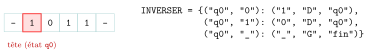

# TP et projets

<p class="sous-titre">Calculabilité et décidabilité</p>

## <span class="etiquette">TP</span> La machine de Turing et le prix de la force brute

*simuler, programmer, mesurer*

<p class="infos-activite">Durée : 2 séances (environ 3 h) · Par deux, sur machine</p>

!!! fichiers "Fichiers à télécharger"

    [:material-folder-open: dossier en ligne](https://github.com/MathThibaud/nsi-fichiers-eleves/tree/main/terminale/13-tp-calculabilite){ .md-button } [:material-zip-box: archive .zip](https://github.com/MathThibaud/nsi-fichiers-eleves/raw/main/zips/terminale-13-tp-calculabilite.zip){ .md-button }

!!! consignes "Consignes"

    - Outils : Python (Thonny, IDLE ou VS Code) et le fichier à télécharger `tp_calculabilite_depart.py`.

    - <span class="run" title="À programmer et tester sur machine">▶</span>  signale ce qui se fait sur machine. Lancer le fichier après chaque fonction complétée : les tests de la fin affichent `OK` ou `ECHEC`.

    - Noter sur le cahier (ou dans un fichier) les résultats et les mesures demandés : le bilan final s’appuie dessus.

    - Usage de l’IA, indiqué sur chaque exercice : <span class="ia ia-rouge" title="Sans IA : le but est l'automatisme lui-même"></span> aucune ; <span class="ia ia-orange" title="IA en appui : déboguer, reformuler, vérifier ; la réponse finale est la vôtre"></span> en appui (déboguer, reformuler, vérifier ; la réponse finale est écrite et comprise par vous) ; <span class="ia ia-vert" title="IA intégrée : l'exercice s'appuie sur une réponse d'IA"></span> l’exercice s’appuie sur une réponse d’IA. Voir la [charte d’usage de l’IA](../charte.md).

!!! encadre "But du TP"

    Le cours affirme deux choses étonnantes : une machine **minuscule** (un ruban, une tête, quelques règles) sait calculer tout ce qui est calculable ; et, parmi les problèmes calculables, certains sont **faciles à vérifier** mais semblent **très longs à résoudre**. On va le voir de ses propres yeux : écrire un **simulateur de machine de Turing** et le programmer (ajouter 1 en binaire, reconnaître un palindrome), puis **mesurer** l’explosion d’une recherche par force brute, et enfin expérimenter les limites d’un « détecteur d’arrêt » à chronomètre.

## Partie 1 — Un simulateur de machine de Turing

Une machine de Turing lit et écrit sur un **ruban** infini de cases. Dans le fichier, le ruban est un **dictionnaire** `position -> symbole` (une case absente contient le blanc `"_"`) et la machine est un dictionnaire de **règles** : $$\texttt{(etat, symbole\_lu) -> (symbole\_ecrit, deplacement, nouvel\_etat)}$$$$\text{avec } \texttt{deplacement} \in \{\texttt{"G"}, \texttt{"D"}\}.$$ La machine démarre dans l’état `"q0"`, la tête sur la case $0$ (premier symbole du mot) ; elle s’arrête dès qu’elle entre dans un **état final** (`"fin"`, `"oui"` ou `"non"`).

{ .tikz loading=lazy }

### <span class="stars" title="Niveau 1 sur 3">★</span> <span class="exo-num">Exercice 1</span> — Faire tourner une machine à la main <span class="ia ia-orange" title="IA en appui : déboguer, reformuler, vérifier ; la réponse finale est la vôtre"></span> { #ex-13-calculabilite-et-decidabilite-tp-1-1 }

1.  Dérouler la machine `INVERSER` sur le mot `1011` : à chaque étape, noter l’état, le contenu du ruban et la position de la tête. Combien d’étapes avant l’arrêt ? Que contient le ruban à la fin ?

2.  Que fait cette machine sur un mot binaire quelconque ?

??? corrige "Corrigé"

    - Quelques lignes de Python simulent **n’importe quelle** machine de Turing : Python est Turing-complet. `PALINDROME` calcule la même chose que `mot == mot[::-1]`, en $\frac{(n+1)(n+2)}{2}$ étapes au lieu d’un parcours : la puissance de calcul est la même, la vitesse non.

    - Vérifier : quelques centièmes de seconde pour un million de nombres ; chercher : plusieurs secondes dès $20$ nombres, doublement à chaque nombre ajouté.

    - Une limite ne donne qu’une réponse sûre dans un sens (« s’arrête ») ; pour l’autre, aucune limite ne suffit. Un vrai détecteur d’arrêt universel est impossible (problème de l’arrêt).

    **1.** Trace obtenue (`executer(INVERSER, "1011", trace=True)`, le `^` désigne la case lue) :

    ```console
           q0 | 1011           q0 | 0101
                ^                      ^
           q0 | 0011           q0 | 0100_
                 ^                      ^
           q0 | 0111          fin | 0100_
                  ^                    ^
    ```

    $5$ étapes ; le ruban contient `0100`.

    **2.** La machine **inverse chaque bit** (complément à un) et s’arrête au premier blanc.

### <span class="stars" title="Niveau 1 sur 3">★</span> <span class="exo-num">Exercice 2</span> — Le cœur du simulateur <span class="ia ia-orange" title="IA en appui : déboguer, reformuler, vérifier ; la réponse finale est la vôtre"></span> { #ex-13-calculabilite-et-decidabilite-tp-1-2 }

<span class="run" title="À programmer et tester sur machine">▶</span>  Compléter `une_etape(regles, ruban, tete, etat)` : lire le symbole sous la tête, trouver la règle, écrire le nouveau symbole, déplacer la tête, et renvoyer `(nouvelle_position, nouvel_etat)`. La fonction `executer`, fournie, l’appelle en boucle. Lancer le fichier (`test_une_etape` doit afficher `OK`), puis taper dans la console `executer(INVERSER, "1011", trace=True)` et comparer avec la question 1.

??? pouce "Coup de pouce"

    `ecrit, deplacement, nouvel_etat = regles[(etat, lu)]`, puis `ruban[tete] = ecrit`. Déplacer à droite, c’est ajouter $1$ à `tete`.

??? corrige "Corrigé"

    ```python
    def une_etape(regles, ruban, tete, etat):
        lu = ruban.get(tete, BLANC)
        ecrit, deplacement, nouvel_etat = regles[(etat, lu)]
        ruban[tete] = ecrit
        if deplacement == "D":
            tete = tete + 1
        else:
            tete = tete - 1
        return tete, nouvel_etat
    ```

### <span class="stars" title="Niveau 2 sur 3">★★</span> <span class="exo-num">Exercice 3</span> — Une machine qui ne s’arrête pas <span class="ia ia-orange" title="IA en appui : déboguer, reformuler, vérifier ; la réponse finale est la vôtre"></span> { #ex-13-calculabilite-et-decidabilite-tp-1-3 }

<span class="run" title="À programmer et tester sur machine">▶</span>  La machine `FUITE` du fichier part vers la droite et ne revient jamais. Que renvoie `executer(FUITE, "1")` ? Et avec `limite=10**6` ?

1.  Pourquoi `executer` a-t-il besoin d’un paramètre `limite` ?

2.  Quand `executer` renvoie `None`, peut-on affirmer que la machine ne s’arrêtera **jamais** ? Pourquoi augmenter la limite ne règle-t-il pas la question ? Quel résultat du cours est en jeu ?

??? corrige "Corrigé"

    `None` dans les deux cas. **1.** Sans limite, `executer(FUITE, "1")` ne rendrait jamais la main : le simulateur hériterait de la non-terminaison de la machine simulée. **2.** Non : `None` signifie seulement « pas arrêtée *au bout de* `limite` étapes ». Une machine peut s’arrêter après $10^6 + 1$ étapes ; quelle que soit la limite choisie, il existe des machines qui s’arrêtent juste après. Décider l’arrêt pour *toutes* les machines est impossible : c’est le **problème de l’arrêt** (indécidable, Turing 1936). En revanche, une réponse « arrêtée » est **sûre**.

## Partie 2 — Programmer des machines

Écrire une machine, c’est remplir un dictionnaire de règles. **Conseil** : dessiner d’abord la table des règles sur papier, puis la dérouler sur un petit mot, *avant* de la taper.

### <span class="stars" title="Niveau 2 sur 3">★★</span> <span class="exo-num">Exercice 4</span> — Ajouter 1 en binaire <span class="ia ia-orange" title="IA en appui : déboguer, reformuler, vérifier ; la réponse finale est la vôtre"></span> { #ex-13-calculabilite-et-decidabilite-tp-1-4 }

<span class="run" title="À programmer et tester sur machine">▶</span>  Recopier et compléter sur le cahier la table des règles ci-dessous (les règles de l’état `q0`, puis celles de l’état `retenue`), puis compléter `INCREMENT` pour qu’elle transforme un nombre binaire en son successeur : `1011` $\to$ `1100`, `111` $\to$ `1000`, `0` $\to$ `1`. Elle s’arrête dans l’état `"fin"`.

??? pouce "Coup de pouce"

    Deux phases, donc deux états : `q0` va à droite jusqu’au premier blanc (le chiffre des unités est juste avant) ; un état `retenue` revient vers la gauche, transforme les `1` en `0` tant que la retenue se propage, et s’arrête dès qu’il peut poser un `1` — sur un `0`, ou sur le blanc à gauche du nombre.

| **État**  | **Lu** | **Écrit** | **Déplacement** | **Nouvel état** |
|:---------:|:------:|:---------:|:---------------:|:---------------:|
|   `q0`    |  `0`   |           |                 |                 |
|   `q0`    |  `1`   |           |                 |                 |
|   `q0`    |  `_`   |           |                 |                 |
| `retenue` |   …    |           |                 |                 |

Combien d’étapes pour `1011` ? pour `111` ?

??? corrige "Corrigé"

    ```python
    INCREMENT = {
        ("q0", "0"): ("0", "D", "q0"),          # aller jusqu'au bout
        ("q0", "1"): ("1", "D", "q0"),
        ("q0", BLANC): (BLANC, "G", "retenue"),
        ("retenue", "1"): ("0", "G", "retenue"),  # 1 + 1 = 10 : la retenue continue
        ("retenue", "0"): ("1", "G", "fin"),      # 0 + 1 = 1 : termine
        ("retenue", BLANC): ("1", "G", "fin"),    # 111 -> 1000 : nouveau chiffre a gauche
    }
    ```

    `1011` $\to$ `1100` en $8$ étapes ; `111` $\to$ `1000` en $8$ étapes ($4$ pour aller au bout, $3$ pour propager la retenue, $1$ pour poser le `1`). Test : les $300$ premiers entiers (vérifié).

### <span class="stars" title="Niveau 2 sur 3">★★</span> <span class="exo-num">Exercice 5</span> — Un nombre pair de 1 ? <span class="ia ia-orange" title="IA en appui : déboguer, reformuler, vérifier ; la réponse finale est la vôtre"></span> { #ex-13-calculabilite-et-decidabilite-tp-1-5 }

<span class="run" title="À programmer et tester sur machine">▶</span>  Compléter `PARITE` : la machine lit un mot binaire et s’arrête dans l’état `"oui"` s’il contient un nombre **pair** de `1`, dans l’état `"non"` sinon. Elle ne doit **rien écrire** de nouveau sur le ruban.

1.  Combien d’états non finaux suffisent ? Que « retient » chacun d’eux ?

2.  Une machine de Turing n’a pas de variables : où mémorise-t-elle l’information ?

??? corrige "Corrigé"

    ```python
    PARITE = {
        ("q0", "0"): ("0", "D", "q0"),          # q0 : nombre pair de 1 lus
        ("q0", "1"): ("1", "D", "impair"),
        ("q0", BLANC): (BLANC, "G", "oui"),
        ("impair", "0"): ("0", "D", "impair"),  # impair : nombre impair de 1 lus
        ("impair", "1"): ("1", "D", "q0"),
        ("impair", BLANC): (BLANC, "G", "non"),
    }
    ```

    **1.** Deux états suffisent : l’un « retient » qu’on a vu un nombre pair de `1`, l’autre un nombre impair (exemples : `10110` $\to$ `non`, `1001` $\to$ `oui`). **2.** Dans son **état** (une mémoire finie) et sur le **ruban** (une mémoire illimitée).

### <span class="stars" title="Niveau 3 sur 3">★★★</span> <span class="exo-num">Exercice 6</span> — Reconnaître un palindrome <span class="ia ia-orange" title="IA en appui : déboguer, reformuler, vérifier ; la réponse finale est la vôtre"></span> { #ex-13-calculabilite-et-decidabilite-tp-1-6 }

Un **palindrome** se lit de la même façon dans les deux sens (`abba`, `aba`, `b`, le mot vide). La machine `PALINDROME` du fichier procède ainsi : elle **efface** le premier symbole en le mémorisant dans son état (`cherche_a` ou `cherche_b`), file au bout du mot, **compare** le dernier symbole avec celui qu’elle a mémorisé, l’efface s’il est égal, **revient** au début et recommence.

<span class="run" title="À programmer et tester sur machine">▶</span>  Les règles des états `q0`, `cherche_a` et `cherche_b` sont données. Compléter celles des états `compare_a`, `compare_b` et `retour`. Le test essaie les $511$ mots de longueur $0$ à $8$.

??? pouce "Coup de pouce"

    Dans `compare_a`, trois cas : on lit `a` (égal : effacer et partir à gauche dans l’état `retour`), on lit `b` (différent : `"non"`), on lit un blanc (il ne restait qu’un symbole, le mot était de longueur impaire : `"oui"`). L’état `retour` va à gauche jusqu’au blanc, puis repasse à droite dans l’état `q0`.

??? corrige "Corrigé"

    Règles à ajouter :

    ```python
        ("compare_a", "a"): (BLANC, "G", "retour"),
        ("compare_a", "b"): ("b", "G", "non"),
        ("compare_a", BLANC): (BLANC, "G", "oui"),   # longueur impaire : symbole central
        ("compare_b", "b"): (BLANC, "G", "retour"),
        ("compare_b", "a"): ("a", "G", "non"),
        ("compare_b", BLANC): (BLANC, "G", "oui"),
        ("retour", "a"): ("a", "G", "retour"),
        ("retour", "b"): ("b", "G", "retour"),
        ("retour", BLANC): (BLANC, "D", "q0"),
    ```

    Les $511$ mots de longueur $0$ à $8$ sont correctement classés (vérifié par comparaison avec `mot == mot[::-1]`). Sur `abba` : `oui` en $15$ étapes.

### <span class="stars" title="Niveau 2 sur 3">★★</span> <span class="exo-num">Exercice 7</span> — Combien d’étapes ? <span class="ia ia-orange" title="IA en appui : déboguer, reformuler, vérifier ; la réponse finale est la vôtre"></span> { #ex-13-calculabilite-et-decidabilite-tp-1-7 }

<span class="run" title="À programmer et tester sur machine">▶</span>  Pour chaque longueur $n$, fabriquer un palindrome (par exemple `"ab" * k + "ba" * k`, de longueur $n = 4k$) et relever le nombre d’étapes (troisième élément du résultat de `executer`, avec `limite=10**7`) dans le tableau suivant, recopié sur le cahier.

| Longueur $n$ | $20$ | $40$ | $80$ | $160$ | $320$ |
|:------------:|:----:|:----:|:----:|:-----:|:-----:|
|    Étapes    |      |      |      |       |       |

1.  Quand la longueur double, par combien le nombre d’étapes est-il (à peu près) multiplié ? Quel est donc l’ordre de grandeur du coût de cette machine ?

2.  En Python, `mot == mot[::-1]` répond instantanément. La machine de Turing calcule-t-elle « moins de choses » que Python ? Relier à la thèse de Church-Turing : qu’est-ce qui diffère d’un modèle de calcul à l’autre, et qu’est-ce qui ne diffère pas ?

??? corrige "Corrigé"

    Mesures (exactes, elles ne dépendent pas de l’ordinateur) :

    | Longueur $n$ | $20$  | $40$  |   $80$   |   $160$   |   $320$   |
    |:------------:|:-----:|:-----:|:--------:|:---------:|:---------:|
    |    Étapes    | $231$ | $861$ | $3\,321$ | $13\,041$ | $51\,681$ |

    **1.** Quand $n$ double, le nombre d’étapes est multiplié par environ $4$ : coût **quadratique**. Pour un palindrome de longueur paire $n$, on trouve exactement $\frac{(n+1)(n+2)}{2}$ étapes : la tête fait environ $n/2$ allers-retours de longueur décroissante. **2.** Non : la thèse de Church-Turing dit que la machine de Turing calcule **exactement les mêmes** fonctions que Python (et réciproquement : notre simulateur montre que Python sait imiter n’importe quelle machine de Turing). Ce qui diffère d’un modèle à l’autre, c’est la **commodité** et la **vitesse** (ici quadratique contre linéaire), jamais ce qui est **calculable**.

## Partie 3 — Trouver ou vérifier ? <span class="horsprog">au-delà du programme</span>

**Le problème du sous-ensemble de somme.** On donne une liste de nombres et une `cible`. Peut-on choisir certains de ces nombres (chacun au plus une fois) dont la somme vaut exactement la cible ? Avec `[8, 3, 12, 5, 7]` et la cible $15$ : oui, $3 + 12$ (ou $8 + 7$, ou $3 + 5 + 7$). Avec la cible $100$ : non. Ce problème est **NP-complet**, comme le Sudoku du cours. Un choix est représenté par la liste de ses **indices** : `[1, 2]` désigne $3$ et $12$.

### <span class="stars" title="Niveau 1 sur 3">★</span> <span class="exo-num">Exercice 8</span> — Vérifier une solution proposée <span class="ia ia-orange" title="IA en appui : déboguer, reformuler, vérifier ; la réponse finale est la vôtre"></span> { #ex-13-calculabilite-et-decidabilite-tp-1-8 }

<span class="run" title="À programmer et tester sur machine">▶</span>  Compléter `verifier(nombres, cible, choix)` : `True` si les indices de `choix` sont tous différents et si les nombres correspondants ont pour somme `cible`.

1.  Combien d’additions fait `verifier` pour un choix de $k$ indices ? Son coût est-il polynomial ?

2.  <span class="run" title="À programmer et tester sur machine">▶</span>  Mesurer, avec la fonction fournie `chronometrer`, la vérification d’un choix de $500\,000$ indices dans une liste d’un million de nombres.

??? corrige "Corrigé"

    ```python
    def verifier(nombres, cible, choix):
        deja = [False] * len(nombres)       # deja[i] : indice i deja utilise ?
        total = 0
        for i in choix:
            if deja[i]:                      # un indice utilise deux fois
                return False
            deja[i] = True
            total = total + nombres[i]
        return total == cible
    ```

    **1.** $k$ additions (plus la création du tableau `deja`, de taille $n$, et un test par indice) : coût **linéaire**, donc polynomial. **2.** Mesuré : environ $0{,}05$ s pour $500\,000$ indices dans une liste d’un million de nombres.

### <span class="stars" title="Niveau 2 sur 3">★★</span> <span class="exo-num">Exercice 9</span> — Chercher par force brute <span class="ia ia-orange" title="IA en appui : déboguer, reformuler, vérifier ; la réponse finale est la vôtre"></span> { #ex-13-calculabilite-et-decidabilite-tp-1-9 }

La fonction fournie `sous_ensemble(k, n)` fabrique le $k$-ième choix possible parmi les indices $0$ à $n-1$ : l’indice $i$ est choisi si le bit numéro $i$ de l’écriture binaire de $k$ vaut $1$.

1.  Que renvoient `sous_ensemble(13, 4)` et `sous_ensemble(0, 4)` ? Pour $n$ nombres, combien y a-t-il de choix possibles ? Pourquoi `k` doit-il aller de $0$ à $2^n - 1$ ?

2.  <span class="run" title="À programmer et tester sur machine">▶</span>  Compléter `chercher(nombres, cible)`, qui essaie les choix dans l’ordre et renvoie le premier qui convient, avec le nombre d’essais. Que renvoie `chercher([8, 3, 12, 5, 7], 15)` ? Et avec la cible $100$ ?

??? corrige "Corrigé"

    **1.** `13` s’écrit `1101` : bits $0$, $2$ et $3$ à $1$, d’où `[0, 2, 3]` ; `sous_ensemble(0, 4)` renvoie `[]` (aucun nombre choisi). Chaque nombre est pris ou non : $2^n$ choix, numérotés par les entiers de $0$ à $2^n - 1$ (tous les mots de $n$ bits).

    ```python
    def chercher(nombres, cible):
        n = len(nombres)
        essais = 0
        for k in range(2 ** n):
            choix = sous_ensemble(k, n)
            essais = essais + 1
            if verifier(nombres, cible, choix):
                return choix, essais
        return None, essais
    ```

    **2.** `chercher([8, 3, 12, 5, 7], 15)` renvoie `([1, 2], 7)` ($3 + 12$, trouvé au $7^\text{e}$ essai, $k = 6$) ; avec la cible $100$ : `(None, 32)`, les $2^5$ choix ont été essayés.

### <span class="stars" title="Niveau 2 sur 3">★★</span> <span class="exo-num">Exercice 10</span> — Mesurer l’explosion <span class="ia ia-orange" title="IA en appui : déboguer, reformuler, vérifier ; la réponse finale est la vôtre"></span> { #ex-13-calculabilite-et-decidabilite-tp-1-10 }

<span class="run" title="À programmer et tester sur machine">▶</span>  La fonction fournie `mesures(tailles)` tire $n$ nombres **pairs** et une cible **impaire** : il n’y a aucune solution, donc `chercher` essaie **tous** les choix. Lancer `mesures([10, 12, 14, 16, 18, 20])` (patience pour la dernière !) et recopier les durées sur le cahier, dans un tableau comme celui-ci.

|    $n$    | $10$ | $12$ | $14$ | $16$ | $18$ | $20$ |
|:---------:|:----:|:----:|:----:|:----:|:----:|:----:|
| Durée (s) |      |      |      |      |      |      |

1.  Par combien la durée est-elle multipliée quand $n$ augmente de $2$ ? de $1$ ?

2.  Estimer la durée pour $n = 40$, puis pour $n = 60$ (en jours, en années).

3.  Un ordinateur $1\,000$ fois plus rapide permettrait de traiter, dans le même temps, des listes plus longues de combien d’éléments seulement ? (On rappelle que $2^{10} = 1\,024$.)

4.  Résumer en une phrase la différence entre **vérifier** et **trouver** pour ce problème, et dire ce qu’affirmerait « P $=$ NP » à son sujet.

??? corrige "Corrigé"

    Durées mesurées :

    |    $n$    |   $10$    |   $12$    |   $14$    |   $16$   |  $18$   |  $20$   |
    |:---------:|:---------:|:---------:|:---------:|:--------:|:-------:|:-------:|
    | Durée (s) | $0{,}003$ | $0{,}016$ | $0{,}075$ | $0{,}35$ | $1{,}5$ | $6{,}9$ |

    **1.** Environ $\times 4{,}5$ quand $n$ augmente de $2$, donc à peu près $\times 2$ quand $n$ augmente de $1$ : coût **exponentiel** ($2^n$ essais ; le léger excès vient de ce que chaque essai coûte lui-même environ $n$ opérations). **2.** $n = 40$ : $6{,}9 \times 2^{20} \approx 7 \times 10^6$ s, soit environ $3$ mois (plutôt $5$ à $6$ en tenant compte du facteur $n$). $n = 60$ : encore $\times 2^{20}$, environ $7 \times 10^{12}$ s, soit plus de $200\,000$ ans. **3.** $1\,000 \approx 2^{10}$ : un ordinateur mille fois plus rapide ne gagne qu’**une dizaine** d’éléments. Face à une croissance exponentielle, le matériel ne sauve pas : il faudrait un meilleur **algorithme**. **4.** Vérifier une solution proposée est rapide (linéaire) ; en trouver une, avec les seuls algorithmes connus, demande un temps exponentiel. « P $=$ NP » affirmerait qu’il existe un algorithme **polynomial** pour trouver (pour ce problème NP-complet, donc pour tous ceux de NP) ; on pense que non, sans savoir le démontrer.

## Partie 4 — Une expérience sur l’arrêt

### <span class="stars" title="Niveau 3 sur 3">★★★</span> <span class="exo-num">Exercice 11</span> — La suite de Syracuse <span class="ia ia-orange" title="IA en appui : déboguer, reformuler, vérifier ; la réponse finale est la vôtre"></span> { #ex-13-calculabilite-et-decidabilite-tp-1-11 }

On part d’un entier $n \geq 1$ ; s’il est pair on le divise par $2$, sinon on le remplace par $3n + 1$ ; on recommence jusqu’à obtenir $1$. Par exemple, $6 \to 3 \to 10 \to 5 \to 16 \to 8 \to 4 \to 2 \to 1$ : $8$ étapes.

1.  <span class="run" title="À programmer et tester sur machine">▶</span>  Compléter `syracuse_etapes(n, limite)`, qui renvoie le nombre d’étapes pour atteindre $1$, ou `None` si $1$ n’est pas atteint en `limite` étapes.

2.  <span class="run" title="À programmer et tester sur machine">▶</span>  Vérifier que, pour tous les entiers de $1$ à $100\,000$, la suite atteint $1$ en moins de $1\,000$ étapes. Quel entier de cet intervalle demande le plus d’étapes, et combien ?

3.  Que renvoie `syracuse_etapes(27, 100)` ? Et `syracuse_etapes(27, 1000)` ? Qu’en conclure sur la réponse `None` ?

4.  Personne ne sait démontrer que la suite atteint $1$ pour **tout** entier (c’est la **conjecture de Syracuse**) : une réponse `None` ne prouve rien, et aucune limite ne suffit. D’autres conjectures célèbres sont dans le même cas, par exemple celle de **Goldbach** (« tout entier pair $\geq 4$ est la somme de deux nombres premiers »). On considère le programme suivant, qu’on ne lancera pas (la fonction `est_somme_de_deux_premiers` est supposée écrite, elle s’arrête toujours) :

    ```python
    def chercher_contre_exemple():
        n = 4
        while est_somme_de_deux_premiers(n):
            n = n + 2
        return n
    ```

    Dans quel cas ce programme s’arrête-t-il ? Si l’on disposait de la fonction `halt` du cours, comment trancherait-on la conjecture de Goldbach ? Que montre cet exemple sur la puissance qu’aurait un « détecteur d’arrêt » universel ?

??? corrige "Corrigé"

    **1.**

    ```python
    def syracuse_etapes(n, limite):
        etapes = 0
        while n != 1:
            if etapes == limite:
                return None
            if n % 2 == 0:
                n = n // 2
            else:
                n = 3 * n + 1
            etapes = etapes + 1
        return etapes
    ```

    **2.** Vérifié : aucun `None` de $1$ à $100\,000$ avec une limite de $1\,000$. Le record est $77\,031$, avec $350$ étapes (trouvé par une boucle sur `n` de $1$ à $100\,000$ qui mémorise le plus grand nombre d’étapes rencontré).  
    **3.** `syracuse_etapes(27, 100)` renvoie `None`, mais `syracuse_etapes(27, 1000)` renvoie $111$ (la suite monte jusqu’à $9\,232$ avant de redescendre). `None` ne veut donc **pas** dire « ne s’arrête jamais » : seulement « pas encore ». Même dissymétrie qu’à l’exercice 3.  
    **4.** Le programme s’arrête **si et seulement si** la conjecture de Goldbach est **fausse** (il renvoie alors le premier contre-exemple). Il suffirait donc de calculer `halt(chercher_contre_exemple)` : `True` signifierait « conjecture fausse », `False` « conjecture vraie ». Un détecteur d’arrêt universel résoudrait mécaniquement d’innombrables problèmes ouverts des mathématiques : c’est une raison supplémentaire de ne pas être surpris qu’il ne puisse pas exister. (Vérifié en passant : la conjecture tient pour tous les entiers pairs jusqu’à $20\,000$, ce qui ne prouve rien.)

## Bilan à rédiger

En une dizaine de lignes, sur le cahier ou dans un fichier, en vous appuyant sur **vos** mesures :

- expliquer pourquoi un simulateur de machine de Turing en quelques lignes de Python illustre la **Turing-complétude** de Python, et ce que la machine `PALINDROME` montre sur la différence entre *pouvoir* calculer et calculer *vite* ;

- citer vos durées pour la vérification et pour la recherche, et en tirer la distinction **vérifier / trouver** ;

- expliquer pourquoi une `limite` (ou un chronomètre) ne fournit pas un détecteur d’arrêt, et ce que cela a à voir avec le problème de l’arrêt.
