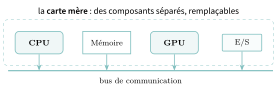
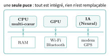
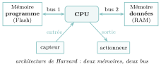
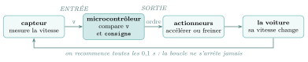

# Cours

<p class="sous-titre">Systèmes sur puce et informatique embarquée</p>

<span id="chap-14" class="ancre"></span>

|  |  |
|:---|:---|
| **Programme (BO)** | *« Systèmes sur puce. Décrire l’architecture d’un système sur puce. »* |
| **Prérequis** | le modèle de **von Neumann** (unité de calcul, mémoire, entrées-sorties, bus — vu en Première), la différence **mémoire vive / mémoire morte**, la notion de **processus**. |
| **Objectifs** | *comprendre* pourquoi un ordinateur entier tient sur une puce ; *distinguer* microcontrôleur et SoC ; *dérouler* le fonctionnement d’un système embarqué ; *peser* les intérêts et les limites de l’intégration. |

## L’ordinateur qui a rétréci

En 1945, le premier grand ordinateur électronique, l’**ENIAC**, occupait une **salle entière**, pesait **30 tonnes**, contenait près de $18\,000$ tubes à vide et consommait de quoi alimenter un quartier. Aujourd’hui, la puce qui fait battre votre téléphone est plus petite qu’un ongle, contient **des milliards** de composants, et calcule des *millions* de fois plus vite. En moins d’un siècle, l’ordinateur a rétréci au point de **disparaître** : il est partout, et on ne le voit plus.

Comment un ordinateur complet — processeur, mémoire, périphériques — a-t-il pu tenir sur un seul morceau de silicium grand comme une pièce de monnaie ? C’est l’histoire du **système sur puce**, et le sujet de ce chapitre.

!!! regle "Règle 1 — La loi de Moore (1965)"

    Gordon Moore, cofondateur d’Intel, observe que **le nombre de transistors sur une puce double environ tous les deux ans**. Ce n’est pas une loi physique, mais une prédiction économique — restée étonnamment juste pendant un demi-siècle. Le premier microprocesseur, l’**Intel 4004** (1971), comptait $2\,300$ transistors ; une puce d’aujourd’hui en compte **des dizaines de milliards**, gravés à $5$ ou $7$ **nanomètres** — soit l’épaisseur de quelques dizaines d’atomes.

\*(image manquante : 14_Intel_C4004)\*  
*L’Intel 4004 (1971), l’un des tout premiers microprocesseurs : $2\,300$ transistors.*

Cette miniaturisation a tout changé : en rapprochant les composants, on a pu **augmenter la fréquence** (les signaux vont plus vite sur de courtes distances), **baisser le coût** (tout est fabriqué d’un coup) et **réduire la consommation** (des transistors plus petits fonctionnent sous une tension plus faible).

## Rappel : ce qu’il y a dans un ordinateur

Depuis la Première, vous connaissez le **modèle de von Neumann** : un ordinateur, c’est une **unité de calcul** (le processeur, CPU), une **mémoire** (qui contient à la fois les programmes et les données), des **entrées-sorties** (clavier, écran, réseau…), le tout relié par des **bus** de communication.

Dans un ordinateur classique, ces éléments sont des **composants séparés**, enfichés sur une grande **carte mère** : le processeur ici, les barrettes de mémoire là, la carte graphique dans son connecteur… On peut les **choisir**, les **remplacer**, les **faire évoluer**. C’est modulaire — mais encombrant, coûteux et gourmand en énergie (les longs fils de cuivre consomment et ralentissent).

{ .tikz loading=lazy }

<span id="cours-14-1" class="ancre"></span>

<span class="afaire">▶ Exercices d'application :</span> exercices **[1](exercices.md#ex-14-1) et [4](exercices.md#ex-14-4)** (le bon vocabulaire ; la loi de Moore chiffrée)

## Le système sur puce (SoC)

!!! definition "Définition 1 — Système sur puce (System on Chip, SoC)"

    Un **système sur puce** rassemble sur un **unique circuit intégré** tous les composants qui étaient dispersés sur la carte mère : le **processeur** (souvent multi-cœur), la **mémoire**, un **processeur graphique** (GPU), et une foule de **périphériques** (Wi-Fi, Bluetooth, GPS, modem, capteurs…). Un ordinateur complet, sur un seul morceau de silicium.

{ .tikz loading=lazy }

Un SoC est un **vrai ordinateur**, aussi puissant : plusieurs cœurs cadencés à plusieurs gigahertz, des gigaoctets de mémoire, des **processeurs spécialisés** (graphisme, intelligence artificielle, cryptographie)… le tout sur une centaine de millimètres carrés.

!!! exemple "Exemple — La puce Apple A13 (iPhone 11, 2019)"

    $8{,}5$ **milliards** de transistors gravés à $7$ nm, sur une puce grande comme un ongle :

    - un CPU à **6 cœurs** (2 rapides à $2{,}65$ GHz, 4 économes à $1{,}8$ GHz) ;

    - un **GPU** à 4 cœurs pour la 3D ;

    - un **Neural Engine** à 8 cœurs, dédié à l’intelligence artificielle (reconnaissance faciale…) ;

    - un module **cryptographique** (il chiffre et déchiffre les données très vite) et $4$ Go de RAM.

    Plus de puissance, dans votre poche, que tous les ordinateurs de la mission Apollo réunis.

\*(image manquante : 14_Apple_A13_Bionic)\*  
*La puce Apple A13 Bionic.*

<span id="cours-14-2" class="ancre"></span>

<span class="afaire">▶ Exercices d'application :</span> exercices **[2](exercices.md#ex-14-2) et [3](exercices.md#ex-14-3)** (SoC ou pas ; microcontrôleur contre SoC)

## Le microcontrôleur : le petit cerveau de l’embarqué

Tous les systèmes sur puce ne sont pas des monstres de puissance. À l’autre bout du spectre, le **microcontrôleur** est un mini-ordinateur **minuscule, bon marché et sobre**, conçu pour *une* tâche précise dans un **système embarqué** : la carte à puce de votre carte bancaire, le thermostat, le drone, la manette de jeu, le régulateur de vitesse d’une voiture, l’ampoule connectée…

|  | **Microcontrôleur** | **SoC (téléphone, tablette)** |
|:---|:---|:---|
| Puissance | quelques dizaines de MHz | plusieurs cœurs à plusieurs GHz |
| Mémoire | quelques **Ko** | plusieurs **Go** |
| Consommation | minuscule (des années sur pile) | modérée |
| Prix | quelques euros | quelques dizaines d’euros |
| Système d’exploitation | **aucun** (le programme, seul) | un OS complet (iOS, Android…) |
| Rôle | **une** tâche précise, embarquée | un ordinateur polyvalent |

!!! remarque "Remarque"

    Un microcontrôleur, en général, ne fait pas tourner de système d’exploitation complet (il existe seulement de petits systèmes dits « temps réel », très légers) : dès qu’il est sous tension, il exécute *directement* le programme gravé dans sa mémoire. C’est justement ce qu’on veut pour du **temps réel** : un airbag ne peut pas attendre que l’OS ait fini de basculer entre ses processus.

### Capteurs, actionneurs, et l’architecture de Harvard

Un système embarqué dialogue avec le **monde physique** par ses ports d’entrée-sortie : il **lit** des grandeurs physiques grâce à des **capteurs** (température, vitesse, lumière…) et **agit** grâce à des **actionneurs** (moteur, chauffage, LED, frein…). Un **convertisseur analogique-numérique** transforme la tension d’un capteur en nombre binaire exploitable.

Beaucoup de microcontrôleurs adoptent l’**architecture de Harvard** : contrairement à von Neumann (une seule mémoire pour tout), le **programme** (en mémoire morte, Flash) et les **données** (en mémoire vive, RAM) sont dans *deux mémoires séparées*, reliées par *deux bus distincts*. Avantage : on peut lire une instruction *et* une donnée **en même temps** — un vrai gain de temps.

{ .tikz loading=lazy }

### Dérouler le fonctionnement d’un système embarqué

Presque tous les systèmes embarqués répètent sans fin la même **boucle** : *lire les capteurs $\to$ décider $\to$ commander les actionneurs*. Exemple d’un **régulateur de vitesse** qui maintient une voiture à la vitesse `consigne` :

```python
while True:                          # boucle sans fin
    v = lire_capteur_vitesse()       # ENTRÉE : capteur -> nombre
    if v < consigne:
        accelerer()                  # SORTIE : commande un actionneur
    elif v > consigne:
        freiner()
    attendre(0.1)                    # contrainte TEMPS RÉEL : réagir vite
```

{ .tikz loading=lazy }

!!! regle "Règle 2 — Les trois caractéristiques d’un système embarqué"

    **(1) Acquisition** de grandeurs physiques par des capteurs ; **(2) contrôle** d’un procédé par des actionneurs ; **(3) contraintes de temps** fortes (la réponse doit arriver *à temps* — pensez à un airbag ou à un frein ABS).

<span id="cours-14-5" class="ancre"></span>

<span class="afaire">▶ Exercices d'application :</span> exercices **[5](exercices.md#ex-14-5) et [6](exercices.md#ex-14-6)** (dérouler un thermostat ; von Neumann ou Harvard)

## Le prix de l’intégration : intérêts et limites

Pourquoi tout intégrer sur une puce plutôt que garder une carte mère modulaire ? Et qu’y perd-on ?

| **Intérêts (pourquoi c’est génial)** | **Limites (ce qu’on y perd)** |
|:---|:---|
| **Énergie** : composants très proches, sans câblage énergivore $\Rightarrow$ faible consommation, peu de chaleur, souvent *sans ventilateur* (silencieux). | **Non réparable** : si un seul transistor lâche, toute la puce est perdue. On ne change pas *une* pièce. |
| **Taille** : tout tient dans un objet minuscule (montre, écouteur, capteur). | **Non évolutif** : impossible d’ajouter de la mémoire ou de changer le processeur. |
| **Coût** : fabriqué en masse, d’un seul tenant. | **Obsolescence** : la puce vieillit d’un bloc ; on remplace tout l’objet. |
| **Vitesse** : les signaux parcourent de très courtes distances. | **Déchets électroniques** : des milliards d’objets non réparables $\to$ montagne de déchets (enjeu du *droit à la réparation*). |

!!! remarque "Remarque"

    Ce compromis est au cœur d’un débat de société : l’intégration rend les objets *plus petits, moins chers, moins gourmands*… mais *jetables*. Face à la montagne de déchets électroniques, des lois sur le **droit à la réparation** et l’**indice de réparabilité** cherchent à rééquilibrer la balance.

<span id="cours-14-7" class="ancre"></span>

<span class="afaire">▶ Exercices d'application :</span> exercice **[7](exercices.md#ex-14-7)** (le prix de l’intégration)

## L’informatique invisible : les objets connectés

Le SoC et le microcontrôleur ont fait naître l’**Internet des objets** (*Internet of Things*, IoT) : montres, ampoules, thermostats, voitures, capteurs agricoles… **des dizaines de milliards** d’objets, chacun avec sa puce, souvent connectés au réseau. L’ordinateur a tellement rétréci qu’il a disparu *dans les choses*. C’est une révolution silencieuse — et elle pose, en retour, des questions de **sécurité** (chaque objet est une porte d’entrée) et de **vie privée** (chaque objet est un capteur).

<span id="cours-14-14" class="ancre"></span>

<span class="afaire">▶ Exercices d'application :</span> exercice **[14](exercices.md#ex-14-14)** (l’informatique invisible)

!!! remarque "Remarque — Liens avec d’autres chapitres"

    Un SoC fait tourner un **système d’exploitation** complet, qui ordonnance ses **processus** sur plusieurs cœurs (chapitre « processus ») ; le microcontrôleur, lui, exécute en général un seul programme, sans OS complet. Ses modules Wi-Fi, Bluetooth et modem le relient aux **réseaux** : chaque objet connecté devient une machine d’Internet, et une porte d’entrée à protéger — d’où le module de **chiffrement** AES intégré à la puce (chapitre « cryptographie »).

## Bilan — la carte mémoire

| **Notion** | **À retenir** |
|:---|:---|
| Loi de Moore | nb de transistors $\times 2$ tous les 2 ans (empirique) |
| Carte mère | composants **séparés**, remplaçables, modulaires |
| SoC | **tout sur une puce** (CPU, GPU, RAM, périphériques) |
| Microcontrôleur | mini-SoC : peu puissant, sobre, **sans OS**, embarqué |
| von Neumann / Harvard | 1 mémoire (données+prog.) / 2 mémoires + 2 bus |
| Système embarqué | capteur $\to$ CPU $\to$ actionneur, **temps réel** |
| Intérêts SoC | énergie, taille, coût, vitesse |
| Limites SoC | non réparable, non évolutif, déchets |
| IoT | des milliards d’objets connectés à puce |

## Erreurs fréquentes

- **Confondre microcontrôleur et SoC.** Les deux intègrent tout sur une puce, mais le microcontrôleur est *minuscule, sobre, sans OS* (une tâche embarquée) ; le SoC est un *ordinateur complet* (téléphone).

- **Croire qu’un SoC est réparable** comme un PC. Non : rien n’est remplaçable, c’est tout ou rien.

- **Confondre capteur et actionneur.** Le capteur *lit* (entrée) ; l’actionneur *agit* (sortie).

- **Mélanger von Neumann et Harvard.** Von Neumann : *une* mémoire pour programme *et* données. Harvard : deux mémoires, deux bus.

## Savoir-faire à maîtriser

*À la fin du chapitre, je sais…*

- **définir** un système sur puce et **identifier** ses constituants sur un schéma $\to$ ex. [1](exercices.md#ex-14-1), [2](exercices.md#ex-14-2), [13](exercices.md#ex-14-13) ;

- **distinguer** microcontrôleur et SoC, carte mère et puce $\to$ ex. [2](exercices.md#ex-14-2), [3](exercices.md#ex-14-3) ;

- **dérouler** le fonctionnement d’un système embarqué (capteur $\to$ décision $\to$ actionneur) $\to$ ex. [5](exercices.md#ex-14-5), [11](exercices.md#ex-14-11) ;

- **énoncer** la loi de Moore et **peser** les intérêts et les limites de l’intégration $\to$ ex. [4](exercices.md#ex-14-4), [7](exercices.md#ex-14-7).

## Vers le Grand Oral

- **Comment un ordinateur entier a-t-il pu tenir sur une puce ?** *(miniaturisation, loi de Moore, du 4004 au SoC.)*

- **Pourquoi votre téléphone chauffe-t-il moins qu’un PC ?** *(intégration, courtes distances, faible consommation.)*

- **Faut-il regretter les objets qu’on ne peut plus réparer ?** *(le prix de l’intégration ; déchets électroniques ; droit à la réparation.)*

- **Comment un objet connecté « sent-il » le monde et agit-il ?** *(capteurs, actionneurs, boucle temps réel, IoT.)*

## Un peu d’histoire

!!! remarque "Remarque"

    Tout commence en **1958** : **Jack Kilby** (Texas Instruments) et **Robert Noyce** (futur cofondateur d’Intel) inventent, chacun de leur côté, le **circuit intégré** — l’idée de graver plusieurs composants sur un seul morceau de silicium. Kilby recevra le prix Nobel de physique en 2000. En **1971**, une petite équipe d’Intel menée par **Federico Faggin** grave le premier **microprocesseur**, l’**Intel 4004** : $2\,300$ transistors, aussi puissant que l’ENIAC de $30$ tonnes… sur une puce de la taille d’un ongle. Un demi-siècle plus tard, ses descendants en comptent des dizaines de milliards. L’ordinateur n’a jamais cessé de rétrécir — jusqu’à se glisser dans les objets du quotidien.
