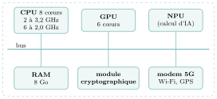

# Exercices

<p class="sous-titre">Systèmes sur puce et informatique embarquée</p>

Usage de l’IA, indiqué sur chaque exercice : <span class="ia ia-rouge" title="Sans IA : le but est l'automatisme lui-même"></span> aucune ; <span class="ia ia-orange" title="IA en appui : déboguer, reformuler, vérifier ; la réponse finale est la vôtre"></span> en appui (déboguer, reformuler, vérifier ; la réponse finale est écrite et comprise par vous) ; <span class="ia ia-vert" title="IA intégrée : l'exercice s'appuie sur une réponse d'IA"></span> l’exercice s’appuie sur une réponse d’IA. Voir la [charte d’usage de l’IA](../charte.md).

Niveau : ★ échauffement, ★★ classique (niveau bac), ★★★ défi ; les *coups de pouce* et les *corrigés* se déplient sous chaque exercice.

### <span class="stars" title="Niveau 1 sur 3">★</span> <span class="exo-num">Exercice 1</span> — Le bon vocabulaire <span class="ia ia-rouge" title="Sans IA : le but est l'automatisme lui-même"></span> { #ex-14-1 }

Associer chaque terme à sa définition.

|  |  |
|:---|:---|
| **(1)** Système sur puce (SoC) | **(a)** composant qui *agit* sur le monde physique (moteur, LED…) |
| **(2)** Microcontrôleur | **(b)** composant qui *mesure* une grandeur physique (température…) |
| **(3)** Capteur | **(c)** un ordinateur complet intégré sur une seule puce |
| **(4)** Actionneur | **(d)** plaque où sont enfichés des composants séparés et remplaçables |
| **(5)** Carte mère | **(e)** mini-ordinateur sobre et bon marché, sans OS, pour l’embarqué |

??? corrige "Corrigé"

    **(1)**–(c) ; **(2)**–(e) ; **(3)**–(b) ; **(4)**–(a) ; **(5)**–(d).

### <span class="stars" title="Niveau 1 sur 3">★</span> <span class="exo-num">Exercice 2</span> — SoC ou pas SoC ? <span class="ia ia-rouge" title="Sans IA : le but est l'automatisme lui-même"></span> { #ex-14-2 }

Pour chacun de ces objets, dire s’il repose plutôt sur un **microcontrôleur**, un **SoC de smartphone/tablette**, ou une **carte mère classique**, et justifier en une ligne : *(a)* une carte bancaire ; *(b)* un smartphone ; *(c)* un PC de jeu que l’on fait évoluer ; *(d)* un thermostat connecté ; *(e)* une montre connectée.

??? corrige "Corrigé"

    *(a)* carte bancaire $\to$ **microcontrôleur** (une tâche précise, minuscule, sobre) ; *(b)* smartphone $\to$ **SoC** (ordinateur complet intégré) ; *(c)* PC de jeu évolutif $\to$ **carte mère classique** (on remplace/ajoute des composants) ; *(d)* thermostat connecté $\to$ **microcontrôleur** (embarqué, capteur $+$ actionneur) ; *(e)* montre connectée $\to$ **SoC** (petit, mais ordinateur complet avec OS).

### <span class="stars" title="Niveau 2 sur 3">★★</span> <span class="exo-num">Exercice 3</span> — Microcontrôleur contre SoC <span class="ia ia-rouge" title="Sans IA : le but est l'automatisme lui-même"></span> { #ex-14-3 }

1.  Citer **trois** différences importantes entre un microcontrôleur et le SoC d’un smartphone.

    ??? pouce "Coup de pouce"

        Comparer point par point : puissance (fréquence), quantité de mémoire, consommation, prix, présence ou non d’un système d’exploitation.

2.  Pourquoi n’installe-t-on en général **pas** de système d’exploitation complet sur un microcontrôleur ? Quel avantage cela donne-t-il pour une application à **temps réel** (par exemple un airbag) ?

3.  Le SoC et le microcontrôleur ont pourtant un point commun essentiel. Lequel ?

??? corrige "Corrigé"

    1.  Par exemple : puissance (quelques MHz contre plusieurs GHz multi-cœurs) ; mémoire (quelques Ko contre plusieurs Go) ; consommation (minuscule contre modérée) ; prix (quelques euros contre quelques dizaines) ; **système d’exploitation** (aucun contre un OS complet).

    2.  Un microcontrôleur est trop peu puissant et a trop peu de mémoire pour un OS ; sans OS, il exécute *directement* son programme, de façon **prévisible**. Pour un airbag, on veut une réponse *garantie à temps* : un OS pourrait interrompre le programme au mauvais moment.

    3.  Tous deux **intègrent sur une seule puce** tous les composants d’un ordinateur (processeur, mémoire, périphériques).

### <span class="stars" title="Niveau 2 sur 3">★★</span> <span class="exo-num">Exercice 4</span> — La loi de Moore, chiffres en main <span class="ia ia-orange" title="IA en appui : déboguer, reformuler, vérifier ; la réponse finale est la vôtre"></span> { #ex-14-4 }

En 1971, l’Intel 4004 comptait $2\,300$ transistors. La loi de Moore affirme que ce nombre **double tous les deux ans**.

1.  Combien de « doublements » la loi prévoit-elle entre 1971 et 2021 (soit $50$ ans) ?

2.  En déduire une estimation du nombre de transistors d’une puce en 2021. (On rappelle $2^{25}\approx 33{,}5$ millions ; on donnera un ordre de grandeur.)

3.  La puce Apple A13 (2019) compte environ $8{,}5$ **milliards** de transistors. La loi de Moore est-elle une prédiction *parfaite* ? Commenter.

4.  Les transistors sont aujourd’hui gravés à $7$ nm. Un atome de silicium mesure environ $0{,}2$ nm. Combien d’atomes, environ, dans la largeur d’un transistor ? Que suggère ce résultat sur l’**avenir** de la loi de Moore ?

    ??? pouce "Coup de pouce"

        Combien de périodes de deux ans y a-t-il en $50$ ans ? Chaque doublement multiplie le nombre de transistors par $2$ : par combien est-il multiplié après tous ces doublements ?

??? corrige "Corrigé"

    1.  $50 \div 2 = \mathbf{25}$ doublements.

    2.  $2\,300\times 2^{25}\approx 2\,300\times 33{,}5\text{ millions}\approx \mathbf{7{,}7\times 10^{10}}$, soit environ **80 milliards** de transistors.

    3.  Non : la loi prévoit $\approx 80$ milliards, la réalité (A13) est $\approx 8{,}5$ milliards, soit environ **$10$ fois moins**. La loi de Moore donne le bon *ordre de grandeur* et la bonne *tendance*, mais elle a **ralenti** ces dernières années (elle reste une prédiction empirique, pas une loi physique).

    4.  $7 \div 0{,}2 = \mathbf{35}$ atomes environ. On approche des limites **physiques** : on ne peut pas graver plus fin qu’un atome. La loi de Moore ne pourra donc pas continuer éternellement.

### <span class="stars" title="Niveau 2 sur 3">★★</span> <span class="exo-num">Exercice 5</span> — Dérouler un thermostat <span class="ia ia-orange" title="IA en appui : déboguer, reformuler, vérifier ; la réponse finale est la vôtre"></span> { #ex-14-5 }

Un thermostat connecté maintient une pièce à la température `consigne`. Il dispose d’un capteur de température et peut commander un radiateur (l’allumer ou l’éteindre).

1.  Identifier le **capteur** et l’**actionneur** de ce système.

2.  Recopier et compléter la boucle de fonctionnement :

    ```python
    while True:
        t = ...                     # (a) lire la temperature
        if t < consigne:
            ...                      # (b) que faire ?
        else:
            ...                      # (c) que faire ?
        attendre(30)                 # on re-teste toutes les 30 s
    ```

3.  Ce système présente-t-il une **contrainte de temps réel** aussi forte qu’un système de freinage ABS ? Justifier.

    ??? pouce "Coup de pouce"

        Question 2 : que doit faire le radiateur quand il fait trop froid ? quand la consigne est atteinte ? Question 3 : comparer les conséquences d’un retard de quelques secondes dans les deux systèmes.

??? corrige "Corrigé"

    1.  **Capteur** : le capteur de température (entrée). **Actionneur** : le radiateur (sortie).

    2.  `(a)` `t = lire_temperature()` ; `(b)` `allumer_radiateur()` ; `(c)` `eteindre_radiateur()`.

    3.  **Non** : quelques secondes de retard sur un chauffage sont sans danger, alors qu’un freinage ABS doit réagir en quelques millisecondes. La contrainte de temps réel est bien plus **faible** ici (d’où le `attendre(30)`).

### <span class="stars" title="Niveau 2 sur 3">★★</span> <span class="exo-num">Exercice 6</span> — Von Neumann ou Harvard ? <span class="ia ia-rouge" title="Sans IA : le but est l'automatisme lui-même"></span> { #ex-14-6 }

1.  Dans le modèle de **von Neumann**, où sont rangés le programme et les données ? Et dans l’architecture de **Harvard** ?

2.  L’architecture de Harvard utilise **deux bus** distincts. Quel avantage concret cela procure-t-il au processeur à chaque cycle ?

3.  Un SoC de smartphone suit plutôt le modèle de von Neumann, un petit microcontrôleur plutôt Harvard. Proposer une explication.

    ??? pouce "Coup de pouce"

        Relire le schéma des deux architectures dans le cours : combien de mémoires, combien de bus ? Pour la question 3, se demander lequel des deux exécute toujours le même programme, et lequel doit pouvoir en charger de nouveaux.

??? corrige "Corrigé"

    1.  **Von Neumann** : programme *et* données dans la **même** mémoire. **Harvard** : programme (mémoire morte, Flash) et données (mémoire vive, RAM) dans **deux mémoires séparées**.

    2.  Avec deux bus, le processeur peut charger **une instruction et une donnée en même temps** (au même cycle), au lieu de faire deux accès successifs : c’est plus rapide.

    3.  Un microcontrôleur vise la **simplicité et la vitesse** sur une tâche fixe : Harvard (deux mémoires dédiées) y est efficace. Un SoC vise la **polyvalence** (exécuter n’importe quel programme, chargé en mémoire) : le modèle de von Neumann, plus souple, s’y prête mieux.

### <span class="stars" title="Niveau 2 sur 3">★★</span> <span class="exo-num">Exercice 7</span> — Le prix de l’intégration <span class="ia ia-orange" title="IA en appui : déboguer, reformuler, vérifier ; la réponse finale est la vôtre"></span> { #ex-14-7 }

1.  Citer **deux intérêts** et **deux limites** d’un système sur puce par rapport à une carte mère classique.

2.  La batterie du téléphone de Léa est usée, mais elle est *soudée* à la carte, tout comme le reste. Expliquer, avec le vocabulaire du cours, pourquoi c’est un problème — et à quel enjeu de société cela renvoie.

3.  *Pour aller plus loin.* Pourquoi la faible consommation d’un SoC entraîne-t-elle aussi **moins de chaleur** et donc souvent **l’absence de ventilateur** ?

    ??? pouce "Coup de pouce"

        Reprendre les critères du cours : consommation, taille, coût, vitesse d’un côté ; réparation, évolution, déchets de l’autre. Pour la question 3, se demander ce que devient l’énergie électrique consommée par un circuit.

??? corrige "Corrigé"

    1.  **Intérêts** (deux au choix) : faible consommation d’énergie, petite taille, faible coût, grande vitesse (courtes distances). **Limites** (deux au choix) : non réparable, non évolutif, obsolescence, déchets électroniques.

    2.  Tout étant intégré et soudé, on **ne peut pas remplacer** la seule batterie : il faut changer tout le téléphone (non réparable / non évolutif). Cela alimente la **montagne de déchets électroniques** et motive les lois sur le **droit à la réparation** et l’indice de réparabilité.

    3.  Une grande partie de l’énergie d’un circuit est dissipée en **chaleur** dans les fils. En consommant peu (composants proches, sans long câblage), un SoC chauffe peu, donc n’a souvent **pas besoin de ventilateur** (il est aussi *silencieux*).

### <span class="stars" title="Niveau 2 sur 3">★★</span> <span class="exo-num">Exercice 8</span> — Exercice d’entraînement — un microcontrôleur dans la voiture <span class="ia ia-orange" title="IA en appui : déboguer, reformuler, vérifier ; la réponse finale est la vôtre"></span> { #ex-14-8 }

Une voiture moderne embarque des dizaines de calculateurs. On s’intéresse au **régulateur de vitesse**, piloté par un microcontrôleur.

1.  Le microcontrôleur reçoit la vitesse du véhicule et commande l’accélération. Nommer le composant **d’entrée** et le composant **de sortie**, et préciser lequel est un capteur, lequel un actionneur.

2.  Citer **deux avantages** d’utiliser un microcontrôleur (plutôt qu’un ordinateur classique avec carte mère) dans une voiture.

3.  Expliquer pourquoi la **contrainte de temps réel** est ici une question de **sécurité**.

4.  Voici le cœur du programme embarqué. Que se passe-t-il, concrètement, quand `v` vaut $120$ et `consigne` vaut $130$ ?

    ??? pouce "Coup de pouce"

        Entrée : ce qui *mesure* ; sortie : ce qui *agit*. Pour la question 4, dérouler un tour de boucle à la main avec les valeurs données.

    ```python
    while True:
        v = lire_capteur_vitesse()
        if v < consigne:
            accelerer()
        elif v > consigne:
            freiner()
        attendre(0.1)
    ```

??? corrige "Corrigé"

    1.  **Entrée** : le capteur de vitesse (**capteur**). **Sortie** : le dispositif d’accélération/freinage (**actionneur**).

    2.  Par exemple : **faible consommation** (autonomie, peu de chaleur), **faible coût** (des dizaines par voiture), **petite taille** (s’intègre partout), **fiabilité / temps réel** (pas d’OS qui pourrait retarder la réponse). (Deux suffisent.)

    3.  Un régulateur ou un freinage doit réagir en une fraction de seconde : un retard mettrait en danger les passagers. La **garantie de répondre à temps** est donc une exigence de **sécurité**, pas seulement de confort.

    4.  `v`$=120 <$ `consigne`$=130$ : la condition `v < consigne` est vraie, donc le système **accélère** (`accelerer()`), puis attend $0{,}1$ s avant de re-mesurer.

### <span class="stars" title="Niveau 1 sur 3">★</span> <span class="exo-num">Exercice 9</span> — Type bac — plusieurs processeurs sur une puce *(d’après Amérique du Nord 2026, jour 2)* <span class="ia ia-orange" title="IA en appui : déboguer, reformuler, vérifier ; la réponse finale est la vôtre"></span> { #ex-14-9 }

Un système d’exploitation permet d’exécuter plusieurs applications à la fois en donnant l’impression qu’elles fonctionnent simultanément. En réalité, le système répartit le temps de calcul du processeur entre les différents processus, de sorte qu’ils s’exécutent chacun à leur tour très rapidement. Même si un seul processus utilise réellement le processeur à un instant donné, cette alternance rapide donne l’impression que tout s’exécute en même temps.

Un smartphone dispose de plusieurs ressources, dont un processeur graphique (GPU), un microphone (MIC), une caméra (CAM) et un processeur dédié au calcul (CAL) ; chacune de ces ressources ne peut être utilisée que par un seul processus à la fois.

1.  Expliquer l’intérêt d’utiliser une machine équipée de plusieurs processeurs plutôt qu’une machine équipée d’un seul processeur.

2.  Décrire un avantage et un inconvénient des systèmes sur puces, tels que ceux utilisés dans les smartphones.

??? corrige "Corrigé"

    1.  Avec un seul processeur, un seul processus s’exécute à un instant donné : le parallélisme n’est qu’**apparent** (alternance). Avec plusieurs processeurs (ou plusieurs cœurs), plusieurs processus s’exécutent **réellement en même temps**, un par processeur : plus de calculs sont réalisés par seconde, les processus attendent moins leur tour et la machine reste réactive même quand l’un d’eux calcule beaucoup (par exemple décoder de la musique pendant que l’interface répond à l’utilisateur).

    2.  **Avantage** (un seul suffit) : tous les composants (processeurs, GPU, mémoire, modules de communication) sont gravés sur une même puce, donc très proches : communications rapides, **faible consommation** (autonomie de la batterie) et peu de chaleur, faible encombrement, coût réduit en grande série.  
        **Inconvénient** (un seul suffit) : le SoC n’est **ni réparable ni évolutif** : si un composant tombe en panne ou devient insuffisant (mémoire par exemple), on ne peut pas le remplacer seul, il faut changer toute la puce, voire l’appareil ; sa conception est aussi très coûteuse.

### <span class="stars" title="Niveau 3 sur 3">★★★</span> <span class="exo-num">Exercice 10</span> — Type bac — Choisir la puce d’une montre connectée *(sujet maison, façon bac)* <span class="ia ia-orange" title="IA en appui : déboguer, reformuler, vérifier ; la réponse finale est la vôtre"></span> { #ex-14-10 }

Une entreprise conçoit une montre connectée destinée aux coureurs. La montre doit mesurer le rythme cardiaque en continu, afficher l’heure, et, de temps en temps, faire tourner de petites applications (carte, messages) sous un système d’exploitation. Sa batterie a une capacité de $300$ mAh. Les ingénieurs hésitent entre trois puces :

|                        | **Puce A** |       **Puce B**        | **Puce C** |
|:-----------------------|:----------:|:-----------------------:|:----------:|
| Fréquence              |  $64$ MHz  | $4$ cœurs à $1{,}7$ GHz | $120$ MHz  |
| Mémoire vive           |  $256$ Ko  |         $2$ Go          |   $1$ Mo   |
| Système d’exploitation |   aucun    |           oui           |   aucun    |
| Consommation moyenne   |   $2$ mA   |         $20$ mA         |   $8$ mA   |
| Prix                   |   $2$ €    |         $35$ €          |   $5$ €    |

On admet que l’autonomie d’un appareil, en heures, est égale à la capacité de la batterie (en mAh) divisée par la consommation moyenne (en mA).

1.  Parmi ces trois puces, lesquelles sont des **microcontrôleurs** ? Laquelle est un **SoC** de type smartphone ? Justifier à l’aide de deux lignes du tableau.

2.  Rappeler pourquoi on dit d’un microcontrôleur comme d’un SoC qu’il est un « système sur puce ».

3.  Calculer l’autonomie de la montre avec chacune des trois puces.

4.  Le cahier des charges impose une autonomie d’au moins $24$ heures. Quelle(s) puce(s) conviennent ? Laquelle, pourtant, est la seule capable de faire tourner les applications prévues ? Pourquoi ?

5.  Les puces sont décrites en Python par une liste de dictionnaires :

    ```python
    puces = [
        {"nom": "A", "frequence_MHz": 64, "os": False, "conso_mA": 2},
        {"nom": "B", "frequence_MHz": 1700, "os": True, "conso_mA": 20},
        {"nom": "C", "frequence_MHz": 120, "os": False, "conso_mA": 8},
    ]
    ```

    Écrire une fonction `autonomie(capacite_mAh, conso_mA)` qui renvoie l’autonomie en heures, puis une fonction `puces_compatibles(puces, capacite_mAh, heures_min)` qui renvoie la liste des **noms** des puces offrant une autonomie d’au moins `heures_min` heures. Que renvoie `puces_compatibles(puces, 300, 72)` ?

6.  Pour concilier les deux exigences, les ingénieurs retiennent **deux** puces : la puce A fonctionne en permanence ($24$ h sur $24$) pour lire le capteur cardiaque, et la puce B n’est réveillée que $2$ heures par jour au total. Calculer la charge consommée en une journée (en mAh), puis l’autonomie de la montre, en jours.

7.  Le capteur cardiaque doit être lu toutes les $20$ millisecondes, sans jamais prendre de retard. Expliquer pourquoi cette tâche est confiée à la puce A plutôt qu’à la puce B.

    ??? pouce "Coup de pouce"

        Questions 1 et 4 : regarder les lignes « Fréquence », « Mémoire vive » et « Système d’exploitation » du tableau. Question 6 : calculer séparément la charge consommée par chaque puce en une journée (consommation multipliée par la durée de fonctionnement), puis additionner. Question 7 : penser au partage du processeur par un système d’exploitation.

    ??? pouce "Coup de pouce 2 (début de solution)"

        Question 5 : `autonomie` tient en une ligne (`return` d’une division). Pour `puces_compatibles` : partir de `resultat = []`, parcourir `for puce in puces:` et ajouter le nom de la puce quand `autonomie(capacite_mAh, puce["conso_mA"])` est suffisante.

??? corrige "Corrigé"

    1.  **A** et **C** sont des **microcontrôleurs** : fréquence de quelques dizaines à une centaine de MHz, mémoire de quelques centaines de Ko à $1$ Mo, **aucun système d’exploitation**, consommation et prix très faibles. **B** est un **SoC** de type smartphone : plusieurs cœurs à plus d’un GHz, $2$ Go de mémoire, un système d’exploitation.

    2.  Dans les deux cas, **tous les composants d’un ordinateur** (processeur, mémoire, entrées-sorties) sont intégrés sur **un seul circuit intégré**.

    3.  Puce A : $300 \div 2 = \mathbf{150}$ h ; puce B : $300 \div 20 = \mathbf{15}$ h ; puce C : $300 \div 8 = \mathbf{37{,}5}$ h.

    4.  Les puces **A** et **C** tiennent au moins $24$ h (la puce B seulement $15$ h). Pourtant, seule la puce **B** peut faire tourner les applications : elles nécessitent un **système d’exploitation**, et beaucoup de mémoire et de puissance, ce qu’un microcontrôleur n’a pas.

    5.  Par exemple :

        ```python
        def autonomie(capacite_mAh, conso_mA):
            return capacite_mAh / conso_mA

        def puces_compatibles(puces, capacite_mAh, heures_min):
            return [puce["nom"] for puce in puces
                    if autonomie(capacite_mAh, puce["conso_mA"]) >= heures_min]
        ```

        *Autre méthode :* une boucle qui ajoute le nom de chaque puce assez autonome.

        ```python
        def puces_compatibles(puces, capacite_mAh, heures_min):
            resultat = []
            for puce in puces:
                if autonomie(capacite_mAh, puce["conso_mA"]) >= heures_min:
                    resultat.append(puce["nom"])
            return resultat
        ```

        `puces_compatibles(puces, 300, 72)` renvoie `["A"]` (seule la puce A dépasse $72$ h ; la puce C n’atteint que $37{,}5$ h).

    6.  Puce A : $2 \times 24 = 48$ mAh ; puce B : $20 \times 2 = 40$ mAh ; total $\mathbf{88}$ **mAh par jour**. Autonomie : $300 \div 88 \approx \mathbf{3{,}4}$ **jours** (environ $3$ jours complets).

    7.  C’est une **contrainte de temps réel** : la mesure doit être faite à intervalle régulier, sans retard. Le microcontrôleur, **sans système d’exploitation**, exécute directement son programme de façon **prévisible**, alors que l’OS de la puce B partage le processeur entre de nombreux processus et pourrait retarder la lecture. De plus, la puce A consomme $10$ fois moins, ce qui compte pour une tâche permanente.

### <span class="stars" title="Niveau 3 sur 3">★★★</span> <span class="exo-num">Exercice 11</span> — Type bac — Une station météo au lycée *(sujet maison, façon bac)* <span class="ia ia-orange" title="IA en appui : déboguer, reformuler, vérifier ; la réponse finale est la vôtre"></span> { #ex-14-11 }

Le club de sciences du lycée installe sur le toit une station météo. Elle est pilotée par un **microcontrôleur** d’architecture de Harvard, qui dispose de $32$ Ko de mémoire Flash et de $2$ Ko ($2\,048$ octets) de mémoire vive. Toutes les $10$ minutes, il lit trois capteurs (température, humidité, vitesse du vent) ; si la température passe sous $0$ ° C, il allume une LED rouge d’alerte « gel » sur le boîtier.

1.  Citer les **capteurs** et l’**actionneur** de ce système embarqué.

2.  Dans quelle mémoire est stocké le programme du microcontrôleur ? Dans laquelle sont stockées les mesures ? Pourquoi le programme n’est-il pas perdu lorsqu’on coupe l’alimentation ?

3.  Le capteur de température délivre une tension, transformée par un **convertisseur analogique-numérique** en un entier codé sur $10$ bits. Combien de valeurs différentes ce convertisseur peut-il produire ? Quelles sont la plus petite et la plus grande ?

4.  La documentation du capteur indique la formule de conversion suivante : $$\text{température (en ° C)} = \text{valeur} \times 0{,}1 - 40.$$ Écrire une fonction `convertir(valeur)` qui renvoie la température correspondant à une valeur lue. Que renvoie `convertir(512)` ? Quelle est la plus haute température mesurable ?

5.  Écrire une fonction `alerte_gel(mesures)` qui prend en paramètre une liste (non vide) de valeurs brutes lues sur le convertisseur et qui renvoie `True` si l’une d’elles correspond à une température strictement négative, `False` sinon. Que renvoie `alerte_gel([412, 405, 398, 401, 420])` ?

6.  Recopier et compléter la boucle principale du programme :

    ```python
    mesures = []
    while True:
        valeur = ...                     # (a) lire le capteur de temperature
        mesures.append(valeur)
        if ...:                          # (b) faut-il donner l'alerte ?
            allumer_led()
        else:
            ...                          # (c)
        attendre(600)                    # 600 s = 10 minutes
    ```

7.  Dans le programme complet, les **trois** capteurs sont lus toutes les $10$ minutes et chaque mesure est rangée en mémoire vive sur $2$ octets. Combien de mesures la station enregistre-t-elle par jour ? Combien d’octets cela représente-t-il ? Combien de jours complets de mesures la mémoire vive peut-elle conserver au maximum ? Quel défaut de la boucle précédente cela révèle-t-il ?

8.  Quel avantage l’architecture de Harvard apporte-t-elle par rapport au modèle de von Neumann ? Pourquoi ce type de système n’a-t-il pas besoin de système d’exploitation ?

    ??? pouce "Coup de pouce"

        Question 3 : combien de nombres différents peut-on écrire avec $10$ bits ? Question 5 : réutiliser `convertir`. Question 7 : compter les relevés par heure, puis par jour, avant de multiplier par le nombre de capteurs et d’octets ; comparer ensuite à la taille de la mémoire vive.

    ??? pouce "Coup de pouce 2 (début de solution)"

        Question 5 :  
        `def alerte_gel(mesures):`  
        `for valeur in mesures:`  
        `if convertir(valeur) < 0:`  
        Que renvoyer dans ce cas ? Et que renvoyer après la boucle ?

??? corrige "Corrigé"

    1.  **Capteurs** : température, humidité, vitesse du vent (anémomètre). **Actionneur** : la LED rouge d’alerte.

    2.  Le **programme** est dans la mémoire **Flash** (mémoire morte) ; les **mesures** (données) sont dans la mémoire **vive** (RAM). La mémoire Flash est **non volatile** : elle conserve son contenu sans alimentation, contrairement à la RAM.

    3.  Sur $10$ bits : $2^{10} = \mathbf{1\,024}$ valeurs, de $\mathbf{0}$ à $\mathbf{1\,023}$.

    4.  Par exemple :

        ```python
        def convertir(valeur):
            return valeur * 0.1 - 40
        ```

        `convertir(512)` renvoie $51{,}2 - 40 = \mathbf{11{,}2}$ ° C (Python affiche une valeur approchée, comme `11.200000000000003`, à cause du codage des flottants). Plus haute température mesurable : $1\,023 \times 0{,}1 - 40 = \mathbf{62{,}3}$ ° C.

    5.  Par exemple :

        ```python
        def alerte_gel(mesures):
            for valeur in mesures:
                if convertir(valeur) < 0:
                    return True
            return False
        ```

        Les températures sont $1{,}2$ ; $0{,}5$ ; $-0{,}2$ ; $0{,}1$ ; $2{,}0$ ° C : la valeur $398$ donne $-0{,}2$ ° C, donc la fonction renvoie `True`.

    6.  `(a)` `valeur = lire_capteur_temperature()` ; `(b)` `convertir(valeur) < 0` ; `(c)` `eteindre_led()`.

    7.  $6$ relevés par heure $\times\ 24$ h $\times\ 3$ capteurs $= \mathbf{432}$ mesures par jour, soit $432 \times 2 = \mathbf{864}$ octets. $2\,048 \div 864 \approx 2{,}37$ : la RAM peut conserver au plus **$2$ jours complets** de mesures. Or la liste `mesures` grossit **sans fin** (`while True`) : au bout de quelques jours, la mémoire est saturée. Il faut régulièrement **transmettre** les mesures (par exemple au serveur du club) puis les effacer, ou ne garder que les plus récentes.

    8.  Avec deux mémoires et **deux bus**, le processeur lit **une instruction et une donnée en même temps**, ce qui est plus rapide. Pas besoin d’OS : le microcontrôleur exécute **une seule tâche**, toujours la même, directement dès la mise sous tension ; un OS n’apporterait rien et ne tiendrait d’ailleurs pas dans $2$ Ko de RAM.

### <span class="stars" title="Niveau 2 sur 3">★★</span> <span class="exo-num">Exercice 12</span> — Type bac — Une salle informatique à renouveler *(sujet maison, façon bac)* <span class="ia ia-orange" title="IA en appui : déboguer, reformuler, vérifier ; la réponse finale est la vôtre"></span> { #ex-14-12 }

Le lycée doit renouveler les $30$ ordinateurs d’une salle. Deux solutions sont étudiées :

- **solution 1** : des ordinateurs « tour » classiques, construits autour d’une **carte mère** (processeur, barrettes de mémoire, carte graphique, carte Wi-Fi enfichés séparément), avec ventilateurs ; puissance moyenne $150$ W ;

- **solution 2** : des mini-PC de la taille d’un livre, construits autour d’un **système sur puce**, sans ventilateur ; puissance moyenne $15$ W.

La salle est utilisée $8$ heures par jour, $160$ jours par an. On rappelle que l’énergie (en Wh) est égale à la puissance (en W) multipliée par la durée (en h), et que $1$ kWh $= 1\,000$ Wh.

1.  Parmi les éléments suivants, indiquer ceux qui sont **intégrés sur la puce** d’un système sur puce : processeur (CPU), processeur graphique (GPU), contrôleur Wi-Fi, mémoire vive, alimentation électrique, ventilateur.

2.  Expliquer pourquoi le fait de rapprocher tous les composants sur une même puce permet à la fois de **réduire la consommation** et de **se passer de ventilateur**. Quel autre avantage cela présente-t-il dans une salle de classe ?

3.  Calculer, en kWh, l’énergie consommée en un an par la salle avec chacune des deux solutions, puis l’économie réalisée par la solution 2. Le prix de l’électricité est de $0{,}20$ € par kWh : quelle économie annuelle, en euros, cela représente-t-il ?

4.  Pendant la transition, la salle mélange des tours et des mini-PC. On la représente par une liste, et les puissances par un dictionnaire :

    ```python
    puissances = {"tour": 150, "mini": 15}
    salle = ["tour", "mini", "mini", "tour", "mini"]
    ```

    Écrire une fonction `energie_salle(postes, puissances, heures)` qui renvoie l’énergie, en kWh, consommée par tous les postes de la liste `postes` pendant `heures` heures. Que renvoie `energie_salle(["mini", "tour", "mini"], puissances, 10)` ?

5.  Dans trois ans, les logiciels utilisés demanderont deux fois plus de mémoire vive. Expliquer ce que l’on pourra faire avec la solution 1, et ce qu’il faudra faire avec la solution 2.

6.  Un mini-PC tombe en panne à cause d’un seul transistor défectueux de sa puce. Peut-on le réparer ? Quelle conséquence environnementale cela a-t-il, et quelle réponse la société tente-t-elle d’y apporter ?

7.  Rédiger, en quelques lignes, une recommandation argumentée pour le proviseur (deux arguments au moins pour chaque solution).

    ??? pouce "Coup de pouce"

        Question 3 : énergie d’un poste en un an $=$ puissance $\times$ heures par jour $\times$ jours par an ; multiplier ensuite par le nombre de postes. Question 4 : accumuler, poste par poste, l’énergie consommée. Questions 5 et 6 : se demander ce qui est *enfiché* et ce qui est *gravé* sur la puce.

    ??? pouce "Coup de pouce 2 (début de solution)"

        Question 4 : commencer par `total = 0`, puis `for poste in postes:` ; la puissance d’un poste se lit avec `puissances[poste]`. Ne pas oublier de convertir le total en kWh avant de le renvoyer.

??? corrige "Corrigé"

    1.  Sont intégrés sur la puce : le **CPU**, le **GPU**, le **contrôleur Wi-Fi** et la **mémoire vive**. L’alimentation électrique n’est pas sur la puce, et il n’y a pas de ventilateur.

    2.  Les signaux parcourent de **très courtes distances**, sans longs fils de cuivre : il faut moins d’énergie, donc il se dégage **moins de chaleur**, et un ventilateur devient inutile. Autre avantage : la machine est **silencieuse** (et beaucoup plus petite).

    3.  Solution 1 : $150 \times 30 \times 8 \times 160 = 5\,760\,000$ Wh $= \mathbf{5\,760}$ **kWh**. Solution 2 : $15 \times 30 \times 8 \times 160 = 576\,000$ Wh $= \mathbf{576}$ **kWh**. Économie : $5\,760 - 576 = \mathbf{5\,184}$ **kWh**, soit $5\,184 \times 0{,}20 = \mathbf{1\,036{,}80}$ **€ par an**.

    4.  Par exemple :

        ```python
        def energie_salle(postes, puissances, heures):
            total = 0
            for poste in postes:
                total = total + puissances[poste] * heures   # en Wh
            return total / 1000                               # en kWh
        ```

        `energie_salle(["mini", "tour", "mini"], puissances, 10)` : $(15 + 150 + 15) \times 10 = 1\,800$ Wh, la fonction renvoie `1.8` (kWh).

    5.  Solution 1 : on **ajoute ou remplace des barrettes** de mémoire sur la carte mère (composants séparés, **évolutifs**). Solution 2 : la mémoire est intégrée à la puce, **impossible d’en ajouter** : il faudra **remplacer les mini-PC** entiers.

    6.  **Non** : le SoC est **non réparable**, toute la puce est perdue (et en pratique tout le mini-PC). Cela alimente la **montagne de déchets électroniques** ; la société y répond par le **droit à la réparation** et l’**indice de réparabilité**.

    7.  *Exemple.* Solution 2 : consommation divisée par $10$ (environ $1\,000$ € économisés par an), silence, faible encombrement, faible chaleur dans la salle. Solution 1 : machines **réparables** et **évolutives** (mémoire, carte graphique), donc durée de vie potentiellement plus longue et moins de déchets. Une recommandation raisonnable : la solution 2 pour un usage bureautique courant, en surveillant sa durée de vie ; la solution 1 si la salle sert à des usages exigeants appelés à évoluer. *(Une recommandation argumentée dans l’autre sens est aussi correcte.)*

### <span class="stars" title="Niveau 3 sur 3">★★★</span> <span class="exo-num">Exercice 13</span> — Type bac — Au cœur d’un smartphone *(sujet maison, façon bac)* <span class="ia ia-orange" title="IA en appui : déboguer, reformuler, vérifier ; la réponse finale est la vôtre"></span> { #ex-14-13 }

Le schéma ci-dessous décrit la puce **Azur X1** (fictive) d’un smartphone sorti en 2025. Elle compte $16$ milliards de transistors.

{ .tikz loading=lazy }

**Partie A — Architecture.**

1.  Justifier que l’Azur X1 est un **système sur puce** et non un simple microcontrôleur (deux arguments).

2.  Classer les six blocs du schéma selon les trois éléments du modèle de von Neumann : unité de calcul, mémoire, entrées-sorties.

3.  Le processeur comporte deux sortes de cœurs : $2$ cœurs rapides et $6$ cœurs économes. Proposer, pour chacune des deux situations suivantes, le type de cœur le plus adapté, en justifiant : *(a)* lire de la musique, écran éteint ; *(b)* faire tourner un jeu en 3D.

4.  *(Rappel du chapitre sur les processus.)* Quel logiciel décide, à chaque instant, quel processus s’exécute sur quel cœur ? Quel est l’intérêt d’avoir $8$ cœurs plutôt qu’un seul ?

5.  Pourquoi intégrer des processeurs **spécialisés** (GPU, NPU, module cryptographique) plutôt que de tout confier au CPU ?

**Partie B — Loi de Moore.**

1.  L’ancêtre de l’Azur X1, sorti en 2015, comptait $1$ milliard de transistors. Selon la loi de Moore, combien de transistors l’Azur X1 aurait-il dû compter en 2025 ? Comparer à la valeur réelle et commenter.

2.  On souhaite écrire une fonction `annee_prevue(transistors, annee, objectif)` qui, partant d’une puce de `transistors` transistors sortie l’année `annee`, renvoie l’année à partir de laquelle la loi de Moore prévoit au moins `objectif` transistors. Recopier et compléter :

    ```python
    def annee_prevue(transistors, annee, objectif):
        while ...:
            transistors = ...
            annee = ...
        return annee
    ```

3.  Que renvoie `annee_prevue(10**9, 2015, 16 * 10**9)` ? Avec combien d’années de retard sur la prévision l’Azur X1 est-il arrivé ?

4.  Que renvoie `annee_prevue(2300, 1971, 10**9)` (on part de l’Intel 4004) ? Justifier par un calcul, sachant que $2^{18} = 262\,144$ et $2^{19} = 524\,288$.

    ??? pouce "Coup de pouce"

        Question 2 : pour chaque bloc, se demander s’il calcule, s’il retient des données ou s’il échange avec l’extérieur. Question 6 : combien de périodes de deux ans entre 2015 et 2025 ? Question 9 : chercher le plus petit nombre de doublements qui fait dépasser $10^9 \div 2\,300$.

    ??? pouce "Coup de pouce 2 (début de solution)"

        Question 7 : la boucle tourne tant que l’objectif n’est pas atteint, `while transistors < objectif:` ; que deviennent `transistors` et `annee` à chaque période de deux ans ?

??? corrige "Corrigé"

    **Partie A.**

    1.  C’est un **ordinateur complet et puissant** sur une seule puce : processeur multi-cœur à plusieurs GHz, $8$ **Go** de mémoire (et non quelques Ko), GPU, processeurs spécialisés, modules de communication ; il fait tourner un **système d’exploitation** complet, ce qu’un microcontrôleur ne fait pas.

    2.  **Unité de calcul** : CPU, GPU, NPU, module cryptographique. **Mémoire** : RAM. **Entrées-sorties** : modem 5G, Wi-Fi, GPS. (Le bus relie le tout.)

    3.  *(a)* Musique écran éteint : tâche **légère** et **longue** $\to$ un cœur **économe** (il suffit largement et préserve la batterie). *(b)* Jeu 3D : tâche **lourde** $\to$ les cœurs **rapides** (avec le GPU pour l’affichage), quitte à consommer davantage.

    4.  C’est le **système d’exploitation** (son ordonnanceur). Avec $8$ cœurs, jusqu’à $8$ processus s’exécutent **réellement en même temps** (au lieu d’une simple alternance) : le téléphone reste réactif et fait plus de calculs par seconde.

    5.  Un processeur spécialisé réalise *sa* tâche (graphisme, calcul d’IA, chiffrement des données) **beaucoup plus vite** et en **consommant moins** qu’un CPU généraliste ; il libère en outre le CPU pour le reste.

    **Partie B.**

    1.  De 2015 à 2025 : $10$ ans, soit $5$ doublements : $1 \times 2^5 = \mathbf{32}$ **milliards** prévus. Réalité : $16$ milliards, soit **deux fois moins**. La tendance (croissance exponentielle) reste juste, mais la loi de Moore **ralentit** : c’est une observation empirique, et l’on approche des limites physiques de la gravure.

    2.  Par exemple :

        ```python
        def annee_prevue(transistors, annee, objectif):
            while transistors < objectif:
                transistors = transistors * 2
                annee = annee + 2
            return annee
        ```

    3.  Il faut passer de $1$ à $16$ milliards : $16 = 2^4$, soit $4$ doublements, donc $8$ ans : la fonction renvoie `2023`. L’Azur X1 (2025) arrive avec **$2$ ans de retard** sur la prévision.

    4.  $10^9 \div 2\,300 \approx 434\,783$. Or $2^{18} = 262\,144 < 434\,783 \le 2^{19} = 524\,288$ : il faut $19$ doublements, soit $38$ ans. La fonction renvoie $1971 + 38 = \texttt{2009}$.

### <span class="stars" title="Niveau 1 sur 3">★</span> <span class="exo-num">Exercice 14</span> — L’informatique invisible <span class="ia ia-orange" title="IA en appui : déboguer, reformuler, vérifier ; la réponse finale est la vôtre"></span> { #ex-14-14 }

Des dizaines de milliards d’objets connectés (*IoT*) nous entourent, chacun avec sa puce.

1.  Donner trois exemples d’objets connectés de la vie courante.

2.  Chaque objet connecté est à la fois une **porte d’entrée** sur un réseau et un **capteur** du monde. En quoi cela pose-t-il, respectivement, un problème de **sécurité** et de **vie privée** ?

??? corrige "Corrigé"

    1.  Par exemple : montre connectée, ampoule connectée, thermostat, enceinte vocale, caméra de surveillance, voiture connectée.

    2.  **Sécurité** : chaque objet connecté est une machine sur le réseau, donc une **porte d’entrée** potentielle pour un attaquant (souvent mal protégée). **Vie privée** : chaque objet est un **capteur** qui collecte des données sur nous (déplacements, habitudes, voix…), qui peuvent être exploitées.

### <span class="stars" title="Niveau 2 sur 3">★★</span> <span class="exo-num">Exercice 15</span> — Le système sur puce expliqué par un assistant d’IA <span class="ia ia-vert" title="IA intégrée : l'exercice s'appuie sur une réponse d'IA"></span> { #ex-14-15 }

Un élève demande à un assistant d’IA : « Qu’est-ce qu’un système sur puce, et qu’est-ce qui l’a rendu possible ? » Voici la réponse obtenue :

> « Un système sur puce (*SoC*, *System on a Chip*) regroupe sur un seul circuit intégré tous les composants d’un ordinateur : processeur, processeur graphique, mémoire vive, contrôleurs d’entrées-sorties et modules de communication (Wi-Fi, Bluetooth…). Ses avantages : composants très proches donc communications rapides, faible consommation et peu de chaleur (souvent sans ventilateur), encombrement et coût réduits ; son inconvénient : il n’est ni réparable ni évolutif. Cette intégration a été rendue possible par la miniaturisation des transistors, décrite par la loi de Moore : selon cette loi, la fréquence d’horloge des processeurs double environ tous les deux ans, ce qui a permis de passer des $2\,300$ transistors de l’Intel 4004 (1971) aux dizaines de milliards d’aujourd’hui. Les SoC équipent les smartphones, les tablettes, les objets connectés et de plus en plus d’ordinateurs portables. »

1.  La réponse est-elle correcte ? Pour le vérifier, faire un calcul d’ordre de grandeur : si la fréquence d’horloge avait doublé tous les deux ans depuis 1971 (le 4004 tournait à environ $0{,}7$ MHz), quelle fréquence aurait un processeur de 2021 ? Est-ce réaliste (un processeur actuel tourne entre $2$ et $5$ GHz) ?

2.  Localiser et corriger la phrase erronée.

3.  Quelle vérification simple, faite avant de faire confiance à la réponse, aurait suffi à détecter l’erreur ?

    ??? pouce "Coup de pouce"

        Question 1 : compter les doublements en $50$ ans, multiplier la fréquence de départ par $2$ autant de fois, puis convertir en GHz ($1$ GHz $= 1\,000$ MHz) et comparer.

??? corrige "Corrigé"

    1.  **Non.** $50$ ans $= 25$ doublements ; $0{,}7\ \text{MHz} \times 2^{25} \approx 0{,}7 \times 33{,}5\ \text{millions de MHz} \approx 2{,}3 \times 10^{7}$ MHz, soit environ $23\,000$ GHz ($23$ THz). C’est **plusieurs milliers de fois** la fréquence réelle d’un processeur actuel ($2$ à $5$ GHz) : la loi telle qu’énoncée par l’assistant est fausse.

    2.  La phrase fautive est « *la fréquence d’horloge des processeurs double environ tous les deux ans* ». Le cours : « *le nombre de transistors sur une puce double environ tous les deux ans* ». C’est le **nombre de transistors** qui suit la loi de Moore ; la fréquence a certes augmenté grâce à la miniaturisation, mais beaucoup moins vite, et elle **plafonne** depuis les années 2000 (chaleur, consommation). La fin de la phrase (« *passer de $2\,300$ transistors… aux dizaines de milliards* ») parle d’ailleurs bien de transistors, ce qui trahit l’incohérence. Le reste de la réponse (composants d’un SoC, avantages, inconvénient, usages) est exact.

    3.  Faire un **calcul d’ordre de grandeur** sur toute affirmation chiffrée : une croissance exponentielle sur cinquante ans donne des nombres énormes, qu’il suffit de confronter à une valeur connue (quelques GHz). Relire aussi la phrase pour vérifier qu’elle est **cohérente avec elle-même** (fréquence annoncée, transistors comptés).

### <span class="stars" title="Niveau 2 sur 3">★★</span> <span class="exo-num">Exercice 16</span> — Expliquer en deux minutes <span class="ia ia-rouge" title="Sans IA : le but est l'automatisme lui-même"></span> { #ex-14-16 }

Au Grand Oral comme devant l’examinateur de l’épreuve pratique, il faut savoir **expliquer** une notion clairement, sans notes. Choisir l’un des sujets suivants (ou le tirer au sort) :

1.  Expliquer à un parent ce qu’est un **système sur puce** et pourquoi son smartphone en contient un.

2.  Expliquer la différence entre un **microcontrôleur** (dans un thermostat, un airbag) et le SoC d’un smartphone.

3.  Expliquer ce que dit la **loi de Moore**, ce qu’elle ne dit pas, et ses limites.

**Préparation (5 min, seul).** Noter au brouillon **trois idées** et **un exemple**, rien de plus, puis retourner la feuille. **Exposé (2 min, chronométré).** Debout, face à un camarade, **sans lire de notes** : tout passe par la parole. **Retour (2 min).** Le camarade pose une question de relance (on peut alors s’aider d’un schéma), remplit la grille ci-dessous et donne un conseil ; puis on échange les rôles. Cette grille reprend les critères d’évaluation du Grand Oral.

??? pouce "Coup de pouce"

    Structurer chaque explication en trois temps : une **définition** en une phrase, un **exemple** petit et concret déroulé à voix haute, puis le **piège** (l’erreur que l’auditeur risque de faire). Finir par une phrase qui répond à la question posée. Partir d’un objet que l’auditeur a en main (son téléphone, sa carte bancaire) et dire ce qu’il y a dedans avant de nommer la notion. Sujet 3 : qu’est-ce qui double, exactement ?

<table>
<thead>
<tr>
<th style="text-align: left;"><strong>Grille entre camarades</strong></th>
<th style="text-align: center;"><strong>Oui</strong></th>
<th style="text-align: center;"><strong>En partie</strong></th>
<th style="text-align: center;"><strong>Pas encore</strong></th>
</tr>
</thead>
<tbody>
<tr>
<td style="text-align: left;"><strong>Clair</strong> — audible, posé ; chaque mot technique est expliqué</td>
<td style="text-align: center;"><span class="math inline">▫</span></td>
<td style="text-align: center;"><span class="math inline">▫</span></td>
<td style="text-align: center;"><span class="math inline">▫</span></td>
</tr>
<tr>
<td style="text-align: left;"><strong>Juste</strong> — c’est exact, et l’exemple montre vraiment l’idée</td>
<td style="text-align: center;"><span class="math inline">▫</span></td>
<td style="text-align: center;"><span class="math inline">▫</span></td>
<td style="text-align: center;"><span class="math inline">▫</span></td>
</tr>
<tr>
<td style="text-align: left;"><strong>Construit</strong> — un fil conducteur, tenu en deux minutes, sans lire</td>
<td style="text-align: center;"><span class="math inline">▫</span></td>
<td style="text-align: center;"><span class="math inline">▫</span></td>
<td style="text-align: center;"><span class="math inline">▫</span></td>
</tr>
<tr>
<td colspan="4" style="text-align: left;"><strong>Un conseil</strong> pour la prochaine fois :</td>
</tr>
</tbody>
</table>

??? corrige "Corrigé"

    Pas de texte à apprendre par cœur : voici les **éléments attendus** pour chaque sujet. L’ordre, les mots et l’exemple peuvent être différents ; l’explication est réussie si ces idées y sont, justes et reliées entre elles.

    **Sujet 1.**

    - Un **SoC** regroupe sur un seul circuit intégré processeur(s), processeur graphique, mémoire, contrôleurs d’entrées-sorties et modules de communication (Wi-Fi, Bluetooth, réseau mobile).

    - Avantages : composants très proches donc échanges rapides, faible consommation (autonomie, souvent sans ventilateur), petite taille, coût réduit en grande série.

    - Exemple : un smartphone doit être fin, léger et tenir une journée sur batterie : impossible avec des composants séparés.

    - Limites : ni réparable ni évolutif (on ne change pas la mémoire), ce qui pose la question de l’obsolescence.

    **Sujet 2.**

    - **Microcontrôleur** : mini-ordinateur minuscule, sobre et bon marché, conçu pour **une** tâche précise dans un système embarqué ; quelques dizaines de MHz, quelques Ko de mémoire, en général **pas** de système d’exploitation complet.

    - **SoC de smartphone** : plusieurs cœurs à plusieurs GHz, des Go de mémoire, un système d’exploitation complet ; c’est un ordinateur polyvalent.

    - Exemple : un régulateur de vitesse répète sans fin « lire les capteurs $\to$ décider $\to$ commander les actionneurs ».

    - Piège : « plus petit, donc moins bien » ; le microcontrôleur est choisi pour sa sobriété et pour le temps réel (un airbag ne peut pas attendre).

    **Sujet 3.**

    - Énoncé : le nombre de **transistors** sur une puce double environ tous les deux ans (observation de Gordon Moore, 1965) ; c’est une prédiction empirique, pas une loi physique.

    - Chiffres : $2\,300$ transistors pour l’Intel 4004 (1971), des dizaines de milliards aujourd’hui.

    - Piège : ce n’est **pas** la fréquence d’horloge qui double ; elle plafonne à quelques GHz.

    - Limites : la taille des atomes (gravure à quelques nanomètres), la chaleur, le coût des usines ; on multiplie désormais les cœurs et les processeurs spécialisés.
