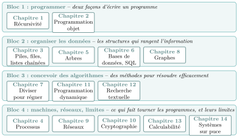
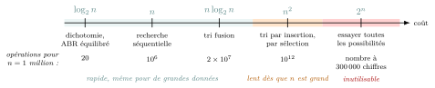

# Panorama de l'année

Les quatorze chapitres de l’année ne sont pas indépendants : les mêmes outils (la récursivité, la pile, la file…) reviennent d’un chapitre à l’autre, et une même question — **« combien ça coûte ? »** — traverse toute l’année. Cette fiche donne une vue d’ensemble, à relire à chaque nouveau chapitre : elle aide à prendre du **recul** pour l’écrit comme pour le Grand Oral.

### Le plan de l’année en quatre blocs

Le programme se partage en quatre grands blocs. Dans chaque bande, on lit les chapitres du bloc ; leur **numéro** indique l’ordre dans lequel on les étudie au fil de l’année.

{ .tikz loading=lazy }

L’année ne parcourt pas les blocs l’un après l’autre : elle **alterne**. Après les outils de base (chapitres 1 à 3), on découvre la **machine** dès l’automne (processus), puis de nouvelles structures et méthodes ; viennent ensuite le **réseau** et sa sécurité, juste après les graphes dont ils ont besoin, de nouveaux **algorithmes** au printemps, et l’on termine par les **limites** de l’informatique et les systèmes sur puce.

### Le fil rouge : le coût d’un algorithme

Depuis la Première, on ne se demande pas seulement « est-ce que ça marche ? » mais aussi « **combien d’opérations** cela demande-t-il quand les données sont nombreuses ? ». On range les algorithmes sur une **échelle de coût** ($n$ désigne la taille des données) :

{ .tikz loading=lazy }

Toute l’année, on cherche à **descendre cette échelle**, ou à contourner le problème quand c’est impossible. Chaque grande méthode correspond à une stratégie :

<table>
<thead>
<tr>
<th style="text-align: left;"><strong>Stratégie</strong></th>
<th style="text-align: left;"><strong>L’idée</strong></th>
<th style="text-align: left;"><strong>Chapitre</strong></th>
</tr>
</thead>
<tbody>
<tr>
<td style="text-align: left;">Bien ranger les données</td>
<td style="text-align: left;">Avec des données organisées (triées, ou dans un arbre binaire de recherche), on élimine la moitié des candidats à chaque étape : on passe de <em>n</em> à log2<em>n</em>.</td>
<td style="text-align: left;">5 Arbres 
(dichotomie : 1re)</td>
</tr>
<tr>
<td style="text-align: left;">Diviser pour régner</td>
<td style="text-align: left;">Couper le problème en deux, résoudre chaque moitié, recombiner : le tri fusion passe de <em>n</em>2 à <em>n</em>log2<em>n</em>.</td>
<td style="text-align: left;">7 Diviser pour régner</td>
</tr>
<tr>
<td style="text-align: left;">Ne jamais recalculer</td>
<td style="text-align: left;">Mémoriser les résultats des sous-problèmes : on <strong>échange du temps contre de la mémoire</strong>.</td>
<td style="text-align: left;">11 Programmation dynamique</td>
</tr>
<tr>
<td style="text-align: left;">Renoncer à l’optimum</td>
<td style="text-align: left;">Quand la solution exacte est hors de portée (voyageur de commerce : essayer tous les trajets), un algorithme <strong>glouton</strong> donne vite une solution, pas toujours la meilleure.</td>
<td style="text-align: left;">glouton : 1re 
(comparé en 11)</td>
</tr>
<tr>
<td style="text-align: left;">Faire du coût un bouclier</td>
<td style="text-align: left;">Le chiffrement <strong>RSA</strong> est sûr parce que <strong>factoriser</strong> un très grand nombre coûte trop cher avec les méthodes connues.</td>
<td style="text-align: left;">10 Cryptographie</td>
</tr>
</tbody>
</table>

!!! remarque "Remarque"

    Le $\log_2 n$ n’est qu’un **outil de comptage** : c’est le nombre de fois où l’on peut couper $n$ en deux avant d’arriver à $1$ (à peu près le nombre de bits de $n$, vu en Première). Pour un million de données, $\log_2 n \approx 20$.

### Chapitre par chapitre

Pour chaque chapitre : ce qu’il **réutilise**, et où il **resservira**. Les notions de Première sont signalées par « 1re ».

| **Chapitre** | **S’appuie sur…** | **Resservira dans…** |
|:---|:---|:---|
| 1 Récursivité | fonctions (1re) | arbres, diviser pour régner, parcours en profondeur, programmation dynamique |
| 2 Programmation objet | types construits (1re) | toutes les structures : classes `Pile`, `File`, `Arbre`, `Graphe` |
| 3 Piles, files, listes chaînées | programmation objet, récursivité | parcours d’arbres et de graphes ; file des processus prêts |
| 4 Processus | files ; arborescence de fichiers, modèle de von Neumann (1re) | arbres (l’arbre des processus) ; graphes (le cycle d’un interblocage) ; systèmes sur puce |
| 5 Arbres | récursivité, programmation objet, piles et files ; dichotomie (1re) | index des bases de données ; graphes (un arbre est un graphe particulier) |
| 6 Bases de données, SQL | données en table (1re) ; arbres (les index) | projets (site web adossé à une base) ; Grand Oral (données, vie privée) |
| 7 Diviser pour régner | récursivité ; dichotomie, tris (1re) | programmation dynamique (même découpage, sans recalcul) |
| 8 Graphes | piles et files, récursivité, programmation objet, arbres ; graphe d’attente (processus) | routage (réseaux) ; GPS |
| 9 Réseaux | graphes pondérés (Dijkstra) ; Internet, paquets (1re) | cryptographie (sécuriser ce qui circule) |
| 10 Cryptographie | réseaux ; coût (factorisation) | HTTPS, signature, sécurité des échanges |
| 11 Programmation dynamique | récursivité, diviser pour régner ; glouton (1re) | problèmes d’optimisation (rendu de monnaie, sac à dos) |
| 12 Recherche textuelle | chaînes, boucles, coût (1re) | moteurs de recherche, traitement de texte, ADN |
| 13 Calculabilité | un programme est une donnée (1re) | limites de tout programme (un antivirus parfait est impossible) |
| 14 Systèmes sur puce | modèle de von Neumann (1re) ; processus | synthèse : le téléphone, un ordinateur complet sur une puce |

!!! remarque "Remarque"

    Pour le **Grand Oral**, ces liens sont précieux : une bonne question en croise souvent *deux* (« Comment fonctionne un GPS ? » $=$ graphes $+$ coût). Voir la fiche *Grand Oral NSI*.
