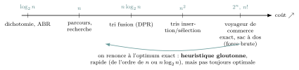
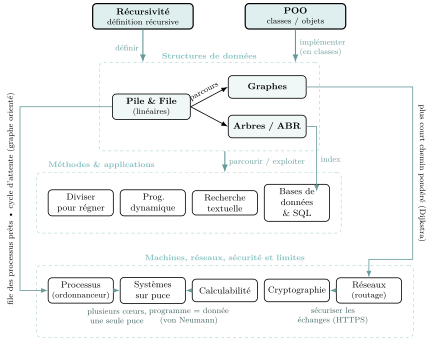

# Panorama de l'année

Le programme n’est pas une liste de chapitres indépendants : c’est un **réseau**. Une même structure (la pile, la file) resurgit d’un chapitre à l’autre ; une même question — **« combien ça coûte ? »** — traverse toute l’année. Cette fiche relie les morceaux : gardez-la sous les yeux, elle vous fera gagner en **recul** pour l’écrit *et* le Grand Oral.

### Le fil rouge : le coût d’un algorithme

Depuis la Première, on ne se demande pas seulement « est-ce que ça marche ? » mais « **combien de temps** (ou de mémoire) cela demande-t-il quand les données sont nombreuses ? ». Tout l’enjeu de la Terminale est d’apprendre à **faire baisser ce coût**.

{ .tikz loading=lazy }

!!! encadre "Les deux victoires de l’année"

    On cherche sans cesse à **descendre cette échelle**. Deux sauts sont emblématiques :

    - de $n^2$ à $n\log_2 n$ : c’est le **tri fusion** (diviser pour régner) face aux tris quadratiques ;

    - de $n$ à $\log_2 n$ : c’est la **recherche dichotomique** et l’**arbre binaire de recherche** équilibré face à la recherche séquentielle.

    Le $\log_2 n$ n’est ici qu’un **outil de comptage** : le nombre de fois où l’on peut couper $n$ en deux (*aussi* le nombre de bits de $n$, vu en Première).

!!! remarque "Remarque"

    La **programmation dynamique** joue sur un autre tableau : elle échange du **temps** contre de la **mémoire** (« ne jamais recalculer deux fois »). Certains problèmes (voyageur de commerce) restent, eux, de coût **exponentiel** si l’on veut la solution exacte : c’est *précisément pour cela* qu’on se contente d’un algorithme **glouton**, qui ne coûte presque rien mais donne une solution seulement approchée. Le glouton n’est donc pas « en bout d’échelle » : c’est le raccourci rapide qu’on prend quand l’algorithme exact est hors de portée. Enfin, cette explosion peut devenir une **alliée** : la sécurité du chiffrement **RSA** (chapitre *Cryptographie*) repose sur le fait qu’on ne sait pas **factoriser** rapidement un très grand nombre — le coût des méthodes connues explose avec le nombre de chiffres.

### La carte des liens

Trois idées irriguent tout le programme. Suivez les flèches : ce qui est *en amont* sert à construire ce qui est *en aval*.

{ .tikz loading=lazy }

Deux **manières de programmer** (récursivité, POO) servent à *définir* et *implémenter* les **structures de données** ; **toutes** s’écrivent en classes (une classe `Pile`, `File`, `Arbre`, `Graphe`). On *parcourt* arbres et graphes avec une **pile** (profondeur) ou une **file** (largeur), pour bâtir les **méthodes et applications**. Les arbres servent d’**index** aux bases de données. Plus bas, la **machine** et le **réseau** : la file et les graphes orientés reviennent dans les **processus**, le **plus court chemin pondéré** dans le **routage** ; la cryptographie sécurise ce que le réseau transporte, et la calculabilité fixe les **limites** de tout programme.

!!! encadre "La correspondance à retenir absolument"

    Parcourir un arbre ou un graphe, c’est choisir un **récipient** pour les sommets en attente :

    - une **pile** (LIFO) $\Rightarrow$ parcours **en profondeur** (aussi obtenu par la *récursivité*, qui utilise la pile d’appels) ;

    - une **file** (FIFO) $\Rightarrow$ parcours **en largeur**.

    C’est le *même* mécanisme pour les arbres (chapitre Arbres) et pour les graphes (chapitre Graphes). Le **routage** sur Internet, lui, va plus loin qu’un simple parcours : il cherche un **plus court chemin pondéré** (le coût des liaisons), avec l’algorithme de **Dijkstra** pour OSPF (celui du projet du chapitre Graphes) ou une méthode de type **Bellman-Ford** pour RIP.

### Où chaque notion est réinvestie

| **Notion (chapitre d’origine)** | **Réinvestie dans…** |
|:---|:---|
| Récursivité | arbres, diviser pour régner, graphes, prog. dynamique |
| Pile & file (structures linéaires) | parcours d’arbres et de graphes (profondeur/largeur) ; file des processus prêts (ordonnancement) |
| POO (classes) | implémentation des arbres, des graphes, des piles/files |
| Coût d’un algorithme (1re) | tout le programme — surtout DPR ($n\log n$) et ABR ($\log n$) ; sécurité de RSA (factoriser coûte trop cher) |
| Dichotomie / bits d’un entier (1re) | ABR, diviser pour régner, le $\log_2 n$ comme comptage |
| Arbres (ABR) | index des bases de données (B-arbres), arbre des processus |
| Bases de données & SQL | chapitre assez autonome ; réinvesti dans les projets (site web adossé à une base) et le Grand Oral (données, vie privée) |
| Graphes (plus court chemin pondéré) | routage OSPF (Dijkstra) et RIP (réseaux), GPS |
| Graphes orientés (cycle) | interblocage : cycle dans le graphe d’attente (processus) |
| Rendu de monnaie (gloutons, 1re) | programmation dynamique (version optimale) |
| Processus (ordonnancement) | systèmes sur puce : l’OS d’un téléphone répartit ses processus sur les cœurs d’une même puce |
| Réseaux (paquets, routage) | cryptographie : chiffrer ce qui circule (HTTPS, échange de clé) |
| Cryptographie | sécurité des échanges sur Internet ; fil rouge du coût (RSA) |
| Programme $=$ donnée (calculabilité) | compilation, systèmes d’exploitation, sécurité (un antivirus parfait est impossible) |
| Modèle de von Neumann (1re) | processus (le processeur partagé), systèmes sur puce (CPU, mémoire, bus sur une seule puce) |

!!! remarque "Remarque"

    Pour le **Grand Oral**, ces liens sont de l’or : une bonne question en croise souvent *deux* (« le GPS » $=$ graphes $+$ coût). Voir la fiche *Grand Oral NSI*.
