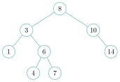

# Sujet 25 — Arbre binaire de recherche

!!! fichiers "Fichiers à télécharger"

    [:material-folder-open: dossier en ligne](https://github.com/MathThibaud/nsi-fichiers-eleves/tree/main/terminale/pratique-25-abr){ .md-button } [:material-zip-box: archive .zip](https://github.com/MathThibaud/nsi-fichiers-eleves/raw/main/zips/terminale-pratique-25-abr.zip){ .md-button }

??? corrige "Corrigé"

    !!! remarque "Remarque"

        On donne une version simple ; d’autres réponses sont possibles. Le fichier complet, `corrige_sujet_25.py`, est en ligne : [`github.com/MathThibaud/nsi-fichiers-eleves/tree/main/corriges/terminale/pratique-25`](https://github.com/MathThibaud/nsi-fichiers-eleves/tree/main/corriges/terminale/pratique-25).

    Question 1

    *Dessiner l’ABR obtenu par `construire_abr([8, 3, 10, 1, 6, 14, 4, 7])` et donner sa hauteur.*

    On insère chaque valeur en descendant depuis la racine, à gauche si elle est plus petite, à droite si elle est plus grande, jusqu’à une place vide :

    - `8` est la racine ; `3` va à gauche de `8` ; `10` à droite de `8` ;

    - `1` à gauche de `3` ; `6` à droite de `3` ; `14` à droite de `10` ;

    - `4` à gauche de `6` ; `7` à droite de `6`.

    { .tikz loading=lazy }

    La hauteur est `4` (chemin `8`, `3`, `6`, `4`) :

    ```console
    >>> hauteur(construire_abr([8, 3, 10, 1, 6, 14, 4, 7]))
    4
    ```

    $\blacktriangleright$ Appel professeur. refaire à voix haute l’insertion de deux valeurs (par exemple `4` puis `7`) et vérifier la propriété d’ABR en un nœud.

    Question 2

    *Écrire la fonction récursive `recherche(a, x)`.*

    Arbre vide : `x` est absente. Sinon on compare `x` à la racine et on ne descend que du côté où `x` peut se trouver.

    ```python
    def recherche(a, x):
        if a is None:
            return False
        if x == a.valeur:
            return True
        if x < a.valeur:
            return recherche(a.gauche, x)
        else:
            return recherche(a.droite, x)
    ```

    *Autre méthode :* comme on ne descend que d’un seul côté, une boucle suffit : on remplace l’arbre par le sous-arbre gauche ou droit jusqu’à trouver `x` ou tomber sur un arbre vide.

    ```python
    def recherche(a, x):
        while a is not None:
            if x == a.valeur:
                return True
            if x < a.valeur:
                a = a.gauche
            else:
                a = a.droite
        return False
    ```

    ```python
        assert recherche(a, 8)
        assert not recherche(a, 20)
    ```

    Question 3

    *Écrire `infixe(a)` puis `tri_abr(valeurs)`.*

    ```python
    def infixe(a):
        if a is None:
            return []
        return infixe(a.gauche) + [a.valeur] + infixe(a.droite)

    def tri_abr(valeurs):
        return infixe(construire_abr(valeurs))
    ```

    Dans un ABR, tout le sous-arbre gauche est plus petit que la racine, elle-même plus petite que tout le sous-arbre droit : le parcours infixe donne donc les valeurs **dans l’ordre croissant**. Les doublons disparaissent car `inserer` ne modifie pas l’arbre si la valeur est déjà présente.

    ```python
        assert infixe(None) == []
        assert tri_abr([]) == []
    ```

    $\blacktriangleright$ Appel professeur. expliquer pourquoi le parcours infixe d’un ABR est trié et d’où vient la suppression des doublons.

    Question 4

    *Exécuter `experience(200)` plusieurs fois, décrire les deux arbres et la conséquence sur le coût de `recherche`.*

    ```console
    >>> experience(200)
    insertion dans l'ordre croissant : 200
    insertion dans un ordre aléatoire : 15
    ```

    La première hauteur vaut toujours `200` ; la seconde change à chaque exécution mais reste petite (de l’ordre de 13 à 20).

    - Dans l’ordre croissant, chaque nouvelle valeur est plus grande que toutes les précédentes : elle va toujours à droite. L’arbre est un **peigne** (une « liste » de 200 nœuds, sans aucun fils gauche), de hauteur $n$.

    - Dans un ordre aléatoire, l’arbre est « touffu », proche d’un arbre équilibré, de hauteur de l’ordre de $\log_2(n)$ (à un facteur près ; $\log_2(200) \approx 7{,}6$).

    La recherche descend d’un niveau à chaque appel, donc fait au plus **hauteur** comparaisons : jusqu’à $200$ dans le peigne (autant qu’une recherche séquentielle dans une liste), une quinzaine dans l’arbre aléatoire. L’efficacité d’un ABR dépend donc de sa forme : il faut qu’il soit (à peu près) **équilibré**.

    $\blacktriangleright$ Appel professeur. décrire le peigne, relier le coût de la recherche à la hauteur, et conclure qu’insérer des données déjà triées est le pire cas.

*Durée de l’épreuve : 1 heure.*

!!! encadre "Déroulement de l’épreuve"

    - Cette situation d’évaluation comporte ce document ainsi que des fichiers de codes et de données présents sur l’ordinateur. Le candidat doit **agir en autonomie** et faire preuve d’initiative tout au long de l’épreuve.

    - En cas de difficulté, le candidat peut solliciter l’examinateur. Des moments privilégiés sont indiqués sous la forme d’**appels professeur**. L’examinateur peut intervenir à tout moment s’il le juge utile.

Un **arbre binaire de recherche** (ABR) est un arbre binaire dont les nœuds portent des valeurs comparables et tel que, pour **chaque** nœud, toutes les valeurs de son sous-arbre gauche sont **strictement plus petites** que sa valeur, et toutes celles de son sous-arbre droit **strictement plus grandes**. Un ABR ne contient donc pas deux fois la même valeur.

Dans le fichier `abr.py`, un nœud est un objet de la classe `Noeud` (attributs `valeur`, `gauche` et `droite`) et l’arbre vide est représenté par `None`. Le fichier fournit :

- la fonction récursive `inserer(a, x)` qui insère la valeur `x` à sa place dans l’ABR `a` et renvoie l’arbre obtenu (si `x` est déjà présente, rien ne change) ;

- la fonction `construire_abr(valeurs)` qui insère une à une, dans l’ordre, les valeurs d’une liste à partir d’un arbre vide ;

- la fonction `hauteur(a)` (la hauteur de l’arbre vide vaut `0`, celle d’un arbre réduit à un nœud vaut `1`).

Question 1

Dessiner sur papier l’ABR obtenu par `construire_abr([8, 3, 10, 1, 6, 14, 4, 7])`, et donner sa hauteur. Vérifier la hauteur à l’aide de la fonction `hauteur`.

**$\blacktriangleright$ Appel professeur.** Appeler le professeur pour lui présenter votre réponse ou en cas de difficulté.

Question 2

Écrire le corps de la fonction récursive `recherche(a, x)` qui renvoie `True` si `x` est une valeur de l’ABR `a` et `False` sinon. La fonction doit utiliser la propriété des ABR pour ne descendre que dans **un seul** des deux sous-arbres. Des tests sont fournis dans la fonction `test_recherche`.

Question 3

Écrire le corps de la fonction récursive `infixe(a)` qui renvoie la liste des valeurs de l’arbre `a` dans l’ordre du parcours infixe (sous-arbre gauche, puis racine, puis sous-arbre droit). En déduire le corps de la fonction `tri_abr(valeurs)` qui renvoie la liste des valeurs triée dans l’ordre croissant, sans doublon. Tester avec la fonction `test_tri`.

**$\blacktriangleright$ Appel professeur.** Appeler le professeur pour lui présenter votre réponse ou en cas de difficulté.

Question 4

La fonction fournie `experience(n)` construit deux ABR contenant les entiers de `1` à `n` : l’un en les insérant dans l’ordre croissant, l’autre dans un ordre aléatoire, et affiche leurs hauteurs. Exécuter `experience(200)` plusieurs fois, décrire la forme de chacun des deux arbres et expliquer la conséquence sur le coût de la fonction `recherche`.

**$\blacktriangleright$ Appel professeur.** Appeler le professeur pour lui présenter votre réponse ou en cas de difficulté.

### Description du dossier

Le dossier fourni au candidat comporte les éléments suivants :

- une version PDF de l’énoncé ;

- un code source de départ `abr.py`.

??? corrige "Corrigé"

    !!! remarque "Remarque"

        On donne une version simple ; d’autres réponses sont possibles. Le fichier complet, `corrige_sujet_25.py`, est en ligne : [`github.com/MathThibaud/nsi-fichiers-eleves/tree/main/corriges/terminale/pratique-25`](https://github.com/MathThibaud/nsi-fichiers-eleves/tree/main/corriges/terminale/pratique-25).

    Question 1

    *Dessiner l’ABR obtenu par `construire_abr([8, 3, 10, 1, 6, 14, 4, 7])` et donner sa hauteur.*

    On insère chaque valeur en descendant depuis la racine, à gauche si elle est plus petite, à droite si elle est plus grande, jusqu’à une place vide :

    - `8` est la racine ; `3` va à gauche de `8` ; `10` à droite de `8` ;

    - `1` à gauche de `3` ; `6` à droite de `3` ; `14` à droite de `10` ;

    - `4` à gauche de `6` ; `7` à droite de `6`.

    { .tikz loading=lazy }

    La hauteur est `4` (chemin `8`, `3`, `6`, `4`) :

    ```console
    >>> hauteur(construire_abr([8, 3, 10, 1, 6, 14, 4, 7]))
    4
    ```

    $\blacktriangleright$ Appel professeur. refaire à voix haute l’insertion de deux valeurs (par exemple `4` puis `7`) et vérifier la propriété d’ABR en un nœud.

    Question 2

    *Écrire la fonction récursive `recherche(a, x)`.*

    Arbre vide : `x` est absente. Sinon on compare `x` à la racine et on ne descend que du côté où `x` peut se trouver.

    ```python
    def recherche(a, x):
        if a is None:
            return False
        if x == a.valeur:
            return True
        if x < a.valeur:
            return recherche(a.gauche, x)
        else:
            return recherche(a.droite, x)
    ```

    *Autre méthode :* comme on ne descend que d’un seul côté, une boucle suffit : on remplace l’arbre par le sous-arbre gauche ou droit jusqu’à trouver `x` ou tomber sur un arbre vide.

    ```python
    def recherche(a, x):
        while a is not None:
            if x == a.valeur:
                return True
            if x < a.valeur:
                a = a.gauche
            else:
                a = a.droite
        return False
    ```

    ```python
        assert recherche(a, 8)
        assert not recherche(a, 20)
    ```

    Question 3

    *Écrire `infixe(a)` puis `tri_abr(valeurs)`.*

    ```python
    def infixe(a):
        if a is None:
            return []
        return infixe(a.gauche) + [a.valeur] + infixe(a.droite)

    def tri_abr(valeurs):
        return infixe(construire_abr(valeurs))
    ```

    Dans un ABR, tout le sous-arbre gauche est plus petit que la racine, elle-même plus petite que tout le sous-arbre droit : le parcours infixe donne donc les valeurs **dans l’ordre croissant**. Les doublons disparaissent car `inserer` ne modifie pas l’arbre si la valeur est déjà présente.

    ```python
        assert infixe(None) == []
        assert tri_abr([]) == []
    ```

    $\blacktriangleright$ Appel professeur. expliquer pourquoi le parcours infixe d’un ABR est trié et d’où vient la suppression des doublons.

    Question 4

    *Exécuter `experience(200)` plusieurs fois, décrire les deux arbres et la conséquence sur le coût de `recherche`.*

    ```console
    >>> experience(200)
    insertion dans l'ordre croissant : 200
    insertion dans un ordre aléatoire : 15
    ```

    La première hauteur vaut toujours `200` ; la seconde change à chaque exécution mais reste petite (de l’ordre de 13 à 20).

    - Dans l’ordre croissant, chaque nouvelle valeur est plus grande que toutes les précédentes : elle va toujours à droite. L’arbre est un **peigne** (une « liste » de 200 nœuds, sans aucun fils gauche), de hauteur $n$.

    - Dans un ordre aléatoire, l’arbre est « touffu », proche d’un arbre équilibré, de hauteur de l’ordre de $\log_2(n)$ (à un facteur près ; $\log_2(200) \approx 7{,}6$).

    La recherche descend d’un niveau à chaque appel, donc fait au plus **hauteur** comparaisons : jusqu’à $200$ dans le peigne (autant qu’une recherche séquentielle dans une liste), une quinzaine dans l’arbre aléatoire. L’efficacité d’un ABR dépend donc de sa forme : il faut qu’il soit (à peu près) **équilibré**.

    $\blacktriangleright$ Appel professeur. décrire le peigne, relier le coût de la recherche à la hauteur, et conclure qu’insérer des données déjà triées est le pire cas.
