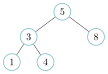
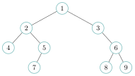

# Exercices

<p class="sous-titre">Problèmes de synthèse et exercices type bac</p>

!!! consignes "Mode d’emploi"

    - Chaque problème **croise** des notions de plusieurs chapitres, comme les exercices du bac, qui ne disent jamais « ceci est un exercice sur les piles ».

    - Sous chaque titre, la ligne Chapitres croisés indique ce qu’il faut avoir vu. Un problème peut être repris plus tard dans l’année, pour réviser.

    - Niveau : ★ échauffement, ★★ classique (niveau bac), ★★★ défi ; les *coups de pouce* et les *corrigés* se déplient sous chaque exercice.

    - <span class="run" title="À programmer et tester sur machine">▶</span> *À programmer et tester* en Python. Les classes `Pile`, `File`, `Cellule` et `Noeud` sont celles du cours.

    - Usage de l’IA, indiqué sur chaque exercice : <span class="ia ia-rouge" title="Sans IA : le but est l'automatisme lui-même"></span> aucune ; <span class="ia ia-orange" title="IA en appui : déboguer, reformuler, vérifier ; la réponse finale est la vôtre"></span> en appui (déboguer, reformuler, vérifier ; la réponse finale est écrite et comprise par vous) ; <span class="ia ia-vert" title="IA intégrée : l'exercice s'appuie sur une réponse d'IA"></span> l’exercice s’appuie sur une réponse d’IA. Voir la [charte d’usage de l’IA](../charte.md).

### Après les chapitres 1 à 3 (récursivité, programmation objet, structures linéaires)

### <span class="stars" title="Niveau 2 sur 3">★★</span> <span class="exo-num">Exercice 1</span> — Dérécursiver avec une pile <span class="ia ia-orange" title="IA en appui : déboguer, reformuler, vérifier ; la réponse finale est la vôtre"></span> { #ex-S-1 }

Chapitres croisés : *Récursivité ; Piles*

On considère la fonction récursive suivante, où `n` est un entier positif ou nul.

```python
def afficher_binaire(n):
    if n >= 2:
        afficher_binaire(n // 2)
    print(n % 2, end="")
```

1.  Dérouler l’appel `afficher_binaire(13)` : donner la liste des appels successifs, puis ce qui est affiché. Que représente l’affichage obtenu ?

2.  Dessiner la **pile d’appels** au moment où l’appel le plus profond s’exécute (sommet en haut). Expliquer pourquoi le chiffre affiché en premier est celui du dernier appel lancé.

3.  <span class="run" title="À programmer et tester sur machine">▶</span> Écrire une fonction **non récursive** `binaire(n)` qui renvoie l’écriture binaire de `n` sous forme de chaîne (par exemple `binaire(13)` renvoie `"1101"` et `binaire(0)` renvoie `"0"`). Elle utilisera une `Pile` pour jouer le rôle de la pile d’appels.

    ??? pouce "Coup de pouce"

        Deux boucles : la première calcule les restes `n % 2` et les range dans la pile ; la seconde les ressort pour construire la chaîne. Attention au cas `n = 0`, qui doit produire un chiffre.

4.  On remplace la `Pile` par une `File` (`enfiler` et `defiler` à la place de `empiler` et `depiler`). Que renvoie alors l’appel pour `n = 13` ? Expliquer.

??? corrige "Corrigé"

    !!! remarque "Remarque"

        On donne une version testée de chaque fonction ; d’autres écritures correctes sont possibles. Le fichier complet, `corrige_synthese_terminale.py`, est en ligne : [`github.com/MathThibaud/nsi-fichiers-eleves/tree/main/corriges/terminale/synthese`](https://github.com/MathThibaud/nsi-fichiers-eleves/tree/main/corriges/terminale/synthese).

    **1.** Appels successifs : `afficher_binaire(13)` $\to$ `(6)` $\to$ `(3)` $\to$ `(1)`. L’appel `(1)` ne relance rien ($1 < 2$) et affiche `1` ; puis, en remontant, `(3)` affiche `1`, `(6)` affiche `0` et `(13)` affiche `1`. Affichage : `1101`, l’écriture **binaire** de $13$ ($8 + 4 + 1$).

    **2.** Au moment de l’appel le plus profond, la pile contient, du sommet vers le bas : `afficher_binaire(1)`, `(3)`, `(6)`, `(13)`. Chaque appel affiche son chiffre **après** le retour de l’appel qu’il a lancé : les affichages se font donc dans l’ordre où les appels quittent la pile, c’est-à-dire du dernier lancé au premier (LIFO). Or le dernier appel porte le chiffre de **poids fort** : on obtient les chiffres dans le bon ordre, alors que les divisions par $2$ les calculent du poids faible au poids fort.

    **3.**

    ```python
    def binaire(n):
        p = Pile()
        p.empiler(n % 2)
        n = n // 2
        while n > 0:
            p.empiler(n % 2)
            n = n // 2
        resultat = ""
        while not p.est_vide():
            resultat = resultat + str(p.depiler())
        return resultat
    ```

    Le premier reste est empilé avant la boucle : ainsi `binaire(0)` renvoie bien `"0"`. La pile remplace la pile d’appels : elle garde les chiffres « en attente » et les rend dans l’ordre inverse.

    **4.** Avec une file, les chiffres ressortent dans l’ordre où ils ont été calculés (FIFO), du poids faible au poids fort : on obtient `"1011"`, l’écriture binaire **à l’envers**. C’est précisément le caractère LIFO de la pile qui remet les chiffres dans l’ordre.

### <span class="stars" title="Niveau 2 sur 3">★★</span> <span class="exo-num">Exercice 2</span> — Annuler et rétablir <span class="ia ia-orange" title="IA en appui : déboguer, reformuler, vérifier ; la réponse finale est la vôtre"></span> { #ex-S-2 }

Chapitres croisés : *Programmation objet ; Piles*

Un éditeur de texte très simple garde le texte saisi dans un attribut `texte` (une chaîne). Il propose deux boutons : **Annuler**, qui revient au texte d’avant la dernière modification, et **Rétablir**, qui refait une modification qu’on vient d’annuler. Pour cela, l’objet possède deux piles : `annulations` contient les textes précédents, `retablissements` les textes annulés.

```python
class Editeur:
    def __init__(self):
        ...

    def ecrire(self, mot):
        """ajoute mot a la fin du texte"""
        ...

    def annuler(self):
        """revient au texte precedent (sans effet s'il n'y en a pas)"""
        ...

    def retablir(self):
        """refait la derniere modification annulee (sans effet sinon)"""
        ...
```

1.  <span class="run" title="À programmer et tester sur machine">▶</span> Écrire la méthode `__init__` : le texte est vide au départ et les deux piles aussi.

2.  On exécute les instructions ci-dessous. Donner, après chacune, la valeur de `e.texte` et le contenu des deux piles (dessinées verticalement, sommet en haut).

    ```python
    e = Editeur()
    e.ecrire("Bon")
    e.ecrire("jour")
    e.annuler()
    e.retablir()
    e.annuler()
    e.ecrire("soir")
    ```

3.  <span class="run" title="À programmer et tester sur machine">▶</span> Écrire les méthodes `ecrire`, `annuler` et `retablir`, en accord avec le déroulé de la question 2.

    ??? pouce "Coup de pouce"

        Avant de modifier le texte, on sauvegarde l’ancien dans la pile qui permettra d’y revenir. Annuler et rétablir sont symétriques : chacune sauvegarde le texte courant dans l’autre pile.

4.  Après la dernière instruction de la question 2, un appel à `e.retablir()` ne doit rien changer. Pourquoi ce choix est-il raisonnable, et quelle ligne de votre méthode `ecrire` le garantit-elle ?

??? corrige "Corrigé"

    **1.**

    ```python
        def __init__(self):
            self.texte = ""
            self.annulations = Pile()
            self.retablissements = Pile()
    ```

    **2.** Les piles sont dessinées verticalement, **sommet en haut**.

    <table>
    <thead>
    <tr>
    <th style="text-align: left;"><strong>Instruction</strong></th>
    <th style="text-align: left;"><code>e.texte</code></th>
    <th style="text-align: center;"><code>annulations</code></th>
    <th style="text-align: center;"><code>retablissements</code></th>
    </tr>
    </thead>
    <tbody>
    <tr>
    <td style="text-align: left;"><code>Editeur()</code></td>
    <td style="text-align: left;"><code>""</code></td>
    <td style="text-align: center;">vide</td>
    <td style="text-align: center;">vide</td>
    </tr>
    <tr>
    <td style="text-align: left;"><code>ecrire("Bon")</code></td>
    <td style="text-align: left;"><code>"Bon"</code></td>
    <td style="text-align: center;"><table>
    <thead>
    <tr>
    <th style="text-align: center;"><code>""</code></th>
    </tr>
    </thead>
    <tbody>
    </tbody>
    </table></td>
    <td style="text-align: center;">vide</td>
    </tr>
    <tr>
    <td style="text-align: left;"><code>ecrire("jour")</code></td>
    <td style="text-align: left;"><code>"Bonjour"</code></td>
    <td style="text-align: center;"><table>
    <thead>
    <tr>
    <th style="text-align: center;"><code>"Bon"</code></th>
    </tr>
    </thead>
    <tbody>
    <tr>
    <td style="text-align: center;"><code>""</code></td>
    </tr>
    </tbody>
    </table></td>
    <td style="text-align: center;">vide</td>
    </tr>
    <tr>
    <td style="text-align: left;"><code>annuler()</code></td>
    <td style="text-align: left;"><code>"Bon"</code></td>
    <td style="text-align: center;"><table>
    <thead>
    <tr>
    <th style="text-align: center;"><code>""</code></th>
    </tr>
    </thead>
    <tbody>
    </tbody>
    </table></td>
    <td style="text-align: center;"><table>
    <thead>
    <tr>
    <th style="text-align: center;"><code>"Bonjour"</code></th>
    </tr>
    </thead>
    <tbody>
    </tbody>
    </table></td>
    </tr>
    <tr>
    <td style="text-align: left;"><code>retablir()</code></td>
    <td style="text-align: left;"><code>"Bonjour"</code></td>
    <td style="text-align: center;"><table>
    <thead>
    <tr>
    <th style="text-align: center;"><code>"Bon"</code></th>
    </tr>
    </thead>
    <tbody>
    <tr>
    <td style="text-align: center;"><code>""</code></td>
    </tr>
    </tbody>
    </table></td>
    <td style="text-align: center;">vide</td>
    </tr>
    <tr>
    <td style="text-align: left;"><code>annuler()</code></td>
    <td style="text-align: left;"><code>"Bon"</code></td>
    <td style="text-align: center;"><table>
    <thead>
    <tr>
    <th style="text-align: center;"><code>""</code></th>
    </tr>
    </thead>
    <tbody>
    </tbody>
    </table></td>
    <td style="text-align: center;"><table>
    <thead>
    <tr>
    <th style="text-align: center;"><code>"Bonjour"</code></th>
    </tr>
    </thead>
    <tbody>
    </tbody>
    </table></td>
    </tr>
    <tr>
    <td style="text-align: left;"><code>ecrire("soir")</code></td>
    <td style="text-align: left;"><code>"Bonsoir"</code></td>
    <td style="text-align: center;"><table>
    <thead>
    <tr>
    <th style="text-align: center;"><code>"Bon"</code></th>
    </tr>
    </thead>
    <tbody>
    <tr>
    <td style="text-align: center;"><code>""</code></td>
    </tr>
    </tbody>
    </table></td>
    <td style="text-align: center;">vide</td>
    </tr>
    </tbody>
    </table>

    **3.**

    ```python
        def ecrire(self, mot):
            self.annulations.empiler(self.texte)
            self.texte = self.texte + mot
            self.retablissements = Pile()

        def annuler(self):
            if not self.annulations.est_vide():
                self.retablissements.empiler(self.texte)
                self.texte = self.annulations.depiler()

        def retablir(self):
            if not self.retablissements.est_vide():
                self.annulations.empiler(self.texte)
                self.texte = self.retablissements.depiler()
    ```

    **4.** Après `ecrire("soir")`, le texte annulé (`"Bonjour"`) appartient à une « histoire » abandonnée : le rétablir effacerait sans prévenir ce qu’on vient d’écrire. Tous les éditeurs se comportent ainsi. C’est la ligne `self.retablissements = Pile()` de `ecrire` qui vide la pile des rétablissements à chaque nouvelle saisie.

### <span class="stars" title="Niveau 3 sur 3">★★★</span> <span class="exo-num">Exercice 3</span> — Listes chaînées récursives <span class="ia ia-orange" title="IA en appui : déboguer, reformuler, vérifier ; la réponse finale est la vôtre"></span> { #ex-S-3 }

Chapitres croisés : *Programmation objet ; Listes chaînées ; Récursivité*

On rappelle la classe `Cellule` du cours : une liste chaînée est soit `None` (liste vide), soit une cellule dont l’attribut `suivante` est elle-même une liste chaînée. C’est une **définition récursive**, qui appelle naturellement des fonctions récursives.

```python
class Cellule:
    def __init__(self, v, s):
        self.valeur = v
        self.suivante = s

lst = Cellule(3, Cellule(1, Cellule(4, None)))
```

1.  Représenter `lst` par un schéma de cellules reliées par des flèches.

2.  <span class="run" title="À programmer et tester sur machine">▶</span> Écrire les fonctions récursives `longueur(lst)` et `somme(lst)`, qui renvoient le nombre d’éléments et leur somme ($0$ pour une liste vide).

3.  <span class="run" title="À programmer et tester sur machine">▶</span> Écrire la fonction récursive `contient(lst, x)`, qui renvoie `True` si `x` est dans la liste et `False` sinon. Pourquoi peut-elle s’arrêter avant la fin de la liste ?

4.  <span class="run" title="À programmer et tester sur machine">▶</span> On veut une fonction `renverser(lst)` qui renvoie une **nouvelle** liste chaînée contenant les mêmes valeurs dans l’ordre inverse, sans modifier `lst`. Écrire une fonction récursive `renverser_dans(lst, acc)`, où `acc` est la liste déjà renversée, puis en déduire `renverser`.

    ??? pouce "Coup de pouce"

        Penser à une pile d’assiettes : on prend la première cellule de `lst` et on la pose *en tête* de `acc` (une nouvelle cellule), puis on continue avec le reste. Que vaut `acc` au tout premier appel ?

5.  Ajouter une cellule **en tête** coûte une seule opération. Combien d’opérations faut-il pour ajouter une cellule **en queue** d’une liste de $n$ cellules ? Comparer avec les opérations d’une pile.

??? corrige "Corrigé"

    **1.** `3` \| $\bullet$$\to$`1` \| $\bullet$$\to$`4` \| $\bullet$$\to$`None`

    **2.** On suit la définition récursive : liste vide, ou une cellule suivie d’une liste.

    ```python
    def longueur(lst):
        if lst is None:
            return 0
        return 1 + longueur(lst.suivante)

    def somme(lst):
        if lst is None:
            return 0
        return lst.valeur + somme(lst.suivante)
    ```

    **3.**

    ```python
    def contient(lst, x):
        if lst is None:
            return False
        if lst.valeur == x:
            return True
        return contient(lst.suivante, x)
    ```

    Dès que `x` est trouvé, la fonction renvoie `True` sans faire d’appel récursif : inutile de regarder la suite.

    **4.**

    ```python
    def renverser_dans(lst, acc):
        if lst is None:
            return acc
        return renverser_dans(lst.suivante, Cellule(lst.valeur, acc))

    def renverser(lst):
        return renverser_dans(lst, None)
    ```

    Pour `lst` $= 3 \to 1 \to 4$ : `acc` vaut successivement `None`, puis $3$, puis $1 \to 3$, puis $4 \to 1 \to 3$. On crée de nouvelles cellules : `lst` n’est pas modifiée.

    *Autre méthode :* la même idée avec une boucle : on parcourt `lst` et on pose chaque valeur *en tête* du résultat, qui joue le rôle de `acc`.

    ```python
    def renverser_iteratif(lst):
        resultat = None
        while lst is not None:
            resultat = Cellule(lst.valeur, resultat)
            lst = lst.suivante
        return resultat
    ```

    **5.** Pour ajouter en queue, il faut d’abord atteindre la dernière cellule en suivant les $n$ liens : environ $n$ opérations (coût **linéaire**), contre une seule en tête. C’est pourquoi une liste chaînée fait une excellente **pile** (on empile et dépile en tête, en une opération), mais une file médiocre si l’on ne garde pas aussi un accès direct à la dernière cellule.

### Après le chapitre 5 (arbres)

### <span class="stars" title="Niveau 3 sur 3">★★★</span> <span class="exo-num">Exercice 4</span> — Trier avec un arbre binaire de recherche <span class="ia ia-orange" title="IA en appui : déboguer, reformuler, vérifier ; la réponse finale est la vôtre"></span> { #ex-S-4 }

Chapitres croisés : *Arbres ; Récursivité ; coût des algorithmes*

On dispose de la fonction `insere` du cours, qui insère `x` dans l’ABR `a` et renvoie l’arbre obtenu (une valeur déjà présente n’est pas ajoutée une seconde fois).

```python
def insere(a, x):
    if a is None:
        return Noeud(x)
    if x < a.valeur:
        a.gauche = insere(a.gauche, x)
    elif x > a.valeur:
        a.droite = insere(a.droite, x)
    return a
```

1.  Dessiner l’ABR obtenu en insérant successivement $5, 3, 8, 1, 4$ dans un arbre vide.

2.  <span class="run" title="À programmer et tester sur machine">▶</span> Écrire une fonction récursive `infixe_dans(a, resultat)` qui ajoute à la fin de la liste Python `resultat` les valeurs de `a` dans l’ordre du parcours **infixe**. Que contient `resultat` pour l’arbre de la question 1 ?

3.  <span class="run" title="À programmer et tester sur machine">▶</span> En déduire une fonction `tri_abr(tab)` qui renvoie une liste contenant les valeurs de `tab` triées dans l’ordre croissant.

4.  Que renvoie `tri_abr([3, 1, 3])` ? Proposer une modification de `insere` pour que ce tri conserve les doublons.

5.  On trie le tableau `[1, 2, 3, …, 100]`, déjà trié. Quelle est la hauteur de l’arbre construit ? Combien de comparaisons coûte l’insertion du dernier élément ? En déduire l’ordre de grandeur du coût du tri dans ce cas, et le comparer au cas d’un tableau mélangé, pour lequel la hauteur reste de l’ordre de $\log_2(n)$ (dans un essai avec $100$ valeurs mélangées, l’arbre avait une hauteur de $12$).

    ??? pouce "Coup de pouce"

        Insérer une valeur parcourt un seul chemin de la racine vers le bas : son coût est au plus la hauteur. Ici, chaque nouvelle valeur est plus grande que toutes les autres : où va-t-elle ?

6.  Avec un tableau trié de $10\,000$ valeurs, Python déclenche une `RecursionError`. Expliquer pourquoi, en lien avec la question précédente.

??? corrige "Corrigé"

    **1.** Racine $5$ ; à gauche $3$ (avec $1$ à sa gauche et $4$ à sa droite) ; à droite $8$.

    { .tikz loading=lazy }

    **2.**

    ```python
    def infixe_dans(a, resultat):
        if a is not None:
            infixe_dans(a.gauche, resultat)
            resultat.append(a.valeur)
            infixe_dans(a.droite, resultat)
    ```

    Pour l’arbre de la question 1, `resultat` contient `[1, 3, 4, 5, 8]` : le parcours infixe d’un ABR donne les valeurs **triées**.

    **3.**

    ```python
    def tri_abr(tab):
        a = None
        for x in tab:
            a = insere(a, x)
        resultat = []
        infixe_dans(a, resultat)
        return resultat
    ```

    **4.** `tri_abr([3, 1, 3])` renvoie `[1, 3]` : le second `3` n’est pas inséré, car `insere` ne fait rien quand `x == a.valeur`. Pour garder les doublons, on envoie les valeurs égales d’un côté choisi, par exemple à droite : on remplace `elif x > a.valeur:` par `else:`. On obtient alors `[1, 3, 3]`.

    **5.** Chaque valeur est plus grande que toutes les précédentes : elle va toujours à droite. L’arbre est un « peigne » de hauteur $100$, en réalité une liste chaînée. L’insertion du dernier élément compare $100$ à $99$ valeurs. Au total, $0 + 1 + \dots + 99 = 4\,950$ comparaisons, soit environ $n^2/2$ : coût **quadratique**, comme un tri par insertion. Pour un tableau mélangé, chaque insertion coûte au plus une douzaine de comparaisons ici, de l’ordre de $\log_2(n)$ : environ $n\log_2(n)$ au total, comme le tri fusion.

    **6.** `insere` s’appelle récursivement une fois par niveau traversé : avec $10\,000$ valeurs triées, l’arbre a une hauteur de $10\,000$, donc il faut $10\,000$ appels emboîtés. Cela dépasse la limite de la pile d’appels de Python (environ $1\,000$ par défaut) : `RecursionError`. La forme de l’arbre a donc un coût en temps *et* en mémoire.

### <span class="stars" title="Niveau 2 sur 3">★★</span> <span class="exo-num">Exercice 5</span> — La largeur d’un arbre <span class="ia ia-orange" title="IA en appui : déboguer, reformuler, vérifier ; la réponse finale est la vôtre"></span> { #ex-S-5 }

Chapitres croisés : *Arbres ; Files ; dictionnaires*

On appelle **niveau** d’un nœud le nombre de nœuds sur le chemin qui va de la racine jusqu’à lui (la racine est au niveau $1$). La **largeur** d’un arbre est le plus grand nombre de nœuds situés sur un même niveau.

{ .tikz loading=lazy }

1.  Pour l’arbre ci-dessus, donner le nombre de nœuds de chaque niveau, puis sa largeur.

2.  <span class="run" title="À programmer et tester sur machine">▶</span> Écrire une fonction `noeuds_par_niveau(a)` qui renvoie un dictionnaire associant à chaque niveau son nombre de nœuds (pour l’arbre ci-dessus : `{1: 1, 2: 2, 3: 3, 4: 3}`). Elle s’inspirera du parcours en largeur du cours, en enfilant des couples `(noeud, niveau)`.

    ??? pouce "Coup de pouce"

        Quand on défile un couple `(n, niveau)`, ses enfants sont au niveau `niveau + 1`. Le dictionnaire se remplit comme un compteur d’occurrences.

3.  <span class="run" title="À programmer et tester sur machine">▶</span> En déduire une fonction `largeur_max(a)`.

4.  On remplace la `File` par une `Pile`. Le dictionnaire obtenu est-il différent ? L’ordre dans lequel les nœuds sont visités l’est-il ? Justifier.

??? corrige "Corrigé"

    **1.** Niveau $1$ : $1$ nœud ($1$) ; niveau $2$ : $2$ ($2$, $3$) ; niveau $3$ : $3$ ($4$, $5$, $6$) ; niveau $4$ : $3$ ($7$, $8$, $9$). Largeur : $\mathbf{3}$.

    **2.**

    ```python
    def noeuds_par_niveau(a):
        compte = {}
        if a is None:
            return compte
        f = File()
        f.enfiler((a, 1))
        while not f.est_vide():
            n, niveau = f.defiler()
            if niveau in compte:
                compte[niveau] = compte[niveau] + 1
            else:
                compte[niveau] = 1
            if n.gauche is not None:
                f.enfiler((n.gauche, niveau + 1))
            if n.droite is not None:
                f.enfiler((n.droite, niveau + 1))
        return compte
    ```

    **3.**

    ```python
    def largeur_max(a):
        compte = noeuds_par_niveau(a)
        maxi = 0
        for niveau in compte:
            if compte[niveau] > maxi:
                maxi = compte[niveau]
        return maxi
    ```

    Pour l’arbre vide, le dictionnaire est vide et la fonction renvoie $0$.

    **4.** Le dictionnaire est le **même** : chaque nœud est visité une fois, avec son niveau, quelle que soit la structure utilisée. Seul l’**ordre de visite** change : avec une file, on visite niveau par niveau (largeur) ; avec une pile, on s’enfonce d’abord dans une branche (profondeur). Ici, l’ordre ne compte pas, car on se contente de compter.
